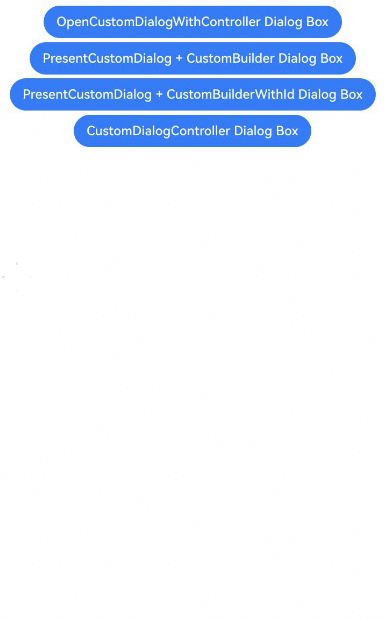

# Dialog Controller
<!--Kit: ArkUI-->
<!--Subsystem: ArkUI-->
<!--Owner: @houguobiao-->
<!--Designer: @houguobiao-->
<!--Tester: @lxl007-->
<!--Adviser: @Brilliantry_Rui-->
The dialog controller in ArkUI provides the capability to operate on a bound dialog box. Currently, it supports the close functionality. You can pass the controller into the dialog box content area to perform operations.

Bind the [DialogController](../reference/apis-arkui/js-apis-promptAction.md#dialogcontroller18) using the **controller** parameter, available since API version 18.

## Constraints

Currently, the [openCustomDialogWithController](../reference/apis-arkui/arkts-apis-uicontext-promptaction.md#opencustomdialogwithcontroller18) and [presentCustomDialog](../reference/apis-arkui/arkts-apis-uicontext-promptaction.md#presentcustomdialog18)) APIs support binding dialog controllers through the **controller** parameter. The [getDialogController](../reference/apis-arkui/arkui-ts/ts-custom-component-api.md#getdialogcontroller18) API can obtain the dialog controller for the custom component where the dialog box is located.

> **NOTE**
> 
> A dialog controller can be bound to only one dialog box, and operations only affect that dialog box.
> When [getDialogController](../reference/apis-arkui/arkui-ts/ts-custom-component-api.md#getdialogcontroller18) is used to obtain the dialog controller, if the current custom component is not displayed in a dialog box, the result will be **undefined**.

## Creating a Dialog Box Controller with ComponentContent as Custom Content

> **NOTE**
> 
> For details about the variables, see [Example](#example).

1. Initialize a parameter class for the custom dialog box content area, which includes the dialog controller.

   <!-- @[dialog_params](https://gitcode.com/openharmony/applications_app_samples/blob/master/code/DocsSample/ArkUISample/DialogProject/entry/src/main/ets/pages/customdialog/dialogcontroller/DialogController.ets) -->
   
   ``` TypeScript
   class Params {
     public text: string = '';
     public dialogController: promptAction.CommonController = new promptAction.DialogController();
   
     constructor(text: string, dialogController: promptAction.CommonController) {
       this.text = text;
       this.dialogController = dialogController;
     }
   }
   ```

2. Initialize a custom dialog box content area that includes a button, which closes the dialog box using the dialog controller provided by the custom component.

   <!-- @[dialog_my_component](https://gitcode.com/openharmony/applications_app_samples/blob/master/code/DocsSample/ArkUISample/DialogProject/entry/src/main/ets/pages/customdialog/dialogcontroller/DialogController.ets) --> 
   
   ``` TypeScript
   @Component
   struct MyComponent {
     build() {
       Column({ space: 5 }) {
         Button('Close Dialog(Built-in Controller)')
           .onClick(() => {
             let dialogController: promptAction.DialogController = this.getDialogController();
             if (dialogController !== undefined) {
               dialogController.close();
             }
           })
       }
     }
   }
   ```
   
3. Initialize another custom dialog box content area that includes a **Text** component and a button, which closes the dialog box using the externally passed dialog controller. This content area also includes the previous custom dialog box content area.

   <!-- @[build_text](https://gitcode.com/openharmony/applications_app_samples/blob/master/code/DocsSample/ArkUISample/DialogProject/entry/src/main/ets/pages/customdialog/dialogcontroller/DialogController.ets) -->
   
   ``` TypeScript
   @Builder
   function buildText(params: Params) {
     Column({ space: 5 }) {
       Text(params.text)
         .fontSize(30)
       if (params.dialogController !== undefined) {
         Button('Close Dialog(External Controller)')
           .onClick(() => {
             params.dialogController.close();
           })
       }
       MyComponent()
     }
     .width(300)
     .height(200)
     .backgroundColor('#FFF0F0F0')
   }
   ```
      
4. Initialize a dialog controller and create a dialog box content entity object by setting the **controller** parameter. Finally, obtain a [PromptAction](../reference/apis-arkui/arkts-apis-uicontext-promptaction.md) object through the [getPromptAction](../reference/apis-arkui/arkts-apis-uicontext-uicontext.md#getpromptaction) API of [UIContext](../reference/apis-arkui/arkts-apis-uicontext-uicontext.md), and call the [openCustomDialogWithController](../reference/apis-arkui/arkts-apis-uicontext-promptaction.md#opencustomdialogwithcontroller18) API with the initialized content entity object and **controller** parameter to create the dialog box.

   <!-- @[content_node](https://gitcode.com/openharmony/applications_app_samples/blob/master/code/DocsSample/ArkUISample/DialogProject/entry/src/main/ets/pages/customdialog/dialogcontroller/DialogController.ets) -->
   
   ``` TypeScript
   let dialogController: promptAction.CommonController = new promptAction.DialogController();
   let contentNode: ComponentContent<Object> =
     new ComponentContent(this.getUIContext(), wrapBuilder(buildText),
       new Params(this.message, dialogController));
   this.getUIContext().getPromptAction().openCustomDialogWithController(
     contentNode, dialogController, this.baseDialogOptions).catch((err: BusinessError) => {
     hilog.error(0x0000, 'dialogController',
       'openCustomDialogWithController error: ' + err.code + ' ' + err.message);
   });
   ```
   
## Creating a Dialog Box Controller with CustomBuilder as Custom Content

> **NOTE**
> 
> For details about the variables, see [Example](#example).

1. Initialize a custom dialog box content area that includes a **Text** component and a button, which closes the dialog box using the externally passed dialog controller.

   <!-- @[dialog_component](https://gitcode.com/openharmony/applications_app_samples/blob/master/code/DocsSample/ArkUISample/DialogProject/entry/src/main/ets/pages/customdialog/dialogcontroller/DialogController.ets) -->
   
   ``` TypeScript
   @Builder
   customDialogComponent(dialogController: promptAction.DialogController) {
     Column({ space: 5 }) {
       Text(this.message)
         .fontSize(30)
       if (dialogController !== undefined) {
         Button('Close Dialog(External Controller)')
           .onClick(() => {
             dialogController.close();
           })
       }
     }
     .height(200)
     .padding(5)
     .justifyContent(FlexAlign.SpaceBetween)
     .backgroundColor('#FFF0F0F0')
   }
   ```
      
2. Initialize a dialog box controller and obtain a [PromptAction](../reference/apis-arkui/arkts-apis-uicontext-promptaction.md) object through the [getPromptAction](../reference/apis-arkui/arkts-apis-uicontext-uicontext.md#getpromptaction) API of [UIContext](../reference/apis-arkui/arkts-apis-uicontext-uicontext.md), and call the [presentCustomDialog](../reference/apis-arkui/arkts-apis-uicontext-promptaction.md#presentcustomdialog18) API with the initialized content entity object and **controller** parameter to create the dialog box.

   <!-- @[dialog_controller_component](https://gitcode.com/openharmony/applications_app_samples/blob/master/code/DocsSample/ArkUISample/DialogProject/entry/src/main/ets/pages/customdialog/dialogcontroller/DialogController.ets) -->
   
   ``` TypeScript
   let dialogController: promptAction.CommonController = new promptAction.DialogController();
   this.getUIContext().getPromptAction().presentCustomDialog(() => {
     this.customDialogComponent(dialogController);
   }, dialogController, this.dialogOptions).catch((err: BusinessError) => {
     hilog.error(0x0000, 'dialogController', 'presentCustomDialog error: ' + err.code + ' ' + err.message);
   });
   ```
   
## Creating a Dialog Box Controller with CustomBuilderWithId as Custom Content

> **NOTE**
> 
> For details about the variables, see [Example](#example).

1. Initialize a dialog box content area that includes a **Text** component, a button that closes the dialog box using the externally passed dialog ID, and a button that closes the dialog box using the externally passed dialog controller.
   
   <!-- @[dialog_component_id](https://gitcode.com/openharmony/applications_app_samples/blob/master/code/DocsSample/ArkUISample/DialogProject/entry/src/main/ets/pages/customdialog/dialogcontroller/DialogController.ets) -->
   
   ``` TypeScript
   @Builder
   customDialogComponentWithId(dialogId: number, dialogController: promptAction.DialogController) {
     Column({ space: 5 }) {
       Text(this.message)
         .fontSize(30)
       if (dialogId !== undefined) {
         Button('Close Dialog(DialogID)')
           .onClick(() => {
             this.getUIContext().getPromptAction().closeCustomDialog(dialogId);
           })
       }
       if (dialogController !== undefined) {
         Button('Close Dialog(External Controller)')
           .onClick(() => {
             dialogController.close();
           })
       }
     }
     .height(200)
     .padding(5)
     .justifyContent(FlexAlign.SpaceBetween)
     .backgroundColor('#FFF0F0F0')
   }
   ```
      
2. Initialize a dialog box controller and obtain a [PromptAction](../reference/apis-arkui/arkts-apis-uicontext-promptaction.md) object through the [getPromptAction](../reference/apis-arkui/arkts-apis-uicontext-uicontext.md#getpromptaction) API of [UIContext](../reference/apis-arkui/arkts-apis-uicontext-uicontext.md), and call the [presentCustomDialog](../reference/apis-arkui/arkts-apis-uicontext-promptaction.md#presentcustomdialog18) API with the initialized content entity object and **controller** parameter to create the dialog box.

   <!-- @[dialog_controller_id](https://gitcode.com/openharmony/applications_app_samples/blob/master/code/DocsSample/ArkUISample/DialogProject/entry/src/main/ets/pages/customdialog/dialogcontroller/DialogController.ets) -->
   
   ``` TypeScript
   let dialogController: promptAction.CommonController = new promptAction.DialogController();
   this.getUIContext().getPromptAction().presentCustomDialog((dialogId: number) => {
     this.customDialogComponentWithId(dialogId, dialogController);
   }, dialogController, this.dialogOptions).catch((err: BusinessError) => {
     hilog.error(0x0000, 'dialogController', 'presentCustomDialog error: ' + err.code + ' ' + err.message);
   });
   ```
   
## Directly Obtaining the Dialog Box Controller in the CustomDialogController Content Area

> **NOTE**
> 
> For details about the variables, see [Example](#example).

1. Initialize a custom dialog box content area that includes a **Text** component and a button, which closes the dialog box using the dialog controller.

   <!-- @[custom_dialog_example](https://gitcode.com/openharmony/applications_app_samples/blob/master/code/DocsSample/ArkUISample/DialogProject/entry/src/main/ets/pages/customdialog/dialogcontroller/DialogController.ets) -->
   
   ``` TypeScript
   @CustomDialog
   @Component
   struct CustomDialogExample {
     controller?: CustomDialogController;
   
     build() {
       Column({ space: 5 }) {
         Text('I am content')
           .fontSize(30)
         Button('Close Dialog(Built-in Controller)')
           .onClick(() => {
             let dialogController: PromptActionDialogController = this.getDialogController();
             if (dialogController !== undefined) {
               dialogController.close();
             }
           })
       }
       .height(200)
       .backgroundColor('#FFF0F0F0')
     }
   }
   ```
      
2. Initialize a custom dialog box constructor and associate it with the custom dialog box content area.

   <!-- @[custom_dialog_example_click](https://gitcode.com/openharmony/applications_app_samples/blob/master/code/DocsSample/ArkUISample/DialogProject/entry/src/main/ets/pages/customdialog/dialogcontroller/DialogController.ets) -->
   
   ``` TypeScript
   let customDialogController: CustomDialogController = new CustomDialogController({
     builder: CustomDialogExample(),
     offset: {
       dx: 0,
       dy: 50
     }
   });
   customDialogController.open();
   ```

## Using the Controller to Obtain the Dialog Box Status

In custom dialog box implementations starting from API version 20, you can invoke the [getState](../reference/apis-arkui/js-apis-promptAction.md#getstate20) API through the controller to obtain the current dialog box state.

> **NOTE**
> 
> For details about the variables, see [Example](#example).

Initialize the custom dialog box content area containing a **Text** component and a button. The button triggers **getState** to obtain the current dialog box state.

<!-- @[dialog_component_get_state](https://gitcode.com/openharmony/applications_app_samples/blob/master/code/DocsSample/ArkUISample/DialogProject/entry/src/main/ets/pages/customdialog/dialogcontroller/DialogController.ets) -->

``` TypeScript
@Builder
customDialogComponentGetState(dialogController: promptAction.DialogController) {
  Column({ space: 5 }) {
    Text(this.message)
      .fontSize(30)
    if (dialogController !== undefined) {
      Button('Check Status:' + this.dialogState)
        .onClick(() => {
          this.dialogState = dialogController.getState();
        })
      Button('Close Dialog(External Controller)')
        .onClick(() => {
          dialogController.close();
        })
    }
  }
  .height(200)
  .padding(5)
  .justifyContent(FlexAlign.SpaceBetween)
  .backgroundColor('#FFF0F0F0')
}
```

## Example

The example demonstrates how to use both the externally passed dialog controller and the dialog controller provided by the custom component to close the dialog box within the custom dialog box content area.

<!-- @[dialog_example_controller](https://gitcode.com/openharmony/applications_app_samples/blob/master/code/DocsSample/ArkUISample/DialogProject/entry/src/main/ets/pages/customdialog/dialogcontroller/DialogController.ets) -->

``` TypeScript
import { ComponentContent, promptAction } from '@kit.ArkUI';
import { BusinessError } from '@kit.BasicServicesKit';
import { hilog } from '@kit.PerformanceAnalysisKit';

const DOMAIN = 0x0000;

class Params {
  public text: string = '';
  public dialogController: promptAction.CommonController = new promptAction.DialogController();

  constructor(text: string, dialogController: promptAction.CommonController) {
    this.text = text;
    this.dialogController = dialogController;
  }
}


@Component
struct MyComponent {
  build() {
    Column({ space: 5 }) {
      Button('Close Dialog(Built-in Controller)')
        .onClick(() => {
          let dialogController: promptAction.DialogController = this.getDialogController();
          if (dialogController !== undefined) {
            dialogController.close();
          }
        })
    }
  }
}


@Builder
function buildText(params: Params) {
  Column({ space: 5 }) {
    Text(params.text)
      .fontSize(30)
    if (params.dialogController !== undefined) {
      Button('Close Dialog(External Controller)')
        .onClick(() => {
          params.dialogController.close();
        })
    }
    MyComponent()
  }
  .width(300)
  .height(200)
  .backgroundColor('#FFF0F0F0')
}


@CustomDialog
@Component
struct CustomDialogExample {
  controller?: CustomDialogController;

  build() {
    Column({ space: 5 }) {
      Text('I am content')
        .fontSize(30)
      Button('Close Dialog(Built-in Controller)')
        .onClick(() => {
          let dialogController: PromptActionDialogController = this.getDialogController();
          if (dialogController !== undefined) {
            dialogController.close();
          }
        })
    }
    .height(200)
    .backgroundColor('#FFF0F0F0')
  }
}


@Entry
@Component
export struct DialogController {
  @State dialogState: promptAction.CommonState = 0;
  private message = 'dialog';
  private baseDialogOptions: promptAction.BaseDialogOptions = {
    isModal: false,
    autoCancel: false,
    offset: {
      dx: 0,
      dy: 50
    }
  };
  private dialogOptions: promptAction.DialogOptions = {
    isModal: false,
    autoCancel: false,
    offset: {
      dx: 0,
      dy: 50
    }
  };

  @Builder
  customDialogComponent(dialogController: promptAction.DialogController) {
    Column({ space: 5 }) {
      Text(this.message)
        .fontSize(30)
      if (dialogController !== undefined) {
        Button('Close Dialog(External Controller)')
          .onClick(() => {
            dialogController.close();
          })
      }
    }
    .height(200)
    .padding(5)
    .justifyContent(FlexAlign.SpaceBetween)
    .backgroundColor('#FFF0F0F0')
  }


  @Builder
  customDialogComponentWithId(dialogId: number, dialogController: promptAction.DialogController) {
    Column({ space: 5 }) {
      Text(this.message)
        .fontSize(30)
      if (dialogId !== undefined) {
        Button('Close Dialog(DialogID)')
          .onClick(() => {
            this.getUIContext().getPromptAction().closeCustomDialog(dialogId);
          })
      }
      if (dialogController !== undefined) {
        Button('Close Dialog(External Controller)')
          .onClick(() => {
            dialogController.close();
          })
      }
    }
    .height(200)
    .padding(5)
    .justifyContent(FlexAlign.SpaceBetween)
    .backgroundColor('#FFF0F0F0')
  }


  @Builder
  customDialogComponentGetState(dialogController: promptAction.DialogController) {
    Column({ space: 5 }) {
      Text(this.message)
        .fontSize(30)
      if (dialogController !== undefined) {
        Button('Check Status:' + this.dialogState)
          .onClick(() => {
            this.dialogState = dialogController.getState();
          })
        Button('Close Dialog(External Controller)')
          .onClick(() => {
            dialogController.close();
          })
      }
    }
    .height(200)
    .padding(5)
    .justifyContent(FlexAlign.SpaceBetween)
    .backgroundColor('#FFF0F0F0')
  }


  build() {
    NavDestination() {
      Column({ space: 5 }) {
        Button('OpenCustomDialogWithController')
          .onClick(() => {
            let dialogController: promptAction.CommonController = new promptAction.DialogController();
            let contentNode: ComponentContent<Object> =
              new ComponentContent(this.getUIContext(), wrapBuilder(buildText),
                new Params(this.message, dialogController));
            this.getUIContext().getPromptAction().openCustomDialogWithController(
              contentNode, dialogController, this.baseDialogOptions).catch((err: BusinessError) => {
              hilog.error(DOMAIN, 'dialogController',
                'openCustomDialogWithController error: ' + err.code + ' ' + err.message);
            });
          })
        Button('PresentCustomDialog+CustomBuilder')
          .onClick(() => {
            let dialogController: promptAction.CommonController = new promptAction.DialogController();
            this.getUIContext().getPromptAction().presentCustomDialog(() => {
              this.customDialogComponent(dialogController);
            }, dialogController, this.dialogOptions).catch((err: BusinessError) => {
              hilog.error(DOMAIN, 'dialogController', 'presentCustomDialog error: ' + err.code + ' ' + err.message);
            });
          })
        Button('PresentCustomDialog+CustomBuilderWithId')
          .onClick(() => {
            let dialogController: promptAction.CommonController = new promptAction.DialogController();
            this.getUIContext().getPromptAction().presentCustomDialog((dialogId: number) => {
              this.customDialogComponentWithId(dialogId, dialogController);
            }, dialogController, this.dialogOptions).catch((err: BusinessError) => {
              hilog.error(DOMAIN, 'dialogController', 'presentCustomDialog error: ' + err.code + ' ' + err.message);
            });
          })
        Button('PresentCustomDialog+CustomBuilderGetState')
          .onClick(() => {
            let dialogController: promptAction.CommonController = new promptAction.DialogController();
            this.getUIContext().getPromptAction().presentCustomDialog(() => {
              this.customDialogComponentGetState(dialogController);
            }, dialogController, this.dialogOptions).catch((err: BusinessError) => {
              hilog.error(DOMAIN, 'dialogController', 'presentCustomDialog error: ' + err.code + ' ' + err.message);
            });
          })
        Button('CustomDialogController')
          .onClick(() => {
            let customDialogController: CustomDialogController = new CustomDialogController({
              builder: CustomDialogExample(),
              offset: {
                dx: 0,
                dy: 50
              }
            });
            customDialogController.open();
          })
      }.width('100%')
    }
  }
}
```

