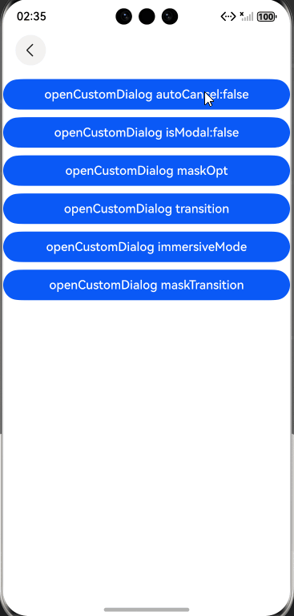
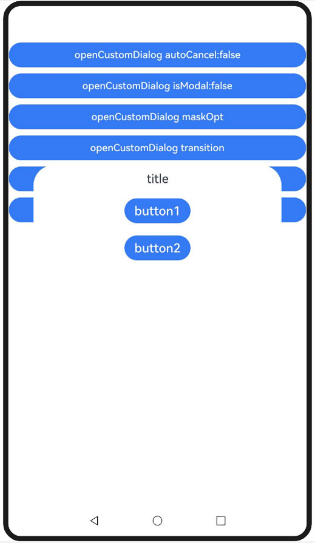
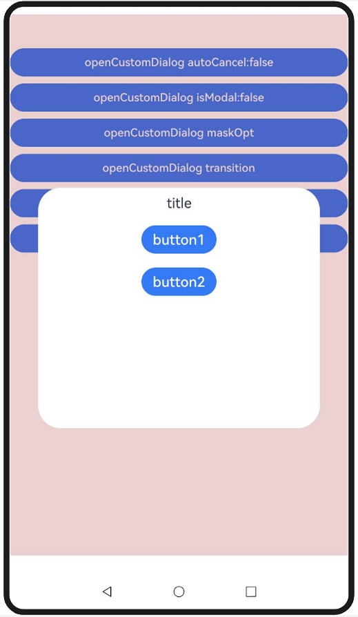
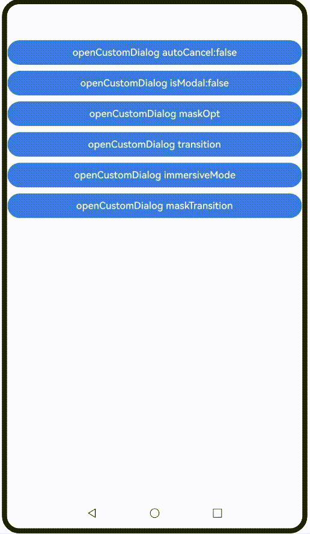
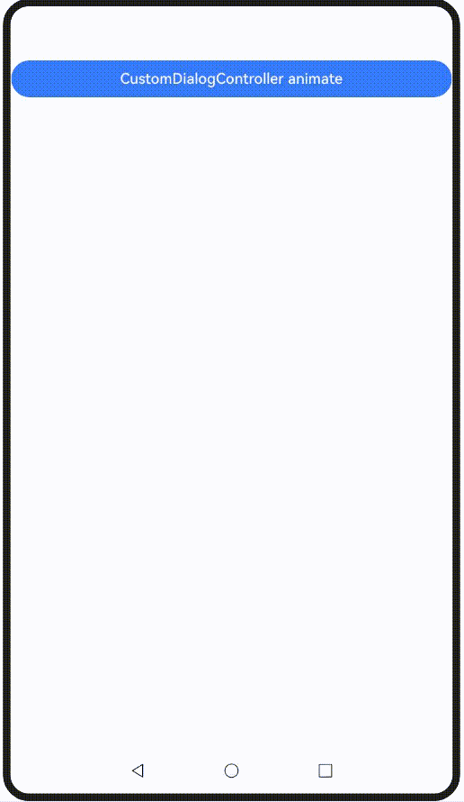
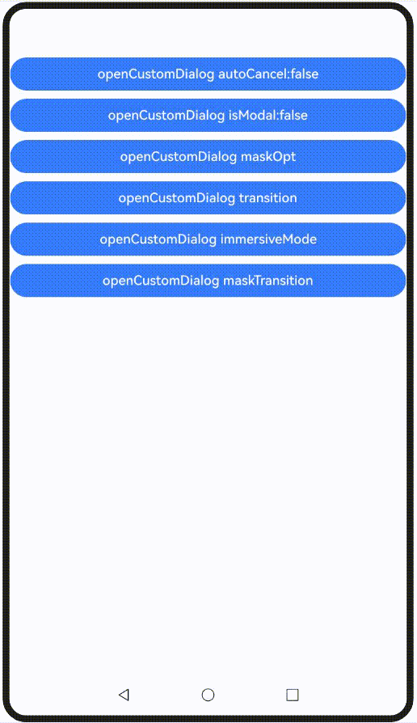

# Popup Mask Control
<!--Kit: ArkUI-->
<!--Subsystem: ArkUI-->
<!--Owner: @houguobiao-->
<!--Designer: @houguobiao-->
<!--Tester: @lxl007-->
<!--Adviser: @Brilliantry_Rui-->

You can customize not only the content of popups but also their mask behavior. This topic introduces ArkUI's popup mask control capabilities, including dismiss-on-click behavior, mask area, mask color, and mask animations.

## Constraints

ArkUI provides various popup types with different mask customization capabilities as detailed below.

|         API & Component         |autoCancel|maskRect|isModal|immersiveMode|
| ----------------- | ------ |------ |------ |------ |
|[openCustomDialog](arkts-uicontext-custom-dialog.md)|Supported|Supported|Supported|Supported|
|[openCustomDialogWithController](../reference/apis-arkui/arkts-apis-uicontext-promptaction.md#opencustomdialogwithcontroller18)|Supported|Supported|Supported|Supported|
|[presentCustomDialog](../reference/apis-arkui/arkts-apis-uicontext-promptaction.md#presentcustomdialog18)|Supported|Supported|Supported|Supported|
|[updateCustomDialog](../reference/apis-arkui/arkts-apis-uicontext-promptaction.md#updatecustomdialog12)|Supported|Not supported|Not supported|Not supported|
|[CustomDialog](arkts-common-components-custom-dialog.md)|Supported|Supported|Supported|Supported|
|[showDialog](../reference/apis-arkui/arkts-apis-uicontext-promptaction.md#showdialog)|Not supported|Supported|Supported|Supported|
|[showAlertDialog](../reference/apis-arkui/arkts-apis-uicontext-uicontext.md#showalertdialog)|Supported|Supported|Supported|Supported|
|[showActionSheet](../reference/apis-arkui/arkts-apis-uicontext-uicontext.md#showactionsheet)|Supported|Supported|Supported|Supported|
|[showActionMenu](../reference/apis-arkui/arkts-apis-uicontext-promptaction.md#showactionmenu11)|Not supported|Not supported|Supported|Supported|
|[showDatePickerDialog](../reference/apis-arkui/arkts-apis-uicontext-uicontext.md#showdatepickerdialog)|Not supported|Supported|Not supported|Not supported|
|[CalendarPickerDialog](../reference/apis-arkui/arkui-ts/ts-methods-calendarpicker-dialog.md)|Not supported|Not supported|Not supported|Not supported|
|[showTimePickerDialog](../reference/apis-arkui/arkts-apis-uicontext-uicontext.md#showtimepickerdialog)|Not supported|Supported|Not supported|Not supported|
|[showTextPickerDialog](../reference/apis-arkui/arkts-apis-uicontext-uicontext.md#showtextpickerdialog)|Not supported|Supported|Not supported|Not supported|

> **NOTE**
> 
> - **autoCancel**: controls whether clicking the mask dismisses the popup.
>
> - **maskRect**: customizes the mask size and position. Events within the mask area are blocked.
>
> - **isModal**: specifies whether the popup is a modal. Non-modal popups have no mask and allow background interactions, while modal popups have a mask and block background interactions.
>
> - **immersiveMode** (supported since API version 15): extends the mask to the status and navigation bars when **levelMode** is set to **LevelMode.EMBEDDED**.

| API & Component                                                   | maskColor | transition                                      | maskTransition |
| ------------------------------------------------------------ | --------- | ----------------------------------------------- | -------------- |
| [openCustomDialog](arkts-uicontext-custom-dialog.md)         | Supported     | Supported                                           | Supported          |
| [openCustomDialogWithController](../reference/apis-arkui/arkts-apis-uicontext-promptaction.md#opencustomdialogwithcontroller18) | Supported     | Supported                                           | Supported          |
| [presentCustomDialog](../reference/apis-arkui/arkts-apis-uicontext-promptaction.md#presentcustomdialog18) | Supported     | Supported                                           | Supported          |
| [updateCustomDialog](../reference/apis-arkui/arkts-apis-uicontext-promptaction.md#updatecustomdialog12) | Supported     | Not supported                                         | Not supported        |
| [CustomDialog](arkts-common-components-custom-dialog.md)     | Supported     | Not supported (use **openAnimation** and **closeAnimation**)| Not supported        |
| [showDialog](../reference/apis-arkui/arkts-apis-uicontext-promptaction.md#showdialog) | Not supported   | Not supported                                         | Not supported        |
| [showAlertDialog](../reference/apis-arkui/arkts-apis-uicontext-uicontext.md#showalertdialog) | Not supported   | Supported                                           | Not supported        |
| [showActionSheet](../reference/apis-arkui/arkts-apis-uicontext-uicontext.md#showactionsheet) | Not supported   | Supported                                           | Not supported        |
| [showActionMenu](../reference/apis-arkui/arkts-apis-uicontext-promptaction.md#showactionmenu11) | Not supported   | Not supported                                         | Not supported        |
| [showDatePickerDialog](../reference/apis-arkui/arkts-apis-uicontext-uicontext.md#showdatepickerdialog) | Not supported   | Not supported                                         | Not supported        |
| [CalendarPickerDialog](../reference/apis-arkui/arkui-ts/ts-methods-calendarpicker-dialog.md) | Not supported   | Not supported                                         | Not supported        |
| [showTimePickerDialog](../reference/apis-arkui/arkts-apis-uicontext-uicontext.md#showtimepickerdialog) | Not supported   | Not supported                                         | Not supported        |
| [showTextPickerDialog](../reference/apis-arkui/arkts-apis-uicontext-uicontext.md#showtextpickerdialog) | Not supported   | Not supported                                         | Not supported        |

> **NOTE**
>
> - **maskColor**: customizes the color of the popup mask.
>
> - **openAnimation**: customizes the popup entry animation, which also affects the mask animation. This API only supports simple animation settings and does not support complex animation customization.
>
> - **closeAnimation**: customizes the popup exit animation, which also affects the mask animation. This API only supports simple animation settings and does not support complex animation customization.
>
> - **transition**: customizes the popup entry and exit animation, which also affect the mask animation.
>
> - **maskTransition** (supported since API version 19): customizes the popup mask animation.


## Popup Mask Visibility Control

The **autoCancel** and **isModal** attributes control the visibility of the popup mask.

Set **autoCancel** to **false** to disable the default behavior of dismissing the popup when the mask is touched.

<!-- @[custom_dialog_control_autoCancel](https://gitcode.com/openharmony/applications_app_samples/blob/master/code/DocsSample/ArkUISample/DialogProject/entry/src/main/ets/pages/maskdialog/CustomDialogControl.ets) -->

``` TypeScript
  autoCancelOpt: promptAction.CustomDialogOptions = {
    builder: () => {
      this.myBuilder();
    },
    autoCancel: false,
  } as promptAction.CustomDialogOptions;
  // ···
  build() {
    NavDestination() {
      Column() {
        Button('openCustomDialog autoCancel:false')
          .width('100%')
          .margin({ top: 10 })
          .onClick(() => {
            this.getUIContext().getPromptAction().openCustomDialog(this.autoCancelOpt)
          })
         
        // ···
      }
      .width('100%')
      .height('100%')
    }
  }
```
 

Set **isModal** to **false** to change the default modal popup to a non-modal popup.

<!-- @[custom_dialog_control_modal](https://gitcode.com/openharmony/applications_app_samples/blob/master/code/DocsSample/ArkUISample/DialogProject/entry/src/main/ets/pages/maskdialog/CustomDialogControl.ets) -->

``` TypeScript
  modalOpt: promptAction.CustomDialogOptions = {
    builder: () => {
      this.myBuilder();
    },
    isModal: false,
  } as promptAction.CustomDialogOptions;
  // ···
  build() {
    NavDestination() {
      Column() {
        // ···
        Button('openCustomDialog isModal:false')
          .width('100%')
          .margin({ top: 10 })
          .onClick(() => {
            this.getUIContext().getPromptAction().openCustomDialog(this.modalOpt)
          })

        // ···
      }
      .width('100%')
      .height('100%')
    }
  }
```
 


## Popup Mask Style Control

This example demonstrates the popup's mask style control capabilities using **maskRect**, **immersiveMode**, and **maskColor**.


Set **maskRect** and **maskColor** to set the mask area and mask color.

<!-- @[custom_dialog_control_mask](https://gitcode.com/openharmony/applications_app_samples/blob/master/code/DocsSample/ArkUISample/DialogProject/entry/src/main/ets/pages/maskdialog/CustomDialogControl.ets) -->

``` TypeScript
  maskOpt: promptAction.CustomDialogOptions = {
    builder: () => {
      this.myBuilder();
    },
    maskRect: {
      x: 0,
      y: 10,
      width: '100%',
      height: '90%'
    },
    maskColor: '#33AA0000'
  } as promptAction.CustomDialogOptions;
  // ···
  build() {
    NavDestination() {
      Column() {
        // ···
        Button('openCustomDialog maskOpt')
          .width('100%')
          .margin({ top: 10 })
          .onClick(() => {
            this.getUIContext().getPromptAction().openCustomDialog(this.maskOpt)
          })

        // ···
      }
      .width('100%')
      .height('100%')
    }
  }
```
 


When **levelMode** is set to **LevelMode.EMBEDDED**, the following example shows how different **immersiveMode** values affect the mask's extension to the navigation bar and status bar.
<!-- @[custom_dialog_control_immersive](https://gitcode.com/openharmony/applications_app_samples/blob/master/code/DocsSample/ArkUISample/DialogProject/entry/src/main/ets/pages/maskdialog/CustomDialogControl.ets) -->

``` TypeScript
  @State immersiveMode: ImmersiveMode = ImmersiveMode.DEFAULT;
  // ···
  build() {
    NavDestination() {
      Column() {
        // ···
        Button('openCustomDialog immersiveMode')
          .width('100%')
          .margin({ top: 10 })
          .onClick(() => {
            this.immersiveMode =
              this.immersiveMode == ImmersiveMode.DEFAULT ? ImmersiveMode.EXTEND : ImmersiveMode.DEFAULT;
            this.getUIContext().getPromptAction().openCustomDialog({
              builder: () => {
                this.myBuilder();
              },
              levelMode: LevelMode.EMBEDDED,
              immersiveMode: this.immersiveMode,
            })
          })

        // ···
      }
      .width('100%')
      .height('100%')
    }
  }
```
 

## Popup Mask Animation Control

This example demonstrates the popup's mask animation capabilities using **transition** and **maskTransition**.

Set **transition** to implement a unified animation for both the popup and its mask.
<!-- @[custom_dialog_control_transition](https://gitcode.com/openharmony/applications_app_samples/blob/master/code/DocsSample/ArkUISample/DialogProject/entry/src/main/ets/pages/maskdialog/CustomDialogControl.ets) -->

``` TypeScript
  transitionOpt: promptAction.CustomDialogOptions = {
    builder: () => {
      this.myBuilder();
    },
    transition: TransitionEffect.OPACITY.animation({ duration: 3000 })
  } as promptAction.CustomDialogOptions;
  // ···
  build() {
    NavDestination() {
      Column() {
        // ···
        Button('openCustomDialog transition')
          .width('100%')
          .margin({ top: 10 })
          .onClick(() => {
            this.getUIContext().getPromptAction().openCustomDialog(this.transitionOpt);
          })

        // ···
      }
      .width('100%')
      .height('100%')
    }
  }
```
 

Sets **maskTransition** to implement independent animation customization for the popup's mask.
<!-- @[custom_dialog_control_mask_transition](https://gitcode.com/openharmony/applications_app_samples/blob/master/code/DocsSample/ArkUISample/DialogProject/entry/src/main/ets/pages/maskdialog/CustomDialogControl.ets) -->

``` TypeScript
Button('openCustomDialog maskTransition')
  .width('100%')
  .margin({ top: 10 })
  .onClick(() => {
    this.getUIContext().getPromptAction().openCustomDialog({
      builder: () => {
        this.myBuilder();
      },
      maskTransition: TransitionEffect.OPACITY.animation({ duration: 2000 })
        .combine(TransitionEffect.rotate({ z: 1, angle: 180 })),
    });
  })
```
 

Although [CustomDialog](arkts-common-components-custom-dialog.md) does not support the **transition** API, the corresponding **openAnimation** and **closeAnimation** APIs can be used to customize the animation for opening and closing the popup. Example code is as follows:

<!-- @[custom_dialog_animation](https://gitcode.com/openharmony/applications_app_samples/blob/master/code/DocsSample/ArkUISample/DialogProject/entry/src/main/ets/pages/maskdialog/CustomDialogAnimation.ets) -->

``` TypeScript
// xxx.ets

@CustomDialog
@Component
struct CustomDialogAnimationBuilder {
  controller?: CustomDialogController;

  build() {
    Column() {
      Text('title')
        .margin(10)
        .fontSize(20)
      Button('button1')
        .margin(10)
        .fontSize(20)
        .onClick(() => {
          this.controller?.close();
        })
      Button('button2')
        .margin(10)
        .fontSize(20)
        .onClick(() => {
          this.controller?.close();
        })
    }.width('100%')
    .height('50%')
  }
}

@Entry
@Component
export struct CustomDialogAnimation {
  animationController: CustomDialogController | null =
    new CustomDialogController({
      builder: CustomDialogAnimationBuilder(),
      closeAnimation: { duration: 2000 },
      openAnimation: { duration: 2000 }
    });

  aboutToDisappear(): void {
    this.animationController = null;
  }

  build() {
    NavDestination() {
      Column() {
        Button('CustomDialogController animate')
          .width('100%')
          .margin({ top: 10 })
          .onClick(() => {
            this.animationController?.open();
          })
      }
    }
  }
}
```
 


## Complete Sample Code

<!-- @[custom_dialog_control](https://gitcode.com/openharmony/applications_app_samples/blob/master/code/DocsSample/ArkUISample/DialogProject/entry/src/main/ets/pages/maskdialog/CustomDialogControl.ets) -->

``` TypeScript
// xxx.ets
import { ImmersiveMode, LevelMode, promptAction } from '@kit.ArkUI';

@Entry
@Component
export struct CustomDialogControl {
  @State immersiveMode: ImmersiveMode = ImmersiveMode.DEFAULT;

  autoCancelOpt: promptAction.CustomDialogOptions = {
    builder: () => {
      this.myBuilder();
    },
    autoCancel: false,
  } as promptAction.CustomDialogOptions;

  modalOpt: promptAction.CustomDialogOptions = {
    builder: () => {
      this.myBuilder();
    },
    isModal: false,
  } as promptAction.CustomDialogOptions;

  maskOpt: promptAction.CustomDialogOptions = {
    builder: () => {
      this.myBuilder();
    },
    maskRect: {
      x: 0,
      y: 10,
      width: '100%',
      height: '90%'
    },
    maskColor: '#33AA0000'
  } as promptAction.CustomDialogOptions;
  
  transitionOpt: promptAction.CustomDialogOptions = {
    builder: () => {
      this.myBuilder();
    },
    transition: TransitionEffect.OPACITY.animation({ duration: 3000 })
  } as promptAction.CustomDialogOptions;

  @Builder
  myBuilder() {
    Column() {
      Text('title').margin(10).fontSize(20)
      Button('button1').margin(10).fontSize(20)
      Button('button2').margin(10).fontSize(20)
    }.width('100%').height('50%')
  }

  build() {
    NavDestination() {
      Column() {
        Button('openCustomDialog autoCancel:false')
          .width('100%')
          .margin({ top: 10 })
          .onClick(() => {
            this.getUIContext().getPromptAction().openCustomDialog(this.autoCancelOpt)
          })
         
        Button('openCustomDialog isModal:false')
          .width('100%')
          .margin({ top: 10 })
          .onClick(() => {
            this.getUIContext().getPromptAction().openCustomDialog(this.modalOpt)
          })

        Button('openCustomDialog maskOpt')
          .width('100%')
          .margin({ top: 10 })
          .onClick(() => {
            this.getUIContext().getPromptAction().openCustomDialog(this.maskOpt)
          })

        Button('openCustomDialog transition')
          .width('100%')
          .margin({ top: 10 })
          .onClick(() => {
            this.getUIContext().getPromptAction().openCustomDialog(this.transitionOpt);
          })

        Button('openCustomDialog immersiveMode')
          .width('100%')
          .margin({ top: 10 })
          .onClick(() => {
            this.immersiveMode =
              this.immersiveMode == ImmersiveMode.DEFAULT ? ImmersiveMode.EXTEND : ImmersiveMode.DEFAULT;
            this.getUIContext().getPromptAction().openCustomDialog({
              builder: () => {
                this.myBuilder();
              },
              levelMode: LevelMode.EMBEDDED,
              immersiveMode: this.immersiveMode,
            })
          })

        Button('openCustomDialog maskTransition')
          .width('100%')
          .margin({ top: 10 })
          .onClick(() => {
            this.getUIContext().getPromptAction().openCustomDialog({
              builder: () => {
                this.myBuilder();
              },
              maskTransition: TransitionEffect.OPACITY.animation({ duration: 2000 })
                .combine(TransitionEffect.rotate({ z: 1, angle: 180 })),
            });
          })
      }
      .width('100%')
      .height('100%')
    }
  }
}
```
 
