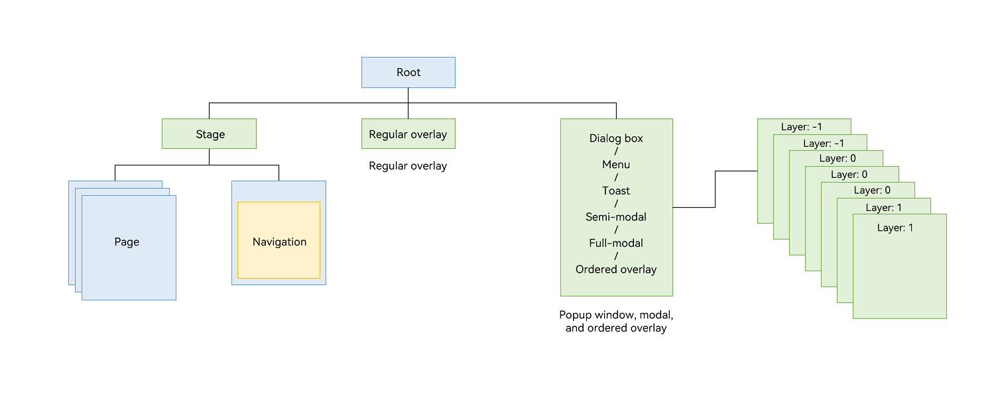
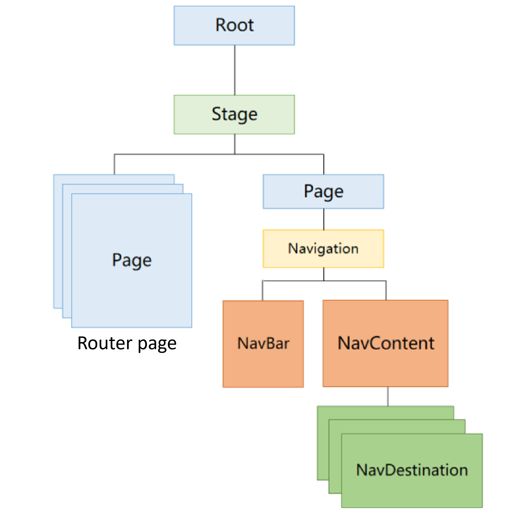
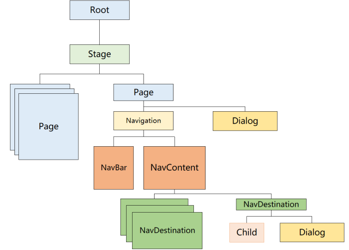
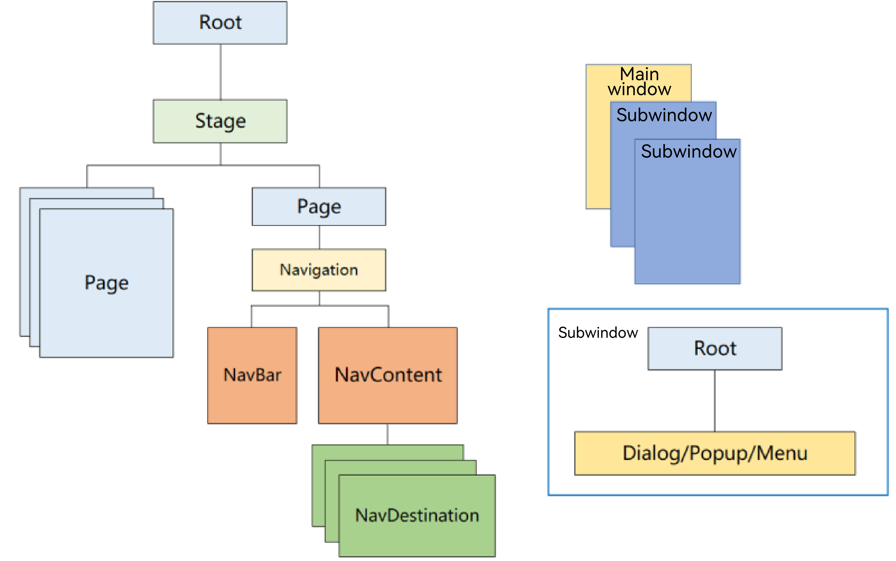

# Popup Window Overview
<!--Kit: ArkUI-->
<!--Subsystem: ArkUI-->
<!--Owner: @houguobiao-->
<!--Designer: @houguobiao-->
<!--Tester: @lxl007-->
<!--Adviser: @Brilliantry_Rui-->
A popup window is a UI element that automatically appears when an application is launched or when a user performs a specific action. It is designed to present important information or actions that require the user's attention within a short timeframe.

In the ArkUI component tree, regular overlays, popup windows, modals, and ordered overlays are all mounted under the root node Popup windows, modals, and ordered overlays are displayed in layers based on their assigned z-order values, appearing above all regular overlays. The figure below illustrates the structure.

For a multi-page application, the basic tree structure is as shown below. Multiple Page-level pages are navigated using the [Router](../reference/apis-arkui/js-apis-router.md) APIs. Pages composed of [NavBar](../reference/apis-arkui/arkui-ts/ts-basic-components-navigation.md#navbar12) and [Navdestination](../reference/apis-arkui/arkui-ts/ts-basic-components-navdestination.md) are navigated via the [Navigation](../reference/apis-arkui/arkui-ts/ts-basic-components-navigation.md) component.

When used together with routing and navigation, components created using [Dialog](arkts-base-dialog-overview.md), [Popup](arkts-popup-overview.md), [Menu](arkts-menu-overview.md), [OverlayManager](arkts-create-overlaymanager.md), [Toast](arkts-create-toast.md), [bindSheet](arkts-sheet-page.md), or [bindContentCover](arkts-contentcover-page.md) can appear in the following display modes:

 - The dialog box is displayed at the topmost layer of the application window, above all pages in the main window (default behavior).

   As shown below, when a dialog box is displayed, it sits above both **Page** pages and **Navigation** pages. If the dialog box is not closed, it will remain visible during page switching, and the new routing or navigation page will not overlay it.

   

   > **NOTE**
   >
   > If a dialog box component (such as **Popup** or **Menu**) is bound to a component that is no longer displayed after a page jump, the system will automatically close that dialog box. However, because the dialog box's visibility is also controlled by developer-set parameters (such as the **show** parameter of [Popup](arkts-popup-overview.md)), the dialog box may still appear overlaying the next page.

 - The dialog box is displayed within the current page, below the next page.

   To restrict a dialog box to a single page (ensuring the dialog box is covered by the new page during routing/navigation-based page switching, and reappears normally when the user returns to the original page), the component hierarchy should be structured as follows:

   

   Page-level dialog box capabilities must be used in conjunction with the page-level support feature of the dialog box component. Currently, [Dialog](arkts-base-dialog-overview.md) and [bindSheet](arkts-sheet-page.md) support page-level behavior.

 - The dialog box is displayed in an independent window, which is above the application window.

   On devices such as PCs/2-in-1 devices, you may need to display dialog boxes outside the application window. This requires the subwindow capability, which can be enabled for custom dialog boxes via the **showInSubWindow** property in [CustomDialogControllerOptions](../reference/apis-arkui/arkui-ts/ts-methods-custom-dialog-box.md#customdialogcontrolleroptions). An example of a dialog box displayed in a subwindow is shown below.

   

   In this case, the dialog box's display order is managed by the window stack manager, placing it above the current application window but below system windows (for example, system input methods and system dialog boxes).

## Types of Popup Windows

Popup windows can be categorized based on the level of user interaction required. There are two main types: modal and non-modal popup windows. The key difference between them lies in whether the user must interact with the popup window.

* **Modal popup window**: This type of popup window is a strong interaction element. It interrupts the user's current task and requires a response before the user can proceed with other actions. It is typically used when important information needs to be conveyed to the user.
* **Non-modal popup window**: This is a weaker form of interaction and does not interfere with the user's current tasks. The user is not required to respond to the popup window, which usually has a time limit and disappears automatically after a set period. This type is generally used when users need to perform additional actions while being notified of certain information.

> **NOTE**
>
> A modal popup window can be converted to a non-modal one through specific attributes. For example, setting [isModal](../reference//apis-arkui/arkui-ts/ts-methods-alert-dialog-box.md#alertdialogparam) to **false** for **AlertDialog** will change it from modal to non-modal. For more details on other popup windows, see the respective API references.
>
> Avoid calling popup window display APIs when the application runs in the background.
>
> System popup windows are managed by the system and do not support style customization for security reasons.
>
> When a system popup window is active, do not call non-system popup window display APIs (such as **openCustomDialog** of **promptAction** or **open** of **CustomDialogController**).

## Use Cases

Choose the appropriate component based on your specific requirements.

|Popup Window Name| Use Case|
| --- | --- |
| [Dialog](arkts-base-dialog-overview.md)| Use this popup window when you need to display information or actions that require the user's attention, such as when exiting the application for the second time.|
| [Menu (Menu/openMenu)](arkts-menu-overview.md)  | Use this popup window to bind actions to specified components, such as displaying operation options when an icon is long-pressed.|
| [Popup (Popup/openPopup)](arkts-popup-overview.md)  | Use this popup window to display a hint for a specific component, for example, a tooltip when a question mark is clicked.|
| [Modal page (bindContentCover/bindSheet)](arkts-modal-overview.md) | Choose this popup window when a new page needs to overlay the old one without making the old page disappear, such as viewing a large image by clicking a thumbnail.|
|  [Toast](arkts-create-toast.md) | Use this popup window to provide simple feedback on the user's current action in a small window, like displaying a message that a file has been saved successfully.|
|  [Overlay (OverlayManager)](arkts-create-overlaymanager.md) | Use this popup window when you need to customize the content, behavior, and style, and want to display a floating layer on top of the page, such as a music or voice playback floating bubble.|

## Specifications Constraints

* When multiple popup window components are displayed in sequence, the layer of the later displayed component is higher than that of the earlier one, and they exit in the reverse order of their display.
* On mobile devices, a popup window in subwindow mode cannot exceed the main window. On a 2-in-1 device, a modal popup window may need to be displayed beyond the main window. In this case, you can set **showInSubWindow** to **true** to achieve this effect. The following figure shows the effect.

  
