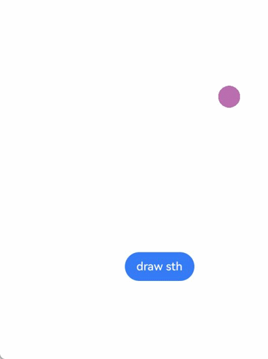

# Drawing Custom Graphics Using the Canvas (Canvas)
<!--Kit: ArkUI-->
<!--Subsystem: ArkUI-->
<!--Owner: @sd-wu-->
<!--Designer: @sunbees-->
<!--Tester: @liuli0427-->
<!--Adviser: @Brilliantry_Rui-->


**Canvas** provides a canvas component for drawing custom graphics. You can use the **CanvasRenderingContext2D** and **OffscreenCanvasRenderingContext2D** objects to draw graphics on the **Canvas** component. The drawing objects can be basic shapes, text, and images.


## Drawing Custom Graphics on the Canvas

You can draw custom graphics on the canvas in any of the following ways:


- Use [CanvasRenderingContext2D](../reference/apis-arkui/arkui-ts/ts-canvasrenderingcontext2d.md).


<!-- @[canvasRenderingContext2D_start](https://gitcode.com/openharmony/applications_app_samples/blob/master/code/DocsSample/ArkUISample/CustomCanvas/entry/src/main/ets/pages/canvas/CanvasRenderingContext2D.ets) -->

``` TypeScript
@Entry
@Component
struct CanvasExample1 {
  // Configure the parameters of the CanvasRenderingContext2D object, including whether to enable anti-aliasing. The value true indicates that anti-aliasing is enabled.
  private settings: RenderingContextSettings = new RenderingContextSettings(true);
  // Create a CanvasRenderingContext2D object by calling CanvasRenderingContext2D object in Canvas.
  private context: CanvasRenderingContext2D = new CanvasRenderingContext2D(this.settings);

  build() {
    Flex({ direction: FlexDirection.Column, alignItems: ItemAlign.Center, justifyContent: FlexAlign.Center }) {
      // Invoke the CanvasRenderingContext2D object in Canvas.
      Canvas(this.context)
        .width('100%')
        .height('100%')
        .backgroundColor('#F5DC62')
        .onReady(() => {
          // You can draw content here.
          this.context.strokeRect(50, 50, 200, 150);
        })
    }
    .width('100%')
    .height('100%')
  }
}
```


  

- Drawing offscreen onto a canvas is a process where content to draw onto the canvas is first drawn in the buffer, and then converted into a picture, and finally the picture is drawn on the canvas. This process increases the drawing efficiency. Specifically, the implementation is as follows:
  1. Use the **transferToImageBitmap** API to create an **ImageBitmap** object for the image that is recently rendered off the screen canvas.
  2. Use the **transferFromImageBitmap** API of the **CanvasRenderingContext2D** object to display the given **ImageBitmap** object.

    For details, see [OffscreenCanvasRenderingContext2D](../reference/apis-arkui/arkui-ts/ts-offscreencanvasrenderingcontext2d.md).


<!-- @[offScreenDrawing_start](https://gitcode.com/openharmony/applications_app_samples/blob/master/code/DocsSample/ArkUISample/CustomCanvas/entry/src/main/ets/pages/canvas/OffScreenDrawing.ets) -->

``` TypeScript
@Entry
@Component
struct CanvasExample2 {
  // Configure the parameters of the CanvasRenderingContext2D and OffscreenCanvasRenderingContext2D objects, including whether to enable anti-aliasing. The value true indicates that anti-aliasing is enabled.
  private settings: RenderingContextSettings = new RenderingContextSettings(true);
  private context: CanvasRenderingContext2D = new CanvasRenderingContext2D(this.settings);
  // Create an OffscreenCanvas object. width indicates the width of the offscreen canvas, and height indicates the height of the offscreen canvas. OffscreenCanvasRenderingContext2D handles offscreen graphics rendering.
  private offCanvas: OffscreenCanvas = new OffscreenCanvas(600, 600);

  build() {
    Flex({ direction: FlexDirection.Column, alignItems: ItemAlign.Center, justifyContent: FlexAlign.Center }) {
      Canvas(this.context)
        .width('100%')
        .height('100%')
        .backgroundColor('#F5DC62')
        .onReady(() => {
          let offContext = this.offCanvas.getContext('2d', this.settings);
          // You can draw content here.
          offContext.strokeRect(50, 50, 200, 150);
          // Draw the offscreen-rendered image on the common canvas.
          let image = this.offCanvas.transferToImageBitmap();
          this.context.transferFromImageBitmap(image);
        })
    }
    .width('100%')
    .height('100%')
  }
}
```


  

  >**NOTE**
  >
  >The APIs called for drawing on the canvas through the **CanvasRenderingContext2D** and **OffscreenCanvasRenderingContext2D** objects are the same. Unless otherwise specified, the value unit of the parameters in these APIs is vp.

- Before loading the Lottie animation on the canvas, download the Lottie as follows:


<!-- @[lottie_start](https://gitcode.com/openharmony/applications_app_samples/blob/master/code/DocsSample/ArkUISample/CustomCanvas/entry/src/main/ets/pages/canvas/OffScreenDrawing.ets) -->

``` TypeScript
import lottie from '@ohos/lottie'
```


  For details about the APIs, see [lottie](https://gitcode.com/openharmony-tpc/lottieArkTS).


## Initializing the Canvas Component

**onReady(event: () =&gt; void)** is the event callback when the **Canvas** component initialization is complete. After this event is called, the determined width and height of the **Canvas** component can be obtained. The **CanvasRenderingContext2D** and **OffscreenCanvasRenderingContext2D** objects can then be used to call related APIs to draw graphics.


<!-- @[initCanvasComponent_start](https://gitcode.com/openharmony/applications_app_samples/blob/master/code/DocsSample/ArkUISample/CustomCanvas/entry/src/main/ets/pages/canvas/InitCanvasComponent.ets) -->

``` TypeScript
Canvas(this.context)
  .width('100%')
  .height('100%')
  .backgroundColor('#F5DC62')
  .onReady(() => {
    this.context.fillStyle = '#0097D4';
    this.context.fillRect(50, 50, 100, 100);
  })
```


## Canvas Component Drawing Modes

After **onReady()** is invoked, you can use the **Canvas** component for drawing. Alternatively, you can separately define the **Path2d** object to build an ideal path without the **Canvas** component and **onReady()** lifecycle callback, and then use the **Canvas** component for drawing after **onReady()** is invoked.

- Use the **CanvasRenderingContext2D** and **OffscreenCanvasRenderingContext2D** objects to call related APIs for drawing.


<!-- @[contextCallApi_start](https://gitcode.com/openharmony/applications_app_samples/blob/master/code/DocsSample/ArkUISample/CustomCanvas/entry/src/main/ets/pages/canvas/CanvasComponentDrawingMethod.ets) -->

``` TypeScript
Canvas(this.context)
  .width('100%')
  .height('100%')
  .backgroundColor('#F5DC62')
  .onReady(() => {
    this.context.beginPath();
    this.context.moveTo(50, 50);
    this.context.lineTo(280, 160);
    this.context.stroke();
  })
```


  

- Define an individual **path2d** object to build an ideal path, and then call the **stroke** or **fill** API of the **CanvasRenderingContext2D** and **OffscreenCanvasRenderingContext2D** objects to draw the path. For details, see [Path2D](../reference/apis-arkui/arkui-ts/ts-components-canvas-path2d.md).


<!-- @[definePath2d_start](https://gitcode.com/openharmony/applications_app_samples/blob/master/code/DocsSample/ArkUISample/CustomCanvas/entry/src/main/ets/pages/canvas/CanvasComponentDrawingMethod.ets) -->

``` TypeScript
Canvas(this.context2)
  .width('100%')
  .height('100%')
  .backgroundColor('#F5DC62')
  .onReady(() => {
    let region = new Path2D();
    region.arc(100, 75, 50, 0, 6.28);
    this.context2.stroke(region);
  })
```


  


## Common Usage of the Canvas Component

**OffscreenCanvasRenderingContext2D** and **CanvasRenderingContext2D** provide a large number of attributes and methods, which can be used to draw text and graphics and process pixels. They are the core of the **Canvas** component. Common APIs include [fill](../reference/apis-arkui/arkui-ts/ts-canvasrenderingcontext2d.md#fill), [clip](../reference/apis-arkui/arkui-ts/ts-canvasrenderingcontext2d.md#clip), and [stroke](../reference/apis-arkui/arkui-ts/ts-canvasrenderingcontext2d.md#stroke). In addition, attributes such as [fillStyle](../reference/apis-arkui/arkui-ts/ts-canvasrenderingcontext2d.md#fillstyle), [globalAlpha](../reference/apis-arkui/arkui-ts/ts-canvasrenderingcontext2d.md#globalalpha), and [strokeStyle](../reference/apis-arkui/arkui-ts/ts-canvasrenderingcontext2d.md#strokestyle) are provided to spruce up the graphics. This topic describes typical usage of the canvas.

- Drawing basic shapes
  You can draw a basic shape by calling APIs such as [arc](../reference/apis-arkui/arkui-ts/ts-canvasrenderingcontext2d.md#arc), [ellipse](../reference/apis-arkui/arkui-ts/ts-canvasrenderingcontext2d.md#ellipse), and [rect](../reference/apis-arkui/arkui-ts/ts-canvasrenderingcontext2d.md#rect).


<!-- @[CanvasComponentBasicShapes_start](https://gitcode.com/openharmony/applications_app_samples/blob/master/code/DocsSample/ArkUISample/CustomCanvas/entry/src/main/ets/pages/canvas/CanvasComponentBasicShapes.ets) -->

``` TypeScript
Canvas(this.context)
  .width('100%')
  .height('100%')
  .backgroundColor('#F5DC62')
  .onReady(() => {
    // Draw a rectangle.
    this.context.beginPath();
    this.context.rect(100, 50, 100, 100);
    this.context.stroke();
    // Draw a circle on the canvas.
    this.context.beginPath();
    this.context.arc(150, 250, 50, 0, 6.28);
    this.context.stroke();
    // Draw an oval on the canvas.
    this.context.beginPath();
    this.context.ellipse(150, 450, 50, 100, Math.PI * 0.25, Math.PI * 0, Math.PI * 2);
    this.context.stroke();
  })
```


  

- Drawing text

  You can use APIs such as [fillText](../reference/apis-arkui/arkui-ts/ts-canvasrenderingcontext2d.md#filltext) and [strokeText](../reference/apis-arkui/arkui-ts/ts-canvasrenderingcontext2d.md#stroketext) to draw text. In the example, the **font** attribute is set to a bold, 50 px high "sans-serif" font. The **fillText** API is used to draw the text "Hello World!" at the position (50, 100). In addition, the **strokeText** API is used to draw the outline of the text "Hello World!" at the position (50, 150) with a red stroke style and a line width of 2.


<!-- @[canvasComponentText_start](https://gitcode.com/openharmony/applications_app_samples/blob/master/code/DocsSample/ArkUISample/CustomCanvas/entry/src/main/ets/pages/canvas/CanvasComponentText.ets) -->

``` TypeScript
Canvas(this.context)
  .width('100%')
  .height('100%')
  .backgroundColor('#F5DC62')
  .onReady(() => {
    // Draw filled text on the canvas.
    this.context.font = '50px bolder sans-serif';
    this.context.fillText('Hello World!', 50, 100);
    // Draw a text stroke on the canvas.
    this.context.strokeStyle = '#ff0000';
    this.context.lineWidth = 2;
    this.context.font = '50px bolder sans-serif';
    this.context.strokeText('Hello World!', 50, 150);
  })
```


  

- Drawing a text border

  Use the [measureText](../reference/apis-arkui/arkui-ts/ts-canvasrenderingcontext2d.md#measuretext) API to calculate the text width and height for precise border placement. In the example, **textBaseline** is set to **'top'**, the font is set to a 30-pixel "monospace" font, and the width and height of the text are measured using **measureText**. Then, the **fillText** API is called to draw the text "Hello World!" at (20, 100), and the **strokeRect** API is called to draw a border of the corresponding dimensions at the same position using the measured width and height. Next, the font is set to a bold 60-pixel "sans-serif" font, the width and height of the text are measured again using **measureText**, then the **fillText** API is called to draw the text "Hello World!" at (20, 150), and the **strokeRect** API is called to draw a border of the corresponding dimensions at the same position.


<!-- @[canvasComponentTextBorder_start](https://gitcode.com/openharmony/applications_app_samples/blob/master/code/DocsSample/ArkUISample/CustomCanvas/entry/src/main/ets/pages/canvas/CanvasComponentTextBorder.ets) -->

``` TypeScript
// xxx.ets
@Entry
@Component
struct CanvasComponentTextBorder {
  drawText: string = 'Hello World'
  private settings: RenderingContextSettings = new RenderingContextSettings(true);
  private context: CanvasRenderingContext2D = new CanvasRenderingContext2D(this.settings);

  build() {
    Flex({ direction: FlexDirection.Column, alignItems: ItemAlign.Center, justifyContent: FlexAlign.Center }) {
      Canvas(this.context)
        .width('100%')
        .height('100%')
        .backgroundColor('#F5DC62')
        .onReady(() => {
          // Set the horizontal alignment mode of the text to 'top'.
          this.context.textBaseline = 'top';
          // Set the font size to 30 px and the font family to monospace.
          this.context.font = '30px monospace';
          let textWidth = this.context.measureText(this.drawText).width;
          let textHeight = this.context.measureText(this.drawText).height;
          this.context.fillText(this.drawText, 20, 100);
          this.context.strokeRect(20, 100, textWidth, textHeight);
          // Set the font weight to bold, font size to 60 px, and font family to sans-serif.
          this.context.font = 'bold 60px sans-serif';
          textWidth = this.context.measureText(this.drawText).width;
          textHeight = this.context.measureText(this.drawText).height;
          this.context.fillText(this.drawText, 20, 150);
          this.context.strokeRect(20, 150, textWidth, textHeight);
        })
    }
    .width('100%')
    .height('100%')
  }
}
```


  

- Drawing text with a custom font

  Obtain the application's global font manager instance via [getGlobalInstance](../reference/apis-arkgraphics2d/js-apis-graphics-text.md#getglobalinstance), which is available since API version 20. Then, use the [loadFontSync](../reference/apis-arkgraphics2d/js-apis-graphics-text.md#loadfontsync) API to load a custom font from the specified path, and set the font style for text drawing via the [font](../reference/apis-arkui/arkui-ts/ts-canvasrenderingcontext2d.md#font) API. Subsequently, draw text using APIs such as [fillText](../reference/apis-arkui/arkui-ts/ts-canvasrenderingcontext2d.md#filltext) and [strokeText](../reference/apis-arkui/arkui-ts/ts-canvasrenderingcontext2d.md#stroketext).


<!-- @[canvasComponentCustomFontsDrawText_start](https://gitcode.com/openharmony/applications_app_samples/blob/master/code/DocsSample/ArkUISample/CustomCanvas/entry/src/main/ets/pages/canvas/CanvasComponentCustomFontsDrawText.ets) -->

``` TypeScript
import { text } from '@kit.ArkGraphics2D';

@Entry
@Component
struct CustomFont {
  private settings: RenderingContextSettings = new RenderingContextSettings(true);
  private context: CanvasRenderingContext2D = new CanvasRenderingContext2D(this.settings);

  build() {
    Flex({ direction: FlexDirection.Column, alignItems: ItemAlign.Center, justifyContent: FlexAlign.Center }) {
      Canvas(this.context)
        .width('100%')
        .height('100%')
        .backgroundColor('#F5DC62')
        .onReady(() => {
          // Load a custom font.
          let fontCollection = text.FontCollection.getGlobalInstance();
          fontCollection.loadFontSync('customFont', $rawfile('customFont.ttf'));
          this.context.font = '30vp customFont';
          this.context.fillText('Hello World!', 20, 50);
          this.context.strokeText('Hello World!', 20, 100);
        })
    }
    .width('100%')
    .height('100%')
  }
}
```


  

- Draw images and processes image pixel information.

  You can draw an image by calling APIs such as [drawImage](../reference/apis-arkui/arkui-ts/ts-canvasrenderingcontext2d.md#drawimage) and [putImageData](../reference/apis-arkui/arkui-ts/ts-canvasrenderingcontext2d.md#putimagedata). You can also process image pixel information by calling APIs such as [createImageData](../reference/apis-arkui/arkui-ts/ts-canvasrenderingcontext2d.md#createimagedata), [getPixelMap](../reference/apis-arkui/arkui-ts/ts-canvasrenderingcontext2d.md#getpixelmap), and [getImageData](../reference/apis-arkui/arkui-ts/ts-canvasrenderingcontext2d.md#getimagedata).


<!-- @[CanvasComponentDrawingPictureAndImagePixel_start](https://gitcode.com/openharmony/applications_app_samples/blob/master/code/DocsSample/ArkUISample/CustomCanvas/entry/src/main/ets/pages/canvas/CanvasComponentDrawingPictureAndImagePixel.ets) -->

``` TypeScript
@Entry
@Component
struct CanvasComponentDrawingPictureAndImagePixel {
  private settings: RenderingContextSettings = new RenderingContextSettings(true);
  private context: CanvasRenderingContext2D = new CanvasRenderingContext2D(this.settings);
  private offCanvas: OffscreenCanvas = new OffscreenCanvas(600, 600);
  // Replace "/common/images/image.png" with the image resource file you use.
  private img: ImageBitmap = new ImageBitmap('/common/images/image.png');

  build() {
    Flex({ direction: FlexDirection.Column, alignItems: ItemAlign.Center, justifyContent: FlexAlign.Center }) {
      Canvas(this.context)
        .width('100%')
        .height('100%')
        .backgroundColor('#F5DC62')
        .onReady(() => {
          let offContext = this.offCanvas.getContext('2d', this.settings);
          // Use the drawImage API to draw an image in the area with the width and height of 130 starting from (0, 0).
          offContext.drawImage(this.img, 0, 0, 130, 130);
          // Use the getImageData API to obtain the image data with the width and height of 130 starting from (50, 50).
          let imageData = offContext.getImageData(50, 50, 130, 130);
          // Use the putImageData API to draw the obtained image data in the area starting from (150, 150).
          offContext.putImageData(imageData, 150, 150);
          // Draw the offscreen drawing content to the canvas.
          let image = this.offCanvas.transferToImageBitmap();
          this.context.transferFromImageBitmap(image);
        })
    }
    .width('100%')
    .height('100%')
  }
}
```


  

- Other usage

  **Canvas** also provides other usage. For example, regarding [CanvasGradient](../reference/apis-arkui/arkui-ts/ts-components-canvas-canvasgradient.md), you can create a linear gradient with [createLinearGradient](../reference/apis-arkui/arkui-ts/ts-canvasrenderingcontext2d.md#createlineargradient) or create a radial gradient with [createRadialGradient](../reference/apis-arkui/arkui-ts/ts-canvasrenderingcontext2d.md#createradialgradient), among others.


<!-- @[canvasComponentOtherMethods_start](https://gitcode.com/openharmony/applications_app_samples/blob/master/code/DocsSample/ArkUISample/CustomCanvas/entry/src/main/ets/pages/canvas/CanvasComponentOtherMethods.ets) -->

``` TypeScript
Canvas(this.context)
  .width('100%')
  .height('100%')
  .backgroundColor('#F5DC62')
  .onReady(() => {
    // Create a CanvasGradient object with radial gradient colors.
    let grad = this.context.createRadialGradient(200, 200, 50, 200, 200, 200);
    // Set the gradient color stop for the CanvasGradient object, including the offset and colors.
    grad.addColorStop(0.0, '#E87361');
    grad.addColorStop(0.5, '#FFFFF0');
    grad.addColorStop(1.0, '#BDDB69');
    // Fill the rectangle with the CanvasGradient object.
    this.context.fillStyle = grad;
    this.context.fillRect(0, 0, 400, 400);
  })
```


  

## Driving Canvas Refresh with State Variables

State variables can trigger canvas refreshes. By listening for data changes with @Watch and binding it to a custom **draw()** method, the method bound by @Watch will execute the drawing logic, causing the canvas to refresh.


<!-- @[canvasContentUpdate_start](https://gitcode.com/openharmony/applications_app_samples/blob/master/code/DocsSample/ArkUISample/CustomCanvas/entry/src/main/ets/pages/canvas/CanvasContentUpdate.ets) -->

``` TypeScript
@Entry
@Component
struct CanvasContentUpdate {
  private settings: RenderingContextSettings = new RenderingContextSettings(true);
  private context: CanvasRenderingContext2D = new CanvasRenderingContext2D(this.settings);
  @State @Watch('draw')content: string = 'Hello World';

  draw() {
    this.context.clearRect(0, 0, 400, 200); // Clear the canvas content.
    this.context.fillText(this.content, 50, 100); // Redraw the canvas content.
  }

  build() {
    Column() {
      Canvas(this.context)
        .width('100%')
        .height('25%')
        .backgroundColor('rgb(39, 135, 217)')
        .onReady(() => {
          this.context.font = '65px sans-serif';
          this.context.fillText(this.content, 50, 100);
        })
      TextInput({
        text:$$this.content // When the content in the text input box is modified, the state variable update will drive the canvas refresh.
      })
        .fontSize(35)
    }
    .width('100%')
    .height('100%')
  }
}
```


## Controlling Canvas Rendering Based on Component Visibility

To improve performance and avoid unnecessary rendering, you can listen for **Canvas** component visibility using the following approaches:

- Using the [setOnVisibleAreaApproximateChange](../reference/apis-arkui/arkui-ts/ts-uicommonevent.md#setonvisibleareaapproximatechange) API, available since API version 13

   ```ts
  import { ColorMetrics } from '@kit.ArkUI';

  @Entry
  @Component
  struct Page {
    private canvasContext: CanvasRenderingContext2D = new CanvasRenderingContext2D()
    private timerId: number = -1;

    drawRandomCircle(): void {
      let center: [number, number] = [Math.random() * 200 + 50, Math.random() * 200 + 50]
      let radius: number = Math.random() * 20 + 10
      let color: ColorMetrics =
        ColorMetrics.rgba(Math.floor(Math.random() * 255), Math.floor(Math.random() * 255),
          Math.floor(Math.random() * 255))

      // Clear the previous content and canvas state.
      this.canvasContext.reset()

      // Start drawing.
      this.canvasContext.fillStyle = color.color
      let path: Path2D = new Path2D()
      path.ellipse(center[0], center[1], radius, radius, 0, 0, Math.PI * 2)
      this.canvasContext.fill(path)
    }

    build() {
      Flex({ direction: FlexDirection.Column, alignItems: ItemAlign.Center, justifyContent: FlexAlign.Center }) {
        Canvas(this.canvasContext)
          .width(300)
          .height(300)
          .onReady(() => {
            let frameNode = this.canvasContext.canvas;
            frameNode.commonEvent.setOnVisibleAreaApproximateChange({ ratios: [0.0] },
              (isVisible: boolean, currentRatio: number) => {
              // Canvas is not visible.
              if (!isVisible && currentRatio <= 0) {
                clearInterval(this.timerId)
                this.timerId = -2
              }
              // Canvas is visible.
              if (isVisible) {
                if (this.timerId == -2) {
                  this.timerId = setInterval(() => {
                    this.drawRandomCircle()
                  }, 50)
                }
              }
            })
          })
        Button("draw sth")
          .onClick(() => {
            if (this.timerId < 0) {
              this.timerId = setInterval(() => {
                this.drawRandomCircle()
              }, 50)
            }
          })
      }
      .width('100%')
      .height('100%')
    }
  }
  ```


- Using the [onVisibleAreaApproximateChange](../reference/apis-arkui/arkui-ts/ts-universal-component-visible-area-change-event.md#onvisibleareaapproximatechange17) API, available since API version 17

   ```ts
  import { ColorMetrics } from '@kit.ArkUI';

  @Entry
  @Component
  struct Page {
    private canvasContext: CanvasRenderingContext2D = new CanvasRenderingContext2D()
    private timerId: number = -1;

    drawRandomCircle(): void {
      let center: [number, number] = [Math.random() * 200 + 50, Math.random() * 200 + 50]
      let radius: number = Math.random() * 20 + 10
      let color: ColorMetrics =
        ColorMetrics.rgba(Math.floor(Math.random() * 255), Math.floor(Math.random() * 255),
          Math.floor(Math.random() * 255))

      // Clear the previous content and canvas state.
      this.canvasContext.reset()

      // Start drawing.
      this.canvasContext.fillStyle = color.color
      let path: Path2D = new Path2D()
      path.ellipse(center[0], center[1], radius, radius, 0, 0, Math.PI * 2)
      this.canvasContext.fill(path)
    }

    build() {
      Flex({ direction: FlexDirection.Column, alignItems: ItemAlign.Center, justifyContent: FlexAlign.Center }) {
        Canvas(this.canvasContext)
          .width(300)
          .height(300)
          .onVisibleAreaApproximateChange({ ratios: [0.0] },
              (isVisible: boolean, currentRatio: number) => {
                // Canvas is not visible.
                if (!isVisible && currentRatio <= 0) {
                  clearInterval(this.timerId)
                  this.timerId = -2
                }
                // Canvas is visible.
                if (isVisible) {
                  if (this.timerId == -2) {
                    this.timerId = setInterval(() => {
                      this.drawRandomCircle()
                    }, 50)
                  }
                }
              })
        Button("draw sth")
          .onClick(() => {
            if (this.timerId < 0) {
              this.timerId = setInterval(() => {
                this.drawRandomCircle()
              }, 50)
            }
          })
      }
      .width('100%')
      .height('100%')
    }
  }
  ```


## Example Scenario

- Drawing regular basic shapes


<!-- @[drawingRegularBaseShape_start](https://gitcode.com/openharmony/applications_app_samples/blob/master/code/DocsSample/ArkUISample/CustomCanvas/entry/src/main/ets/pages/canvas/DrawingRegularBaseShape.ets) -->

``` TypeScript
@Entry
@Component
struct ClearRect {
  private settings: RenderingContextSettings = new RenderingContextSettings(true);
  private context: CanvasRenderingContext2D = new CanvasRenderingContext2D(this.settings);

  build() {
    Flex({ direction: FlexDirection.Column, alignItems: ItemAlign.Center, justifyContent: FlexAlign.Center }) {
      Canvas(this.context)
        .width('100%')
        .height('100%')
        .backgroundColor('#F5DC62')
        .onReady(() => {
          // Set the fill color to blue.
          this.context.fillStyle = '#0097D4';
          // Take (50, 50) as the upper left corner and draw a rectangle with the width and height of 200.
          this.context.fillRect(50, 50, 200, 200);
          // Use (70, 70) as the upper left corner and clear the area with the width of 150 and height of 100.
          this.context.clearRect(70, 70, 150, 100);
        })
    }
    .width('100%')
    .height('100%')
  }
}
```


  

- Drawing custom graphics


<!-- @[drawIrregularFigures_start](https://gitcode.com/openharmony/applications_app_samples/blob/master/code/DocsSample/ArkUISample/CustomCanvas/entry/src/main/ets/pages/canvas/DrawIrregularFigures.ets) -->

``` TypeScript
@Entry
@Component
struct Path2d {
  private settings: RenderingContextSettings = new RenderingContextSettings(true);
  private context: CanvasRenderingContext2D = new CanvasRenderingContext2D(this.settings);

  build() {
    Row() {
      Column() {
        Canvas(this.context)
          .width('100%')
          .height('100%')
          .backgroundColor('#F5DC62')
          .onReady(() => {
            // Use the Path2D API to create a pentagon.
            let path = new Path2D();
            path.moveTo(150, 50);
            path.lineTo(50, 150);
            path.lineTo(100, 250);
            path.lineTo(200, 250);
            path.lineTo(250, 150);
            path.closePath();
            // Set the fill color to blue.
            this.context.fillStyle = '#0097D4';
            // Draw the pentagon described by Path2D in the canvas in fill mode.
            this.context.fill(path);
          })
      }
      .width('100%')
    }
    .height('100%')
  }
}
```


  

- Drawing an interactive cursor

  You can set the cursor position using the [beginPath](../reference/apis-arkui/arkui-ts/ts-canvasrenderingcontext2d.md#beginpath), [moveTo](../reference/apis-arkui/arkui-ts/ts-canvasrenderingcontext2d.md#moveto), [lineTo](../reference/apis-arkui/arkui-ts/ts-canvasrenderingcontext2d.md#lineto), and [arc](../reference/apis-arkui/arkui-ts/ts-canvasrenderingcontext2d.md#arc) APIs, draw the cursor using the [stroke](../reference/apis-arkui/arkui-ts/ts-canvasrenderingcontext2d.md#stroke) and [fill](../reference/apis-arkui/arkui-ts/ts-canvasrenderingcontext2d.md#fill) APIs, and use @Watch to listen for the cursor press state and position changes, and bind a custom **drawCursor()** API. When the cursor is dragged, the method bound by @Watch executes the drawing logic, calculating and updating the cursor's color and position.


<!-- @[cursor_moving_canvas](https://gitcode.com/openharmony/applications_app_samples/blob/master/code/DocsSample/ArkUISample/CustomCanvas/entry/src/main/ets/pages/canvas/DrawDraggableCursor.ets) -->

``` TypeScript
@Entry
@Component
struct CursorMoving {
  // Listen for press state changes to refresh the cursor color.
  @State @Watch('drawCursor') isTouchDown: boolean = false;
  // Listen for position changes to refresh the page.
  @State @Watch('drawCursor') cursorPosition: RectPosition = {
    x: 0,
    y: 0,
    width: 0,
    height: 0,
  };
  private settings: RenderingContextSettings = new RenderingContextSettings(true);
  private canvasContext: CanvasRenderingContext2D = new CanvasRenderingContext2D(this.settings);
  private sw: number = 360; // Fixed canvas width.
  private sh: number = 270; // Fixed canvas height.
  private cursorWH: number = 50; // Width and height of the cursor area.
  private dashedLineW: number = 7; // Width and height of the cursor.
  private arcRadius: number = 6; // Radius of the cursor circle center.
  private isReadyMove: boolean = false;
  private touchPosition: Position = {
    x: 0,
    y: 0,
  };
  private cursorCenterPosition: Position = {
    x: 0,
    y: 0,
  };

  build() {
    Column() {
      // Draw the cursor.
      Canvas(this.canvasContext)
        .width(this.sw)
        .height(this.sh)
        .backgroundColor('#D5D5D5')
        .onReady(() => {
          this.cursorPosition.x = (this.sw - this.cursorWH) / 2;
          this.cursorPosition.y = (this.sh - this.cursorWH) / 2;
          this.cursorPosition.width = this.cursorWH;
          this.cursorPosition.height = this.cursorWH;
          this.cursorCenterPosition = {
            x: this.cursorPosition.x + this.cursorPosition.width / 2,
            y: this.cursorPosition.y + this.cursorPosition.height / 2
          };
          this.drawCursor();
        })
        .onTouch(event => {
          if (event.type === TouchType.Down) {
            this.isReadyMove = this.isTouchCursorArea(event.touches[0]);
            if (this.isReadyMove) {
              this.isTouchDown = true;
            }

            this.touchPosition = {
              x: event.touches[0].displayX,
              y: event.touches[0].displayY
            };
          } else if (event.type === TouchType.Move) {
            if (this.isReadyMove) {
              let moveX = event.changedTouches[0].displayX - this.touchPosition.x;
              let moveY = event.changedTouches[0].displayY - this.touchPosition.y;
              this.touchPosition = {
                x: event.changedTouches[0].displayX,
                y: event.changedTouches[0].displayY
              };
              this.cursorPosition.x += moveX;
              this.cursorPosition.y += moveY;

              this.cursorCenterPosition = {
                x: this.cursorPosition.x + this.cursorPosition.width / 2,
                y: this.cursorPosition.y + this.cursorPosition.height / 2
              };
              // Define constraints for the position of the cursor area center.
              if (this.cursorCenterPosition.x < 0) {
                this.cursorPosition.x = -this.cursorPosition.width / 2;
              }
              if (this.cursorCenterPosition.y < 0) {
                this.cursorPosition.y = -this.cursorPosition.height / 2;
              }
              if (this.cursorCenterPosition.x > this.sw) {
                this.cursorPosition.x = this.sw - this.cursorPosition.width / 2;
              }
              if (this.cursorCenterPosition.y > this.sh) {
                this.cursorPosition.y = this.sh - this.cursorPosition.height / 2;
              }
            }
          } else {
            this.isTouchDown = false;
          }
        });
    }
    .height('100%')
    .width('100%')
    .justifyContent(FlexAlign.Center)
  }

  // Draw the cursor frame.
  drawCursor() {
    // Calculate the four points of the diamond.
    let positionL: Position = { x: this.cursorPosition.x, y: this.cursorPosition.y + this.cursorPosition.height / 2 };
    let positionT: Position = { x: this.cursorPosition.x + this.cursorPosition.width / 2, y: this.cursorPosition.y };
    let positionR: Position = {
      x: this.cursorPosition.x + this.cursorPosition.width,
      y: this.cursorPosition.y + this.cursorPosition.height / 2
    };
    let positionB: Position = {
      x: this.cursorPosition.x + this.cursorPosition.width / 2,
      y: this.cursorPosition.y + this.cursorPosition.height
    };
    let lineWidth = 2;
    this.canvasContext.clearRect(0, 0, this.sw, this.sh);
    this.canvasContext.lineWidth = lineWidth;
    this.canvasContext.strokeStyle = this.isTouchDown ? '#ff1a5cae' : '#ffffffff';

    // Draw the four corners.
    this.canvasContext.beginPath();
    this.canvasContext.moveTo(positionL.x + this.dashedLineW, positionL.y - this.dashedLineW);
    this.canvasContext.lineTo(positionL.x, positionL.y);
    this.canvasContext.lineTo(positionL.x + this.dashedLineW, positionL.y + this.dashedLineW);

    this.canvasContext.moveTo(positionT.x - this.dashedLineW, positionT.y + this.dashedLineW);
    this.canvasContext.lineTo(positionT.x, positionT.y);
    this.canvasContext.lineTo(positionT.x + this.dashedLineW, positionT.y + this.dashedLineW);

    this.canvasContext.moveTo(positionR.x - this.dashedLineW, positionR.y - this.dashedLineW);
    this.canvasContext.lineTo(positionR.x, positionR.y);
    this.canvasContext.lineTo(positionR.x - this.dashedLineW, positionR.y + this.dashedLineW);

    this.canvasContext.moveTo(positionB.x - this.dashedLineW, positionB.y - this.dashedLineW);
    this.canvasContext.lineTo(positionB.x, positionB.y);
    this.canvasContext.lineTo(positionB.x + this.dashedLineW, positionB.y - this.dashedLineW);

    this.canvasContext.stroke();

    // Draw the center circle.
    this.canvasContext.beginPath();
    this.canvasContext.strokeStyle = this.isTouchDown ? '#ff1a5cae' : '#ff9ba59b';
    this.canvasContext.fillStyle = this.isTouchDown ? '#ff1a5cae' : '#ff9ba59b';
    this.canvasContext.arc(this.cursorPosition.x + this.cursorPosition.width / 2,
      this.cursorPosition.y + this.cursorPosition.width / 2, this.arcRadius, 0, 2 * Math.PI);
    this.canvasContext.fill();
    this.canvasContext.stroke();

    //Draw the four lines.
    this.canvasContext.beginPath();
    this.canvasContext.lineWidth = 0.7;
    this.canvasContext.moveTo(positionL.x, positionL.y);
    this.canvasContext.lineTo(0, positionL.y);

    this.canvasContext.moveTo(positionT.x, positionT.y);
    this.canvasContext.lineTo(positionT.x, 0);

    this.canvasContext.moveTo(positionR.x, positionR.y);
    this.canvasContext.lineTo(this.sw, positionR.y);

    this.canvasContext.moveTo(positionB.x, positionB.y);
    this.canvasContext.lineTo(positionB.x, this.sh);

    this.canvasContext.stroke();
  }

  // Check whether the click position is within the diamond.
  isTouchCursorArea(touch: TouchObject) {
    let tempLength = Math.sqrt((touch.x - this.cursorCenterPosition.x) * (touch.x - this.cursorCenterPosition.x) +
      (touch.y - this.cursorCenterPosition.y) * (touch.y - this.cursorCenterPosition.y));
    if (tempLength < (this.cursorWH / 2 / 1.414)) {
      return true;
    }
    return false;
  }
}

export interface RectPosition {
  x: number;
  y: number;
  height: number;
  width: number;
};

export interface Position {
  x: number;
  y: number;
};
```


  

