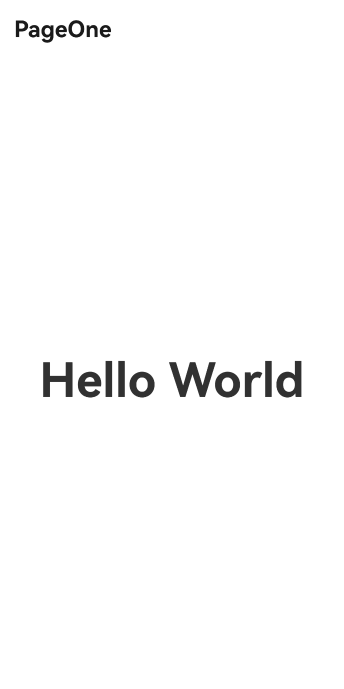

# Page-Level Dialog Box
<!--Kit: ArkUI-->
<!--Subsystem: ArkUI-->
<!--Owner: @liyi0309-->
<!--Designer: @houguobiao-->
<!--Tester: @lxl007-->
<!--Adviser: @Brilliantry_Rui-->
By default, ArkUI dialog boxes are displayed at the global level, meaning the dialog box node is a subnode of the root node of the page and appears above all route and navigation pages in the application. If a dialog box is not explicitly closed using the **close** API during a route redirection, it will remain visible on the next page.

Since API version 15, you can use a page-level dialog box that disappears with the previous routing page during page switching and reappears when the user returns to the previous page.

> **NOTE**
> 
> The page-level capability only takes effect when the dialog box is in non-subwindow mode, that is, the **showInSubWindow** parameter is set to **false** or is not set.
>
> Page-level dialog boxes are typically used with navigation and routing capabilities. For more details, see [Component Navigation and Page Routing Overview](arkts-navigation-introduction.md).
>
> Before using a page-level dialog box, familiarize yourself with the basic dialog box usage in [Dialog Box Overview](arkts-base-dialog-overview.md).

## Setting Page-Level Dialog Box Parameters

> **NOTE**
> 
> For details about the variables, see [Example](#example).

To enable the page-level capability for a dialog box, set [levelMode](../reference/apis-arkui/js-apis-promptAction.md#levelmode15) in the dialog box's **options** parameter to **LevelMode.EMBEDDED**.

When the dialog box is displayed, the current page is automatically obtained, and the dialog box node is mounted to this page. As a result, the dialog box appears above all navigation pages under the current page.

<!-- [open_custom_dialog](https://gitcode.com/openharmony/applications_app_samples/blob/master/code/DocsSample/ArkUISample/DialogProject/entry/src/main/ets/pages/customdialog/pageleveldialogbox/PageLevelDialogBox.ets) -->

``` TypeScript
this.getUIContext().getPromptAction().openCustomDialog({
  builder: () => {
    this.customDialogComponent();
  },
  levelMode: LevelMode.EMBEDDED, // Enable the page-level dialog box.
  // ···
})
```

To display the dialog box in a specified page, use the second parameter [levelUniqueId](../reference/apis-arkui/js-apis-promptAction.md#basedialogoptions11). When this parameter is set to specify the target page's node ID, the system automatically locates the corresponding [Navigation](../reference/apis-arkui/arkui-ts/ts-basic-components-navigation.md) and mounts the dialog box to the [NavDestination](../reference/apis-arkui/arkui-ts/ts-basic-components-navdestination.md) node.

> **NOTE**
> 
> When the **levelMode** parameter is set to **LevelMode.EMBEDDED** but the node corresponding to the ID specified by **levelUniqueId** cannot be found, the page-level capability does not take effect. If the node mapped by **levelUniqueId** exists but there is no **NavDestination** node in the upper traversal, the dialog box node will be mounted to the **Page** node.

In the following example, a **Text** node is used as a reference node on a specific page. The [getFrameNodeById](../reference/apis-arkui/arkts-apis-uicontext-uicontext.md#getframenodebyid12) API obtains the node, and the [getUniqueId](../reference/apis-arkui/js-apis-arkui-frameNode.md#getuniqueid12) API obtains the internal ID of the node, which is then passed as the value of **levelUniqueId**.

<!-- [test_text](https://gitcode.com/openharmony/applications_app_samples/blob/master/code/DocsSample/ArkUISample/DialogProject/entry/src/main/ets/pages/customdialog/pageleveldialogbox/PageLevelDialogBox.ets) -->

``` TypeScript
Text(this.message).id('test_text')
  .onClick(() => {
    const node: FrameNode | null = this.getUIContext().getFrameNodeById('test_text') || null;
    this.getUIContext().getPromptAction().openCustomDialog({
      builder: () => {
        this.customDialogComponent();
      },
      // ···
      levelMode: LevelMode.EMBEDDED, // Enable the page-level dialog box.
      levelUniqueId: node?.getUniqueId(), // Set the ID of any node on the target page.
    })
      .then((dialogId: number) => {
        customDialogId = dialogId;
      });
  })
```

If a mask is configured for a dialog box, its scope is adjusted based on the page level. By default, the mask covers the display area (Page or Navigation page) where the dialog box's parent node is located, but it does not cover the status bar or navigation bar. To extend the mask to cover the status bar and navigation bar, set [immersiveMode](../reference/apis-arkui/js-apis-promptAction.md#immersivemode15) to **ImmersiveMode.EXTEND**.

<!-- @[dialog_embedded](https://gitcode.com/openharmony/applications_app_samples/blob/master/code/DocsSample/ArkUISample/DialogProject/entry/src/main/ets/pages/customdialog/pageleveldialogbox/PageLevelDialogBox.ets) -->

``` TypeScript
Text(this.message).id('test_text')
  .fontSize(50)
  .fontWeight(FontWeight.Bold)
  .onClick(() => {
    const node: FrameNode | null = this.getUIContext().getFrameNodeById('test_text') || null;
    this.getUIContext().getPromptAction().openCustomDialog({
      builder: () => {
        this.customDialogComponent();
      },
      levelMode: LevelMode.EMBEDDED, // Enable the page-level dialog box.
      levelUniqueId: node?.getUniqueId(), // Set the ID of any node on the target page.
      immersiveMode: ImmersiveMode.EXTEND, // Extend the mask to cover the status bar and navigation bar.
    })
      .then((dialogId: number) => {
        customDialogId = dialogId;
      });
  })
```

## Interaction Logic

The page-level dialog box interactions follow the interaction policies below:

1. Handling of the swipe gesture: When users swipe to return to the previous page, any displayed dialog box will be closed first, consuming the gesture. To return to the previous page, users must perform the swipe gesture again.

2. By default, clicking the dialog box mask closes the dialog box. Clicking outside the mask does not close the dialog box.

## Example

The following example describes a page-level dialog box in router mode.
<!-- [page_level_dialog](https://gitcode.com/openharmony/applications_app_samples/blob/master/code/DocsSample/ArkUISample/DialogProject/entry/src/main/ets/pages/customdialog/pageleveldialogbox/PageLevelDialogBox.ets) -->

``` TypeScript
import { LevelMode, ImmersiveMode } from '@kit.ArkUI';

let customDialogId: number = 0;

@Builder
function customDialogBuilder(uiContext: UIContext) {
  Column() {
    Text('Custom dialog Message').fontSize(20).height(100)
    Row() {
      Button('Next').onClick(() => {
        // Perform route redirection within the dialog box.
        uiContext.getRouter().pushUrl({ url: 'pages/Next' });
      })
      Blank().width(50)
      Button('Close').onClick(() => {
        uiContext.getPromptAction().closeCustomDialog(customDialogId);
      })
    }
  }.padding(20)
}

@Entry
@Component
export struct PageLevelDialogBox {
  @State message: string = 'Hello World';
  private uiContext: UIContext = this.getUIContext();

  @Builder
  customDialogComponent() {
    customDialogBuilder(this.uiContext);
  }

  build() {
    NavDestination() {
      Row() {
        Column() {
          Text(this.message).id('test_text')
            .fontSize(50)
            .fontWeight(FontWeight.Bold)
            .onClick(() => {
              const node: FrameNode | null = this.getUIContext().getFrameNodeById('test_text') || null;
              this.getUIContext().getPromptAction().openCustomDialog({
                builder: () => {
                  this.customDialogComponent();
                },
                levelMode: LevelMode.EMBEDDED, // Enable the page-level dialog box.
                levelUniqueId: node?.getUniqueId(), // Set the ID of any node on the target page.
                immersiveMode: ImmersiveMode.EXTEND, // Extend the mask to cover the status bar and navigation bar.
              })
                .then((dialogId: number) => {
                  customDialogId = dialogId;
                });
            })
        }
        .width('100%')
      }
      .height('100%')
    }
  }
}

```

<!-- @[next](https://gitcode.com/openharmony/applications_app_samples/blob/master/code/DocsSample/ArkUISample/DialogProject/entry/src/main/ets/pages/customdialog/pageleveldialogbox/Next.ets) -->

``` TypeScript
// Next.ets
@Entry
@Component
struct Next {
  @State message: string = 'Back';

  build() {
    Row() {
      Column() {
        Button(this.message)
          .fontSize(20)
          .fontWeight(FontWeight.Bold)
          .onClick(() => {
            this.getUIContext().getRouter().back();
          })
      }
      .width('100%')
    }
    .height('100%')
  }
}
```


The following example describes a page-level dialog box in navigation mode. Before started, you need to create and configure the index page and the **router_map.json** file by referring to [Using NavDestination as a Navigation Page in Navigation](../reference/apis-arkui/arkui-ts/ts-basic-components-navigation.md#example-16-using-navdestination-as-a-navigation-page-in-navigation). In addition, replace the **PageHome** and **PageOne** components described in the reference document with the **PageLevelDialogInNavigation** and **PageLevelDialogInNavigationTestTwo** components in the following sample code.

<!-- [page_level_dialog](https://gitcode.com/openharmony/applications_app_samples/blob/master/code/DocsSample/ArkUISample/DialogProject/entry/src/main/ets/pages/customdialog/pageleveldialogbox/PageLevelDialogInNavigation.ets) -->

``` TypeScript
import { LevelMode, ImmersiveMode } from '@kit.ArkUI';
 	 
let customDialogId: number = 0;

@Builder
function customDialogBuilder(uiContext: UIContext, stack: NavPathStack | undefined) {
  Column() {
    Text('Custom dialog Message').fontSize(20).height(100)
    Row() {
      Button('Next').onClick(() => {
        // Perform route redirection within the dialog box.
        if (stack) {
          stack.pushPath({ name: 'Custom_ROUTE_PREFIX/PageLevelDialogInNavigationPageTwo'})
        }
      })
      Blank().width(50)
      Button('Close').onClick(() => {
        uiContext.getPromptAction().closeCustomDialog(customDialogId);
      })
    }
  }.padding(20)
}

@Component
export struct PageLevelDialogInNavigation {
  @State info: string = '';
  private stack: NavPathStack | undefined = undefined;
  private uiContext: UIContext = this.getUIContext();
  @State message: string = 'Hello World';

  @Builder
  customDialogComponent() {
    customDialogBuilder(this.uiContext, this.stack);
  }

  build() {
    NavDestination() {
      Stack({alignContent: Alignment.Center}) {
        Column() {
          Text(this.message).id('test_text')
            .fontSize(50)
            .fontWeight(FontWeight.Bold)
            .onClick(() => {
              const node: FrameNode | null = this.getUIContext().getFrameNodeById('test_text') || null;
              this.uiContext.getPromptAction().openCustomDialog({
                builder: () => {
                  this.customDialogComponent();
                },
                levelMode: LevelMode.EMBEDDED, // Enable the page-level dialog box.
                levelUniqueId: node?.getUniqueId(), // Set the ID of any node on the target page.
                immersiveMode: ImmersiveMode.EXTEND, // Extend the mask to cover the status bar and navigation bar.
              }).then((dialogId: number) => {
                customDialogId = dialogId;
              })
            })
        }
        .width('100%')
      }.width('100%').height('100%')
    }
    .width('100%').height('100%')
    .title('PageOne')
    .onReady((ctx: NavDestinationContext) => {
      this.stack = ctx.pathStack;
    })
  }
}

@Component
export struct PageLevelDialogInNavigationTestTwo {
  @State message: string = 'Back';
  private stack: NavPathStack | undefined = undefined;

  build() {
    NavDestination() {
      Stack({alignContent: Alignment.Center}) {
        Column() {
          Button(this.message)
            .fontSize(20)
            .fontWeight(FontWeight.Bold)
            .onClick(() => {
              if (this.stack) {
                this.stack.pop()
              }
            })
        }
        .width('100%')
      }.width('100%').height('100%')
    }
    .width('100%').height('100%')
    .title('PageTwo')
    .onReady((ctx: NavDestinationContext) => {
      this.stack = ctx.pathStack;
    })
  }
}
```


