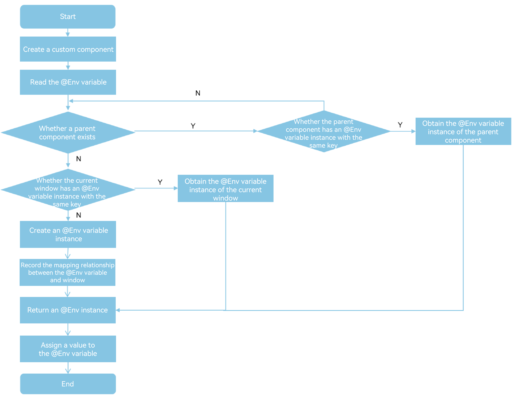
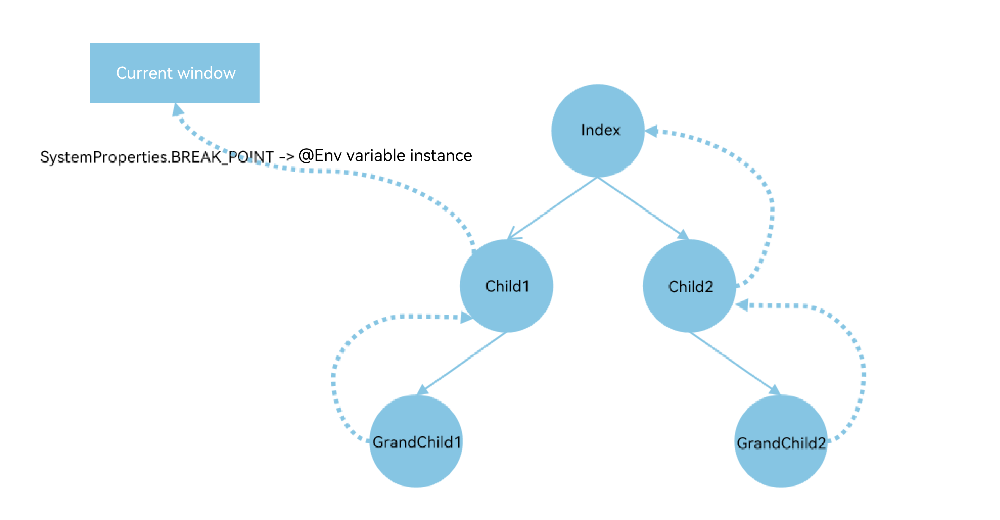
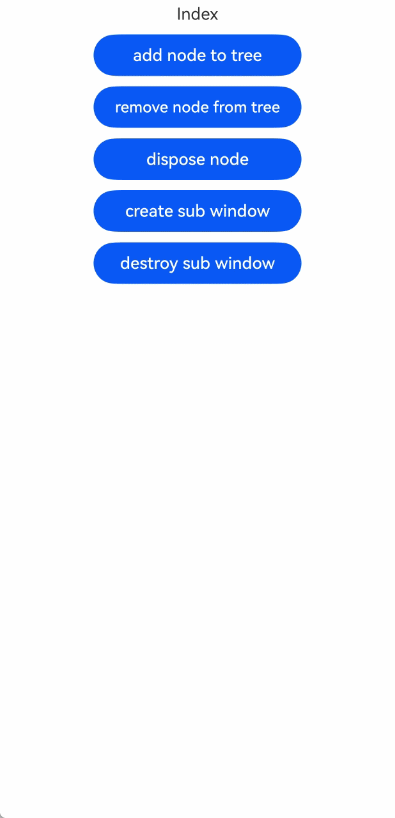
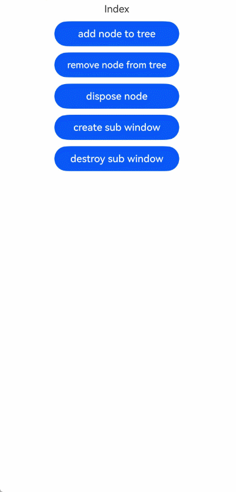

# \@Env: Environment Variable
<!--Kit: ArkUI-->
<!--Subsystem: ArkUI-->
<!--Owner: @liwenzhen3-->
<!--Designer: @s10021109-->
<!--Tester: @zhangwenhan-->
<!--Adviser: @zhang_yixin13-->

In multi-device development scenarios, you can use the [\@Env](../reference/apis-arkui/arkui-ts/ts-env-system-property.md) decorator to listen for changes of system environment variables and determine the scenario based on the system environment variables, reducing the adaptation logic and repeated development between different devices.

>**NOTE**
>
> Since API version 22, \@Env can be used in [\@Component](./state-management/arkts-create-custom-components.md#component) and [\@ComponentV2](./state-management/arkts-create-custom-components.md#componentv2).
>
> This decorator can be used in atomic services since API version 22.

## Overview
\@Env is a decorator for environment variables in the reactive system. It provides the following functionalities:
- Reads the environment variable information based on the input parameter. For details, see [Supported Parameters](#supported-parameters). Currently, the following environment variables are supported:
  - [SystemProperties.BREAK_POINT](../reference/apis-arkui/arkui-ts/ts-env-system-property.md#systemproperties): Obtains the breakpoint value information corresponding to different width and height thresholds of the window.
  - [SystemProperties.WINDOW_SIZE<sup>23+</sup>](../reference/apis-arkui/arkui-ts/ts-env-system-property.md#systemproperties): Obtains the size information of the window, in vp.
  - [SystemProperties.WINDOW_SIZE_PX<sup>23+</sup>](../reference/apis-arkui/arkui-ts/ts-env-system-property.md#systemproperties): Obtains the size of a window, in px.
  - [SystemProperties.WINDOW_AVOID_AREA<sup>23+</sup>](../reference/apis-arkui/arkui-ts/ts-env-system-property.md#systemproperties): Obtains the avoid area information of a window, in vp.
  - [SystemProperties.WINDOW_AVOID_AREA_PX<sup>23+</sup>](../reference/apis-arkui/arkui-ts/ts-env-system-property.md#systemproperties): Obtains the avoid area information of a window, in px.
- When the system environment variable changes, the \@Env decorator notifies the update of the decorated variable and triggers the update of the associated component to synchronize the UI content.
- The variable decorated by \@Env cannot be initialized by developers. \@Env returns an observable environment variable class (decorated by [\@ObservedV2](./state-management/arkts-new-observedV2-and-trace.md) and [\@Trace](./state-management/arkts-new-observedV2-and-trace.md)) instance to you. If you want to listen for the change of an environment variable, you can use [addMonitor](./state-management/arkts-new-addMonitor-clearMonitor.md). For details, see [Using \@Env in \@ComponentV2](#using-env-in-componentv2).

## Supported Parameters

For details about the parameters supported by @Env, see [SystemProperties](../reference/apis-arkui/arkui-ts/ts-env-system-property.md#systemproperties).

## @Env and Environment Capability Comparison
@Env and [Environment](./state-management/arkts-environment.md) are related to system environment variables, but their capabilities are different. For details, see the following table.

| Capability| \@Env |Environment|
| ------------------ | ------------------ | ------------------ |
|Supported since|API version 22|API version 7|
|Supported parameters|Enum values of [SystemProperties](../reference/apis-arkui/arkui-ts/ts-env-system-property.md#systemproperties)| **languageCode** and so on. For details, see [Environment Built-in Parameters](./state-management/arkts-environment.md#environment-built-in-parameters).|
|Usage|\@Env is a decorator that can be declared in @Component or @ComponentV2 to obtain the environment variable information of the corresponding parameters.|Obtain the environment variables of the current application through APIs such as [envProp](../reference/apis-arkui/arkui-ts/ts-state-management.md#envprop10) and save them to [AppStorage](./state-management/arkts-appstorage.md). You can access the values of system environment variables through AppStorage APIs. For details, see [Accessing Environment Parameters from the UI](./state-management/arkts-environment.md#accessing-environment-parameters-from-the-ui).|
|Responsive capability supported|Yes. When the system environment variable changes, the environment variable decorated by \@Env is notified of the change and the component associated with \@Env is notified to refresh.|No. When the system environment variable changes, **Environment** is not notified of the change.|

## Constraints
- \@Env can be used only in @Component and @ComponentV2. Otherwise, a compilation error is reported. If you bypass the compilation check, a runtime error is reported.
  ```ts
  import { uiObserver } from '@kit.ArkUI';

  class Info {
    @Env(SystemProperties.BREAK_POINT) breakpoint: uiObserver.WindowSizeLayoutBreakpointInfo; // Incorrect usage. Compile-time error occurs.
  }
  
  @Entry
  @Component
  struct Index {
    @Env(SystemProperties.BREAK_POINT) breakpoint: uiObserver.WindowSizeLayoutBreakpointInfo; // Correct usage.
  
    build() {
    }
  }
  ```
- The variable decorated by \@Env is read-only and cannot be initialized or assigned a value. Otherwise, an error is reported during compilation. If you bypass the compilation check, an error will be reported during runtime.
  ```ts
  import { uiObserver } from '@kit.ArkUI';
  
  @Entry
  @Component
  struct Index {
    @Env(SystemProperties.BREAK_POINT) breakpoint: uiObserver.WindowSizeLayoutBreakpointInfo =
      new uiObserver.WindowSizeLayoutBreakpointInfo(); // Incorrect usage. Compile-time error occurs.
  
    build() {
      Column() {
        Text(`breakpoint height ${this.breakpoint.heightBreakpoint}`).fontSize(20)
        Text(`breakpoint width ${this.breakpoint.widthBreakpoint}`).fontSize(20)
        Button('change breakpoint').onClick(() => {
          this.breakpoint = new uiObserver.WindowSizeLayoutBreakpointInfo(); // Incorrect usage. Compile-time error occurs.
        })
      }
    }
  }
  ```

- \@Env supports the enum values of [SystemProperties](../reference/apis-arkui/arkui-ts/ts-env-system-property.md#systemproperties). If an unsupported parameter is used, an error is reported during compilation.
    ```ts
    import { uiObserver } from '@kit.ArkUI';

    @Entry
    @Component
    struct Index {
      @Env(SystemProperties.BREAK_POINT) breakpoint1: uiObserver.WindowSizeLayoutBreakpointInfo; // Correct syntax.
      @Env('unsupported_key') breakpoint2: uiObserver.WindowSizeLayoutBreakpointInfo; // Incorrect syntax. @Env is an invalid input parameter, and an error is reported during compilation.
    
      build() {
        Text(`breakpoint2 width: ${this.breakpoint2.widthBreakpoint} height: ${this.breakpoint2.heightBreakpoint}`)
      }
    }
    ```
- When \@Env uses different key values, the decorated variable types must correspond to each other. Otherwise, an error is reported during compilation.
  - When \@Env uses **SystemProperties.BREAK_POINT**, the decorated variable type must be **uiObserver.WindowSizeLayoutBreakpointInfo**.
  - When \@Env uses **SystemProperties.WINDOW_SIZE**, the decorated variable type must be **window.SizeInVP**.
  - When \@Env uses **SystemProperties.WINDOW_SIZE_PX**, the decorated variable type must be **window.Size**.
  - When \@Env uses **SystemProperties.WINDOW_AVOID_AREA**, the decorated variable type must be **window.UIEnvWindowAvoidAreaInfoVP**.
  - When \@Env uses **SystemProperties.WINDOW_AVOID_AREA_PX**, the decorated variable type must be **window.UIEnvWindowAvoidAreaInfoPX**.
  ```ts
  import { uiObserver } from '@kit.ArkUI';

  @Entry
  @Component
  struct Index {
    @Env(SystemProperties.BREAK_POINT) breakpoint1: uiObserver.WindowSizeLayoutBreakpointInfo; // Correct syntax.
    @Env(SystemProperties.BREAK_POINT) breakpoint2: string; // Incorrect syntax. When @Env uses SystemProperties.BREAK_POINT, only the WindowSizeLayoutBreakpointInfo type can be decorated.

    build() {
    }
  }
  ```
- \@Env can be used only separately and cannot be used together with other state variable decorators in V1 and V2 or @Require. Otherwise, an error is reported during compilation.
  ```ts
  @Env(SystemProperties.BREAK_POINT) breakpoint1: uiObserver.WindowSizeLayoutBreakpointInfo; // Correct syntax.
  @State @Env(SystemProperties.BREAK_POINT) breakpoint2: uiObserver.WindowSizeLayoutBreakpointInfo; // Incorrect syntax. An error is reported during compilation.
  @Require @Env(SystemProperties.BREAK_POINT) breakpoint3: uiObserver.WindowSizeLayoutBreakpointInfo; // Incorrect syntax. An error is reported during compilation.
  @Local @Env(SystemProperties.BREAK_POINT) breakpoint4: uiObserver.WindowSizeLayoutBreakpointInfo; // Incorrect syntax. An error is reported during compilation.
  ```
- The rules for passing the variables decorated by \@Env between \@Component and \@ComponentV2 are as follows:
  - The variable decorated by \@Env can only be used to initialize the variable decorated by @Param in \@ComponentV2. Otherwise, a compilation error is reported.
  - The variable decorated by \@Env can only be used to initialize common variables in \@Component. Otherwise, a compilation error is reported. Note that switching the window through [BuilderNode](../reference/apis-arkui/js-apis-arkui-builderNode.md) will cause \@Env to update the environment variable instance based on the new window. In the window switching scenario, you are not advised to use the \@Env variable to initialize the common variables of the child component. Otherwise, the common variables cannot be notified by the \@Env to trigger the associated UI component to refresh. For details, see [Switching Windows Through BuilderNode](#switching-windows-through-buildernode).
  ```ts
  import { uiObserver } from '@kit.ArkUI';
  
  @Entry
  @Component
  struct Index {
    @Env(SystemProperties.BREAK_POINT) breakpoint: uiObserver.WindowSizeLayoutBreakpointInfo; // Correct syntax
  
    build() {
      Column() {
        CompV2({ breakpoint: this.breakpoint }) // Correct syntax
        Comp({ breakpoint: this.breakpoint }) // Correct syntax
  
        CompV2Invalid({ breakpoint: this.breakpoint }) // Incorrect syntax. The variable decorated by @Env can only initialize the @Param variable of V2.
        CompInvalid({ breakpoint: this.breakpoint }) // Incorrect syntax. The variable decorated by @Env can only initialize common variables of V1.
      }
    }
  }
  
  @ComponentV2
  struct CompV2 {
    @Require @Param breakpoint: uiObserver.WindowSizeLayoutBreakpointInfo; // Correct syntax
  
    build() {
    }
  }
  
  @ComponentV2
  struct CompV2Invalid {
    @Require breakpoint: uiObserver.WindowSizeLayoutBreakpointInfo; // Incorrect syntax
  
    build() {
    }
  }
  
  @Component
  struct Comp {
    @Require breakpoint: uiObserver.WindowSizeLayoutBreakpointInfo; // Correct syntax
  
    build() {
    }
  }
  
  @Component
  struct CompInvalid {
    @ObjectLink breakpoint: uiObserver.WindowSizeLayoutBreakpointInfo; // Incorrect syntax
  
    build() {
    }
  }
  ```

## \@Env Initialization Process

\@Env variables cannot be initialized by developers. Their values are automatically provided by the framework based on the environment variables of the current window. When the \@Env variables are read for the first time, initialization is triggered. The initialization of \@Env variables complies with the following process:

1. Search for an existing instance in the parent component.
   - Recursively search for the parent component.
   - If the \@Env variable with the same key has been initialized in a parent component in the same window, reuse the instance.
   - If no instance is found, continue to search for the parent component until the parent component is empty. Note that the process of searching for the parent component is interrupted by **BuilderNode**.
2. Search for the \@Env instance of the current window.
   - If the corresponding instance is not found in the parent component, check whether the current window has an \@Env variable instance with the same key.
   - If yes, reuse the \@Env instance in the window.
3. Create an environment variable instance for the first request.
   - If no instance is obtained in the preceding two steps, the environment variable is read for the first time in the current window.
   - The framework creates a new observable environment variable instance, binds it to the current window, and completes initialization.

The following figure shows the flowchart.



Based on the preceding process, the following example uses **SystemProperties.BREAK_POINT** as an example to describe the use of @Env. The following figure shows the initialization of each component.



1. **Child1** initializes **@Env(SystemProperties.BREAK_POINT)**.
   - Recursively search until the parent component is empty. Search for the parent component **Index** upwards. There is no **SystemProperties.BREAK_POINT** instance corresponding to \@Env.
   - Search for the current window: No **SystemProperties.BREAK_POINT** instance corresponding to \@Env is found.
   - Create an observable environment variable instance corresponding to **SystemProperties.BREAK_POINT** and bind it to the current window.
2. Initialize **@Env(SystemProperties.BREAK_POINT)** for **GrandChild1**.
   - Recursively search for the parent component until the parent component is empty. Search for the parent component **Child1** upwards. The **Child1** has a **SystemProperties.BREAK_POINT** instance corresponding to \@Env.
   - Reuse the **SystemProperties.BREAK_POINT** instance corresponding to \@Env in **Child1**.
3. Initialize **@Env(SystemProperties.BREAK_POINT)** for **GrandChild2**.
   - Recursively search until the parent component is empty. Search for the parent component **Child2** and ancestor node **Index** upwards. Neither of them has a **SystemProperties.BREAK_POINT** instance corresponding to \@Env.
   - Search for the current window. There is a **SystemProperties.BREAK_POINT** instance corresponding to \@Env.
   - Reuse the environment variable instance corresponding to **SystemProperties.BREAK_POINT** in the window.

```TypeScript
import { uiObserver } from '@kit.ArkUI';

@Entry
@Component
struct Index {
  build() {
    Column() {
      Text(`Index`)
      Child1()
      Child2()
    }
    .height('100%')
    .width('100%')
  }
}

@Component
struct Child1 {
  @Env(SystemProperties.BREAK_POINT) breakpoint: uiObserver.WindowSizeLayoutBreakpointInfo;

  build() {
    Column() {
      Text(`Child1 breakpoint width: ${this.breakpoint.widthBreakpoint}`).fontSize(20)
      Text(`Child1 breakpoint height: ${this.breakpoint.heightBreakpoint}`).fontSize(20)
      GrandChild1()
    }
  }
}

@Component
struct Child2 {
  build() {
    Column() {
      GrandChild2()
    }
  }
}

@Component
struct GrandChild1 {
  @Env(SystemProperties.BREAK_POINT) breakpoint: uiObserver.WindowSizeLayoutBreakpointInfo;

  build() {
    Column() {
      Text(`GrandChild1 breakpoint width: ${this.breakpoint.widthBreakpoint}`).fontSize(20)
      Text(`GrandChild1 breakpoint height: ${this.breakpoint.heightBreakpoint}`).fontSize(20)
    }
  }
}


@Component
struct GrandChild2 {
  @Env(SystemProperties.BREAK_POINT) breakpoint: uiObserver.WindowSizeLayoutBreakpointInfo;

  build() {
    Column() {
      Text(`GrandChild2 breakpoint width: ${this.breakpoint.widthBreakpoint}`).fontSize(20)
      Text(`GrandChild2 breakpoint height: ${this.breakpoint.heightBreakpoint}`).fontSize(20)
    }
  }
}

```

## When to Use
### Using \@Env in \@ComponentV2

In the following example:
- Declare \@Env in \@ComponentV2 to obtain the breakpoint information of the layout of the window where the current \@ComponentV2 component is created, and use [addMonitor](./state-management/arkts-new-addMonitor-clearMonitor.md) to listen for the change of the **this.breakpoint** attribute.
- Declare \@Env in \@ComponentV2 to obtain the size of the window where the current \@ComponentV2 component is created, in vp, and use [addMonitor](./state-management/arkts-new-addMonitor-clearMonitor.md) to listen for the change of the **this.sizeInVP** attribute.
- Declare \@Env in \@ComponentV2 to obtain the size of the window where the current \@ComponentV2 component is created, in px, and use [addMonitor](./state-management/arkts-new-addMonitor-clearMonitor.md) to listen for the change of the **this.sizeInPX** attribute.
- Pass the variables decorated by \@Env to the variables decorated by [\@Param](./state-management/arkts-new-param.md) in **CompV2** and the common variables in **Comp**.
- Click **Button('Landscape')** and **Button('Portrait')** to switch between landscape and portrait modes. The **Index**, **CompV2**, and **Comp** associated components are refreshed, and the **orientationChange** listener callback is triggered.

```ts
import { uiObserver, UIUtils, window } from '@kit.ArkUI';
import { common } from '@kit.AbilityKit';

@Entry
@ComponentV2
struct Index {
  @Env(SystemProperties.BREAK_POINT) breakpoint: uiObserver.WindowSizeLayoutBreakpointInfo;
  @Env(SystemProperties.WINDOW_SIZE) sizeInVP: window.SizeInVP;
  @Env(SystemProperties.WINDOW_SIZE_PX) sizeInPX: window.Size;

  private changeOrientation(isLandscape: boolean) {
    const context = this.getUIContext()?.getHostContext() as common.UIAbilityContext;
    window.getLastWindow(context).then((lastWindow) => {
      lastWindow.setPreferredOrientation(isLandscape ? window.Orientation.LANDSCAPE : window.Orientation.PORTRAIT);
    });
  }

  orientationChange(mon: IMonitor) {
    mon.dirty.forEach((path: string) => {
      console.info(`${path} changes from ${mon.value(path)?.before} to ${mon.value(path)?.now}`);
    })
  }

  aboutToAppear(): void {
    // The object returned by @Env is actually the object decorated by @ObservedV2 (its attributes are decorated by @Trace). Therefore, the change of its attributes can be listened through addMonitor.
    UIUtils.addMonitor(this.breakpoint, ['widthBreakpoint', 'heightBreakpoint'], this.orientationChange);
    UIUtils.addMonitor(this.sizeInVP, ['width', 'height'], this.orientationChange);
    UIUtils.addMonitor(this.sizeInPX, ['width', 'height'], this.orientationChange);
  }

  build() {
    Column() {
      Text(`Index breakpoint width: ${this.breakpoint.widthBreakpoint}`).fontSize(20)
      Text(`Index breakpoint height: ${this.breakpoint.heightBreakpoint}`).fontSize(20)
      Text(`Index sizeInVP width: ${this.sizeInVP.width}`).fontSize(20)
      Text(`Index sizeInVP height: ${this.sizeInVP.height}`).fontSize(20)
      Text(`Index sizeInPX width: ${this.sizeInPX.width}`).fontSize(20)
      Text(`Index sizeInPX height: ${this.sizeInPX.height}`).fontSize(20)

      Button('Landscape').onClick(() => {
        this.changeOrientation(true);
      })

      Button('Portrait').onClick(() => {
        this.changeOrientation(false);
      })

      CompV2({ breakpoint: this.breakpoint, sizeInVP: this.sizeInVP, sizeInPX: this.sizeInPX })
      Comp({ breakpoint: this.breakpoint, sizeInVP: this.sizeInVP, sizeInPX: this.sizeInPX })
    }
  }
}

@ComponentV2
struct CompV2 {
  @Require @Param breakpoint: uiObserver.WindowSizeLayoutBreakpointInfo;
  @Require @Param sizeInVP: window.SizeInVP;
  @Require @Param sizeInPX: window.Size;

  build() {
    Column() {
      Text(`CompV2 breakpoint width: ${this.breakpoint.widthBreakpoint}`).fontSize(20)
      Text(`CompV2 breakpoint height: ${this.breakpoint.heightBreakpoint}`).fontSize(20)
      Text(`CompV2 sizeInVP width: ${this.sizeInVP.width}`).fontSize(20)
      Text(`CompV2 sizeInVP height: ${this.sizeInVP.height}`).fontSize(20)
      Text(`CompV2 sizeInPX width: ${this.sizeInPX.width}`).fontSize(20)
      Text(`CompV2 sizeInPX height: ${this.sizeInPX.height}`).fontSize(20)
    }
  }
}

@Component
struct Comp {
  @Require breakpoint: uiObserver.WindowSizeLayoutBreakpointInfo;
  @Require sizeInVP: window.SizeInVP;
  @Require sizeInPX: window.Size;

  build() {
    Column() {
      Text(`Comp breakpoint width: ${this.breakpoint.widthBreakpoint}`).fontSize(20)
      Text(`Comp breakpoint height: ${this.breakpoint.heightBreakpoint}`).fontSize(20)
      Text(`Comp sizeInVP width: ${this.sizeInVP.width}`).fontSize(20)
      Text(`Comp sizeInVP height: ${this.sizeInVP.height}`).fontSize(20)
      Text(`Comp sizeInPX width: ${this.sizeInPX.width}`).fontSize(20)
      Text(`Comp sizeInPX height: ${this.sizeInPX.height}`).fontSize(20)
    }
  }
}
```

### Using \@Env in \@Component

The usage of \@Env in \@Component is similar to that in \@ComponentV2. The following is an example:

```ts
import { uiObserver, UIUtils, window } from '@kit.ArkUI';
import { common } from '@kit.AbilityKit';

@Entry
@Component
struct Index {
  @Env(SystemProperties.BREAK_POINT) breakpoint: uiObserver.WindowSizeLayoutBreakpointInfo;
  @Env(SystemProperties.WINDOW_SIZE) sizeInVP: window.SizeInVP;
  @Env(SystemProperties.WINDOW_SIZE_PX) sizeInPX: window.Size;

  private changeOrientation(isLandscape: boolean) {
    const context = this.getUIContext()?.getHostContext() as common.UIAbilityContext;
    window.getLastWindow(context).then((lastWindow) => {
      lastWindow.setPreferredOrientation(isLandscape ? window.Orientation.LANDSCAPE : window.Orientation.PORTRAIT);
    });
  }

  orientationChange(mon: IMonitor) {
    mon.dirty.forEach((path: string) => {
      console.info(`${path} changes from ${mon.value(path)?.before} to ${mon.value(path)?.now}`);
    })
  }

  aboutToAppear(): void {
    // The object returned by @Env is actually the object decorated by @ObservedV2 (its attributes are decorated by @Trace). Therefore, the change of its attributes can be listened through addMonitor.
    UIUtils.addMonitor(this.breakpoint, ['widthBreakpoint', 'heightBreakpoint'], this.orientationChange);
    UIUtils.addMonitor(this.sizeInVP, ['width', 'height'], this.orientationChange);
    UIUtils.addMonitor(this.sizeInPX, ['width', 'height'], this.orientationChange);
  }

  build() {
    Column() {
      Text(`Index breakpoint width: ${this.breakpoint.widthBreakpoint}`).fontSize(20)
      Text(`Index breakpoint height: ${this.breakpoint.heightBreakpoint}`).fontSize(20)
      Text(`Index sizeInVP width: ${this.sizeInVP.width}`).fontSize(20)
      Text(`Index sizeInVP height: ${this.sizeInVP.height}`).fontSize(20)
      Text(`Index sizeInPX width: ${this.sizeInPX.width}`).fontSize(20)
      Text(`Index sizeInPX height: ${this.sizeInPX.height}`).fontSize(20)

      Button('Landscape').onClick(() => {
        this.changeOrientation(true);
      })

      Button('Portrait').onClick(() => {
        this.changeOrientation(false);
      })

      CompV2({ breakpoint: this.breakpoint, sizeInVP: this.sizeInVP, sizeInPX: this.sizeInPX })
      Comp({ breakpoint: this.breakpoint, sizeInVP: this.sizeInVP, sizeInPX: this.sizeInPX })
    }
  }
}

@ComponentV2
struct CompV2 {
  @Require @Param breakpoint: uiObserver.WindowSizeLayoutBreakpointInfo;
  @Require @Param sizeInVP: window.SizeInVP;
  @Require @Param sizeInPX: window.Size;

  build() {
    Column() {
      Text(`CompV2 breakpoint width: ${this.breakpoint.widthBreakpoint}`).fontSize(20)
      Text(`CompV2 breakpoint height: ${this.breakpoint.heightBreakpoint}`).fontSize(20)
      Text(`CompV2 sizeInVP width: ${this.sizeInVP.width}`).fontSize(20)
      Text(`CompV2 sizeInVP height: ${this.sizeInVP.height}`).fontSize(20)
      Text(`CompV2 sizeInPX width: ${this.sizeInPX.width}`).fontSize(20)
      Text(`CompV2 sizeInPX height: ${this.sizeInPX.height}`).fontSize(20)
    }
  }
}

@Component
struct Comp {
  @Require breakpoint: uiObserver.WindowSizeLayoutBreakpointInfo;
  @Require sizeInVP: window.SizeInVP;
  @Require sizeInPX: window.Size;

  build() {
    Column() {
      Text(`Comp breakpoint width: ${this.breakpoint.widthBreakpoint}`).fontSize(20)
      Text(`Comp breakpoint height: ${this.breakpoint.heightBreakpoint}`).fontSize(20)
      Text(`Comp sizeInVP width: ${this.sizeInVP.width}`).fontSize(20)
      Text(`Comp sizeInVP height: ${this.sizeInVP.height}`).fontSize(20)
      Text(`Comp sizeInPX width: ${this.sizeInPX.width}`).fontSize(20)
      Text(`Comp sizeInPX height: ${this.sizeInPX.height}`).fontSize(20)
    }
  }
}
```

### Switching Windows Through BuilderNode

\@Env is used to display the environment variable information of the [window](../reference/apis-arkui/arkts-apis-window-Window.md) where \@Component or \@ComponentV2 is located. When you switch the window instance where @Component or @ComponentV2 is located through **BuilderNode**, \@Env obtains the corresponding environment variable information based on the new window and triggers the associated UI component to refresh. **SystemProperties.BREAK_POINT** is used as an example.

In the following example:
1. Click **Button('add node to tree')** to create a **BuilderNode** node and mount it to **NodeContainer**.
2. Click **Button('remove node from tree')** to remove the **BuilderNode** node from **NodeContainer**.
3. Click **Button(`create sub window`)** to create a sub window and display the **SubWindow** window.
4. Click **Button('add node to tree')** in **SubWindow** to mount the **BuilderNode** node to the **NodeContainer** in the **SubWindow**.
   - When **ComponentUnderBuilderNode** is mounted to a new window, \@Env is triggered to obtain new environment variables.
   - After \@Env obtains new environment variables, the associated component is refreshed. **@Env(SystemProperties.BREAK_POINT) breakpoint: uiObserver.WindowSizeLayoutBreakpointInfo** in **ComponentUnderBuilderNode** notifies **@Param breakpoint** in **CompV2** of the refresh, but does not notify **breakpoint** in **Comp** of the refresh. Therefore, in the scenario where \@Env re-obtains environment variables after the window is switched, you are advised not to pass @Env to the common variable to avoid the problem that the common variable cannot be notified of UI refresh.

The following example contains the process of creating a subwindow. For details, see [Application Window Development (Stage Model)](../windowmanager/application-window-stage.md).

```Typescript
// EntryAbility.ets
import { UIAbility } from '@kit.AbilityKit';
import { hilog } from '@kit.PerformanceAnalysisKit';
import { window } from '@kit.ArkUI';

const DOMAIN = 0x0000;

export default class EntryAbility extends UIAbility {
  onWindowStageCreate(windowStage: window.WindowStage) {
    windowStage.loadContent('pages/Index', (err) => {
      if (err.code) {
        hilog.error(DOMAIN, 'testTag', 'Failed to load the content. Cause: %{public}s', JSON.stringify(err));
        return;
      }
      hilog.info(DOMAIN, 'testTag', 'Succeeded in loading the content.');
    })

    // Pass the window stage to the Index page.
    AppStorage.setOrCreate('windowStage', windowStage);
  }
}
```

```Typescript
// Index.ets
import { BuilderNode, FrameNode, NodeController, uiObserver, window } from '@kit.ArkUI';
import { BusinessError } from '@kit.BasicServicesKit';
import { hilog } from '@kit.PerformanceAnalysisKit';

const DOMAIN = 0x0000;

let windowStage_: window.WindowStage | undefined = undefined;
let sub_windowClass: window.Window | undefined = undefined;
let globalBuilderNode: BuilderNode<[]> | undefined = undefined;

export class MyNodeController extends NodeController {
  private rootNode: FrameNode | null = null;
  private uiContext: UIContext | null = null;

  makeNode(uiContext: UIContext): FrameNode | null {
    this.rootNode = new FrameNode(uiContext);
    this.uiContext = uiContext;
    return this.rootNode;
  }

  addBuilderNode(): void {
    if (!globalBuilderNode && this.uiContext) {
      globalBuilderNode = new BuilderNode(this.uiContext);
      globalBuilderNode.build(wrapBuilder<[]>(buildComponent), undefined);
    }
    if (this.rootNode && globalBuilderNode) {
      this.rootNode.appendChild(globalBuilderNode.getFrameNode());
    }
  }

  removeBuilderNode(): void {
    if (this.rootNode && globalBuilderNode) {
      this.rootNode.removeChild(globalBuilderNode.getFrameNode());
    }
  }

  disposeNode(): void {
    if (this.rootNode && globalBuilderNode) {
      globalBuilderNode.dispose();
      globalBuilderNode = undefined;
    }
  }
}

@Builder
function buildComponent() {
  Column() {
    ComponentUnderBuilderNode()
  }
}

@Entry
@ComponentV2
struct Index {
  private nodeController: MyNodeController = new MyNodeController();

  private createSubWindow() {
    windowStage_ = AppStorage.get('windowStage');
    if (windowStage_ == null) {
      hilog.error(DOMAIN, 'testTag', 'Failed to create the subwindow. Cause: windowStage_ is null');
    } else {
      // Create a subwindow.
      windowStage_.createSubWindow('mySubWindow', (err: BusinessError, data) => {
        let errCode: number = err.code;
        if (errCode) {
          hilog.error(DOMAIN, 'testTag', 'Failed to create the subwindow. Cause: ' + JSON.stringify(err));
          return;
        }
        sub_windowClass = data;
        if (!sub_windowClass) {
          hilog.error(DOMAIN, 'testTag', 'sub_windowClass is null');
          return;
        }
        hilog.info(DOMAIN, 'testTag', 'Succeeded in creating the subwindow. Data: ' + JSON.stringify(data));
        // Set the position, size, and other properties of the subwindow.
        sub_windowClass.moveWindowTo(200, 1300, (err: BusinessError) => {
          let errCode: number = err.code;
          if (errCode) {
            hilog.error(DOMAIN, 'testTag', 'Failed to move the window. Cause:' + JSON.stringify(err));
            return;
          }
          hilog.info(DOMAIN, 'testTag', 'Succeeded in moving the window.');
        });
        sub_windowClass.resize(900, 1800, (err: BusinessError) => {
          let errCode: number = err.code;
          if (errCode) {
            hilog.error(DOMAIN, 'testTag', 'Failed to change the window size. Cause:' + JSON.stringify(err));
            return;
          }
          hilog.info(DOMAIN, 'testTag', 'Succeeded in changing the window size.');
        });
         // Load the page content to the subwindow.
        sub_windowClass.setUIContent('pages/SubWindow', (err: BusinessError) => {
          let errCode: number = err.code;
          if (errCode) {
            hilog.error(DOMAIN, 'testTag', 'Failed to load the content. Cause:' + JSON.stringify(err));
            return;
          }
          hilog.info(DOMAIN, 'testTag', 'Succeeded in loading the content.');
          if (!sub_windowClass) {
            hilog.error(DOMAIN, 'testTag', 'sub_windowClass is null');
            return;
          }
          sub_windowClass.showWindow((err: BusinessError) => {
            let errCode: number = err.code;
            if (errCode) {
              hilog.error(DOMAIN, 'testTag', 'Failed to show the window. Cause: ' + JSON.stringify(err));
              return;
            }
            hilog.info(DOMAIN, 'testTag', 'Succeeded in showing the window.');
          });
        });
      })
    }
  }

  private destroySubWindow() {
    if (!sub_windowClass) {
      console.error('sub_windowClass is null');
      return;
    }
    // Destroy the subwindow when it is no longer needed (depending on the service logic).
    sub_windowClass.destroyWindow((err: BusinessError) => {
      let errCode: number = err.code;
      if (errCode) {
        console.error('Failed to destroy the window. Cause: ' + JSON.stringify(err));
        return;
      }
      console.info('Succeeded in destroying the window.');
    });
  }

  build() {
    Column({ space: 10 }) {
      Text(`Index`)
      // Step 1: Create a globalBuilderNode and mount the nodes under the globalBuilderNode to the placeholder node of NodeContainer.
      Button('add node to tree').width(200).onClick(() => {
        this.nodeController.addBuilderNode();
      })
      // Step 2: Remove the nodes under the globalBuilderNode from the placeholder node of NodeContainer.
      Button('remove node from tree').width(200).onClick(() => {
        this.nodeController.removeBuilderNode();
      })
      // Destroy nodes under globalBuilderNode.
      Button('dispose node').width(200).onClick(() => {
        this.nodeController.disposeNode();
      })
      // Step 3: Create a subwindow.
      Button(`create sub window`).width(200).onClick(() => {
        this.createSubWindow();
      })
      // Destroy the subwindow.
      Button(`destroy sub window`).width(200).onClick(() => {
        this.destroySubWindow();
      })
      NodeContainer(this.nodeController).backgroundColor('#FFEEF0')
    }
    .width('100%')
    .height('100%')
  }
}

@Component
struct ComponentUnderBuilderNode {
  @Env(SystemProperties.BREAK_POINT) breakpoint: uiObserver.WindowSizeLayoutBreakpointInfo;

  build() {
    Column() {
      Text(`ComponentUnderBuilderNode breakpoint width: ${this.breakpoint.widthBreakpoint}`)
      Text(`ComponentUnderBuilderNode breakpoint height: ${this.breakpoint.heightBreakpoint}`)

      CompV2({ breakpoint: this.breakpoint })
      Comp({ breakpoint: this.breakpoint })
    }
  }
}

@ComponentV2
struct CompV2 {
  @Require @Param breakpoint: uiObserver.WindowSizeLayoutBreakpointInfo;

  build() {
    Column() {
      Text(`CompV2 breakpoint width: ${this.breakpoint.widthBreakpoint}`)
      Text(`CompV2 breakpoint height: ${this.breakpoint.heightBreakpoint}`)
    }
  }
}

@Component
struct Comp {
  @Require breakpoint: uiObserver.WindowSizeLayoutBreakpointInfo;

  build() {
    Column() {
      Text(`Comp breakpoint width: ${this.breakpoint.widthBreakpoint}`)
      Text(`Comp breakpoint height: ${this.breakpoint.heightBreakpoint}`)
    }
  }
}
```

```Typescript
// SubWindow.ets
import { MyNodeController } from './Index';

@Entry
@Component
struct SubWindow {
  private nodeController: MyNodeController = new MyNodeController();

  build() {
    Column({ space: 10 }) {
      Text(`SubWindow`)
      // Step 4: Mount the node under the globalBuilderNode created in step 1 to the placeholder node under the NodeContainer of the subwindow.
      Button('add node to tree').width(200).onClick(() => {
        this.nodeController.addBuilderNode();
      })
      Button('remove node from tree').width(200).onClick(() => {
        this.nodeController.removeBuilderNode();
      })
      Button('dispose node').width(200).onClick(() => {
        this.nodeController.disposeNode();
      })
      NodeContainer(this.nodeController).backgroundColor('#FFEEF0')
    }
    .height('100%')
    .width('100%')
    .backgroundColor('#0D9FFB')
  }
}
```

The following figure shows the running effect.



You can use the Lambda closure function to pass \@Env in **ComponentUnderBuilderNode** downwards. In this way, \@Env in **ComponentUnderBuilderNode** can collect the dependencies of the components in the child component **Comp**, and trigger the refresh of the components in **Comp** when the window instance is switched.

The following is an example:

```TypeScript
import { BuilderNode, FrameNode, NodeController, uiObserver, window } from '@kit.ArkUI';
import { BusinessError } from '@kit.BasicServicesKit';
import { hilog } from '@kit.PerformanceAnalysisKit';

const DOMAIN = 0x0000;

let windowStage_: window.WindowStage | undefined = undefined;
let sub_windowClass: window.Window | undefined = undefined;
let globalBuilderNode: BuilderNode<[]> | undefined = undefined;

export class MyNodeController extends NodeController {
  private rootNode: FrameNode | null = null;
  private uiContext: UIContext | null = null;

  makeNode(uiContext: UIContext): FrameNode | null {
    this.rootNode = new FrameNode(uiContext);
    this.uiContext = uiContext;
    return this.rootNode;
  }

  addBuilderNode(): void {
    if (!globalBuilderNode && this.uiContext) {
      globalBuilderNode = new BuilderNode(this.uiContext);
      globalBuilderNode.build(wrapBuilder<[]>(buildComponent), undefined);
    }
    if (this.rootNode && globalBuilderNode) {
      this.rootNode.appendChild(globalBuilderNode.getFrameNode());
    }
  }

  removeBuilderNode(): void {
    if (this.rootNode && globalBuilderNode) {
      this.rootNode.removeChild(globalBuilderNode.getFrameNode());
    }
  }

  disposeNode(): void {
    if (this.rootNode && globalBuilderNode) {
      globalBuilderNode.dispose();
      globalBuilderNode = undefined;
    }
  }
}

@Builder
function buildComponent() {
  Column() {
    ComponentUnderBuilderNode()
  }
}

@Entry
@ComponentV2
struct Index {
  private nodeController: MyNodeController = new MyNodeController();

  private createSubWindow() {
    windowStage_ = AppStorage.get('windowStage');
    if (windowStage_ == null) {
      hilog.error(DOMAIN, 'testTag', 'Failed to create the subwindow. Cause: windowStage_ is null');
    } else {
      // Create a subwindow.
      windowStage_.createSubWindow('mySubWindow', (err: BusinessError, data) => {
        let errCode: number = err.code;
        if (errCode) {
          hilog.error(DOMAIN, 'testTag', 'Failed to create the subwindow. Cause: ' + JSON.stringify(err));
          return;
        }
        sub_windowClass = data;
        if (!sub_windowClass) {
          hilog.error(DOMAIN, 'testTag', 'sub_windowClass is null');
          return;
        }
        hilog.info(DOMAIN, 'testTag', 'Succeeded in creating the subwindow. Data: ' + JSON.stringify(data));
        // Set the position, size, and other properties of the subwindow.
        sub_windowClass.moveWindowTo(200, 1300, (err: BusinessError) => {
          let errCode: number = err.code;
          if (errCode) {
            hilog.error(DOMAIN, 'testTag', 'Failed to move the window. Cause:' + JSON.stringify(err));
            return;
          }
          hilog.info(DOMAIN, 'testTag', 'Succeeded in moving the window.');
        });
        sub_windowClass.resize(900, 1800, (err: BusinessError) => {
          let errCode: number = err.code;
          if (errCode) {
            hilog.error(DOMAIN, 'testTag', 'Failed to change the window size. Cause:' + JSON.stringify(err));
            return;
          }
          hilog.info(DOMAIN, 'testTag', 'Succeeded in changing the window size.');
        });
         // Load the page content to the subwindow.
        sub_windowClass.setUIContent('pages/SubWindow', (err: BusinessError) => {
          let errCode: number = err.code;
          if (errCode) {
            hilog.error(DOMAIN, 'testTag', 'Failed to load the content. Cause:' + JSON.stringify(err));
            return;
          }
          hilog.info(DOMAIN, 'testTag', 'Succeeded in loading the content.');
          if (!sub_windowClass) {
            hilog.error(DOMAIN, 'testTag', 'sub_windowClass is null');
            return;
          }
          sub_windowClass.showWindow((err: BusinessError) => {
            let errCode: number = err.code;
            if (errCode) {
              hilog.error(DOMAIN, 'testTag', 'Failed to show the window. Cause: ' + JSON.stringify(err));
              return;
            }
            hilog.info(DOMAIN, 'testTag', 'Succeeded in showing the window.');
          });
        });
      })
    }
  }

  private destroySubWindow() {
    if (!sub_windowClass) {
      console.error('sub_windowClass is null');
      return;
    }
    // Destroy the subwindow when it is no longer needed (depending on the service logic).
    sub_windowClass.destroyWindow((err: BusinessError) => {
      let errCode: number = err.code;
      if (errCode) {
        console.error('Failed to destroy the window. Cause: ' + JSON.stringify(err));
        return;
      }
      console.info('Succeeded in destroying the window.');
    });
  }

  build() {
    Column({ space: 10 }) {
      Text(`Index`)
      // Step 1: Create a globalBuilderNode and mount the nodes under the globalBuilderNode to the placeholder node of NodeContainer.
      Button('add node to tree').width(200).onClick(() => {
        this.nodeController.addBuilderNode();
      })
      // Step 2: Remove the nodes under the globalBuilderNode from the placeholder node of NodeContainer.
      Button('remove node from tree').width(200).onClick(() => {
        this.nodeController.removeBuilderNode();
      })
      // Destroy the nodes under the globalBuilderNode.
      Button('dispose node').width(200).onClick(() => {
        this.nodeController.disposeNode();
      })
      // Step 3: Create a subwindow.
      Button(`create sub window`).width(200).onClick(() => {
        this.createSubWindow();
      })
      // Destroy the subwindow.
      Button(`destroy sub window`).width(200).onClick(() => {
        this.destroySubWindow();
      })
      NodeContainer(this.nodeController).backgroundColor('#FFEEF0')
    }
    .width('100%')
    .height('100%')
  }
}

@Component
struct ComponentUnderBuilderNode {
  @Env(SystemProperties.BREAK_POINT) breakpoint: uiObserver.WindowSizeLayoutBreakpointInfo;

  build() {
    Column() {
      Text(`ComponentUnderBuilderNode breakpoint width: ${this.breakpoint.widthBreakpoint}`)
      Text(`ComponentUnderBuilderNode breakpoint height: ${this.breakpoint.heightBreakpoint}`)

      CompV2({ breakpoint: this.breakpoint })
      // Use the Lambda closure function to associate @Env with the component in the Comp.
      Comp({ getEnv: () => this.breakpoint })
    }
  }
}

@ComponentV2
struct CompV2 {
  @Require @Param breakpoint: uiObserver.WindowSizeLayoutBreakpointInfo;

  build() {
    Column() {
      Text(`CompV2 breakpoint width: ${this.breakpoint.widthBreakpoint}`)
      Text(`CompV2 breakpoint height: ${this.breakpoint.heightBreakpoint}`)
    }
  }
}

@Component
struct Comp {
  // Use the Lambda closure function to obtain the @Env instance of the parent component.
  @Require getEnv: () => uiObserver.WindowSizeLayoutBreakpointInfo;

  build() {
    Column() {
      Text(`Comp breakpoint width: ${this.getEnv().widthBreakpoint}`)
      Text(`Comp breakpoint height: ${this.getEnv().heightBreakpoint}`)
    }
  }
}
```

The following figure shows the running effect.


<!--no_check-->