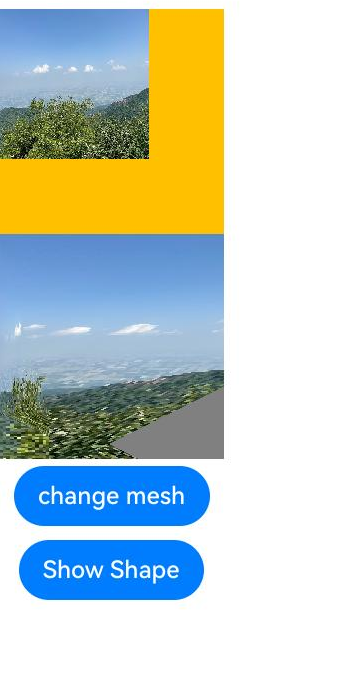

# Drawing Geometric Shapes (Shape)
<!--Kit: ArkUI-->
<!--Subsystem: ArkUI-->
<!--Owner: @zjsxstar-->
<!--Designer: @sunbees-->
<!--Tester: @liuli0427-->
<!--Adviser: @Brilliantry_Rui-->


The drawing components are used to draw graphs on the page. The **Shape** component serves as the parent container for all drawing components, and its attributes are common attributes supported by every drawing component. For details, see [Shape](../reference/apis-arkui/arkui-ts/ts-drawing-components-shape.md).


## Creating a Drawing Component

You can create a drawing component through either of the following approaches:

- Using the **Shape** component as the parental container: This can implement SVG-like effects. The API syntax is as follows:

  ```ts
  Shape(value?: PixelMap)
  ```

  The optional **value** parameter specifies the drawing target. When it is provided, graphics are rendered to the specified **PixelMap** object. If it is omitted, drawing occurs in the current rendering target.

  <!-- @[shape_one](https://gitcode.com/openharmony/applications_app_samples/blob/master/code/DocsSample/ArkUISample/ShapeDrawing/entry/src/main/ets/pages/Shape.ets) -->
  
  ``` TypeScript
  Shape() {
    Rect().width(300).height(50)
  }
  ```


- Using a standalone drawing component for a specific geometric shape. Seven shapes are supported: [Circle](../reference/apis-arkui/arkui-ts/ts-drawing-components-circle.md), [Ellipse](../reference/apis-arkui/arkui-ts/ts-drawing-components-ellipse.md), [Line](../reference/apis-arkui/arkui-ts/ts-drawing-components-line.md), [Polyline](../reference/apis-arkui/arkui-ts/ts-drawing-components-polyline.md), [Polygon](../reference/apis-arkui/arkui-ts/ts-drawing-components-polygon.md), [Path](../reference/apis-arkui/arkui-ts/ts-drawing-components-path.md), and [Rect](../reference/apis-arkui/arkui-ts/ts-drawing-components-rect.md). The following uses the **Circle** API as an example:

  ```ts
  Circle(value?: { width?: string | number, height?: string | number })
  ```

    This API draws a circle where the diameter is determined by the smaller of the width and height values.

  <!-- @[shape_two](https://gitcode.com/openharmony/applications_app_samples/blob/master/code/DocsSample/ArkUISample/ShapeDrawing/entry/src/main/ets/pages/Shape.ets) -->
  
  ``` TypeScript
  Circle({ width: 150, height: 150 })
  ```


  


## Shape Viewport


```ts
viewPort(value: { x?: number | string, y?: number | string, width?: number | string, height?: number | string })
```

Creates a viewport, which is a rectangle in the user space that maps to the view boundary established for the associated SVG element. Among the four optional parameters, **x** and **y** represent the coordinates of the upper left corner of the viewport, and **width** and **height** represent the size of the viewport.

The following examples demonstrate how to use **viewPort**:

- Scaling graphics with **viewPort**:

  <!-- @[view_port_one](https://gitcode.com/openharmony/applications_app_samples/blob/master/code/DocsSample/ArkUISample/ShapeDrawing/entry/src/main/ets/pages/ViewPort1.ets) -->
  
  ``` TypeScript
  class Tmp {
    public x: number = 0;
    public y: number = 0;
    public width: number = 75;
    public height: number = 75;
  }
  
  class TmpOne {
    public x: number = 0;
    public y: number = 0;
    public width: number = 300;
    public height: number = 300;
  }
  
  @Entry
  @Component
  struct ViewPort1 {
    viep: Tmp = new Tmp();
    viep1: TmpOne = new TmpOne();
  
    build() {
      Column() {
        // Draw a circle whose width and height are both 75.
        // Replace $r('app.string.OriginalSizeCircle') with the resource file you use.
        Text($r('app.string.OriginalSizeCircle')).margin({ top: 20 })
        Circle({ width: 75, height: 75 }).fill('rgb(39, 135, 217)')
  
        Row({ space: 10 }) {
          Column() {
            // Create a Shape component with a 150 x 150 size and yellow background. Set the viewport to 75 x 75.
            // Fill the viewport with a blue rectangle and draw a 75-diameter circle in the viewport.
            // After the drawing is complete, the viewport is scaled up to match the component size.
            // Replace $r('app.string.EnlargedCircle') with the resource file you use.
            Text($r('app.string.EnlargedCircle'))
            Shape() {
              Rect().width('100%').height('100%').fill('rgb(39, 135, 217)')
              Circle({ width: 75, height: 75 }).fill('rgb(213, 213, 213)')
            }
            .viewPort(this.viep)
            .width(150)
            .height(150)
            .backgroundColor('rgb(23, 169, 141)')
          }
  
          Column() {
            // Create a Shape component with a 150 x 150 size and yellow background. Set the viewport to 300 x 300.
            // Fill the viewport with a green rectangle and draw a 75-diameter circle in the viewport.
            // After the drawing is complete, the viewport is scaled down to match the component size.
            // Replace $r('app.string.ShrunkCircle') with the resource file you use.
            Text($r('app.string.ShrunkCircle'))
            Shape() {
              Rect().width('100%').height('100%').fill('rgb(213, 213, 213)')
              Circle({ width: 75, height: 75 }).fill('rgb(39, 135, 217)')
            }
            .viewPort(this.viep1)
            .width(150)
            .height(150)
            .backgroundColor('rgb(23, 169, 141)')
          }
        }
      }
    }
  }
  ```

  

- Create a **Shape** component with a 300 x 300 size and yellow background. Set the viewport to 300 x 300. Fill the viewport with a blue rectangle and draw a 75-radius circle in the viewport.

  <!-- @[view_port_two](https://gitcode.com/openharmony/applications_app_samples/blob/master/code/DocsSample/ArkUISample/ShapeDrawing/entry/src/main/ets/pages/ViewPort2.ets) -->
  
  ``` TypeScript
  class TmpTwo {
    public x: number = 0;
    public y: number = 0;
    public width: number = 300;
    public height: number = 300;
  }
  
  @Entry
  @Component
  struct ViewPort2 {
    viep: TmpTwo = new TmpTwo();
  
    build() {
      Column() {
        Shape() {
          Rect().width('100%').height('100%').fill('#0097D4')
          Circle({ width: 150, height: 150 }).fill('#E87361')
        }
        .viewPort(this.viep)
        .width(300)
        .height(300)
        .backgroundColor('#F5DC62')
      }
    }
  }
  ```

  .jpg)

- Create a **Shape** component with a 300 x 300 size and yellow background. Set the viewport to 300 x 300. Fill the viewport with a blue rectangle and draw a 75-radius circle in the viewport. Then, apply a translation of 150 units right and 150 units down to the viewport.

  <!-- @[view_port_three](https://gitcode.com/openharmony/applications_app_samples/blob/master/code/DocsSample/ArkUISample/ShapeDrawing/entry/src/main/ets/pages/ViewPort3.ets) -->
  
  ``` TypeScript
  class TmpThree {
    public x: number = -150;
    public y: number = -150;
    public width: number = 300;
    public height: number = 300;
  }
  
  @Entry
  @Component
  struct ViewPort3 {
    viep: TmpThree = new TmpThree();
  
    build() {
      Column() {
        Shape() {
          Rect().width('100%').height('100%').fill('#0097D4')
          Circle({ width: 150, height: 150 }).fill('#E87361')
        }
        .viewPort(this.viep)
        .width(300)
        .height(300)
        .backgroundColor('#F5DC62')
      }
    }
  }
  ```

  .jpg)


## Setting Styles

> **NOTE**
>
> The example uses the **commands** parameter to define the path. For detailed syntax rules of this parameter, see [SVG Path Syntax](../reference/apis-arkui/arkui-ts/ts-drawing-components-path.md#svg-path-syntax).

You can customize the component style by setting various style attributes.

- Use the [fill](../reference/apis-arkui/arkui-ts/ts-drawing-components-path.md#fill) attribute to set the fill color of the component.

  <!-- @[fill](https://gitcode.com/openharmony/applications_app_samples/blob/master/code/DocsSample/ArkUISample/ShapeDrawing/entry/src/main/ets/pages/Fill.ets) -->
  
  ``` TypeScript
  Path()
    .width(100)
    .height(100)
    .commands('M150 0 L300 300 L0 300 Z')
    .fill('#E87361')
    .strokeWidth(0)
  ```

  

- Use the [stroke](../reference/apis-arkui/arkui-ts/ts-drawing-components-path.md#stroke) attribute to set the stroke color.

  <!-- @[stroke](https://gitcode.com/openharmony/applications_app_samples/blob/master/code/DocsSample/ArkUISample/ShapeDrawing/entry/src/main/ets/pages/Stroke.ets) -->
  
  ``` TypeScript
  Path()
    .width(100)
    .height(100)
    .fillOpacity(0)
    .commands('M150 0 L300 300 L0 300 Z')
    .stroke(Color.Red)
  ```

  

- Use the [strokeOpacity](../reference/apis-arkui/arkui-ts/ts-drawing-components-path.md#strokeopacity) attribute to control stroke opacity.

  <!-- @[stroke_opacity](https://gitcode.com/openharmony/applications_app_samples/blob/master/code/DocsSample/ArkUISample/ShapeDrawing/entry/src/main/ets/pages/StrokeOpacity.ets) -->
  
  ``` TypeScript
  Path()
    .width(100)
    .height(100)
    .fillOpacity(0)
    .commands('M150 0 L300 300 L0 300 Z')
    .stroke(Color.Red)
    .strokeWidth(10)
    .strokeOpacity(0.2)
  ```

  

- Use [strokeLineJoin](../reference/apis-arkui/arkui-ts/ts-drawing-components-polyline.md#strokelinejoin) to define the join style of the stroke. Available options include **Bevel**, **Miter**, and **Round**.

  <!-- @[stroke_line_join](https://gitcode.com/openharmony/applications_app_samples/blob/master/code/DocsSample/ArkUISample/ShapeDrawing/entry/src/main/ets/pages/StrokeLineJoin.ets) -->
  
  ``` TypeScript
  Polyline()
    .width(100)
    .height(100)
    .fillOpacity(0)
    .stroke(Color.Red)
    .strokeWidth(8)
    .points([[20, 0], [0, 100], [100, 90]])
    // Set the join style of the stroke to Round.
    .strokeLineJoin(LineJoinStyle.Round)
  ```

  

- Use [strokeMiterLimit](../reference/apis-arkui/arkui-ts/ts-drawing-components-polyline.md#strokemiterlimit) to set the maximum ratio between the miter length and stroke width.
  The miter length represents the distance from the outer corner point to the inner corner point, while the stroke width is defined by the [strokeWidth](../reference/apis-arkui/arkui-ts/ts-drawing-components-polyline.md#strokewidth) attribute. **strokeMiterLimit** requires values greater than or equal to 1 and takes effect when[strokeLineJoin](../reference/apis-arkui/arkui-ts/ts-drawing-components-polyline.md#strokelinejoin) is set to **LineJoinStyle.Miter**.

  <!-- @[stroke_miter_limit](https://gitcode.com/openharmony/applications_app_samples/blob/master/code/DocsSample/ArkUISample/ShapeDrawing/entry/src/main/ets/pages/StrokeMiterLimit.ets) -->
  
  ``` TypeScript
  Polyline()
    .width(100)
    .height(100)
    .fillOpacity(0)
    .stroke(Color.Red)
    .strokeWidth(10)
    .points([[20, 0], [20, 100], [100, 100]])
    // Set the join style of the stroke to Miter.
    .strokeLineJoin(LineJoinStyle.Miter)
    // Set the maximum ratio between the miter length and stroke width.
    .strokeMiterLimit(1/Math.sin(45))
  Polyline()
    .width(100)
    .height(100)
    .fillOpacity(0)
    .stroke(Color.Red)
    .strokeWidth(10)
    .points([[20, 0], [20, 100], [100, 100]])
    .strokeLineJoin(LineJoinStyle.Miter)
    .strokeMiterLimit(1.42)
  ```

  

- Use [antiAlias](../reference/apis-arkui/arkui-ts/ts-drawing-components-circle.md#antialias) to control whether to enable anti-aliasing. The default value is **true**, indicating that anti-aliasing is enabled.

  <!-- @[antialias_open](https://gitcode.com/openharmony/applications_app_samples/blob/master/code/DocsSample/ArkUISample/ShapeDrawing/entry/src/main/ets/pages/AntiAlias.ets) -->
  
  ``` TypeScript
  // Enable anti-aliasing.
  Circle()
    .width(150)
    .height(200)
    .fillOpacity(0)
    .strokeWidth(5)
    .stroke(Color.Black)
  ```

  

  <!-- @[antialias_close](https://gitcode.com/openharmony/applications_app_samples/blob/master/code/DocsSample/ArkUISample/ShapeDrawing/entry/src/main/ets/pages/AntiAlias.ets) -->
  
  ``` TypeScript
  // Disable anti-aliasing.
  Circle()
    .width(150)
    .height(200)
    .fillOpacity(0)
    .strokeWidth(5)
    .stroke(Color.Black)
    .antiAlias(false)
  ```

  

- Use [mesh](../reference/apis-arkui/arkui-ts/ts-drawing-components-shape.md#mesh8) to set the mesh effect, applying localized image deformation.

  > **NOTE**
  >
  > The example uses the **commands** parameter to define the path. For detailed syntax rules of this parameter, see [SVG Path Syntax](../reference/apis-arkui/arkui-ts/ts-drawing-components-path.md#svg-path-syntax).

  <!-- @[mesh](https://gitcode.com/openharmony/applications_app_samples/blob/master/code/DocsSample/ArkUISample/ShapeDrawing/entry/src/main/ets/pages/Mesh.ets) -->
  
  ``` TypeScript
  import { FrameNode, NodeController, RenderNode } from '@kit.ArkUI';
  import { image } from '@kit.ImageKit';
  import { drawing } from '@kit.ArkGraphics2D';
  
  let offCanvas: OffscreenCanvas = new OffscreenCanvas(150, 150);
  let ctx = offCanvas.getContext('2d');
  
  class DrawingRenderNode extends RenderNode {
    private verts_: Array<number> = [0, 0, 50, 0, 410, 0, 0, 180, 50, 180, 410, 180, 0, 360, 50, 360, 410, 360];
  
    setVerts(verts: Array<number>): void {
      this.verts_ = verts
    }
  
    async draw(context: DrawContext) {
      const canvas = context.canvas;
      let pixelMap = ctx.getPixelMap(0, 0, 150, 150);
      const brush = new drawing.Brush(); // Only brush is supported. There is no drawing effect when pen is used.
      canvas.attachBrush(brush);
      let verts: number[] = [0, 0, 410, 0, 50, 0, 0, 180, 50, 180, 410, 180, 0, 360, 410, 360, 50, 360];
      ; // 18
      canvas.drawPixelMapMesh(pixelMap, 2, 2, verts, 0, null, 0);
      canvas.detachBrush();
    }
  }
  
  const renderNode = new DrawingRenderNode();
  renderNode.frame = {
    x: 0,
    y: 0,
    width: 150,
    height: 150
  };
  
  class MyNodeController extends NodeController {
    private rootNode: FrameNode | null = null;
  
    makeNode(uiContext: UIContext): FrameNode | null {
      this.rootNode = new FrameNode(uiContext);
  
      const rootRenderNode = this.rootNode.getRenderNode();
      if (rootRenderNode !== null) {
        rootRenderNode.appendChild(renderNode);
      }
      return this.rootNode;
    }
  }
  
  @Entry
  @Component
  struct Mesh {
    private myNodeController: MyNodeController = new MyNodeController();
    @State showShape: boolean = false;
    @State pixelMap: image.PixelMap | undefined = undefined;
    @State shapeWidth: number = 150;
    @State strokeWidth: number = 1;
    @State meshArray: Array<number> = [0, 0, 50, 0, 410, 0, 0, 180, 50, 180, 410, 180, 0, 360, 50, 360, 410, 360];
  
    aboutToAppear(): void {
      // Replace 'common/image/image.png' with the image resource file you use.
      let img: ImageBitmap = new ImageBitmap('common/image/image.png');
      ctx.drawImage(img, 0, 0, 100, 100);
      this.pixelMap = ctx.getPixelMap(0, 0, 150, 150);
    }
  
    build() {
      Column() {
        Image(this.pixelMap)
          .backgroundColor('#86C5E3')
          .width(150)
          .height(150)
          .onClick(() => {
            // Replace 'common/image/image.png' with the image resource file you use.
            let img: ImageBitmap = new ImageBitmap('common/image/image.png');
            ctx.drawImage(img, 0, 0, 100, 100);
            this.pixelMap = ctx.getPixelMap(1, 1, 150, 150);
            this.myNodeController.rebuild();
            this.strokeWidth += 1;
          })
  
        NodeContainer(this.myNodeController)
          .width(150)
          .height(150)
          .backgroundColor(Color.Grey)
          .onClick(() => {
            this.meshArray = [0, 0, 50, 0, 410, 0, 0, 180, 50, 180, 410, 180, 0, 360, 50, 360, 410, 360, 0];
          })
        Button('change mesh')
          .margin(5)
          .onClick(() => {
            this.meshArray = [0, 0, 410, 0, 50, 0, 0, 180, 50, 180, 410, 180, 0, 360, 410, 360, 50, 360];
          })
        Button('Show Shape')
          .margin(5)
          .onClick(() => {
            this.showShape = !this.showShape;
          })
  
        if (this.showShape) {
          Shape(this.pixelMap) {
            Path().width(150).height(60).commands('M0 0 L400 0 L400 150 Z')
          }
          .fillOpacity(0.2)
          .backgroundColor(Color.Grey)
          .width(this.shapeWidth)
          .height(150)
          .mesh(this.meshArray, 2, 2)
          .fill(0x317AF7)
          .stroke(0xEE8443)
          .strokeWidth(this.strokeWidth)
          .strokeLineJoin(LineJoinStyle.Miter)
          .strokeMiterLimit(5)
  
          Shape(this.pixelMap) {
            Path().width(150).height(60).commands('M0 0 L400 0 L400 150 Z')
          }
          .fillOpacity(0.2)
          .backgroundColor(Color.Grey)
          .width(this.shapeWidth)
          .height(150)
          .fill(0x317AF7)
          .stroke(0xEE8443)
          .strokeWidth(this.strokeWidth)
          .strokeLineJoin(LineJoinStyle.Miter)
          .strokeMiterLimit(5)
          .onDragStart(() => {
          })
  
          // The mesh attribute only takes effect when a PixelMap object is passed to the Shape component.
          Shape() {
            Path().width(150).height(60).commands('M0 0 L400 0 L400 150 Z')
          }
          .fillOpacity(0.2)
          .backgroundColor(Color.Grey)
          .width(this.shapeWidth)
          .height(150)
          .mesh(this.meshArray, 2, 2)
          .fill(0x317AF7)
          .stroke(0xEE8443)
          .strokeWidth(this.strokeWidth)
          .strokeLineJoin(LineJoinStyle.Miter)
          .strokeMiterLimit(5)
          .onClick(() => {
            this.pixelMap = undefined;
          })
        }
      }
    }
  }
  ```

  

## Example Scenario

### Drawing a Closed Path

  Draw a closed path at (-80, -5). The fill color is 0x317AF7, the stroke width is 3, the stroke color is red, and the stroke join style is miter (default value).

  > **NOTE**
  >
  > The example uses the **commands** parameter to define the path. For detailed syntax rules of this parameter, see [SVG Path Syntax](../reference/apis-arkui/arkui-ts/ts-drawing-components-path.md#svg-path-syntax).

  <!-- @[shape_example](https://gitcode.com/openharmony/applications_app_samples/blob/master/code/DocsSample/ArkUISample/ShapeDrawing/entry/src/main/ets/pages/ShapeExample.ets) -->
  
  ``` TypeScript
  @Entry
  @Component
  struct ShapeExample {
    build() {
      Column({ space: 10 }) {
        Shape() {
          Path().width(200).height(60).commands('M0 0 L400 0 L400 150 Z')
        }
        .viewPort({
          x: -80,
          y: -5,
          width: 500,
          height: 300
        })
        .fill('rgb(213, 213, 213)')
        .stroke('rgb(39, 135, 217)')
        .strokeWidth(3)
        .strokeLineJoin(LineJoinStyle.Miter)
        .strokeMiterLimit(5)
      }.width('100%').margin({ top: 15 })
    }
  }
  ```

  

### Drawing a Circle and Ring

  Draw a circle with a diameter of 150  mm, and a ring with a diameter of 150 mm and a red dotted border. If the width and height differ, the drawing component will use the shorter side as the actual diameter.

  > **NOTE**
  >
  > This example uses the **strokeDashArray** attribute to create a red dashed ring by specifying the pattern of dashes and gaps along the border. For details about **strokeDashArray**, see [strokeDashArray](../reference/apis-arkui/arkui-ts/ts-drawing-components-shape.md#strokedasharray). 

  <!-- @[circle_example_one](https://gitcode.com/openharmony/applications_app_samples/blob/master/code/DocsSample/ArkUISample/ShapeDrawing/entry/src/main/ets/pages/CircleExample.ets) -->
  
  ``` TypeScript
  @Entry
  @Component
  struct CircleExample {
    build() {
      Column({ space: 10 }) {
        // Draw a circle whose diameter is 150.
        Circle({ width: 150, height: 150 })
        // Draw a ring with a diameter of 150 mm and a red dotted border.
        Circle()
          .width(150)
          .height(200)
          .fillOpacity(0)
          .strokeWidth(3)
          .stroke(Color.Red)
          .strokeDashArray([1, 2])
        // ...
      }.width('100%')
    }
  }
  ```

  

### UI Visual Attribute Effects

>  **NOTE**
>
> Universal style attributes such as [backgroundColor](../reference/apis-arkui/arkui-ts/ts-universal-attributes-background.md) and [linearGradient](../reference/apis-arkui/arkui-ts/ts-universal-attributes-gradient-color.md) are applied to the component's background area, not its content area.


  <!-- @[circle_example_two](https://gitcode.com/openharmony/applications_app_samples/blob/master/code/DocsSample/ArkUISample/ShapeDrawing/entry/src/main/ets/pages/CircleExample.ets) -->
  
  ``` TypeScript
  @Entry
  @Component
  struct CircleExample {
    build() {
      Column({ space: 10 }) {
        // ...
        // Draw a circle whose diameter is 150.
        Circle()
          .width(150)
          .height(200)
          .backgroundColor(Color.Pink) // This applies to 150 x 200 rectangular background, not the circular content area.
      }.width('100%')
    }
  }
  ```

  
