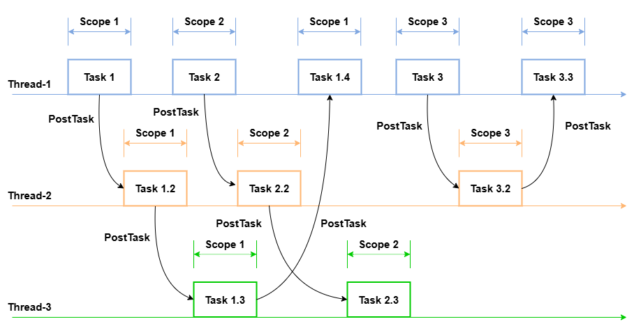

# Using the UI Context API for UI Operations (UIContext)
<!--Kit: ArkUI-->
<!--Subsystem: ArkUI-->
<!--Owner: @xiang-shouxing-->
<!--Designer: @xiang-shouxing-->
<!--Tester: @sally__-->
<!--Adviser: @Brilliantry_Rui-->

This document explains concepts related to multiple UI instances, reasons for replacing global APIs with [UIContext](../reference/apis-arkui/arkts-apis-uicontext-uicontext.md) APIs, and corresponding migration solutions.

## Basic Concepts

**UI instance**: an object managing UI functionalities such as components, layouts, animations, and interaction events. Each window object creates and manages a UI instance.

**UI context**: abstract runtime environment of a UI instance. UI operations are executed within this context and ultimately reflected in the corresponding UI instance.

**Global APIs**: a set of ArkUI-provided global APIs that automatically apply to appropriate UI instances based on the calling context, without requiring explicit UI instance or component specification.

**Calling scope**: a core mechanism ensuring UI instances maintain correct context associations during asynchronous task execution. It establishes a clear context identification system to accurately map asynchronous operations to their originating UI instances. This process involves four steps:

- Registration: Unique identifiers are automatically generated during UI instance initialization.

- Context binding: Instance identifiers are automatically attached to tasks initiated by UI instances.

- Scope protection: Identifier propagation is preserved across asynchronous boundaries (including Node-API calls, promises, and Worker communication)

- Context recovery: Original UI instance identifiers are restored during asynchronous task execution.

The following figure illustrates the execution scenario of asynchronous tasks in a multithreaded environment. In this example, Task 1 starts execution on Thread 1, then dispatches Task 1.2 to Thread 2 during its execution. When dispatching the task, it carries a UI context identifier. After Task 1.2 completes, it dispatches Task 1.3 to Thread 3, and once Task 1.3 finishes, it returns Task 1.4 back to Thread 1. The same thread may execute tasks from different windows sequentially. While a task is executed, the UI context identifier carried by the task determines which window the task belongs to, ensuring that asynchronous operations are correctly associated with the corresponding UI instance.

**Figure 1** Calling scope principle



## Ambiguous UI Context

An ambiguous UI context occurs when the target UI instance cannot be clearly identified at the call site when invoking ArkUI global APIs.

Currently, the system supports two [application models](../application-models/application-models.md): the FA model and the stage model. In the FA model, each UI instance runs on an independent ArkTS engine. Global APIs can be traced to the corresponding UI instance via the engine, ensuring a clear UI context.

In the stage model, multiple UI instances can coexist within a single ArkTS engine. Global APIs determine the current UI context by analyzing context information in the call chain. However, asynchronous APIs and non-UI APIs may fail to trace context correctly.

To ensure the reliable functionality of global APIs in multi-instance scenarios, replace them with UIContext APIs.

The following figure illustrates the relationship between the ArkTS engine and UI contexts in the Stage model. One ArkTS engine contains two [Ability](../application-models/abilitykit-overview.md) instances, which correspond to three windows, with each window representing an independent ArkUI instance.

**Figure 2** Relationship between multiple instances


## Replacing Global APIs with UIContext APIs

The table below lists common API replacements for multi-instance scenarios. For the full list of supported APIs, see [UIContext](../reference/apis-arkui/arkts-apis-uicontext-uicontext.md).

In the sample code, [isAvailable](../reference/apis-arkui/arkts-apis-uicontext-uicontext.md#isavailable20) is available since API version 20, with other APIs available since version 18.

|               Global API               |               Substitute API               |            Description           |
| :-----------------------------------: | :-----------------------------------: | :------------------------: |
|            @ohos.animator             |            createAnimator             |      Custom animation controller.     |
|     @ohos.arkui.componentSnapshot     |         getComponentSnapshot          |          Component snapshot.         |
|      @ohos.arkui.componentUtils       |           getComponentUtils           |         Component utility class.        |
|      @ohos.arkui.dragController       |           getDragController           |         Drag controller.        |
|         @ohos.arkui.inspector         |            getUIInspector             |        Component layout callback.       |
|         @ohos.arkui.observer          |             getUIObserver             |          Observer.         |
|              @ohos.font               |                getFont                |         Custom font registration.        |
|             @ohos.measure             |            getMeasureUtil             |          Text measurement.         |
|           @ohos.mediaquery            |             getMediaQuery             |          Media query.         |
|          @ohos.promptAction           |            getPromptAction            |            Popup.           |
|             @ohos.router              |               getRouter               |          Page routing.         |
|              AlertDialog              |            showAlertDialog            |          Alert dialog box.         |
|              ActionSheet              |            showActionSheet            |        Action sheet.       |
|         CalendarPickerDialog          |                Not supported                |       Calendar picker dialog box.      |
|           DatePickerDialog            |         showDatePickerDialog          |      Date picker dialog box.     |
|           TimePickerDialog            |         showTimePickerDialog          |     Time picker dialog box.    |
|           TextPickerDialog            |         showTextPickerDialog          |     Text picker dialog box.    |
|              ContextMenu              |       getContextMenuController        |          Menu control.         |
| vp2px/px2vp/fp2px/px2fp/lpx2px/px2lpx | vp2px/px2vp/fp2px/px2fp/lpx2px/px2lpx |        Pixel unit conversion.       |
|             focusControl              |            getFocusControl            |          Focus control.         |
|             cursorControl             |           getCursorControl            |          Cursor control.         |
|              getContext               |            getHostContext             | Obtains the context of the current ability.|
|        LocalStorage.getShared         |         getSharedLocalStorage         |  Obtains the storage passed by the current ability. |
|               animateTo               |               animateTo               |          Triggers an explicit animation.         |
|         animateToImmediately          |                Not supported                |        Triggers an immediate explicit animation.       |

## Replacing Global APIs with Common UIContext APIs

The following uses [pixel unit conversion](../reference/apis-arkui/arkui-ts/ts-pixel-units.md) as an example to illustrate how to replace global APIs with common UIContext APIs.

### Obtaining UIContext Through a Custom Component

When a global API is invoked within a [custom component](./ui-js-custom-components.md)'s scope, such as in a member method or component lifecycle method, and **this** references the custom component, you can call the [getUIContext](../reference/apis-arkui/arkui-ts/ts-custom-component-api.md#getuicontext) member method of the custom component to obtain the UIContext object.

>**NOTE**
> 1. If **getUIContext** is used in an asynchronous callback, or if the API call originates outside the current page, the call may execute after the custom component has been destroyed, resulting in **undefined** being returned.
> 2. This method can only be invoked via **this**. It cannot be called through a custom component object instantiated with the **new** keyword.
> 3. The UIContext obtained from a custom node created using a [custom declarative node (BuilderNode)](./arkts-user-defined-arktsNode-builderNode.md) points to the same UI instance as the UIContext associated with the BuilderNode itself.

Using the global API:
<!--deprecated_code_no_check-->

```ts
// pages/NewGlobal.ets
import { hilog } from '@kit.PerformanceAnalysisKit';

const DOMAIN = 0x0000;

@Entry
@Component
struct Index {
  build() {
    RelativeContainer() {
      Text('Calculate 20vp to px')
        .fontWeight(FontWeight.Bold)
        .alignRules({
          center: { anchor: '__container__', align: VerticalAlign.Center },
          middle: { anchor: '__container__', align: HorizontalAlign.Center }
        })
        .onClick(() => {
          let pxValue = vp2px(20);
        })
    }
    .height('100%')
    .width('100%')
  }
}
```

Using the UIContext API (recommended):

<!-- @[Main_NewGlobal](https://gitcode.com/openharmony/applications_app_samples/blob/master/code/DocsSample/ArkUISample/UIContext/entry/src/main/ets/pages/NewGlobal.ets) --> 

``` TypeScript
// pages/NewGlobal.ets
import { hilog } from '@kit.PerformanceAnalysisKit';

const DOMAIN = 0x0000;

@Entry
@Component
struct Index {
  build() {
    RelativeContainer() {
      Text('Calculate 20vp to px')
        .fontWeight(FontWeight.Bold)
        .alignRules({
          center: { anchor: '__container__', align: VerticalAlign.Center },
          middle: { anchor: '__container__', align: HorizontalAlign.Center }
        })
        .onClick(() => {
          let uiContext = this.getUIContext();
          let pxValue = uiContext.vp2px(20);
          hilog.info(DOMAIN, 'testTag', `20vp equals to ${pxValue}px`);
        })
    }
    .height('100%')
    .width('100%')
  }
}
```

### Obtaining the UIContext Object Through the Window Object

Use the [getUIContext](../reference/apis-arkui/arkts-apis-window-Window.md#getuicontext10) method of the **Window** object to obtain the UIContext object.

>**NOTE**
>
>1. The UIContext can only be obtained via the **getUIContext** method of the **Window** object after the UI instance is created. You are advised to call this method in the success callback of **loadContent** to ensure that the UI instance is fully initialized.
>2. If the UI instance is not yet created, **vp2px**/**px2vp** will use default values for calculations. When migrating to UIContext, you can retrieve the logical pixel density of the current default [Display](../reference/apis-arkui/js-apis-display.md#display) object for calculations. For details, see [Replacing Pixel Unit Conversion APIs with UIContext APIs](#replacing-pixel-unit-conversion-apis-with-uicontext-apis).

Using the global API:
<!--deprecated_code_no_check-->

```ts
// entryability/EntryAbility.ets
import { AbilityConstant, ConfigurationConstant, UIAbility, Want } from '@kit.AbilityKit';
import { hilog } from '@kit.PerformanceAnalysisKit';
import { window } from '@kit.ArkUI';

const DOMAIN = 0x0000;

export default class EntryAbility extends UIAbility {
  // ...

  onWindowStageCreate(windowStage: window.WindowStage): void {
    hilog.info(DOMAIN, 'testTag', '%{public}s', 'Ability onWindowStageCreate');
    // Calling vp2px before loadContent returns results based on the screen's default pixel density.
    let pxValue = vp2px(20);
    hilog.info(DOMAIN, 'testTag', `20vp equals to ${pxValue}px`);
    windowStage.loadContent('pages/Index', (err) => {
      if (err.code) {
        hilog.error(DOMAIN, 'testTag', 'Failed to load the content. Cause: %{public}s', JSON.stringify(err));
        return;
      }
      // This logic must be executed in the callback.
      let pxValue = vp2px(20);
      hilog.info(DOMAIN, 'testTag', `20vp equals to ${pxValue}px`);
    });
    // loadContent is asynchronous . The UI instance may not exist here.
    pxValue = vp2px(20);
    hilog.info(DOMAIN, 'testTag', `20vp equals to ${pxValue}px`);
  }

  // ...
}
```
Using the UIContext API (recommended):

<!-- @[Common_UIContext](https://gitcode.com/openharmony/applications_app_samples/blob/master/code/DocsSample/ArkUISample/UIContext/entry/src/main/ets/entryability/EntryAbility.ets) --> 

``` TypeScript
// entryability/EntryAbility.ets
import { AbilityConstant, UIAbility, Want } from '@kit.AbilityKit';
import { hilog } from '@kit.PerformanceAnalysisKit';
import { window } from '@kit.ArkUI';
import { ContextUtils } from '../Common/ContextUtils';
import { WindowUIContextUtils } from '../Common/WindowUtils';
import { PixelUtils } from '../Common/UIContext';
import { PixelUtil } from '../Common/Utils';

const DOMAIN = 0x0000;

export default class EntryAbility extends UIAbility {
  // ...
  onWindowStageCreate(windowStage: window.WindowStage): void {
    hilog.info(DOMAIN, 'testTag', '%{public}s', 'Ability onWindowStageCreate');
    let localStorage = new LocalStorage();
    localStorage.setOrCreate('message', 'Message from Storage')
    hilog.info(DOMAIN, 'testTag', '%{public}s', 'success localStorage');
    let window = windowStage.getMainWindowSync();
    // Register the main window callback.
    WindowUIContextUtils.registerWindowCallback(window);
    // The UIContext is unavailable before loadContent completes (UI instance is not yet created).
    windowStage.loadContent('pages/Index', localStorage, (err) => {
      // The UIContext needs to be obtained after loadContent completes.
      if (err.code) {
        hilog.error(DOMAIN, 'testTag', 'Failed to load the content. Cause: %{public}s', JSON.stringify(err));
        return;
      }
      hilog.info(DOMAIN, 'testTag', `loadContent success.`);
      // This logic must be executed in the callback.
      try {
        let uiContext = window.getUIContext();
        PixelUtils.setUIContext(uiContext);
        // The main window may gain focus before loadContent completes. Explicitly set it to ensure validity after the main window has focus.
        WindowUIContextUtils.setActiveUIContext(uiContext)
        if (!uiContext) {
          hilog.error(DOMAIN, 'testTag', `Can't get UIContext`);
          return;
        }
        let pxValue = uiContext.vp2px(20);
        hilog.info(DOMAIN, 'testTag', `20vp equals to ${pxValue}px`);
      } catch (e) {
        hilog.error(DOMAIN, 'testTag', `Can't get UIContext, ${e}`);
      }
      // loadContent is asynchronous . The UI instance may not exist here.
    });
  }

  // ...

  onWindowStageDestroy(): void {
    hilog.info(DOMAIN, 'testTag', '%{public}s', 'Ability onWindowStageDestroy');
    // Remove the invalid UIContext when the window is destroyed.
    PixelUtil.removeUIContext();
  }

  // ...
}

```
### Obtaining the UIContext Object Using a Static Method
Starting from API version 22, you can retrieve the UIContext object using the static method [resolveUIContext](../reference/apis-arkui/arkts-apis-uicontext-uicontext.md#resolveuicontext22) of the **UIContext** class.

>**NOTE**
> - It is recommended that you obtain the UIContext through custom components or window objects, as these methods yield predictable results unaffected by the calling scope.
> - While replacing global APIs with this static method ensures behavior consistency at the same call site, it does not guarantee the UIContext maps to the intended UI instance.

The following examples demonstrate replacing global APIs with the static method at different execution stages.

Using the global API:
<!--deprecated_code_no_check-->

``` TypeScript
// entryability/EntryAbility.ets
import { AbilityConstant, ConfigurationConstant, UIAbility, Want } from '@kit.AbilityKit';
import { hilog } from '@kit.PerformanceAnalysisKit';
import { window } from '@kit.ArkUI';

const DOMAIN = 0x0000;

export default class EntryAbility extends UIAbility {
  // ...

  onWindowStageCreate(windowStage: window.WindowStage): void {
    hilog.info(DOMAIN, 'testTag', '%{public}s', 'Ability onWindowStageCreate');
    // Called before loadContent: No UI instance exists, so vp2px uses the screen's default pixel density.
    let pxValue = vp2px(20);
    hilog.info(DOMAIN, 'testTag', `20vp equals to ${pxValue}px`);
    windowStage.loadContent('pages/Index', (err) => {
      if (err.code) {
        hilog.error(DOMAIN, 'testTag', 'Failed to load the content. Cause: %{public}s', JSON.stringify(err));
        return;
      }
      // Called in the loadContent callback: The UI instance exists but the context is ambiguous; therefore, the method uses the main window's pixel density.
      let pxValue = vp2px(20);
      hilog.info(DOMAIN, 'testTag', `20vp equals to ${pxValue}px`);
    });
    // loadContent is asynchronous . The UI instance may not exist here.
    pxValue = vp2px(20);
    hilog.info(DOMAIN, 'testTag', `20vp equals to ${pxValue}px`);
  }

  // ...
}
```

<!--deprecated_code_no_check-->
``` TypeScript
// pages/Index.ets
import { hilog } from '@kit.PerformanceAnalysisKit';

const DOMAIN = 0x0000;

@Entry
@Component
struct Index {
  build() {
    RelativeContainer() {
      Text('Calculate 20vp to px')
        .fontWeight(FontWeight.Bold)
        .alignRules({
          center: { anchor: '__container__', align: VerticalAlign.Center },
          middle: { anchor: '__container__', align: HorizontalAlign.Center }
        })
        .onClick(() => {
          // Called when the UI instance is available and the context is clear. In this case, the calculation result is returned based on the pixel density of the instance corresponding to the UI context.
          let pxValue = vp2px(20);
        })
    }
    .height('100%')
    .width('100%')
  }
}
```

Using the static method for replacement:

<!-- @[Common_Entry](https://gitcode.com/openharmony/applications_app_samples/blob/master/code/DocsSample/ArkUISample/ResolvedUIContext/entry/src/main/ets/entryability/EntryAbility.ets) -->  

``` TypeScript
// entryability/EntryAbility.ets
import { AbilityConstant, ConfigurationConstant, UIAbility, Want } from '@kit.AbilityKit';
import { hilog } from '@kit.PerformanceAnalysisKit';
import { window, UIContext } from '@kit.ArkUI';

const DOMAIN = 0x0000;

export default class EntryAbility extends UIAbility {
  onCreate(want: Want, launchParam: AbilityConstant.LaunchParam): void {
    try {
      this.context.getApplicationContext().setColorMode(ConfigurationConstant.ColorMode.COLOR_MODE_NOT_SET);
    } catch (err) {
      hilog.error(DOMAIN, 'testTag', 'Failed to set colorMode. Cause: %{public}s', JSON.stringify(err));
    }
    hilog.info(DOMAIN, 'testTag', '%{public}s', 'Ability onCreate');
  }

  onDestroy(): void {
    hilog.info(DOMAIN, 'testTag', '%{public}s', 'Ability onDestroy');
  }

  onWindowStageCreate(windowStage: window.WindowStage): void {
    hilog.info(DOMAIN, 'testTag', '%{public}s', 'Ability onWindowStageCreate');
    // Called before loadContent: No UI instance exists, so vp2px uses the screen's default pixel density.
    // The resolution strategy (ResolveStrategy) of the UIContext object is UNDEFINED.
    let resolvedUIContext = UIContext.resolveUIContext();
    let pxValue = resolvedUIContext.vp2px(20);
    hilog.info(DOMAIN, 'testTag', `20vp equals to ${pxValue}px`);
    windowStage.loadContent('pages/Index', (err) => {
      if (err.code) {
        hilog.error(DOMAIN, 'testTag', 'Failed to load the content. Cause: %{public}s', JSON.stringify(err));
        return;
      }
      // Called in the loadContent callback: The UI instance exists but the context is ambiguous; therefore, the method uses the main window's pixel density.
      // The resolution strategy (ResolveStrategy) of the UIContext object is UNIQUE.
      let resolvedUIContext = UIContext.resolveUIContext();
      let pxValue = resolvedUIContext.vp2px(20);
      hilog.info(DOMAIN, 'testTag', `20vp equals to ${pxValue}px`);
    });
    // loadContent is asynchronous . The UI instance may not exist here.
    pxValue = vp2px(20);
    hilog.info(DOMAIN, 'testTag', `20vp equals to ${pxValue}px`);
  }

  onWindowStageDestroy(): void {
    hilog.info(DOMAIN, 'testTag', '%{public}s', 'Ability onWindowStageDestroy');
  }

  onForeground(): void {
    hilog.info(DOMAIN, 'testTag', '%{public}s', 'Ability onForeground');
  }

  onBackground(): void {
    hilog.info(DOMAIN, 'testTag', '%{public}s', 'Ability onBackground');
  }
}
```

<!-- @[Common_Index](https://gitcode.com/openharmony/applications_app_samples/blob/master/code/DocsSample/ArkUISample/ResolvedUIContext/entry/src/main/ets/pages/Index.ets) -->  

``` TypeScript
// pages/Index.ets
import { hilog } from '@kit.PerformanceAnalysisKit';
import { UIContext } from '@kit.ArkUI';

const DOMAIN = 0x0000;

@Entry
@Component
struct Index {
  build() {
    RelativeContainer() {
      Text('Calculate 20vp to px')
        .fontWeight(FontWeight.Bold)
        .alignRules({
          center: { anchor: '__container__', align: VerticalAlign.Center },
          middle: { anchor: '__container__', align: HorizontalAlign.Center }
        })
        .onClick(() => {
          // Called when the UI instance is available and the context is clear. In this case, the calculation result is returned based on the pixel density of the instance corresponding to the UI context.
          // The resolution strategy (ResolveStrategy) of the UIContext object is CALLING_SCOPE.
          let resolvedUIContext = UIContext.resolveUIContext();
          let pxValue = resolvedUIContext.vp2px(20);
        })
    }
    .height('100%')
    .width('100%')
  }
}
```

The logic of [resolveUIContext](../reference/apis-arkui/arkts-apis-uicontext-uicontext.md#resolveuicontext22) mirrors the fallback mechanism in the example below, which uses basic query APIs to determine the appropriate UIContext:

<!-- @[Common_Utils](https://gitcode.com/openharmony/applications_app_samples/blob/master/code/DocsSample/ArkUISample/ResolvedUIContext/entry/src/main/ets/common/Utils.ets) -->

``` TypeScript
function GetUIContextByAtomicInterface(): UIContext {
  let callingScopeUIContext = UIContext.getCallingScopeUIContext();
  if (callingScopeUIContext) {
    hilog.info(0x00, 'testTag', `Get UIContext of calling scope.`)
    return callingScopeUIContext;
  }
  let allContexts = UIContext.getAllUIContexts();
  let length = allContexts.length;
  if (length === 1) {
    hilog.info(0x00, 'testTag', `Get UIContext of unique UI instance.`)
    return allContexts[0];
  }
  let lastFocusedUIContext = UIContext.getLastFocusedUIContext();
  if (lastFocusedUIContext) {
    hilog.info(0x00, 'testTag', `Get UIContext of last focused instance.`)
    return lastFocusedUIContext;
  }
  let lastForegroundUIContext = UIContext.getLastForegroundUIContext();
  if (lastForegroundUIContext) {
    hilog.info(0x00, 'testTag', `Get UIContext of last foregrounded instance.`)
    return lastForegroundUIContext;
  }
  if (length !== 0) {
    hilog.info(0x00, 'testTag', `Get UIContext with maximum instanceId.`)
    return allContexts[length - 1];
  }
  hilog.info(0x00, 'testTag', `Get UIContext of undefined calling scope.`)
  return new UIContext();
}
```

To customize UIContext retrieval logic (for example, exclude certain default rules), combine the basic query APIs above to implement behavior tailored to your service requirements.

### Obtaining the UI Context in Encapsulated APIs

Global APIs are typically used within encapsulated APIs. In such scenarios, it is recommended that you add UIContext-type input parameters. If an application has only one window, you can store the UIContext in a global storage object.

>**NOTE**
>1. UI instance creation is an asynchronous process. You must call the **getUIContext** API of the **Window** object in the callback to retrieve the UIContext object.
>2. To allow callers to pass a UIContext explicitly, add optional UIContext-type input parameters.
>3. If the UI instance is not yet created, **vp2px**/**px2vp** will use default values for calculations. When migrating to UIContext, you can retrieve the logical pixel density of the current default **Display** object for calculations. For details, see [Replacing Pixel Unit Conversion APIs with UIContext APIs](#replacing-pixel-unit-conversion-apis-with-uicontext-apis).

Using the global API:
<!--deprecated_code_no_check-->

```ts
// common/Utils.ets
class PixelUtils {
  static vp2px(vpValue: number) : number {
    return vp2px(vpValue);
  }

  static fp2px(fpValue: number) : number | undefined {
    return fp2px(fpValue);
  }

  static lpx2px(lpxValue: number) : number | undefined {
    return lpx2px(lpxValue);
  }
}
```

Using the UIContext API (recommended):

<!-- @[Common_Utils](https://gitcode.com/openharmony/applications_app_samples/blob/master/code/DocsSample/ArkUISample/UIContext/entry/src/main/ets/Common/Utils.ets) -->

``` TypeScript
// common/Utils.ets
import { hilog } from '@kit.PerformanceAnalysisKit';

const DOMAIN = 0x0000;

export class PixelUtil {
  static uiContext: UIContext | undefined;

  static setUIContext(uiContext: UIContext): void {
    PixelUtil.uiContext = uiContext;
  }

  static removeUIContext(): void {
    PixelUtil.uiContext = undefined;
  }

  static vp2px(vpValue: number, uiContext?: UIContext): number | undefined {
    let _uiContext = uiContext ?? PixelUtil.uiContext;
    if (!_uiContext || !_uiContext.isAvailable()) {
      hilog.error(DOMAIN, 'testTag', `Can't get UIContext`);
      return undefined;
    }
    return _uiContext.vp2px(vpValue)
  }

  static fp2px(fpValue: number, uiContext?: UIContext): number | undefined {
    let _uiContext = uiContext ?? PixelUtil.uiContext;
    if (!_uiContext || !_uiContext.isAvailable()) {
      hilog.error(DOMAIN, 'testTag', `Can't get UIContext`);
      return undefined;
    }
    return _uiContext.fp2px(fpValue)
  }

  lpx2px(lpxValue: number, uiContext?: UIContext): number | undefined {
    let _uiContext = uiContext ?? PixelUtil.uiContext;
    if (!_uiContext || !_uiContext.isAvailable()) {
      hilog.error(DOMAIN, 'testTag', `Can't get UIContext`);
      return undefined;
    }
    return _uiContext.lpx2px(lpxValue)
  }
}
```
<!-- @[Common_UIContext](https://gitcode.com/openharmony/applications_app_samples/blob/master/code/DocsSample/ArkUISample/UIContext/entry/src/main/ets/entryability/EntryAbility.ets) -->

``` TypeScript
// entryability/EntryAbility.ets
import { AbilityConstant, UIAbility, Want } from '@kit.AbilityKit';
import { hilog } from '@kit.PerformanceAnalysisKit';
import { window } from '@kit.ArkUI';
import { ContextUtils } from '../Common/ContextUtils';
import { WindowUIContextUtils } from '../Common/WindowUtils';
import { PixelUtils } from '../Common/UIContext';
import { PixelUtil } from '../Common/Utils';

const DOMAIN = 0x0000;

export default class EntryAbility extends UIAbility {
  // ...
  onWindowStageCreate(windowStage: window.WindowStage): void {
    hilog.info(DOMAIN, 'testTag', '%{public}s', 'Ability onWindowStageCreate');
    let localStorage = new LocalStorage();
    localStorage.setOrCreate('message', 'Message from Storage')
    hilog.info(DOMAIN, 'testTag', '%{public}s', 'success localStorage');
    let window = windowStage.getMainWindowSync();
    // Register the main window callback.
    WindowUIContextUtils.registerWindowCallback(window);
    // The UIContext is unavailable before loadContent completes (UI instance is not yet created).
    windowStage.loadContent('pages/Index', localStorage, (err) => {
      // The UIContext needs to be obtained after loadContent completes.
      if (err.code) {
        hilog.error(DOMAIN, 'testTag', 'Failed to load the content. Cause: %{public}s', JSON.stringify(err));
        return;
      }
      hilog.info(DOMAIN, 'testTag', `loadContent success.`);
      // This logic must be executed in the callback.
      try {
        let uiContext = window.getUIContext();
        PixelUtils.setUIContext(uiContext);
        // The main window may gain focus before loadContent completes. Explicitly set it to ensure validity after the main window has focus.
        WindowUIContextUtils.setActiveUIContext(uiContext)
        if (!uiContext) {
          hilog.error(DOMAIN, 'testTag', `Can't get UIContext`);
          return;
        }
        let pxValue = uiContext.vp2px(20);
        hilog.info(DOMAIN, 'testTag', `20vp equals to ${pxValue}px`);
      } catch (e) {
        hilog.error(DOMAIN, 'testTag', `Can't get UIContext, ${e}`);
      }
      // loadContent is asynchronous . The UI instance may not exist here.
    });
  }

  // ...

  onWindowStageDestroy(): void {
    hilog.info(DOMAIN, 'testTag', '%{public}s', 'Ability onWindowStageDestroy');
    // Remove the invalid UIContext when the window is destroyed.
    PixelUtil.removeUIContext();
  }

  // ...
}

```

When using the encapsulated substitute API, pass the **UIContext** parameter if it is available.

<!-- @[Main_VpPage](https://gitcode.com/openharmony/applications_app_samples/blob/master/code/DocsSample/ArkUISample/UIContext/entry/src/main/ets/pages/VpPage.ets) -->

``` TypeScript
// pages/VpPage.ets
import { hilog } from '@kit.PerformanceAnalysisKit';
import { PixelUtil } from '../Common/Utils';

const DOMAIN = 0x0000;

@Entry
@Component
struct Index {
  build() {
    RelativeContainer() {
      Text('Caculate 20vp to px')
        .fontWeight(FontWeight.Bold)
        .alignRules({
          center: { anchor: '__container__', align: VerticalAlign.Center },
          middle: { anchor: '__container__', align: HorizontalAlign.Center }
        })
        .onClick(() => {
          let pxValue = PixelUtil.vp2px(20, this.getUIContext());
          hilog.info(DOMAIN, 'testTag', `20vp equals to ${pxValue}px`);
        })
    }
    .height('100%')
    .width('100%')
  }
}
```

If **UIContext** is unavailable, call the method directly.

<!-- @[Common_pxValue](https://gitcode.com/openharmony/applications_app_samples/blob/master/code/DocsSample/ArkUISample/UIContext/entry/src/main/ets/entryability/EntryAbility.ets) -->

``` TypeScript
let pxValue = PixelUtils.vp2px(20);
hilog.info(DOMAIN, 'testTag', `20vp equals to ${pxValue}px`);
```


### Obtaining the UIContext Object Through the Recently Focused Window

If an application has multiple windows and the **UIContext** object cannot be directly retrieved, you can obtain it from the window that recently gains focus.

>**NOTE**
> 1. This approach relies on tracking the most recently focused window. However, the window may lose focus by the time the function is called.
> 2. When creating a window, you must call **registerWindowCallback** to register a callback for focus tracking.

Using the UIContext API (recommended):

<!-- @[Common_WindowUtils](https://gitcode.com/openharmony/applications_app_samples/blob/master/code/DocsSample/ArkUISample/UIContext/entry/src/main/ets/Common/WindowUtils.ets) -->

``` TypeScript
// common/WindowUtils.ets
import { display, window } from '@kit.ArkUI';
import { hilog } from '@kit.PerformanceAnalysisKit';

const DOMAIN = 0x0000;

export class WindowUIContextUtils {
  public static activeUIContext: UIContext | undefined;

  static registerWindowCallback(windowClass: window.Window): void {
    try {
      windowClass.on('windowEvent', (event: window.WindowEventType) => {
        if (event === window.WindowEventType.WINDOW_ACTIVE) {
          try {
            let uiContext = windowClass.getUIContext();
            WindowUIContextUtils.activeUIContext = uiContext;
          } catch (exception) {
            hilog.error(DOMAIN, 'testTag', `Can't get UIContext, ${exception}`);
          }
        }
      });
    } catch (exception) {
      console.error(`Failed to unregister callback. Cause: ${exception}`);
    }
  }

  static unregisterWindowCallback(windowClass: window.Window): void {
    windowClass.off('windowEvent');
  }

  static setActiveUIContext(uiContext: UIContext): void {
    WindowUIContextUtils.activeUIContext = uiContext;
  }

  static vp2px(vpValue: number, uiContext?: UIContext): number {
    let _uiContext = uiContext ?? WindowUIContextUtils.activeUIContext;
    if (!_uiContext || !_uiContext.isAvailable()) {
      let displayClass = display.getDefaultDisplaySync();
      let density = displayClass.densityPixels;
      return vpValue * density;
    }

    return _uiContext.vp2px(vpValue);
  }
}
```
<!-- @[Common_registerWindowCallback](https://gitcode.com/openharmony/applications_app_samples/blob/master/code/DocsSample/ArkUISample/UIContext/entry/src/main/ets/entryability/EntryAbility.ets) -->

``` TypeScript
// entryability/EntryAbility.ets
import { AbilityConstant, UIAbility, Want } from '@kit.AbilityKit';
import { hilog } from '@kit.PerformanceAnalysisKit';
import { window } from '@kit.ArkUI';
import { ContextUtils } from '../Common/ContextUtils';
import { WindowUIContextUtils } from '../Common/WindowUtils';
import { PixelUtils } from '../Common/UIContext';
import { PixelUtil } from '../Common/Utils';

const DOMAIN = 0x0000;

export default class EntryAbility extends UIAbility {
  // ...
  onWindowStageCreate(windowStage: window.WindowStage): void {
    hilog.info(DOMAIN, 'testTag', '%{public}s', 'Ability onWindowStageCreate');
    let localStorage = new LocalStorage();
    localStorage.setOrCreate('message', 'Message from Storage')
    hilog.info(DOMAIN, 'testTag', '%{public}s', 'success localStorage');
    let window = windowStage.getMainWindowSync();
    // Register the main window callback.
    WindowUIContextUtils.registerWindowCallback(window);
    // The UIContext is unavailable before loadContent completes (UI instance is not yet created).
    windowStage.loadContent('pages/Index', localStorage, (err) => {
      // The UIContext needs to be obtained after loadContent completes.
      if (err.code) {
        hilog.error(DOMAIN, 'testTag', 'Failed to load the content. Cause: %{public}s', JSON.stringify(err));
        return;
      }
      hilog.info(DOMAIN, 'testTag', `loadContent success.`);
      // This logic must be executed in the callback.
      try {
        let uiContext = window.getUIContext();
        PixelUtils.setUIContext(uiContext);
        // The main window may gain focus before loadContent completes. Explicitly set it to ensure validity after the main window has focus.
        WindowUIContextUtils.setActiveUIContext(uiContext)
        if (!uiContext) {
          hilog.error(DOMAIN, 'testTag', `Can't get UIContext`);
          return;
        }
        let pxValue = uiContext.vp2px(20);
        hilog.info(DOMAIN, 'testTag', `20vp equals to ${pxValue}px`);
      } catch (e) {
        hilog.error(DOMAIN, 'testTag', `Can't get UIContext, ${e}`);
      }
      // loadContent is asynchronous . The UI instance may not exist here.
    });
  }

  onWindowStageWillDestroy(windowStage: window.WindowStage) {
    let window = windowStage.getMainWindowSync();
    hilog.info(DOMAIN, 'testTag', '%{public}s', `The main window: ${window}`);
    // Unregister the main window callback.
    WindowUIContextUtils.unregisterWindowCallback(window);
  }

  // ...
}

```
<!-- @[Main_WindowTestPage](https://gitcode.com/openharmony/applications_app_samples/blob/master/code/DocsSample/ArkUISample/UIContext/entry/src/main/ets/pages/WindowTestPage.ets) -->

``` TypeScript
// pages/WindowTestPage.ets
import { hilog } from '@kit.PerformanceAnalysisKit';
import { window } from '@kit.ArkUI';
import { BusinessError } from '@kit.BasicServicesKit';
import { WindowUIContextUtils } from '../Common/WindowUtils';

const DOMAIN = 0x0000;

@Entry
@Component
struct Index {
  private subWindow: window.Window | undefined;

  build() {
    Column() {
      Text('Create SubWindow')
        .onClick(() => {
          let config: window.Configuration = {
            name: 'test',
            windowType: window.WindowType.TYPE_DIALOG,
            ctx: this.getUIContext().getHostContext()
          };
          try {
            window.createWindow(config, (err: BusinessError, windowClass: window.Window) => {
              const errCode: number = err.code;
              if (errCode) {
                hilog.error(DOMAIN, 'testTag', `Failed to create the window. Cause: ${errCode}`);
                return;
              }
              // Register the callback after the window is created.
              this.subWindow = windowClass;
              try {
                windowClass.setUIContent('pages/Index', () => {
                  WindowUIContextUtils.registerWindowCallback(windowClass);
                  windowClass.resize(500, 1000);
                  windowClass.showWindow();
                });
              } catch (exception) {
                hilog.error(DOMAIN, 'testTag', `Failed to setUIContent. Cause : ${exception}`);
              }
            });
          } catch (exception) {
            hilog.error(DOMAIN, 'testTag', `Failed to create the window. Cause : ${exception}`);
          }
        })
      Text('Destroy SubWindow')
        .onClick(() => {
          if (this.subWindow) {
            // Unregister the callback before the window is destroyed.
            WindowUIContextUtils.unregisterWindowCallback(this.subWindow);
            this.subWindow.destroyWindow();
          }
        })
    }
    .height('100%')
    .width('100%')
  }
}
```

### Executing the Closure Bound to a UI Instance

If the UIContext object does not provide an alternative API (for example, **CalendarPickerDialog**) or if the developer-implemented behavior is instance-dependent (for example, a code block requiring binding to a specific instance), you can use the [runScopedTask](../reference/apis-arkui/arkts-apis-uicontext-uicontext.md#runscopedtask) method of the UIContext object to execute the closure.

Using the UIContext API (recommended):

<!-- @[Main_CalendarPickerDialogPage](https://gitcode.com/openharmony/applications_app_samples/blob/master/code/DocsSample/ArkUISample/UIContext/entry/src/main/ets/pages/CalendarPickerDialogPage.ets) -->

``` TypeScript
// pages/CalendarPickerDialogPage.ets
@Entry
@Component
struct CalendarPickerDialogPage {
  private selectedDate: Date = new Date('2025-10-01');

  build() {
    RelativeContainer() {
      Button('Show CalendarPicker Dialog')
        .alignRules({
          center: { anchor: '__container__', align: VerticalAlign.Center },
          middle: { anchor: '__container__', align: HorizontalAlign.Center }
        })
        .onClick(() => {
          let uiContext = this.getUIContext();
          uiContext.runScopedTask(() => {
            CalendarPickerDialog.show({
              selected: this.selectedDate,
              backgroundColor: Color.White,
              backgroundBlurStyle: BlurStyle.NONE,
              shadow: ShadowStyle.OUTER_FLOATING_SM
            });
          });
        })
    }
    .height('100%')
    .width('100%')
  }
}
```

## Replacing Special Global APIs

When migrating certain global APIs to UIContext APIs, you must account for specific calling scenarios.

### Replacing Pixel Unit Conversion APIs with UIContext APIs

Different UI instances may use distinct conversion coefficients, so the results of [pixel unit conversion APIs](../reference/apis-arkui/arkui-ts/ts-pixel-units.md) depend on the target UI instance. **fp2px**, **px2fp**, **lpx2px**, and **px2lpx** return **undefined** when no valid UI context exists, while **vp2px** and **px2vp** fall back to the default screen pixel density for calculations when no valid UI context exists.

| Pixel Unit Conversion API Call Timing                                    | API Behavior                                                    | Potential Issue                                      |
| ------------------------------------------------------------ | ------------------------------------------------------------ | ------------------------------------------------------------ |
| Before the main window is created and **loadContent** or **setUIContent** is called               | No valid UI instance is available.<br>**px2vp** and **vp2px** use the default screen density for conversion and return results.<br>**fp2px**, **px2fp**, **lpx2px**, and **px2lpx** return **undefined**.| In multi-screen environments, **px2vp** and **vp2px** may calculate results using the extended screen's logical pixel density instead of the main screen's.|
| After **loadContent** or **setUIContent** is called, and in the UI callback function         | The UI context traces the calling scope to find the specific UI instance, and then uses the instance's properties for calculations.| None                                                          |
| In a single-ability, single-window application, after **loadContent** or **setUIContent** is called, but in a non-UI asynchronous callback| The UI context cannot trace the calling scope to find the specific UI instance, but the singleton scenario guarantees a unique instance. The instance's properties are used for calculations.| None                                                          |
| In a multi-ability or multi-window application with multiple UI instances, after **loadContent** or **setUIContent** is called, but in another asynchronous callback| The UI context cannot trace the calling scope to find the specific UI instance, and no unique instance exists. The API prioritizes the latest focused, latest foregrounded, or latest created UI instance for calculations. The instance's properties are used for calculations.| In multi-instance environments, the function may use an unintended instance. For example, the calculation may be based on a child window's screen density instead of the main window's.|
| After all windows are destroyed and no UI instance is available                                | No valid UI instance is available.<br>**px2vp** and **vp2px** use the default screen density for conversion and return results.<br>**fp2px**, **px2fp**, **lpx2px**, and **px2lpx** return **undefined**.| In multi-screen environments, **px2vp** and **vp2px** may calculate results using the main screen's logical pixel density instead of the extended screen's.|

In real-world development, global APIs may be called before UI instances are created. To replace **vp2px**/**px2vp**, use [display.getDefaultDisplaySync](../reference/apis-arkui/js-apis-display.md#displaygetdefaultdisplaysync9) to retrieve the default screen's logical pixel density for calculations. For **fp2px**/**px2fp**/**lpx2px**/**px2lpx**, directly return **undefined** to maintain behavior consistency.

Using the global API:
<!--deprecated_code_no_check-->

```ts
// Common/UIContext.ets
export class PixelUtils {
  static vp2px(vpValue: number) : number {
    return vp2px(vpValue);
  }

  static fp2px(fpValue: number) : number | undefined {
    return fp2px(fpValue);
  }

  static lpx2px(lpxValue: number) : number | undefined {
    return lpx2px(lpxValue);
  }
}
```

Using the UIContext API (recommended):

<!-- @[Common_PixelUtils](https://gitcode.com/openharmony/applications_app_samples/blob/master/code/DocsSample/ArkUISample/UIContext/entry/src/main/ets/Common/UIContext.ets) -->

``` TypeScript
// Common/UIContext.ets
import { hilog } from '@kit.PerformanceAnalysisKit';
import { display } from '@kit.ArkUI';

const DOMAIN = 0x0000;

export class PixelUtils {
  public static uiContext: UIContext | undefined;

  static setUIContext(uiContext: UIContext): void {
    PixelUtils.uiContext = uiContext;
  }

  static vp2px(vpValue: number, uiContext?: UIContext): number | undefined {
    let _uiContext = uiContext ?? PixelUtils.uiContext;
    if (!_uiContext || !_uiContext.isAvailable()) {
      let displayClass = display.getDefaultDisplaySync();
      let density = displayClass.densityPixels;
      return vpValue * density;
    }
    return _uiContext.vp2px(vpValue)
  }

  static fp2px(fpValue: number, uiContext?: UIContext): number | undefined {
    let _uiContext = uiContext ?? PixelUtils.uiContext;
    if (!_uiContext || !_uiContext.isAvailable()) {
      hilog.error(DOMAIN, 'testTag', `Can't get UIContext`);
      return undefined;
    }
    return _uiContext.fp2px(fpValue)
  }

  lpx2px(lpxValue: number, uiContext?: UIContext): number | undefined {
    let _uiContext = uiContext ?? PixelUtils.uiContext;
    if (!_uiContext || !_uiContext.isAvailable()) {
      hilog.error(DOMAIN, 'testTag', `Can't get UIContext`);
      return undefined;
    }
    return _uiContext.lpx2px(lpxValue)
  }
}
```

### Obtaining the Context of an Ability

The [getContext](../reference/apis-arkui/js-apis-getContext.md) API retrieves the context of the ability associated with the corresponding UI instance on a UI page. As such, this API depends on the existence of a valid UI instance.

| getContext API Call Timing                                    | API Behavior                                                    | Potential Issue                                    |
| ------------------------------------------------------------ | ------------------------------------------------------------ | ------------------------------------------------------------ |
| Before the main window is created and **loadContent** or **setUIContent** is called               | If no valid UI instance is available, **undefined** is returned.                           | None                                                          |
| After the main window is created and **loadContent** or **setUIContent** is called, with a custom component object passed| The context of the ability to which the custom component's UI instance belongs is returned.| None                                                          |
| After **loadContent** or **setUIContent** is called, and in the UI callback function         | The ability context associated with the UI instance identified through UI calling scope tracing.| None                                                          |
| In a single-ability, single-window application, after **loadContent** or **setUIContent** is called, in a non-UI asynchronous callback, with no custom component object passed| If the specific UI instance cannot be located through UI calling scope tracing, the unique UI instance is determined based on the current singleton scenario, and the context of the ability associated with that UI instance is returned.| None                                                          |
| In a multi-ability/multi-window application, after **loadContent** or **setUIContent** is called, in an asynchronous callback, with no custom component object passed| The UI context cannot trace the calling scope to find the specific UI instance, and no unique instance exists. The API prioritizes the latest focused, latest foregrounded, or latest created UI instance for calculations. The ability context of the window to which that UI instance belongs is returned.| In multi-instance scenarios, results may mismatch expectations. For example: With two ability instances, the API may return the Context of the second-created ability instead of the first.|
| After all windows are destroyed and no UI instance is available                                | If no valid UI instance is available, **undefined** is returned.                           | None                                                        |

In single-ability scenarios, it is recommended that you directly retrieve the context property of the ability itself.

Using the global API:

<!--deprecated_code_no_check-->

```ts
// Common/ContextUtils.ets
import { hilog } from '@kit.PerformanceAnalysisKit';

const DOMAIN = 0x0000;

@Entry
@Component
struct GetContextPage {
  @State message: string = 'Hello World';

  build() {
    RelativeContainer() {
      Text(this.message)
        .fontWeight(FontWeight.Bold)
        .alignRules({
          center: { anchor: '__container__', align: VerticalAlign.Center },
          middle: { anchor: '__container__', align: HorizontalAlign.Center }
        })
        .onClick(() => {
          // Ensure the input is a custom component instance.
          let context = getContext(this);
          hilog.info(DOMAIN, 'testTag', `The context is ${context}`);
        })
    }
    .height('100%')
    .width('100%')
  }
}
```


Using the UIContext API (recommended):

<!-- @[Common_ContextUtils](https://gitcode.com/openharmony/applications_app_samples/blob/master/code/DocsSample/ArkUISample/UIContext/entry/src/main/ets/Common/ContextUtils.ets) -->

``` TypeScript
// Common/ContextUtils.ets
export class ContextUtils {
  public static context: Context | undefined;

  static setContext(context: Context): void {
    ContextUtils.context = context;
  }

  static getContext(uiContext?: UIContext): Context | undefined {
    if (uiContext) {
      return uiContext.getHostContext();
    }

    return ContextUtils.context;
  }
}
```

The default return value of the API is set to the context member property of the ability.

<!-- @[Common_setContext](https://gitcode.com/openharmony/applications_app_samples/blob/master/code/DocsSample/ArkUISample/UIContext/entry/src/main/ets/entryability/EntryAbility.ets) -->

``` TypeScript
// entryability/EntryAbility.ets
import { AbilityConstant, UIAbility, Want } from '@kit.AbilityKit';
import { hilog } from '@kit.PerformanceAnalysisKit';
import { window } from '@kit.ArkUI';
import { ContextUtils } from '../Common/ContextUtils';
import { WindowUIContextUtils } from '../Common/WindowUtils';
import { PixelUtils } from '../Common/UIContext';
import { PixelUtil } from '../Common/Utils';

const DOMAIN = 0x0000;

export default class EntryAbility extends UIAbility {
  onCreate(want: Want, launchParam: AbilityConstant.LaunchParam): void {
    // ...
    ContextUtils.setContext(this.context);
    hilog.info(DOMAIN, 'testTag', '%{public}s', 'setContext success');
    // ...
  }

  onDestroy(): void {
    hilog.info(DOMAIN, 'testTag', '%{public}s', 'Ability onDestroy');
  }
  // ...
}

```

You are advised to pass the UIContext in the UI layer to ensure the operation behaves as expected, or directly call **getHostContext()**.

<!-- @[Main_Index](https://gitcode.com/openharmony/applications_app_samples/blob/master/code/DocsSample/ArkUISample/UIContext/entry/src/main/ets/pages/ContextPage.ets) -->

``` TypeScript
// pages/ContextPage.ets
import { ContextUtils } from '../Common/ContextUtils';
import { hilog } from '@kit.PerformanceAnalysisKit';

const DOMAIN = 0xF811;

@Entry
@Component
struct Index {
  build() {
    Column() {
      Text('getContext')
        .onClick(() => {
          let context = ContextUtils.getContext(this.getUIContext());
          hilog.info(DOMAIN, 'testTag', `The context is ${context}`);
        })
    }
    .height('100%')
    .width('100%')
  }
}
```

In non-UI scenarios, the default return value set during window creation is returned.

<!-- @[Common_getContext](https://gitcode.com/openharmony/applications_app_samples/blob/master/code/DocsSample/ArkUISample/UIContext/entry/src/main/ets/entryability/EntryAbility.ets) -->

``` TypeScript
let context = ContextUtils.getContext();
hilog.info(DOMAIN, 'testTag', `The context is ${context}`);
```

### Replacing LocalStorage with UIContext APIs

LocalStorage provides page-level UI state storage. Parameters received through the @Entry decorator enable sharing of the same LocalStorage instance across a page. With global APIs, you can use [getShared](../reference/apis-arkui/arkui-ts/ts-state-management.md#getshareddeprecated) to pass the LocalStorage object to @Entry. With UIContext APIs, you cannot directly obtain the UIContext object. Instead, set the **useSharedStorage** parameter of [EntryOptions](../reference/apis-arkui/arkui-ts/ts-universal-entry.md#entryoptions10) to **true** to use the shared LocalStorage object.

Using the global API:

<!--deprecated_code_no_check-->

```ts
// pages/LocalStoragePage
@Entry({storage: LocalStorage.getShared()})
@Component
struct LocalStoragePage {
  @LocalStorageLink('message') message: string = 'Hello World';

  build() {
    RelativeContainer() {
      Text(this.message)
        .id('LocalStoragePageHelloWorld')
        .fontWeight(FontWeight.Bold)
        .alignRules({
          center: { anchor: '__container__', align: VerticalAlign.Center },
          middle: { anchor: '__container__', align: HorizontalAlign.Center }
        })
        .onClick(() => {
          let storage = LocalStorage.getShared();
          if (storage) {
            storage.setOrCreate('message', 'onClick is called.')
          }
        })
    }
    .height('100%')
    .width('100%')
  }
}
```

Using the UIContext API (recommended):

<!-- @[Main_LocalStoragePage](https://gitcode.com/openharmony/applications_app_samples/blob/master/code/DocsSample/ArkUISample/UIContext/entry/src/main/ets/pages/LocalStoragePage.ets) -->

``` TypeScript
// pages/LocalStoragePage
@Entry({ useSharedStorage: true })
@Component
struct LocalStoragePage {
  @LocalStorageLink('message') message: string = 'Hello World';

  build() {
    RelativeContainer() {
      Text(this.message)
        .id('LocalStoragePageHelloWorld')
        .fontWeight(FontWeight.Bold)
        .alignRules({
          center: { anchor: '__container__', align: VerticalAlign.Center },
          middle: { anchor: '__container__', align: HorizontalAlign.Center }
        })
        .onClick(() => {
          let uiContext = this.getUIContext();
          let storage = uiContext.getSharedLocalStorage();
          if (storage) {
            storage.setOrCreate('message', 'onClick is called.');
            this.message = 'LocalStoragePageHelloWorld';
          }
        })
    }
    .height('100%')
    .width('100%')
  }
}
```

To use the shared LocalStorage object, you must pass the LocalStorage object when loading content. For details, see [LocalStorage: Storing Page-Level UI State](./state-management/arkts-localstorage.md).

<!-- @[Common_LocalStorage](https://gitcode.com/openharmony/applications_app_samples/blob/master/code/DocsSample/ArkUISample/UIContext/entry/src/main/ets/entryability/EntryAbility.ets) -->

``` TypeScript
// entryability/EntryAbility.ets
import { AbilityConstant, UIAbility, Want } from '@kit.AbilityKit';
import { hilog } from '@kit.PerformanceAnalysisKit';
import { window } from '@kit.ArkUI';
import { ContextUtils } from '../Common/ContextUtils';
import { WindowUIContextUtils } from '../Common/WindowUtils';
import { PixelUtils } from '../Common/UIContext';
import { PixelUtil } from '../Common/Utils';

const DOMAIN = 0x0000;

export default class EntryAbility extends UIAbility {
  // ...
  onWindowStageCreate(windowStage: window.WindowStage): void {
    hilog.info(DOMAIN, 'testTag', '%{public}s', 'Ability onWindowStageCreate');
    let localStorage = new LocalStorage();
    localStorage.setOrCreate('message', 'Message from Storage')
  // ...
    windowStage.loadContent('pages/Index', localStorage, (err) => {
      // The UIContext needs to be obtained after loadContent completes.
      if (err.code) {
        hilog.error(DOMAIN, 'testTag', 'Failed to load the content. Cause: %{public}s', JSON.stringify(err));
        return;
      }
      hilog.info(DOMAIN, 'testTag', `loadContent success.`);
      // ...
    });
  }

  // ...
}
```
