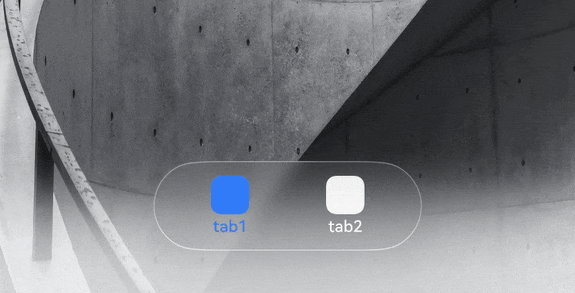
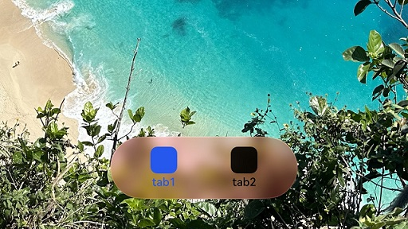
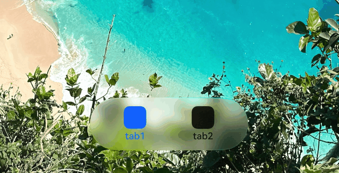

# Immersive System Material Visual Effects
<!--Kit: ArkUI-->
<!--Subsystem: ArkUI-->
<!--Owner: @H-xinwei-->
<!--Designer: @zhanghaibo0-->
<!--Tester: @lxl007-->
<!--Adviser: @Brilliantry_Rui-->
<!-- md-trans-meta sourceCommit=972f1649fdb6ebd99757019463fe43a902cdae45 translatedAt=2026-08-31T03:01:00.153Z pushedAt=2026-09-01T03:33:31.568Z -->

This topic describes how to customize the visual effects of the immersive system material by scenario, including setting immersive system material color inversion, applying color tinting to the immersive system material, setting immersive system material interactive effects, and setting immersive system material shadow effects.

> **NOTE**
>
> The immersive light effects described in this topic are presented only within the effective scope of the material. The specific effective scope is as follows:
> - The immersive system material set for a component through [systemMaterial](../reference/apis-arkui/arkui-ts/ts-universal-attributes-image-effect.md#systemmaterial) takes effect only in the title bar subtree of Navigation/NavDestination, or in the bottom TabBar subtree of a horizontal Tabs component where `barPosition` is `BarPosition.End`.
> - Slider, Toggle, and popup-type components are not subject to this scope restriction. Popup-type components include: Popup, Tips, Menu, BindSheet, AlertDialog, CustomDialog, ActionSheet, CalendarPickerDialog, DatePickerDialog, TextPickerDialog, TimePickerDialog, Toast, Select drop-down menu, and AlphabetIndexer bubble popup.

## Setting Color Inversion for Immersive System Material

When a component is set to an immersive system material with high transparency (such as ULTRA_THIN or THIN), the text inside the component may lack sufficient contrast against the background color, resulting in a poor reading experience. After you enable the automatic color inversion feature through `colorInvert` in [ImmersiveOptions](../reference/apis-arkui/arkts-apis-uimaterial.md#immersiveoptions), the text color in the component's child nodes is automatically adjusted to the inverse of the background color beneath the immersive system material, ensuring that the text remains readable. For details about the usage restrictions, see the description of the [colorInvert](../reference/apis-arkui/arkts-apis-uimaterial.md#immersiveoptions) parameter.

If the text color does not change after you enable automatic color inversion, see [Text Color Does Not Change After Enabling Automatic Color Inversion](arkts-immersive-light-sense-faq.md#text-color-does-not-change-after-enabling-automatic-color-inversion) for troubleshooting steps.

The following example demonstrates the effect of automatic color inversion: the background beneath the material scrolls between black and white. After the TabBar component is set to the ULTRA_THIN material with `colorInvert` set to `true`, the text and icon colors in the TabBar are automatically inverted along with the background, keeping the text and icons clearly readable.

```ts
import { uiMaterial } from '@kit.ArkUI';

@Component
struct ContentOne {
  build() {
    Scroll() {
      Column() {
        // Replace $r('app.media.greyBackground') with the image resource file you need.
        Image($r('app.media.greyBackground'))
          .width('100%')
          .height('150%')
          .objectFit(ImageFit.Fill)
        // Replace $r('app.media.greyBackground') with the image resource file you need.
        Image($r('app.media.greyBackground'))
          .width('100%')
          .height('150%')
          .objectFit(ImageFit.Fill)
      }
      .width('100%')
    }
    .width('100%')
    .height('100%')
  }
}

@Entry
@Component
struct PageMaterialReverse {
  build() {
    Column() {
      Tabs({ barPosition: BarPosition.End }) {
        TabContent() {
          ContentOne()
        }.tabBar(new BottomTabBarStyle($r('sys.media.ohos_icon_mask_svg'), 'tab1')
        // The BottomTabBarStyle style supports color inversion. Set a system color resource that supports color inversion.
          .labelStyle({ selectedColor: $r('sys.color.brand'), unselectedColor: $r('sys.color.font_primary') })
          .iconStyle({ selectedColor: $r('sys.color.brand'), unselectedColor: $r('sys.color.font_primary') })
        )

        TabContent() {
          Column().width('100%').height('100%').backgroundColor(Color.Green)
        }.tabBar(new BottomTabBarStyle($r('sys.media.ohos_icon_mask_svg'), 'tab2')
          .labelStyle({ selectedColor: $r('sys.color.brand'), unselectedColor: $r('sys.color.font_primary') })
          .iconStyle({ selectedColor: $r('sys.color.brand'), unselectedColor: $r('sys.color.font_primary') })
        )
      }
      .barFloatingStyle({
        adaptToHandedness: true,
        systemMaterial: new uiMaterial.ImmersiveMaterial(
          {
            style: uiMaterial.ImmersiveStyle.ULTRA_THIN,
            // Set the tabBar material to allow color inversion. Color inversion takes effect only when the style is ULTRA_THIN or THIN.
            colorInvert: true,
          }
        )
      })
      .barOverlap(true)
      .height('100%')
    }
    .width('100%')
    .height('100%')
  }
}
```



## Color Tinting for Immersive System Material

Through the [materialColor](../reference/apis-arkui/arkts-apis-uimaterial.md#immersiveoptions) parameter in [ImmersiveOptions](../reference/apis-arkui/arkts-apis-uimaterial.md#immersiveoptions), you can blend an additional solid color into the material filter to express a color tone or reduce the visibility of refraction. This color must have a certain degree of transparency. Passing a fully opaque color (such as `Color.Red` or `'#FFFF0000'`) will obscure the material filter effect.

> **NOTE**
>
> The materialColor parameter takes effect on devices of all computing power levels. On high- and medium-computing-power devices, this parameter blends an additional solid color into the material filter. On low-computing-power devices, this parameter serves as the value of the [backgroundColor](../reference/apis-arkui/arkui-ts/ts-universal-attributes-background.md#backgroundcolor) attribute.

The following example shows the color tinting effect: after a semi-transparent materialColor is set for an ULTRA_THIN material component, the material presents the corresponding color tone while revealing the background content.

```ts
import { uiMaterial } from '@kit.ArkUI';

@Entry
@Component
struct MaterialColorExample {
  build() {
    Column() {
      Tabs({ barPosition: BarPosition.End }) {
        TabContent() {
          // Replace $r('app.media.invert') with the image resource file you need.
          Image($r('app.media.invert'))
            .width('100%')
            .height('100%')
            .objectFit(ImageFit.Cover)
        }.tabBar(new BottomTabBarStyle($r('sys.media.ohos_icon_mask_svg'), 'tab1')
          .labelStyle({ selectedColor: $r('sys.color.brand'), unselectedColor: $r('sys.color.font_primary') })
          .iconStyle({ selectedColor: $r('sys.color.brand'), unselectedColor: $r('sys.color.font_primary') })
        )

        TabContent() {
          Column().width('100%').height('100%').backgroundColor(Color.Green)
        }.tabBar(new BottomTabBarStyle($r('sys.media.ohos_icon_mask_svg'), 'tab2')
          .labelStyle({ selectedColor: $r('sys.color.brand'), unselectedColor: $r('sys.color.font_primary') })
          .iconStyle({ selectedColor: $r('sys.color.brand'), unselectedColor: $r('sys.color.font_primary') })
        )
      }
      .barFloatingStyle({
        adaptToHandedness: true,
        maskHeight: 0,
        systemMaterial: new uiMaterial.ImmersiveMaterial(
          {
            style: uiMaterial.ImmersiveStyle.ULTRA_THIN,
            // Set the material tinting color.
            materialColor: 'rgba(255, 0, 0, 0.2)',
          }
        )
      })
      .barOverlap(true)
      .height('100%')
    }
    .width('100%')
    .height('100%')
  }
}
```



## Setting Interactive Effects for Immersive System Material

The immersive system material supports setting interactive deformation and point light effects:

- **Interactive deformation**: Enable interactive deformation through [interactive](../reference/apis-arkui/arkts-apis-uimaterial.md#immersiveoptions). When a component is pressed, it produces elastic deformation and automatically recovers after release, enhancing the visual feedback of interaction.
- **Point light effect**: Enable the point light effect through [lightEffect](../reference/apis-arkui/arkts-apis-uimaterial.md#immersiveoptions). When the user touches a component, a flowing light effect follows the finger. The effect is enabled when a valid object is passed to `lightEffect`, and disabled when `null` or `undefined` is passed. The `color` field in the object customizes the flowing light color, with the default value `Color.White`.

The following example demonstrates the interactive deformation and point light effects: after setting `interactive` to `true` and passing a `lightEffect` object, pressing the component produces elastic deformation, and touching it with a finger produces a flowing light effect that follows the finger.

```ts
import { uiMaterial } from '@kit.ArkUI';

@Entry
@Component
struct MaterialColorExample {
  build() {
    Column() {
      Tabs({ barPosition: BarPosition.End }) {
        TabContent() {
          // $r('app.media.invert') needs to be replaced with the image resource file you need.
          Image($r('app.media.invert'))
            .width('100%')
            .height('100%')
            .objectFit(ImageFit.Cover)
        }.tabBar(new BottomTabBarStyle($r('sys.media.ohos_icon_mask_svg'), 'tab1')
          .labelStyle({ selectedColor: $r('sys.color.brand'), unselectedColor: $r('sys.color.font_primary') })
          .iconStyle({ selectedColor: $r('sys.color.brand'), unselectedColor: $r('sys.color.font_primary') })
        )

        TabContent() {
          Column().width('100%').height('100%').backgroundColor(Color.Green)
        }.tabBar(new BottomTabBarStyle($r('sys.media.ohos_icon_mask_svg'), 'tab2')
          .labelStyle({ selectedColor: $r('sys.color.brand'), unselectedColor: $r('sys.color.font_primary') })
          .iconStyle({ selectedColor: $r('sys.color.brand'), unselectedColor: $r('sys.color.font_primary') })
        )
      }
      .barFloatingStyle({
        adaptToHandedness: true,
        maskHeight: 0,
        systemMaterial: new uiMaterial.ImmersiveMaterial({
          style: uiMaterial.ImmersiveStyle.ULTRA_THIN,
          // Enable interactive deformation.
          interactive: true,
          // Set the interactive point light effect to the default color.
          lightEffect: {},
        }),
      })
      .barOverlap(true)
      .height('100%')
    }
    .width('100%')
    .height('100%')
  }
}
```



## Setting the Shadow Effect for Immersive System Material

The immersive system material has a built‑in shadow effect by default ([applyShadow](../reference/apis-arkui/arkts-apis-uimaterial.md#immersiveoptions) is true). This default shadow takes precedence over the general [shadow](../reference/apis-arkui/arkui-ts/ts-universal-attributes-image-effect.md#shadow) attribute, meaning that any custom shadow settings will not take effect when applyShadow is true. To use a custom shadow, set applyShadow to false and then configure the shadow attribute; the default shadow effect of the immersive system material will no longer be applied.

The following example shows the result of setting applyShadow to false and then applying a custom shadow (e.g., a pink shadow).

```ts
import { uiMaterial } from '@kit.ArkUI';

@Entry
@Component
struct CustomShadowExample {
  @Builder
  NavigationTitle() {
    Row() {
      Text('Title')
        .fontSize(20)
        .fontWeight(FontWeight.Bold)

      Column()
        .width(50)
        .height(50)
        .borderRadius(25)
        .justifyContent(FlexAlign.Center)
        .systemMaterial(new uiMaterial.ImmersiveMaterial({
          style: uiMaterial.ImmersiveStyle.ULTRA_THIN,
          applyShadow: false,
          interactive: true,
        }))
        .shadow({ radius: 100, color: Color.Pink })
    }
    .width('100%')
    .justifyContent(FlexAlign.SpaceBetween)
    .padding({ left: 50, right: 50, top: 20 })
  }

  build() {
    Column() {
      Navigation() {
        // Page content.
        Image($r('app.media.invert'))
          .width('100%')
          .height('100%')
          .objectFit(ImageFit.Cover)
      }
      .title({ builder: this.NavigationTitle, height: '100%' })
      // Replace $r('app.media.greyBackground') with the required image resource file.
      .backgroundImage($r('app.media.greyBackground'))
      .backgroundImageSize({ width: '100%', height: '100%' })
    }.width('100%').height('100%')
  }
}
```


