# Immersive Light Sense

<!--Kit: ArkUI-->
<!--Subsystem: ArkUI-->
<!--Owner: @H-xinwei-->
<!--Designer: @zhanghaibo0-->
<!--Tester: @lxl007-->
<!--Adviser: @Brilliantry_Rui-->
<!-- md-trans-meta sourceCommit=b5131ffa3f4f22106397812f0fc5de684b0d3ded translatedAt=2026-07-06T09:05:54.167Z pushedAt=2026-07-06T11:00:24.078Z -->

Starting from API version 26.0.0, immersive light sense is introduced. Immersive light sense is a high-quality visual and animation system provided by ArkUI. By combining immersive system materials ([ImmersiveMaterial](../reference/apis-arkui/arkts-apis-uimaterial.md#immersivematerial)) with spatial animations, it brings a transparent and exquisite visual experience to app components. Immersive light sense includes two capabilities:

- Immersive system materials: By influencing the component's background color [backgroundColor](../reference/apis-arkui/arkui-ts/ts-universal-attributes-background.md#backgroundcolor), border color [borderColor](../reference/apis-arkui/arkui-ts/ts-universal-attributes-border.md#bordercolor), border width [borderWidth](../reference/apis-arkui/arkui-ts/ts-universal-attributes-border.md#borderwidth), shadow [shadow](../reference/apis-arkui/arkui-ts/ts-universal-attributes-image-effect.md#shadow), and material filter [materialFilter](../reference/apis-arkui/arkui-ts/ts-universal-attributes-filter-effect.md#materialfilter23), it gives components a visual appearance with a sense of depth and transparency.

- Spatial animations: Add dynamic effects such as deformation and flowing light to the pop-up process of components, making the animations more vivid and smooth.

Immersive light sense can automatically adjust the performance level of immersive system material and animations based on the device's computing power tier and the immersive light sense intensity configured by the user in system settings, ensuring the best possible effect across devices of different performance levels.

For common issues and solutions during immersive light sense development, see [Immersive Light Sense FAQ](arkts-immersive-light-sense-faq.md).

## Immersive System Materials

Immersive system materials ([ImmersiveMaterial](../reference/apis-arkui/arkts-apis-uimaterial.md#immersivematerial)) are a new type of material object provided by ArkUI. You can set the system material of a component through the [systemMaterial](../reference/apis-arkui/arkui-ts/ts-universal-attributes-image-effect.md#systemmaterial) API by passing in [ImmersiveOptions](../reference/apis-arkui/arkts-apis-uimaterial.md#immersiveoptions) parameters. Once set, it automatically affects the component's background color, border color, border width, shadow, and material filter [materialFilter](../reference/apis-arkui/arkui-ts/ts-universal-attributes-filter-effect.md#materialfilter23) visual effects.

Immersive system material provides five material styles [ImmersiveStyle](../reference/apis-arkui/arkts-apis-uimaterial.md#immersivestyle), ranging from thin to thick:

| Style | Description | Applicable Scenario |
| --- | --- | --- |
| ULTRA_THIN | Ultra-thin style, with high transparency. | Scenarios requiring a highly transparent background, such as floating toolbars. |
| THIN | Thin style, with relatively high transparency. | Scenarios requiring strong transparency, such as search boxes. |
| REGULAR | Regular style, with standard thickness. | General‑purpose scenarios. |
| THICK | Thick style, with a strong blur effect. | Scenarios requiring a strongly blurred background, such as menus. |
| ULTRA_THICK | Ultra-thick style, with a very strong blur effect. | Scenarios requiring a completely blurred background, such as dialogs. |

In addition, the immersive material object also supports configuring the following attributes:

- [materialColor](../reference/apis-arkui/arkts-apis-uimaterial.md#immersiveoptions): Specifies a solid color overlay for the material layer. For high-performance and mid-range computing devices, if this parameter is not set or is **undefined**, no additional solid color blending effect is applied. If this parameter is set to a valid color value, the color is blended as an additional solid layer over the materialFilter effect. If the color is fully opaque, it will obscure the [materialFilter](../reference/apis-arkui/arkui-ts/ts-universal-attributes-filter-effect.md#materialfilter23) effect. For low-performance computing devices, if this parameter is not set or is **undefined**, the background color effect inherent to the material on low-performance devices takes effect; if this parameter is set to a valid color value, it serves as the value for the [backgroundColor](../reference/apis-arkui/arkui-ts/ts-universal-attributes-background.md#backgroundcolor) attribute.

- [colorInvert](../reference/apis-arkui/arkts-apis-uimaterial.md#immersiveoptions): Specifies whether the subtree of the node with the material applied automatically adapts the text color to the inverted color of the material relative to the background. Automatic color inversion takes effect only when the material style is sufficiently thin.

- [applyShadow](../reference/apis-arkui/arkts-apis-uimaterial.md#immersiveoptions): Specifies whether to apply the shadow effect of the material. When set to **true**, the material's shadow effect is always applied, taking precedence over the [shadow](../reference/apis-arkui/arkui-ts/ts-universal-attributes-image-effect.md#shadow) universal attribute. When set to **false**, the [shadow](../reference/apis-arkui/arkui-ts/ts-universal-attributes-image-effect.md#shadow) universal attribute takes effect and the material's shadow effect is disabled.

- [interactive](../reference/apis-arkui/arkts-apis-uimaterial.md#immersiveoptions): Specifies whether to enable interactive deformation effects for the component with the material applied. When enabled, the component produces an elastic deformation effect upon press.

- [lightEffect](../reference/apis-arkui/arkts-apis-uimaterial.md#immersiveoptions): Specifies whether to enable the light‑sensitive interactive feedback effect for the component with the material applied.

## Highlights

- **High-end and exquisite visual quality**: Immersive light sense uses multi-layer effects such as material filters [materialFilter](../reference/apis-arkui/arkui-ts/ts-universal-attributes-filter-effect.md#materialfilter23), highlights, and shadows to bring components a high-end visual performance far beyond solid color backgrounds, making the application UI more textured.

- **Adaptive device capability**: Immersive light sense automatically adjusts the effect performance based on the device's computing power. High-performance computing devices present the full effect, while mid-range and low-end devices automatically downgrade, eliminating the need for manual adaptation and ensuring the application runs smoothly on various devices.

- **Minimal integration**: Immersive light sense can be enabled with one click through an application-level switch. Components such as [Dialog](arkts-base-dialog-overview.md), [Menu](../reference/apis-arkui/arkui-ts/ts-universal-attributes-menu.md), and [Chip](../reference/apis-arkui/arkui-ts/ohos-arkui-advanced-Chip.md) support it by default, achieving high-quality visual effects without additional code changes. For a complete list of components that support application-level enabling, see [MaterialState](../reference/apis-arkui/arkts-apis-uimaterial.md#materialstate).

- **Adaptive to light and dark modes**: Immersive system materials automatically adapt to the system's light or dark color scheme, requiring no extra handling.

- **Intelligent auto-invert for readability**: With automatic color inversion, when the material is sufficiently transparent, the text color inside the component automatically adapts to the background, ensuring a good reading experience in any scenario.

- **Rich interactive feedback**: Supports interactive deformation ([interactive](../reference/apis-arkui/arkts-apis-uimaterial.md#immersiveoptions)) and light‑sensitive feedback ([lightEffect](../reference/apis-arkui/arkts-apis-uimaterial.md#immersiveoptions)), giving every user interaction a subtle and refined visual response.

## Enabling Immersive Light Sense

### Application-Level Enabling

By configuring metadata in [module.json5](../quick-start/module-configuration-file.md), you can globally control the enabling  state of the immersive system material within the application. The name field must be **ohos.arkui.UIMaterial.state**, and the value field can be **default**, **enable**, or **disable**. Before using this capability, ensure that the application's [targetAPIVersion](../quick-start/app-configuration-file.md) is not lower than 26.0.0. This configuration only takes effect in modules of the **entry** type.

The following example shows how to configure the **enable** mode in **module.json5**:

<!-- @[MaterialStateConfig](https://gitcode.com/openharmony/applications_app_samples/blob/master/code/DocsSample/ArkUISample/ImmersiveLightSense/entry/src/main/module.json5) -->

``` JSON5
{
  "module": {
    "name": "entry",
    "type": "entry",
    // ...
    "metadata": [{
      "name": "ohos.arkui.UIMaterial.state",
      "value": "enable"
    }],
    // ...
  }
}
```

**MaterialState** provides three states for application-level immersive system material configuration: **DEFAULT**, **ENABLE**, and **DISABLE**, which correspond to the three enumerated values in the json5 configuration.

> **NOTE**
>
> Components that support application-level immersive system materials include: [Dialog](arkts-base-dialog-overview.md), [Toast](arkts-create-toast.md), [AlphabetIndexer](../reference/apis-arkui/arkui-ts/ts-container-alphabet-indexer.md), [ChipGroup](../reference/apis-arkui/arkui-ts/ohos-arkui-advanced-ChipGroup.md), [Chip](../reference/apis-arkui/arkui-ts/ohos-arkui-advanced-Chip.md), [Select](../reference/apis-arkui/arkui-ts/ts-basic-components-select.md), [Menu Control](../reference/apis-arkui/arkui-ts/ts-universal-attributes-menu.md), [Toggle](../reference/apis-arkui/arkui-ts/ts-basic-components-toggle.md), [SegmentButton](../reference/apis-arkui/arkui-ts/ohos-arkui-advanced-SegmentButton.md), [SegmentButtonV2](../reference/apis-arkui/arkui-ts/ohos-arkui-advanced-SegmentButtonV2.md), [Slider](../reference/apis-arkui/arkui-ts/ts-basic-components-slider.md), [bindSheet](../reference/apis-arkui/arkui-ts/ts-universal-attributes-sheet-transition.md#bindsheet), [SelectionMenu](../reference/apis-arkui/arkui-ts/ohos-arkui-advanced-SelectionMenu.md), and [Text](../reference/apis-arkui/arkui-ts/ts-basic-components-text.md) (the text menu triggered by long press or double-click after setting [copyOption](../reference/apis-arkui/arkui-ts/ts-basic-components-text.md#copyoption9)).

You can use [uiMaterial.getMaterialInfo()](../reference/apis-arkui/arkts-apis-uimaterial.md#uimaterialgetmaterialinfo) to obtain the current material configuration state of the application and determine component behavior based on the configuration state.

The following example demonstrates how to adjust component system material behavior by configuring [MaterialState](../reference/apis-arkui/arkts-apis-uimaterial.md#materialstate): when configured as **ENABLE**, the [Button](../reference/apis-arkui/arkui-ts/ts-basic-components-button.md) component can actively set the immersive system material, and the [Select](../reference/apis-arkui/arkui-ts/ts-basic-components-select.md) component enables the immersive system material by default; if you need to disable the immersive system material for a specific component individually, you can set [uiMaterial.Material.empty](../reference/apis-arkui/arkts-apis-uimaterial.md#empty).

<!-- @[MaterialInfo](https://gitcode.com/openharmony/applications_app_samples/blob/master/code/DocsSample/ArkUISample/ImmersiveLightSense/entry/src/main/ets/pages/immersiveLightSense/MaterialInfo.ets) -->

``` TypeScript
import { uiMaterial } from '@kit.ArkUI';

@Entry
@Component
struct MaterialInfoPage {
  private info: uiMaterial.MaterialInfo = uiMaterial.getMaterialInfo();

  build() {
    Column() {
      Text(`MaterialState: ${this.info.state}`)
        .fontSize(16)
        .margin({ bottom: 10 })
      Text(`MaterialType: ${this.info.type}`)
        .fontSize(16)
        .margin({ bottom: 20 })

      if (this.info.state === uiMaterial.MaterialState.ENABLE) {
        Button('Use immersive system material')
          .backgroundColor(Color.Transparent)
          .systemMaterial(new uiMaterial.ImmersiveMaterial({
            style: uiMaterial.ImmersiveStyle.ULTRA_THIN
          }))
          .fontColor(Color.Blue)
          .margin({ bottom: 10 })

        // The Select component enables immersive system material by default
        Select([{ value: 'Option 1' }, { value: 'Option 2' }])
          .value('Select')
          .margin({ bottom: 10 })

        // Separately disable the immersive system material for Select
        Select([{ value: 'Option 1' }, { value: 'Option 2' }])
          .value('Select (material disabled)')
          .systemMaterial(uiMaterial.Material.empty)
          // .menuSystemMaterial(uiMaterial.Material.empty)
      }
    }
    .width('100%')
    .height('100%')
    .justifyContent(FlexAlign.Center)
    // Replace with the actual resource file
    .backgroundImage($r('app.media.img'))
    .backgroundImageSize(ImageSize.FILL)
  }
}
```

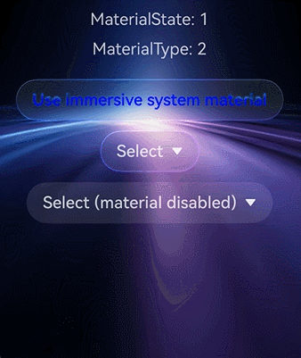

### Component-Level Enabling

In addition to the application‑level switch, you can also finely control the enabling of immersive system materials at the component level. Depending on the component type, there are two approaches: setting via universal attributes and setting via component‑specific APIs.

1. Set through universal attributes.

All components that support universal attributes can enable immersive system materials through the [systemMaterial](../reference/apis-arkui/arkui-ts/ts-universal-attributes-image-effect.md#systemmaterial) universal attribute.

**Column component example**

The following uses the **Column** component as an example to describe how to enable the immersive system material through a universal attribute.

   <!-- @[ColumnMaterial](https://gitcode.com/openharmony/applications_app_samples/blob/master/code/DocsSample/ArkUISample/ImmersiveLightSense/entry/src/main/ets/pages/immersiveLightSense/ColumnMaterial.ets) -->

   ``` TypeScript
   import { uiMaterial } from '@kit.ArkUI';
   
   @Entry
   @Component
   struct ColumnMaterialPage {
     build() {
       Column() {
         Column() {
           Text('Immersive light sense')
         }
         .width(328)
         .height(56)
         .borderRadius(28)
         .justifyContent(FlexAlign.Center)
         .systemMaterial(new uiMaterial.ImmersiveMaterial({
           style: uiMaterial.ImmersiveStyle.ULTRA_THIN,
         }))
       }
       .width('100%')
       .height('100%')
       .justifyContent(FlexAlign.Center)
       // Replace with the actual resource file.
       .backgroundImage($r('app.media.img'))
       .backgroundImageSize(ImageSize.FILL)
     }
   }
   ```

   

   **Column interactive deformation example**

   The following example sets both the ULTRA_THIN style and the [interactive](../reference/apis-arkui/arkts-apis-uimaterial.md#immersiveoptions) deformation effect for the [Column](../reference/apis-arkui/arkui-ts/ts-container-column.md) component. When the user presses, the component produces an elastic deformation and automatically recovers upon release, enhancing the visual feedback of the interaction.

   <!-- @[ButtonInteractive](https://gitcode.com/openharmony/applications_app_samples/blob/master/code/DocsSample/ArkUISample/ImmersiveLightSense/entry/src/main/ets/pages/immersiveLightSense/ButtonInteractive.ets) -->

   ``` TypeScript
   import { uiMaterial } from '@kit.ArkUI'
   
   @Entry
   @Component
   struct ButtonInteractivePage {
     build() {
       Stack() {
         // Replace with the actual resource file
         Image($r('app.media.img'))
           .width('100%')
           .height('100%')
         Column() {
           Column() {
             Text('Context')
           }
           .margin({ bottom: 100 })
           .width(248)
           .height(56)
           .borderRadius(28)
           .justifyContent(FlexAlign.Center)
           .alignItems(HorizontalAlign.Center)
           .systemMaterial(new uiMaterial.ImmersiveMaterial({
             style: uiMaterial.ImmersiveStyle.ULTRA_THIN,
             interactive: true,
           }))
         }.height('100%').width('100%').justifyContent(FlexAlign.Center)
       }
     }
   }
   ```

   

   **light‑sensitive feedback example**

   The following example demonstrates how to enable both the [interactive](../reference/apis-arkui/arkts-apis-uimaterial.md#immersiveoptions) deformation effect and the [lightEffect](../reference/apis-arkui/arkts-apis-uimaterial.md#immersiveoptions) light‑sensitive feedback on a set of circular Row components. When the user touches the component, a flowing light effect follows the finger movement; when the component is pressed, it produces an elastic deformation.

   <!-- @[LightEffect](https://gitcode.com/openharmony/applications_app_samples/blob/master/code/DocsSample/ArkUISample/ImmersiveLightSense/entry/src/main/ets/pages/immersiveLightSense/LightEffect.ets) -->

   ``` TypeScript
   import { uiMaterial } from '@kit.ArkUI';
   
   @Entry
   @Component
   struct LightEffectPage {
     @State itemsKey: number[] = [0, 1, 2];
     @State circleRadius: number = 40;
     @State spaceValue: number = 10;
     @State myMaterial: uiMaterial.Material = new uiMaterial.ImmersiveMaterial({
       style: uiMaterial.ImmersiveStyle.ULTRA_THIN,
       interactive: true,
       lightEffect: { color: undefined },
     });
   
     build() {
       Column() {
         Row() {
           Text('Title')
             .flexGrow(2)
             .fontColor(Color.White)
           Row({ space: this.spaceValue }) {
             ForEach(this.itemsKey, (item: number, index: number) => {
               Row()
                 .width(this.circleRadius * 2)
                 .height(this.circleRadius * 2)
                 .borderRadius(this.circleRadius)
                 .systemMaterial(this.myMaterial)
             })
           }
         }
         .justifyContent(FlexAlign.End)
         .backgroundColor(Color.Black)
         .width('100%')
         .padding(20)
       }
       .height('100%')
       .width('100%')
     }
   }
   ```

   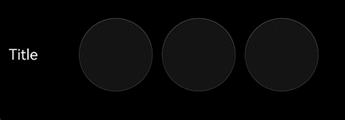

2. Set through component-specific APIs.

   Dialog-type components support enabling immersive system materials by setting their own **systemMaterial** attribute.

   **Toast Example**

   The following example demonstrates how to set an immersive system material with the THIN style through the [ShowToastOptions](../reference/apis-arkui/js-apis-promptAction.md#showtoastoptions) parameter of **showToast**. When a **Toast** appears, it will display a semi‑transparent background with material effects.

   <!-- @[ToastMaterial](https://gitcode.com/openharmony/applications_app_samples/blob/master/code/DocsSample/ArkUISample/ImmersiveLightSense/entry/src/main/ets/pages/immersiveLightSense/ToastMaterial.ets) -->

   ``` TypeScript
   import { PromptAction, uiMaterial } from '@kit.ArkUI';
   import { BusinessError } from '@kit.BasicServicesKit';
   
   @Entry
   @Component
   struct ToastMaterialPage {
     promptAction: PromptAction = this.getUIContext().getPromptAction();
   
     build() {
       Column() {
         Button('showToast')
           .position({ x: 125, y: 300 })
           .onClick(() => {
             try {
               this.promptAction.showToast({
                 message: 'Message Info',
                 duration: 2000,
                 // Control whether to set the system material
                 systemMaterial: new uiMaterial.ImmersiveMaterial({
                   style: uiMaterial.ImmersiveStyle.THIN
                 })
               });
             } catch (error) {
               let message = (error as BusinessError).message;
               let code = (error as BusinessError).code;
               console.error(`showToast args error code is ${code}, message is ${message}`);
             };
           })
       }
       .width('100%')
       .height('100%')
       // Please replace with the actual resource file
       .backgroundImage($r('app.media.img'))
       .backgroundImageSize({ width: '100%', height: '100%' })
     }
   }
   ```

   When system material is not set:

   

   After system material is set:

   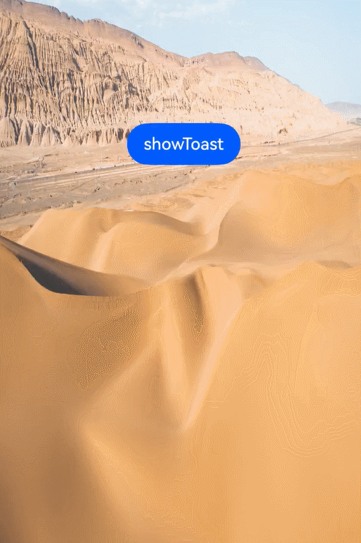

   **Popup Example**

   The following example sets the THIN style immersive system material through the [PopupOptions](../reference/apis-arkui/arkui-ts/ts-universal-attributes-popup.md#popupoptions) parameter of **bindPopup**, and the popup will display a semi-transparent background with a material effect.

   <!-- @[PopupMaterial](https://gitcode.com/openharmony/applications_app_samples/blob/master/code/DocsSample/ArkUISample/ImmersiveLightSense/entry/src/main/ets/pages/immersiveLightSense/PopupMaterial.ets) -->

   ``` TypeScript
   import { uiMaterial } from '@kit.ArkUI';
   
   @Entry
   @Component
   struct PopupMaterialPage {
     @State handlePopup: boolean = false;
   
     build() {
       Flex({ direction: FlexDirection.Column }) {
         Button('PopupOptions')
           .onClick(() => {
             this.handlePopup = !this.handlePopup
           })
           .bindPopup(this.handlePopup!!, {
             message: 'This is a popup with PopupOptions',
             placement: Placement.Top,
             // Controls whether to set the system material
             systemMaterial: new uiMaterial.ImmersiveMaterial({
               style: uiMaterial.ImmersiveStyle.THIN
             })
           })
           .position({ x: 100, y: 300 })
       }.width('100%')
       // Please replace with the actual resource file
       .backgroundImage($r('app.media.img'))
       .backgroundImageSize({ width: '100%', height: '100%' })
     }
   }
   ```

   When the system material is not set:

   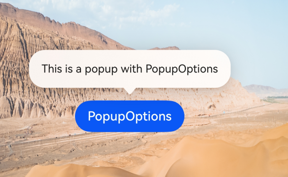

   After setting the system material:

   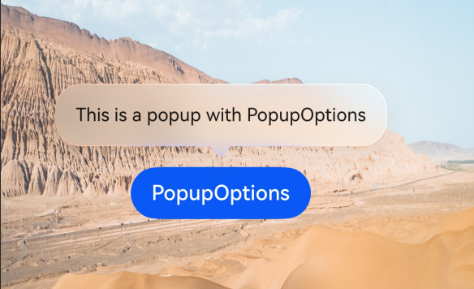

   **Tips Example**

   The following example demonstrates how to set an immersive system material with the THIN style through the [TipsOptions](../reference/apis-arkui/arkui-ts/ts-universal-attributes-tips.md#tipsoptions) parameter of **bindTips**. The **tooltip** will display a translucent background with material effects.

   <!-- @[TipsMaterial](https://gitcode.com/openharmony/applications_app_samples/blob/master/code/DocsSample/ArkUISample/ImmersiveLightSense/entry/src/main/ets/pages/immersiveLightSense/TipsMaterial.ets) -->

   ``` TypeScript
   import { uiMaterial } from '@kit.ArkUI';
   
   @Entry
   @Component
   struct TipsMaterialPage {
     build() {
       Flex({ direction: FlexDirection.Column }) {
         Button('Hover Tips')
           .bindTips('Floating tooltip test', {
             // Controls whether to set the system material
             systemMaterial: new uiMaterial.ImmersiveMaterial({
               style: uiMaterial.ImmersiveStyle.THIN
             })
           })
           .position({ x: 100, y: 300 })
       }.width('100%').padding({ top: 5 })
       // Please replace with the actual resource file
       .backgroundImage($r('app.media.img'))
       .backgroundImageSize({ width: '100%', height: '100%' })
     }
   }
   ```

   When the system material is not set:

   

   After the system material is set:

   

   **bindSheet Example**

   The following example demonstrates how to set an immersive system material with the THICK style through the [SheetOptions](../reference/apis-arkui/arkui-ts/ts-universal-attributes-sheet-transition.md#sheetoptions) parameter of **bindSheet**. The half‑modal page will display a background with blur and material effects.

   <!-- @[SheetMaterial](https://gitcode.com/openharmony/applications_app_samples/blob/master/code/DocsSample/ArkUISample/ImmersiveLightSense/entry/src/main/ets/pages/immersiveLightSense/SheetMaterial.ets) -->

   ``` TypeScript
   import { uiMaterial } from '@kit.ArkUI';
   
   @Entry
   @Component
   struct SheetMaterialPage {
     @State isShow: boolean = false;
     @State sheetHeight: number = 300;
     @State myMaterial: SystemUiMaterial | undefined = new uiMaterial.ImmersiveMaterial({
       style: uiMaterial.ImmersiveStyle.ULTRA_THICK,
     });
   
     @Builder
     myBuilder() {
       Column({ space: 10 }) {
         Text('Text')
           .fontSize(20)
           .margin(10)
       }
       .width('100%')
       .height('100%')
     }
   
     build() {
       Stack() {
         // Replace with the actual resource file.
         Image($r('app.media.startIcon'))
           .width('100%')
           .height('100%')
         Column() {
           Button('open Sheet')
             .onClick(() => {
               this.isShow = true;
             })
             .fontSize(20)
             .margin(10)
             .bindSheet($$this.isShow, this.myBuilder(), {
               height: this.sheetHeight,
               backgroundColor: Color.Transparent,
               systemMaterial: this.myMaterial // Starting from API version 26.0.0, the systemMaterial attribute is added.
             })
         }
         .justifyContent(FlexAlign.Center)
         .width('100%')
         .height('100%')
       }
     }
   }
   ```

   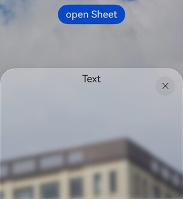

   **Menu Example**

   The following example demonstrates how to set an immersive system material with the THICK style through the [MenuOptions](../reference/apis-arkui/arkui-ts/ts-universal-attributes-menu.md#menuoptions10) parameter of **bindMenu**. The popup menu will display a background with material effects along with a pop‑up animation.

   <!-- @[MenuMaterial](https://gitcode.com/openharmony/applications_app_samples/blob/master/code/DocsSample/ArkUISample/ImmersiveLightSense/entry/src/main/ets/pages/immersiveLightSense/MenuMaterial.ets) -->

   ``` TypeScript
   import { uiMaterial } from '@kit.ArkUI';
   
   @Entry
   @Component
   struct MenuMaterialPage {
     @Builder
     MyMenu() {
       Menu() {
         MenuItem({ startIcon: $r('app.media.startIcon'), content: 'Menu item' })
         MenuItem({ startIcon: $r('app.media.startIcon'), content: 'Menu item' })
         MenuItem({ startIcon: $r('app.media.startIcon'), content: 'Menu item' })
       }
     }
   
     build() {
       Stack() {
         Button('bindMenu with THICK material')
           .bindMenu(this.MyMenu, {
             systemMaterial: new uiMaterial.ImmersiveMaterial({
               style: uiMaterial.ImmersiveStyle.THICK
             })
           })
       }
       .height('100%')
       .width('100%')
       // Replace with the actual resource file.
       .backgroundImage($r('app.media.img'))
       .backgroundImageSize(ImageSize.Cover)
     }
   }
   ```

   When system material is not set:

   

   After setting system material:

   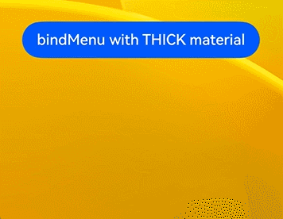

3. Disable the immersive system material for a component.

   In **ENABLE** mode, some components have the immersive system material enabled by default. To individually disable the immersive system material for a specific component, you can set [uiMaterial.Material.empty](../reference/apis-arkui/arkts-apis-uimaterial.md#empty).

   <!-- @[CloseMaterial](https://gitcode.com/openharmony/applications_app_samples/blob/master/code/DocsSample/ArkUISample/ImmersiveLightSense/entry/src/main/ets/pages/immersiveLightSense/CloseMaterial.ets) -->

   ``` TypeScript
   import { uiMaterial } from '@kit.ArkUI';
   
   @Entry
   @Component
   struct CloseMaterialPage {
     build() {
       Column() {
         Text('Disable the immersive system material for a component')
           .fontSize(20)
           .fontWeight(FontWeight.Bold)
           .margin({ bottom: 30 })
   
         Text('Select with immersive system material enabled by default:')
           .fontSize(16)
           .margin({ bottom: 10 })
   
         // The Select component enables immersive system material by default
         Select([{ value: 'Option 1' }, { value: 'Option 2' }])
           .value('Select')
           .margin({ bottom: 30 })
   
         Text('Select with immersive system material disabled individually:')
           .fontSize(16)
           .margin({ bottom: 10 })
   
         // Separately disable the immersive system material for the Select component
         Select([{ value: 'Option' }])
           .value('Select')
           .systemMaterial(uiMaterial.Material.empty)
           // .menuSystemMaterial(uiMaterial.Material.empty)
       }
       .width('100%')
       .height('100%')
       .padding(20)
       .justifyContent(FlexAlign.Center)
     }
   }
   ```

   If you need to globally disable the immersive system material for all components, you can set the metadata value to "disable" in module.json5.

### Effects After Enabling

The effects of immersive system materials are automatically adapted based on the following two dimensions:

1. **Device computing power tier**: The high, medium, and low tiers of device computing power are determined by the chip. On high-performance and mid-range computing devices, it affects the material filter [materialFilter](../reference/apis-arkui/arkui-ts/ts-universal-attributes-filter-effect.md#materialfilter23) effect and shadow [shadow](../reference/apis-arkui/arkui-ts/ts-universal-attributes-image-effect.md#shadow) effect. On low-performance computing devices, it affects the background color [backgroundColor](../reference/apis-arkui/arkui-ts/ts-universal-attributes-background.md#backgroundcolor), border color [borderColor](../reference/apis-arkui/arkui-ts/ts-universal-attributes-border.md#bordercolor), border width [borderWidth](../reference/apis-arkui/arkui-ts/ts-universal-attributes-border.md#borderwidth), and shadow [shadow](../reference/apis-arkui/arkui-ts/ts-universal-attributes-image-effect.md#shadow) effects.

2. **System immersive light sense configuration**: Users can choose the intensity of immersive light sense in the system settings, with three options: strong, balanced, and weak. When set to strong, the material displays the brightest lighting, with the richest blur, highlight, and shadow effects, giving the component the best transparency and texture. When set to weak, the effect is most streamlined, retaining only basic background color and border rendering. When set to balanced, the effect achieves a balance between visual quality and performance.

After applying immersive system materials to a component, on high‑tier devices, the component's pop‑up and disappearance processes are automatically accompanied by spatial animations such as deformation and flowing light, making the animations more lively and fluid. These animations require no additional configuration from developers; the system automatically decides whether to enable them based on device computing power. They take effect automatically on high‑tier devices, while mid‑ and low‑tier devices do not support spatial animations.

The effects of immersive system materials vary across devices of different computing power tiers. The following examples illustrate the material styles on different devices.

<!-- @[AllStyles](https://gitcode.com/openharmony/applications_app_samples/blob/master/code/DocsSample/ArkUISample/ImmersiveLightSense/entry/src/main/ets/pages/immersiveLightSense/AllStyles.ets) -->

``` TypeScript
import { uiMaterial } from '@kit.ArkUI';

@Entry
@Component
struct AllStylesPage {
  build() {
    Column() {
      Stack() {
        // Replace with the actual resource file
        Image($r('app.media.img'))
          .width('100%')
          .height('100%')

        Column({ space: 30 }) {
          Column() {
            Text('ULTRA_THIN')
          }
          .width(328)
          .height(56)
          .borderRadius(28)
          .justifyContent(FlexAlign.Center)
          .alignItems(HorizontalAlign.Center)
          .systemMaterial(new uiMaterial.ImmersiveMaterial({
            style: uiMaterial.ImmersiveStyle.ULTRA_THIN,
          }))

          Column() {
            Text('THIN')
          }
          .width(328)
          .height(56)
          .borderRadius(28)
          .justifyContent(FlexAlign.Center)
          .alignItems(HorizontalAlign.Center)
          .systemMaterial(new uiMaterial.ImmersiveMaterial({
            style: uiMaterial.ImmersiveStyle.THIN,
          }))

          Column() {
            Text('REGULAR')
          }
          .width(328)
          .height(56)
          .borderRadius(28)
          .justifyContent(FlexAlign.Center)
          .alignItems(HorizontalAlign.Center)
          .systemMaterial(new uiMaterial.ImmersiveMaterial({
            style: uiMaterial.ImmersiveStyle.REGULAR,
          }))

          Column() {
            Text('THICK')
          }
          .width(328)
          .height(56)
          .borderRadius(28)
          .justifyContent(FlexAlign.Center)
          .alignItems(HorizontalAlign.Center)
          .systemMaterial(new uiMaterial.ImmersiveMaterial({
            style: uiMaterial.ImmersiveStyle.THICK,
          }))

          Column() {
            Text('ULTRA_THICK')
          }
          .width(328)
          .height(56)
          .borderRadius(28)
          .justifyContent(FlexAlign.Center)
          .alignItems(HorizontalAlign.Center)
          .systemMaterial(new uiMaterial.ImmersiveMaterial({
            style: uiMaterial.ImmersiveStyle.ULTRA_THICK,
          }))
        }
      }
      .height('90%')
      .width('90%')
    }
    .height('100%')
    .width('100%')
    .alignItems(HorizontalAlign.Center)
    .justifyContent(FlexAlign.Center)
  }
}
```

On low-performance computing devices:


On mid-range computing devices:


On high-performance computing devices:


<!-- @[MenuMaterial](https://gitcode.com/openharmony/applications_app_samples/blob/master/code/DocsSample/ArkUISample/ImmersiveLightSense/entry/src/main/ets/pages/immersiveLightSense/MenuMaterial.ets) -->

``` TypeScript
import { uiMaterial } from '@kit.ArkUI';

@Entry
@Component
struct MenuMaterialPage {
  @Builder
  MyMenu() {
    Menu() {
      MenuItem({ startIcon: $r('app.media.startIcon'), content: 'Menu option' })
      MenuItem({ startIcon: $r('app.media.startIcon'), content: 'Menu option' })
      MenuItem({ startIcon: $r('app.media.startIcon'), content: 'Menu option' })
    }
  }

  build() {
    Stack() {
      Button('bindMenu with THICK material')
        .bindMenu(this.MyMenu, {
          systemMaterial: new uiMaterial.ImmersiveMaterial({
            style: uiMaterial.ImmersiveStyle.THICK
          })
        })
    }
    .height('100%')
    .width('100%')
    // Replace with the actual resource file
    .backgroundImage($r('app.media.img'))
    .backgroundImageSize(ImageSize.Cover)
  }
}
```

Effect when immersive light sense is set to strong:

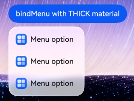

Effect when immersive light sense is set to weak:

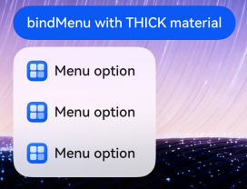

Effect when immersive light sense is set to balanced:

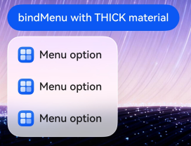

## Constraints

### Attribute Conflicts

Setting immersive system materials affects the visual appearance of components. For details, see [Immersive System Materials](#immersive-system-materials). For scenarios where materials are set via the universal attribute [systemMaterial](../reference/apis-arkui/arkui-ts/ts-universal-attributes-image-effect.md#systemmaterial), it is recommended to place the [systemMaterial](../reference/apis-arkui/arkui-ts/ts-universal-attributes-image-effect.md#systemmaterial) attribute after other style attributes to ensure correct priority of material effects. When setting materials via component options parameters, the order does not need to be considered.

For all components with immersive system materials applied, it is not recommended to set the background color, background blur, shadow, or border styles simultaneously. In **DEFAULT** mode, components such as **Dialog** and **Toast** enable immersive system materials by default when the background color, blur parameters, or shadow parameters are not set. If you actively set these attributes, immersive system materials will not be enabled by default, and you need to explicitly enable them via the **systemMaterial** attribute.

### Light and Dark Modes

Immersive system materials automatically adapt to the system's light or dark mode, displaying different visual effects. In light mode, the material presents a bright and transparent appearance. In dark mode, it presents a deep and subdued appearance. Developers do not need to configure material parameters separately for different modes.

Material effect in light mode:

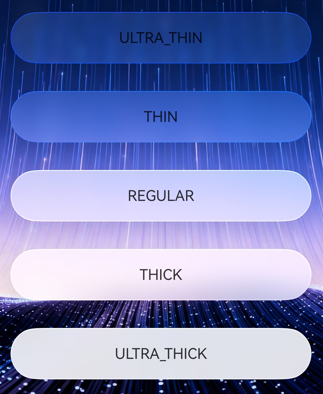

Material effect in dark mode:

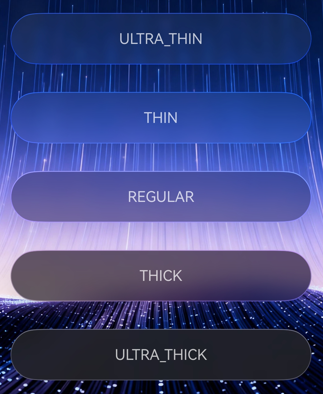

### Automatic Color Inversion

When a component is set to a highly transparent material (such as ULTRA_THIN or THIN), the text inside the component may have insufficient contrast with the background color, resulting in a poor reading experience. In this case, you can enable the colorInvert auto-inversion feature in [ImmersiveOptions](../reference/apis-arkui/arkts-apis-uimaterial.md#immersiveoptions).

After **colorInvert** is enabled, the text color within the component's child nodes will automatically adapt to the inverted color of the material relative to the background, ensuring that the text remains readable at all times.The details are as follows:

- Automatic color inversion takes effect only when the material is sufficiently thin, specifically for material styles THIN or ULTRA_THIN.

- Automatic color inversion is related to the system's immersive lighting intensity configuration. The thinner the material and the stronger the immersive lighting, the more likely it is to meet the requirements for color inversion.

- Automatic color inversion applies only to color values set through resource APIs, including the [fontColor](../reference/apis-arkui/arkui-ts/ts-basic-components-text.md#fontcolor) of the **Text** component, the [fontColor](../reference/apis-arkui/arkui-ts/ts-basic-components-button.md#fontcolor) of the **Button** component, the [fontColor](../reference/apis-arkui/arkui-ts/ts-basic-components-symbolGlyph.md#fontcolor) of the **SymbolGlyph** component, the [fillColor](../reference/apis-arkui/arkui-ts/ts-basic-components-image.md#fillcolor) of the **Image** component, the [placeholderColor](../reference/apis-arkui/arkui-ts/ts-basic-components-search.md#placeholdercolor), [fontColor](../reference/apis-arkui/arkui-ts/ts-basic-components-search.md#fontcolor10), icon color in [searchIcon](../reference/apis-arkui/arkui-ts/ts-basic-components-search.md#searchicon10), icon color in [cancelButton](../reference/apis-arkui/arkui-ts/ts-basic-components-search.md#cancelbutton10), and cursor color in [caretStyle](../reference/apis-arkui/arkui-ts/ts-basic-components-search.md#caretstyle10) of the **Search** component, and the text and icon colors when the [tabBar](../reference/apis-arkui/arkui-ts/ts-container-tabcontent.md#tabbar) attribute of the **TabContent** component uses the [BottomTabBarStyle](../reference/apis-arkui/arkui-ts/ts-container-tabcontent.md#bottomtabbarstyle9) style.

<!-- @[ColorInvert](https://gitcode.com/openharmony/applications_app_samples/blob/master/code/DocsSample/ArkUISample/ImmersiveLightSense/entry/src/main/ets/pages/immersiveLightSense/ColorInvert.ets) -->

``` TypeScript
import { uiMaterial } from '@kit.ArkUI';

@Entry
@Component
struct ColorInvertPage {
  build() {
    Column() {
      Stack() {
        // Replace with the actual resource file
        Image($r('app.media.img'))
          .width('100%')
          .height('100%')

        Column({ space: 20 }) {
          // Auto-invert is not enabled, text may be difficult to read
          Column() {
            Text('Auto-invert not enabled')
              .fontColor(Color.White)
          }
          .width(280)
          .height(56)
          .borderRadius(28)
          .justifyContent(FlexAlign.Center)
          .systemMaterial(new uiMaterial.ImmersiveMaterial({
            style: uiMaterial.ImmersiveStyle.ULTRA_THIN,
            colorInvert: false,
          }))

          // Enable auto-invert to automatically adapt text color to the background
          Column() {
            Text('Auto-invert enabled')
              .fontColor(Color.White)
          }
          .width(280)
          .height(56)
          .borderRadius(28)
          .justifyContent(FlexAlign.Center)
          .systemMaterial(new uiMaterial.ImmersiveMaterial({
            style: uiMaterial.ImmersiveStyle.ULTRA_THIN,
            colorInvert: true,
          }))
        }
      }
      .width('100%')
      .height('100%')
    }
    .width('100%')
    .height('100%')
  }
}
```

Comparison before and after enabling automatic color inversion:

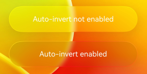

<!--RP1--><!--RP1End-->