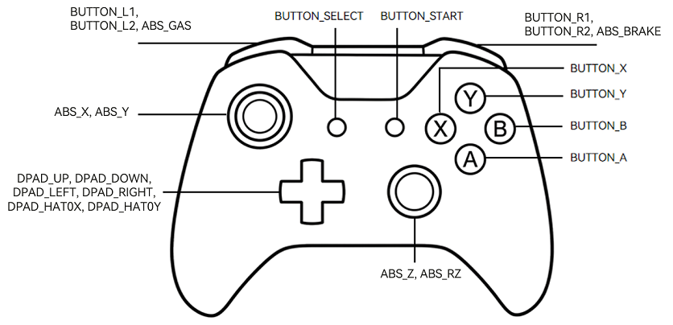

# Handling Gamepad Input Events
<!--Kit: ArkUI-->
<!--Subsystem: ArkUI-->
<!--Owner: @yihao-lin-->
<!--Designer: @piggyguy-->
<!--Tester: @songyanhong-->
<!--Adviser: @Brilliantry_Rui-->

Starting from API version 15, ArkUI supports gamepads as input devices. When a user operates a gamepad, the system recognizes its input actions and reports them as key events or focus axis events. You can receive and handle these events by registering the corresponding callbacks, enabling gamepad interaction logic.

Gamepads from different brands and models vary in hardware design and signal output. The reported key codes and axis values may not be uniform. When handling interaction logic, consider compatibility adaptation.

The figure below illustrates the common mapping of keys and joysticks on a typical gamepad.



Since API version 23, more axis types can be processed. For details about the supported axis types, see [AxisModel](../reference/apis-arkui/arkui-ts/ts-appendix-enums.md#axismodel15).

## Handling Key Input

The key input of the gamepad is reported as a key event. For details about the processing mechanism, see [Key Event Data Flow](./arkts-interaction-development-guide-keyboard.md#key-event-data-flow).

To respond to the key operations of the gamepad, you need to bind the [onKeyEvent](../reference/apis-arkui/arkui-ts/ts-universal-events-key.md#onkeyevent) callback to the component. When the component is in focused, an operation on the gamepad key triggers this callback to process the corresponding logic of the key input. The sample code is as follows:
<!-- @[gamepad_common_key](https://gitcode.com/openharmony/applications_app_samples/blob/master/code/DocsSample/ArkUISample/InterAction/entry/src/main/ets/pages/gamepad/CommonKey.ets) -->

``` TypeScript
import { KeyCode } from '@kit.InputKit';

@Entry
@Component
struct CommonKey {
  build() {
    Column() {
      if (canIUse('SystemCapability.MultimodalInput.Input.Core')) {
        Button('JoyStick')
          .defaultFocus(true)
          .onKeyEvent((event: KeyEvent) => {
            if (event && event.type === KeyType.Down) {
              switch (event.keyCode) {
                case KeyCode.KEYCODE_BUTTON_SELECT:
                  console.info('trigger BUTTON_SELECT');
                  // Process the input logic of the BUTTON_SELECT key.
                  break;
                case KeyCode.KEYCODE_BUTTON_START:
                  console.info('trigger BUTTON_START');
                  // Process the input logic of the BUTTON_START key.
                  break;
                default:
                  console.info('trigger BUTTON_DEFAULT');
                  // Process the input logic of other keys.
                  break;
              }
            }
          })
      }
    }
    .height('100%')
    .width('100%')
    .justifyContent(FlexAlign.Center)
  }
}
```

The arrow key input of the gamepad triggers key events, delivering the default focus traversal as well. If only the arrow keys are required to perform in-game operations (such as moving a character and rotating the view), the default focus behavior may interfere with normal operations. In this case, a focus group can solve this issue.


As shown in the figure, when there is no focus group, the arrow keys can be used to move the focus freely among components A, B, and C. When a specific component is wrapped in a focus group container, the focus behavior can be independently controlled within the container. You can set a focus group using [focusScopeId](../reference/apis-arkui/arkui-ts/ts-universal-attributes-focus.md#focusscopeid14) and set the **arrowStepOut** parameter to **false** to restrict the focus behavior of the arrow keys. The following example shows how to implement this logic:
<!-- @[gamepad_direction_key](https://gitcode.com/openharmony/applications_app_samples/blob/master/code/DocsSample/ArkUISample/InterAction/entry/src/main/ets/pages/gamepad/DirectionKey.ets) -->

``` TypeScript
import { KeyCode } from '@kit.InputKit';

@Entry
@Component
struct DirectionKey {
  build() {
    Column({ space: 10 }) {
      if (canIUse('SystemCapability.MultimodalInput.Input.Core')) {
        Button('Button1')
        Column() {
          Button('JoyStick')
            .defaultFocus(true)
            .onKeyEvent((event: KeyEvent) => {
              if (event && event.type === KeyType.Down) {
                switch (event.keyCode) {
                  case KeyCode.KEYCODE_DPAD_UP:
                  case KeyCode.KEYCODE_DPAD_DOWN:
                  case KeyCode.KEYCODE_DPAD_LEFT:
                  case KeyCode.KEYCODE_DPAD_RIGHT:
                    console.info('trigger direction button');
                    break;
                  default:
                    console.info('trigger other button');
                    break;
                }
              }
            })
        }.focusScopeId('myGroup', true, false)

        Button('Button2')
      }
    }
    .height('100%')
    .width('100%')
    .justifyContent(FlexAlign.Center)
  }
}
```

After setting the parameters mentioned above, the focus is always on the **JoyStick** key when you use the arrow keys to perform operations, and the focus movement behavior of the arrow keys is shielded.

## Handling Joystick Input

The joystick input of the gamepad triggers the focus axis event. You can bind the [onFocusAxisEvent](../reference/apis-arkui/arkui-ts/ts-universal-events-focus_axis.md#onfocusaxisevent) callback to the focused component to process the corresponding event logic. Example:
<!-- @[gamepad_joystick](https://gitcode.com/openharmony/applications_app_samples/blob/master/code/DocsSample/ArkUISample/InterAction/entry/src/main/ets/pages/gamepad/Joystick.ets) -->

``` TypeScript
@Entry
@Component
struct Joystick {
  build() {
    Column() {
      Button('JoyStick')
        .defaultFocus(true)
        .onFocusAxisEvent((event: FocusAxisEvent) => {
          let absX = event.axisMap.get(AxisModel.ABS_X);
          let absY = event.axisMap.get(AxisModel.ABS_Y);
          let absZ = event.axisMap.get(AxisModel.ABS_Z);
          let absRZ = event.axisMap.get(AxisModel.ABS_RZ);
          let absGas = event.axisMap.get(AxisModel.ABS_GAS);
          let absBrake = event.axisMap.get(AxisModel.ABS_BRAKE);
          // Process the joystick input logic.
          console.info(`absX: ${absX}, absY: ${absY}, absZ: ${absZ}, absRZ: ${absRZ}, absGas: ${absGas}, absBrake: ${absBrake}`);
        })
    }
    .height('100%')
    .width('100%')
    .justifyContent(FlexAlign.Center)
  }
}
```

## Example

The following example describes the interaction between a gamepad and an application through keys and a joystick.
<!-- @[gamepad_sample](https://gitcode.com/openharmony/applications_app_samples/blob/master/code/DocsSample/ArkUISample/InterAction/entry/src/main/ets/pages/gamepad/GamepadSample.ets) -->

``` TypeScript
@Entry
@Component
struct GamepadSample {
  @State keyValue: string = '';
  @State keyEventType: string = '';
  @State axisValue: string = '';

  build() {
    Column({ space: 10 }) {
      Button('Button1')

      Column() {
        Button('JoyStick')
          .defaultFocus(true)
          .onFocusAxisEvent((event: FocusAxisEvent) => {
            let absX = event.axisMap.get(AxisModel.ABS_X);
            let absY = event.axisMap.get(AxisModel.ABS_Y);
            let absZ = event.axisMap.get(AxisModel.ABS_Z);
            let absRz = event.axisMap.get(AxisModel.ABS_RZ);
            let absGas = event.axisMap.get(AxisModel.ABS_GAS);
            let absBrake = event.axisMap.get(AxisModel.ABS_BRAKE);
            let absHat0X = event.axisMap.get(AxisModel.ABS_HAT0X);
            let absHat0Y = event.axisMap.get(AxisModel.ABS_HAT0Y);
            this.axisValue =
              'absX: ' + absX + '\nabsY: ' + absY + '\nabsZ: ' + absZ + '\nabsRz: ' + absRz + '\nabsGas: ' + absGas +
                '\nabsBrake: ' + absBrake + '\nabsHat0X: ' + absHat0X + '\nabsHat0Y: ' + absHat0Y;
          })
          .onKeyEvent((event: KeyEvent) => {
            if (event && event.type === KeyType.Down) {
              this.keyValue =
                'keyCode:' + event.keyCode + '\nkeyText:' + event.keyText + '\nintentionCode:' + event.intentionCode;
            }
          })
      }.focusScopeId('myGroup', true, false)

      Button('Button2')

      Text('Axis value info: ').margin({ top: 10 })
      Column() {
        Text(this.axisValue).padding(15)
      }.width('100%').alignItems(HorizontalAlign.Start).padding({ left: 40 })

      Divider()

      Text('Key value info: ').margin({ top: 10 })
      Column() {
        Text(this.keyValue).padding(15)
      }.width('100%').alignItems(HorizontalAlign.Start).padding({ left: 40 })

    }.height(300).width('100%').margin({ top: 30 })
  }
}
```


Run the sample code and perform the following operations using the gamepad:

1. Press the joystick. You can observe that the axis value of the focus axis event is reported.

2. Press a key. You can observe that the key value of the key event is reported.

3. Use the arrow keys to move the focus. You can observe that the focus movement is shielded.
