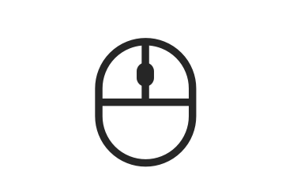
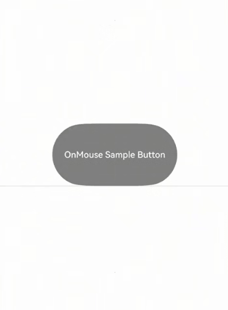
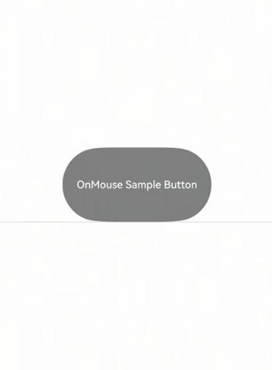
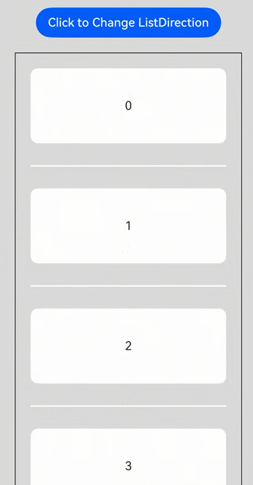

# Handling Mouse Input Events
<!--Kit: ArkUI-->
<!--Subsystem: ArkUI-->
<!--Owner: @jiangtao92-->
<!--Designer: @piggyguy-->
<!--Tester: @songyanhong-->
<!--Adviser: @HelloCrease-->



The mouse is a key input device, especially for 2-in-1 devices. It can perform actions such as tapping or swiping via button clicks and trigger scrolling gestures using the wheel. Additional mouse buttons generate events that are delivered to applications through **MouseEvent** and **AxisEvent**.

>**NOTE**
>
>All single-finger touch events and gesture events may be triggered and responded to using the left-click.
> - For example, if we need to develop the function of clicking a button to jump to a page and support finger tapping and left mouse button tapping, we can bind only one click event (onClick) to achieve this effect.
> - If different effects need to be implemented for finger tapping and left mouse button tapping, you can use the source field in the callback parameter in the onClick callback to determine whether the source of the event that triggers the current event is a finger or a mouse.

## Processing Mouse Movement

Mouse events are handled by registering a callback using the **onMouse** API. When a mouse action occurs, the event is dispatched to the component located beneath the cursor. This dispatch process adheres to the event bubbling mechanism.

### onMouse

```ts
onMouse(event: (event?: MouseEvent) => void)
```

Triggered when a mouse event occurs. When the mouse pointer generates a behavior (MouseAction) in the component bound to the API, the event callback is triggered. The parameter is the [MouseEvent](../reference/apis-arkui/arkui-ts/ts-universal-mouse-key.md#mouseevent) object, indicating the mouse event that triggers the event. Event bubbling is supported and can be customized; by default, events bubble between parent and child components. This API is typically used to implement custom mouse interaction logic.


You can obtain the coordinates (displayX/displayY/windowX/windowY/x/y), button ([MouseButton](../reference/apis-arkui/arkui-ts/ts-appendix-enums.md#mousebutton8)), action ([MouseAction](../reference/apis-arkui/arkui-ts/ts-appendix-enums.md#mouseaction8)), timestamp ([timestamp](../reference/apis-arkui/arkui-ts/ts-gesture-customize-judge.md#baseevent8)), interaction component area ([EventTarget](../reference/apis-arkui/arkui-ts/ts-universal-events-click.md#eventtarget8)), and event source ([SourceType](../reference/apis-arkui/arkui-ts/ts-gesture-settings.md#sourcetype8)) of the triggered event from the MouseEvent object in the callback. The **stopPropagation** callback of **MouseEvent** can be used to prevent the event from bubbling up.

>**NOTE**
>
>**MouseButton** indicates the physical mouse button being pressed or released that triggers the mouse event. The values are **Left**, **Right**, **Middle**, **Back**, **Forward**, and **None**. **None** indicates that no button is pressed or released, which means that the event is triggered by the mouse pointer moving on the component.

```ts
// xxx.ets
@Entry
@Component
struct MouseExample {
  @State buttonText: string = '';
  @State columnText: string = '';
  @State text: string = 'OnMouse Sample Button';
  @State Color: Color = Color.Gray;

  build() {
    Column() {
      Button(this.text, { type: ButtonType.Capsule })
        .width(200)
        .height(100)
        .backgroundColor(this.Color)
        .onMouse((event?: MouseEvent) => { // Set the onMouse callback for the Button component.
          if (event) {
            this.buttonText = 'Button onMouse:\n' + '' +
              'button = ' + event.button + '\n' +
              'action = ' + event.action + '\n' +
              'x,y = (' + event.x + ',' + event.y + ')' + '\n' +
              'windowXY=(' + event.windowX + ',' + event.windowY + ')';
          }
        })
      Divider()
      Text(this.buttonText).fontColor(Color.Green)
      Divider()
      Text(this.columnText).fontColor(Color.Red)
    }
    .width('100%')
    .height('100%')
    .justifyContent(FlexAlign.Center)
    .borderWidth(2)
    .borderColor(Color.Red)
    .onMouse((event?: MouseEvent) => { // Set the onMouse callback for the column.
      if (event) {
        this.columnText = 'Column onMouse:\n' + '' +
          'button = ' + event.button + '\n' +
          'action = ' + event.action + '\n' +
          'x,y = (' + event.x + ',' + event.y + ')' + '\n' +
          'windowXY=(' + event.windowX + ',' + event.windowY + ')';
      }
    })
  }
}
```

In the preceding example, the onMouse API is bound to the button. and display the values of the callback parameters, such as **button** and **action**. Apply the same settings to the outer **Column** container. The entire process can be divided into the following two actions:

1. Moving the mouse pointer: When the mouse pointer moves from outside the **Button** component to inside, only the **onMouse** callback of the **Column** component is triggered. When the mouse pointer enters the button, as the **onMouse** event bubbles up by default, both the **onMouse** callbacks of the **Column** and **Button** components are invoked. Because no mouse button is clicked during this process, the displayed information shows **button** as **0** (enumerated value of **MouseButton.None**) and **action** as **3** (enumerated value of **MouseAction.Move**).

2. Clicking the mouse button: After the mouse pointer enters the **Button** component, clicking the component twice (left-click and right-click) produces the following results:
   Left-click: button = 1 (enumerated value of **MouseButton.Left**); action = 1 (enumerated value of **MouseAction.Press**); action = 2 (enumerated value of **MouseAction.Release**).

   Right-click: button = 2 (enumerated value of **MouseButton.Right**); action = 1 (enumerated value of **MouseAction.Press**); action = 2 (enumerated value of **MouseAction.Release**)




To prevent the mouse event from bubbling, call the **stopPropagation** API.

```ts
// xxx.ets
@Entry
@Component
struct MouseExample {
  @State buttonText: string = '';
  @State columnText: string = '';
  @State text: string = 'OnMouse Sample Button';
  @State Color: Color = Color.Gray;

  build() {
    Column() {
      Button(this.text, { type: ButtonType.Capsule })
        .width(200)
        .height(100)
        .backgroundColor(this.Color)
        .onMouse((event?: MouseEvent) => { // Set the onMouse callback for the Button component.
          if (event) {
            event.stopPropagation(); // Prevent the onMouse event from bubbling.
            this.buttonText = 'Button onMouse:\n' + '' +
              'button = ' + event.button + '\n' +
              'action = ' + event.action + '\n' +
              'x,y = ' + '\n' + '(' + event.x + ',' + event.y + ')' + '\n' +
              'windowXY=' + '\n' + '(' + event.windowX + ',' + event.windowY + ')';
          }
        })
      Divider()
      Text(this.buttonText).fontColor(Color.Green)
      Divider()
      Text(this.columnText).fontColor(Color.Red)
    }
    .width('100%')
    .height('100%')
    .justifyContent(FlexAlign.Center)
    .borderWidth(2)
    .borderColor(Color.Red)
    .onMouse((event?: MouseEvent) => { // Set the onMouse callback for the Column component.
      if (event) {
        this.columnText = 'Column onMouse:\n' + '' +
          'button = ' + event.button + '\n' +
          'action = ' + event.action + '\n' +
          'x,y = ' + '\n' + '(' + event.x + ',' + event.y + ')' + '\n' +
          'windowXY=' + '\n' + '(' + event.windowX + ',' + event.windowY + ')';
      }
    })
  }
}
```


To prevent the mouse event of the child component (**Button**) from bubbling up to its parent component (**Column**), use the **event** parameter in the **onMouse** callback of **Button** to call the **stopPropagation** API.

### onHover

If you need to detect the mouse entering or leaving the control range, you are advised to use the advanced event [onHover](../reference/apis-arkui/arkui-ts/ts-universal-events-hover.md#onhover) and avoid directly processing the mouse move event to keep the code simple.

```ts
onHover(event: (isHover: boolean) => void)
```

Triggered when the mouse pointer enters or leaves the component. The **isHover** parameter indicates whether the mouse pointer hovers over the component. Event bubbling is supported and can be customized; by default, events bubble between parent and child components.


If this API is bound to a component, it is triggered when the mouse pointer enters the component from outside and the value of **isHover** is **true**, or when the mouse pointer leaves the component and the value of **isHover** is **false**.


```ts
// xxx.ets
@Entry
@Component
struct MouseExample {
  @State hoverText: string = 'Not Hover';
  @State Color: Color = Color.Gray;

  build() {
    Column() {
      Button(this.hoverText)
        .width(200).height(100)
        .backgroundColor(this.Color)
        .onHover((isHover?: boolean) => { // Listen for whether the mouse cursor is hovered over the button.
          if (isHover) {
            this.hoverText = 'Hovered!';
            this.Color = Color.Green;
          }
          else {
            this.hoverText = 'Not Hover';
            this.Color = Color.Gray;
          }
        })
    }.width('100%').height('100%').justifyContent(FlexAlign.Center)
  }
}
```

In this example, a **Button** component is created, with an initial gray background color and the content **Not Hover**. The component is bound to the **onHover** callback. In the callback, **this.isHovered** is set to the callback parameter **isHover**.

When the mouse pointer moves from outside the **Button** component to inside, the callback is invoked, setting the value of **isHover** to **true**. As a result, the background color of the component changes to **Color.Green**, and the content is updated to **Hovered!**.

When the mouse pointer moves from inside the **Button** component to outside, the callback is invoked again, setting the value of **isHover** to **false**. The component then reverts to its initial style.


## Processing Mouse Buttons

When a user presses a mouse button, a mouse press event is generated. You can use MouseEvent to access some important information about the event, such as the occurrence time and mouse button (left button/right button). You can also use the getModifierKeyState API to obtain the pressing status of the Ctrl, Alt, and Shift keys on the physical keyboard when the user uses the mouse. You can determine their status by combination to implement some convenient operations.

The following example demonstrates multi-selection functionality using mouse button processing:

```typescript
class ListDataSource implements IDataSource {
  private list: number[] = [];
  private listeners: DataChangeListener[] = [];

  constructor(list: number[]) {
    this.list = list;
  }

  totalCount(): number {
    return this.list.length;
  }

  getData(index: number): number {
    return this.list[index];
  }

  registerDataChangeListener(listener: DataChangeListener): void {
    if (this.listeners.indexOf(listener) < 0) {
      this.listeners.push(listener);
    }
  }

  unregisterDataChangeListener(listener: DataChangeListener): void {
    const pos = this.listeners.indexOf(listener);
    if (pos >= 0) {
      this.listeners.splice(pos, 1);
    }
  }

  // Notify the controller that data has been deleted.
  notifyDataDelete(index: number): void {
    this.listeners.forEach(listener => {
      listener.onDataDelete(index);
    });
  }

  // Delete an element at the specified index.
  public deleteItem(index: number): void {
    this.list.splice(index, 1);
    this.notifyDataDelete(index);
  }
}

@Entry
@Component
struct ListExample {
  private arr: ListDataSource = new ListDataSource([0, 1, 2, 3, 4, 5, 6, 7, 8, 9]);
  private allSelectedItems: Array<number> = []
  @State isSelected: boolean[] = []

  @Styles
  selectedStyle(): void {
    .backgroundColor(Color.Green)
  }

  isItemSelected(item: number): boolean {
    for (let i = 0; i < this.allSelectedItems.length; i++) {
      if (this.allSelectedItems[i] == item) {
        this.isSelected[item] = true;
        return true;
      }
    }
    this.isSelected[item] = false;
    return false;
  }

  build() {
    Column() {
      List({ space: 10, initialIndex: 0 }) {
        LazyForEach(this.arr, (index: number) => {
          ListItem() {
            Text('' + index)
              .width('100%')
              .height(100)
              .fontSize(16)
              .fontColor(this.isSelected[index] ? Color.White : Color.Black)
              .textAlign(TextAlign.Center)
          }
          .backgroundColor(Color.White)
          .selectable(true)
          .selected(this.isSelected[index])
          .stateStyles({
            selected: this.selectedStyle
          })
          .onMouse((event: MouseEvent) => {
            // Check whether the left mouse button is pressed.
            if (event.button == MouseButton.Left && event.action == MouseAction.Press) {
              // Check the item selected state.
              let isSelected: boolean = this.isItemSelected(index)
              // Check the Ctrl key state.
              let isCtrlPressing: boolean = false
              if (event.getModifierKeyState) {
                isCtrlPressing = event.getModifierKeyState(['Ctrl'])
              }
              //If the Ctrl key is not pressed, forcibly clear other selected items and select only the current item.
              if (!isCtrlPressing) {
                this.allSelectedItems = []
                for (let i = 0; i < this.isSelected.length; i++) {
                  this.isSelected[i] = false
                }
              }
              if (isSelected) {
                this.allSelectedItems.filter(item => item != index)
                this.isSelected[index] = false
              } else {
                this.allSelectedItems.push(index)
                this.isSelected[index] = true
              }
            }
          })
        }, (item: string) => item)
      }
      .listDirection(Axis.Vertical)
      .scrollBar(BarState.Off)
      .friction(0.6)
      .edgeEffect(EdgeEffect.Spring)
      .width('90%')
    }
    .width('100%')
    .height('100%')
    .backgroundColor(0xDCDCDC)
    .padding({ top: 5 })
  }
}
```


## Processing Mouse Wheel Input

The mouse wheel is primarily used for vertical scrolling. When a user scrolls the wheel, the system generates a vertical [axis event](../reference/apis-arkui/arkui-ts/ts-universal-events-axis.md) and dispatches it to the application. Components can handle this event using the [onAxisEvent](../reference/apis-arkui/arkui-ts/ts-universal-events-axis.md#onaxisevent) API. The event includes the cursor position and the angle of wheel rotation, accessible using the **axisVertical** property of the [BaseEvent](../reference/apis-arkui/arkui-ts/ts-gesture-customize-judge.md#baseevent8) object.
Mouse wheel axis events follow a structured lifecycle: Each scroll interaction begins with an [AxisAction](../reference/apis-arkui/arkui-ts/ts-appendix-enums.md#axisaction17).BEGIN event. When scrolling ends, an [AxisAction](../reference/apis-arkui/arkui-ts/ts-appendix-enums.md#axisaction17).End event is emitted. For slow or intermittent scrolling, multiple **BEGIN** and **END** events may be reported. The **axisVertical** value represents the angular change during a single scroll tick. Key characteristics include:
- It reflects the delta of one scroll action, not the cumulative scroll distance.
- The value is influenced by system-level wheel sensitivity settings.
- The system's zoom configuration is communicated using the **scrollStep** property in the **AxisEvent** object.
- A forward scroll (wheel up) yields a negative value. A backward scroll (wheel down) yields a positive value.

Built-in scrollable components automatically handle wheel input. No additional configuration is required.
When [PanGesture](../reference/apis-arkui/arkui-ts/ts-basic-gestures-pangesture.md) is used, wheel input maps to vertical offset values: For forward scrolling, **offsetY** is positive; for backward scrolling, **offsetY** is negative.

> **NOTE**
>
> 1. Wheel-generated vertical axis values only trigger vertical scrolling gestures.
> 2. If the system detects that only horizontally scrollable components are under the cursor, it may trigger horizontal scrolling.
> 3. When both vertical and horizontal scrollable elements are present, vertical scrolling takes precedence.

This example demonstrates how a **List** component responds to mouse wheel input in both vertical and horizontal orientations.

```ts
// ListDataSource.ets
export class ListDataSource implements IDataSource {
  private list: number[] = [];
  private listeners: DataChangeListener[] = [];

  constructor(list: number[]) {
    this.list = list;
  }

  totalCount(): number {
    return this.list.length;
  }

  getData(index: number): number {
    return this.list[index];
  }

  registerDataChangeListener(listener: DataChangeListener): void {
    if (this.listeners.indexOf(listener) < 0) {
      this.listeners.push(listener);
    }
  }

  unregisterDataChangeListener(listener: DataChangeListener): void {
    const pos = this.listeners.indexOf(listener);
    if (pos >= 0) {
      this.listeners.splice(pos, 1);
    }
  }

  // Notify the controller that data has been deleted.
  notifyDataDelete(index: number): void {
    this.listeners.forEach(listener => {
      listener.onDataDelete(index);
    });
  }

  // Notify the controller of data addition.
  notifyDataAdd(index: number): void {
    this.listeners.forEach(listener => {
      listener.onDataAdd(index);
    });
  }

  // Delete an element at the specified index.
  public deleteItem(index: number): void {
    this.list.splice(index, 1);
    this.notifyDataDelete(index);
  }

  // Insert an element at a specified index.
  public insertItem(index: number, data: number): void {
    this.list.splice(index, 0, data);
    this.notifyDataAdd(index);
  }
}
```

```ts
import { ListDataSource } from './ListDataSource';

@Entry
@Component
struct ListExample {
  private arr: ListDataSource = new ListDataSource([0, 1, 2, 3, 4, 5, 6, 7, 8, 9]);
  @State dir1: Axis = Axis.Vertical;

  build() {
    Column() {
      Button('Click to Change ListDirection')
        .margin(20)
        .onClick(() => {
          if (this.dir1 == Axis.Vertical) {
            this.dir1 = Axis.Horizontal
          } else {
            this.dir1 = Axis.Vertical
          }
        })
      List({ space: 20, initialIndex: 0 }) {
        LazyForEach(this.arr, (item: number) => {
          ListItem() {
            Text('' + item)
              .width('100%')
              .height(100)
              .fontSize(16)
              .textAlign(TextAlign.Center)
              .borderRadius(10)
              .backgroundColor(0xFFFFFF)
          }
          .margin(20)
          // Bind a scrolling gesture to ListItem. When the mouse wheel is scrolled on ListItem, the scrolling gesture of ListItem is triggered first.
          .gesture(PanGesture({ direction: PanDirection.Vertical })
            .onActionStart(() => {
              console.info('Vertical PanGesture start is called');
            })
            .onActionUpdate(() => {
              console.info('Vertical PanGesture update is called');
            }))
        }, (item: number) => item.toString())
      }
      .borderWidth(1)
      .listDirection(this.dir1) // Arrangement direction
      .scrollBar(BarState.Off)
      .friction(0.6)
      .divider({
        strokeWidth: 2,
        color: 0xFFFFFF,
        startMargin: 20,
        endMargin: 20
      }) // Divider between rows
      .edgeEffect(EdgeEffect.Spring) // Set the edge scrolling effect to Spring.
      .width('90%')
    }
    .width('100%')
    .height('100%')
    .backgroundColor(0xDCDCDC)
    .padding(20)
  }
}
```

