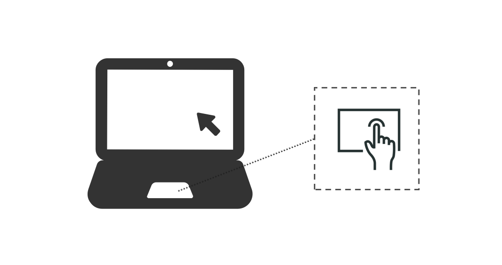
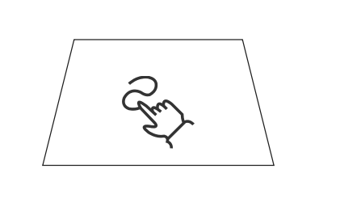
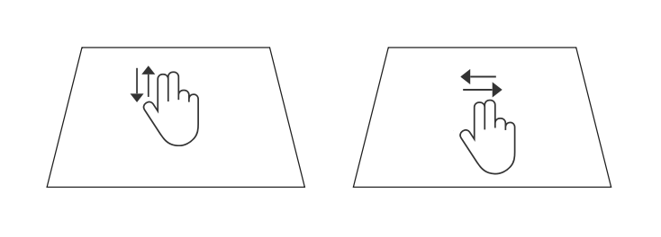
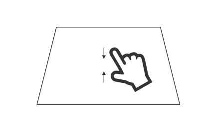

# Handling Touchpad Input Events
<!--Kit: ArkUI-->
<!--Subsystem: ArkUI-->
<!--Owner: @jiangtao92-->
<!--Designer: @piggyguy-->
<!--Tester: @songyanhong-->
<!--Adviser: @Brilliantry_Rui-->

Touchpad interactions generate different types of input events depending on the gesture performed. A single-finger tap triggers a left mouse click event. A single-finger swipe triggers a mouse move event without any button press. A two-finger tap gesture triggers a right mouse click event. A double-finger swipe triggers an axis event (scroll-like behavior).

> **NOTE**
>
> Unlike touchscreen devices, multi-finger interactions on touchpads do not expose finger-level details. Applications cannot retrieve individual finger information from touchpad events.

## Single-Finger Interaction

Single-finger operations on a touchpad behave similarly to mouse input: A light tap and drag on the touchpad generates a mouse move event. A firm press on the touchpad triggers a left mouse click event. To distinguish whether an event originates from a touchpad or a mouse device, use the [sourceType](../reference/apis-arkui/arkui-ts/ts-gesture-settings.md#sourcetype8) and [sourceTool](../reference/apis-arkui/arkui-ts/ts-gesture-settings.md#sourcetool9) properties in the event object.

For implementation details, see [Processing Mouse Movement](arkts-interaction-development-guide-mouse.md#processing-mouse-movement).

## Two-Finger Swipe

Two-finger swipe gestures on a touchpad generate axis events, similar to scroll wheel input. However, the reported unit is displacement in pixels, not angular rotation. You can **sourceType** and **sourceTool** to distinguish the input source before processing axis values.

When a user performs a two-finger horizontal swipe gesture, the system reports the horizontal axis value (displacement in pixels) through [axisHorizontal](../reference/apis-arkui/arkui-ts/ts-gesture-customize-judge.md#properties): Swiping right results in a negative value, and swiping left results in a positive value. When a user performs a two-finger vertical swipe gesture, the system reports the vertical axis value (displacement in pixels) through [axisVertical](../reference/apis-arkui/arkui-ts/ts-gesture-customize-judge.md#properties): Swiping up results in a positive value, and swiping down results in a negative value.

Similar to the scroll wheel, axis events generated by two-finger swipes on the touchpad can also trigger swipe gesture recognition. For horizontal swiping, swiping right yields a positive **offsetX** value, and swiping left yields a negative **offsetX** value. For vertical swiping, swiping up yields a negative **offsetY** value, and swiping down yields a positive **offsetY** value.

> **NOTE**
>
> Gesture recognition only applies to components directly under the cursor at the moment the scroll begins.

## Two-Finger Pinch

Pinch gestures on the touchpad generate a pinch zoom value, which reflects a relative scale ratio used for zooming UI elements. The initial pinch scale is 1.0. Pinching out (fingers moving apart) increases the **scale** value above 1.0. Pinching in (fingers moving together) decreases the **scale** value below 1.0.
