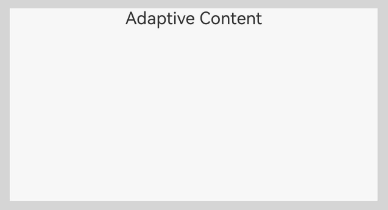
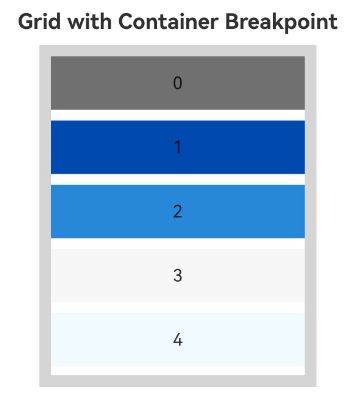
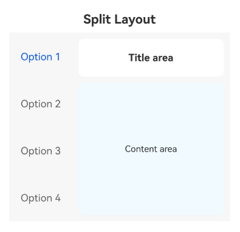
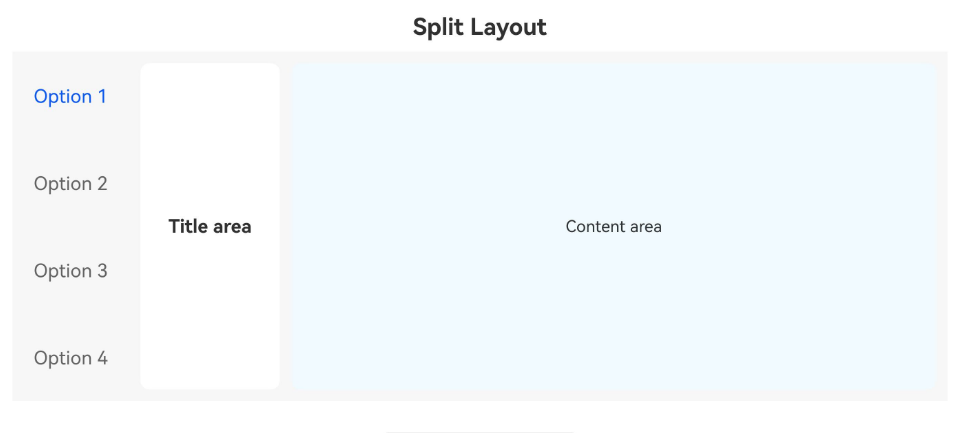

# Container Breakpoint (ContainerReader)

<!--Kit: ArkUI-->
<!--Subsystem: ArkUI-->
<!--Owner: @song-song-song-->
<!--Designer: @fenglinbailu-->
<!--Tester: @weixin_45530366-->
<!--Adviser: @Brilliantry_Rui-->
<!-- md-trans-meta sourceCommit=087470085268b4c7968360a1498b1da15f27d467 translatedAt=2026-07-06T13:07:02.335Z pushedAt=2026-07-07T06:21:41.499Z -->

The container breakpoint component [ContainerReader](../reference/apis-arkui/arkui-ts/ts-container-containerreader.md) is a responsive layout solution provided by ArkUI. Starting from API version 26.0.0, it allows you to implement adaptive layouts based on container size rather than window size. Compared with traditional window breakpoints, container breakpoints provide finer-grained layout control, enabling components to present different layout effects under different container sizes.

In actual development, ContainerReader is often used inside [Flex](../reference/apis-arkui/arkui-ts/ts-container-flex.md), [Row](../reference/apis-arkui/arkui-ts/ts-container-row.md), or [Column](../reference/apis-arkui/arkui-ts/ts-container-column.md) containers, [Navigation](../reference/apis-arkui/arkui-ts/ts-basic-components-navigation.md), and [custom components](state-management/arkts-create-custom-components.md), providing core functions such as real-time size acquisition, breakpoint value retrieval, and custom breakpoint thresholds.

## Capability Scope

**ContainerReader** provides the following key capabilities.

- **Container-level size awareness**: Determines breakpoint values based on the component's own actual size, rather than the window size. Suitable for component-level responsive layout, nested layout scenarios, and reusable component development.

- **Real-time retrieval via two-way binding**: Obtains container size and breakpoint information in real time through state variables.

- **Width/height dual mode**: Supports both width breakpoints and height breakpoints to meet adaptive requirements in different dimensions.

- **Custom breakpoint thresholds**: Flexibly configures layout strategies corresponding to different size ranges through the [breakpointConfig](../reference/apis-arkui/arkui-ts/ts-container-containerreader.md#breakpointconfig) attribute.

## Layout Specifications

Starting from API version 26.0.0, the layout specifications of the [ContainerReader](../reference/apis-arkui/arkui-ts/ts-container-containerreader.md) component under different parent container types are as follows.

> **NOTE**
> - When the parent container is a **Flex**, **Row**, or **Column** component, **ContainerReader** fills the remaining space of the parent container, and the priority of **Flex**'s flexibility features remains unchanged.
> - When the parent container is of another container type, **ContainerReader** fills the parent container.
> - The size of **ContainerReader** is determined by the parent container and its own layout, and is not affected by child components.

| Parent Container Type | No Sibling Nodes | Has Sibling Nodes |
| ---------- | ---------- | ---------- |
| Flex, Row, Column | Fills the parent container. | Fills the remaining space of the parent container. |
| Other component types | Fills the parent component. | Fills the parent component. |

When [ContainerReader](../reference/apis-arkui/arkui-ts/ts-container-containerreader.md) is used as a child component, its size is determined by the parent container. When the parent container is **Flex**, **Row**, or **Column**, **ContainerReader** automatically fills the remaining space of the parent container along its layout direction.

> **NOTE**
>
> When using **ContainerReader**, you need to simultaneously import **ContainerReaderAttribute**; otherwise, it will cause a compilation error.

<!-- @[FillTheSpace](https://gitcode.com/openharmony/applications_app_samples/blob/master/code/DocsSample/ArkUISample/ContainerReader/entry/src/main/ets/pages/layoutSpecifications/FillTheSpace.ets) -->  

``` TypeScript
import {ContainerReader, ContainerReaderAttribute, Size} from '@kit.ArkUI';
@Entry
@Component
struct Example {
  @State containerSize: Size = { width: 0, height: 0 };
  @State widthBp: WidthBreakpoint = WidthBreakpoint.WIDTH_MD;
  build() {
    Flex({ direction: FlexDirection.Row }) {
      ContainerReader({
        size: this.containerSize!!,
        widthBreakpoint: this.widthBp!!
      }) {
        Column() {
          Text('Adaptive Content')
        }
        .width('100%')
        .height('100%')
      }
      .backgroundColor('#F7F7F7')
    }
    .padding(10)
    .width('100%')
    .height(200)
    .backgroundColor('#D5D5D5')
  }
}
```



When [ContainerReader](../reference/apis-arkui/arkui-ts/ts-container-containerreader.md) is used as a child component of **Flex**, **Row**, or **Column**, the system prioritizes size calculation for non-**ContainerReader** child components, and then allocates space to the **ContainerReader** component based on the remaining container space and your settings. This is particularly suitable for scenarios where fixed content and adaptive content coexist.

> **NOTE**
>
> When using **ContainerReader**, you need to simultaneously import **ContainerReaderAttribute**; otherwise, it will cause a compilation error.

<!-- @[DivideRemainingSpace](https://gitcode.com/openharmony/applications_app_samples/blob/master/code/DocsSample/ArkUISample/ContainerReader/entry/src/main/ets/pages/layoutSpecifications/DivideRemainingSpace.ets) -->  

``` TypeScript
import {ContainerReader, ContainerReaderAttribute, Size} from '@kit.ArkUI';
@Entry
@Component
struct Example {
  @State containerSize: Size = { width: 0, height: 0 };
  @State widthBp: WidthBreakpoint = WidthBreakpoint.WIDTH_MD;
  build() {
    Flex({ direction: FlexDirection.Row }) {
      Column() {
        Text('Text')
          .width(100)
          .height('100%')
      }
      .width(100)
      .height('100%')
      .backgroundColor('#D5D5D5')
      ContainerReader({
        size: this.containerSize!!,
        widthBreakpoint: this.widthBp!!
      }) {
        Column() {
          Text('ContainerReader')
        }
        .width('100%')
        .height('100%')
        .justifyContent(FlexAlign.Center)
      }
      .backgroundColor('#F7F7F7')
    }
    .width('100%')
    .height(300)
    .backgroundColor('#F0FAFF')
    .padding(10)
  }
}
```


When there are multiple [ContainerReader](../reference/apis-arkui/arkui-ts/ts-container-containerreader.md) child components in a **Flex**, **Row**, or **Column** container, the first **ContainerReader** in your writing order will fill the remaining space, while the main axis size of the other **ContainerReader** components will be **0**. However, you can use the **layoutWeight** attribute to make multiple **ContainerReader** components equally divide the remaining space.

> **NOTE**
>
> When using **ContainerReader**, you need to simultaneously import **ContainerReaderAttribute**; otherwise, it will cause a compilation error.

<!-- @[DivideRemainingSpaceEqually](https://gitcode.com/openharmony/applications_app_samples/blob/master/code/DocsSample/ArkUISample/ContainerReader/entry/src/main/ets/pages/layoutSpecifications/DivideRemainingSpaceEqually.ets) -->  

``` TypeScript
import {ContainerReader, ContainerReaderAttribute, Size} from '@kit.ArkUI';
@Entry
@Component
struct Example {
  @State containerSize: Size = { width: 0, height: 0 };
  @State widthBp: WidthBreakpoint = WidthBreakpoint.WIDTH_MD;
  @State containerSize1: Size = { width: 0, height: 0 };
  @State widthBp1: WidthBreakpoint = WidthBreakpoint.WIDTH_MD;
  build() {
    Flex({ direction: FlexDirection.Row }) {
      // Sibling component with fixed width, measured first
      Column() {
        Text('Text')
          .width(80)
          .height('100%')

      }
      .width(80)
      .height('100%')
      .backgroundColor('#D5D5D5')

      // First ContainerReader, allocated 1/2 of the remaining space via layoutWeight(1)
      ContainerReader({
        size: this.containerSize!!,
        widthBreakpoint: this.widthBp!!
      }) {
        Column() {
          Text('ContainerReader1')
        }
        .width('100%')
        .height('100%')
        .justifyContent(FlexAlign.Center)
      }
      .layoutWeight(1)
      .backgroundColor('#F7F7F7')

      // Second ContainerReader, also allocated 1/2 of the remaining space via layoutWeight(1)
      ContainerReader({
        size: this.containerSize1!!,
        widthBreakpoint: this.widthBp1!!
      }) {
        Column() {
          Text('ContainerReader2')
        }
        .width('100%')
        .height('100%')
        .justifyContent(FlexAlign.Center)
      }
      .layoutWeight(1)
      .backgroundColor('#707070')
    }
    .width('100%')
    .height(300)
    .backgroundColor('#F0FAFF')
    .padding(10)
  }
}
```


## Constraints

**State variable requirements**

All parameters of **ContainerReaderInfo** must be two-way bound via state variables.

``` TypeScript
// Correct usage - use !! to trigger two-way binding
@State containerSize: Size = { width: 0, height: 0 };
@State widthBp: WidthBreakpoint = WidthBreakpoint.WIDTH_MD;

ContainerReader({
  size: this.containerSize!!,
  widthBreakpoint: this.widthBp!!
})

// Incorrect usage 1 - !! suffix not used, two-way binding does not take effect
ContainerReader({
  size: this.containerSize,
  widthBreakpoint: this.widthBp
})

// Incorrect usage 2 - using a non-state variable
const containerSize: Size = { width: 0, height: 0 };

ContainerReader({
  size: containerSize,  // Must be a state variable decorated with @State
  widthBreakpoint: WidthBreakpoint.WIDTH_MD
})
```

**Size calculation timing**

The size of [ContainerReader](../reference/apis-arkui/arkui-ts/ts-container-containerreader.md) is determined by the parent container and its own layout, and is not affected by child components. When the **ContainerReader** component size is calculated, its own size is first confirmed based on the parent component and its own settings, and then the expanded size calculation of child components is performed. To prevent using the two-way bound state variable **size** of the **ContainerReader** component in the lifecycle before the node's size is calculated, an initial value must be assigned to the two-way bound state variable.

Therefore, ensure that the parent container has a definite size. The parent container containing the **ContainerReader** component should not rely on child nodes to determine its own size, and the **ContainerReader** component should not rely on the size of its own child nodes to determine its size.

## Obtaining the ContainerReader Container Size

**ContainerReader** provides the **ContainerReader** API and **breakpointConfig** attribute.

- ContainerReader API 

   [ContainerReader](../reference/apis-arkui/arkui-ts/ts-container-containerreader.md) is the core component for implementing container breakpoints, and its usage requirements are as follows. All parameters of [ContainerReaderInfo](../reference/apis-arkui/arkui-ts/ts-container-containerreader.md#containerreaderinfo) must be two-way bound via state variables. **ContainerReader** uses a two-way binding mechanism to update the backend-calculated size and breakpoint values to the state variables in real time. Do not attempt to set the **ContainerReader** size by changing the size of [ContainerReaderInfo](../reference/apis-arkui/arkui-ts/ts-container-containerreader.md#containerreaderinfo) here. When using state variables, you need to add the [!!](state-management/arkts-new-binding.md) suffix to trigger the two-way binding update.

- breakpointConfig attribute

Custom breakpoint thresholds can be configured via the [breakpointConfig](../reference/apis-arkui/arkui-ts/ts-container-containerreader.md#breakpointconfig) attribute. The breakpoint array must be a monotonically increasing array. A maximum of five width breakpoints are supported, meaning the array can have a maximum length of four; a maximum of three height breakpoints are supported, meaning the array can have a maximum length of two. The breakpoint interval is a left-closed, right-open interval `[breakpoint[i], breakpoint[i+1])`. The unit for width breakpoint values is vp; height breakpoint values represent the ratio of the component height to its width and are unitless.

**Exception handling rules:**

   | Exception | Handling Method |
   | -------- | -------- |
   | The array size exceeds the maximum number. | The system default breakpoints are used. |
   | The array is not monotonically increasing. | The subarray where the increase ends is used. |
   | The array contains exceptional values (non-numeric, etc.). | Invalid values are skipped, and only valid values are processed. |

**Example:**

   ``` TypeScript
   // Example 1: The array exceeds the maximum length [320, 600, 840, 1440, 2000, 3000]
   // Excess parts are ignored, and the system default is used: [320, 600, 840, 1440]
   .breakpointConfig({ width: [320, 600, 840, 1440, 2000, 3000] })

   // Example 2: Non-increasing array [100, 50, 300, 400]
   // Take the subarray where the increase ends: [100]
   .breakpointConfig({ width: [100, 50, 300, 400] })

   // Example 3: Array contains exceptional values [100, undefined, 300, 400]
   // Skip the invalid value undefined, and process valid values: [100, 300, 400]
   .breakpointConfig({ width: [100, undefined, 300, 400] })
   ```

The following describes the simple development steps for container breakpoints.

1. Declare state variables.

   First, declare and initialize state variables for storing container size and breakpoint information to prevent exceptions caused by using them before the **ContainerReader**'s size and breakpoints are obtained.

   <!-- @[DevelopmentSteps1](https://gitcode.com/openharmony/applications_app_samples/blob/master/code/DocsSample/ArkUISample/ContainerReader/entry/src/main/ets/pages/developmentSteps/DevelopmentSteps.ets) -->  

   ``` TypeScript
   @State containerSize: Size = { width: 0, height: 0 };
   @State widthBp: WidthBreakpoint = WidthBreakpoint.WIDTH_MD;
   ```

2. Configure **ContainerReader**.

   Bind the state variables to the **ContainerReader** component, using the `!!` suffix to trigger two-way binding updates.

   <!-- @[DevelopmentSteps2](https://gitcode.com/openharmony/applications_app_samples/blob/master/code/DocsSample/ArkUISample/ContainerReader/entry/src/main/ets/pages/developmentSteps/DevelopmentSteps.ets) -->  

   ``` TypeScript
   ContainerReader({
     size: this.containerSize!!,
     widthBreakpoint: this.widthBp!!
   }) {
     Column() {
       Text('Adaptive Content')
     }
     .width('100%')
     .height('100%')
   }
   ```

3. Determine the container size.

   Case 1: **ContainerReader** does not explicitly set a size; it automatically obtains the size in the following ways.

   - **Fill the parent container**: When **ContainerReader** is the only child component of the parent container, it automatically fills the parent container.

   - **Fill the remaining space**: When the parent container **Flex**, **Row**, or **Column** has child components that are not of the **ContainerReader** type, **ContainerReader** occupies the remaining space.

   - **Allocate remaining space proportionally**: When the parent container **Flex**, **Row**, or **Column** has multiple **ContainerReader** child components, **ContainerReader** allocates the remaining space via **layoutWeight**.

   Scenario 2: You can set size attributes such as layout constraints for **ContainerReader** to constrain its size. When a **Flex**, **Row**, or **Column** container has multiple **ContainerReader** child components, generally the first **ContainerReader** in your writing order will fill the remaining space, and the main axis size of the other **ContainerReader** components will be **0**. When you set size constraints on a **ContainerReader** that appears earlier in the writing order, space is allocated to that **ContainerReader** according to the size constraints, and the remaining space is then allocated to the next **ContainerReader**.

   Taking the scenario of filling the parent container in Scenario 1 as an example, **Flex** allocates space equal to **Flex**'s own size to the child component **ContainerReader**.

   > **NOTE**
   >
   > When using **ContainerReader**, you need to simultaneously import **ContainerReaderAttribute**; otherwise, it will cause a compilation error.

   <!-- @[DevelopmentSteps](https://gitcode.com/openharmony/applications_app_samples/blob/master/code/DocsSample/ArkUISample/ContainerReader/entry/src/main/ets/pages/developmentSteps/DevelopmentSteps.ets) -->  

   ``` TypeScript
   import {ContainerReader, ContainerReaderAttribute, Size} from '@kit.ArkUI';
   @Entry
   @Component
   struct Example {
     @State containerSize: Size = { width: 0, height: 0 };
     @State widthBp: WidthBreakpoint = WidthBreakpoint.WIDTH_MD;
     build() {
       Flex({ direction: FlexDirection.Row }) {
         ContainerReader({
           size: this.containerSize!!,
           widthBreakpoint: this.widthBp!!
         }) {
           Column() {
             Text('Adaptive Content')
           }
           .width('100%')
           .height('100%')
         }
         .backgroundColor('#F7F7F7')
       }
       .padding(10)
       .width('100%')
       .height(200)
       .backgroundColor('#D5D5D5')
     }
   }
   ```

   

## Implementing Independent Breakpoints

In the same component, you can use multiple **ContainerReader** components simultaneously, each with its own independent breakpoint state, enabling more refined layout control.

> **NOTE**
>
> When using **ContainerReader**, you need to simultaneously import **ContainerReaderAttribute**; otherwise, it will cause a compilation error.

<!-- @[IndependentBreakpoints](https://gitcode.com/openharmony/applications_app_samples/blob/master/code/DocsSample/ArkUISample/ContainerReader/entry/src/main/ets/pages/developmentDemo/IndependentBreakpoints.ets) -->  

``` TypeScript
import {ContainerReader, ContainerReaderAttribute, Size} from '@kit.ArkUI';
@Entry
@Component
struct MultiContainerExample {
  // The left and right ContainerReader components each have their own independent state variables and do not affect each other.
  @State leftContainerSize: Size = { width: 0, height: 0 };
  @State rightContainerSize: Size = { width: 0, height: 0 };
  @State leftWidthBp: WidthBreakpoint = WidthBreakpoint.WIDTH_MD;
  @State rightWidthBp: WidthBreakpoint = WidthBreakpoint.WIDTH_MD;

  build() {
    Row({ space: 10 }) {
      // Left container, independently sensing its own size and breakpoint.
      Flex({ direction: FlexDirection.Column }) {
        ContainerReader({
          size: this.leftContainerSize!!,
          widthBreakpoint: this.leftWidthBp!!
        }) {
          Column() {
            Text('Left Container')
          }
          .width('100%')
          .height('100%')
        }
        .width('100%')
        .height('100%')
        .backgroundColor('#F0FAFF')
      }
      .layoutWeight(1)
      .height(300)

      // Right container, independently sensing its own size and breakpoint.
      Flex({ direction: FlexDirection.Column }) {
        ContainerReader({
          size: this.rightContainerSize!!,
          widthBreakpoint: this.rightWidthBp!!
        }) {
          Column() {
            Text('Right Container')
          }
          .width('100%')
          .height('100%')
        }
        .width('100%')
        .height('100%')
        .backgroundColor('#D5D5D5')
      }
      .layoutWeight(1)
      .height(300)
    }
    .width('100%')
    .padding(20)
  }
}
```


## Setting Column Count of a Grid Component Based on Container Breakpoints

In multi-device development, a grid component (such as [Grid](../reference/apis-arkui/arkui-ts/ts-container-grid.md)) can set different numbers of columns based on its own container size, implementing an adaptive list layout.

> **NOTE**
>
> When using **ContainerReader**, you need to simultaneously import **ContainerReaderAttribute**; otherwise, it will cause a compilation error.

<!-- @[GridComponentAdaptiveColumnSettings](https://gitcode.com/openharmony/applications_app_samples/blob/master/code/DocsSample/ArkUISample/ContainerReader/entry/src/main/ets/pages/developmentDemo/GridComponentAdaptiveColumnSettings.ets) -->  

``` TypeScript
import {ContainerReader, ContainerReaderAttribute, Size} from '@kit.ArkUI';
@Entry
@Component
struct GridBreakpointExample {
  @State containerSize: Size = { width: 0, height: 0 };
  @State widthBp: WidthBreakpoint = WidthBreakpoint.WIDTH_MD;
  @State bgColors: ResourceColor[] =
    ['#707070', '#004AAF', '#2787D9', '#F7F7F7', '#F0FAFF'];

  build() {
    Column({ space: 10 }) {
      Text('Grid with Container Breakpoint')
        .fontSize(20)
        .fontWeight(FontWeight.Bold)

      // ContainerReader wraps Grid, dynamically adjusting the number of columns based on the container width breakpoint
      Flex({ direction: FlexDirection.Column }) {
        ContainerReader({
          size: this.containerSize!!,
          widthBreakpoint: this.widthBp!!
        }) {
          Grid() {
            ForEach(this.bgColors, (color: ResourceColor, index?: number) => {
              GridItem() {
                Row() {
                  Text(`${index}`)
                }
                .width('100%')
                .height('50vp')
                .justifyContent(FlexAlign.Center)
              }
              .backgroundColor(color)
            })
          }
          // Dynamically set column template based on breakpoint value
          .columnsTemplate(this.getColumnsTemplate())
          .columnsGap(10)
          .rowsGap(10)
          .width('100%')
          .height('100%')
        }
        .width('100%')
        .height(300)
        .backgroundColor('#FFFFFF')
      }
      .width('80%')
      .height(320)
      .padding(10)
      .backgroundColor('#D5D5D5')
      .border({ width: 1, color: '#D5D5D5' })
    }
    .width('100%')
    .padding(20)
  }

  // Return the corresponding column template based on the width breakpoint
  getColumnsTemplate(): string {
    if (this.widthBp === WidthBreakpoint.WIDTH_XS) {
      return '1fr';
    } else if (this.widthBp === WidthBreakpoint.WIDTH_SM) {
      return '1fr 1fr';
    } else if (this.widthBp === WidthBreakpoint.WIDTH_MD) {
      return '1fr 1fr 1fr';
    } else {
      return '1fr 1fr 1fr 1fr';
    }
  }
}
```



## Custom Component Adaptive Layout Based on Container Breakpoint

You can create custom components that use **ContainerReader** internally to implement adaptive internal layout, allowing the component to present the best effect in different usage scenarios.

> **NOTE**
>
> When using **ContainerReader**, you need to simultaneously import **ContainerReaderAttribute**; otherwise, it will cause a compilation error.

<!-- @[CustomComponentAdaptiveLayout](https://gitcode.com/openharmony/applications_app_samples/blob/master/code/DocsSample/ArkUISample/ContainerReader/entry/src/main/ets/pages/developmentDemo/CustomComponentAdaptiveLayout.ets) -->  

``` TypeScript
import {ContainerReader, ContainerReaderAttribute, Size} from '@kit.ArkUI';

// Adaptive card component, internally uses ContainerReader to sense the container size.
@Component
struct AdaptiveCard {
  @State containerSize: Size = { width: 0, height: 0 };
  @State widthBp: WidthBreakpoint = WidthBreakpoint.WIDTH_MD;
  @Prop title: string = 'Card Title';
  @Prop content: string = 'Card content text';

  build() {
    ContainerReader({
      size: this.containerSize!!,
      widthBreakpoint: this.widthBp!!
    }) {
      Text('width' + this.containerSize?.width)
    }
    .width('100%')
    .height('100%')
    .backgroundColor('#D5D5D5')
    .border({ width: 1, color: '#D5D5D5', radius: 8 })
  }
}

// Use containers of different sizes to demonstrate the adaptive effect of AdaptiveCard.
@Entry
@Component
struct AdaptiveCardExample {
  build() {
    Column({ space: 20 }) {
      Text('Adaptive Card Components')
        .fontSize(20)
        .fontWeight(FontWeight.Bold)

      Text('Small Container:')
        .fontSize(14)
        .fontColor('#707070')
        .alignSelf(ItemAlign.Start)

      AdaptiveCard({
        title: 'Small Card',
        content: 'This card adapts to small containers with vertical layout.'
      })
        .width(200)
        .height(200)

      Text('Large Container:')
        .fontSize(14)
        .fontColor('#707070')
        .alignSelf(ItemAlign.Start)

      AdaptiveCard({
        title: 'Large Card',
        content: 'This card adapts to large containers with horizontal layout.'
      })
        .width(300)
        .height(150)
    }
    .width('100%')
    .padding(20)
  }
}
```


## Adaptive Left-Right Split Layout

On a master-detail page, the left side has a fixed-width **Tab** label, and the right side has an adaptive detail area. The right detail area uses **ContainerReader** to automatically switch the layout based on the remaining width: a vertical arrangement on narrow screens and a horizontal arrangement on wide screens.

> **NOTE**
>
> When using **ContainerReader**, you need to simultaneously import **ContainerReaderAttribute**; otherwise, it will cause a compilation error.

<!-- @[LeftOrRightSplitLayout](https://gitcode.com/openharmony/applications_app_samples/blob/master/code/DocsSample/ArkUISample/ContainerReader/entry/src/main/ets/pages/developmentDemo/LeftOrRightSplitLayout.ets) -->  

``` TypeScript
import { ContainerReader, ContainerReaderAttribute, Size } from '@kit.ArkUI';

@Entry
@Component
struct SplitLayoutExample {
  @State containerSize: Size = { width: 0, height: 0 };
  @State widthBp: WidthBreakpoint = WidthBreakpoint.WIDTH_MD;
  @State currentTabIndex: number = 0;
  private menuItems: string[] = ['Option 1', 'Option 2', 'Option 3', 'Option 4'];

  build() {
    Column() {
      Text('Split Layout')
        .fontSize(20)
        .fontWeight(FontWeight.Bold)
        .margin({ bottom: 10 })

      Flex({ direction: FlexDirection.Row }) {
        // Left: Vertical Tabs bar with a fixed width of 100.
        Tabs({ barPosition: BarPosition.Start, index: this.currentTabIndex }) {
          ForEach(this.menuItems, (item: string, index?: number) => {
            TabContent() {
              // Right: ContainerReader senses the TabContent area width
              ContainerReader({
                size: this.containerSize!!,
                widthBreakpoint: this.widthBp!!
              }) {
                this.buildDetailContent()
              }
              .padding(10)
            }
            .tabBar(item)
          }, (item: string, index?: number) => `${index}`)
        }
        .onChange((index: number) => {
          this.currentTabIndex = index;
        })
        .vertical(true)
        .barWidth(100)
        .backgroundColor('#F7F7F7')
      }
      .width('100%')
      .height(300)
    }
    .width('100%')
    .padding(20)
  }

  // Switch detail area layout based on breakpoint
  @Builder
  buildDetailContent() {
    if (this.widthBp === WidthBreakpoint.WIDTH_XS || this.widthBp === WidthBreakpoint.WIDTH_SM) {
      // Narrow screen: title and content arranged vertically
      Column({ space: 10 }) {
        Column() {
          Text('Title area')
            .fontSize(16)
            .fontWeight(FontWeight.Bold)
        }
        .width('100%')
        .height(60)
        .backgroundColor('#FFFFFF')
        .borderRadius(8)
        .justifyContent(FlexAlign.Center)

        Column() {
          Text('Content area')
            .fontSize(14)
        }
        .width('100%')
        .layoutWeight(1)
        .backgroundColor('#F0FAFF')
        .borderRadius(8)
        .justifyContent(FlexAlign.Center)
      }
      .width('100%')
      .height('100%')
    } else {
      // Wide screen: title and content arranged horizontally
      Row({ space: 10 }) {
        Column() {
          Text('Title area')
            .fontSize(16)
            .fontWeight(FontWeight.Bold)
        }
        .width(120)
        .height('100%')
        .backgroundColor('#FFFFFF')
        .borderRadius(8)
        .justifyContent(FlexAlign.Center)

        Column() {
          Text('Content area')
            .fontSize(14)
        }
        .layoutWeight(1)
        .height('100%')
        .backgroundColor('#F0FAFF')
        .borderRadius(8)
        .justifyContent(FlexAlign.Center)
      }
      .width('100%')
      .height('100%')
    }
  }
}
```

Vertical arrangement in narrow screen:



Horizontal arrangement in wide screen:

