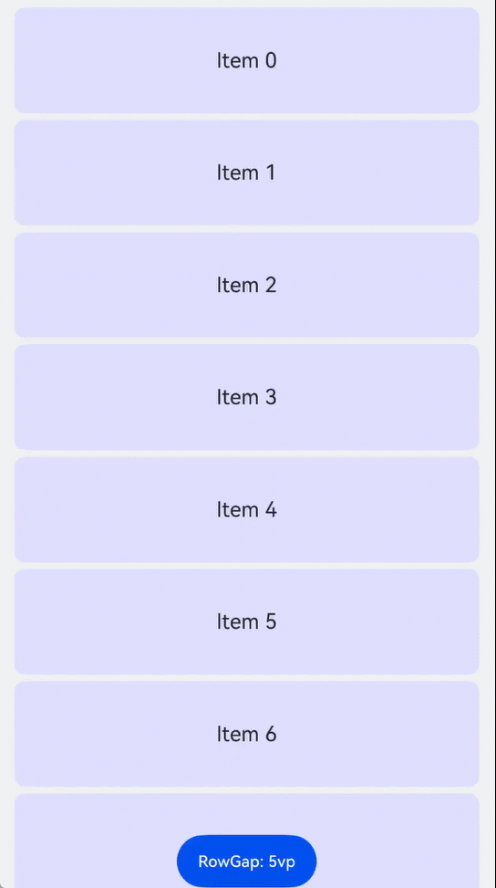

# Creating a Lazy Custom Layout (LazyDynamicLayout)

<!--Kit: ArkUI-->
<!--Subsystem: ArkUI-->
<!--Owner: @yylong; @rongShao-Z; @guozejun-->
<!--Designer: @yylong-->
<!--Tester: @leiyuqian-->
<!--Adviser: @Brilliantry_Rui-->
<!-- md-trans-meta sourceCommit=4431c59b895d1d02940f60be4527223815858a92 translatedAt=2026-07-09T11:48:13.790Z pushedAt=2026-07-10T07:07:13.194Z -->

ArkUI provides three preset lazy layout containers: [LazyColumnLayout](../reference/apis-arkui/arkui-ts/ts-container-lazycolumnlayout.md), [LazyVGridLayout](../reference/apis-arkui/arkui-ts/ts-container-lazyvgridlayout.md), and [LazyVWaterFlowLayout](../reference/apis-arkui/arkui-ts/ts-container-lazyvwaterflowlayout.md), which support vertical linear layout, vertical grid layout, and vertical waterfall layout respectively. When these preset layout containers cannot meet service requirements, you can use the [LazyDynamicLayout](../reference/apis-arkui/arkui-ts/ts-container-lazydynamiclayout.md) component with a custom layout algorithm to implement flexible lazy layouts.

**LazyDynamicLayout** is a dynamic layout container that supports lazy loading, allowing you to implement arbitrary layout patterns through the custom layout algorithm [LazyLayoutAlgorithm](../reference/apis-arkui/js-apis-arkui-lazyLayoutAlgorithm.md#lazylayoutalgorithm-1). This component only creates and lays out child components within the visible area of the parent scrollable component, reducing first-frame rendering time and memory overhead.

The **LazyDynamicLayout** component is supported from API version 26.0.0.

## Use Cases

**LazyDynamicLayout** is suitable for the following typical scenarios.

- **Custom layout mode**: The built-in **LazyColumnLayout**, **LazyVGridLayout**, and **LazyVWaterFlowLayout** provide fixed layout modes. When a service requires a special layout method, it can be implemented through a custom layout algorithm. For example:

  - Staggered layout: Child components have varying heights and need to be arranged according to specific rules.

  - Circular layout: Child components are arranged in a circle or sector.

  - Customized layout: Specific child components have customized layout positions, such as sticky headers or footers.

- **Dynamic layout parameter adjustment**: Layout parameters (such as spacing and size ratios) need to be dynamically adjusted at runtime, and the scroll position should remain stable after adjustment. A custom layout algorithm can precisely control the position adjustment logic when layout parameters change.

- **Complex hybrid layout**: When a combination of multiple layout modes needs to be implemented within the same **LazyDynamicLayout** and the preset layout containers cannot meet the requirements, it can be achieved through a custom algorithm.

## Constraints

1. **LazyDynamicLayout** needs to be used with a scrollable parent component. Its parent component supports [List](../reference/apis-arkui/arkui-ts/ts-container-list.md), [WaterFlow](../reference/apis-arkui/arkui-ts/ts-container-waterflow.md), [FlowItem](../reference/apis-arkui/arkui-ts/ts-container-flowitem.md), [Scroll](../reference/apis-arkui/arkui-ts/ts-container-scroll.md), and [LazyColumnLayout](../reference/apis-arkui/arkui-ts/ts-container-lazycolumnlayout.md). It also supports being applied within the above components after encapsulation using a custom component or [NodeContainer](../reference/apis-arkui/arkui-ts/ts-basic-components-nodecontainer.md).

2. The lazy loading support conditions for **LazyDynamicLayout** under different parent components are as follows.

   - Under the **WaterFlow** component, lazy loading is only supported when used in the single-column mode of the **WaterFlow** component or in a single-column segment within a segmented layout.

   - Under the **List** component, when the **List** has any of the [lanes](../reference/apis-arkui/arkui-ts/ts-container-list.md#lanes9), [chainAnimation](../reference/apis-arkui/arkui-ts/ts-container-list.md#chainanimation), or [scrollSnapAlign](../reference/apis-arkui/arkui-ts/ts-container-list.md#scrollsnapalign10) attributes set, the lazy loading feature of this component will become invalid.

   - When used within **Scroll**, **List**, or **WaterFlow** components, the scroll direction (horizontal or vertical) of **Scroll**, **List**, or **WaterFlow** must be the same as the layout direction of this component. If the layout directions differ, it will cause an app crash. The layout direction of this component is set via the **axis** member of the constructor parameter of [LazyCustomLayoutAlgorithm](../reference/apis-arkui/js-apis-arkui-lazyLayoutAlgorithm.md#lazycustomlayoutalgorithm).

3. When the layout algorithm is [LazyCustomLayoutAlgorithm](../reference/apis-arkui/js-apis-arkui-lazyLayoutAlgorithm.md#lazycustomlayoutalgorithm), the [setMeasuredSize](../reference/apis-arkui/js-apis-arkui-frameNode.md#setmeasuredsize12) method of the **LazyDynamicLayout** component's [FrameNode](../reference/apis-arkui/js-apis-arkui-frameNode.md#framenode-1) takes precedence over the [size settings](../reference/apis-arkui/arkui-ts/ts-universal-attributes-size.md) and [border settings](../reference/apis-arkui/arkui-ts/ts-universal-attributes-border.md) attributes, and the [measure](../reference/apis-arkui/js-apis-arkui-frameNode.md#measure12) and [layout](../reference/apis-arkui/js-apis-arkui-frameNode.md#layout12) methods of the child component's [FrameNode](../reference/apis-arkui/js-apis-arkui-frameNode.md#framenode-1) take precedence over the [ignoreLayoutSafeArea](../reference/apis-arkui/arkui-ts/ts-universal-attributes-expand-safe-area.md#ignorelayoutsafearea20) attribute.

## Development Procedure for a Custom Layout Algorithm

A custom layout algorithm needs to inherit the [LazyCustomLayoutAlgorithm](../reference/apis-arkui/js-apis-arkui-lazyLayoutAlgorithm.md#lazycustomlayoutalgorithm) class and implement the **onMeasure** and **onLayout** methods. The following uses **LazyColumnLayoutAlgorithm** as an example to introduce the development steps of a custom layout algorithm.

### Creating a Layout Algorithm Class

First, create a class that inherits from **LazyCustomLayoutAlgorithm** and define the parameters and data structures required for the layout.

<!-- @[lazy_custom_layout_algorithm_class](https://gitcode.com/openharmony/applications_app_samples/blob/master/code/DocsSample/ArkUISample/ScrollableComponent/entry/src/main/ets/pages/lazyCustomLayout/LazyColumnLayoutAlgorithm.ets) -->

``` TypeScript
/**
 * LazyColumnLayoutAlgorithm - Single-column layout algorithm
 *
 * Features:
 * - Single-column vertical layout
 * - Lazy loading: only measures and lays out elements within the visible range.
 * - Anchor retention: maintains position stability when spacing changes.
 *
 * Core data structures:
 * - itemArr: stores position information of measured elements (sorted by element index).
 * - itemArrStartIndex: the index corresponding to the first element in itemArr
 */
export class LazyColumnLayoutAlgorithm extends LazyCustomLayoutAlgorithm {
  // === Core layout data ===
  private itemArr: ItemPos[] = [];          // Position array of measured elements.
  private itemArrStartIndex: number = -1;   // Actual element index corresponding to itemArr[0].
  private estimateItemHeight: number = -1;  // Estimated average element height (used for measuring unknown areas).
  private totalHeight: number = 0;          // Total height (including estimated height of unmeasured areas).

  // === Element information ===
  private childCnt: number = 0;             // Total number of child elements.
  private startIndex: number = -1;          // Index of the first element in the current visible range.
  private endIndex: number = -1;            // Index of the last element in the current visible range.

  // === Layout parameters ===
  private rowGap: number = 0;               // Element spacing.
  private leftPadding: number = 0;          // Left padding.
  private rightPadding: number = 0;         // Right padding.
  private topPadding: number = 0;           // Top padding.
  private bottomPadding: number = 0;        // Bottom padding.

  // === state tracking ===
  private prevRowGap: number = 0;           // Previous spacing (used to detect changes).
  private selfNode?: FrameNode;             // Node reference (used to trigger re-layout).
  private prevStartIndex = -1;              // Start index of the last completed layout.
  private prevEndIndex = -1;                // End index of the last completed layout.

  // === anchor info (kept stable during scrolling) ===
  private anchorChildIndex: number = -1;              // Index of the anchor element.
  private anchorChildRelativePos: number = 0;        // Distance from the anchor to the edge of the visible area.
```

Define padding variables to store the container's padding information. Use the [getUserConfigPadding](../reference/apis-arkui/js-apis-arkui-frameNode.md#getuserconfigpadding12) method to obtain the **padding** attribute values set by the user. The [LengthMetrics](../reference/apis-arkui/js-apis-arkui-graphics.md#lengthmetrics12) type returned by this method needs to be converted to pixel values.

``` TypeScript
private updatePadding(self: FrameNode, constraint: LayoutConstraint): void {
  const padding = self.getUserConfigPadding();
  const containerWidth = constraint.percentReference.width;

  this.leftPadding = this.convertToPx(padding?.left, containerWidth);
  this.rightPadding = this.convertToPx(padding?.right, containerWidth);
  this.topPadding = this.convertToPx(padding?.top, containerWidth);
  this.bottomPadding = this.convertToPx(padding?.bottom, containerWidth);
}

private convertToPx(lengthMetrics: LengthMetrics | undefined, referenceSize?: number): number {
  if (!lengthMetrics) {
    return 0;
  }

  const value = lengthMetrics.value;
  const unit = lengthMetrics.unit ?? LengthUnit.VP;

  switch (unit) {
    case LengthUnit.PX:
      return value;
    case LengthUnit.VP:
      return this.uiContext ? this.uiContext.vp2px(value) : value;
    case LengthUnit.PERCENT:
      return referenceSize ? (value) * referenceSize : 0;
    case LengthUnit.FP:
      return this.uiContext ? this.uiContext.fp2px(value) : value;
    case LengthUnit.LPX:
      return this.uiContext ? this.uiContext.lpx2px(value) : value;
    default:
      return value;
  }
}
```

Provide the **setRowGap** method for dynamically modifying the spacing. When layout parameters change, call the [setNeedsLayout](../reference/apis-arkui/js-apis-arkui-frameNode.md#setneedslayout12) method to trigger a re-layout.

<!-- @[lazy_custom_layout_algorithm_set_row_gap](https://gitcode.com/openharmony/applications_app_samples/blob/master/code/DocsSample/ArkUISample/ScrollableComponent/entry/src/main/ets/pages/lazyCustomLayout/LazyColumnLayoutAlgorithm.ets) -->

``` TypeScript
setRowGap(value: number): void {
  if (this.rowGap === value) {
    return;
  }
  this.prevRowGap = this.rowGap;
  this.rowGap = value;
  this.selfNode?.setNeedsLayout();
}
```

### Implementing the onMeasure Method

The **onMeasure** method is responsible for measuring child components and calculating the container size. In lazy loading mode, the core flow of this method is as follows.

<!-- @[lazy_custom_layout_algorithm_on_measure](https://gitcode.com/openharmony/applications_app_samples/blob/master/code/DocsSample/ArkUISample/ScrollableComponent/entry/src/main/ets/pages/lazyCustomLayout/LazyColumnLayoutAlgorithm.ets) -->

``` TypeScript
/**
 * onMeasure - Core method for measuring layout
 *
 * Flow:
 * 1. Calculate and save padding.
 * 2. Handle empty child elements or non-lazy layout.
 * 3. Save anchor information.
 * 4. Measure elements within the visible area.
 * 5. Recycle elements that are no longer visible.
 * 6. Adjust the anchor position to maintain scroll stability.
 * 7. Set the layout container's own size.
 */
onMeasure(self: FrameNode, constraint: LayoutConstraint, helper?: LazyLayoutHelper): void {
  this.childCnt = self.getChildrenCount(ChildrenCountMode.ALL_NOT_EXPAND);
  this.selfNode = self;

  this.updatePadding(self, constraint);
  const verticalPadding = this.topPadding + this.bottomPadding;

  if (this.childCnt == 0) {
    this.clearMeasureState();
    self.setMeasuredSize({ width: constraint.maxSize.width, height: verticalPadding });
    return;
  }

  if (!helper) {
    this.measureAllChildren(self, constraint);
    self.setMeasuredSize({ width: constraint.maxSize.width, height: this.totalHeight + verticalPadding });
    this.prevRowGap = this.rowGap;
    return;
  }

  // Save anchor information.
  this.saveAnchorInfo(helper, this.totalHeight);

  this.measureInViewRange(self, constraint, helper);

  // Recycle elements that are no longer visible.
  this.recycleChildren(helper);

  // Adjust the anchor position to maintain scroll stability.
  this.adjustAnchorPosition(helper);

  self.setMeasuredSize({ width: constraint.maxSize.width, height: this.totalHeight + verticalPadding });
}
```

Each sub-step is described in detail below.

1. Calculate and save the padding.

    Use the [getUserConfigPadding](../reference/apis-arkui/js-apis-arkui-frameNode.md#getuserconfigpadding12) method to obtain the **padding** attribute values set on the container, and convert them to pixel values based on the unit type. The padding needs to be used in subsequent measurement and layout.

2. Handle empty child elements or non-lazy layout.

    First, get the total number of child components using [ChildrenCountMode](../reference/apis-arkui/js-apis-arkui-frameNode.md#childrencountmode).**ALL_NOT_EXPAND** to avoid lazy loading failure caused by full loading. If the number of child components is **0**, clear the measurement state and set the container height to **0**. If the **helper** parameter is **undefined**, lazy loading is not supported (such as in **List** multi-column mode), and all child components need to be fully measured.

3. Handle layout parameter changes to maintain scroll stability.

    When layout parameters (such as spacing) change, the positions of all child components will shift. For example, when the spacing increases from 5 vp to 10 vp, the position of the 11th child component will shift downward by 50 vp (10 * 5 vp). If the scroll position is not adjusted, the user will perceive a sudden jump in content, affecting the experience.

    To maintain scrolling stability, it is necessary to ensure that the anchor child component within the visible area remains at the same relative position before and after layout parameter changes. This is achieved through the following sub-steps.

    - Save anchor information.

        Before measurement begins, the position information of the anchor child component needs to be saved. The anchor refers to the child component at the edge of the visible area.

        - Forward scrolling (**FORWARD**, from top to bottom): The anchor is the first child component (**startIndex**) in the visible area.

        - Backward scrolling (**BACKWARD**, from bottom to top): The anchor is the last child component (**endIndex**) in the visible area.

        <!-- @[lazy_custom_layout_save_anchor](https://gitcode.com/openharmony/applications_app_samples/blob/master/code/DocsSample/ArkUISample/ScrollableComponent/entry/src/main/ets/pages/lazyCustomLayout/LazyColumnLayoutAlgorithm.ets) -->

        ``` TypeScript
        /**
         * saveAnchorInfo - saves anchor information
         *
         * Purpose: saves the anchor before measurement to ensure stability during scrolling.
         *
         * Anchor selection:
         * - FORWARD: startIndex (first element in the visible area).
         * - BACKWARD: endIndex (last element in the visible area).
         *
         * anchorChildRelativePos:
         * - FORWARD: absolute position of the anchor element (distance from the top of the total height).
         * - BACKWARD: distance of the anchor from the bottom of the total height
         */
        private saveAnchorInfo(helper: LazyLayoutHelper, prevTotalHeight: number): void {
          this.anchorChildIndex = -1;
          this.anchorChildRelativePos = 0;
        
          if (helper.getLazyLayoutDirection() === LazyLayoutDirection.FORWARD) {
            if (this.startIndex > 0 && this.startIndex < this.childCnt) {
              this.anchorChildIndex = this.startIndex;
              const arrayIndex = this.anchorChildIndex - this.itemArrStartIndex;
              if (arrayIndex >= 0 && arrayIndex < this.itemArr.length) {
                this.anchorChildRelativePos = this.itemArr[arrayIndex].start;
              }
            }
          } else {
            if (this.endIndex >= 0 && this.endIndex < this.childCnt - 1) {
              this.anchorChildIndex = this.endIndex;
              const arrayIndex = this.anchorChildIndex - this.itemArrStartIndex;
              if (arrayIndex >= 0 && arrayIndex < this.itemArr.length) {
                this.anchorChildRelativePos = prevTotalHeight - this.itemArr[arrayIndex].end;
              }
            }
          }
        }
        ```

    - Measure and calculate new positions.

        After measurement is complete, the position of the anchor child component may have changed. The new position needs to be calculated:

        - During forward scrolling, the new position is the start value of the anchor element.

        - During backward scrolling, the new position is the distance of the anchor element from the bottom of the total height.

    - Adjust the scroll position.

        By comparing the old and new positions of the anchor, calculate the offset adjustment and adjust the scroll position via [setAdjustedOffset](../reference/apis-arkui/js-apis-arkui-lazyLayoutAlgorithm.md#setadjustedoffset).

        <!-- @[lazy_custom_layout_algorithm_adjust_anchor](https://gitcode.com/openharmony/applications_app_samples/blob/master/code/DocsSample/ArkUISample/ScrollableComponent/entry/src/main/ets/pages/lazyCustomLayout/LazyColumnLayoutAlgorithm.ets) -->

        ``` TypeScript
        /**
         * adjustAnchorPosition - Adjust the anchor position to maintain scroll stability
         *
         * Purpose: After measurement is complete, adjust the scroll offset to ensure the anchor remains at the same position relative to the visible area.
         */
        private adjustAnchorPosition(helper: LazyLayoutHelper): void {
          if (this.anchorChildIndex >= 0) {
            if (helper.getLazyLayoutDirection() === LazyLayoutDirection.FORWARD) {
              const arrayIndex = this.anchorChildIndex - this.itemArrStartIndex;
              if (arrayIndex >= 0 && arrayIndex < this.itemArr.length) {
                let newPos = this.itemArr[arrayIndex].start;
                if (newPos !== this.anchorChildRelativePos) {
                  helper.setAdjustedOffset(this.anchorChildRelativePos - newPos);
                }
              }
            } else {
              const arrayIndex = this.anchorChildIndex - this.itemArrStartIndex;
              if (arrayIndex >= 0 && arrayIndex < this.itemArr.length) {
                let newPos = this.totalHeight - this.itemArr[arrayIndex].end;
                if (newPos !== this.anchorChildRelativePos) {
                  helper.setAdjustedOffset(newPos - this.anchorChildRelativePos);
                }
              }
            }
          }
        }
        ```

    **Principles**

    During forward scrolling, the anchor is the first child component in the visible area. After layout parameters change, the actual position of this child component may change.

During backward scrolling, the anchor is the last child component in the visible area. The principle is similar, but the anchor position is calculated relative to the bottom of the total height. For example:

- The spacing changes from 5 vp to 10 vp.

- The anchor child component index is 10 (that is, the 11th child component)

- The previous position of this child component: 10 × 80 vp + 10 × 5 vp = 850 vp (assuming a child component height of 80 vp)

- The new position of this child component: 10 × 80 vp + 10 × 10 vp = 900 vp

    - Offset adjustment: 850 vp - 900 vp = -50 vp

    After calling setAdjustedOffset (-50 vp), the parent scrollable component of **LazyDynamicLayout** scrolls up by 50 vp, keeping the anchor child component at the same relative position in the visible area.

4. Measure elements within the visible range.

    Measuring elements within the visible range requires the following steps: obtaining the child component, creating measurement constraints for the child component, calling the child component's measure function, and obtaining the measured size of the child component.

    - Obtain the child component.

        Obtain the FrameNode of the child component at the specified index using the [getChild](../reference/apis-arkui/js-apis-arkui-frameNode.md#getchild12) method. You must pass the `ExpandMode.LAZY_NOT_EXPAND` parameter to prevent full loading, which would cause lazy loading failure.

        <!-- @[lazy_custom_layout_get_child_not_expand](https://gitcode.com/openharmony/applications_app_samples/blob/master/code/DocsSample/ArkUISample/ScrollableComponent/entry/src/main/ets/pages/lazyCustomLayout/LazyColumnLayoutAlgorithm.ets) -->

        ``` TypeScript
        let child = self.getChild(currIndex, ExpandMode.LAZY_NOT_EXPAND);
        ```

    - Create measurement constraints for the child component.

        Create measurement constraints for the child component based on the container constraints and layout requirements. In a single-column layout, the child component's width equals the container width minus the left and right padding.

        <!-- @[lazy_custom_layout_create_child_constraint](https://gitcode.com/openharmony/applications_app_samples/blob/master/code/DocsSample/ArkUISample/ScrollableComponent/entry/src/main/ets/pages/lazyCustomLayout/LazyColumnLayoutAlgorithm.ets) -->

        ``` TypeScript
        /**
         * Create layout constraints for the child element.
         * Single-column layout: The element width equals the container width minus the left and right padding.
         */
        private createChildConstraint(constraint: LayoutConstraint): LayoutConstraint {
          const horizontalPadding = this.leftPadding + this.rightPadding;
          const containerWidth = constraint.maxSize.width;
          const childWidth = containerWidth - horizontalPadding;
        
          const childConstraint: LayoutConstraint = {
            maxSize: {
              width: childWidth,
              height: constraint.maxSize.height,
            },
            minSize: {
              width: 0,
              height: constraint.minSize.height,
            },
            percentReference: {
              width: childWidth,
              height: constraint.percentReference.height,
            },
          };
        
          return childConstraint;
        }
        ```

    - Call the child component's measure function and obtain the measured size.

        Call the child component FrameNode's [measure](../reference/apis-arkui/js-apis-arkui-frameNode.md#measure12) method, passing in measurement constraints, to trigger the child component measurement process. After measurement is complete, obtain the child component's measured size through the [getMeasuredSize](../reference/apis-arkui/js-apis-arkui-frameNode.md#getmeasuredsize12) method.

    **Complete Measurement Process Example**

    The following example demonstrates the complete process of forward measuring elements within the visible range, including obtaining child components, creating constraints, calling measure, obtaining measured sizes, and recording position information.

    <!-- @[lazy_custom_layout_measure_forward](https://gitcode.com/openharmony/applications_app_samples/blob/master/code/DocsSample/ArkUISample/ScrollableComponent/entry/src/main/ets/pages/lazyCustomLayout/LazyColumnLayoutAlgorithm.ets) -->

    ``` TypeScript
    private measureForward(
      self: FrameNode,
      constraint: LayoutConstraint,
      helper: LazyLayoutHelper,
      startIndex: number,
      startPos: number,
      tmpItemArr: ItemPos[],
      tmpItemArrStartIndex: number
    ): number {
      let currIndex = startIndex;
      let currPos = startPos;
      let childConstraint = this.createChildConstraint(constraint);
    
      for (; currIndex < this.childCnt; currIndex++) {
        let itemHeight = 0;
        let child = self.getChild(currIndex, ExpandMode.LAZY_NOT_EXPAND);
        if (child) {
          child.measure(childConstraint);
          itemHeight = child.getMeasuredSize().height;
        }
        tmpItemArrStartIndex = Math.min(currIndex, tmpItemArrStartIndex);
        tmpItemArr[currIndex - tmpItemArrStartIndex] = {
          start: currPos,
          end: currPos + itemHeight,
        };
        currPos += itemHeight;
        if (currIndex < this.childCnt - 1) {
          currPos += this.rowGap;
        }
    
        if (currPos > helper.getViewEnd()) {
          break;
        }
      }
    
      return tmpItemArrStartIndex;
    }
    ```

    For unmeasured child component areas, the total height is calculated using an estimated height to avoid measuring all child components just to obtain the total height.

    <!-- @[lazy_custom_layout_estimate](https://gitcode.com/openharmony/applications_app_samples/blob/master/code/DocsSample/ArkUISample/ScrollableComponent/entry/src/main/ets/pages/lazyCustomLayout/LazyColumnLayoutAlgorithm.ets) -->

    ``` TypeScript
    private calculateEstimateItemHeight(): void {
      let totalSize = 0;
      for (const item of this.itemArr) {
        totalSize += (item.end - item.start);
      }
      this.estimateItemHeight = totalSize / this.itemArr.length;
    }
    
    private updateTotalHeight(): void {
      const endPos = this.itemArr[this.itemArr.length - 1].end;
      const measuredCount = this.itemArrStartIndex + this.itemArr.length;
      const remainingCount = this.childCnt - measuredCount;
    
      if (remainingCount > 0 && this.estimateItemHeight > 0) {
        // When there are still unmeasured elements, the gap needs to be considered.
        this.totalHeight = endPos + remainingCount * (this.estimateItemHeight + this.rowGap);
      } else {
        this.totalHeight = endPos;
      }
    }
    ```

5. Recycle child components that have left the visible area.

    When a child component leaves the visible area, set it to inactive state via [setChildrenInactive](../reference/apis-arkui/js-apis-arkui-lazyLayoutAlgorithm.md#setchildreninactive) to release memory.

    <!-- @[lazy_custom_layout_recycle](https://gitcode.com/openharmony/applications_app_samples/blob/master/code/DocsSample/ArkUISample/ScrollableComponent/entry/src/main/ets/pages/lazyCustomLayout/LazyColumnLayoutAlgorithm.ets) -->

    ``` TypeScript
    /**
     * recycleChildren - Recycle elements that are no longer visible.
     *
     * Purpose: Release elements that have left the visible area after scrolling to save memory.
     *
     * Recycling range:
     * - Forward scrolling: Recycle elements between this.prevStartIndex -> this.startIndex
     * - Backward scrolling: Recycle elements between this.endIndex -> this.prevEndIndex
     */
    private recycleChildren(helper: LazyLayoutHelper): void {
      let recycleList: number[] = [];
      if (this.prevStartIndex >= 0 && this.prevStartIndex < this.startIndex) {
        for (let i = this.prevStartIndex; i < this.startIndex; i++) {
          recycleList.push(i);
        }
      }
      if (this.prevEndIndex >= 0 && this.prevEndIndex > this.endIndex) {
        for (let i = this.endIndex + 1; i <= this.prevEndIndex; i++) {
          recycleList.push(i);
        }
      }
      if (recycleList.length > 0) {
        helper.setChildrenInactive(recycleList);
      }
    }
    ```

6. Set the layout container's own size.

    Finally, call [setMeasuredSize](../reference/apis-arkui/js-apis-arkui-frameNode.md#setmeasuredsize12) to set the container's measured size. The container width is typically set to **constraint.maxSize.width**, and the height is calculated based on the arrangement of child components, estimated height, and vertical padding (**topPadding** + **bottomPadding**).

    **Key API Description**

    | API | Description |
    |------|------|
    | [getChildrenCount](../reference/apis-arkui/js-apis-arkui-frameNode.md#getchildrencount12) | Gets the total number of child components. Use [ChildrenCountMode](../reference/apis-arkui/js-apis-arkui-frameNode.md#childrencountmode).**ALL_NOT_EXPAND** to avoid full loading when getting the total number of child components, which would cause lazy loading failure. |
    | [getChild](../reference/apis-arkui/js-apis-arkui-frameNode.md#getchild12) | Gets the child component at the specified index. Use **ExpandMode.LAZY_NOT_EXPAND** to avoid full loading when getting a child component, which would cause lazy loading failure. |
    | [getViewStart](../reference/apis-arkui/js-apis-arkui-lazyLayoutAlgorithm.md#getviewstart) | Gets the start position of the visible area (relative to the top of the **LazyDynamicLayout** content area). |
    | [getViewEnd](../reference/apis-arkui/js-apis-arkui-lazyLayoutAlgorithm.md#getviewend) | Gets the end position of the visible area. |
    | [getLazyLayoutDirection](../reference/apis-arkui/js-apis-arkui-lazyLayoutAlgorithm.md#getlazylayoutdirection) | Gets the current layout direction. **FORWARD** indicates forward layout (top to bottom), and **BACKWARD** indicates backward layout (bottom to top). |
    | [setAdjustedOffset](../reference/apis-arkui/js-apis-arkui-lazyLayoutAlgorithm.md#setadjustedoffset) | Sets the offset adjustment. It is used to adjust the scroll position after layout parameters change, keeping the position of the first child component in the visible area unchanged. |
    | [setChildrenInactive](../reference/apis-arkui/js-apis-arkui-lazyLayoutAlgorithm.md#setchildreninactive) | Sets the child component at the specified index to the inactive state. Inactive child components are recycled to free memory. |
    | [getUserConfigPadding](../reference/apis-arkui/js-apis-arkui-frameNode.md#getuserconfigpadding12) | Gets the padding attribute value set by the user. Returns a **LengthMetrics** type, which needs to be converted to a pixel value. |
    | [setMeasuredSize](../reference/apis-arkui/js-apis-arkui-frameNode.md#setmeasuredsize12) | Sets the measured size of the component. |

### Implementing the onLayout Method

The **onLayout** method is responsible for determining the position of each child component. The **onLayout** method needs to traverse all child components in the visible area, call the layout method of each child component, and pass in the layout position relative to the top-left corner of the **LazyDynamicLayout** component area. Padding needs to be considered when laying out child components: the x-coordinate of the child component is **leftPadding**, and the y-coordinate is the position recorded in **itemArr** plus **topPadding**.

<!-- @[lazy_custom_layout_algorithm_on_layout](https://gitcode.com/openharmony/applications_app_samples/blob/master/code/DocsSample/ArkUISample/ScrollableComponent/entry/src/main/ets/pages/lazyCustomLayout/LazyColumnLayoutAlgorithm.ets) -->

``` TypeScript
onLayout(self: FrameNode): void {
  this.prevStartIndex = this.startIndex;
  this.prevEndIndex = this.endIndex;
  if (this.childCnt == 0) {
    return;
  }
  for (let i = this.startIndex; i <= this.endIndex; i++) {
    let child = self.getChild(i, ExpandMode.LAZY_NOT_EXPAND);

    if (child) {
      const arrayIndex = i - this.itemArrStartIndex;

      if (arrayIndex >= 0 && arrayIndex < this.itemArr.length) {
        const x = this.leftPadding;
        const y = this.itemArr[arrayIndex].start + this.topPadding;
        child.layout({x: x, y: y});
      }
    }
  }
}
```

## Using the Custom Layout Algorithm

After completing the development of the custom layout algorithm, you can pass the layout algorithm instance to the **LazyDynamicLayout** component and work with a parent scrollable component to implement lazy loading in a custom layout mode. This section describes how to create a **LazyDynamicLayout** component, dynamically adjust layout parameters, and listen for visible area changes.

### Creating a LazyDynamicLayout Component

When using the **LazyDynamicLayout** component, you need to first import the component and the layout algorithm class, and then pass the layout algorithm instance in the constructor.

<!-- @[lazy_custom_layout_create](https://gitcode.com/openharmony/applications_app_samples/blob/master/code/DocsSample/ArkUISample/ScrollableComponent/entry/src/main/ets/pages/lazyCustomLayout/CustomLazyColumnLayoutSample.ets) -->

``` TypeScript
@Component
export struct CustomLazyColumnLayoutSample {
  // ...

  aboutToAppear(): void {
    this.lazyAlgorithm.setRowGap(this.getUIContext().vp2px(this.rowGap));
    for (let i = 0; i < 50; i++) {
      this.arr.pushData(`Item ${i}`);
    }
  }

  build() {
    NavDestination() {
      Stack({ alignContent: Alignment.Bottom }) {
        List() {
          LazyDynamicLayout(this.lazyAlgorithm) {
            // ...
          }
          .onVisibleIndexesChange((child: number[]) => {
            console.info(`onVisibleIndexesChange: ${child}`);
          })
          .width('100%')
        }
        .width('100%')
        .height('100%')
        .padding({ left: 12, right: 12 })

        Button(`RowGap: ${this.rowGap}vp`)
          .fontSize(12)
          .onClick(() => {
            this.rowGap = this.rowGap === 5 ? 10 : 5;
          })
          .margin({ bottom: 20 })
      }
      .height('100%')
      .width('100%')
    }
    .backgroundColor('#f1f2f3')
    .title($r('app.string.customLazyColumnLayout_title'))
  }
}
```

Dynamically adjust layout parameters, using the @Watch decorator to listen for parameter changes.

<!-- @[lazy_custom_layout_dynamic_param](https://gitcode.com/openharmony/applications_app_samples/blob/master/code/DocsSample/ArkUISample/ScrollableComponent/entry/src/main/ets/pages/lazyCustomLayout/CustomLazyColumnLayoutSample.ets) -->

``` TypeScript
@State @Watch('onRowGapChange') rowGap: number = 5;
```

The size parameters in the layout algorithm use pixel units and need to be converted using the [getUIContext().vp2px](../reference/apis-arkui/arkts-apis-uicontext-uicontext.md#vp2px12) method.

<!-- @[lazy_custom_layout_unit_convert](https://gitcode.com/openharmony/applications_app_samples/blob/master/code/DocsSample/ArkUISample/ScrollableComponent/entry/src/main/ets/pages/lazyCustomLayout/CustomLazyColumnLayoutSample.ets) -->

``` TypeScript
onRowGapChange(): void {
  this.lazyAlgorithm.setRowGap(this.getUIContext().vp2px(this.rowGap));
}
```

### Listening for Visible Area Changes

The **LazyDynamicLayout** component provides the [onVisibleIndexesChange](../reference/apis-arkui/arkui-ts/ts-container-lazydynamiclayout.md#onvisibleindexeschange) event, which is used to listen for changes in the index values of child components within the visible area. The callback is triggered when the **LazyDynamicLayout** completes its initial layout or when the index values of child components within the visible area of its parent scrollable component change, returning a list of index values for the child components in the visible area.

<!-- @[lazy_custom_layout_on_visible_indexes_change](https://gitcode.com/openharmony/applications_app_samples/blob/master/code/DocsSample/ArkUISample/ScrollableComponent/entry/src/main/ets/pages/lazyCustomLayout/CustomLazyColumnLayoutSample.ets) -->

``` TypeScript
LazyDynamicLayout(this.lazyAlgorithm) {
  // ...
}
.onVisibleIndexesChange((child: number[]) => {
  console.info(`onVisibleIndexesChange: ${child}`);
})
```

## Complete Sample Code

The following example demonstrates how to use **LazyDynamicLayout** with the custom layout algorithm **LazyColumnLayoutAlgorithm** to implement a lazy loading single-column list, supporting dynamic adjustment of row spacing while keeping the scroll position stable.

<!--RP1-->

For the complete example, see [Custom Lazy Single-Column Layout Example](https://gitcode.com/openharmony/applications_app_samples/blob/master/code/DocsSample/ArkUISample/ScrollableComponent/entry/src/main/ets/pages/lazyCustomLayout/CustomLazyColumnLayoutSample.ets).

<!--RP1End-->

In the above example, tapping the bottom button can switch the row spacing. Because the [setAdjustedOffset](../reference/apis-arkui/js-apis-arkui-lazyLayoutAlgorithm.md#setadjustedoffset) adjustment logic is implemented in the layout algorithm, the position of the first child component in the visible area remains unchanged after switching the spacing, avoiding scroll jitter.



For the development of custom lazy layouts, the following related examples are available for reference.

<!--RP2-->

- [Custom lazy single-column layout example](https://gitcode.com/openharmony/applications_app_samples/blob/master/code/DocsSample/ArkUISample/ScrollableComponent/entry/src/main/ets/pages/lazyCustomLayout/CustomLazyColumnLayoutSample.ets): Demonstrates how to use **LazyDynamicLayout** with **LazyColumnLayoutAlgorithm** to implement a lazy loading single-column list.

- [Custom lazy grid layout example](https://gitcode.com/openharmony/applications_app_samples/blob/master/code/DocsSample/ArkUISample/ScrollableComponent/entry/src/main/ets/pages/lazyCustomLayout/CustomLazyGridLayoutSample.ets): Demonstrates how to use **LazyDynamicLayout** with **LazyGridLayoutAlgorithm** to implement a lazy loading grid layout.

- [Custom lazy waterfall layout example](https://gitcode.com/openharmony/applications_app_samples/blob/master/code/DocsSample/ArkUISample/ScrollableComponent/entry/src/main/ets/pages/lazyCustomLayout/CustomLazyWaterFlowLayoutSample.ets): Demonstrates how to use **LazyDynamicLayout** with **LazyWaterFlowLayoutAlgorithm** to implement a lazy loading waterfall layout.

<!--RP2End-->

<!--no_check-->