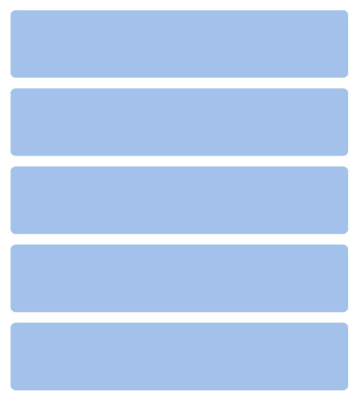
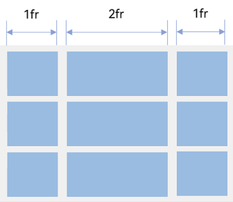
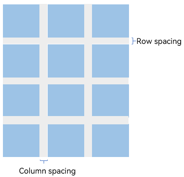
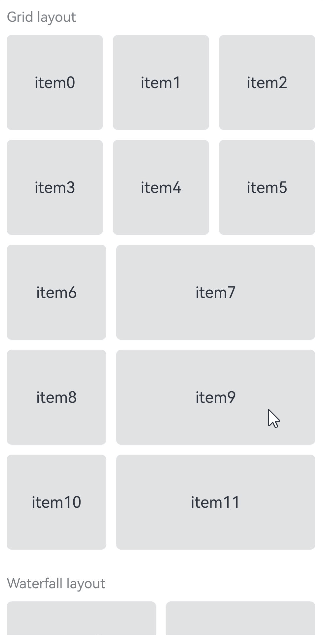
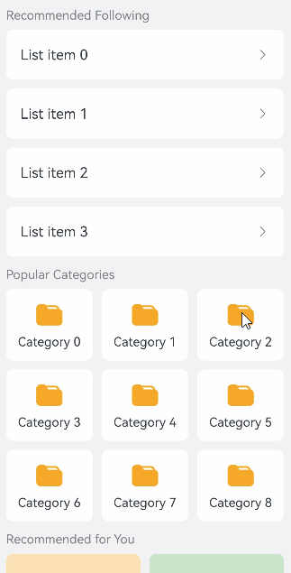
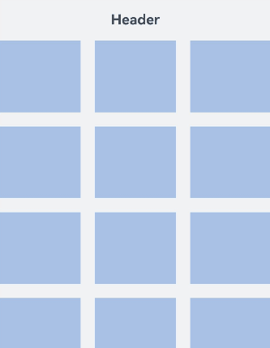
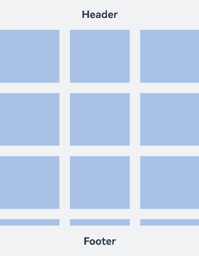
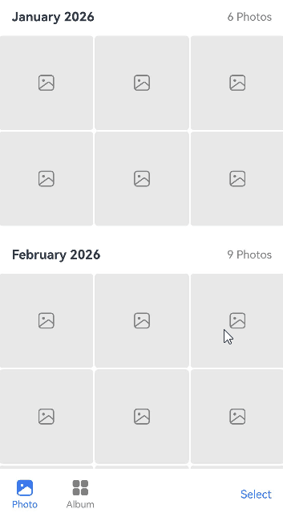

# Creating Lazy Layouts (LazyColumnLayout/LazyVGridLayout/LazyVWaterFlowLayout)

<!--Kit: ArkUI-->
<!--Subsystem: ArkUI-->
<!--Owner: @yylong; @rongShao-Z; @yangcan18-->
<!--Designer: @yylong-->
<!--Tester: @huchuyun-->
<!--Adviser: @Brilliantry_Rui-->
<!-- md-trans-meta sourceCommit=087470085268b4c7968360a1498b1da15f27d467 translatedAt=2026-07-06T13:07:17.959Z pushedAt=2026-07-07T08:39:42.889Z -->

ArkUI provides four scrollable components: [Scroll](../reference/apis-arkui/arkui-ts/ts-container-scroll.md), [List](../reference/apis-arkui/arkui-ts/ts-container-list.md), [Grid](../reference/apis-arkui/arkui-ts/ts-container-grid.md), and [WaterFlow](../reference/apis-arkui/arkui-ts/ts-container-waterflow.md). Among them, **Scroll** does not support lazy loading. Although **List**, **Grid**, and **WaterFlow** support lazy loading with [LazyForEach](./rendering-control/arkts-rendering-control-lazyforeach.md), each supports only a specific layout mode. In actual service scenarios, a scrolling page often needs to mix multiple layout modes. For example, an e-commerce homepage may simultaneously contain multi-column grid category entries, waterfall product cards, and linear list recommendations; a social app feed may simultaneously contain text lists, nine-grid images, and video cards. In such cases, a single scrollable component cannot flexibly adapt and has certain limitations.

Lazy layout containers are a type of layout container nested inside a scrollable parent component (**Scroll**, **List**, and **WaterFlow**) that loads child components on demand. These containers do not provide scrolling capabilities themselves; scrolling is handled uniformly by the parent component. They only create and lay out child components within the visible area of the scrollable parent component, and preload content half a screen above and below the visible area during idle time between frames, thereby reducing first-frame rendering time and memory overhead. ArkUI provides three layout container components that support lazy loading: vertical linear layout [LazyColumnLayout](../reference/apis-arkui/arkui-ts/ts-container-lazycolumnlayout.md), vertical grid layout [LazyVGridLayout](../reference/apis-arkui/arkui-ts/ts-container-lazyvgridlayout.md), and vertical waterfall layout [LazyVWaterFlowLayout](../reference/apis-arkui/arkui-ts/ts-container-lazyvwaterflowlayout.md). Different lazy layout containers provide different layout modes, allowing you to combine multiple types of lazy layout containers within the same parent component to flexibly implement mixed layouts.

**LazyVGridLayout** is supported since API version 19. **LazyColumnLayout** and **LazyVWaterFlowLayout** are supported since API version 26.0.0.

## Use Cases

Lazy layout containers are suitable for the following typical scenarios.

- **Mixed layout pages**: A scrolling page that needs to display content in multiple layout modes simultaneously, such as e-commerce homepages and social app feeds. **List**, **Grid**, and **WaterFlow** support linear, grid, and waterfall layout modes respectively. By using lazy layout containers, different layout modes can be flexibly combined within the same scrollable parent component. Each container independently configures its own layout parameters (such as grouping and column count), and all areas share the unified scrolling of the parent component, eliminating the need for additional handling of gesture conflicts caused by nested scrollable components.

- **Independent data source management**: Different areas on a page have different data sources and need to manage their own data separately. Each lazy layout container can use an independent data source, so data from different service modules does not need to be coupled together, reducing the complexity of data management.

- **Optimization for Scroll scenarios with a large number of child components**: As a general-purpose scrollable container, the **Scroll** component itself does not provide lazy loading capabilities. By using lazy layout containers within it, child components can be loaded on demand, avoiding the creation of all child components at once and ensuring a smooth experience in scenarios with a large number of child components.

## Capability Comparison

The capabilities of the three lazy layout containers are compared as follows.

| Capability | LazyVGridLayout | LazyVWaterFlowLayout | LazyColumnLayout |
|------|-----------------|---------------------|-----------------|
| API start version | 19 | 26.0.0 | 26.0.0 |
| Set row spacing | Supported ([rowsGap](../reference/apis-arkui/arkui-ts/ts-container-lazyvgridlayout.md#rowsgap)) | Supported ([rowsGap](../reference/apis-arkui/arkui-ts/ts-container-lazyvwaterflowlayout.md#rowsgap)) | Supported ([space](../reference/apis-arkui/arkui-ts/ts-container-lazycolumnlayout.md#space)) |
| Set column spacing ([columnsGap](../reference/apis-arkui/arkui-ts/ts-container-lazyvgridlayout.md#columnsgap)) | Supported | Supported | Not supported |
| Set column count ([columnsTemplate](../reference/apis-arkui/arkui-ts/ts-container-lazyvgridlayout.md#columnstemplate)) | Supported | Supported | Not supported |
| Set horizontal alignment for child components ([alignItems](../reference/apis-arkui/arkui-ts/ts-container-lazycolumnlayout.md#alignitems)) | Not supported | Not supported | Supported |
| Set header component ([header](../reference/apis-arkui/arkui-ts/ts-container-lazyvgridlayout.md#header)) | Supported from API version 26.0.0 | Supported | Supported |
| Set footer component ([footer](../reference/apis-arkui/arkui-ts/ts-container-lazyvgridlayout.md#footer)) | Supported from API version 26.0.0 | Supported | Supported |
| Set sticky effect ([sticky](../reference/apis-arkui/arkui-ts/ts-container-lazyvgridlayout.md#sticky)) | Supported from API version 26.0.0 | Supported | Supported |
| Listen for index changes for child components in the visible area ([onVisibleIndexesChange](../reference/apis-arkui/arkui-ts/ts-container-lazyvgridlayout.md#onvisibleindexeschange)) | Supported from API version 26.0.0 | Supported | Supported |
| Nested lazy layout container | Not supported | Not supported | Supported |
| Layout mode | Vertical grid layout | Vertical waterfall layout | Vertical linear layout |
| Diagram |  |  |  |

## Constraints

1. The height of the three lazy layout containers adapts to the content by default. It is not recommended to set attributes that fix or constrain the vertical dimension of the component, as doing so will cause display exceptions or prevent normal scrolling. The attributes involved include [height](../reference/apis-arkui/arkui-ts/ts-universal-attributes-size.md#height), the height in [size](../reference/apis-arkui/arkui-ts/ts-universal-attributes-size.md#size), **minHeight**/**maxHeight** in [constraintSize](../reference/apis-arkui/arkui-ts/ts-universal-attributes-size.md#constraintsize), [aspectRatio](../reference/apis-arkui/arkui-ts/ts-universal-attributes-layout-constraints.md#aspectratio), [layoutWeight](../reference/apis-arkui/arkui-ts/ts-universal-attributes-size.md#layoutweight), and scenarios where [height](../reference/apis-arkui/arkui-ts/ts-universal-attributes-size.md#height15) takes a [LayoutPolicy](../reference/apis-arkui/arkui-ts/ts-universal-attributes-size.md#layoutpolicy15) value.

2. All three lazy layout containers must be used with a scrollable parent component. The range of supported parent components varies by container.

   - **LazyVGridLayout**: Before API version 26.0.0, its parent components support [WaterFlow](../reference/apis-arkui/arkui-ts/ts-container-waterflow.md) and [FlowItem](../reference/apis-arkui/arkui-ts/ts-container-flowitem.md) components, and support encapsulation using custom components or [NodeContainer](../reference/apis-arkui/arkui-ts/ts-basic-components-nodecontainer.md) components for use within **WaterFlow** or **FlowItem**. Starting from API version 26.0.0, its parent components additionally support [List](../reference/apis-arkui/arkui-ts/ts-container-list.md), [Scroll](../reference/apis-arkui/arkui-ts/ts-container-scroll.md), and [LazyColumnLayout](../reference/apis-arkui/arkui-ts/ts-container-lazycolumnlayout.md), and also support encapsulation using custom components or [NodeContainer](../reference/apis-arkui/arkui-ts/ts-basic-components-nodecontainer.md) components for use within **List**, **Scroll**, or **LazyColumnLayout**.

   - **LazyColumnLayout** and **LazyVWaterFlowLayout**: Their parent component is limited to [List](../reference/apis-arkui/arkui-ts/ts-container-list.md), [Scroll](../reference/apis-arkui/arkui-ts/ts-container-scroll.md), [WaterFlow](../reference/apis-arkui/arkui-ts/ts-container-waterflow.md), [FlowItem](../reference/apis-arkui/arkui-ts/ts-container-flowitem.md), or [LazyColumnLayout](../reference/apis-arkui/arkui-ts/ts-container-lazycolumnlayout.md), and supports being applied within the above components after encapsulation using a custom component or [NodeContainer](../reference/apis-arkui/arkui-ts/ts-basic-components-nodecontainer.md).

3. The lazy loading support conditions for the three lazy layout containers under different parent components are as follows.

   - Under a **List** component: The **List** component's layout direction must be vertical (that is, the [listDirection](../reference/apis-arkui/arkui-ts/ts-container-list.md#listdirection) attribute is set to **Axis.Vertical**). Using a lazy layout container in a **List** with a non-vertical direction will cause the app to crash. When the **List** has any one or more of the [lanes](../reference/apis-arkui/arkui-ts/ts-container-list.md#lanes9), [chainAnimation](../reference/apis-arkui/arkui-ts/ts-container-list.md#chainanimation), or [scrollSnapAlign](../reference/apis-arkui/arkui-ts/ts-container-list.md#scrollsnapalign10) attributes set, the lazy loading function of the lazy layout container will become invalid.

   - Under a **Scroll** component: The **Scroll** component's layout direction must be vertical (that is, the [scrollable](../reference/apis-arkui/arkui-ts/ts-container-scroll.md#scrollable) attribute is set to **ScrollDirection.Vertical**). Using a lazy layout container in a **Scroll** with a non-vertical direction will cause the app to crash.

   - Under a **WaterFlow** component: The **WaterFlow** component's layout direction must be vertical (that is, the [layoutDirection](../reference/apis-arkui/arkui-ts/ts-container-waterflow.md#layoutdirection) attribute is set to **FlexDirection.Column**). Using **LazyColumnLayout** or **LazyVWaterFlowLayout** in a **WaterFlow** with a non-vertical direction will cause the app to crash. Using **LazyVGridLayout** will not cause the app to crash, but its lazy loading function will become invalid. When **WaterFlow** is in multi-column mode or a multi-column segment within a segmented layout, the lazy loading function of all three lazy layout containers will become invalid. In addition, using a lazy layout container under a **WaterFlow** component with a layout direction of **FlexDirection.ColumnReverse** will cause display abnormalities.

## Creating a Lazy Grid Layout (LazyVGridLayout)

Starting from API version 19, the lazy vertical grid layout [LazyVGridLayout](../reference/apis-arkui/arkui-ts/ts-container-lazyvgridlayout.md) is supported. It is suitable for multi-column grid display scenarios with equal width and height, such as nine-grid image displays and function entry icons, as well as multi-column grid display scenarios with unequal widths, such as data panels and settings pages with proportionally allocated column widths.

### Creating LazyVGridLayout

The following example, using the [Scroll](../reference/apis-arkui/arkui-ts/ts-container-scroll.md) component, demonstrates the creation method of **LazyVGridLayout**. When creating it, ensure that the layout direction of **Scroll** is **ScrollDirection.Vertical**.

<!-- @[create_lazy_grid](https://gitcode.com/openharmony/applications_app_samples/blob/master/code/DocsSample/ArkUISample/ScrollableComponent/entry/src/main/ets/pages/lazyLayout/LazyVGridLayoutSample.ets) -->

``` TypeScript
Scroll() {
  LazyVGridLayout() {
    // Child component
    // ...
  }
  // ...
}
.scrollable(ScrollDirection.Vertical)
```

### Setting the Column Count

The **LazyVGridLayout** component provides the [columnsTemplate](../reference/apis-arkui/arkui-ts/ts-container-lazyvgridlayout.md#columnstemplate) attribute for setting the column count and the size ratio of each column in the current grid layout.

The value of the **columnsTemplate** attribute is a string concatenated with multiple space‑separated 'number+fr' segments. The number of 'fr' units is the column count of the grid layout, and the numerical value before 'fr' is used to calculate the proportion of that column in the grid layout width, ultimately determining the column width. When not set, there is one column by default. When set to **'0fr'**, the column width is **0** and no child components are displayed. When set to other invalid values, child components are displayed in a fixed 1 column.

**Figure 1** Example of column count ratio



As shown in the figure above, a grid layout with three rows and three columns is constructed. It is divided into four equal parts in the horizontal direction, with the first column occupying one part, the second column occupying two parts, and the third column occupying one part. This grid layout can be achieved by setting **columnsTemplate** to **'1fr 2fr 1fr'**.

<!-- @[lazy_grid_columns_template](https://gitcode.com/openharmony/applications_app_samples/blob/master/code/DocsSample/ArkUISample/ScrollableComponent/entry/src/main/ets/pages/lazyLayout/LazyVGridLayoutSample.ets) -->

``` TypeScript
LazyVGridLayout() {
  // Child component
  // ...
}
.columnsTemplate('1fr 1fr 1fr') // Set to 3 columns with equal width.
// ...
LazyVGridLayout() {
  // // child component
  // ...
}
.columnsTemplate('1fr 2fr') // Set to 2 columns, with a 1:2 ratio (first column takes 1 part and second takes 2 parts).
```

**columnsTemplate** also supports automatic calculation of column count using the `repeat` keyword, with the format `'repeat(auto-fit/auto-fill/auto-stretch, track-size)'`, where `repeat`, `auto-fit`, `auto-fill`, and `auto-stretch` are keywords, and `track-size` is the column width, which supports units such as px, vp, and %. The default unit is vp, and unitless valid numbers are also supported. `track-size` must contain at least one valid column width.

| Mode | Example | Description |
|------|------|------|
| auto-fit | `'repeat(auto-fit, 80vp)'` | Sets the minimum column width and automatically calculates the number of columns and the actual column width. Only one valid column width value is supported. |
| auto-fill | `'repeat(auto-fill, 80vp)'` | Sets a fixed column width and automatically calculates the number of columns. Supports one or more valid column widths, such as `'repeat(auto-fill, 20 80px)'`. |
| auto-stretch | `'repeat(auto-stretch, 80vp)'` | Sets a fixed column width, uses [columnsGap](../reference/apis-arkui/arkui-ts/ts-container-lazyvgridlayout.md#columnsgap) as the minimum column spacing, and automatically calculates the number of columns and the actual column spacing. Only one valid column width value is supported, and the % unit is not supported. |

### Setting Row and Column Spacing

The vertical spacing between two grid cells is called row spacing, and the horizontal spacing is called column spacing, as shown in the following figure.

**Figure 2** Example of grid row and column spacing



The **LazyVGridLayout** component provides the [rowsGap](../reference/apis-arkui/arkui-ts/ts-container-lazyvgridlayout.md#rowsgap) and [columnsGap](../reference/apis-arkui/arkui-ts/ts-container-lazyvgridlayout.md#columnsgap) attributes to set row spacing and column spacing, respectively. The default value for both is **LengthMetrics.vp(0)**, and values less than **0** are displayed using the default value.

<!-- @[lazy_grid_gap](https://gitcode.com/openharmony/applications_app_samples/blob/master/code/DocsSample/ArkUISample/ScrollableComponent/entry/src/main/ets/pages/lazyLayout/LazyVGridLayoutSample.ets) -->

``` TypeScript
LazyVGridLayout() {
  // Child component
  // ...
}
// ...
.rowsGap(LengthMetrics.vp(10))
.columnsGap(LengthMetrics.vp(10))
```

## Creating a Lazy Waterfall Layout (LazyVWaterFlowLayout)

Starting from API version 26.0.0, the lazy vertical waterfall layout [LazyVWaterFlowLayout](../reference/apis-arkui/arkui-ts/ts-container-lazyvwaterflowlayout.md) is supported. It is suitable for multi-column, equal-width but unequal-height card display scenarios, such as image display and product recommendations. In a waterfall layout, each child node is placed in the column with the smallest current total height. If multiple columns have the same total height, they are filled from left to right.

### Creating LazyVWaterFlowLayout

Before using **LazyVWaterFlowLayout**, you need to import the component through `import { LazyVWaterFlowLayout } from '@kit.ArkUI'`.

The following uses the [Scroll](../reference/apis-arkui/arkui-ts/ts-container-scroll.md) component as an example to demonstrate the creation method of **LazyVWaterFlowLayout**. When creating it, ensure that the layout direction of **Scroll** is **ScrollDirection.Vertical**.

<!-- @[create_lazy_water_flow](https://gitcode.com/openharmony/applications_app_samples/blob/master/code/DocsSample/ArkUISample/ScrollableComponent/entry/src/main/ets/pages/lazyLayout/LazyVWaterFlowLayoutSample.ets) -->

``` TypeScript
Scroll() {
  LazyVWaterFlowLayout() {
    // Child component
    // ...
  }
  // ...
}
.scrollable(ScrollDirection.Vertical)
```

### Setting the Column Count

The **LazyVWaterFlowLayout** component provides the [columnsTemplate](../reference/apis-arkui/arkui-ts/ts-container-lazyvwaterflowlayout.md#columnstemplate) attribute for setting the column count and size ratio of each column in the current waterfall layout.

The **columnsTemplate** attribute value is a string concatenated by multiple space‑separated 'number+fr' segments. The number of 'fr' units is the column count of the waterfall layout, and the numerical value before 'fr' is used to calculate the proportion of that column in the width of the waterfall layout, ultimately determining the column width. The default value is 1 column when not set. When set to **'0fr'**, the column width is **0** and no child components are displayed. When set to other invalid values, child components are displayed in a fixed 1 column.

<!-- @[lazy_water_flow_columns_template](https://gitcode.com/openharmony/applications_app_samples/blob/master/code/DocsSample/ArkUISample/ScrollableComponent/entry/src/main/ets/pages/lazyLayout/LazyVWaterFlowLayoutSample.ets) -->

``` TypeScript
LazyVWaterFlowLayout() {
  // Child component
  // ...
}
.columnsTemplate('1fr 1fr 1fr') // Set to 3 columns, each with equal width
// ...
LazyVWaterFlowLayout() {
  // Child component
  // ...
}
.columnsTemplate('1fr 2fr') // Set to 2 columns, with a 1:2 ratio (first column takes 1 part and second takes 2 parts).
```

**columnsTemplate** also supports automatic calculation of column count using the `repeat` keyword, with the format `'repeat(auto-fit/auto-fill/auto-stretch, track-size)'`, where `repeat`, `auto-fit`, `auto-fill`, and `auto-stretch` are keywords, and `track-size` is the column width, which supports units such as px, vp, and %. The default unit is vp, and unitless valid numbers are also supported. `track-size` must contain at least one valid column width.

Unlike the **LazyVGridLayout** component, the **columnsTemplate** attribute of the **LazyVWaterFlowLayout** component also supports being set to an enumerated value of the [ItemFillPolicy](../reference/apis-arkui/arkui-ts/ts-types.md#itemfillpolicy22) type, in which case the column count is automatically determined based on the [grid container breakpoint](./arkts-layout-development-grid-layout.md#breakpoints) type corresponding to the component width. For example, when set to **ItemFillPolicy.BREAKPOINT_DEFAULT**, **LazyVWaterFlowLayout** displays 2 columns when the component width falls within the sm or smaller breakpoint range, 3 columns within the md breakpoint range, and 5 columns within the lg or larger breakpoint range, with each column being 1fr.

| Mode | Example | Description |
|------|------|------|
| auto-fit | `'repeat(auto-fit, 80vp)'` | Sets the minimum column width, automatically calculates the column count and actual column width. Only one valid column width value is supported. |
| auto-fill | `'repeat(auto-fill, 80vp)'` | Sets a fixed column width, automatically calculates the column count. Supports one or more valid column widths, such as `'repeat(auto-fill, 20 80px)'`. |
| auto-stretch | `'repeat(auto-stretch, 80vp)'` | Sets a fixed column width, uses [columnsGap](../reference/apis-arkui/arkui-ts/ts-container-lazyvwaterflowlayout.md#columnsgap) as the minimum column spacing, and automatically calculates the column count and actual column spacing. Only one valid column width value is supported, and the % unit is not supported. |
| Breakpoint adaptation | `ItemFillPolicy.BREAKPOINT_DEFAULT` | Determines the column count based on the breakpoint type corresponding to the component width. |

### Setting Row and Column Spacing

The vertical spacing between two child components is called row spacing, and the horizontal spacing is called column spacing.

The **LazyVWaterFlowLayout** component provides the [rowsGap](../reference/apis-arkui/arkui-ts/ts-container-lazyvwaterflowlayout.md#rowsgap) and [columnsGap](../reference/apis-arkui/arkui-ts/ts-container-lazyvwaterflowlayout.md#columnsgap) attributes to set the row spacing and column spacing, respectively. The default value for both is **LengthMetrics.vp(0)**. If set to a value less than **0**, the default value is used.

<!-- @[lazy_water_flow_gap](https://gitcode.com/openharmony/applications_app_samples/blob/master/code/DocsSample/ArkUISample/ScrollableComponent/entry/src/main/ets/pages/lazyLayout/LazyVWaterFlowLayoutSample.ets) -->

``` TypeScript
LazyVWaterFlowLayout() {
  // Child component
  // ...
}
// ...
.rowsGap(LengthMetrics.vp(10))
.columnsGap(LengthMetrics.vp(10))
```

## Creating a Lazy Linear Layout (LazyColumnLayout)

Starting from API version 26.0.0, the lazy linear layout [LazyColumnLayout](../reference/apis-arkui/arkui-ts/ts-container-lazycolumnlayout.md) is supported. Its child elements are arranged sequentially in the vertical direction, and it is commonly used in single-column list scenarios, such as message lists and settings item lists.

### Creating LazyColumnLayout

Before using **LazyColumnLayout**, you need to import the component via `import { LazyColumnLayout } from '@kit.ArkUI'`.

The following example, using the [Scroll](../reference/apis-arkui/arkui-ts/ts-container-scroll.md) component, demonstrates the creation method of **LazyColumnLayout**. When creating it, ensure that the layout direction of **Scroll** is **ScrollDirection.Vertical**.

<!-- @[create_lazy_column](https://gitcode.com/openharmony/applications_app_samples/blob/master/code/DocsSample/ArkUISample/ScrollableComponent/entry/src/main/ets/pages/lazyLayout/LazyColumnLayoutSample.ets) -->

``` TypeScript
Scroll() {
  LazyColumnLayout() {
    // Child component
    // ...
  }
  // ...
}
.scrollable(ScrollDirection.Vertical)
```

### Setting Child Component Spacing

The **LazyColumnLayout** component provides the [space](../reference/apis-arkui/arkui-ts/ts-container-lazycolumnlayout.md#space) attribute for setting the spacing between child components in the vertical direction. The default value is **LengthMetrics.vp(0)**, and values less than **0** are displayed as the default value.

<!-- @[lazy_column_space](https://gitcode.com/openharmony/applications_app_samples/blob/master/code/DocsSample/ArkUISample/ScrollableComponent/entry/src/main/ets/pages/lazyLayout/LazyColumnLayoutSample.ets) -->

``` TypeScript
LazyColumnLayout() {
  // child component
  // ...
}
.space(LengthMetrics.vp(10))
```

### Setting the Child Component Alignment

The **LazyColumnLayout** component provides the [alignItems](../reference/apis-arkui/arkui-ts/ts-container-lazycolumnlayout.md#alignitems) attribute for setting the alignment of child components in the horizontal direction. When not set, the default value of the alignment is **HorizontalAlign.Center**.

<!-- @[lazy_column_align_items](https://gitcode.com/openharmony/applications_app_samples/blob/master/code/DocsSample/ArkUISample/ScrollableComponent/entry/src/main/ets/pages/lazyLayout/LazyColumnLayoutSample.ets) -->

``` TypeScript
LazyColumnLayout() {
  // child component
  // ...
}
// ...
.alignItems(HorizontalAlign.Start)
```

### Nested Lazy Layout Containers

**LazyColumnLayout** supports nesting **LazyVGridLayout**, **LazyVWaterFlowLayout**, and itself to achieve more complex mixed layouts. The nested lazy layout containers act as child components of **LazyColumnLayout** and are loaded on demand when they enter the visible area.

<!-- @[lazy_column_nested](https://gitcode.com/openharmony/applications_app_samples/blob/master/code/DocsSample/ArkUISample/ScrollableComponent/entry/src/main/ets/pages/lazyLayout/LazyColumnLayoutNestedLazyLayout.ets) -->

``` TypeScript
Scroll() {
  LazyColumnLayout() {
    // ...

    // Area 1: Linear list
    LazyColumnLayout() {
      // ...
    }
    // ...

    // Area 2: Grid layout
    LazyVGridLayout() {
      // ...
    }
    // ...

    // Area 3: Waterfall layout
    LazyVWaterFlowLayout() {
      // ...
    }
    // ...
  }
  // ...
}
.scrollable(ScrollDirection.Vertical)
```

## Listening for Visible Area Changes

All three lazy layout containers support listening for changes in the index values of child components within the visible area through the [onVisibleIndexesChange](../reference/apis-arkui/arkui-ts/ts-container-lazyvgridlayout.md#onvisibleindexeschange) event. The callback is triggered when the component is initialized or when the index values of child components within the visible area change, returning the start and end index values of the child components in the visible area. When there are no child components in the lazy layout container or no visible child components in the visible area, both **start** and **end** return **-1**.

The following examples demonstrate how the three lazy layout containers register the **onVisibleIndexesChange** event callback.

<!-- @[lazy_layout_on_visible_indexes_change](https://gitcode.com/openharmony/applications_app_samples/blob/master/code/DocsSample/ArkUISample/ScrollableComponent/entry/src/main/ets/pages/lazyLayout/LazyColumnLayoutNestedLazyLayout.ets) -->

``` TypeScript
// Area 1: Linear list
LazyColumnLayout() {
  // ...
}
.onVisibleIndexesChange((start: number, end: number) => {
  console.info('LazyColumnLayout visible indexes: start: ' + start + ', end: ' + end);
})
// ...

// Area 2: Grid layout
LazyVGridLayout() {
  // ...
}
.onVisibleIndexesChange((start: number, end: number) => {
  console.info('LazyVGridLayout visible indexes: start: ' + start + ', end: ' + end);
})
// ...

// Area 3: Waterfall layout
LazyVWaterFlowLayout() {
  // ...
}
.onVisibleIndexesChange((start: number, end: number) => {
  console.info('LazyVWaterFlowLayout visible indexes: start: ' + start + ', end: ' + end);
  // ...
})
```

Using the **onVisibleIndexesChange** callback, you can load more data in advance when the bottom is about to be reached, enabling infinite scrolling. The following example demonstrates how **LazyVWaterFlowLayout** works with **LazyForEach** to implement infinite scrolling: by checking whether the end index of the current visible area is close to the total count of the data source in the **onVisibleIndexesChange** callback. New data is appended to the data source when the remaining data is insufficient, thereby completing data loading before the user scrolls to the bottom and achieving a seamless scrolling experience.

<!-- @[lazy_water_flow_load_data](https://gitcode.com/openharmony/applications_app_samples/blob/master/code/DocsSample/ArkUISample/ScrollableComponent/entry/src/main/ets/pages/lazyLayout/ListNestedLazyLayout.ets) -->

``` TypeScript
List({ space: 10 }) {
  // ...
  // Waterfall layout
  LazyVWaterFlowLayout() {
    LazyForEach(this.flowData, (item: number) => {
      // ...
    }, (item: number) => item.toString())
  }
  .columnsTemplate('1fr 1fr')
  .rowsGap(LengthMetrics.vp(10))
  .columnsGap(LengthMetrics.vp(10))
  .onVisibleIndexesChange((start: number, end: number) => {
    console.info('LazyVWaterFlowLayout visible indexes: start: ' + start + ', end: ' + end);
    // Scroll listener: Load more data in advance when the bottom is about to be reached.
    if (end + 20 >= this.flowData.totalCount()) {
      let currentCount = this.flowData.totalCount();
      for (let i = currentCount; i < currentCount + 100; i++) {
        this.flowData.pushData(i);
      }
    }
  })
}
.listDirection(Axis.Vertical)
```

## Mixed Layout

- Directly combining multiple lazy layout containers

By combining multiple lazy layout containers within the same scrollable parent component, you can flexibly implement mixed layouts.

The following example uses the [List](../reference/apis-arkui/arkui-ts/ts-container-list.md) component as the scrollable parent component, in which **LazyVGridLayout** and **LazyVWaterFlowLayout** are used simultaneously, and independent column counts and row and column spacing are configured for each container to implement a mixed layout.

<!-- @[list_nested_lazy_layout](https://gitcode.com/openharmony/applications_app_samples/blob/master/code/DocsSample/ArkUISample/ScrollableComponent/entry/src/main/ets/pages/lazyLayout/ListNestedLazyLayout.ets) -->

``` TypeScript
import { LengthMetrics, LazyVWaterFlowLayout, LazyVWaterFlowLayoutAttribute } from '@kit.ArkUI';

class BasicDataSource<T> implements IDataSource {
  private listeners: DataChangeListener[] = [];
  protected dataArray: T[] = [];

  public totalCount(): number {
    return this.dataArray.length;
  }

  public getData(index: number): T {
    return this.dataArray[index];
  }

  registerDataChangeListener(listener: DataChangeListener): void {
    if (this.listeners.indexOf(listener) < 0) {
      this.listeners.push(listener);
    }
  }

  unregisterDataChangeListener(listener: DataChangeListener): void {
    const pos = this.listeners.indexOf(listener);
    if (pos >= 0) {
      this.listeners.splice(pos, 1);
    }
  }

  notifyDataReload(): void {
    this.listeners.forEach(listener => {
      listener.onDataReloaded();
    })
  }

  notifyDataAdd(index: number): void {
    this.listeners.forEach(listener => {
      listener.onDataAdd(index);
    })
  }

  notifyDataDelete(index: number): void {
    this.listeners.forEach(listener => {
      listener.onDataDelete(index);
    })
  }
}

class MyDataSource<T> extends BasicDataSource<T> {
  public pushData(data: T): void {
    this.dataArray.push(data);
    this.notifyDataAdd(this.dataArray.length - 1);
  }
}

@Entry
@Component
export struct ListNestedLazyLayout {
  // Data source in the grid area.
  private gridData: MyDataSource<number> = new MyDataSource<number>();
  // Data source in the waterfall area.
  private flowData: MyDataSource<number> = new MyDataSource<number>();

  private itemHeight(index: number): number {
    return 80 + (index * 37 % 121)
  }

  aboutToAppear(): void {
    for (let i = 0; i < 6; i++) {
      this.gridData.pushData(i);
    }
    for (let i = 0; i < 100; i++) {
      this.flowData.pushData(i);
    }
  }

  build() {
    NavDestination() {
      Column() {
        List({ space: 10 }) {
          ListItem() {
            // Replace $r('app.string.list_nested_lazyLayout_grid') with the actual resource file.
            // In this example, the value of this resource file is "Grid layout".
            Text($r('app.string.list_nested_lazyLayout_grid'))
              .fontSize(14)
              .fontColor(Color.Gray)
          }

          // Equal-width grid layout
          LazyVGridLayout() {
            LazyForEach(this.gridData, (item: number) => {
              Text('item' + item.toString())
                .height(96)
                .width('100%')
                .borderRadius(5)
                .backgroundColor('#ffe0e2e4')
                .textAlign(TextAlign.Center)
            }, (item: number) => item.toString())
          }
          .columnsTemplate('1fr 1fr 1fr')
          .rowsGap(LengthMetrics.vp(10))
          .columnsGap(LengthMetrics.vp(10))
          .onVisibleIndexesChange((start: number, end: number) => {
            console.info('LazyVGridLayout visible indexes: start: ' + start + ', end: ' + end);
          })

          // Unequal-width grid layout
          LazyVGridLayout() {
            LazyForEach(this.gridData, (item: number) => {
              Text('item' + (this.gridData.totalCount() + item).toString())
                .height(96)
                .width('100%')
                .borderRadius(5)
                .backgroundColor('#ffe0e2e4')
                .textAlign(TextAlign.Center)
            }, (item: number) => item.toString())
          }
          .columnsTemplate('1fr 2fr')
          .rowsGap(LengthMetrics.vp(10))
          .columnsGap(LengthMetrics.vp(10))
          .margin({ bottom: 16 })
          .onVisibleIndexesChange((start: number, end: number) => {
            console.info('LazyVGridLayout visible indexes: start: ' + (this.gridData.totalCount() + start) + ', end: ' +
              (this.gridData.totalCount() + end));
          })

          ListItem() {
            // Replace $r('app.string.list_nested_lazyLayout_waterFlow') with the actual resource file.
            // In this example, the value of this resource file is "Waterfall layout".
            Text($r('app.string.list_nested_lazyLayout_waterFlow'))
              .fontSize(14)
              .fontColor(Color.Gray)
          }

          // Waterfall layout
          LazyVWaterFlowLayout() {
            LazyForEach(this.flowData, (item: number) => {
              Text('item' + item.toString())
                .height(this.itemHeight(item))
                .width('100%')
                .borderRadius(5)
                .backgroundColor('#ffe0e2e4')
                .textAlign(TextAlign.Center)
            }, (item: number) => item.toString())
          }
          .columnsTemplate('1fr 1fr')
          .rowsGap(LengthMetrics.vp(10))
          .columnsGap(LengthMetrics.vp(10))
          .onVisibleIndexesChange((start: number, end: number) => {
            console.info('LazyVWaterFlowLayout visible indexes: start: ' + start + ', end: ' + end);
            // Scroll listener: Load more data in advance when about to reach the bottom.
            if (end + 20 >= this.flowData.totalCount()) {
              let currentCount = this.flowData.totalCount();
              for (let i = currentCount; i < currentCount + 100; i++) {
                this.flowData.pushData(i);
              }
            }
          })
        }
        .listDirection(Axis.Vertical)
        .backgroundColor(Color.White)
        .borderRadius(12)
        .padding(12)
        .width('100%')
        .layoutWeight(1)
      }
      .width('100%')
      .height('100%')
      .padding({ left: 12, right: 12 })
    }
    .backgroundColor('#f1f2f3')
    // Replace $r('app.string.list_nested_lazyLayout_title') with the actual resource file.
    // In this example, the value of this resource file is "List nested lazy loading layout container".
    .title($r('app.string.list_nested_lazyLayout_title'))
  }
}
```

**Figure 3** Example effect of List nested lazy layout container



- Nesting multiple lazy layout containers through LazyColumnLayout

By leveraging the nesting capability of **LazyColumnLayout**, you can further implement more complex mixed layouts. For example, a single page can contain content areas arranged in three different ways: a linear list, a grid, and a waterfall layout.

The following example uses the [Scroll](../reference/apis-arkui/arkui-ts/ts-container-scroll.md) component as the scrollable parent component, with **LazyColumnLayout** as the main layout container, nesting **LazyColumnLayout** (linear list area), **LazyVGridLayout** (grid area), and **LazyVWaterFlowLayout** (waterfall area) to achieve a mixed display of multiple layout methods.

<!-- @[lazy_column_nested_lazy_layout](https://gitcode.com/openharmony/applications_app_samples/blob/master/code/DocsSample/ArkUISample/ScrollableComponent/entry/src/main/ets/pages/lazyLayout/LazyColumnLayoutNestedLazyLayout.ets) -->

``` TypeScript
import {
  LengthMetrics,
  LazyVWaterFlowLayout,
  LazyVWaterFlowLayoutAttribute,
  LazyColumnLayout,
  LazyColumnLayoutAttribute
} from '@kit.ArkUI';

class BasicDataSource<T> implements IDataSource {
  private listeners: DataChangeListener[] = [];
  protected dataArray: T[] = [];

  public totalCount(): number {
    return this.dataArray.length;
  }

  public getData(index: number): T {
    return this.dataArray[index];
  }

  registerDataChangeListener(listener: DataChangeListener): void {
    if (this.listeners.indexOf(listener) < 0) {
      this.listeners.push(listener);
    }
  }

  unregisterDataChangeListener(listener: DataChangeListener): void {
    const pos = this.listeners.indexOf(listener);
    if (pos >= 0) {
      this.listeners.splice(pos, 1);
    }
  }

  notifyDataReload(): void {
    this.listeners.forEach(listener => {
      listener.onDataReloaded();
    })
  }

  notifyDataAdd(index: number): void {
    this.listeners.forEach(listener => {
      listener.onDataAdd(index);
    })
  }
}

class MyDataSource<T> extends BasicDataSource<T> {
  public pushData(data: T): void {
    this.dataArray.push(data);
    this.notifyDataAdd(this.dataArray.length - 1);
  }
}

@Entry
@Component
export struct LazyColumnLayoutNestedLazyLayout {
  // Data source for the linear list area
  private listData: MyDataSource<number> = new MyDataSource<number>();
  // Data source for the grid area
  private gridData: MyDataSource<number> = new MyDataSource<number>();
  // Data source for the waterfall area.
  private flowData: MyDataSource<number> = new MyDataSource<number>();

  private itemHeight(index: number): number {
    return 80 + (index * 37 % 121)
  }

  private itemColor(index: number): string {
    const colors: string[] = ['#FFE0B2', '#C8E6C9', '#BBDEFB', '#F8BBD0', '#D1C4E9', '#FFF9C4']
    return colors[index % colors.length]
  }

  aboutToAppear(): void {
    for (let i = 0; i < 4; i++) {
      this.listData.pushData(i);
    }
    for (let i = 0; i < 9; i++) {
      this.gridData.pushData(i);
    }
    for (let i = 0; i < 100; i++) {
      this.flowData.pushData(i);
    }
  }

  build() {
    NavDestination() {
      Column() {
        Scroll() {
          LazyColumnLayout() {
            // Replace $r('app.string.lazyColumnLayout_nested_lazyLayout_following') with the actual resource file
            // In this example, the value of this resource file is "Recommended Following"mended Following"
            Text($r('app.string.lazyColumnLayout_nested_lazyLayout_following'))
              .fontSize(14)
              .fontColor(Color.Gray)
              .margin({ bottom: 8 })

            // Area 1: Linear list
            LazyColumnLayout() {
              LazyForEach(this.listData, (item: number) => {
                Row() {
                  Text() {
                    // Replace $r('app.string.lazyColumnLayout_nested_lazyLayout_item') with the actual resource file
                    // In this example, the value of this resource file is "List item" item"
                    Span($r('app.string.lazyColumnLayout_nested_lazyLayout_item'))
                    Span(item.toString())
                  }

                  Blank()
                  SymbolGlyph($r('sys.symbol.chevron_forward'))
                    .fontColor([Color.Gray])
                }
                .width('100%')
                .height(56)
                .padding({ left: 16, right: 16 })
                .borderRadius(8)
                .backgroundColor(Color.White)
              }, (item: number) => item.toString())
            }
            .onVisibleIndexesChange((start: number, end: number) => {
              console.info('LazyColumnLayout visible indexes: start: ' + start + ', end: ' + end);
            })
            .space(LengthMetrics.vp(10))

            // Replace $r('app.string.lazyColumnLayout_nested_lazyLayout_popular') with the actual resource file
            // In this example, the value of this resource file is "Popular Categories"ar categories"
            Text($r('app.string.lazyColumnLayout_nested_lazyLayout_popular'))
              .fontSize(14)
              .fontColor(Color.Gray)
              .margin({ top: 12, bottom: 8 })

            // Area 2: Grid layout
            LazyVGridLayout() {
              LazyForEach(this.gridData, (item: number) => {
                Column() {
                  SymbolGlyph($r('sys.symbol.folder_fill'))
                    .fontSize(32)
                    .fontColor([Color.Orange])
                  Text() {
                    // Replace $r('app.string.lazyColumnLayout_nested_lazyLayout_category') with the actual resource file
                    // In this example, the value of this resource file is "Category"egory"
                    Span($r('app.string.lazyColumnLayout_nested_lazyLayout_category'))
                    Span(item.toString())
                  }
                  .fontSize(14)
                  .margin({ top: 6 })
                }
                .width('100%')
                .height(80)
                .borderRadius(8)
                .backgroundColor(Color.White)
                .justifyContent(FlexAlign.Center)
              }, (item: number) => item.toString())
            }
            .onVisibleIndexesChange((start: number, end: number) => {
              console.info('LazyVGridLayout visible indexes: start: ' + start + ', end: ' + end);
            })
            .columnsTemplate('1fr 1fr 1fr')
            .rowsGap(LengthMetrics.vp(10))
            .columnsGap(LengthMetrics.vp(10))

            // Replace $r('app.string.lazyColumnLayout_nested_lazyLayout_recommend') with the actual resource file
            // In this example, the value of this resource file is "Recommended for you"mended for you"
            Text($r('app.string.lazyColumnLayout_nested_lazyLayout_recommend'))
              .fontSize(14)
              .fontColor(Color.Gray)
              .margin({ top: 12, bottom: 8 })

            // Area 3: Waterfall layout
            LazyVWaterFlowLayout() {
              LazyForEach(this.flowData, (item: number) => {
                Text() {
                  // Replace $r('app.string.lazyColumnLayout_nested_lazyLayout_recommendation') with the actual resource file
                  // In this example, the value of this resource file is "Recommended content"mended content"
                  Span($r('app.string.lazyColumnLayout_nested_lazyLayout_recommendation'))
                  Span(item.toString())
                }
                .height(this.itemHeight(item))
                .width('100%')
                .borderRadius(8)
                .backgroundColor(this.itemColor(item))
                .textAlign(TextAlign.Center)
              }, (item: number) => item.toString())
            }
            .onVisibleIndexesChange((start: number, end: number) => {
              console.info('LazyVWaterFlowLayout visible indexes: start: ' + start + ', end: ' + end);
              // Load more data when about to reach the bottom
              if (end + 20 >= this.flowData.totalCount()) {
                let currentCount = this.flowData.totalCount();
                for (let i = currentCount; i < currentCount + 100; i++) {
                  this.flowData.pushData(i);
                }
              }
            })
            .columnsTemplate('1fr 1fr')
            .rowsGap(LengthMetrics.vp(10))
            .columnsGap(LengthMetrics.vp(10))
          }
          .alignItems(HorizontalAlign.Start)
        }
        .scrollable(ScrollDirection.Vertical)
        .padding(12)
        .width('100%')
        .layoutWeight(1)
      }
      .width('100%')
      .height('100%')
      .padding({ left: 12, right: 12 })
      .backgroundColor('#f1f2f3')
    }
    .backgroundColor('#f1f2f3')
    // Replace $r('app.string.lazyColumnLayout_nested_lazyLayout_title') with the actual resource file
    // In this example, the value of this resource file is "LazyColumnLayout nested lazy layout container"zy layout container"
    .title($r('app.string.lazyColumnLayout_nested_lazyLayout_title'))
  }
}
```

In the example above, the entire page uses only one Scroll component to provide scrolling capability, with LazyColumnLayout serving as the main layout container to uniformly manage the arrangement of the three areas. The three areas use independent LazyForEach data sources (listData, gridData, flowData) respectively, with data decoupled from each other and managed independently. During scrolling, all areas share the same Scroll gesture, requiring no additional gesture handling logic. Child components in each area are created and rendered only when they enter the visible area, thereby ensuring a smooth page experience.

**Figure 4** Example effect of LazyColumnLayout nested lazy layout container



## Group Display and Sticky Headers

In a mixed layout page, different content areas usually need to be displayed in groups, accompanied by independent titles or action bars, making it easy for users to quickly identify and locate content. Starting from API version 26.0.0, all three lazy layout containers provide the [header](../reference/apis-arkui/arkui-ts/ts-container-lazyvgridlayout.md#header) and [footer](../reference/apis-arkui/arkui-ts/ts-container-lazyvgridlayout.md#footer) attributes, which are used to display group titles, indicate that data loading is complete (such as "You've reached the end"), or provide quick actions (such as "View more"). At the same time, the three containers also provide the [sticky](../reference/apis-arkui/arkui-ts/ts-container-lazyvgridlayout.md#sticky) attribute, which can pin the header or footer to the top or bottom of the visible area during the scrolling process, achieving a sticky header effect to help users identify the current content area.

### Adding Group Headers

You can use the [header](../reference/apis-arkui/arkui-ts/ts-container-lazyvgridlayout.md#header) attribute to add a header component to a lazy layout container for displaying group titles. The following example uses [@Builder](state-management/arkts-builder.md) to construct a parameterized group title component and sets it to [LazyVGridLayout](../reference/apis-arkui/arkui-ts/ts-container-lazyvgridlayout.md) through the header attribute.

<!-- @[lazy_layout_header](https://gitcode.com/openharmony/applications_app_samples/blob/master/code/DocsSample/ArkUISample/ScrollableComponent/entry/src/main/ets/pages/lazyLayout/LazyLayoutGroup.ets) -->

``` TypeScript
// Inner group header: displays the month title, pinned during scrolling
@Builder
MonthHeaderBuilder(title: string, count: number) {
  Row() {
    Text(title)
      .fontSize(16)
      .fontWeight(FontWeight.Bold)
    Blank()
    // Replace $r('app.string.lazyLayout_photo_count') with the actual resource file. In this example, the value of this resource file is "%d photos", indicating the number of photos.示照片的张数
    Text($r('app.string.lazyLayout_photo_count', count))
      .fontSize(14)
      .fontColor(Color.Gray)
  }
  .width('100%')
  .height(48)
  .padding({ left: 16, right: 16 })
  .backgroundColor(Color.White)
  .alignItems(VerticalAlign.Center)
}

// ...

build() {
  // ...
          // Dynamically create each month group through LazyForEach
          LazyForEach(this.groupData, (group: PhotoGroup, index: number) => {
            // Inner layer: Each group is a grid layout
            LazyVGridLayout() {
              LazyForEach(group.photos, (item: number) => {
                // ...
              }, (item: number) => `${index}_${item}`)
            }
            // ...
            .header(this.MonthHeaderBuilder(group.title, group.photos.totalCount())) // Inner group header: Display the month title
            // ...
          }, (group: PhotoGroup) => group.title)
          // ...
}
```

### Adding an End Prompt

You can add a footer component to a lazy layout container using the [footer](../reference/apis-arkui/arkui-ts/ts-container-lazycolumnlayout.md#footer) attribute to indicate that all data has been loaded. The following example uses [@Builder](state-management/arkts-builder.md) to construct a footer prompt component and sets it to [LazyColumnLayout](../reference/apis-arkui/arkui-ts/ts-container-lazycolumnlayout.md) through the footer attribute.

<!-- @[lazy_layout_footer](https://gitcode.com/openharmony/applications_app_samples/blob/master/code/DocsSample/ArkUISample/ScrollableComponent/entry/src/main/ets/pages/lazyLayout/LazyLayoutGroup.ets) -->

``` TypeScript
// Outer footer: displays "No more content"e content"
@Builder
GroupFooterBuilder() {
  // Replace $r('app.string.lazyLayout_no_more_content') with the actual resource file. In this example, the value of this resource file is "—— No more content ——"ontent ——"
  Text($r('app.string.lazyLayout_no_more_content'))
    .fontSize(14)
    .fontColor(Color.Gray)
    .width('100%')
    .height(48)
    .textAlign(TextAlign.Center)
}

build() {
  // ...
      Scroll() {
        LazyColumnLayout() {
          // ...
        }
        // ...
        .footer(this.GroupFooterBuilder()) // Outer footer: displays "No more content"e content"
      }
      .scrollable(ScrollDirection.Vertical)
      .width('100%')
      .layoutWeight(1)
      // ...
}
```

### Setting Sticky Headers

Through the [sticky](../reference/apis-arkui/arkui-ts/ts-container-lazyvgridlayout.md#sticky) attribute, you can make the [header](../reference/apis-arkui/arkui-ts/ts-container-lazyvgridlayout.md#header) or [footer](../reference/apis-arkui/arkui-ts/ts-container-lazyvgridlayout.md#footer) stick to the top or bottom of the visible area during the scrolling process, helping users identify the current content area while scrolling. The sticky attribute supports the following modes.

- StickyStyle.Header: Only the header sticks to the top of the visible area, commonly used for group title sticking.

- StickyStyle.Footer: Only the footer sticks to the bottom of the visible area, commonly used for summary information or action entry points sticking to the bottom.

- StickyStyle.BOTH: Supports both the header sticking to the top and the footer sticking to the bottom simultaneously.

**Figure 5** Example diagram of the three StickyStyle effects

| StickyStyle.Header | StickyStyle.Footer | StickyStyle.BOTH |
| :---: | :---: | :---: |
|  |  |  |

Due to floating-point calculation precision, after setting sticky, small gaps may occasionally occur during the scrolling process. This issue can be resolved by using [pixelRound](../reference/apis-arkui/arkui-ts/ts-universal-attributes-pixelRoundForComponent.md#pixelround) to specify that the current component rounds down to the nearest pixel.

The following example simulates a gallery page, demonstrating the effect of grouped display and sticky headers. The outer [LazyColumnLayout](../reference/apis-arkui/arkui-ts/ts-container-lazycolumnlayout.md) displays "No more content" through the footer, indicating that all data has been loaded; the inner layer dynamically creates multiple [LazyVGridLayout](../reference/apis-arkui/arkui-ts/ts-container-lazyvgridlayout.md) instances through [LazyForEach](./rendering-control/arkts-rendering-control-lazyforeach.md) to display photo grids for each month. Each LazyVGridLayout has a header and sticky(StickyStyle.Header) set, so that the month title sticks to the top during scrolling.

<!-- @[lazy_layout_group](https://gitcode.com/openharmony/applications_app_samples/blob/master/code/DocsSample/ArkUISample/ScrollableComponent/entry/src/main/ets/pages/lazyLayout/LazyLayoutGroup.ets) -->

``` TypeScript
import { LengthMetrics, LazyColumnLayout, LazyColumnLayoutAttribute } from '@kit.ArkUI';

class BasicDataSource<T> implements IDataSource {
  private listeners: DataChangeListener[] = [];
  protected dataArray: T[] = [];

  public totalCount(): number {
    return this.dataArray.length;
  }

  public getData(index: number): T {
    return this.dataArray[index];
  }

  registerDataChangeListener(listener: DataChangeListener): void {
    if (this.listeners.indexOf(listener) < 0) {
      this.listeners.push(listener);
    }
  }

  unregisterDataChangeListener(listener: DataChangeListener): void {
    const pos = this.listeners.indexOf(listener);
    if (pos >= 0) {
      this.listeners.splice(pos, 1);
    }
  }

  notifyDataReload(): void {
    this.listeners.forEach(listener => {
      listener.onDataReloaded();
    })
  }

  notifyDataAdd(index: number): void {
    this.listeners.forEach(listener => {
      listener.onDataAdd(index);
    })
  }

  notifyDataDelete(index: number): void {
    this.listeners.forEach(listener => {
      listener.onDataDelete(index);
    })
  }
}

class MyDataSource<T> extends BasicDataSource<T> {
  public pushData(data: T): void {
    this.dataArray.push(data);
    this.notifyDataAdd(this.dataArray.length - 1);
  }
}

class PhotoGroup {
  public title: string
  public photos: MyDataSource<number> = new MyDataSource<number>()

  constructor(title: string) {
    this.title = title
  }
}

@Entry
@Component
export struct LazyLayoutGroup {
  private groupData: MyDataSource<PhotoGroup> = new MyDataSource<PhotoGroup>();

  aboutToAppear(): void {
    // Initialize data
    const months: string[] = ['January 2026', 'February 2026', 'March 2026'];
    for (let m = 0; m < months.length; m++) {
      let group = new PhotoGroup(months[m]);
      let photoCount = 6 + m * 3;
      for (let i = 0; i < photoCount; i++) {
        group.photos.pushData(i);
      }
      this.groupData.pushData(group);
    }
  }

  // Bottom toolbar
  @Builder
  BottomToolBarBuilder() {
    Row() {
      Column() {
        SymbolGlyph($r('sys.symbol.picture_fill'))
          .fontSize(24)
          .fontColor(['#FF007DFF'])
        // Replace $r('app.string.lazyLayout_photo') with the actual resource file. In this example, the value of this resource file is "Photos".
        Text($r('app.string.lazyLayout_photo'))
          .fontSize(12)
          .fontColor('#FF007DFF')
          .margin({ top: 2 })
      }

      Column() {
        SymbolGlyph($r('sys.symbol.square_fill_grid_2x2'))
          .fontSize(24)
          .fontColor([Color.Gray])
        // Replace $r('app.string.lazyLayout_album') with the actual resource file. In this example, the value of this resource file is "Albums".
        Text($r('app.string.lazyLayout_album'))
          .fontSize(12)
          .fontColor(Color.Gray)
          .margin({ top: 2 })
      }
      .margin({ left: 36 })

      Blank()
      // Replace $r('app.string.lazyLayout_select') with the actual resource file. In this example, the value of this resource file is "Select".
      Text($r('app.string.lazyLayout_select'))
        .fontSize(14)
        .fontColor('#FF007DFF')
    }
    .width('100%')
    .height(64)
    .padding({ left: 16, right: 16 })
    .backgroundColor(Color.White)
    .alignItems(VerticalAlign.Center)
  }

  // Inner group header: displays the month title and sticks to the top when scrolling.
  @Builder
  MonthHeaderBuilder(title: string, count: number) {
    Row() {
      Text(title)
        .fontSize(16)
        .fontWeight(FontWeight.Bold)
      Blank()
      // Replace $r('app.string.lazyLayout_photo_count') with the actual resource file. In this example, the value of this resource file is "%d photos", indicating the number of photos.
      Text($r('app.string.lazyLayout_photo_count', count))
        .fontSize(14)
        .fontColor(Color.Gray)
    }
    .width('100%')
    .height(48)
    .padding({ left: 16, right: 16 })
    .backgroundColor(Color.White)
    .alignItems(VerticalAlign.Center)
  }

  // Outer footer: displays "No more content"e content".
  @Builder
  GroupFooterBuilder() {
    // Replace $r('app.string.lazyLayout_no_more_content') with the actual resource file. In this example, the value of this resource file is "—— No more content ——"
    Text($r('app.string.lazyLayout_no_more_content'))
      .fontSize(14)
      .fontColor(Color.Gray)
      .width('100%')
      .height(48)
      .textAlign(TextAlign.Center)
  }

  build() {
    NavDestination() {
      Column() {
        Scroll() {
          LazyColumnLayout() {
            // Dynamically create each month group through LazyForEach
            LazyForEach(this.groupData, (group: PhotoGroup, index: number) => {
              // Inner layer: each group is a grid layout
              LazyVGridLayout() {
                LazyForEach(group.photos, (item: number) => {
                  Column() {
                    SymbolGlyph($r('sys.symbol.picture'))
                      .fontSize(24)
                      .fontColor([Color.Gray])
                  }
                  .width('100%')
                  .aspectRatio(1)
                  .borderRadius(4)
                  .backgroundColor('#e8e8e8')
                  .justifyContent(FlexAlign.Center)
                }, (item: number) => `${index}_${item}`)
              }
              .columnsTemplate('1fr 1fr 1fr')
              .rowsGap(LengthMetrics.vp(2))
              .columnsGap(LengthMetrics.vp(2))
              .header(this.MonthHeaderBuilder(group.title, group.photos.totalCount())) // Inner group header: displays the month title.
              .sticky(StickyStyle.Header) // Header sticks to top.
            }, (group: PhotoGroup) => group.title)
          }
          .space(LengthMetrics.vp(12))
          .footer(this.GroupFooterBuilder()) // Outer footer: displays "You've reached the end"
        }
        .scrollable(ScrollDirection.Vertical)
        .width('100%')
        .layoutWeight(1)
        .scrollBar(BarState.Off)
        .backgroundColor(Color.White)

        // Bottom toolbar
        this.BottomToolBarBuilder()
      }
      .width('100%')
      .height('100%')
    }
    .backgroundColor('#f1f2f3')
    // Replace $r('app.string.lazyLayout_group_title') with the actual resource file.
    // In this example, the value of this resource file is "Grouped display and sticky headers".
    .title($r('app.string.lazyLayout_group_title'))
  }
}
```

**Figure 6** Example of grouped display and sticky headers effect



<!--no_check-->