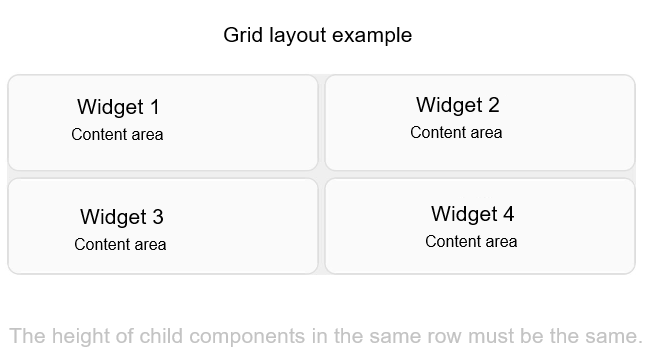

# Dynamic Layout (DynamicLayout)
<!--Kit: ArkUI-->
<!--Subsystem: ArkUI-->
<!--Owner: @zju_ljz-->
<!--Designer: @lanshouren-->
<!--Tester: @liuli0427-->
<!--Adviser: @Brilliantry_Rui-->

## Overview

Since API version 24, the [DynamicLayout](../reference/apis-arkui/arkui-ts/ts-container-dynamiclayout.md) component is supported. **DynamicLayout** supports dynamically switching between different layout algorithms at runtime without changing the status of child components. With **DynamicLayout**, you can flexibly implement multiple layout presentations for the same content in different scenarios. The **DynamicLayout** component supports the following layout algorithm classes: [RowLayoutAlgorithm](../reference/apis-arkui/js-apis-arkui-layoutAlgorithm.md#rowlayoutalgorithm), [ColumnLayoutAlgorithm](../reference/apis-arkui/js-apis-arkui-layoutAlgorithm.md#columnlayoutalgorithm), [StackLayoutAlgorithm](../reference/apis-arkui/js-apis-arkui-layoutAlgorithm.md#stacklayoutalgorithm), [GridLayoutAlgorithm](../reference/apis-arkui/js-apis-arkui-layoutAlgorithm.md#gridlayoutalgorithm), and custom layout algorithm class [CustomLayoutAlgorithm](../reference/apis-arkui/js-apis-arkui-layoutAlgorithm.md#customlayoutalgorithm).

## Constraints
1. Layout algorithm classes are decorated with [@ObservedV2](./state-management/arkts-new-observedV2-and-trace.md) and do not support the [@State](./state-management/arkts-state.md) decorator.
2. When switching layout algorithms, the state of child components (such as input box content and scroll position) remains unchanged.
3. In the [onMeasure](../reference/apis-arkui/js-apis-arkui-layoutAlgorithm.md#onmeasure) and [onLayout](../reference/apis-arkui/js-apis-arkui-layoutAlgorithm.md#onlayout) methods of a custom layout algorithm, state variables must not be modified to avoid unexpected behavior.

## Creating a DynamicLayout

Create a [DynamicLayout](../reference/apis-arkui/arkui-ts/ts-container-dynamiclayout.md#interface) component and set the layout algorithm by passing in a parameter of type [LayoutAlgorithm](../reference/apis-arkui/js-apis-arkui-layoutAlgorithm.md#layoutalgorithm-1). A variable of type [LayoutAlgorithm](../reference/apis-arkui/js-apis-arkui-layoutAlgorithm.md#layoutalgorithm-1) can be assigned a specific layout algorithm class object, including [built-in layout algorithms](#built-in-layout-algorithms) and [custom layout algorithms](#custom-layout-algorithms).

<!-- @[CreateDynamicLayout](https://gitcode.com/openharmony/applications_app_samples/blob/master/code/DocsSample/ArkUISample/DynamicLayout/entry/src/main/ets/pages/basic/CreateDynamicLayout.ets) -->

``` TypeScript
import {
  DynamicLayout, DynamicLayoutAttribute,RowLayoutAlgorithm, ColumnLayoutAlgorithm, LayoutAlgorithm
} from '@kit.ArkUI';

@Entry
@ComponentV2
struct CreateDynamicLayout {
  @Local algorithm: LayoutAlgorithm = new RowLayoutAlgorithm();

  build() {
    Column({ space: 10 }) {
      DynamicLayout(this.algorithm) {
        Text('Item 1')
          .fontSize(16)
          .backgroundColor(0xF5DEB3)
          .padding(10)
        Text('Item 2')
          .fontSize(16)
          .backgroundColor(0xD2B48C)
          .padding(10)
        Text('Item 3')
          .fontSize(16)
          .backgroundColor(0xF5DEB3)
          .padding(10)
      }
      .width('100%')
      .height(150)
      .backgroundColor(0xEFEFEF)

      Button ('Switch to Column Layout')
        .fontSize(16)
        .onClick(() => {
          this.algorithm = new ColumnLayoutAlgorithm();
        })
    }
    .width('100%')
    .padding(20)
  }
}
```


## Built-In Layout Algorithms

The linear layout algorithms [RowLayoutAlgorithm](../reference/apis-arkui/js-apis-arkui-layoutAlgorithm.md#rowlayoutalgorithm) and [ColumnLayoutAlgorithm](../reference/apis-arkui/js-apis-arkui-layoutAlgorithm.md#columnlayoutalgorithm) provide adaptive stretching and scaling capabilities, making them suitable for adaptive UI layouts. The stacking layout algorithm [StackLayoutAlgorithm](../reference/apis-arkui/js-apis-arkui-layoutAlgorithm.md#stacklayoutalgorithm) offers strong overlapping and positioning capabilities for ads, widget stacks, and similar page scenarios. [GridLayoutAlgorithm](../reference/apis-arkui/js-apis-arkui-layoutAlgorithm.md#gridlayoutalgorithm) provides a well-structured grid, suitable for displaying collections of similar items such as images, videos, music, news, and products.

### RowLayoutAlgorithm

[RowLayoutAlgorithm](../reference/apis-arkui/js-apis-arkui-layoutAlgorithm.md#rowlayoutalgorithm) is a horizontal linear layout algorithm that arranges child components in a row. It supports setting spacing between child components, alignment along the main axis (horizontal), alignment along the cross axis (vertical), and whether to reverse the arrangement direction. This layout algorithm produces the same effect as the [Row](../reference/apis-arkui/arkui-ts/ts-container-row.md) component. For detailed effects, refer to [Linear Layout (Row/Column)](./arkts-layout-development-linear.md). The following example adjusts child component spacing, main axis (horizontal) alignment, cross axis (vertical) alignment, and arrangement direction by modifying the **space**, **justifyContent**, **alignItems**, and **isReverse** member variables of the **RowLayoutAlgorithm** object.

Starting from API version 24, the [space](../reference/apis-arkui/js-apis-arkui-layoutAlgorithm.md#attributes), [justifyContent](../reference/apis-arkui/js-apis-arkui-layoutAlgorithm.md#attributes), [alignItems](../reference/apis-arkui/js-apis-arkui-layoutAlgorithm.md#attributes), and [isReverse](../reference/apis-arkui/js-apis-arkui-layoutAlgorithm.md#attributes) attributes are added to [RowLayoutAlgorithm](../reference/apis-arkui/js-apis-arkui-layoutAlgorithm.md#rowlayoutalgorithm).

<!-- @[RowLayoutAlgorithm](https://gitcode.com/openharmony/applications_app_samples/blob/master/code/DocsSample/ArkUISample/DynamicLayout/entry/src/main/ets/pages/linearlayout/RowLayoutAlgorithm.ets) -->

``` TypeScript
import {
  DynamicLayout, DynamicLayoutAttribute, RowLayoutAlgorithm, LengthMetrics
} from '@kit.ArkUI';

@Entry
@ComponentV2
struct RowLayoutExample {
  @Local algorithm: RowLayoutAlgorithm = new RowLayoutAlgorithm({
    space: LengthMetrics.vp(10),
    alignItems: VerticalAlign.Top,
    justifyContent: FlexAlign.Start,
    isReverse: false
  });

  build() {
    Column({ space: 10 }) {
      DynamicLayout(this.algorithm) {
        Text('Item 1')
          .width(80)
          .height(40)
          .fontSize(14)
          .backgroundColor(0xF5DEB3)
        Text('Item 2')
          .width(80)
          .height(40)
          .fontSize(14)
          .backgroundColor(0xD2B48C)
        Text('Item 3')
          .width(80)
          .height(40)
          .fontSize(14)
          .backgroundColor(0xF5DEB3)
      }
      .width('100%')
      .height(80)
      .backgroundColor(0xEFEFEF)

      Row({ space: 10 }) {
        Button('Modify spacing')
          .fontSize(14)
          .onClick(() => {
            this.algorithm.space = LengthMetrics.vp(20);
          })
        Button('Reverse order')
          .fontSize(14)
          .onClick(() => {
            this.algorithm.isReverse = !this.algorithm.isReverse;
          })
      }

      Row({ space: 10 }) {
        Button('Vertically centered')
          .fontSize(14)
          .onClick(() => {
            this.algorithm.alignItems = VerticalAlign.Center;
          })
        Button('Horizontally centered')
          .fontSize(14)
          .onClick(() => {
            this.algorithm.justifyContent = FlexAlign.Center;
          })
      }
    }
    .padding(20)
  }
}
```


### ColumnLayoutAlgorithm

[ColumnLayoutAlgorithm](../reference/apis-arkui/js-apis-arkui-layoutAlgorithm.md#columnlayoutalgorithm) is a vertical linear layout algorithm that arranges child components in a column. It supports setting spacing between child components, alignment along the main axis (vertical), alignment along the cross axis (horizontal), and whether to reverse the arrangement direction. This layout algorithm produces the same effect as the [Column](../reference/apis-arkui/arkui-ts/ts-container-column.md) component. For detailed effects, refer to [Linear Layout (Row/Column)](./arkts-layout-development-linear.md). The following example adjusts child component spacing, main axis (vertical) alignment, cross axis (horizontal) alignment, and arrangement direction by modifying the **space**, **justifyContent**, **alignItems**, and **isReverse** attributes of the **ColumnLayoutAlgorithm** object.

Starting from API version 24, the [space](../reference/apis-arkui/js-apis-arkui-layoutAlgorithm.md#attributes-1), [justifyContent](../reference/apis-arkui/js-apis-arkui-layoutAlgorithm.md#attributes-1), [alignItems](../reference/apis-arkui/js-apis-arkui-layoutAlgorithm.md#attributes-1), and [isReverse](../reference/apis-arkui/js-apis-arkui-layoutAlgorithm.md#attributes-1) attributes are added to [ColumnLayoutAlgorithm](../reference/apis-arkui/js-apis-arkui-layoutAlgorithm.md#columnlayoutalgorithm).

<!-- @[ColumnLayoutAlgorithm](https://gitcode.com/openharmony/applications_app_samples/blob/master/code/DocsSample/ArkUISample/DynamicLayout/entry/src/main/ets/pages/linearlayout/ColumnLayoutAlgorithm.ets) -->

``` TypeScript
import {
  DynamicLayout, DynamicLayoutAttribute, ColumnLayoutAlgorithm, LengthMetrics
} from '@kit.ArkUI';

@Entry
@ComponentV2
struct ColumnLayoutExample {
  @Local algorithm: ColumnLayoutAlgorithm = new ColumnLayoutAlgorithm({
    space: LengthMetrics.vp(10),
    alignItems: HorizontalAlign.Start,
    justifyContent: FlexAlign.Start,
    isReverse: false
  });

  build() {
    Column({ space: 10 }) {
      DynamicLayout(this.algorithm) {
        Text('Item 1')
          .width('80%')
          .height(40)
          .fontSize(14)
          .backgroundColor(0xF5DEB3)
        Text('Item 2')
          .width('80%')
          .height(40)
          .fontSize(14)
          .backgroundColor(0xD2B48C)
        Text('Item 3')
          .width('80%')
          .height(40)
          .fontSize(14)
          .backgroundColor(0xF5DEB3)
      }
      .width('100%')
      .height(200)
      .backgroundColor(0xEFEFEF)

      Row({ space: 10 }) {
        Button('Modify spacing')
          .fontSize(14)
          .onClick(() => {
            this.algorithm.space = LengthMetrics.vp(20);
          })
        Button('Reverse order')
          .fontSize(14)
          .onClick(() => {
            this.algorithm.isReverse = !this.algorithm.isReverse;
          })
      }

      Row({ space: 10 }) {
        Button('Vertically centered')
          .fontSize(14)
          .onClick(() => {
            this.algorithm.justifyContent = FlexAlign.Center;
          })
        Button('Horizontally centered')
          .fontSize(14)
          .onClick(() => {
            this.algorithm.alignItems = HorizontalAlign.Center;
          })
      }
    }
    .padding(20)
  }
}
```


### StackLayoutAlgorithm

[StackLayoutAlgorithm](../reference/apis-arkui/js-apis-arkui-layoutAlgorithm.md#stacklayoutalgorithm) is a stacking layout algorithm that places child components on top of each other, with later children overlaying earlier ones. This algorithm allows you to set the nine-grid alignment position of child components in the container using the **alignContent** attribute. Child components can individually set their own alignment using the [layoutGravity](../reference/apis-arkui/arkui-ts/ts-universal-attributes-location.md#layoutgravity20) attribute, which has higher priority than the container's **alignContent**. This layout algorithm produces the same effect as the [Stack](../reference/apis-arkui/arkui-ts/ts-container-stack.md) component. For detailed effects, refer to [Stack Layout](./arkts-layout-development-stack-layout.md). The following example adjusts the nine‑grid alignment of child components within the container by modifying [alignContent](../reference/apis-arkui/js-apis-arkui-layoutAlgorithm.md#attributes-2) of [StackLayoutAlgorithm](../reference/apis-arkui/js-apis-arkui-layoutAlgorithm.md#stacklayoutalgorithm).

Since API version 24, the [alignContent](../reference/apis-arkui/js-apis-arkui-layoutAlgorithm.md#attributes-2) attribute has been added to [StackLayoutAlgorithm](../reference/apis-arkui/js-apis-arkui-layoutAlgorithm.md#stacklayoutalgorithm).

<!-- @[StackLayoutAlgorithm](https://gitcode.com/openharmony/applications_app_samples/blob/master/code/DocsSample/ArkUISample/DynamicLayout/entry/src/main/ets/pages/stacklayout/StackLayoutAlgorithm.ets) -->

``` TypeScript
import {
  DynamicLayout, DynamicLayoutAttribute, StackLayoutAlgorithm
} from '@kit.ArkUI';

@Entry
@ComponentV2
struct StackLayoutExample {
  @Local algorithm: StackLayoutAlgorithm = new StackLayoutAlgorithm({
    alignContent: LocalizedAlignment.CENTER
  });

  build() {
    Column() {
      DynamicLayout(this.algorithm) {
        Text('Layer 1')
          .fontSize(14)
          .width(150)
          .height(150)
          .backgroundColor(0xD2B48C)
          .layoutGravity(LocalizedAlignment.TOP_START)

        Text('Layer 2')
          .fontSize(14)
          .width(150)
          .height(150)
          .backgroundColor(0xF5DEB3)
          .layoutGravity(LocalizedAlignment.CENTER)

        Text('Layer 3')
          .fontSize(14)
          .width(100)
          .height(100)
          .backgroundColor(0x8B4513)
      }
      .width(250)
      .height(250)
      .backgroundColor(0xEFEFEF)

      Row({ space: 10 }) {
        Button('Top center')
          .fontSize(14)
          .onClick(() => {
            this.algorithm.alignContent = LocalizedAlignment.TOP;
          })
        Button('Center')
          .fontSize(14)
          .onClick(() => {
            this.algorithm.alignContent = LocalizedAlignment.CENTER;
          })
        Button('Bottom center')
          .fontSize(14)
          .onClick(() => {
            this.algorithm.alignContent = LocalizedAlignment.BOTTOM;
          })
      }
      .margin({ top: 20 })
    }
    .width('100%')
  }
}
```


### GridLayoutAlgorithm

[GridLayoutAlgorithm](../reference/apis-arkui/js-apis-arkui-layoutAlgorithm.md#gridlayoutalgorithm) is a vertical grid layout algorithm. It supports setting the number of columns using [columnsTemplate](../reference/apis-arkui/arkui-ts/ts-container-lazyvgridlayout.md#columnstemplate) or [ItemFillPolicy](../reference/apis-arkui/arkui-ts/ts-types.md#itemfillpolicy22). When **ItemFillPolicy** is set to **BREAKPOINT_DEFAULT**, the behavior is the same as the [Grid](../reference/apis-arkui/arkui-ts/ts-container-grid.md) component, where the number of rows is determined by the number of child nodes and the column count. The algorithm supports setting row and column gaps using [LengthMetrics](../reference/apis-arkui/js-apis-arkui-graphics.md#lengthmetrics12), and setting component alignment within the grid using [align](../reference/apis-arkui/arkui-ts/ts-universal-attributes-location.md#align20). The following example adjusts the number of grid columns by modifying the **columnsTemplate** attribute of **GridLayoutAlgorithm**.

Since API version 24, the [columnsTemplate](../reference/apis-arkui/js-apis-arkui-layoutAlgorithm.md#attributes-3) attribute has been added to [GridLayoutAlgorithm](../reference/apis-arkui/js-apis-arkui-layoutAlgorithm.md#gridlayoutalgorithm).

<!-- @[GridLayoutAlgorithm](https://gitcode.com/openharmony/applications_app_samples/blob/master/code/DocsSample/ArkUISample/DynamicLayout/entry/src/main/ets/pages/gridlayout/GridLayoutAlgorithm.ets) -->

``` TypeScript
import {
  DynamicLayout, DynamicLayoutAttribute, GridLayoutAlgorithm, LengthMetrics
} from '@kit.ArkUI';

export class GridDataSource implements IDataSource {
  private list: string[] = [];
  private listeners: DataChangeListener[] = [];

  constructor(list: string[]) {
    this.list = list;
  }

  totalCount(): number {
    return this.list.length;
  }

  getData(index: number): string {
    return this.list[index];
  }

  registerDataChangeListener(listener: DataChangeListener): void {
    if (this.listeners.indexOf(listener) < 0) {
      this.listeners.push(listener);
    }
  }

  unregisterDataChangeListener(listener: DataChangeListener): void {
    const pos = this.listeners.indexOf(listener);
    if (pos >= 0) {
      this.listeners.splice(pos, 1);
    }
  }

  // Notify the controller of data movement.
  notifyDataMove(from: number, to: number): void {
    this.listeners.forEach(listener => {
      listener.onDataMove(from, to);
    })
  }

  // Swap element positions.
  public swapItem(from: number, to: number): void {
    let temp: string = this.list[from];
    this.list[from] = this.list[to];
    this.list[to] = temp;
    this.notifyDataMove(from, to);
  }
}

@Entry
@ComponentV2
struct GridLayoutExample {
  numbers: GridDataSource = new GridDataSource([]);
  @Local flag: boolean = false
  @Local gridLayoutAlgorithm: GridLayoutAlgorithm = new GridLayoutAlgorithm({
    columnsTemplate: '1fr 1fr 1fr',
    columnsGap: LengthMetrics.vp(10),
    rowsGap: LengthMetrics.vp(10)
  })

  aboutToAppear() {
    let list: string[] = [];
    for (let i = 0; i < 4; i++) {
      for (let j = 0; j < 3; j++) {
        list.push((i * 3 + j).toString());
      }
    }
    this.numbers = new GridDataSource(list);
  }

  build() {
    Column({ space: 10 }) {
      DynamicLayout(this.gridLayoutAlgorithm) {
        LazyForEach(this.numbers, (day: string) => {
          GridItem() {
            Text(day)
              .fontSize(16)
              .backgroundColor(0xF9CF93)
              .width('100%')
              .height(80)
              .textAlign(TextAlign.Center)
          }
        }, (index: number) => index.toString())
      }.width('100%')
      Button('change gridLayoutAlgorithm columns').onClick(() => {
        this.flag = !this.flag
        if (this.flag) {
          this.gridLayoutAlgorithm.columnsTemplate = '1fr 1fr'
        } else {
          this.gridLayoutAlgorithm.columnsTemplate = '1fr 1fr 1fr'
        }
      })
    }
  }
}
```


## Custom Layout Algorithms

A custom layout algorithm is implemented by extending the [CustomLayoutAlgorithm](../reference/apis-arkui/js-apis-arkui-layoutAlgorithm.md#customlayoutalgorithm) class and overriding the [onMeasure](../reference/apis-arkui/js-apis-arkui-layoutAlgorithm.md#onmeasure) and [onLayout](../reference/apis-arkui/js-apis-arkui-layoutAlgorithm.md#onlayout) methods. You can customize the measurement and positioning of child components according to specific business requirements, achieving personalized layout effects that built‑in algorithms cannot satisfy, such as waterfall flows, tag clouds, and other irregular layouts.

### Guide to Implementing a Custom Layout Algorithm

You can obtain all child **FrameNode**s by calling the [getChildrenCount()](../reference/apis-arkui/js-apis-arkui-frameNode.md#getchildrencount12) and [getChild()](../reference/apis-arkui/js-apis-arkui-frameNode.md#getchild12) methods of [FrameNode](../reference/apis-arkui/js-apis-arkui-frameNode.md#framenode-1). In the **onMeasure** method, you can call the [measure()](../reference/apis-arkui/js-apis-arkui-frameNode.md#measure12) method to customize the size of the child component. In the **onLayout** method, you can call the [getMeasuredSize()](../reference/apis-arkui/js-apis-arkui-frameNode.md#getmeasuredsize12) method to obtain the measured dimensions of the child component, and call the [layout()](../reference/apis-arkui/js-apis-arkui-frameNode.md#layout12) method to customize the position of the child components. The following example demonstrates how to override the [onMeasure](../reference/apis-arkui/js-apis-arkui-layoutAlgorithm.md#onmeasure) and [onLayout](../reference/apis-arkui/js-apis-arkui-layoutAlgorithm.md#onlayout) methods and call the relevant methods of [FrameNode](../reference/apis-arkui/js-apis-arkui-frameNode.md#framenode-1) to achieve a horizontal linear layout effect.

<!-- @[CustomLayoutBasic](https://gitcode.com/openharmony/applications_app_samples/blob/master/code/DocsSample/ArkUISample/DynamicLayout/entry/src/main/ets/pages/customlayout/CustomLayoutBasic.ets) -->

``` TypeScript
import {
  DynamicLayout, DynamicLayoutAttribute, CustomLayoutAlgorithm, FrameNode, LayoutConstraint, Position, LayoutAlgorithm
} from '@kit.ArkUI';

// Custom layout algorithm class.
class MyCustomLayout extends CustomLayoutAlgorithm {
  onMeasure(self: FrameNode, constraint: LayoutConstraint): void {
    // 1. Obtain the number of child components.
    const childCount = self.getChildrenCount();
    let totalWidth = 0;
    let maxHeight = 0;
    // 2. Traverse the child components and perform measurement.
    for (let i = 0; i < childCount; i++) {
      const child = self.getChild(i);
      if (child) {
        // 3. Create layout constraints for the child components.
        const childConstraint: LayoutConstraint = {
          maxSize: { width: 150, height: 150},
          minSize: { width: 150, height: 150},
          percentReference: constraint.percentReference
        };
        // 4. Measure the child components.
        child.measure(childConstraint);
        // 5. Obtain the measured dimensions of child components.
        const childSize = child.getMeasuredSize();
        totalWidth += childSize.width;
        maxHeight = Math.max(maxHeight, childSize.height);
      }
    }
    const measuredSize: Size = {
      width: Math.min(totalWidth, constraint.maxSize.width),
      height: Math.min(maxHeight, constraint.maxSize.height)
    };
    // 6. Set the measured dimensions of the component.
    self.setMeasuredSize(measuredSize);
  }

  onLayout(self: FrameNode, position: Position): void {
    // 1. Obtain the number of child components.
    const childCount = self.getChildrenCount();
    let offsetX = 0;
    // 2. Traverse the child components and set their layout positions.
    for (let i = 0; i < childCount; i++) {
      const child = self.getChild(i);
      if (child) {
        // 3. Obtain the measured dimensions of child components.
        const childSize = child.getMeasuredSize();
        const childPosition: Position = {
          x: offsetX,
          y: 0
        };
        // 4. Set the layout position of child components.
        child.layout(childPosition);
        // 5. Update an offset.
        offsetX += childSize.width;
      }
    }
    // 6. Set the layout position of itself.
    self.setLayoutPosition(position);
  }
}

@Entry
@ComponentV2
struct CustomLayoutBasic {
  @Local algorithm: LayoutAlgorithm = new MyCustomLayout()
  build() {
    Column({ space: 10 }) {
      DynamicLayout(this.algorithm) {
        Text('Item 1')
          .fontSize(14)
          .backgroundColor(0xF5DEB3)
        Text('Item 2')
          .fontSize(14)
          .backgroundColor(0xD2B48C)
        Text('Item 3')
          .fontSize(14)
          .backgroundColor(0xF5DEB3)
        Text('Item 4')
          .fontSize(14)
          .backgroundColor(0xD2B48C)
      }
      .width('100%')
      .height(200)
      .backgroundColor(0xEFEFEF)
    }
    .padding(20)
  }
}
```


### Waterfall Layout

The following example implements a custom waterfall flow layout algorithm that arranges child components in columns, stacking them sequentially within each column. This is suitable for product display scenarios.

<!-- @[WaterFlowLayout](https://gitcode.com/openharmony/applications_app_samples/blob/master/code/DocsSample/ArkUISample/DynamicLayout/entry/src/main/ets/pages/customlayout/WaterFlowLayout.ets) -->

``` TypeScript
import {
  DynamicLayout, DynamicLayoutAttribute, CustomLayoutAlgorithm, LayoutAlgorithm, FrameNode, LayoutConstraint, Position
} from '@kit.ArkUI';

// Waterfall layout algorithm.
class WaterfallLayout extends CustomLayoutAlgorithm {
  private columnCount: number = 2;
  private columnGap: number = 10;
  private rowGap: number = 10;

  onMeasure(self: FrameNode, constraint: LayoutConstraint): void {
    const childCount = self.getChildrenCount();
    const columnWidth = (constraint.maxSize.width - (this.columnCount - 1) * this.columnGap) / this.columnCount;
    // Record the current height of each column.
    const columnHeights: number[] = new Array(this.columnCount).fill(0);
    for (let i = 0; i < childCount; i++) {
      const child = self.getChild(i);
      if (child) {
        // Set minSize and maxSize to the same value to restrict the width of child components.
        const childConstraint: LayoutConstraint = {
          maxSize: {
            width: columnWidth,
            height: constraint.maxSize.height
          },
          minSize: {
            width: columnWidth,
            height: 0
          },
          percentReference: constraint.percentReference
        };
        child.measure(childConstraint);
        // Find the column with the minimum height.
        const minColumn = columnHeights.indexOf(Math.min(...columnHeights));
        columnHeights[minColumn] += child.getMeasuredSize().height + this.rowGap;
      }
    }
    const maxHeight = Math.max(...columnHeights);
    self.setMeasuredSize({
      width: constraint.maxSize.width,
      height: maxHeight
    });
  }

  onLayout(self: FrameNode, position: Position): void {
    const childCount = self.getChildrenCount();
    const measuredSize = self.getMeasuredSize();
    const columnWidth = (measuredSize.width - (this.columnCount - 1) * this.columnGap) / this.columnCount;
    // Record the current Y coordinate of each column.
    const columnYs: number[] = new Array(this.columnCount).fill(0);
    for (let i = 0; i < childCount; i++) {
      const child = self.getChild(i);
      if (child) {
        const childSize = child.getMeasuredSize();
        // Find the column with the minimum Y coordinate.
        const minColumn = columnYs.indexOf(Math.min(...columnYs));
        const x = minColumn * (columnWidth + this.columnGap);
        const y = columnYs[minColumn];
        child.layout({ x, y });
        columnYs[minColumn] += childSize.height + this.rowGap;
      }
    }
    self.setLayoutPosition(position);
  }
}

@Entry
@ComponentV2
struct WaterfallLayoutExample {
  @Local algorithm: LayoutAlgorithm = new WaterfallLayout();

  // Product data.
  private products: Product[] = [
    { id: '1', name: 'Fashion sneakers', price: '¥399', height: 180, image: 'Product image' },
    { id: '2', name: 'Casual backpack', price: '¥259', height: 220, image: 'Product image' },
    { id: '3', name: 'Wireless Bluetooth earbuds', price: '¥599', height: 150, image: 'Product image' },
    { id: '4', name: 'Smart watch', price: '¥1299', height: 200, image: 'Product image' },
    { id: '5', name: 'Sunglasses', price: '¥199', height: 130, image: 'Product image' },
    { id: '6', name: 'Portable power bank', price: '¥129', height: 170, image: 'Product image' },
    { id: '7', name: 'Mechanical keyboard', price: '¥459', height: 160, image: 'Product image' },
    { id: '8', name: 'Gaming mouse', price: '¥189', height: 140, image: 'Product image' },
    { id: '9', name: 'HD display', price: '¥1599', height: 210, image: 'Product image' },
    { id: '10', name: 'Smart speaker', price: '¥299', height: 190, image: 'Product image' }
  ];

  // Product widget component.
  @Builder ProductCard(product: Product) {
    Column() {
      Text(product.image)
        .fontSize(18)
        .margin({ bottom: 8 })
      Text(product.name)
        .fontSize(14)
        .fontWeight(FontWeight.Medium)
        .fontColor(0x333333)
        .margin({ bottom: 4 })
        .maxLines(1)
        .textOverflow({ overflow: TextOverflow.Ellipsis })
      Text(product.price)
        .fontSize(16)
        .fontColor(0xFF6B35)
        .fontWeight(FontWeight.Bold)
    }
    .width('100%')
    .padding(12)
    .backgroundColor(0xFAFAFA)
    .borderRadius(8)
    .border({ width: 1, color: 0xE0E0E0 })
    .height(product.height)
    .justifyContent(FlexAlign.Center)
  }

  build() {
    Column() {
      Text('Product list - waterfall layout')
        .fontSize(18)
        .fontWeight(FontWeight.Bold)
        .margin({ bottom: 20 })

      Scroll() {
        DynamicLayout(this.algorithm) {
          ForEach(this.products, (product: Product) => {
            this.ProductCard(product)
          })
        }
        .width('100%')
        .backgroundColor(0xEFEFEF)
        .borderRadius(12)
        .padding(10)
      }
      .scrollable(ScrollDirection.Vertical)
      .scrollBar(BarState.Auto)
      .edgeEffect(EdgeEffect.Spring)
      .width('100%')
      .layoutWeight(1)

      Text('The product widget is automatically allocated to the column with the smallest height.')
        .fontSize(14)
        .fontColor(Color.Gray)
        .margin({ top: 12 })
    }
    .padding(20)
    .width('100%')
    .height('100%')
  }
}

// Product data model.
interface Product {
  id: string;
  name: string;
  price: string;
  height: number;
  image: string;
}
```


### Grid Layout

The following example implements a custom grid layout algorithm that arranges child components in a grid, ensuring that child components in the same row have the same height.

<!-- @[GridLayout](https://gitcode.com/openharmony/applications_app_samples/blob/master/code/DocsSample/ArkUISample/DynamicLayout/entry/src/main/ets/pages/customlayout/GridLayout.ets) -->

``` TypeScript
import {
  DynamicLayout, DynamicLayoutAttribute, CustomLayoutAlgorithm, LayoutAlgorithm, FrameNode, LayoutConstraint, Position
} from '@kit.ArkUI';

// 2x2 grid layout algorithm.
export class GridLayout extends CustomLayoutAlgorithm {
  private gap: number = 12;
  private itemHeights: number[] = [];

  onMeasure(self: FrameNode, constraint: LayoutConstraint): void {
    const childCount = self.getChildrenCount();
    const columns = 2;
    const itemWidth = (constraint.maxSize.width - (columns - 1) * this.gap) / columns;
    this.itemHeights = [];

    // First measurement: Measure each child to get its ideal height.
    for (let i = 0; i < childCount; i++) {
      const child = self.getChild(i);
      if (child) {
        const childConstraint: LayoutConstraint = {
          maxSize: { width: itemWidth, height: Number.MAX_VALUE },
          minSize: { width: itemWidth, height: 0 },
          percentReference: constraint.percentReference
        };
        child.measure(childConstraint);
        this.itemHeights.push(child.getMeasuredSize().height);
      }
    }

    // Calculate the maximum height of each row.
    const rows = Math.ceil(childCount / columns);
    const rowHeights: number[] = [];
    for (let r = 0; r < rows; r++) {
      let maxRowHeight = 0;
      for (let c = 0; c < columns; c++) {
        const index = r * columns + c;
        if (index < this.itemHeights.length && this.itemHeights[index] > maxRowHeight) {
          maxRowHeight = this.itemHeights[index];
        }
      }
      rowHeights.push(maxRowHeight);
    }

    // Calculate the total height.
    const totalHeight = rowHeights.reduce((sum, h) => sum + h, 0) + (rows - 1) * this.gap;

    // Second measurement: Remeasure the child component using the unified height of each row.
    for (let i = 0; i < childCount; i++) {
      const child = self.getChild(i);
      if (child) {
        const row = Math.floor(i / columns);
        const rowHeight = rowHeights[row];
        const childConstraint: LayoutConstraint = {
          maxSize: { width: itemWidth, height: rowHeight },
          minSize: { width: itemWidth, height: rowHeight },
          percentReference: constraint.percentReference
        };
        child.measure(childConstraint);
      }
    }

    self.setMeasuredSize({
      width: constraint.maxSize.width,
      height: totalHeight
    });
  }

  onLayout(self: FrameNode, position: Position): void {
    const childCount = self.getChildrenCount();
    const measuredSize = self.getMeasuredSize();
    const columns = 2;
    const itemWidth = (measuredSize.width - (columns - 1) * this.gap) / columns;

    // Re-calculate the maximum height of each row.
    const rows = Math.ceil(childCount / columns);
    const rowHeights: number[] = [];
    for (let r = 0; r < rows; r++) {
      let maxRowHeight = 0;
      for (let c = 0; c < columns; c++) {
        const index = r * columns + c;
        if (index < this.itemHeights.length && this.itemHeights[index] > maxRowHeight) {
          maxRowHeight = this.itemHeights[index];
        }
      }
      rowHeights.push(maxRowHeight);
    }

    for (let i = 0; i < childCount; i++) {
      const child = self.getChild(i);
      if (child) {
        const row = Math.floor(i / columns);
        const col = i % columns;
        const x = col * (itemWidth + this.gap);
        const y = row === 0 ? 0 : rowHeights.slice(0, row).reduce((sum, h) => sum + h, 0) + row * this.gap;
        child.layout({ x, y });
      }
    }

    self.setLayoutPosition(position);
  }
}

@Entry
@ComponentV2
struct GridLayoutExample {
  @Local algorithm: LayoutAlgorithm = new GridLayout();

  build() {
    Column() {
      Text('Grid layout example')
        .fontSize(18)
        .margin({ bottom: 20 })

      DynamicLayout(this.algorithm) {
        ForEach(['Widget 1', 'Widget 2', 'Widget 3', 'Widget 4'], (title: string, index: number) => {
          Column() {
            Text(title)
              .fontSize(16)
              .fontWeight(FontWeight.Bold)
              .fontColor(0x333333)
              .margin({ bottom: 8 })
            Text('Content area')
              .fontSize(12)
              .fontColor(0x666666)
          }
          .width('100%')
          .padding(12)
          .backgroundColor(0xFAFAFA)
          .borderRadius(8)
          .border({ width: 1, color: 0xE0E0E0 })
        })
      }
      .width('100%')
      .backgroundColor(0xEFEFEF)
      .borderRadius(12)
      .padding(12)

      Text ('The height of child components in the same row must be the same.')
        .fontSize(14)
        .fontColor(Color.Gray)
        .margin({ top: 20 })
    }
    .padding(20)
    .width('100%')
  }
}
```



### Tag Cloud Layout

The following example implements a custom tag cloud layout that automatically wraps tags to the next line. This is suitable for irregular layouts such as search history, popular tags, and skill tags.

<!-- @[TagCloudLayout](https://gitcode.com/openharmony/applications_app_samples/blob/master/code/DocsSample/ArkUISample/DynamicLayout/entry/src/main/ets/pages/customlayout/TagCloudLayout.ets) -->

``` TypeScript
import {
  DynamicLayout, DynamicLayoutAttribute, CustomLayoutAlgorithm, LayoutAlgorithm, FrameNode, LayoutConstraint, Position
} from '@kit.ArkUI';

// Tag cloud layout algorithm.
class TagCloudLayout extends CustomLayoutAlgorithm {
  private horizontalGap: number = 12;
  private verticalGap: number = 12;

  onMeasure(self: FrameNode, constraint: LayoutConstraint): void {
    const childCount = self.getChildrenCount();
    const maxWidth = constraint.maxSize.width;

    let currentLineWidth = 0;
    let totalHeight = 0;
    let maxLineWidth = 0;

    for (let i = 0; i < childCount; i++) {
      const child = self.getChild(i);
      if (child) {
        // Measure the child components without restricting their width and height.
        const childConstraint: LayoutConstraint = {
          maxSize: { width: maxWidth, height: Number.MAX_VALUE },
          minSize: { width: 0, height: 0 },
          percentReference: constraint.percentReference
        };
        child.measure(childConstraint);
        const childSize = child.getMeasuredSize();
        // Check whether a line break is required.
        if (currentLineWidth + childSize.width > maxWidth && currentLineWidth > 0) {
          // Line break.
          totalHeight += this.verticalGap;
          currentLineWidth = childSize.width;
          totalHeight += childSize.height;
          maxLineWidth = Math.max(maxLineWidth, currentLineWidth - this.horizontalGap);
        } else {
          // Continue the current line.
          currentLineWidth += childSize.width + this.horizontalGap;
          if (i === 0) {
            totalHeight = childSize.height;
          }
          maxLineWidth = Math.max(maxLineWidth, currentLineWidth - this.horizontalGap);
        }
      }
    }
    self.setMeasuredSize({
      width: Math.min(maxLineWidth, maxWidth),
      height: totalHeight
    });
  }

  onLayout(self: FrameNode, position: Position): void {
    const childCount = self.getChildrenCount();
    const measuredSize = self.getMeasuredSize();
    const maxWidth = measuredSize.width;

    let currentX = 0;
    let currentY = 0;
    let currentLineHeight = 0;

    for (let i = 0; i < childCount; i++) {
      const child = self.getChild(i);
      if (child) {
        const childSize = child.getMeasuredSize();
        // Check whether a line break is required.
        if (currentX + childSize.width > maxWidth && currentX > 0) {
          // Line break.
          currentY += currentLineHeight + this.verticalGap;
          currentX = 0;
          currentLineHeight = 0;
        }
        // Layout child component.
        child.layout({ x: currentX, y: currentY })
        // Position update.
        currentX += childSize.width + this.horizontalGap;
        currentLineHeight = Math.max(currentLineHeight, childSize.height);
      }
    }
    self.setLayoutPosition(position);
  }
}

@Entry
@ComponentV2
struct TagCloudExample {
  @Local algorithm: LayoutAlgorithm = new TagCloudLayout();

  // Popular tag data.
  private tags: string[] = [
    'Tag 1', 'TagTagTag', 'Tag 2', 'TagTag', 'TagTag',
    'TagTag', 'TagTagTagTag', 'TagTag', 'TagTag',
    'Tag', 'TagTag', 'TagTag', 'TagTagTag',
    'Tag', 'TagTag', 'TagTag', 'TagTagTag',
  ];

  // Tag component.
  @Builder TagItem(tag: string, index: number) {
    Text(tag)
      .fontSize(14)
      .fontColor([0xFF6B6B, 0x4ECDC4, 0x45B7D1, 0xFFA07A, 0x98D8C8, 0xF7DC6F][index % 6])
      .padding({ left: 12, right: 12, top: 8, bottom: 8 })
      .backgroundColor(0xF5F5F5)
      .borderRadius(16)
      .border({ width: 1, color: 0xE0E0E0 })
  }

  build() {
    Column() {
      Text('Popular topics - tag cloud layout')
        .fontSize(18)
        .fontWeight(FontWeight.Bold)
        .margin({ bottom: 20 })

      Scroll() {
        DynamicLayout(this.algorithm) {
          ForEach(this.tags, (tag: string, index: number) => {
            this.TagItem(tag, index)
          }, (tag: string, index: number) => `${index}_${tag}`)
        }
        .width('100%')
        .padding(16)
      }
      .scrollable(ScrollDirection.Vertical)
      .scrollBar(BarState.Auto)
      .edgeEffect(EdgeEffect.Spring)
      .width('100%')

      Text ('Labels are automatically wrapped and arranged compactly.')
        .fontSize(14)
        .fontColor(Color.Gray)
        .margin({ top: 12 })
    }
    .padding(20)
    .width('100%')
    .height('100%')
  }
}
```


## Switching Layout Algorithms

When switching layout algorithms, **DynamicLayout** preserves the state of child components, such as input field content, toggle state, and slider value. The following example demonstrates how [TextInput](../reference/apis-arkui/arkui-ts/ts-basic-components-textinput.md#apis), [Toggle](../reference/apis-arkui/arkui-ts/ts-basic-components-toggle.md#apis), [Slider](../reference/apis-arkui/arkui-ts/ts-basic-components-slider.md#apis), and [CheckBox](../reference/apis-arkui/arkui-ts/ts-basic-components-checkbox.md) components maintain their state during layout switching, while using [animateTo](../reference/apis-arkui/arkts-apis-uicontext-uicontext.md#animateto) to add smooth animation effects to the layout transition.

<!-- @[ReserveChildState](https://gitcode.com/openharmony/applications_app_samples/blob/master/code/DocsSample/ArkUISample/DynamicLayout/entry/src/main/ets/pages/responsivelayout/ReserveChildState.ets) -->

``` TypeScript
import {
  DynamicLayout, DynamicLayoutAttribute, ColumnLayoutAlgorithm, LayoutAlgorithm, curves, LengthMetrics,
  GridLayoutAlgorithm
} from '@kit.ArkUI';

@Entry
@ComponentV2
struct StatePreservationExample {
  @Local algorithm: LayoutAlgorithm = new ColumnLayoutAlgorithm({
    space: LengthMetrics.vp(12)
  });

  build() {
    Column() {
      Text('Example of maintaining the layout switching status')
        .fontSize(18)
        .margin({ bottom: 20 })

      // Use animateTo to add an animation effect for layout switching.
      DynamicLayout(this.algorithm) {
        // Child component 1: widget with a text input box
        Column() {
          Text ('text input box')
            .fontSize(14)
            .fontWeight(FontWeight.Bold)
            .fontColor(0x333333)
            .margin({ bottom: 8 })
          TextInput({ placeholder: 'Enter'})
            .width('100%')
            .height(36)
            .fontSize(12)
        }
        .width('100%')
        .padding(12)
        .backgroundColor(0x80F0F0F0)
        .borderRadius(8)

        // Child component 2: widget with a switch
        Column() {
          Text('Switch')
            .fontSize(14)
            .fontWeight(FontWeight.Bold)
            .fontColor(0x333333)
            .margin({ bottom: 8 })
          Toggle({ type: ToggleType.Switch, isOn: true })
            .selectedColor(0xD4D4D4)
            .height(26)
            .width(52)
        }
        .width('100%')
        .padding(12)
        .backgroundColor(0x80F0F0F0)
        .borderRadius(8)

        // Child component 3: widget with a progress bar
        Column() {
          Text('Progress bar')
            .fontSize(14)
            .fontWeight(FontWeight.Bold)
            .fontColor(0x333333)
            .margin({ bottom: 8 })
          Slider({ value: 60, min: 0, max: 100 })
            .width('100%')
            .trackColor(0xD4D4D4)
            .selectedColor(0xD4D4D4)
            .height(36)
        }
        .width('100%')
        .padding(12)
        .backgroundColor(0x80F0F0F0)
        .borderRadius(8)

        // Child component 4: widget with a checkbox
        Column() {
          Text('Checkbox')
            .fontSize(14)
            .fontWeight(FontWeight.Bold)
            .fontColor(0x333333)
            .margin({ bottom: 8 })
          Row() {
            Checkbox({ name: 'check1' })
              .select(false)
              .selectedColor(0xD4D4D4)
            Text('Remember password')
              .fontSize(12)
              .fontColor(0x333333)
              .margin({ left: 8 })
          }
          .height(36)
        }
        .width('100%')
        .padding(12)
        .backgroundColor(0x80F0F0F0)
        .borderRadius(8)
      }
      .width('100%')
      .borderRadius(12)
      .padding(12)

      Row({ space: 10 }) {
        Button('List layout')
          .onClick(() => {
            this.getUIContext()?.animateTo({ duration: 300, curve: curves.springMotion() }, () => {
              this.algorithm = new ColumnLayoutAlgorithm({
                space: LengthMetrics.vp(12)
              });
            });
          })
        Button('Grid layout')
          .onClick(() => {
            this.getUIContext()?.animateTo({ duration: 300, curve: curves.springMotion() }, () => {
              this.algorithm = new GridLayoutAlgorithm({
                columnsTemplate: '1fr 1fr',
                columnsGap: LengthMetrics.vp(10),
                rowsGap: LengthMetrics.vp(10)
              });
            });
          })
      }
      .margin({ top: 20 })

      Text('The child component status remains unchanged after the layout is switched.')
        .fontSize(14)
        .fontColor(Color.Gray)
        .margin({ top: 12 })
    }
    .padding(20)
    .width('100%')
  }
}
```


**DynamicLayout** supports the following methods to trigger layout reconfiguration:

- Switch the layout algorithm using a state variable.

  You can use the @Local decorator to decorate layout algorithm variables to dynamically switch the layout at runtime.

  <!-- @[ChangeLayoutAlgorithm](https://gitcode.com/openharmony/applications_app_samples/blob/master/code/DocsSample/ArkUISample/DynamicLayout/entry/src/main/ets/pages/responsivelayout/ChangeLayoutAlgorithm.ets) -->

  ``` TypeScript
  import {
    DynamicLayout, DynamicLayoutAttribute, RowLayoutAlgorithm, ColumnLayoutAlgorithm,
    StackLayoutAlgorithm, GridLayoutAlgorithm, LayoutAlgorithm, LengthMetrics
  } from '@kit.ArkUI';

  @Entry
  @ComponentV2
  struct LayoutSwitchExample {
    @Local algorithm: LayoutAlgorithm = new RowLayoutAlgorithm({
      space: LengthMetrics.vp(10),
      alignItems: VerticalAlign.Center
    });
    @Local childWidth: string = '20%'
    @Local childHeight: string = '20%'

    build() {
      Column() {
        // Use the state variable to control the layout algorithm.
        DynamicLayout(this.algorithm) {
          Text('Item 1')
            .width(this.childWidth)
            .height(this.childHeight)
            .fontSize(14)
            .textAlign(TextAlign.Center)
            .backgroundColor(0xF5DEB3)
            .borderRadius(8)
            .layoutGravity(LocalizedAlignment.TOP_START)
          Text('Item 2')
            .width(this.childWidth)
            .height(this.childHeight)
            .fontSize(14)
            .textAlign(TextAlign.Center)
            .backgroundColor(0xF5DEB3)
            .borderRadius(8)
            .layoutGravity(LocalizedAlignment.TOP_END)
          Text('Item 3')
            .width(this.childWidth)
            .height(this.childHeight)
            .fontSize(14)
            .textAlign(TextAlign.Center)
            .backgroundColor(0xF5DEB3)
            .borderRadius(8)
            .layoutGravity(LocalizedAlignment.BOTTOM_START)
          Text('Item 4')
            .width(this.childWidth)
            .height(this.childHeight)
            .fontSize(14)
            .textAlign(TextAlign.Center)
            .backgroundColor(0xF5DEB3)
            .borderRadius(8)
            .layoutGravity(LocalizedAlignment.BOTTOM_END)
        }
        .width(300)
        .height(280)
        .backgroundColor(0xEFEFEF)
        .borderRadius(12)
        .padding(10)

        Column({ space: 10 }) {
          Row({ space: 10 }) {
            Button('Row layout')
              .onClick(() => {
                this.algorithm = new RowLayoutAlgorithm({
                  space: LengthMetrics.vp(10),
                  alignItems: VerticalAlign.Center
                });
                this.childWidth = '20%'
                this.childHeight = '20%'
              })
            Button('Column layout')
              .onClick(() => {
                this.algorithm = new ColumnLayoutAlgorithm({
                  space: LengthMetrics.vp(10),
                  alignItems: HorizontalAlign.Center
                });
                this.childWidth = '20%'
                this.childHeight = '20%'
              })
          }
          Row({ space: 10 }) {
            Button('Stack layout')
              .onClick(() => {
                this.algorithm = new StackLayoutAlgorithm({
                  alignContent: LocalizedAlignment.CENTER
                });
                this.childWidth = '20%'
                this.childHeight = '20%'
              })
            Button('Grid layout')
              .onClick(() => {
                this.algorithm = new GridLayoutAlgorithm({
                  columnsTemplate: '1fr 1fr',
                  rowsGap: LengthMetrics.vp(5),
                  columnsGap: LengthMetrics.vp(5)
                });
                this.childWidth = '100%'
                this.childHeight = '50%'
              })
          }
        }
        .margin({ top: 20 })
      }
      .padding(20)
    }
  }
  ```

  

- Switch the layout algorithm using the condition operator.

  You can use conditional operators to select a proper layout algorithm based on the value of the state variable.

  <!-- @[ChangeLayoutWithConditionVariable](https://gitcode.com/openharmony/applications_app_samples/blob/master/code/DocsSample/ArkUISample/DynamicLayout/entry/src/main/ets/pages/responsivelayout/ChangeLayoutWithConditionVariable.ets) -->

  ``` TypeScript
  import { 
    DynamicLayout, DynamicLayoutAttribute, RowLayoutAlgorithm, ColumnLayoutAlgorithm, LengthMetrics 
  } from '@kit.ArkUI';

  @Entry
  @ComponentV2
  struct ConditionalLayoutExample {
    @Local isHorizontal: boolean = true;

    build() {
      Column() {
        // Use the ternary operator to select a layout algorithm based on conditions.
        DynamicLayout(
          this.isHorizontal
            ? new RowLayoutAlgorithm({ space: LengthMetrics.vp(10) })
            : new ColumnLayoutAlgorithm({ space: LengthMetrics.vp(10) })
        ) {
          Text('Item 1')
            .width(80)
            .height(40)
            .fontSize(14)
            .backgroundColor(0xF5DEB3)
          Text('Item 2')
            .width(80)
            .height(40)
            .fontSize(14)
            .backgroundColor(0xD2B48C)
          Text('Item 3')
            .width(80)
            .height(40)
            .fontSize(14)
            .backgroundColor(0xF5DEB3)
        }
        .width('100%')
        .height(150)
        .backgroundColor(0xEFEFEF)

        Button('Switch direction')
          .onClick(() => {
            this.isHorizontal = !this.isHorizontal;
          })
      }
      .padding(20)
    }
  }
  ```

  

- Trigger re-layout by modifying algorithm attributes.

  Layout algorithm classes are decorated with [@ObservedV2](./state-management/arkts-new-observedV2-and-trace.md), and layout algorithm member attributes are decorated with [@Trace](./state-management/arkts-new-observedV2-and-trace.md). Modifying the attribute values can trigger the **DynamicLayout** component to perform layout again.

  <!-- @[ChangeAlgorithmProperties](https://gitcode.com/openharmony/applications_app_samples/blob/master/code/DocsSample/ArkUISample/DynamicLayout/entry/src/main/ets/pages/responsivelayout/ChangeAlgorithmProperties.ets) -->

  ``` TypeScript
  import {
    DynamicLayout, DynamicLayoutAttribute, RowLayoutAlgorithm, LengthMetrics
  } from '@kit.ArkUI';

  @Entry
  @ComponentV2
  struct PropertyChangeExample {
    @Local algorithm: RowLayoutAlgorithm = new RowLayoutAlgorithm({
      space: LengthMetrics.vp(10),
      justifyContent: FlexAlign.Start
    });

    build() {
      Column() {
        DynamicLayout(this.algorithm) {
          Text('Item 1')
            .width(60)
            .height(40)
            .fontSize(14)
            .backgroundColor(0xF5DEB3)
          Text('Item 2')
            .width(60)
            .height(40)
            .fontSize(14)
            .backgroundColor(0xD2B48C)
          Text('Item 3')
            .width(60)
            .height(40)
            .fontSize(14)
            .backgroundColor(0xF5DEB3)
        }
        .width('100%')
        .height(80)
        .backgroundColor(0xEFEFEF)

        Row({ space: 10 }) {
          Button('Increase spacing')
            .fontSize(14)
            .onClick(() => {
              // Modify the space attribute to trigger re-layout.
              const currentSpace = this.algorithm.space?.value;
              this.algorithm.space = LengthMetrics.vp(currentSpace as number + 5);
            })
          Button('Center')
            .fontSize(14)
            .onClick(() => {
              // Modify the justifyContent attribute to trigger re-layout.
              this.algorithm.justifyContent = FlexAlign.Center;
            })
          Button('Space between')
            .fontSize(14)
            .onClick(() => {
              this.algorithm.justifyContent = FlexAlign.SpaceBetween;
            })
        }
        .margin({ top: 20 })
      }
      .padding(20)
    }
  }
  ```

  

- Switch to the responsive layout algorithm.

  You can use the [mediaquery](../reference/apis-arkui/arkts-apis-uicontext-mediaquery.md) API to listen for screen orientation changes and automatically switch the layout mode of the product list. In portrait mode, use the list view (one product per row). In landscape mode, use the grid view (2x2 grid layout).

  <!-- @[ChangeLayoutWithMediaQuery](https://gitcode.com/openharmony/applications_app_samples/blob/master/code/DocsSample/ArkUISample/DynamicLayout/entry/src/main/ets/pages/responsivelayout/ChangeLayoutWithMediaQuery.ets) -->

  ``` TypeScript
  import {
    DynamicLayout, DynamicLayoutAttribute, ColumnLayoutAlgorithm, LayoutAlgorithm, LengthMetrics, mediaquery,
    GridLayoutAlgorithm
  } from '@kit.ArkUI';

  // Product data model.
  interface Product {
    id: string;
    name: string;
    price: string;
    image: string;
  }

  @Entry
  @ComponentV2
  struct ProductListExample {
    @Local algorithm: LayoutAlgorithm = new ColumnLayoutAlgorithm({
      space: LengthMetrics.vp(12)
    });
    @Local currentOrientation: string = 'Portrait'
    // Product data.
    private products: Product[] = [
      { id: '1', name: 'Smartphone Pro', price: '¥5999', image: 'Product' },
      { id: '2', name: 'Wireless earphones', price: '¥899', image: 'Product' },
      { id: '3', name: 'Smart watch', price: '¥1999', image: 'Product' },
      { id: '4', name: 'Tablet', price: '¥3999', image: 'Product' }
    ];

    // Listens for landscape orientation events.
    listener: mediaquery.MediaQueryListener = this.getUIContext().getMediaQuery().matchMediaSync('(orientation: landscape)');

    // The callback is triggered when the query is valid.
    onOrientationChange(mediaQueryResult: mediaquery.MediaQueryResult) {
      if (mediaQueryResult.matches) {
        // Landscape mode: 2x2 grid layout
        this.algorithm = new GridLayoutAlgorithm({
          columnsTemplate: '1fr 1fr',
          columnsGap: LengthMetrics.vp(10),
          rowsGap: LengthMetrics.vp(10)
        });
        this.currentOrientation = 'Landscape mode'
      } else {
        // Portrait mode: list layout (one product per row)
        this.algorithm = new ColumnLayoutAlgorithm({
          space: LengthMetrics.vp(12)
        });
        this.currentOrientation = 'Portrait mode'
      }
    }

    aboutToAppear() {
      // Register the callback.
      this.listener.on('change', (mediaQueryResult: mediaquery.MediaQueryResult) => {
        this.onOrientationChange(mediaQueryResult);
      });
    }

    aboutToDisappear() {
      // Unregister the callback in the listener.
      this.listener.off('change');
    }

    // Product widget component.
    @Builder ProductCard(product: Product) {
      Row() {
        Text(product.image)
          .fontSize(20)
          .margin({ right: 12 })
        Column() {
          Text(product.name)
            .fontSize(16)
            .fontWeight(FontWeight.Medium)
            .fontColor(0x333333)
            .margin({ bottom: 4 })
          Text(product.price)
            .fontSize(18)
            .fontColor(0xFF6B35)
            .fontWeight(FontWeight.Bold)
        }
        .alignItems(HorizontalAlign.Start)
        .layoutWeight(1)
        .margin({ right: 12 })
        Button('Buy')
          .fontSize(14)
          .height(32)
      }
      .width('100%')
      .padding(16)
      .backgroundColor(0xFAFAFA)
      .borderRadius(8)
      .border({ width: 1, color: 0xE0E0E0 })
    }

    build() {
      Column() {
        // Title bar.
        Row() {
          Text('Product list')
            .fontSize(20)
            .fontWeight(FontWeight.Bold)
            .fontColor(0x333333)
          Blank()
          Text(`${this.currentOrientation}`)
            .fontSize(12)
            .fontColor(0x999999)
            .padding({ left: 8, right: 8, top: 4, bottom: 4 })
            .backgroundColor(0xF0F0F0)
            .borderRadius(4)
        }
        .width('100%')
        .padding({ left: 16, right: 16, top: 12, bottom: 12 })
        .backgroundColor(Color.White)

        // Product list.
        Scroll() {
          DynamicLayout(this.algorithm) {
            ForEach(this.products, (product: Product) => {
              this.ProductCard(product)
            })
          }
          .width('100%')
          .layoutWeight(1)
          .padding(12)
        }
        .layoutWeight(1)
        .width('100%')
        .backgroundColor(0xF5F5F5)

        // Prompt message.
        Text('Rotate the device to view different layout effects.')
          .fontSize(12)
          .fontColor(0x999999)
          .textAlign(TextAlign.Center)
          .padding(12)
          .width('100%')
          .backgroundColor(Color.White)
      }
      .width('100%')
      .height('100%')
    }
  }
  ```

  
<!--no_check-->