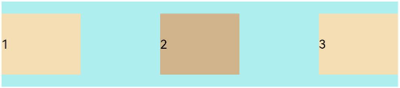
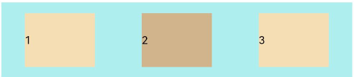
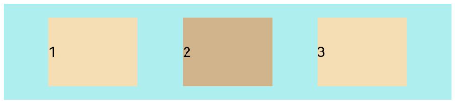
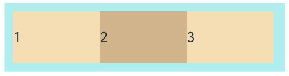
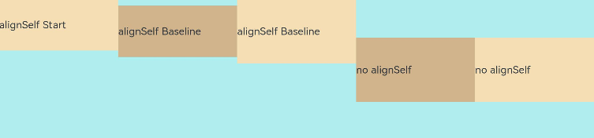
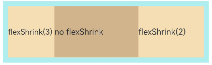

# Flex Layout (Flex)
<!--Kit: ArkUI-->
<!--Subsystem: ArkUI-->
<!--Owner: @camlostshi-->
<!--Designer: @lanshouren-->
<!--Tester: @liuli0427-->
<!--Adviser: @Brilliantry_Rui-->


## Overview

The flex layout, implemented using the [Flex](../reference/apis-arkui/arkui-ts/ts-container-flex.md) container component, provides simple and powerful tools for flexibly distributing space and aligning items. The flex layout is widely used in scenarios such as the navigation bar distribution on the page header, page framework setup, and arrangement of multiple lines of data.

By default, the flex container has a main axis and a cross axis, and child elements are arranged along the main axis. The size of a child element along the main axis is referred to as its main axis size. Similarly, the size of a child element along the cross axis is referred to as its cross axis size.


  **Figure 1** Flex container whose main axis runs in the horizontal direction


## Basic Concepts

- Main axis: axis along which child elements are placed in the **Flex** component. Child elements are laid out along the main axis by default. The start point of the main axis is referred to as main-start, and the end point is referred to as main-end.

- Cross axis: axis that runs perpendicular to the main axis. The start point of the cross axis is referred to as cross-start, and the end point is referred to as cross-end.


## Layout Direction

In the flex layout, the child elements can be arranged in any direction. You can set the **direction** parameter in [FlexOptions](../reference/apis-arkui/arkui-ts/ts-container-flex.md#flexoptions) to define the direction of the main axis and thereby control the arrangement of child elements.

  **Figure 2** Flex layout direction


- **FlexDirection.Row** (default value): The main axis runs along the row horizontally, and the child elements are laid out from the start edge of the main axis.


  <!-- @[FlexDirectionRow_start](https://gitcode.com/openharmony/applications_app_samples/blob/master/code/DocsSample/ArkUISample/MultipleLayoutProject/entry/src/main/ets/pages/flexlayout/FlexDirectionRow.ets) -->
  
  ``` TypeScript
  Flex({ direction: FlexDirection.Row }) {
    Text('1').width('33%').height(50).backgroundColor('#F5DEB3')
    Text('2').width('33%').height(50).backgroundColor('#D2B48C')
    Text('3').width('33%').height(50).backgroundColor('#F5DEB3')
  }
  .height(70)
  .width('90%')
  .padding(10)
  .backgroundColor('#AFEEEE')
  ```

  

- **FlexDirection.RowReverse**: The main axis runs along the row horizontally, and the child elements are laid out from the end edge of the main axis, in a direction opposite to **FlexDirection.Row**.


  <!-- @[FlexDirectionRowReverse_start](https://gitcode.com/openharmony/applications_app_samples/blob/master/code/DocsSample/ArkUISample/MultipleLayoutProject/entry/src/main/ets/pages/flexlayout/FlexDirectionRowReverse.ets) -->
  
  ``` TypeScript
  Flex({ direction: FlexDirection.RowReverse }) {
    Text('1').width('33%').height(50).backgroundColor('#F5DEB3')
    Text('2').width('33%').height(50).backgroundColor('#D2B48C')
    Text('3').width('33%').height(50).backgroundColor('#F5DEB3')
  }
  .height(70)
  .width('90%')
  .padding(10)
  .backgroundColor('#AFEEEE')
  ```

  

- **FlexDirection.Column**: The main axis runs along the column vertically, and the child elements are laid out from the start edge of the main axis.


  <!-- @[FlexDirectionColumn_start](https://gitcode.com/openharmony/applications_app_samples/blob/master/code/DocsSample/ArkUISample/MultipleLayoutProject/entry/src/main/ets/pages/flexlayout/FlexDirectionColumn.ets) -->
  
  ``` TypeScript
  Flex({ direction: FlexDirection.Column }) {
    Text('1').width('100%').height(50).backgroundColor('#F5DEB3')
    Text('2').width('100%').height(50).backgroundColor('#D2B48C')
    Text('3').width('100%').height(50).backgroundColor('#F5DEB3')
  }
  .height(70)
  .width('90%')
  .padding(10)
  .backgroundColor('#AFEEEE')
  ```

  

- **FlexDirection.ColumnReverse**: The main axis runs along the column vertically, and the child elements are laid out from the end edge of the main axis, in a direction opposite to **FlexDirection.Column**.


  <!-- @[FlexDirectionColumnReverse_start](https://gitcode.com/openharmony/applications_app_samples/blob/master/code/DocsSample/ArkUISample/MultipleLayoutProject/entry/src/main/ets/pages/flexlayout/FlexDirectionColumnReverse.ets) -->
  
  ``` TypeScript
  Flex({ direction: FlexDirection.ColumnReverse }) {
    Text('1').width('100%').height(50).backgroundColor('#F5DEB3')
    Text('2').width('100%').height(50).backgroundColor('#D2B48C')
    Text('3').width('100%').height(50).backgroundColor('#F5DEB3')
  }
  .height(70)
  .width('90%')
  .padding(10)
  .backgroundColor('#AFEEEE')
  ```

  


## Wrapping in the Flex Layout

In the flex layout, child elements can be laid on a single line or on multiple lines. By default, child elements in the flex container are laid out on a single line (also called an axis). You can use the **wrap** attribute to set whether child elements can wrap onto multiple lines when the total main axis size of the child elements is greater than the main axis size of the container. When wrapped onto multiple lines, the child elements on the new line are aligned based on the cross axis direction.

- FlexWrap.NoWrap (default value): no line feed. This may cause the child elements to shrink to fit the container when their total width is greater than the container width.


  <!-- @[FlexWrapNoWrap_start](https://gitcode.com/openharmony/applications_app_samples/blob/master/code/DocsSample/ArkUISample/MultipleLayoutProject/entry/src/main/ets/pages/flexlayout/FlexWrapNoWrap.ets) -->
  
  ``` TypeScript
  Flex({ wrap: FlexWrap.NoWrap }) {
    Text('1').width('50%').height(50).backgroundColor('#F5DEB3')
    Text('2').width('50%').height(50).backgroundColor('#D2B48C')
    Text('3').width('50%').height(50).backgroundColor('#F5DEB3')
  }
  .width('90%')
  .padding(10)
  .backgroundColor('#AFEEEE')
  ```

  

- **FlexWrap.Wrap**: Child elements break into multiple lines and are aligned along the main axis.


  <!-- @[FlexWrapWrap_start](https://gitcode.com/openharmony/applications_app_samples/blob/master/code/DocsSample/ArkUISample/MultipleLayoutProject/entry/src/main/ets/pages/flexlayout/FlexWrapWrap.ets) -->
  
  ``` TypeScript
  Flex({ wrap: FlexWrap.Wrap }) {
    Text('1').width('50%').height(50).backgroundColor('#F5DEB3')
    Text('2').width('50%').height(50).backgroundColor('#D2B48C')
    Text('3').width('50%').height(50).backgroundColor('#D2B48C')
  }
  .width('90%')
  .padding(10)
  .backgroundColor('#AFEEEE')
  ```

  

- **FlexWrap.WrapReverse**: Child elements break into multiple lines and are aligned in the reverse direction to the main axis.


  <!-- @[FlexWrapWrapReverse_start](https://gitcode.com/openharmony/applications_app_samples/blob/master/code/DocsSample/ArkUISample/MultipleLayoutProject/entry/src/main/ets/pages/flexlayout/FlexWrapWrapReverse.ets) -->
  
  ``` TypeScript
  Flex({ wrap: FlexWrap.WrapReverse}) {
    Text('1').width('50%').height(50).backgroundColor('#F5DEB3')
    Text('2').width('50%').height(50).backgroundColor('#D2B48C')
    Text('3').width('50%').height(50).backgroundColor('#F5DEB3')
  }
  .width('90%')
  .padding(10)
  .backgroundColor('#AFEEEE')
  ```

  


## Alignment on the Main Axis

Use the **justifyContent** parameter to set alignment of child elements on the main axis.


- **FlexAlign.Start** (default value): The child elements are aligned with each other toward the start edge of the container along the main axis.


  <!-- @[FlexAlignStart_start](https://gitcode.com/openharmony/applications_app_samples/blob/master/code/DocsSample/ArkUISample/MultipleLayoutProject/entry/src/main/ets/pages/flexlayout/FlexAlignStart.ets) -->
  
  ``` TypeScript
  Flex({ justifyContent: FlexAlign.Start }) {
    Text('1').width('20%').height(50).backgroundColor('#F5DEB3')
    Text('2').width('20%').height(50).backgroundColor('#D2B48C')
    Text('3').width('20%').height(50).backgroundColor('#F5DEB3')
  }
  .width('90%')
  .padding({ top: 10, bottom: 10 })
  .backgroundColor('#AFEEEE')
  ```

  

- **FlexAlign.Center**: The child elements are aligned with each other toward the center of the container along the main axis.


  <!-- @[FlexAlignCenter_start](https://gitcode.com/openharmony/applications_app_samples/blob/master/code/DocsSample/ArkUISample/MultipleLayoutProject/entry/src/main/ets/pages/flexlayout/FlexAlignCenter.ets) -->
  
  ``` TypeScript
  Flex({ justifyContent: FlexAlign.Center }) {
    Text('1').width('20%').height(50).backgroundColor('#F5DEB3')
    Text('2').width('20%').height(50).backgroundColor('#D2B48C')
    Text('3').width('20%').height(50).backgroundColor('#F5DEB3')
  }
  .width('90%')
  .padding({ top: 10, bottom: 10 })
  .backgroundColor('#AFEEEE')
  ```

  

- **FlexAlign.End**: The child elements are aligned with each other toward the end edge of the container along the main axis.


  <!-- @[FlexAlignEnd_start](https://gitcode.com/openharmony/applications_app_samples/blob/master/code/DocsSample/ArkUISample/MultipleLayoutProject/entry/src/main/ets/pages/flexlayout/FlexAlignEnd.ets) -->
  
  ``` TypeScript
  Flex({ justifyContent: FlexAlign.End }) {
    Text('1').width('20%').height(50).backgroundColor('#F5DEB3')
    Text('2').width('20%').height(50).backgroundColor('#D2B48C')
    Text('3').width('20%').height(50).backgroundColor('#F5DEB3')
  }
  .width('90%')
  .padding({ top: 10, bottom: 10 })
  .backgroundColor('#AFEEEE')
  ```

  

- **FlexAlign.SpaceBetween**: The child elements are evenly distributed within the container along the main axis. The first and last child elements are aligned with the edges of the container.


  <!-- @[FlexAlignSpaceBetween_start](https://gitcode.com/openharmony/applications_app_samples/blob/master/code/DocsSample/ArkUISample/MultipleLayoutProject/entry/src/main/ets/pages/flexlayout/FlexAlignSpaceBetween.ets) -->
  
  ``` TypeScript
  Flex({ justifyContent: FlexAlign.SpaceBetween }) {
    Text('1').width('20%').height(50).backgroundColor('#F5DEB3')
    Text('2').width('20%').height(50).backgroundColor('#D2B48C')
    Text('3').width('20%').height(50).backgroundColor('#F5DEB3')
  }
  .width('90%')
  .padding({ top: 10, bottom: 10 })
  .backgroundColor('#AFEEEE')
  ```

  

- **FlexAlign.SpaceAround**: The child elements are evenly distributed within the container along the main axis. The space between the first child element and main-start, and that between the last child element and main-end are both half of the space between two adjacent child elements.


  <!-- @[FlexAlignSpaceAround_start](https://gitcode.com/openharmony/applications_app_samples/blob/master/code/DocsSample/ArkUISample/MultipleLayoutProject/entry/src/main/ets/pages/flexlayout/FlexAlignSpaceAround.ets) -->
  
  ``` TypeScript
  Flex({ justifyContent: FlexAlign.SpaceAround }) {
    Text('1').width('20%').height(50).backgroundColor('#F5DEB3')
    Text('2').width('20%').height(50).backgroundColor('#D2B48C')
    Text('3').width('20%').height(50).backgroundColor('#F5DEB3')
  }
  .width('90%')
  .padding({ top: 10, bottom: 10 })
  .backgroundColor('#AFEEEE')
  ```

  

- **FlexAlign.SpaceEvenly**: The child elements are evenly distributed within the container along the main axis. The space between the first child element and main-start, the space between the last child element and main-end, and the space between two adjacent child elements are the same.


  <!-- @[FlexAlignSpaceEvenly_start](https://gitcode.com/openharmony/applications_app_samples/blob/master/code/DocsSample/ArkUISample/MultipleLayoutProject/entry/src/main/ets/pages/flexlayout/FlexAlignSpaceEvenly.ets) -->
  
  ``` TypeScript
  Flex({ justifyContent: FlexAlign.SpaceEvenly }) {
    Text('1').width('20%').height(50).backgroundColor('#F5DEB3')
    Text('2').width('20%').height(50).backgroundColor('#D2B48C')
    Text('3').width('20%').height(50).backgroundColor('#F5DEB3')
  }
  .width('90%')
  .padding({ top: 10, bottom: 10 })
  .backgroundColor('#AFEEEE')
  ```

  


## Alignment on the Cross Axis

Alignment on the cross axis can be set for both the container and child elements, with that set for child elements having a higher priority.


### Setting Alignment on the Cross Axis for the Container

Use the **alignItems** parameter in [FlexOptions](../reference/apis-arkui/arkui-ts/ts-container-flex.md#flexoptions) to set alignment of child elements on the cross axis.


- **ItemAlign.Auto**: The child elements are automatically aligned in the flex container.


  <!-- @[FlexItemAlignAuto_start](https://gitcode.com/openharmony/applications_app_samples/blob/master/code/DocsSample/ArkUISample/MultipleLayoutProject/entry/src/main/ets/pages/flexlayout/FlexItemAlignAuto.ets) -->
  
  ``` TypeScript
  Flex({ alignItems: ItemAlign.Auto }) {
    Text('1').width('33%').height(30).backgroundColor('#F5DEB3')
    Text('2').width('33%').height(40).backgroundColor('#D2B48C')
    Text('3').width('33%').height(50).backgroundColor('#F5DEB3')
  }
  .size({ width: '90%', height: 80 })
  .padding(10)
  .backgroundColor('#AFEEEE')
  ```

  

- **ItemAlign.Start**: The child elements are aligned with the start edge of the container along the cross axis.


  <!-- @[FlexItemAlignStart_start](https://gitcode.com/openharmony/applications_app_samples/blob/master/code/DocsSample/ArkUISample/MultipleLayoutProject/entry/src/main/ets/pages/flexlayout/FlexItemAlignStart.ets) -->
  
  ``` TypeScript
  Flex({ alignItems: ItemAlign.Start }) {
    Text('1').width('33%').height(30).backgroundColor('#F5DEB3')
    Text('2').width('33%').height(40).backgroundColor('#D2B48C')
    Text('3').width('33%').height(50).backgroundColor('#F5DEB3')
  }
  .size({ width: '90%', height: 80 })
  .padding(10)
  .backgroundColor('#AFEEEE')
  ```

  

- **ItemAlign.Start**: The child elements are aligned with the center of the container along the cross axis.


  <!-- @[FlexItemAlignCenter_start](https://gitcode.com/openharmony/applications_app_samples/blob/master/code/DocsSample/ArkUISample/MultipleLayoutProject/entry/src/main/ets/pages/flexlayout/FlexItemAlignCenter.ets) -->
  
  ``` TypeScript
  Flex({ alignItems: ItemAlign.Center }) {
    Text('1').width('33%').height(30).backgroundColor('#F5DEB3')
    Text('2').width('33%').height(40).backgroundColor('#D2B48C')
    Text('3').width('33%').height(50).backgroundColor('#F5DEB3')
  }
  .size({ width: '90%', height: 80 })
  .padding(10)
  .backgroundColor('#AFEEEE')
  ```

  

- **ItemAlign.End**: The child elements are aligned with the end edge of the container along the cross axis.


  <!-- @[FlexItemAlignEnd_start](https://gitcode.com/openharmony/applications_app_samples/blob/master/code/DocsSample/ArkUISample/MultipleLayoutProject/entry/src/main/ets/pages/flexlayout/FlexItemAlignEnd.ets) -->
  
  ``` TypeScript
  Flex({ alignItems: ItemAlign.End }) {
    Text('1').width('33%').height(30).backgroundColor('#F5DEB3')
    Text('2').width('33%').height(40).backgroundColor('#D2B48C')
    Text('3').width('33%').height(50).backgroundColor('#F5DEB3')
  }
  .size({ width: '90%', height: 80 })
  .padding(10)
  .backgroundColor('#AFEEEE')
  ```

  

- **ItemAlign.Stretch**: The child elements are stretched along the cross axis. If no constraints are set, the child elements are stretched to fill the size of the container on the cross axis. The items in the flex container are stretched and padded along the cross axis. If the container is a flex container and [FlexWrap](../reference/apis-arkui/arkui-ts/ts-appendix-enums.md#flexwrap) is set to **FlexWrap.Wrap** or **FlexWrap.WrapReverse**, the items are stretched to align with the item that has the longest cross axis size in the current row or column. In other cases, the items are stretched to the container size regardless of whether their size is set.


  <!-- @[FlexItemAlignStretch_start](https://gitcode.com/openharmony/applications_app_samples/blob/master/code/DocsSample/ArkUISample/MultipleLayoutProject/entry/src/main/ets/pages/flexlayout/FlexItemAlignStretch.ets) -->
  
  ``` TypeScript
  Flex({ alignItems: ItemAlign.Stretch }) {
    Text('1').width('33%').backgroundColor('#F5DEB3')
    Text('2').width('33%').backgroundColor('#D2B48C')
    Text('3').width('33%').backgroundColor('#F5DEB3')
  }
  .size({ width: '90%', height: 80 })
  .padding(10)
  .backgroundColor('#AFEEEE')
  ```

  

- **ItemAlign.Baseline**: The items are aligned at the baseline of the cross axis.


  <!-- @[FlexItemAlignBaseline_start](https://gitcode.com/openharmony/applications_app_samples/blob/master/code/DocsSample/ArkUISample/MultipleLayoutProject/entry/src/main/ets/pages/flexlayout/FlexItemAlignBaseline.ets) -->
  
  ``` TypeScript
  Flex({ alignItems: ItemAlign.Baseline }) {
    Text('1').width('33%').height(30).backgroundColor('#F5DEB3')
    Text('2').width('33%').height(40).backgroundColor('#D2B48C')
    Text('3').width('33%').height(50).backgroundColor('#F5DEB3')
  }
  .size({ width: '90%', height: 80 })
  .padding(10)
  .backgroundColor('#AFEEEE')
  ```

  


### Setting Alignment on the Cross Axis for Child Elements

Use the [alignSelf](../reference/apis-arkui/arkui-ts/ts-universal-attributes-flex-layout.md#alignself) attribute of child elements to set their alignment in the container on the cross axis. The settings overwrite the default **alignItems** settings in the flex container. The sample code is as follows:

<!-- @[FlexAlignSelf_start](https://gitcode.com/openharmony/applications_app_samples/blob/master/code/DocsSample/ArkUISample/MultipleLayoutProject/entry/src/main/ets/pages/flexlayout/FlexAlignSelf.ets) -->

``` TypeScript
Flex({ direction: FlexDirection.Row, alignItems: ItemAlign.Center }) { // The child elements are aligned with the center of the container.
  Text('alignSelf Start').width('25%').height(80)
    .alignSelf(ItemAlign.Start)
    .backgroundColor('#F5DEB3')
  Text('alignSelf Baseline')
    .alignSelf(ItemAlign.Baseline)
    .width('25%')
    .height(80)
    .backgroundColor('#D2B48C')
  Text('alignSelf Baseline').width('25%').height(100)
    .backgroundColor('#F5DEB3')
    .alignSelf(ItemAlign.Baseline)
  Text('no alignSelf').width('25%').height(100)
    .backgroundColor('#D2B48C')
  Text('no alignSelf').width('25%').height(100)
    .backgroundColor('#F5DEB3')

}.width('90%').height(220).backgroundColor('#AFEEEE')
```





In the preceding example, the **alignItems** parameter of the **Flex** container and the **alignSelf** attribute of the child element are both set. In this case, the **alignSelf** settings take effect.


### Content Alignment

Use the [alignContent](../reference/apis-arkui/arkui-ts/ts-container-flex.md#flexoptions) parameter to set how space is distributed between and around child elements along the cross axis. This parameter is effective only for a multi-line flex layout. Its available options are as follows:

- **FlexAlign.Start**: The child elements are aligned toward the start edge of the cross axis in the container.


  <!-- @[FlexAlignCenterFlexAlignStart_start](https://gitcode.com/openharmony/applications_app_samples/blob/master/code/DocsSample/ArkUISample/MultipleLayoutProject/entry/src/main/ets/pages/flexlayout/FlexAlignCenterFlexAlignStart.ets) -->
  
  ``` TypeScript
  Flex({ justifyContent: FlexAlign.SpaceBetween, wrap: FlexWrap.Wrap, alignContent: FlexAlign.Start }) {
    Text('1').width('30%').height(20).backgroundColor('#F5DEB3')
    Text('2').width('60%').height(20).backgroundColor('#D2B48C')
    Text('3').width('40%').height(20).backgroundColor('#D2B48C')
    Text('4').width('30%').height(20).backgroundColor('#F5DEB3')
    Text('5').width('20%').height(20).backgroundColor('#D2B48C')
  }
  .width('90%')
  .height(100)
  .backgroundColor('#AFEEEE')
  ```

  

- **FlexAlign.Center**: The child elements are aligned toward the center of the cross axis in the container.


  <!-- @[FlexAlignCenterFlexAlignCenter_start](https://gitcode.com/openharmony/applications_app_samples/blob/master/code/DocsSample/ArkUISample/MultipleLayoutProject/entry/src/main/ets/pages/flexlayout/FlexAlignCenterFlexAlignCenter.ets) -->
  
  ``` TypeScript
  Flex({ justifyContent: FlexAlign.SpaceBetween, wrap: FlexWrap.Wrap, alignContent: FlexAlign.Center }) {
    Text('1').width('30%').height(20).backgroundColor('#F5DEB3')
    Text('2').width('60%').height(20).backgroundColor('#D2B48C')
    Text('3').width('40%').height(20).backgroundColor('#D2B48C')
    Text('4').width('30%').height(20).backgroundColor('#F5DEB3')
    Text('5').width('20%').height(20).backgroundColor('#D2B48C')
  }
  .width('90%')
  .height(100)
  .backgroundColor('#AFEEEE')
  ```

  

- **FlexAlign.End**: The child elements are aligned toward the end edge of the cross axis in the container.


  <!-- @[FlexAlignCenterFlexAlignEnd_start](https://gitcode.com/openharmony/applications_app_samples/blob/master/code/DocsSample/ArkUISample/MultipleLayoutProject/entry/src/main/ets/pages/flexlayout/FlexAlignCenterFlexAlignEnd.ets) -->
  
  ``` TypeScript
  Flex({ justifyContent: FlexAlign.SpaceBetween, wrap: FlexWrap.Wrap, alignContent: FlexAlign.End }) {
    Text('1').width('30%').height(20).backgroundColor('#F5DEB3')
    Text('2').width('60%').height(20).backgroundColor('#D2B48C')
    Text('3').width('40%').height(20).backgroundColor('#D2B48C')
    Text('4').width('30%').height(20).backgroundColor('#F5DEB3')
    Text('5').width('20%').height(20).backgroundColor('#D2B48C')
  }
  .width('90%')
  .height(100)
  .backgroundColor('#AFEEEE')
  ```

  

- **FlexAlign.SpaceBetween**: The child elements are evenly distributed within the container along the cross axis. The first and last child elements are aligned with the edges of the container.


  <!-- @[FlexAlignCenterFlexAlignSpaceBetween_start](https://gitcode.com/openharmony/applications_app_samples/blob/master/code/DocsSample/ArkUISample/MultipleLayoutProject/entry/src/main/ets/pages/flexlayout/FlexAlignCenterFlexAlignSpaceBetween.ets) -->
  
  ``` TypeScript
  Flex({ justifyContent: FlexAlign.SpaceBetween, wrap: FlexWrap.Wrap, alignContent: FlexAlign.SpaceBetween }) {
    Text('1').width('30%').height(20).backgroundColor('#F5DEB3')
    Text('2').width('60%').height(20).backgroundColor('#D2B48C')
    Text('3').width('40%').height(20).backgroundColor('#D2B48C')
    Text('4').width('30%').height(20).backgroundColor('#F5DEB3')
    Text('5').width('20%').height(20).backgroundColor('#D2B48C')
  }
  .width('90%')
  .height(100)
  .backgroundColor('#AFEEEE')
  ```

  

- **FlexAlign.SpaceAround**: The child elements are evenly distributed within the container along the cross axis. The space between the first child element and cross-start, and that between the last child element and cross-end are both half of the space between two adjacent child elements.


  <!-- @[FlexAlignCenterFlexAlignSpaceAround_start](https://gitcode.com/openharmony/applications_app_samples/blob/master/code/DocsSample/ArkUISample/MultipleLayoutProject/entry/src/main/ets/pages/flexlayout/FlexAlignCenterFlexAlignSpaceAround.ets) -->
  
  ``` TypeScript
  Flex({ justifyContent: FlexAlign.SpaceBetween, wrap: FlexWrap.Wrap, alignContent: FlexAlign.SpaceAround }) {
    Text('1').width('30%').height(20).backgroundColor('#F5DEB3')
    Text('2').width('60%').height(20).backgroundColor('#D2B48C')
    Text('3').width('40%').height(20).backgroundColor('#D2B48C')
    Text('4').width('30%').height(20).backgroundColor('#F5DEB3')
    Text('5').width('20%').height(20).backgroundColor('#D2B48C')
  }
  .width('90%')
  .height(100)
  .backgroundColor('#AFEEEE')
  ```

  

- **FlexAlign.SpaceEvenly**: The child elements are evenly distributed within the container along the cross axis. The space between the first child element and cross-start, the space between the last child element and cross-end, and the space between two adjacent child elements are the same.


  <!-- @[FlexAlignCenterFlexAlignSpaceBetween_start](https://gitcode.com/openharmony/applications_app_samples/blob/master/code/DocsSample/ArkUISample/MultipleLayoutProject/entry/src/main/ets/pages/flexlayout/FlexAlignCenterFlexAlignSpaceEvenly.ets) -->
  
  ``` TypeScript
  Flex({ justifyContent: FlexAlign.SpaceBetween, wrap: FlexWrap.Wrap, alignContent: FlexAlign.SpaceEvenly }) {
    Text('1').width('30%').height(20).backgroundColor('#F5DEB3')
    Text('2').width('60%').height(20).backgroundColor('#D2B48C')
    Text('3').width('40%').height(20).backgroundColor('#D2B48C')
    Text('4').width('30%').height(20).backgroundColor('#F5DEB3')
    Text('5').width('20%').height(20).backgroundColor('#D2B48C')
  }
  .width('90%')
  .height(100)
  .backgroundColor('#AFEEEE')
  ```

  


## Adaptive Scaling

When the size of the flex container is not large enough, the following attributes of the child element can be used to achieve adaptive layout:

- [flexBasis](../reference/apis-arkui/arkui-ts/ts-universal-attributes-flex-layout.md#flexbasis): base size of the child element in the container along the main axis. It sets the space occupied by the child element. If this attribute is not set, the space occupied by the child element is the result of width/height.


  <!-- @[FlexBasis_start](https://gitcode.com/openharmony/applications_app_samples/blob/master/code/DocsSample/ArkUISample/MultipleLayoutProject/entry/src/main/ets/pages/flexlayout/FlexBasis.ets) -->
  
  ``` TypeScript
  Flex() {
    Text('flexBasis("auto")')
      .flexBasis('auto')// When width is not set and flexBasis is set to auto, the content is at its own width.
      .height(100)
      .backgroundColor('#F5DEB3')
    Text('flexBasis("auto")'+' width("40%")')
      .width('40%')
      .flexBasis('auto')// When width is set and flexBasis is set to auto, the value of width is used.
      .height(100)
      .backgroundColor('#D2B48C')
  
    Text('flexBasis(100)') // When width is not set and flexBasis is set to 100, the width is 100 vp.
      .flexBasis(100)
      .height(100)
      .backgroundColor('#F5DEB3')
  
    Text('flexBasis(100)')
      .flexBasis(100)
      .width(200)// When both width and flexBasis are set, flexBasis takes precedence, and the width is 100 vp.
      .height(100)
      .backgroundColor('#D2B48C')
  }.width('90%').height(120).padding(10).backgroundColor('#AFEEEE')
  ```

  

- [flexGrow](../reference/apis-arkui//arkui-ts/ts-universal-attributes-flex-layout.md#flexgrow): percentage of the flex container's remaining space that is allocated to the child element.

  <!-- @[FlexGrow_start](https://gitcode.com/openharmony/applications_app_samples/blob/master/code/DocsSample/ArkUISample/MultipleLayoutProject/entry/src/main/ets/pages/flexlayout/FlexGrow.ets) -->
  
  ``` TypeScript
  Flex() {
    Text('flexGrow(1)')
      .flexGrow(1)
      .width(100)
      .height(100)
      .backgroundColor('#F5DEB3')
    Text('flexGrow(4)')
      .flexGrow(4)
      .width(100)
      .height(100)
      .backgroundColor('#D2B48C')
  
    Text('no flexGrow')
      .width(100)
      .height(100)
      .backgroundColor('#F5DEB3')
  }.width(360).height(120).padding(10).backgroundColor('#AFEEEE')
  ```
  
  
  
  In the preceding figure, the flex container has a width of 360 vp. The three child elements each have an initial width of 100 vp, with combined left and right margins totaling 20 vp, resulting in a total initial width of 320 vp. The remaining 40 vp of space in the flex container is distributed among the child elements according to their **flexGrow** values. The third child element, which has no **flexGrow** value set, does not participate in the distribution of the remaining space.
  
  After receiving their share of remaining space (40 vp) at a 1:4 ratio, the first and second child elements are at a width of 108 vp (100 vp + 40 vp x 1/5) and 132 vp (100 vp + 40 vp x 4/5), respectively.
  
- [flexShrink](../reference/apis-arkui/arkui-ts/ts-universal-attributes-flex-layout.md#flexshrink): shrink factor of the child element when the size of all child elements is larger than the flex container.


  <!-- @[FlexShrink_start](https://gitcode.com/openharmony/applications_app_samples/blob/master/code/DocsSample/ArkUISample/MultipleLayoutProject/entry/src/main/ets/pages/flexlayout/FlexShrink.ets) -->
  
  ``` TypeScript
  Flex({ direction: FlexDirection.Row }) {
    Text('flexShrink(3)')
      .flexShrink(3)
      .width(200)
      .height(100)
      .backgroundColor('#F5DEB3')
  
    Text('no flexShrink')
      .width(200)
      .height(100)
      .backgroundColor('#D2B48C')
  
    Text('flexShrink(2)')
      .flexShrink(2)
      .width(200)
      .height(100)
      .backgroundColor('#F5DEB3')
  }.width(400).height(120).padding(10).backgroundColor('#AFEEEE')
  ```

  

  In this example, the parent container has a width of 400 vp. The three child elements each have an initial width of 200 vp, with left and right padding totaling 20 vp. The available layout space within the parent container is 380 vp, creating an overflow of 220 vp beyond the available space.
  
  The first and third elements are compressed at a 3:2 ratio until they fit within the parent container's layout space: first element: 200 vp – (220 vp/5) x 3 = 68 vp; second element: 200 vp – (220 vp/5) x 2 = 112 vp.


## Example

In this example, child elements are arranged horizontally in the flex layout, aligned at both edges, evenly spaced, and centered in the vertical direction.


<!-- @[FlexExample_start](https://gitcode.com/openharmony/applications_app_samples/blob/master/code/DocsSample/ArkUISample/MultipleLayoutProject/entry/src/main/ets/pages/flexlayout/FlexExample.ets) -->

``` TypeScript
@Entry
@Component
struct FlexExample {
  build() {
    Column() {
      Column({ space: 5 }) {
        Flex({
          direction: FlexDirection.Row,
          wrap: FlexWrap.NoWrap,
          justifyContent: FlexAlign.SpaceBetween,
          alignItems: ItemAlign.Center
        }) {
          Text('1').width('30%').height(50).backgroundColor('#F5DEB3')
          Text('2').width('30%').height(50).backgroundColor('#D2B48C')
          Text('3').width('30%').height(50).backgroundColor('#F5DEB3')
        }
        .height(70)
        .width('90%')
        .backgroundColor('#AFEEEE')
      }.width('100%').margin({ top: 5 })
    }.width('100%')
  }
}
```


