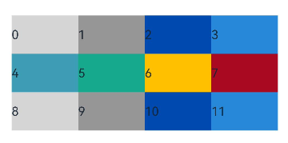
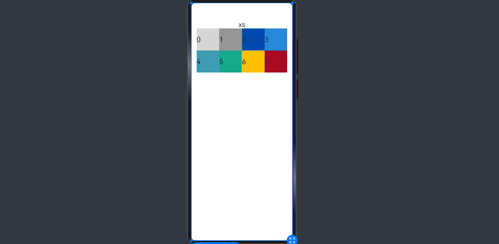

# Responsive Grid Layout (GridRow/GridCol)
<!--Kit: ArkUI-->
<!--Subsystem: ArkUI-->
<!--Owner: @zju_ljz-->
<!--Designer: @lanshouren-->
<!--Tester: @liuli0427-->
<!--Adviser: @Brilliantry_Rui-->


## Overview

As an auxiliary positioning tool, the responsive grid layout is handy in UI design on mobile devices. It exhibits the following advantages:

1. Provides rules for layout design and resolves issues of dynamic layout across devices with different sizes. By dividing a page into equal-width columns and rows, you can easily locate and typeset page elements.

2. Provides a unified positioning method for the system to ensure layout consistency across layouts on different devices. This can reduce the complexity of design and development and improve work efficiency.

3. Provides a flexible spacing adjustment method for applications to accommodate special layout requirements. You can adjust the spacing between columns and between rows to control the typesetting of the entire page.

4. Completes the wrapping and adaptation automatically when overflow occurs. When the number of page elements exceeds the capacity of a row or column, they automatically wrap to a new row or column and adapt the typesetting to different devices.

The [GridRow](../reference/apis-arkui/arkui-ts/ts-container-gridrow.md) component is a responsive grid container and must have [GridCol](../reference/apis-arkui/arkui-ts/ts-container-gridcol.md) as its child component.


## GridRow


### Breakpoints

**GridRow** defines breakpoints, which are screen width types in effect, based on screen width ([screen density pixels](../reference/apis-arkui/arkui-ts/ts-pixel-units.md), in vp). You can use the breakpoints to meet specific layout requirements.

By default, devices are categorized into four breakpoints.

| Breakpoint| Value Range (vp)       | Device Description     |
| ---- | --------------- | --------- |
| xs   | [0, 320)  | Minimum-width device.|
| sm   | [320, 600) | Small-width device. |
| md   | [600, 840) | Medium-width device.|
| lg   | [840, +∞)  | Large-width device. |

You can customize breakpoints using the [BreakPoints](../reference/apis-arkui/arkui-ts/ts-container-gridrow.md#breakpoints) parameter, supporting up to six breakpoints: xs, sm, md, lg, xl, and xxl.

| Breakpoint| Device Description     |
| ---- | --------- |
| xs   | Minimum-width device.|
| sm   | Small-width device. |
| md   | Medium-width device.|
| lg   | Large-width device. |
| xl   | Extra-large-width device.|
| xxl  | Extra-extra-large-width device.|

- You can configure breakpoints using a monotonically increasing array based on your application's requirements. By default, the **GridRow** container supports four breakpoints. If no custom breakpoints are specified, the default array is ["320vp", "600vp", "840vp"]. Using the [BreakPoints](../reference/apis-arkui/arkui-ts/ts-container-gridrow.md#breakpoints) parameter, you can support up to six breakpoints, with a maximum array length of 5.

  If you provide an array [n0, n1, n2, n3, n4], the breakpoint ranges are calculated as follows.

  |Breakpoint|Value Range|
  |---|-----------|
  |xs |[0, n0)    |
  |sm |[n0, n1)   |
  |md |[n1, n2)   |
  |lg |[n2, n3)   |
  |xl |[n3, n4)   |
  |xxl|[n4, INF)  |

  ```ts
  breakpoints: {value: ['100vp', '200vp']} // Three breakpoints: xs, sm, md. < 100 vp: xs breakpoint. 100–200 vp: sm breakpoint. > 200 vp: md breakpoint.
  breakpoints: {value: ['320vp', '600vp']} // Three breakpoints: xs, sm, md. < 320 vp: xs breakpoint. 320–600 vp: sm breakpoint. > 600 vp: md breakpoint.
  breakpoints: {value: ['320vp', '600vp', '840vp', '1440vp']} // Five breakpoints: xs, sm, md, lg, xl. < 320 vp: xs breakpoint. 320–600 vp: sm breakpoint. 600–840 vp: md breakpoint. 840–1440 vp: lg breakpoint. > 1440 vp: xl breakpoint.
  ```

- The **GridRow** container implements breakpoints by listening for the changes in the window or container size, and sets the breakpoint references through **reference**. Since the application may be displayed in non-full-screen mode, it is better to design the breakpoints with the application window width as the reference.

  For example, you can define breakpoints to divide the application width into six ranges, and configure **columns** to specify the number of columns in the container for each breakpoint range.


  <!-- @[GridLayoutReference_start](https://gitcode.com/openharmony/applications_app_samples/blob/master/code/DocsSample/ArkUISample/MultipleLayoutProject/entry/src/main/ets/pages/gridlayout/GridLayoutReference.ets) -->
  
  ``` TypeScript
  @Entry
  @Component
  struct WindowRefGridLayout {
    @State currentBp: string = "unknown"
    @State bgColors: ResourceColor[] =
      ['rgb(213,213,213)', 'rgb(150,150,150)', 'rgb(0,74,175)', 'rgb(39,135,217)', 'rgb(61,157,180)', 'rgb(23,169,141)',
        'rgb(255,192,0)', 'rgb(170,10,33)'];

    build() {
      Column({ space: 6 }) {
        Text(this.currentBp)

        GridRow({
          columns: {
            xs: 2, // 2 columns for xs devices
            sm: 4, // 4 columns for sm devices
            md: 8, // 8 columns for md devices
            lg: 12, // 12 columns for lg devices
            xl: 12, // 12 columns for xl devices
            xxl: 12 // 12 columns for xxl devices
          },
          breakpoints: {
            value: ['320vp', '600vp', '840vp', '1440vp', '1600vp'], // Add custom breakpoints '1440vp' and '1600vp' while retaining default breakpoints ['320vp', '600vp', '840vp']. In practice, set breakpoint values based on actual usage scenarios to achieve one-time development for multi-device deployment.
            reference: BreakpointsReference.WindowSize
          }
        }) {
          ForEach(this.bgColors, (color: ResourceColor, index?: number | undefined) => {
            GridCol({ span: 1 }) { // All child components span 1 column.
              Row() {
                Text(`${index}`)
              }.width('100%').height('50vp')
            }.backgroundColor(color)
          })
        }
        .height(200)
        .border({ color: 'rgb(39,135,217)', width: 2 })
        .onBreakpointChange((breakPoint) => {
          this.currentBp = breakPoint
        })
      }
    }
  }
  ```

  


### Columns

The **columns** attribute defines the total number of columns in the **GridRow** container.

- Before API version 20, the default value of **columns** is 12. If **columns** is not set, the responsive grid layout is divided into 12 columns at any breakpoint.
- Since API version 20, the default value of **columns** is { xs: 2, sm: 4, md: 8, lg: 12, xl: 12, xxl: 12 }.


  <!-- @[GridLayoutColumns_start](https://gitcode.com/openharmony/applications_app_samples/blob/master/code/DocsSample/ArkUISample/MultipleLayoutProject/entry/src/main/ets/pages/gridlayout/GridLayoutColumns.ets) -->
  
  ``` TypeScript
  // xxx.ets
  @Entry
  @Component
  struct GridColumnsWithDefaults {
    @State bgColors: ResourceColor[] =
      ['rgb(213,213,213)', 'rgb(150,150,150)', 'rgb(0,74,175)', 'rgb(39,135,217)', 'rgb(61,157,180)', 'rgb(23,169,141)',
        'rgb(255,192,0)', 'rgb(170,10,33)', 'rgb(213,213,213)', 'rgb(150,150,150)', 'rgb(0,74,175)', 'rgb(39,135,217)'];
  
    build() {
      GridRow() {
        ForEach(this.bgColors, (item: ResourceColor, index?: number | undefined) => {
          GridCol({ span: 1 }) {
            Row() {
              Text(`${index}`)
            }.width('100%').height('50')
          }.backgroundColor(item)
        })
      }
    }
  }
  ```

    Below shows the layout display before API version 20.

    
    
    Below shows the layout display since API version 20, using the sm device as an example where the default number of columns is 4.
    
    


The **columns** attribute supports two data types: number and [GridRowColumnOption](../reference/apis-arkui/arkui-ts/ts-container-gridrow.md#gridrowcolumnoption). You can configure the total number of responsive grid columns using either approach:
- When **columns** is set to a number, the grid maintains the same number of columns across all device sizes. The following figures demonstrate the layout effects when the grid is configured with 4 and 8 columns respectively, with each child component spanning one column.

  <!-- @[GridLayoutColumnsToFour_start](https://gitcode.com/openharmony/applications_app_samples/blob/master/code/DocsSample/ArkUISample/MultipleLayoutProject/entry/src/main/ets/pages/gridlayout/GridLayoutColumnsToFour.ets) -->
  
  ``` TypeScript
  // xxx.ets
  @Entry
  @Component
  struct FixedFourColumnGrid {
    @State bgColors: ResourceColor[] =
      ['rgb(213,213,213)', 'rgb(150,150,150)', 'rgb(0,74,175)', 'rgb(39,135,217)', 'rgb(61,157,180)', 'rgb(23,169,141)',
        'rgb(255,192,0)', 'rgb(170,10,33)'];

    build() {
      Column({ space: 6 }) {
        Text('columns: 4').alignSelf(ItemAlign.Start)

        Row() {
          GridRow({ columns: 4 }) {
            ForEach(this.bgColors, (item: ResourceColor, index?: number | undefined) => {
              GridCol({ span: 1 }) {
                Row() {
                  Text(`${index}`)
                }.width('100%').height('50')
              }.backgroundColor(item)
            })
          }
          .width('100%').height('100%')
        }
        .height(160)
        .border({ color: 'rgb(39,135,217)', width: 2 })
        .width('90%')
      }
    }
  }
  ```

  <!-- @[GridLayoutColumnsToEight_start](https://gitcode.com/openharmony/applications_app_samples/blob/master/code/DocsSample/ArkUISample/MultipleLayoutProject/entry/src/main/ets/pages/gridlayout/GridLayoutColumnsToEight.ets) -->
  
  ``` TypeScript
  // xxx.ets
  @Entry
  @Component
  struct FixedEightColumnGrid {
    @State bgColors: ResourceColor[] =
      ['rgb(213,213,213)', 'rgb(150,150,150)', 'rgb(0,74,175)', 'rgb(39,135,217)', 'rgb(61,157,180)', 'rgb(23,169,141)',
        'rgb(255,192,0)', 'rgb(170,10,33)'];

    build() {
      Column({ space: 6 }) {
        Text('columns: 8').alignSelf(ItemAlign.Start)

        Row() {
          GridRow({ columns: 8 }) {
            ForEach(this.bgColors, (item: ResourceColor, index?: number | undefined) => {
              GridCol({ span: 1 }) {
                Row() {
                  Text(`${index}`)
                }.width('100%').height('50')
              }.backgroundColor(item)
            })
          }
          .width('100%').height('100%')
        }
        .height(160)
        .border({ color: 'rgb(39,135,217)', width: 2 })
        .width('90%')
      }
    }
  }
  ```

    

- When **columns** is set to [GridRowColumnOption](../reference/apis-arkui/arkui-ts/ts-container-gridrow.md#gridrowcolumnoption), you can configure the number of grid columns for each of the six device sizes (xs, sm, md, lg, xl, and xxl).

  <!-- @[GridLayoutColumnOption_start](https://gitcode.com/openharmony/applications_app_samples/blob/master/code/DocsSample/ArkUISample/MultipleLayoutProject/entry/src/main/ets/pages/gridlayout/GridLayoutColumnOption.ets) -->
  
  ``` TypeScript
  @Entry
  @Component
  struct GridRowColumnOptionLayout {
    @State bgColors: ResourceColor[] =
      ['rgb(213,213,213)', 'rgb(150,150,150)', 'rgb(0,74,175)', 'rgb(39,135,217)', 'rgb(61,157,180)', 'rgb(23,169,141)',
        'rgb(255,192,0)', 'rgb(170,10,33)'];
  
    build() {
      GridRow({
        columns: { sm: 4, md: 8 },
        breakpoints: {
          value: ['320vp', '600vp', '840vp', '1440vp', '1600vp'] // Add custom breakpoints '1440vp' and '1600vp' while retaining default breakpoints ['320vp', '600vp', '840vp']. In practice, set breakpoint values based on actual usage scenarios to achieve one-time development for multi-device deployment.
        }
      }) {
        ForEach(this.bgColors, (item: ResourceColor, index?: number | undefined) => {
          GridCol({ span: 1 }) {
            Row() {
              Text(`${index}`)
            }.width('100%').height('50')
          }.backgroundColor(item)
        })
      }
      .height(200)
      .border({ color: 'rgb(39,135,217)', width: 2 })
    }
  }
  ```

    Layout behavior before API version 20: If the number of grid columns is not configured for xs devices, the default value of 12 columns is used.

    

    Layout behavior since API version 20: xs devices inherit the number of grid columns from sm devices.

    

  If only the grid column numbers for sm and md devices are configured, the xs, lg, xl, and xxl devices will use default values based on the [grid column number completion rules](../reference/apis-arkui/arkui-ts/ts-container-gridrow.md#gridrowcolumnoption).


### Alignment

In the responsive grid layout, you can set the **direction** attribute of **GridRow** to define the direction in which child components are arranged. The options are [GridRowDirection](../reference/apis-arkui/arkui-ts/ts-container-gridrow.md#gridrowdirection).Row (from left to right) or [GridRowDirection](../reference/apis-arkui/arkui-ts/ts-container-gridrow.md#gridrowdirection).RowReverse (from right to left). An appropriate **direction** value can make the page layout more flexible and meet the design requirements.

- When child components are arranged from left to right (default):


    <!-- @[GridLayoutDirectionRow_start](https://gitcode.com/openharmony/applications_app_samples/blob/master/code/DocsSample/ArkUISample/MultipleLayoutProject/entry/src/main/ets/pages/gridlayout/GridLayoutDirectionRow.ets) -->
    
    ``` TypeScript
    GridRow({ direction: GridRowDirection.Row }) { /* ... */ }
    ```

    

- When child components are arranged from right to left (default):


    <!-- @[GridLayoutDirectionRowReverse_start](https://gitcode.com/openharmony/applications_app_samples/blob/master/code/DocsSample/ArkUISample/MultipleLayoutProject/entry/src/main/ets/pages/gridlayout/GridLayoutDirectionRowReverse.ets) -->
    
    ``` TypeScript
    GridRow({ direction: GridRowDirection.RowReverse }) { /* ... */ }
    ```

    


### Gutters

In the **GridRow** component, **gutter** is used to set the spacing between adjacent child components in the horizontal and vertical directions.

- When **gutter** is set to a number, the number applies to both the horizontal and vertical directions. In the following example, the horizontal and vertical spacing between adjacent child components is set to **10**.


    <!-- @[GridLayoutGutterToNumber_start](https://gitcode.com/openharmony/applications_app_samples/blob/master/code/DocsSample/ArkUISample/MultipleLayoutProject/entry/src/main/ets/pages/gridlayout/GridLayoutGutterToNumber.ets) -->
    
    ``` TypeScript
    GridRow({ gutter: 10 }) { /* ... */ }
    ```

    

- When **gutter** is of type [GutterOption](../reference/apis-arkui/arkui-ts/ts-container-gridrow.md#gutteroption), horizontal and vertical spacing can be set independently: the **x** property defines horizontal spacing, and the **y** property defines vertical spacing.


    <!-- @[GridLayoutGutterOption_start](https://gitcode.com/openharmony/applications_app_samples/blob/master/code/DocsSample/ArkUISample/MultipleLayoutProject/entry/src/main/ets/pages/gridlayout/GridLayoutGutterOption.ets) -->
    
    ``` TypeScript
    GridRow({ gutter: { x: 20, y: 50 } }) { /* ... */ }
    ```

    


## GridCol

The **GridCol** component is a child component of the **GridRow** component. You can set the **span**, **offset**, and **order** attributes of this component by passing parameters or using setters.

- Setting **span**


    <!-- @[GridColSpan_start](https://gitcode.com/openharmony/applications_app_samples/blob/master/code/DocsSample/ArkUISample/MultipleLayoutProject/entry/src/main/ets/pages/gridlayout/GridColSpan.ets) -->
    
    ``` TypeScript
    let gSpan:Record<string,number> = { 'xs': 1, 'sm': 2, 'md': 3, 'lg': 4 }
    ```

    <!-- @[GridColSpan1_start](https://gitcode.com/openharmony/applications_app_samples/blob/master/code/DocsSample/ArkUISample/MultipleLayoutProject/entry/src/main/ets/pages/gridlayout/GridColSpan.ets) -->
    
    ``` TypeScript
    GridCol({ span: 2 }){}
    GridCol({ span: { xs: 1, sm: 2, md: 3, lg: 4 } }){}
    GridCol(){}.span(2)
    GridCol(){}.span(gSpan)
    ```

- Setting **offset**


    <!-- @[GridColOffset_start](https://gitcode.com/openharmony/applications_app_samples/blob/master/code/DocsSample/ArkUISample/MultipleLayoutProject/entry/src/main/ets/pages/gridlayout/GridColOffset.ets) -->
    
    ``` TypeScript
    let gOffset:Record<string,number> = { 'xs': 1, 'sm': 2, 'md': 3, 'lg': 4 }
    ```

    <!-- @[GridColOffset1_start](https://gitcode.com/openharmony/applications_app_samples/blob/master/code/DocsSample/ArkUISample/MultipleLayoutProject/entry/src/main/ets/pages/gridlayout/GridColOffset.ets) -->
    
    ``` TypeScript
    GridCol({ offset: 2, span: 1 }){}
    GridCol({ offset: { xs: 2, sm: 2, md: 2, lg: 2 }, span: 1 }){}
    GridCol({ span: 1 }){}.offset(gOffset)
    ```

- Setting **order**


    <!-- @[GridColOrder_start](https://gitcode.com/openharmony/applications_app_samples/blob/master/code/DocsSample/ArkUISample/MultipleLayoutProject/entry/src/main/ets/pages/gridlayout/GridColOrder.ets) -->
    
    ``` TypeScript
    let gOrder:Record<string,number> = { 'xs': 1, 'sm': 2, 'md': 3, 'lg': 4 }
    ```

    <!-- @[GridColOrder1_start](https://gitcode.com/openharmony/applications_app_samples/blob/master/code/DocsSample/ArkUISample/MultipleLayoutProject/entry/src/main/ets/pages/gridlayout/GridColOrder.ets) -->
    
    ``` TypeScript
    GridCol({ order: 2, span: 1 }){}
    GridCol({ order: { xs: 1, sm: 2, md: 3, lg: 4 }, span: 1 }){}
    GridCol({ span: 1 }){}.order(2)
    GridCol({ span: 1 }){}.order(gOrder)
    ```


### span

Sets the number of columns occupied by a child component in the grid layout, which determines the child component width. The default value is **1**.

The **span** attribute supports two data types: number and [GridColColumnOption](../reference/apis-arkui/arkui-ts/ts-container-gridcol.md#gridcolcolumnoption). You can configure the column span in the following ways:
- When **span** is set to a number, the child component occupies the same number of columns across all screen sizes.


    <!-- @[GridColSpanToNumber_start](https://gitcode.com/openharmony/applications_app_samples/blob/master/code/DocsSample/ArkUISample/MultipleLayoutProject/entry/src/main/ets/pages/gridlayout/GridColSpanToNumber.ets) -->
    
    ``` TypeScript
    // xxx.ets
    @Entry
    @Component
    struct SpanNumberExample {
      @State bgColors: ResourceColor[] =
        ['rgb(213,213,213)', 'rgb(150,150,150)', 'rgb(0,74,175)', 'rgb(39,135,217)', 'rgb(61,157,180)', 'rgb(23,169,141)',
          'rgb(255,192,0)', 'rgb(170,10,33)'];

      build() {
        GridRow({ columns: 8 }) {
          ForEach(this.bgColors, (color: ResourceColor, index?: number | undefined) => {
            GridCol({ span: 2 }) {
              Row() {
                Text(`${index}`)
              }.width('100%').height('50vp')
            }
            .backgroundColor(color)
          })
        }
        .border({ color: 'rgb(39,135,217)', width: 2 })
        .height('150vp')
      }
    }
    ```

    

- When **span** is set to the **GridColColumnOption** type, you can configure different column spans for the six device sizes (xs, sm, md, lg, xl, and xxl). If column spans are only specified for certain breakpoints (for example, sm and md), the remaining breakpoints (xs, lg, xl, and xxl) will use default values based on the [GridColColumnOption completion rules](../reference/apis-arkui/arkui-ts/ts-container-gridcol.md#gridcolcolumnoption).


    <!-- @[GridColSpanToOption_start](https://gitcode.com/openharmony/applications_app_samples/blob/master/code/DocsSample/ArkUISample/MultipleLayoutProject/entry/src/main/ets/pages/gridlayout/GridColSpanToOption.ets) -->
    
    ``` TypeScript
    @Entry
    @Component
    struct SpanColumnOptionExample {
      @State currentBp: string = "unknown"
      @State bgColors: ResourceColor[] =
        ['rgb(213,213,213)', 'rgb(150,150,150)', 'rgb(0,74,175)', 'rgb(39,135,217)', 'rgb(61,157,180)', 'rgb(23,169,141)',
          'rgb(255,192,0)', 'rgb(170,10,33)'];

      build() {
        Column({ space: 6 }) {
          GridRow({ columns: 8 }) {
            ForEach(this.bgColors, (color: ResourceColor, index?: number | undefined) => {
              GridCol({
                span: {
                  xs: 1,
                  sm: 2,
                  md: 3,
                  lg: 4
                }
              }) {
                Row() {
                  Text(`${index}`)
                }.width('100%').height('50vp')
              }
              .backgroundColor(color)
            })
          }
          .border({ color: 'rgb(39,135,217)', width: 2 })
          .height('150vp')
          .onBreakpointChange((breakPoint) => {
            this.currentBp = breakPoint
          })

          Text(this.currentBp)
        }
      }
    }
    ```

    


### offset

Sets the column offset of a child component relative to the previous child component. The default value is **0**.

- When **offset** is set to a number, the column offset remains consistent across all screen sizes.


    <!-- @[GridColOffsetToNumber_start](https://gitcode.com/openharmony/applications_app_samples/blob/master/code/DocsSample/ArkUISample/MultipleLayoutProject/entry/src/main/ets/pages/gridlayout/GridColOffsetToNumber.ets) -->
    
    ``` TypeScript
    @Entry
    @Component
    struct OffsetNumberExample {
      @State bgColors: ResourceColor[] =
        ['rgb(213,213,213)', 'rgb(150,150,150)', 'rgb(0,74,175)', 'rgb(39,135,217)', 'rgb(61,157,180)', 'rgb(23,169,141)',
          'rgb(255,192,0)', 'rgb(170,10,33)'];

      build() {
        Column() {
          GridRow({ columns: 12 }) {
            ForEach(this.bgColors, (color: ResourceColor, index?: number | undefined) => {
              GridCol({ offset: 2, span: 1 }) {
                Row() {
                  Text('' + index)
                }.width('100%').height('50vp')
              }
              .backgroundColor(color)
            })
          }

          Blank().width('100%').height(150)
        }.border({ color: 'rgb(39,135,217)', width: 2 })
      }
    }
    ```

    

  On devices with lg and larger breakpoints, the grid is divided into 12 columns. Each child component occupies one column with a two-column offset, resulting in each component and its spacing occupying three columns in total. Four child components fit within a single row.

- When **offset** is set to the **GridColColumnOption** type, you can configure different offset values for specific screen size breakpoints (xs, sm, md, lg, xl, xxl).


    <!-- @[GridColOffsetToOption_start](https://gitcode.com/openharmony/applications_app_samples/blob/master/code/DocsSample/ArkUISample/MultipleLayoutProject/entry/src/main/ets/pages/gridlayout/GridColOffsetToOption.ets) -->
    
    ``` TypeScript
    @Entry
    @Component
    struct OffsetColumnOptionExample {
      @State currentBp: string = "unknown"
      @State bgColors: ResourceColor[] =
        ['rgb(213,213,213)', 'rgb(150,150,150)', 'rgb(0,74,175)', 'rgb(39,135,217)', 'rgb(61,157,180)', 'rgb(23,169,141)',
          'rgb(255,192,0)', 'rgb(170,10,33)'];

      build() {
        Column({ space: 6 }) {
          GridRow({ columns: 12 }) {
            ForEach(this.bgColors, (color: ResourceColor, index?: number | undefined) => {
              GridCol({
                offset: {
                  xs: 1,
                  sm: 2,
                  md: 3,
                  lg: 4
                },
                span: 1
              }) {
                Row() {
                  Text('' + index)
                }.width('100%').height('50vp')
              }
              .backgroundColor(color)
            })
          }
          .height(200)
          .border({ color: 'rgb(39,135,217)', width: 2 })
          .onBreakpointChange((breakPoint) => {
            this.currentBp = breakPoint
          })

          Text(this.currentBp)
        }
      }
    }
    ```

    


### order

Sets the display sequence number of a child component in the grid layout. When multiple components share the same **order** value or have no order set, they are displayed according to their code sequence. Components with smaller **order** values appear before those with larger values. 

If **order** is set for only some child components, those with explicit **order** values are displayed after unordered components and sorted in ascending order.

- When **order** is set to a number, components maintain the same display sequence across all screen sizes.


    <!-- @[GridColOrderToNumber_start](https://gitcode.com/openharmony/applications_app_samples/blob/master/code/DocsSample/ArkUISample/MultipleLayoutProject/entry/src/main/ets/pages/gridlayout/GridColOrderToNumber.ets) -->
    
    ``` TypeScript
    GridRow({ columns: 12 }) {
      GridCol({ order: 4, span: 1 }) {
        Row() {
          Text('1')
        }.width('100%').height('50vp')
      }.backgroundColor('rgb(213,213,213)')

      GridCol({ order: 3, span: 1 }) {
        Row() {
          Text('2')
        }.width('100%').height('50vp')
      }.backgroundColor('rgb(150,150,150)')

      GridCol({ order: 2, span: 1 }) {
        Row() {
          Text('3')
        }.width('100%').height('50vp')
      }.backgroundColor('rgb(0,74,175)')

      GridCol({ order: 1, span: 1 }) {
        Row() {
          Text('4')
        }.width('100%').height('50vp')
      }.backgroundColor('rgb(39,135,217)')
    }.border({ width: 1, color: 'rgb(39,135,217)' }).height('200vp')
    ```

    

- When **order** is set to the **GridColColumnOption** type, you can configure different display sequences for specific screen size breakpoints (xs, sm, md, lg, xl, xxl). For example, you can define sequence 1234 for xs devices, 2341 for sm devices, 3412 for md devices, and 2431 for lg devices.


    <!-- @[GridColOrderToOption_start](https://gitcode.com/openharmony/applications_app_samples/blob/master/code/DocsSample/ArkUISample/MultipleLayoutProject/entry/src/main/ets/pages/gridlayout/GridColOrderToOption.ets) -->
    
    ``` TypeScript
    @Entry
    @Component
    struct OrderColumnOptionExample {
      @State currentBp: string = 'unknown'
    
      build() {
        Column({ space: 5 }) {
          GridRow({ columns: 12 }) {
            GridCol({
              order: { xs: 1, sm: 5, md: 3, lg: 7 }, span: 1 }) {
              Row() {
                Text('1')
              }.width('100%').height('50vp')
            }.backgroundColor('rgb(213,213,213)')
    
            GridCol({
              order: { xs: 2, sm: 2, md: 6, lg: 1 }, span: 1 }) {
              Row() {
                Text('2')
              }.width('100%').height('50vp')
            }.backgroundColor('rgb(150,150,150)')
    
            GridCol({ order: { xs: 3, sm: 3, md: 1, lg: 6 }, span: 1 }) {
              Row() {
                Text('3')
              }.width('100%').height('50vp')
            }.backgroundColor('rgb(0,74,175)')
    
            GridCol({ order: { xs: 4, sm: 4, md: 2, lg: 5 }, span: 1 }) {
              Row() {
                Text('4')
              }.width('100%').height('50vp')
            }.backgroundColor('rgb(39,135,217)')
          }.border({ width: 1, color: 'rgb(39,135,217)' }).height('200vp').onBreakpointChange((breakpoint) => {
            this.currentBp = breakpoint
          })
    
          Text(this.currentBp)
        }
      }
    }
    ```

    


## Nesting of Responsive Grid Components

Responsive grid components can be contained in other responsive grid components.

In the following example, the responsive grid divides the entire space into 12 parts. At the first layer, **GridCol** is nested in **GridRow**, and the space is divided into the large area in the center and the footer area. At the second layer, **GridCol** is nested in **GridRow**, and the space is divided into the left and right areas. The child components take up the space allocated by the parent component at the upper layer. In this example, the pink area is made up of 12 columns of the screen space, and the green and blue areas take up the 12 columns of the parent component proportionally.

<!-- @[GridRowExample_start](https://gitcode.com/openharmony/applications_app_samples/blob/master/code/DocsSample/ArkUISample/MultipleLayoutProject/entry/src/main/ets/pages/gridlayout/GridRowExample.ets) -->

``` TypeScript
@Entry
@Component
struct GridRowExample {
  build() {
    GridRow({ columns: 12 }) {
      GridCol({ span: 12 }) {
        GridRow({ columns: 12 }) {
          GridCol({ span: 2 }) {
            Row() {
              Text('left').fontSize(24)
            }
            .justifyContent(FlexAlign.Center)
            .height('90%')
          }.backgroundColor('#ff41dbaa')

          GridCol({ span: 10 }) {
            Row() {
              Text('right').fontSize(24)
            }
            .justifyContent(FlexAlign.Center)
            .height('90%')
          }.backgroundColor('#ff4168db')
        }
        .backgroundColor('#19000000')
      }

      GridCol({ span: 12 }) {
        Row() {
          Text('footer').width('100%').textAlign(TextAlign.Center)
        }.width('100%').height('10%').backgroundColor(Color.Pink)
      }
    }.width('100%').height(300)
  }
}
```


To sum up, the responsive grid components are powerful tools with a wide range of customization capabilities. With the required attributes set at different breakpoints, such as **Columns**, **Margin**, **Gutter**, and **span**, the layout is created automatically. You do not need to pay attention to the specific device type and device state (such as landscape and portrait).
