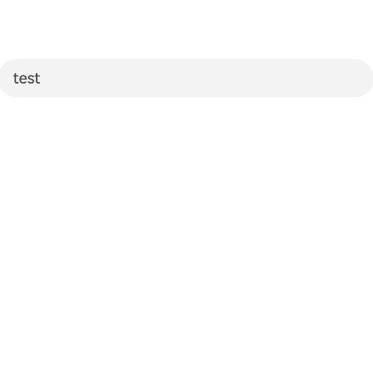
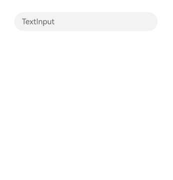

# Soft Keyboard Management
<!--Kit: ArkUI-->
<!--Subsystem: ArkUI-->
<!--Owner: @tzcurtain-->
<!--Designer: @pssea-->
<!--Tester: @jiaoaozihao-->
<!--Adviser: @Brilliantry_Rui-->

The soft keyboard serves as a critical user interaction channel for text input. This topic explains how to control soft keyboard display and hiding when using system input components ([TextInput](../reference/apis-arkui/arkui-ts/ts-basic-components-textinput.md), [TextArea](../reference/apis-arkui/arkui-ts/ts-basic-components-textarea.md), [Search](../reference/apis-arkui/arkui-ts/ts-basic-components-search.md), and [RichEditor](../reference/apis-arkui/arkui-ts/ts-basic-components-richeditor.md)).

## Displaying the Soft Keyboard

By default, the soft keyboard automatically appears when an input component gains focus

through the following methods:

1. Interactive focus: tapping, double-tapping, or long-pressing the input field

2. Programmatic focus: using [requestFocus](../reference/apis-arkui/arkui-ts/ts-universal-attributes-focus.md#requestfocus9) or [defaultFocus](../reference/apis-arkui/arkui-ts/ts-universal-attributes-focus.md#defaultfocus9) APIs

3. External keyboard navigation: pressing **Tab**, **Shift+Tab**, or arrow keys (which shows the physical keyboard toolbar instead of the soft keyboard)

The system distinguishes between system soft keyboards and custom keyboards. The [enableKeyboardOnFocus](../reference/apis-arkui/arkui-ts/ts-basic-components-textarea.md#enablekeyboardonfocus10) attribute affects system keyboard display but not custom keyboards. When **enableKeyboardOnFocus** is set to **false**, the system soft keyboard only appears when focus is acquired through clicking or key press interactions. External physical keyboards suppress system soft keyboards but do not affect custom keyboards.

### Interactive Focus

The following demonstrates soft keyboard behavior during input field tapping, double-tapping, or long-pressing.



### Programmatic Focus

Use focus control methods, such as [defaultFocus](../reference/apis-arkui/arkui-ts/ts-universal-attributes-focus.md#defaultfocus9) and [requestFocus](../reference/apis-arkui/arkui-ts/ts-universal-attributes-focus.md#requestfocus9), to programmatically focus input fields and trigger keyboard display. For details, see [Implementing Focus Support](./arkts-common-events-focus-event.md).

The following example demonstrates transferring focus to a text input field and displaying the soft keyboard when a button is clicked.

```ts
@Entry
@Component
struct demo {
  controller: TextInputController = new TextInputController();
  @State inputValue: string = "";

  build() {
    Column({ space: 20 }) {
      Button('Focus Input Field').onClick(() => {
        this.getUIContext().getFocusController().requestFocus("textInput1")
      })
      TextInput({ controller: this.controller, text: this.inputValue })
        .id("textInput1")
    }
    .height('100%')
    .width('80%')
    .margin('10%')
    .justifyContent(FlexAlign.Center)
  }
}
```


### External Keyboard Navigation

When a physical keyboard is connected, users can use **Tab**, **Shift+Tab**, or arrow keys to navigate focus. When focus moves to a input field, the physical keyboard's floating toolbar appears. For details, see [Focus Traversal Guidelines](./arkts-common-events-focus-event.md#focus-traversal-guidelines).

The following example demonstrates focus navigation with a connected physical keyboard. Repeatedly pressing the **Tab** key cycles focus among the three page components. Focus transitions are visually indicated by the **Text** component's blue border and the **TextInput** component's blinking cursor. When the **TextInput** component gains focus, the cursor appears and the physical keyboard's floating toolbar is displayed.

```ts
@Entry
@Component
struct Index {
  build() {
    Column({ space: 20 }) {
      Text('Text.focusable(true)')
        .focusable(true)

      TextInput({ placeholder: "TextInput" })

      TextInput({ placeholder: "TextInput" })
    }
    .height('100%')
    .width('80%')
    .margin('10%')
    .justifyContent(FlexAlign.Center)
  }
}
```


## Hiding the Soft Keyboard

When a text input field gains focus, the soft keyboard appears. However, the keyboard does not automatically hide when the text input field loses focus. Instead, the keyboard's visibility depends on the next focused component: It remains visible if the new component requires text input, but hides if the component does not need the keyboard. Typically, only text input components require soft keyboard access.

The soft keyboard hides in the following common scenarios when focus moves to components that do not require text input:

1. Tapping the keyboard's close button

2. Dragging selected text

3. Swipe gestures on the text input field

4. Page navigation

5. Calling [TextInputController](../reference/apis-arkui/arkui-ts/ts-basic-components-textinput.md#textinputcontroller8)

6. Moving focus to non-text-input components

### Keyboard Close Button

The soft keyboard provides a close button that users can tap to hide the keyboard.

The following example demonstrates this dismissal scenario:

```ts
@Entry
@Component
struct Index {
  build() {
    Column({ space: 20 }) {
      Blank()
        .height(350)
      Flex({ direction: FlexDirection.Row }) {
        TextInput({ placeholder: 'TextInput' })
      }
      .width(250)
    }
    .height('100%')
    .width('90%')
    .padding('5%')
  }
}
```


### Text Dragging

Dragging selected text in the text input field automatically hides the keyboard. For details, see [Implementing Unified Drag and Drop](./arkts-common-events-drag-event.md).

The following example demonstrates keyboard dismissal during text dragging operations:

```ts
@Entry
@Component
struct Index {
  build() {
    Column({ space: 20 }) {
      Blank()
        .height(350)
      Flex({ direction: FlexDirection.Row }) {
        TextInput({ text: 'Drag this text to hide keyboard' })
          .selectAll(true)
          .defaultFocus(true)
      }
      .width(250)
    }
    .height('100%')
    .width('90%')
    .padding('5%')
  }
}
```


### Swipe Gestures

Swipe gestures hide the soft keyboard. The figure below demonstrates this dismissal scenario.


### Page Navigation

Navigating away from the text input pages hides the keyboard.

For details about the page navigation syntax, see [Component Navigation (Navigation) (Recommended)](./arkts-navigation-navigation.md).

Source page:

```ts
// Index.ets
@Entry
@Component
struct Index {
  // Create a navigation controller object and pass it to the Navigation component.
  pathStack: NavPathStack = new NavPathStack()

  build() {
    Navigation(this.pathStack) {
      Column({ space: 30 }) {
        Blank().height(150)
        TextInput({ placeholder: 'TextInput' })
        Button('Navigate to Next Page')
          .onClick(() => {
            this.pathStack.pushPath({ name: 'demo_text_1' })
          })
      }
      .height('100%')
      .width('80%')
      .margin('10%')
    }
    .title('Page Navigation Example')
  }
}
```

Destination page:

```ts
// demo_text_1.ets
@Builder
export function demo_text_1_Builder() {
  demo_text_1()
}

@Component
struct demo_text_1 {
  pathStack: NavPathStack = new NavPathStack()
  // Destination page
  build() {
    NavDestination() {
      Column({ space: 20 }) {
        Text('This page contains no keyboard-requiring components')
      }
      .width('100%')
      .height('100%')
      .justifyContent(FlexAlign.Center)
    }
    .onReady((context: NavDestinationContext) => {
      this.pathStack = context.pathStack
    })
  }
}
```

Route configuration:

Add the route table configuration to the **module.json5** file of the redirection target module.
```json
{
  "module": {
    //...
    "routerMap": "$profile:route_map",
    //...
  }
}

```

Create the **route_map.json** file in the **resources/base/profile** directory of the project. Add the following configuration information:

```json
// route_map.json
{
  "routerMap": [
    {
      "name": "demo_text_1",
      "pageSourceFile": "src/main/ets/pages/demo_text_1.ets",
      "buildFunction": "demo_text_1_Builder"
    }
  ]
}
```


### Controller-Based Dismissal

You can use [TextInputController](../reference/apis-arkui/arkui-ts/ts-basic-components-textinput.md#textinputcontroller8) to call [stopEditing](../reference/apis-arkui/arkui-ts/ts-basic-components-textinput.md#stopediting10) to programmatically hide the keyboard.

The following example shows how to hide the soft keyboard using the [TextInputController](../reference/apis-arkui/arkui-ts/ts-basic-components-textinput.md#textinputcontroller8).

```ts
@Entry
@Component
struct demo {
  controller: TextInputController = new TextInputController();
  @State inputValue: string = "";

  build() {
    Column({ space: 30 }) {
      Button('Dismiss Keyboard').onClick(() => {
        this.controller.stopEditing()
      })
      TextInput({ controller: this.controller, text: this.inputValue })
    }
    .width('80%')
    .height('100%')
    .margin('10%')
    .justifyContent(FlexAlign.Center)
  }
}
```


### Focus Transfer

Moving focus to non-input components automatically hides the soft keyboard.

Focus transfer can be controlled programmatically using [requestFocus](../reference/apis-arkui/arkui-ts/ts-universal-attributes-focus.md#requestfocus9) and [clearFocus](../reference/apis-arkui/arkts-apis-uicontext-focuscontroller.md#clearfocus12). For details, see [Implementing Focus Support](./arkts-common-events-focus-event.md).

Compared with using text input controllers to exit edit mode, focus transfer offers better scalability for pages with multiple input fields, eliminating the need for configuring individual controllers for each text input.

The following example demonstrates keyboard dismissal by transferring focus to a button using [requestFocus](../reference/apis-arkui/arkui-ts/ts-universal-attributes-focus.md#requestfocus9):
``` ts
@Entry
@Component
struct TextInputExample {
  controller: TextInputController = new TextInputController();
  @State inputValue: string = "";

  build() {
    Column({ space: 20 }) {
      Button('change focus').onClick(() => {
        this.getUIContext().getFocusController().requestFocus("button")
      }).id("button")
      TextInput({ controller: this.controller, text: this.inputValue })
    }
    .justifyContent(FlexAlign.Center)
    .height('100%')
    .width('80%')
    .margin('10%')
  }
}
```


The following example demonstrates automatic soft keyboard dismissal when scrolling begins. As the scroll container [List](../reference/apis-arkui/arkui-ts/ts-container-list.md) starts scrolling, the [clearFocus](../reference/apis-arkui/arkts-apis-uicontext-focuscontroller.md#clearfocus12) API clears current focus, transferring it to the page's root container node. Since root containers do not require soft keyboard input, the keyboard automatically hides.

```ts
@Entry
@Component
struct Index {
  private arr: number[] = Array.from<number, number>(
    { length: 100 } as ArrayLike<number>,
    (_, i: number) => i + 1
  );

  build() {
    Column() {
      List({ space: 20, initialIndex: 0 }) {
        ForEach(this.arr, (item: number, index?: number) => {
          ListItem() {
            Flex({ direction: FlexDirection.Row, alignItems: ItemAlign.Center }) {
              TextInput({ placeholder: 'TextInput ' + item })
            }
          }
        }, (item: string) => item)
      }
      .onScrollStart(() => {
        // Clear current focus when the List component starts to scroll.
        this.getUIContext().getFocusController().clearFocus()
      })
      .width('80%')
      .height('80%')
      .margin('10%')
    }
    .justifyContent(FlexAlign.Center)
  }
}
```


## FAQs

You may encounter specific scenarios or customization requirements when working with soft keyboards. This section addresses common challenges to help you better manage keyboard behavior.

### Preventing Soft Keyboard Display When the Text Input Field Gains Focus

**Question**

How do I prevent the soft keyboard from appearing when tapping a text input field?

**Analysis**

By default, tapping a text input field triggers focus acquisition and automatically displays the system soft keyboard. However, when a custom keyboard is configured using [customKeyboard](../reference/apis-arkui/arkui-ts/ts-basic-components-textinput.md#customkeyboard10), the system keyboard is suppressed and the custom keyboard appears instead.

**Answer**

Configure an empty custom keyboard to prevent any keyboard display while maintaining the input field focus.

The sample code is as follows:
``` ts
@Entry
@Component
struct demo {
  controller: TextInputController = new TextInputController();
  @State inputValue: string = "";

  // Create a custom keyboard component.
  @Builder
  CustomKeyboardBuilder() {
    Column() {
    }
  }

  build() {
    Column() {
      TextInput({ placeholder: 'TextInput', controller: this.controller, text: this.inputValue })// Bind a custom keyboard.
        .customKeyboard(this.CustomKeyboardBuilder())
    }
    .justifyContent(FlexAlign.Center)
    .width('80%')
    .margin('10%')
    .height('100%')
  }
}
```



### Maintaining the Keyboard After the Send Action

**Question**

How do I keep the keyboard visible after the send button is tapped?

**Analysis**

The [enterKeyType](../reference/apis-arkui/arkui-ts/ts-basic-components-textarea.md#enterkeytype11) attribute configures the Enter key style, including send variants. Tapping the Enter key typically causes input fields to lose focus and dismiss the keyboard on non-TV devices.

**Answer**

Configure [enterKeyType](../reference/apis-arkui/arkui-ts/ts-basic-components-textarea.md#enterkeytype11) for the soft keyboard based on your needs. When **enterKeyType** is set to any value except **EnterKeyType.NEW_LINE**, the [onSubmit](../reference/apis-arkui/arkui-ts/ts-basic-components-textarea.md#onsubmit14) event triggers on return key press. In the **onSubmit** callback of **TextArea**, call [keepEditableState](../reference/apis-arkui/arkui-ts/ts-basic-components-textinput.md#keepeditablestate11) to maintain the edit state and keyboard visibility.

The following example demonstrates a send-style Enter key that maintains keyboard visibility after being tapped:

```ts
@Entry
@Component
struct demo {
  build() {
    Column({ space: 20 }) {
      TextArea({ placeholder: 'The keyboard dismisses after the send key is tapped' })
        .enterKeyType(EnterKeyType.Send)

      TextArea({ placeholder: 'The keyboard persists after the send key is tapped' })
        .enterKeyType(EnterKeyType.Send)
        .onSubmit((enterKey: EnterKeyType, event: SubmitEvent) => {
          // Call keepEditableState to maintain the edit state of the text input field.
          event.keepEditableState();
        })
    }
    .justifyContent(FlexAlign.Center)
    .height('100%')
    .width('80%')
    .margin('10%')
  }
}
```


