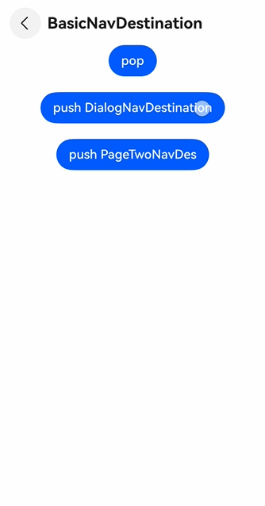
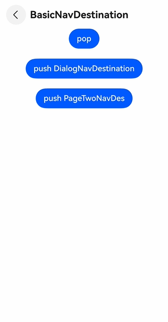
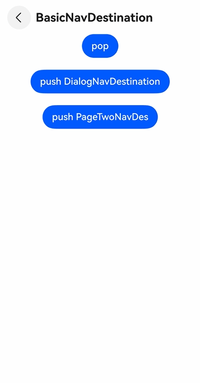

# Navigation Animation FAQs
<!--Kit: ArkUI-->
<!--Subsystem: ArkUI-->
<!--Owner: @mayaolll-->
<!--Designer: @jiangdayuan-->
<!--Tester: @lxl007-->
<!--Adviser: @Brilliantry_Rui-->

## Dialog-Type NavDestination Animation Is Not Smooth

**Symptom**

During use of the default transition for **NavDestinationMode.DIALOG**, the following issues occur:

- If a mask background color is set for the page, the mask does not disappear immediately when the page is popped; it persists until the content has fully slid out.

  

- If the mask color is applied directly to the content area, the mask exits from top to bottom.

  

Expected behavior: The mask should fade out while the content area slides down.

**Solution**

Explicitly control the background color animation in the **onWillAppear** and **onWillDisappear** lifecycle callbacks. Example:

<!-- @[DialogNavDesAnimation](https://gitcode.com/openharmony/applications_app_samples/blob/master/code/DocsSample/ArkUISample/NavigationSample/entry/src/main/ets/pages/navigation/animation/DialogNavDestination.ets) -->

``` TypeScript
@Builder
export function DialogNavDestinationBuilder() {
  DialogNavDestination();
}

@Component
export struct DialogNavDestination {
  stack: NavPathStack = AppStorage.get<NavPathStack>('basicNavigationStack')!;
  @State backColor: ResourceColor = '#0000000';

  build() {
    NavDestination() {
      Stack() {
        Text('Dialog')
          .fontSize(44)
          .backgroundColor(Color.White)
      }
      .width('100%')
      .height('100%')
    }
    .hideTitleBar(true)
    .backgroundColor(this.backColor)
    .mode(NavDestinationMode.DIALOG)
    .onWillAppear(() => {
      // Fade in the mask.
      this.getUIContext().animateTo({ duration:450 }, () => {
        this.backColor = '#66000000';
      });
    })
    .onWillDisappear(() => {
      // Fade out the mask.
      this.getUIContext().animateTo({ duration: 450 }, () => {
        this.backColor = '#00000000';
      });
    })
  }
}
```

  

## Router and Navigation Animation Conflict

**Symptom**

When a router jump navigates to a navigation page, and the page immediately pushes a **NavDestination** in its **aboutToAppear** callback, the page entrance animation and the **NavDestination** push animation play simultaneously, resulting in a poor visual experience.

**Solution**

Disable the push animation in the **aboutToAppear** callback.

<!-- @[NavigationAnimation](https://gitcode.com/openharmony/applications_app_samples/blob/master/code/DocsSample/ArkUISample/NavigationSample/entry/src/main/ets/pages/navigation/animation/NavigationPage.ets) -->

``` TypeScript
@Entry
@Component
struct NavigationPage {
  navStack: NavPathStack = new NavPathStack();

  aboutToAppear(): void {
    AppStorage.setOrCreate<NavPathStack>('basicNavigationStack', this.navStack);
    this.navStack.pushPath({ name: 'animation-BasicNavDestination' }, false); // Disable animation for the push operation.
  }

  build() {
    Navigation(this.navStack) {
      // ...
    }
  }
}
```

## Pop Animation Plays When pop and push Are Performed Together

**Symptom**

When the top page is popped and another page is pushed immediately afterward, the pop animation of the removed page is displayed instead of the push animation of the new page.

<!-- @[PopAndPush-Normal](https://gitcode.com/openharmony/applications_app_samples/blob/master/code/DocsSample/ArkUISample/NavigationSample/entry/src/main/ets/pages/navigation/animation/PageTwoNavDes.ets) -->

``` TypeScript
this.stack.pop();
this.stack.pushPath({ name: 'animation-BasicNavDestination' });
```

**Solution**

**Navigation** calculates the final stack state after all operations and executes only one animation per transition.

The animation type is determined by the top page before the operation: If that page is no longer in the stack afterward, a pop animation is played. If that page remains in the stack, a push animation is played.

In the example above, the original top page is removed, so the pop animation is triggered.

To remove one page and push another while displaying a push animation, set the new page's launch mode to **NEW_INSTANCE**.

<!-- @[PopAndPush-NEW_INSTANCE](https://gitcode.com/openharmony/applications_app_samples/blob/master/code/DocsSample/ArkUISample/NavigationSample/entry/src/main/ets/pages/navigation/animation/PageTwoNavDes.ets) -->

``` TypeScript
this.stack.pop();
this.stack.pushPath({ name: 'animation-BasicNavDestination' }, { launchMode: LaunchMode.NEW_INSTANCE });
```

## Is There an End Callback for the Default Transition Animation?

The system does not provide an end callback for the default transition animation. Only [custom transition animations](./arkts-navigation-animation.md#defining-a-custom-transition) support an end callback. Related APIs: [NavDestinationTransition](../reference/apis-arkui/arkui-ts/ts-basic-components-navdestination.md#navdestinationtransition15) and [NavigationAnimatedTransition](../reference/apis-arkui/arkui-ts/ts-basic-components-navigation.md#navigationanimatedtransition11).

## Are There Different Pre-Built System Transition Types?

Yes. Use the [NavDestination.systemTransition](../reference/apis-arkui/arkui-ts/ts-basic-components-navdestination.md#systemtransition14) API, which provides a set of predefined animation type enumerations.

## How Do I Implement a Shared Element Transition Between Navigation and NavDestination Components?

Shared element transitions are only supported between **NavDestination** pages; transitions between the **NavBar** and a **NavDestination** do not support shared element transitions.

To implement a shared element transition in **Navigation**, use the [geometryTransition](../reference/apis-arkui/arkui-ts/ts-transition-animation-geometrytransition.md) API and pay attention to the following:

- [Disable transitions](./arkts-navigation-animation.md#disabling-transitions).
- Execute navigation operations inside an [animateTo](../reference/apis-arkui/arkts-apis-uicontext-uicontext.md#animateto) closure.
- Apply [geometryTransition](../reference/apis-arkui/arkui-ts/ts-transition-animation-geometrytransition.md) to the content components, not to the **NavDestination** itself.

For details, see [Shared Element Transition](./arkts-navigation-animation.md#shared-element-transition).

## Navigation Animation Becomes Abnormal After zIndex Is Set on NavDestination

The [zIndex](../reference/apis-arkui/arkui-ts/ts-universal-attributes-z-order.md#zindex) attribute modifies a component's display layer. Setting it on the **NavDestination** component overrides the system-managed layering and may break transition animations. As such, avoid setting **zIndex** directly on **NavDestination**.

Similarly, avoid setting the following attributes directly on **NavDestination** (they may conflict with system animations): [transition](../reference/apis-arkui/arkui-ts/ts-transition-animation-component.md#transition), [geometryTransition](../reference/apis-arkui/arkui-ts/ts-transition-animation-geometrytransition.md), [sharedTransition](../reference/apis-arkui/arkui-ts/ts-transition-animation-shared-elements.md#sharedtransition), and [animation](../reference/apis-arkui/arkui-ts/ts-animatorproperty.md). If these effects are required for your design, apply the attributes to the content nodes inside the **NavDestination** component instead.

## What Is the Default Transition Animation Duration for NavDestination?

The default transition uses a [spring curve](./arkts-spring-curve.md). Its duration depends on the curve's physical parameters and may vary across devices. Therefore, the default animation duration is not controllable. Avoid couple the default duration with service logic. To listen for animation completion, implement a [custom transition](./arkts-navigation-animation.md#defining-a-custom-transition).
