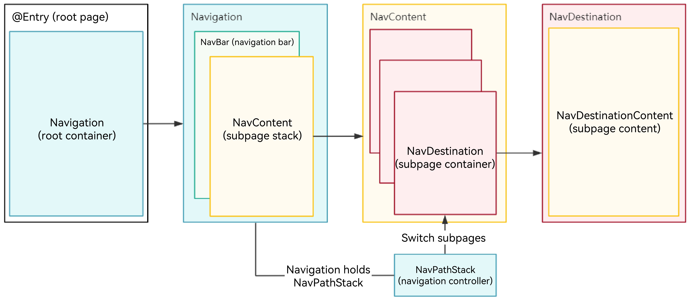
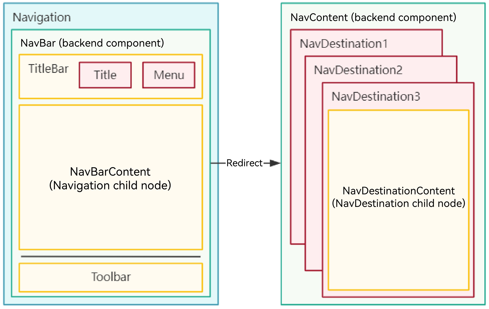
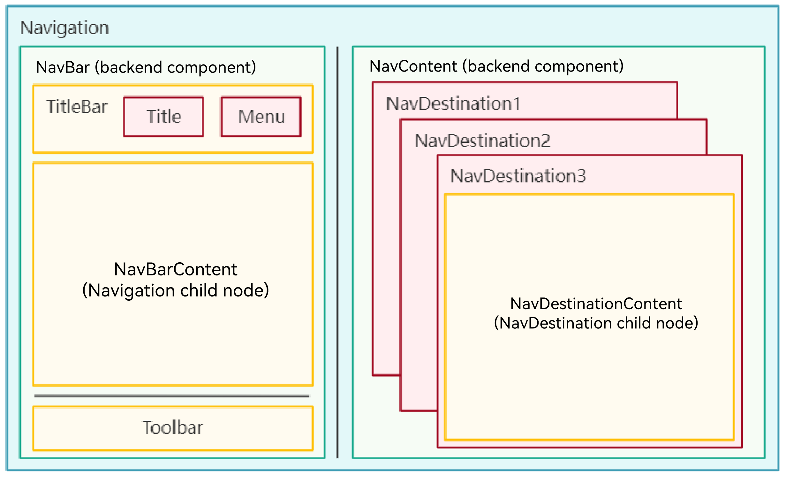
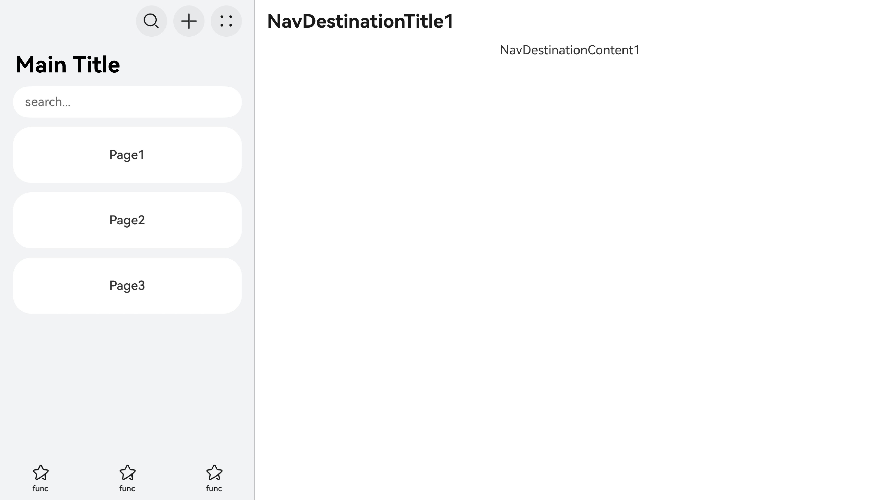

# Introduction to Navigation Architecture
<!--Kit: ArkUI-->
<!--Subsystem: ArkUI-->
<!--Owner: @mayaolll-->
<!--Designer: @jiangdayuan-->
<!--Tester: @Giacinta-->
<!--Adviser: @Brilliantry_Rui-->

The navigation component ([Navigation](../reference/apis-arkui/arkui-ts/ts-basic-components-navigation.md)) is used to implement redirection between [NavDestination](../reference/apis-arkui/arkui-ts/ts-basic-components-navdestination.md) pages, pass parameters between different **NavDestination**s, and provide flexible redirection stack operations to facilitate access to and reuse of different pages.

## Overall Architecture

The navigation component structure is complex and contains the following key concepts:

- [Navigation](../reference/apis-arkui/arkui-ts/ts-basic-components-navigation.md): root view container of navigation. All navigation pages are wrapped by this container and can be displayed in split-column mode. Generally, this component is used as the global root container.
- [NavDestination](../reference/apis-arkui/arkui-ts/ts-basic-components-navdestination.md): subpage container. All page routing operations of navigation are performed on **NavDestination**, including the following areas:
  - [Title bar](#title-bar): located at the top of **NavDestination**, including the back button and title. The system provides the default style and supports customization.
  - [Menu bar](#menu-bar): located at the top of **NavDestination**. The system provides the default style and supports customization.
  - Content area: child component of **NavDestination**. The content is user-defined.
  - [Toolbar](#toolbar): located at the bottom of **NavDestination**. The system provides the default style and supports customization.
- [NavBar](#navbar-navigation-bar): navigation bar, also called the main page, which contains the following:
  - [Title bar](#title-bar): located at the top of **NavBar**, including the back button and title. The system provides the default style and supports customization.
  - [Menu bar](#menu-bar): located at the top of **NavBar**. The system provides the default style and supports customization.
  - Content area: located in the center of **NavBar**. The content is user-defined.
  - [Toolbar](#toolbar): located at the bottom of **NavBar**. The system provides the default style and supports customization.
- [NavPathStack](../reference/apis-arkui/arkui-ts/ts-basic-components-navigation.md#navpathstack10): navigation controller, which is used to manage the **NavDestination** page stack. It encapsulates various APIs for controlling page redirection and can be inherited and rewritten. It must be used together with **Navigation**.

**Figure 1** Overall Navigation architecture



In addition, **Navigation** provides the following layout modes:

- Single-column mode

  When the width of the **Navigation** container is less than 600 vp, the single-column mode is recommended. In this mode, when route navigation occurs, the entire page is replaced.

  **Figure 2** Single-column mode

  

  

- Split-column mode

  When the width of the **Navigation** container is greater than or equal to 600 vp, the split-column mode is recommended. In this mode, **Navigation** is divided into two parts: navigation bar (**NavBar**) on the left and subpage (**NavDestination**) on the right. During route navigation, only the right subpage is replaced.

  **Figure 3** Split-column mode

  

  

## Navigation (Navigation Container)

**Navigation** is the root view container of the route navigation. It is usually used as the root container of a page (custom component decorated by @Entry, defined as a router page) for global navigation. **Navigation** supports three display modes: Stack (single-column), Split (multi-column), and Auto (adaptive). In Auto mode, the display mode is automatically switched between Stack and Split based on the width of the **Navigation** component.

**Navigation** can be used only to carry route-related features, such as binding the navigation controller object, route switching, split-column display, and custom transition animation control, instead of being used as a display container.

**Navigation** consists of the navigation bar (**NavBar**) and subpage (**NavDestination**). The latter is managed in the stack structure and exists in **NavPathStack**. The navigation bar (**Navbar**) is a child component of **Navigation** and is directly mounted to it. You can hide the navigation bar by setting the [hideNavBar](../reference/apis-arkui/arkui-ts/ts-basic-components-navigation.md#hidenavbar9) attribute (recommended for single-column applications). The navigation bar does not exist in the page stack.

A child page is a subtree with **NavDestination** as the root node. It is constructed through [@Builder](./state-management/arkts-builder.md) and then mounted to **Navigation** for display through the stack operation methods provided by **NavPathStack**. For details, see [Subpage](./arkts-navigation-navdestination.md).

## NavDestination (Subpage Container)

**NavDestination** is the root container of the **Navigation** subpage. Each subpage must be wrapped in a **NavDestination**. The subpage is mounted to **Navigation** for display or deleted through the stack operation methods (such as **push** and **pop**) provided by **NavPathStack**.

As the root container of a subpage, **NavDestination** supports universal attributes of common components and page-related attributes, such as the [page lifecycle](../reference/apis-arkui/arkui-ts/ts-basic-components-navdestination.md#events), [toolbar](../reference/apis-arkui/arkui-ts/ts-basic-components-navdestination.md#toolbarconfiguration13), [title bar](../reference/apis-arkui/arkui-ts/ts-basic-components-navdestination.md#title), [menu bar](../reference/apis-arkui/arkui-ts/ts-basic-components-navdestination.md#menus12), [custom page transition animation](../reference/apis-arkui/arkui-ts/ts-basic-components-navdestination.md#customtransition15), and page-level window attribute control (including landscape/portrait mode, system status bar, and system navigation bar).

## NavBar (Navigation Bar)

The child node directly loaded in **Navigation** is called a navigation bar (**NavBar**). When the **NavBar** is displayed in single-column mode, it is the home page of the entire navigation. When the **NavBar** is displayed in split-column mode, it is a fixed navigation bar. By default, the navigation bar is displayed on the left. You can also use the [navBarPosition](../reference/apis-arkui/arkui-ts/ts-basic-components-navigation.md#navbarposition9) attribute to control the navigation bar.

You can use [hideNavBar](../reference/apis-arkui/arkui-ts/ts-basic-components-navigation.md#hidenavbar9) to control the display of the navigation bar, and use the [navBarWidth](../reference/apis-arkui/arkui-ts/ts-basic-components-navigation.md#navbarwidth9) attribute to control the width of the navigation bar in dual-column display. The navigation bar does not belong to the page stack and does not have the page lifecycle. Therefore, it cannot be controlled by the methods of **NavPathStack**. You can use [onNavBarStateChange](../reference/apis-arkui/arkui-ts/ts-basic-components-navigation.md#onnavbarstatechange9) to detect the display of the navigation bar, use the [mode](../reference/apis-arkui/arkui-ts/ts-basic-components-navigation.md#mode9) attribute to control the switching between single-column and dual-column displays, and use [onNavigationModeChange](../reference/apis-arkui/arkui-ts/ts-basic-components-navigation.md#onnavigationmodechange11) to detect the switching between single-column and dual-column displays.

The content area of the navigation bar can be specified in either of the following ways:

 - Method 1: Directly specify the child node of **Navigation**.

  <!-- @[NavigationDemo](https://gitcode.com/openharmony/applications_app_samples/blob/master/code/DocsSample/ArkUISample/NavigationSample/entry/src/main/ets/pages/navigation/template1/NavigationExample.ets) -->

  ``` TypeScript
  @Entry
  @Component
  struct NavigationDemo {
    @Provide('navPathStack') navPathStack: NavPathStack = new NavPathStack();
    private listArray: Array<string> = ['WLAN', 'Bluetooth', 'Personal Hotspot', 'Connect & Share'];
    context = this.getUIContext().getHostContext();
    build() {
      Column() {
        Navigation(this.navPathStack) {
          // Replace $r('app.string.enterKeyWordsToSearch') with the actual resource file. In this example, the value in the resource file is "Search by keyword."
          TextInput({ placeholder: $r('app.string.enterKeyWordsToSearch') })
            .width('90%')
            .height(40)
            .margin({ bottom: 10 })
  
          // Define the level-1 navigation view through List.
          List({ space: 12, initialIndex: 0 }) {
            ForEach(this.listArray, (item: string) => {
              ListItem() {
                Row() {
                  Row() {
                    Text(`${item.slice(0, 1)}`)
                      .fontColor(Color.White)
                      .fontSize(14)
                      .fontWeight(FontWeight.Bold)
                  }
                  .width(30)
                  .height(30)
                  .backgroundColor('#a8a8a8')
                  .margin({ right: 20 })
                  .borderRadius(20)
                  .justifyContent(FlexAlign.Center)
  
                  Column() {
                    Text(item)
                      .fontSize(16)
                      .margin({ bottom: 5 })
                  }
                  .alignItems(HorizontalAlign.Start)
  
                  Blank()
  
                  Row()
                    .width(12)
                    .height(12)
                    .margin({ right: 15 })
                    .border({
                      width: { top: 2, right: 2 },
                      color: 0xcccccc
                    })
                    .rotate({ angle: 45 })
                }
                .borderRadius(15)
                .shadow({ radius: 100, color: '#ededed' })
                .width('90%')
                .alignItems(VerticalAlign.Center)
                .padding({ left: 15, top: 15, bottom: 15 })
                .backgroundColor(Color.White)
              }
              .width('100%')
              .onClick(() => {
                // Replace $r('app.string.detailsPageParameters') with the string resource file you use. The value in the resource file is "Details page parameters."
                this.navPathStack.pushPathByName(`${item}`,
                  // Push the navigation destination page specified by name, with the data specified by param, to the navigation stack.
                  this.context!.resourceManager.getStringSync($r('app.string.detailsPageParameters').id));
              })
            }, (item: string): string => item)
          }
          .listDirection(Axis.Vertical)
          .edgeEffect(EdgeEffect.Spring)
          .sticky(StickyStyle.Header)
          .chainAnimation(false)
          .width('100%')
        }
        .width('100%')
        .mode(NavigationMode.Auto)
        // Replace $r('app.string.settings') with the string resource file you use. The value in the resource file is "Settings."
        .title($r('app.string.settings')) // Set the title text.
      }
      .size({ width: '100%', height: '100%' })
      .backgroundColor(0xf4f4f5)
    }
  }
  ```

 - Method 2: Since API version 20, specify a NavDestination component as the [navigation page (home page)](../reference/apis-arkui/arkui-ts/ts-basic-components-navigation.md#navigation20). This method requires a routing table. For details, see [Routing Table Capability Comparison](./arkts-navigation-cross-package.md#routing-table-capability-comparison).

## NavPathStack (Navigation Controller)

The subpage stack of **Navigation** is stored in **NavPathStack**. Each **Navigation** needs to be bound to a **NavPathStack** object, which is used to control the switching between all subpages in **Navigation**. **NavPathStack** provides many basic route switching methods, such as [pushPath](../reference/apis-arkui/arkui-ts/ts-basic-components-navigation.md#pushpath10), [pop](../reference/apis-arkui/arkui-ts/ts-basic-components-navigation.md#pop10) and [replacePath](../reference/apis-arkui/arkui-ts/ts-basic-components-navigation.md#replacepath11), as well as capabilities such as route interception, transition animation control, and route stack information obtaining.

**NavPathStack** also allows you to inherit and overwrite related route operation methods. **NavPathStack** corresponds to **Navigation** one by one. You can obtain **NavPathStack** through the [onReady](../reference/apis-arkui/arkui-ts/ts-basic-components-navdestination.md#onready11) callback of **NavDestination** on each subpage, or maintain a singleton **NavPathStack** globally and obtain and execute routing operations anywhere. (Note that the page switching animation and layout can take effect only in the UI thread and depend on the VSync signal.)

## Title Bar

The title bar is at the top of the page and displays the page name and operation entries. The **Navigation** component uses the [title](../reference/apis-arkui/arkui-ts/ts-basic-components-navigation.md#title) attribute to set the title content and the [titleMode](../reference/apis-arkui/arkui-ts/ts-basic-components-navigation.md#titlemode) attribute to set the title bar mode. The **NavDestination** component also supports the [title](../reference/apis-arkui/arkui-ts/ts-basic-components-navdestination.md#title) attribute to set the title content.

> **NOTE**
>
> If the **Navigation** component does not set attributes such as [title](../reference/apis-arkui/arkui-ts/ts-basic-components-navigation.md#title), [titleMode](../reference/apis-arkui/arkui-ts/ts-basic-components-navigation.md#titlemode), and [menus](../reference/apis-arkui/arkui-ts/ts-basic-components-navigation.md#menus), the back button is not displayed even if [hideBackButton](../reference/apis-arkui/arkui-ts/ts-basic-components-navigation.md#hidebackbutton) is set to **false**.

- Mini mode

  Applicable when the title of a level-1 page does not need to be highlighted.

  **Figure 4** Title bar in Mini mode

  

  <!-- @[NavigationTitleModeMini](https://gitcode.com/openharmony/applications_app_samples/blob/master/code/DocsSample/ArkUISample/NavigationSample/entry/src/main/ets/pages/navigation/template1/TitleModeMini.ets) -->
  
  ``` TypeScript
  Navigation() {
    // ...
  }
  .titleMode(NavigationTitleMode.Mini)
  ```

- Full mode

  Applicable when the title of a level-1 page needs to be highlighted.

  **Figure 5** Title bar in Full mode

  

  <!-- @[NavigationTitleModeFUll](https://gitcode.com/openharmony/applications_app_samples/blob/master/code/DocsSample/ArkUISample/NavigationSample/entry/src/main/ets/pages/navigation/template1/TitleModeFull.ets) -->
  
  ``` TypeScript
  Navigation() {
    // ...
  }
  .titleMode(NavigationTitleMode.Full)
  ```

## Menu Bar

The menu bar is located at the top of the component. You can set the menu bar of **Navigation** using the [menus](../reference/apis-arkui/arkui-ts/ts-basic-components-navigation.md#menus) attribute, which supports two parameter types: Array&lt;[NavigationMenuItem](../reference/apis-arkui/arkui-ts/ts-basic-components-navigation.md#navigationmenuitem)&gt; and [CustomBuilder](../reference/apis-arkui/arkui-ts/ts-types.md#custombuilder8). When the Array&lt;[NavigationMenuItem](../reference/apis-arkui/arkui-ts/ts-basic-components-navigation.md#navigationmenuitem)&gt; type is used, a maximum of three icons can be displayed in portrait mode, and a maximum of five icons can be displayed in landscape mode. The extra icons are placed in the automatically generated **More** menu. **NavDestination** also supports the [menus](../reference/apis-arkui/arkui-ts/ts-basic-components-navdestination.md#menus12) attribute to set the menu bar.

**Figure 6** Menu bar with three icons


   <!-- @[NavigationMenuThreeImage](https://gitcode.com/openharmony/applications_app_samples/blob/master/code/DocsSample/ArkUISample/NavigationSample/entry/src/main/ets/pages/navigation/template1/MenusThreeImage.ets) -->

   ``` TypeScript
   let menuItem: NavigationMenuItem  = {
     'value': 'func',
     'icon': 'ets/pages/navigation/template1/image/ic_public_add.svg',
     'action': () => {}
   };
   // ...
         Navigation(this.navPathStack) {
           // ...
         }
         .menus([menuItem, menuItem, menuItem])
   ```

You can also reference images in the **resources** folder.

   <!-- @[NavigationMenuThreeResource](https://gitcode.com/openharmony/applications_app_samples/blob/master/code/DocsSample/ArkUISample/NavigationSample/entry/src/main/ets/pages/navigation/template1/MenusThreeResource.ets) -->

   ``` TypeScript
   let menuItem: NavigationMenuItem  = {
     'value': 'func',
     'icon': 'resources/base/media/ic_public_add.svg',
     'action': () => {}
   };
   // ...
         Navigation(this.navPathStack) {
           // ...
         }
         .menus([menuItem, menuItem, menuItem])
   ```

**Figure 7** Menu bar with four icons


In portrait mode, a maximum of three buttons can be displayed on the menu bar. If there are more than three buttons, the additional buttons are collapsed.

   <!-- @[NavigationMenuFour](https://gitcode.com/openharmony/applications_app_samples/blob/master/code/DocsSample/ArkUISample/NavigationSample/entry/src/main/ets/pages/navigation/template1/MenusFour.ets) -->

   ``` TypeScript
   let menuItem: NavigationMenuItem  = {
     'value': 'func',
     'icon': 'ets/pages/navigation/template1/image/ic_public_add.svg',
     'action': () => {}
   };
   // ...
         Navigation(this.navPathStack) {
           // ...
         }
         // In portrait mode, the menu bar shows a maximum of three icons, with any additional icons placed under an automatically generated More icon.
         .menus([menuItem, menuItem, menuItem, menuItem])
   ```

## Toolbar

The toolbar is located at the bottom of the component. You can set the toolbar of **Navigation** using the [toolbarConfiguration](../reference/apis-arkui/arkui-ts/ts-basic-components-navigation.md#toolbarconfiguration10) attribute. Similarly, you can use this attribute to set the toolbar of **NavDestination**.

  **Figure 8** Toolbar


   <!-- @[ToolBar](https://gitcode.com/openharmony/applications_app_samples/blob/master/code/DocsSample/ArkUISample/NavigationSample/entry/src/main/ets/pages/navigation/template1/ToolBar.ets) -->

   ``` TypeScript
   let toolTmp: ToolbarItem = {
     'value': 'func',
     'icon': 'ets/pages/navigation/template1/image/ic_public_highlights.svg',
     'action': () => {}
   };
   let toolBar: ToolbarItem[] = [toolTmp,toolTmp,toolTmp];
   // ...
         Navigation(this.navPathStack) {
           // ...
         }
         .toolbarConfiguration(toolBar)
   ```

