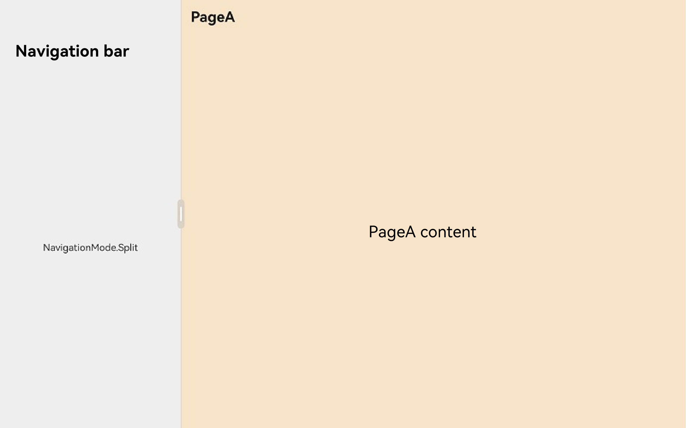
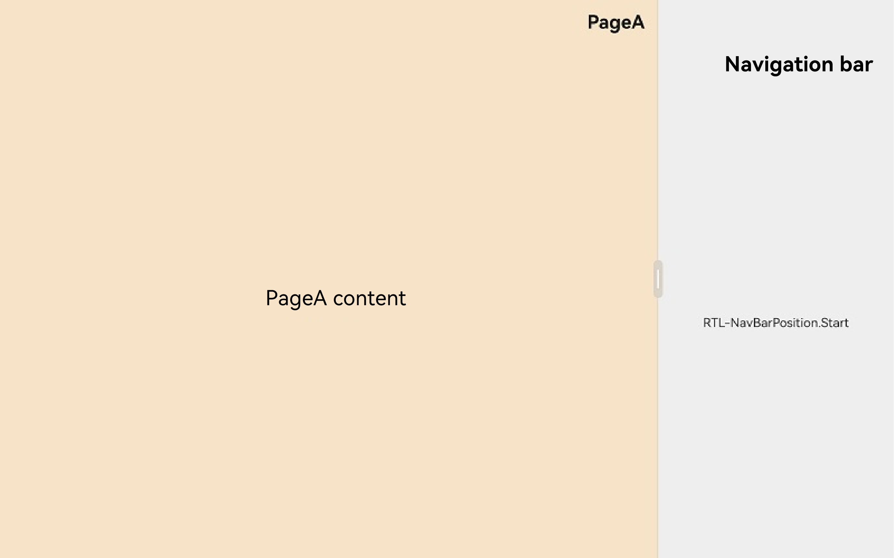
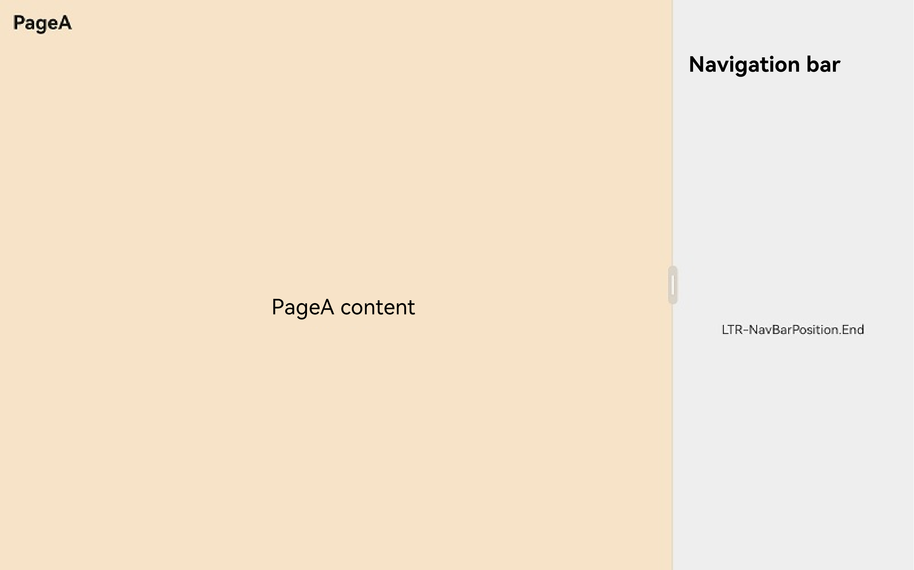
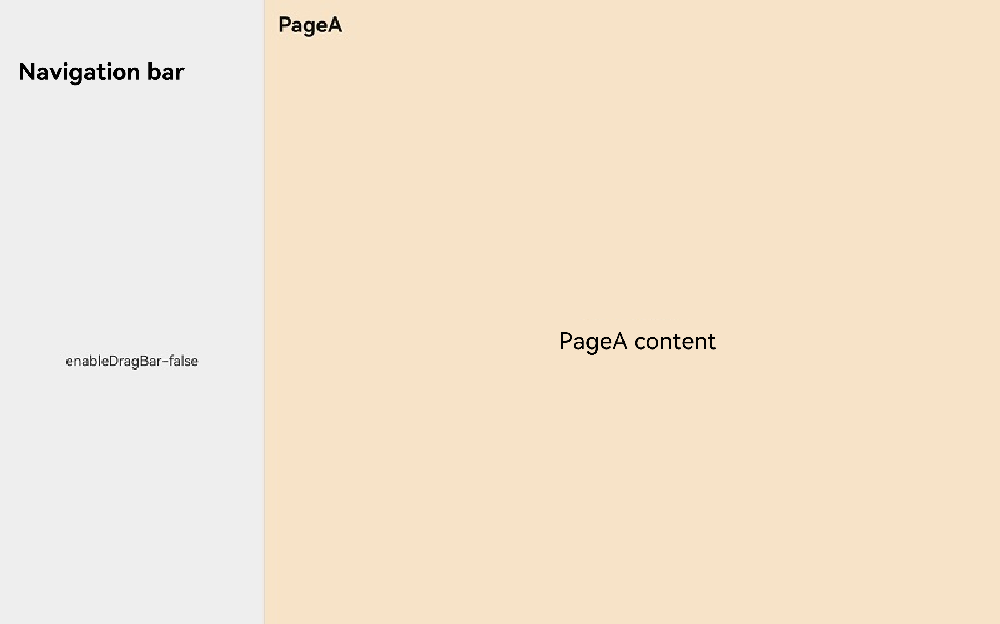
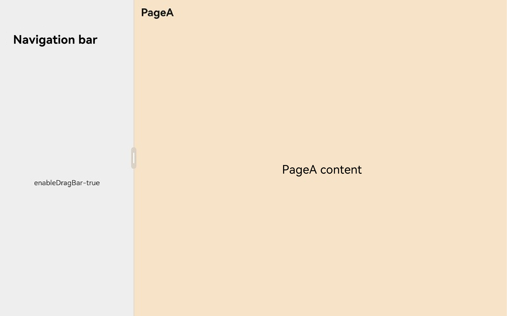

# Split-Column Layout
<!--Kit: ArkUI-->
<!--Subsystem: ArkUI-->
<!--Owner: @mayaolll-->
<!--Designer: @jiangdayuan-->
<!--Tester: @Giacinta-->
<!--Adviser: @Brilliantry_Rui-->

[Navigation](https://developer.huawei.com/consumer/en/doc/harmonyos-references/ts-basic-components-navigation) is a container component that provides two layout styles: single-column layout and split-column layout. The split-column layout is applicable to wide-screen devices. In this layout, the navigation bar (**navBar**) is always displayed, and the subpage (**NavDestination**) is displayed through the navigation controller (**NavPathStack**). A divider line is displayed between the navigation bar and the subpage. You can drag the divider line to control the display ratio of the left and right sides. For details about the architecture, see [Navigation Architecture](./arkts-navigation-architecture.md).

## Available APIs

### mode

The [mode](../reference/apis-arkui/arkui-ts/ts-basic-components-navigation.md#mode9) attribute is used to control the display mode of **Navigation**. There are three modes: single-column, split-column, and adaptive.

  **Figure 1** Single-column layout (NavigationMode.Stack)


  **Figure 2** Split-column layout (NavigationMode.Split)



  **Figure 3** Adaptive layout (NavigationMode.Auto)


### navBarPosition

[navBarPosition](../reference/apis-arkui/arkui-ts/ts-basic-components-navigation.md#navbarposition9) is used to control the position of the navigation bar. However, this operation will be affected by the system language. For example, in the LTR language system represented by Chinese and English, **NavBarPosition.Start** indicates that the navigation bar is displayed on the left, while in the RTL language system represented by Arabic, the navigation bar is displayed on the right. **NavBarPosition.End** also delivers a similar effect.

**NavBarPosition.Start**

**Figure 4** Layout for LTR language system


**Figure 5** Layout for RTL language system



**NavBarPosition.End**

**Figure 6** Layout for LTR language system



**Figure 7** Layout for LTR language system


### enableDragBar

[enableDragBar](../reference/apis-arkui/arkui-ts/ts-basic-components-navigation.md#enabledragbar14) is used to control whether to display the drag button of the column.

**Figure 8** Layout with enableDragBar set to false



**Figure 9** Layout with enableDragBar set to true



### navBarWidth

[navBarWidth](../reference/apis-arkui/arkui-ts/ts-basic-components-navigation.md#navbarwidth9) is used to control the width of the navigation bar.

### navBarWidthRange

[navBarWidthRange](../reference/apis-arkui/arkui-ts/ts-basic-components-navigation.md#navbarwidthrange10) is used to set the adjustable range of the navigation bar width.

### minContentWidth

[minContentWidth](../reference/apis-arkui/arkui-ts/ts-basic-components-navigation.md#mincontentwidth10) is used to control the minimum width of the column subpage. In split-column mode, there is a divider between the navigation bar and the subpage. Within the adjustable range, you can drag the divider to adjust the display size of the navigation bar and subpage.

### hideNavBar

[hideNavBar](../reference/apis-arkui/arkui-ts/ts-basic-components-navigation.md#hidenavbar9) is used to control the display status of the navigation bar. The default value is **false**. If **mode** is set to **NavigationMode.Split** and **hideNavBar** is set to **true**, a single column is displayed.

### enableModeChangeAnimation

[enableModeChangeAnimation](../reference/apis-arkui/arkui-ts/ts-basic-components-navigation.md#enablemodechangeanimation15) is used to control whether to enable the animation for switching between the single-column and split-column modes. By default, this API is enabled.

### splitPlaceholder

[splitPlaceholder](../reference/apis-arkui/arkui-ts/ts-basic-components-navigation.md#splitplaceholder20) is used to set the default placeholder page of the content area in split-column mode. In this mode, if there is no page in the stack by default, the content area displays a blank page. You can use this API to set the UI layout of the area.

Note that the placeholder page is displayed only as a UI display page when the stack is empty in split-column mode. The placeholder page is not managed by the route stack and cannot be focused or respond to events.

## How to Develop

The following uses a news application to describe how to develop a split-column layout using related APIs.

1. The content of the home page is placed in the navigation bar on the left. The content is a news list. When a user taps a news title, a details page is pushed on the right to display the news.

2. Set a width range for the left navigation bar and a minimum width for the right subpage.

Configured routing table:

``` json
{
  "routerMap": [
    {
      "name": "NewsDetail",
      "pageSourceFile": "src/main/ets/pages/navigation/splitmode/NewsDetail.ets",
      "buildFunction": "NewsDetailPageBuilder",
      "data": {
        "description": "this is DetailPageA"
      }
    }
  ]
}
```

Subpage code:

<!-- @[NewsDetail](https://gitcode.com/openharmony/applications_app_samples/blob/master/code/DocsSample/ArkUISample/NavigationSample/entry/src/main/ets/pages/navigation/splitmode/NewsDetail.ets) -->

``` TypeScript
// Custom parameter type, which is used to pass parameters to the subpage when the page is pushed.
export class NewsItem {
  public title: string;
  public overview: string;
  public content: string;

  constructor(title: string, overview: string, content: string) {
    this.title = title;
    this.overview = overview;
    this.content = content;
  }
}

@Builder
export function NewsDetailPageBuilder() {
  NewsDetail()
}

@Component
struct NewsDetail {
  @State title: string = '';
  @State content: string = '';

  build() {
    NavDestination() {
      Column() {
        Text(this.content)
      }
    }
    .title(this.title)
    .backgroundColor('# fff6e3c8')
    .onReady((ctx: NavDestinationContext) => {
      // Obtain the passed page parameters via the onReady lifecycle.
      let param = ctx.pathInfo.param as NewsItem;
      this.title = param?.title;
      this.content = param?.content;
    })
  }
}
```

Home page code:

<!-- @[SplitNavigation](https://gitcode.com/openharmony/applications_app_samples/blob/master/code/DocsSample/ArkUISample/NavigationSample/entry/src/main/ets/pages/navigation/splitmode/SplitNavigation.ets) -->

``` TypeScript
import { NewsItem } from './NewsDetail'

@Component
struct NewsHome {
  private newsItemArray: Array<NewsItem> = [];
  private stack: NavPathStack | undefined = undefined;

  aboutToAppear(): void {
    // The process of obtaining news from the network is omitted here.
    for (let i = 0; i < 50; i++) {
      this.newsItemArray.push(new NewsItem(`Title${i + 1}`, `Abstract${i + 1}`, `Details${i + 1}`))
    }
    let info = this.queryNavigationInfo();
    this.stack = info?.pathStack;
  }

  build() {
    List() {
      ForEach(this.newsItemArray, (item: NewsItem, index: number) => {
        ListItem() {
          Column() {
            Text(`${item.title}`).margin(15).fontSize(25).fontColor(Color.Black)
            Text(`${item.overview}`).fontSize(13).fontColor(Color.Gray)
          }.margin({bottom: 15}).backgroundColor('# eeeeee').width('100%')
          .borderRadius(15).height(120).onClick(() => {
            // When a user taps a news label, a NavDestination page is pushed to the right subpage to display the news details.
            this.stack?.pushPath({name: 'NewsDetail', param: item})
          })
        }.width('100%')
      }, (item: NewsItem, index: number) => {
        return item.title;
      })
    }.width('100%').height('100%').padding(15)
  }
}

@Entry
@Component
struct Index {
  private stack: NavPathStack = new NavPathStack();
  @State navWidth: number = 100;

  build() {
    RelativeContainer() {
      Navigation(this.stack) {
        NewsHome().width('100%').height('100%')
      }
      .mode(NavigationMode.Split)
      .enableDragBar(true)
      .hideNavBar(false)
      .navBarWidthRange([100, 700]) // Set the width range of the navigation bar.
      .minContentWidth(100) // Set the minimum width of the subpage.
      .hideTitleBar(true)
      .hideToolBar(true)
      .height('100%')
      .width(`${this.navWidth}%`)
      .alignRules({
        top: { anchor: '__container__', align: VerticalAlign.Top },
        left: { anchor: '__container__', align: HorizontalAlign.Start }
      })
    }
  }
}
```

**Figure 10** Final effect


