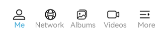
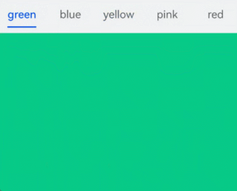
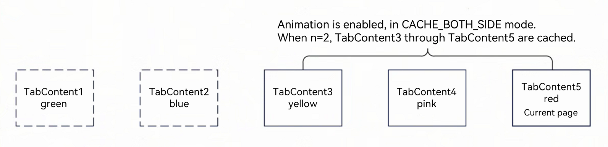
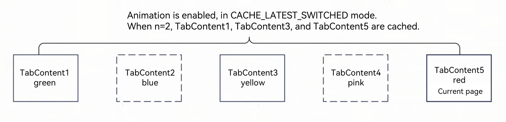
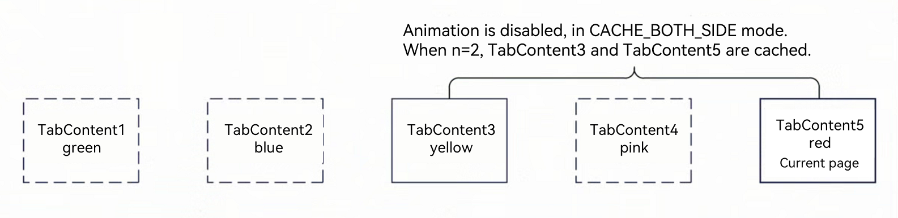
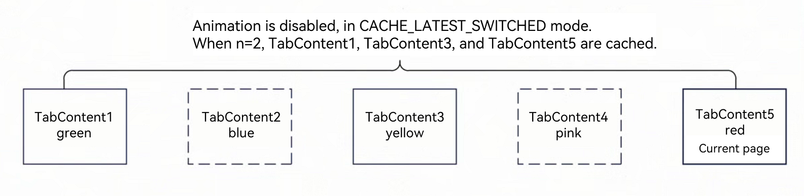

# Using Tabs (Tabs)
<!--Kit: ArkUI-->
<!--Subsystem: ArkUI-->
<!--Owner: @CCFFWW-->
<!--Designer: @CCFFWW-->
<!--Tester: @lxl007-->
<!--Adviser: @Brilliantry_Rui-->


When there is a large amount of page information, to enable the user to focus on the currently displayed content, the page content needs to be classified to improve the page space utilization. The [Tabs](../reference/apis-arkui/arkui-ts/ts-container-tabs.md) component can quickly switch between views on a page, improving information search efficiency and reducing the amount of information that users receive at a time.


## Basic Layout

  The **Tabs** component consists of two parts: **TabContent** and **TabBar**. **TabContent** is the content page, and **TabBar** is the navigation tab bar. The following figure shows the page structure. The layout varies according to the navigation type. In bottom navigation, top navigation, and side navigation, the navigation tab bar is located at the bottom, top, and edge, respectively.

  **Figure 1** Tabs component layout 


>**NOTE**
>
> - The **TabContent** component does not support setting of the common width attribute. By default, its width is the same as that of the parent **Tabs** component.
>
> - The **TabContent** component does not support setting of the common height attribute. Its height is determined by the height of the parent **Tabs** component and the **TabBar** component.


The **Tabs** component uses braces to wrap **TabContent** child components, as shown in Figure 2.


  **Figure 2** Using Tabs and TabContent 


Each **TabContent** component should be mapped to a tab page, which can be configured through the **tabBar** attribute. The following is an example.

```ts
 TabContent() {
   Text('Home tab content').fontSize(30)
 }
.tabBar('Home')
```


When setting multiple **TabContent** components, place them in sequence in the **Tabs** component.

```ts
Tabs() {
  TabContent() {
    Text('Home tab content').fontSize(30)
  }
  .tabBar('Home')

  TabContent() {
    Text('Recommended tab content').fontSize(30)
  }
  .tabBar('Recommended')

  TabContent() {
    Text('Discover tab content').fontSize(30)
  }
  .tabBar('Discover')
  
  TabContent() {
    Text('Me tab content').fontSize(30)
  }
  .tabBar("Me")
}
```


## Bottom Navigation

Bottom navigation is the most common navigation mode in applications. The bottom navigation bar is located at the bottom of the level-1 page of the application. It enables the user to quickly have a picture of the feature categories the moment they open the application. In addition, it facilitates one-hand operations of the user. Bottom navigation generally exists as a main navigation form of an application, in that it provides convenient access to primary destinations anywhere in the application.


  **Figure 3** Bottom navigation bar 


You set the position of the navigation bar through the **barPosition** parameter of the **Tabs** component. By default, **barPosition** is set to **BarPosition.Start**, which means that the navigation bar is located on the top. To display the navigation bar at the bottom, set **barPosition** to **BarPosition.End**.


```ts
Tabs({ barPosition: BarPosition.End }) {
  // TabContent: Home, Discover, Recommended, and Me
  // ...
}
```

You can customize the appearance of the bottom navigation bar by setting the [BottomTabBarStyle](../reference/apis-arkui/arkui-ts/ts-container-tabcontent.md#bottomtabbarstyle9) attribute of **TabContent**. For details, see [Example 9: Using Symbol Icons for Bottom Tabs](../reference/apis-arkui/arkui-ts/ts-container-tabcontent.md#example-9-using-symbol-icons-for-bottom-tabs).


## Top Navigation

Top navigation comes in handy when there are many content categories and users need to frequently switch between them. It is usually a further subdivision of the categories in the bottom navigation bar. For example, a theme application may provide a top navigation bar that classifies themes into image, video, and font.

  **Figure 4** Top navigation bar 


```ts
Tabs({ barPosition: BarPosition.Start }) {
  // TabContent: Following, Video, Game, Digital, Technology, Sports, Movie
  // ...
}
```


## Side Navigation

Side navigation is seldom used in applications. It is more applicable to landscape screens. Because the natural eye movement pattern is from left to right, the side navigation bar is located on the left side by default.


  **Figure 5** Side navigation bar 


To implement the side navigation bar, set the **vertical** attribute of the **Tabs** component to **true**. By default, **vertical** is set to **false**, indicating that the content page and navigation bar are aligned vertically.


```ts
Tabs({ barPosition: BarPosition.Start }) {
  // TabContent: Home, Discover, Recommended, and Me
  // ...
}
.vertical(true)
.barWidth(100)
.barHeight(200)
```


>**NOTE**
>
> - When the **vertical** attribute is set to **false**, the tab bar takes up the whole screen width by default. Set **barWidth** to a proper value.
>
> - When the **vertical** attribute is set to **true**, the tab bar takes up the actual content height by default. Set **barHeight** to a proper value.


## Restricting the Scrolling of the Navigation Bar

  By default, the navigation bar is scrollable. On some pages that require multi-level classification of content, for example, when both bottom navigation and top navigation are used, the scroll effect of the bottom navigation bar may conflict with that of the top navigation bar. In this case, the scrolling of the bottom navigation bar needs to be restricted to improve user experience.

  **Figure 6** Restricting the scrolling of the bottom navigation bar 


The attribute that enables or disables the scrolling is **scrollable**. Its default value is **true**, indicating that scrolling is enabled. To disable the scrolling, set the attribute to **false**.

```ts
Tabs({ barPosition: BarPosition.End }) {
  TabContent(){
    Column(){
      Tabs(){
        // Content on the top navigation bar
        // ...
      }
    }
    .backgroundColor('#ff08a8f1')
    .width('100%')
  }
  .tabBar('Home')

  // Other TabContent content: Discover, Recommended, and Me
  // ...
}
.scrollable(false)
```


## Fixed Navigation Bar

When the content categories are relatively fixed and not scalable, a fixed navigation bar can be used. For example, it can be used for the bottom navigation bar, which generally contains 3 to 5 categories. The fixed navigation bar cannot be scrolled or dragged. The tab bar width is evenly distributed among the categories.


  **Figure 7** Fixed navigation bar


To use a fixed navigation bar, set the **barMode** attribute of the **Tabs** component to **barMode.Fixed** (default).

```ts
Tabs({ barPosition: BarPosition.End }) {
  // TabContent: Home, Discover, Recommended, and Me
  // ...
}
.barMode(BarMode.Fixed)
```


## Scrollable Navigation Bar

The top navigation bar or side navigation bar can be set to be scrollable if the screen width cannot fully accommodate all the tabs. With a scrollable navigation bar, users can reveal tabs beyond the visible area by touching or swiping on the navigation bar.


  **Figure 8** Scrollable navigation bar 


To use a scrollable navigation bar, set the **barMode** attribute of the **Tabs** component to **BarMode.Scrollable**.

```ts
Tabs({ barPosition: BarPosition.Start }) {
  // TabContent: follow, video, game, digital, technology, sports, movie, humanities, art, nature, and military
  // ...
}
.barMode(BarMode.Scrollable)
```


## Customizing the Navigation Bar

The bottom navigation bar is generally used on the home page of an application. To deliver a more vibrant experience, you can customize the style of the navigation bar, combining use of text and icons to signify the tab content.


  **Figure 9** Custom navigation bar 




By default, the system uses an underscore (_) to indicate the active tab. For a custom navigation bar, you need to implement the corresponding style to distinguish active tabs from inactive tabs.


To customize the navigation bar, use the **tabBar** parameter and pass in to it custom function component styles in **CustomBuilder** mode. In this example, a custom function component **tabBuilder** is declared, and the input parameters include **title** (tab title), **targetIndex** (target index of the tab), **selectedImg** (image for the selected state), and **normalImg** (image for the unselected state). The UI display style is determined based on whether the value of **currentIndex** (index of the active tab) matches that of **targetIndex** (target index of the tab).

```ts
@State currentIndex: number = 0;

@Builder tabBuilder(title: string, targetIndex: number, selectedImg: Resource, normalImg: Resource) {
  Column() {
    Image(this.currentIndex === targetIndex ? selectedImg : normalImg)
      .size({ width: 25, height: 25 })
    Text(title)
      .fontColor(this.currentIndex === targetIndex ? '#1698CE' : '#6B6B6B')
  }
  .width('100%')
  .height(50)
  .justifyContent(FlexAlign.Center)
}
```


Pass the custom function component to the **tabBar** attribute corresponding to the tab content and transfer the corresponding parameters.

```ts
TabContent() {
  Column(){
    Text('Me tab content') 
  }
  .width('100%')
  .height('100%')
  .backgroundColor('#007DFF')
}
.tabBar(this.tabBuilder('Me', 0, $r('app.media.mine_selected'), $r('app.media.mine_normal')))
```


## Switching to a Specified Tab

Non-custom navigation bars follow the default switching logic. If you are using a custom navigation bar, you must manually implement the logic for switching tabs so that when the user switches to a tab, the application displays the corresponding tab page.


  **Figure 10** Content page and tab bar not synced 


Since API version 18, the **Tabs** component supports the [onSelected](../reference/apis-arkui/arkui-ts/ts-container-tabs.md#onselected18) event method. This method listens for index changes and passes the selected element's index value to **selectIndex**, enabling tab switching functionality.

```ts
@Entry
@Component
struct TabsExample1 {
  @State selectIndex: number = 0;
  @Builder tabBuilder(title: string, targetIndex: number) {
    Column() {
      Text(title)
        .fontColor(this.selectIndex === targetIndex ? '#1698CE' : '#6B6B6B')
    }
  }

  build() {
    Column() {
      Tabs({ barPosition: BarPosition.End }) {
        TabContent() {
          Text("Home tab content").width('100%').height('100%').backgroundColor('rgb(213,213,213)')
            .fontSize(40).fontColor(Color.Black).textAlign(TextAlign.Center)
        }.tabBar(this.tabBuilder('Home', 0))

        TabContent() {
          Text("Discover tab content").width('100%').height('100%').backgroundColor('rgb(112,112,112)')
            .fontSize(40).fontColor(Color.Black).textAlign(TextAlign.Center)
        }.tabBar(this.tabBuilder('Discover', 1))

        TabContent() {
          Text("Recommended tab content").width('100%').height('100%').backgroundColor('rgb(39,135,217)')
            .fontSize(40).fontColor(Color.Black).textAlign(TextAlign.Center)
        }.tabBar(this.tabBuilder('Recommended', 2))

        TabContent() {
          Text("Me tab content").width('100%').height('100%').backgroundColor('rgb(0,74,175)')
            .fontSize(40).fontColor(Color.Black).textAlign(TextAlign.Center)
        }.tabBar(this.tabBuilder('Me',3))
      }
      .animationDuration(0)
      .backgroundColor('#F1F3F5')
      .onSelected((index: number) => {
        this.selectIndex = index;
      })
    }.width('100%')
  }
}
```
  **Figure 11** Content page and tab bar synced 


To enable switching between content pages and tabs without swiping, you can pass **currentIndex** to the **index** parameter of **Tabs**. By changing the value of **currentIndex**, you can navigate to the content page corresponding to a specific index. Alternatively, use **TabsController**, which is the controller for the **Tabs** component, to manage content page switches. By using the **changeIndex** API of **TabsController**, you can set your application to display the tab content corresponding to the specified index.
```ts
@State currentIndex: number = 2;
@State currentAnimationMode: AnimationMode = AnimationMode.CONTENT_FIRST;
private controller: TabsController = new TabsController();

Tabs({ barPosition: BarPosition.End, index: this.currentIndex, controller: this.controller }) {
  // ...
}
.height(600)
.animationMode(this.currentAnimationMode)
.onChange((index: number) => {
   this.currentIndex = index;
})

Button('Dynamically Change AnimationMode').width('50%').margin({ top: 1 }).height(25)
  .onClick(()=>{
    if (this.currentAnimationMode === AnimationMode.CONTENT_FIRST) {
      this.currentAnimationMode = AnimationMode.ACTION_FIRST;
    } else if (this.currentAnimationMode === AnimationMode.ACTION_FIRST) {
      this.currentAnimationMode = AnimationMode.NO_ANIMATION;
    } else if (this.currentAnimationMode === AnimationMode.NO_ANIMATION) {
      this.currentAnimationMode = AnimationMode.CONTENT_FIRST_WITH_JUMP;
    } else if (this.currentAnimationMode === AnimationMode.CONTENT_FIRST_WITH_JUMP) {
      this.currentAnimationMode = AnimationMode.ACTION_FIRST_WITH_JUMP;
    } else if (this.currentAnimationMode === AnimationMode.ACTION_FIRST_WITH_JUMP) {
      this.currentAnimationMode = AnimationMode.CONTENT_FIRST;
    }
})

Button('Dynamically Change Index').width('50%').margin({ top: 20 })
  .onClick(()=>{
    this.currentIndex = (this.currentIndex + 1) % 4;
})

Button('Change Index via Controller').width('50%').margin({ top: 20 })
  .onClick(()=>{
    let index = (this.currentIndex + 1) % 4;
    this.controller.changeIndex(index);
})
```

  **Figure 12** Switching to a specific tab page   


You can use the **onContentWillChange** API of the **Tabs** component to customize the interception callback function. The interception callback function is called when a new page is about to be displayed. If the callback returns **true**, the tab can switch to the new page. If the callback returns **false**, the tab cannot switch to the new page and will remain on the current page.

```ts
Tabs({ barPosition: BarPosition.End, controller: this.controller, index: this.currentIndex }) {
  // ...
  }
  .onContentWillChange((currentIndex, comingIndex) => {
    if (comingIndex == 2) {
      return false;
    }
    return true;
  })
```
  **Figure 13** Customizing the page switching interception event


<!--Del-->
## Supporting Aging-Friendly Design

In aging-friendly scenarios with large font sizes, the bottom tab bar offers a dialog box with large fonts for content display. When the component detects a large font setting, it constructs a long-press dialog box based on the configured text and icons. After the user long-presses the tab bar and then swipes in the dialog box to switch to the next tab, the dialog box updates with content of the new tab. Upon releasing, the dialog box closes and the UI switches to the corresponding tab page.

>  **NOTE**
>
> The dialog box applies only to bottom tab bars, that is, tab bars in the style of **BottomTabBarStyle**.

**Figure 14** Displaying an aging-friendly dialog box by long-pressing the bottom tab bar in an aging-friendly scenario


```ts
import { abilityManager, Configuration } from '@kit.AbilityKit';
import { BusinessError } from '@kit.BasicServicesKit';
import { uiAppearance } from '@kit.ArkUI';

@Entry
@Component
struct Demo {
  @State fontColor: string = '#182431';
  @State selectedFontColor: string = '#007DFF';
  @State currentIndex: number = 0;
  @State currentFontSizeScale: string = '';
  @State showBuilderTab: boolean = false;
  @State fontSize: number = 15;
  private darkModeKey: string[] = Object.keys(uiAppearance.DarkMode).filter(
    key => typeof uiAppearance.DarkMode[key] === 'number');

  async setFontScale(scale: number): Promise<void> {
    let configInit: Configuration = {
      fontSizeScale: scale,
    };
    abilityManager.updateConfiguration(configInit, (err: BusinessError) => {
      if (err) {
        console.error(`updateConfiguration fail, err: ${JSON.stringify(err)}`);
        this.getUIContext().getPromptAction().showToast({ message: `scale:${scale}, err:${JSON.stringify(err)}` });
      } else {
        this.currentFontSizeScale = String(scale);
        if (scale > 1) {
          this.fontSize = 8;
        } else {
          this.fontSize = 15;
        }
        console.info('updateConfiguration success.');
        this.getUIContext().getPromptAction().showToast({ message: `scale:${scale}, updateConfiguration success.` });
      }
    });
  }

  darkMode(isDarkMode: boolean): void {
    let mode: uiAppearance.DarkMode = uiAppearance.DarkMode.ALWAYS_LIGHT;
    if (isDarkMode) {
      mode = uiAppearance.DarkMode.ALWAYS_DARK;
    }
    if (mode == uiAppearance.getDarkMode()) {
      console.info(`TitleDarkMode Set ${this.darkModeKey[mode]} successfully.`);
      return;
    }
    try {
      uiAppearance.setDarkMode(mode).then(() => {
        console.info(`TitleDarkMode Set ${this.darkModeKey[mode]} successfully.`);
      }).catch((error: Error) => {
        console.error(`TitleDarkMode Set ${this.darkModeKey[mode]} failed, ${error.message}`);
      });
    } catch (error) {
      let message = (error as BusinessError).message;
      console.error(`TitleDarkMode Set dark-mode failed, ${message}`);
    }
  }

  build() {
    Column() {
      Column() {
        Row() {
          Text(`current fontSizeScale:${this.currentFontSizeScale}`)
            .margin({ top: 5, bottom: 5 })
            .fontSize(this.fontSize)
        }

        Row() {
          Button('1.75')
            .margin({ top: 5, bottom: 5 })
            .fontSize(this.fontSize)
            .width('40%')
            .onClick(async () => {
              await this.setFontScale(1.75);
            })
          Button('2')
            .margin({ top: 5, bottom: 5 })
            .fontSize(this.fontSize)
            .width('40%')
            .onClick(async () => {
              await this.setFontScale(2);
            })
        }.margin({ top: 25 })

        Row() {
          Button('3.2')
            .margin({ top: 5, bottom: 5 })
            .fontSize(this.fontSize)
            .width('40%')
            .onClick(async () => {
              await this.setFontScale(3.2);
            })
          Button('1')
            .margin({ top: 5, bottom: 5 })
            .fontSize(this.fontSize)
            .width('40%')
            .onClick(async () => {
              await this.setFontScale(1);
            })
        }

        Row() {
          Button('Dark Mode')
            .margin({ top: 5, bottom: 5 })
            .fontSize(this.fontSize)
            .width('40%')
            .onClick(async () => {
              this.darkMode(true);
            })
          Button('Light Mode')
            .margin({ top: 5, bottom: 5 })
            .fontSize(this.fontSize)
            .width('40%')
            .onClick(async () => {
              this.darkMode(false);
            })
        }
      }.alignItems(HorizontalAlign.Start)

      Column() {
        Tabs({ barPosition: BarPosition.End }) {
          TabContent() {
            Column().width('100%').height('100%').backgroundColor(Color.Pink)
          }.tabBar(new BottomTabBarStyle($r('sys.media.ohos_app_icon'), 'OverLength'))
          TabContent() {
            Column().width('100%').height('100%').backgroundColor(Color.Yellow)
          }.tabBar(new BottomTabBarStyle($r('sys.media.ohos_app_icon'), 'SixLine'))
          TabContent() {
            Column().width('100%').height('100%').backgroundColor(Color.Blue)
          }.tabBar(new BottomTabBarStyle($r('sys.media.ohos_app_icon'), 'Blue'))
          TabContent() {
            Column().width('100%').height('100%').backgroundColor(Color.Green)
          }.tabBar(new BottomTabBarStyle($r('sys.media.ohos_app_icon'), 'Green'))
        }
        .vertical(false)
        .scrollable(true)
        .barMode(BarMode.Fixed)
        .onChange((index: number) => {
          console.info(index.toString());
        })
        .width('100%')
        .backgroundColor(0xF1F3F5)
      }.width('80%').height(200)
      .margin({ top: 200 })
    }.width('100%')
  }
}
```
<!--DelEnd-->

## Controlling the Number of Cached Pages

Since API version 19, you can use the [cachedMaxCount](https://../reference/apis-arkui/arkui-ts/ts-container-tabs.md#cachedmaxcount19) API to set the maximum number of cached child components and specify the cache mode. By default, all **TabContent** components are preloaded when the **Tabs** component is created, and the loaded pages remain in memory, which may cause performance and memory issues. To control the number of cached pages, set the [cachedMaxCount](https://../reference/apis-arkui/arkui-ts/ts-container-tabs.md#cachedmaxcount19) attribute. Once this attribute is configured, pages are no longer preloaded but instead use lazy loading (pages load only when switched to). When users switch between pages, the [TabsCacheMode](../reference/apis-arkui/arkui-ts/ts-container-tabs.md#tabscachemode19) attribute determines whether to retain or release pages based on the specified mode.

>  **NOTE**
>
> 1. When **TabsCacheMode** is set to **CACHE_BOTH_SIDE**, the currently displayed child component and the adjacent components on both sides are cached.
>
> 2. When **TabsCacheMode** is set to **CACHE_LATEST_SWITCHED**, the currently displayed child component and the most recently switched child component are cached.
>
> 3. If a page switching animation is enabled and users switch directly from page 1 to page 3, the animation will include page 2, causing it to be temporarily loaded. If page 2 falls outside the cache range, it will be released immediately after the page switching animation completes.

**Figure 15** Page switching by clicking the yellow button with page caching enabled


```ts
@Entry
@Component
struct TabsExample {
  build() {
    Tabs() {
      TabContent() {
        MyComponent({ color: '#00CB87' })
      }.tabBar(SubTabBarStyle.of('green'))

      TabContent() {
        MyComponent({ color: '#007DFF' })
      }.tabBar(SubTabBarStyle.of('blue'))

      TabContent() {
        MyComponent({ color: '#FFBF00' })
      }.tabBar(SubTabBarStyle.of('yellow'))

      TabContent() {
        MyComponent({ color: '#E67C92' })
      }.tabBar(SubTabBarStyle.of('pink'))

      TabContent() {
        MyComponent({ color: '#FF0000' })
      }.tabBar(SubTabBarStyle.of('red'))
    }
    .width(360)
    .height(296)
    .backgroundColor('#F1F3F5')
    .cachedMaxCount(1, TabsCacheMode.CACHE_BOTH_SIDE)
  }
}

@Component
struct MyComponent {
  private color: string = '';

  aboutToAppear(): void {
    console.info('aboutToAppear backgroundColor:' + this.color);
  }

  aboutToDisappear(): void {
    console.info('aboutToDisappear backgroundColor:' + this.color);
  }

  build() {
    Column()
      .width('100%')
      .height('100%')
      .backgroundColor(this.color)
  }
}
```
Based on the preceding example code, the caching behavior in different scenarios is as follows:

1. In Figure 16, the default page switching animation is enabled and the **CACHE_BOTH_SIDE** mode is used with **n=2**. When users switch to the yellow page using the tab bar, TabContent1 through TabContent3 are cached. Subsequently switching to the red page releases TabContent1 and TabContent2, while caching TabContent3 through TabContent5.

**Figure 16** Default page switching animation in CACHE_BOTH_SIDE mode



2. In Figure 17, the default page switching animation is enabled and the **CACHE_LATEST_SWITCHED** mode is used with **n=2**. When users switch to the yellow page using the tab bar, TabContent1 and TabContent3 are cached while TabContent2 is released. Subsequently switching to the red page caches TabContent1, TabContent3, and TabContent5, while releasing TabContent4.

**Figure 17** Default page switching animation in CACHE_LATEST_SWITCHED mode



3. In Figure 18, the default page switching animation is disabled and the **CACHE_BOTH_SIDE** mode is used with **n=2**. When users switch to the yellow page using the tab bar, TabContent1 and TabContent3 are cached. Subsequently switching to the red page caches TabContent3 and TabContent5, while releasing TabContent1.

**Figure 18** CACHE_BOTH_SIDE mode with the page switching animation disabled



4. In Figure 19, the default page switching animation is disabled and the **CACHE_LATEST_SWITCHED** mode is used with **n=2**. When users switch to the yellow page using the tab bar, TabContent1 and TabContent3 are cached. Subsequently switching to the red page caches TabContent1, TabContent3, and TabContent5.

**Figure 19** CACHE_LATEST_SWITCHED mode with the page switching animation disabled



