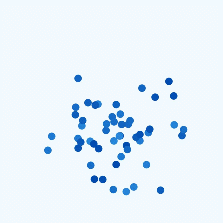

# Particle Animation

[Particle animation](../reference/apis-arkui/arkui-ts/ts-particle-animation.md) is created using the **Particle** component and consists of a multitude of particles that are randomly generated within a specified area. These particles can take the form of points, images, or other shapes. By animating different aspects of the particles, such as color, opacity, scale, velocity, acceleration, and spin angle, you can create engaging and dynamic visual effects. For example, you can simulate an impressive snowfall animation by animating the particles to represent snowflakes.

Below is a simple implementation of the particle animation:
```ts
@Entry
@Component
struct ParticleExample {
  build() {
    Stack() {
      Text()
        .width(300).height(300).backgroundColor('rgb(240, 250, 255)')
      Particle({ particles: [
        {
          emitter: {
            particle: {
              type: ParticleType.POINT, // Particle type.
              config: {
                radius: 5// Point radius.
              },
              count: 100, // Total number of particles.
            },
          },
          color:{
            range:['rgb(39, 135, 217)','rgb(0, 74, 175)'],// Initial color range.
          },
        },
      ]
      }).width(250).height(250)
    }.width("100%").height("100%").align(Alignment.Center)
  }
}
```


## Implementing a Particle Emitter

A particle emitter in particle animation is primarily used to define the initial properties (such as type, position, and color), of particles, control the rate of particle emission, and manage the lifecycle of the particles. You can update the position of the emitter by adjusting the emitter position, emission rate, and emission window size using the [emitter](../reference/apis-arkui/arkui-ts/ts-particle-animation.md#emitter12) API.

```ts
// ...
@State emitterProperties: Array<EmitterProperty> = [
  {
    index: 0,
    emitRate: 100,
    position: { x: 60, y: 80 },
    size: { width: 200, height: 200 }
  }
]

Particle(...).width(300).height(300).emitter(this.emitterProperties) // Dynamically adjust the position of the particle emitter.
// ...
```




## Setting the Particle Color

Use the [range](../reference/apis-arkui/arkui-ts/ts-particle-animation.md#particlecolorpropertyoptions) property to define the initial color range for particles, and the [distributionType](../reference/apis-arkui/arkui-ts/ts-particle-animation.md#particlecolorpropertyoptions) property to specify how the initial color's random values are distributed. You can choose between uniform distribution or normal (Gaussian) distribution.

```ts
// ...
color: {
  range: ['rgb(39, 135, 217)','rgb(0, 74, 175)'], // Initial color range.
  distributionType: DistributionType.GAUSSIAN // Random value distribution type of the initial color.
},
// ...
```


## Particle Lifetime

The lifetime of a particle, from creation to expiration, is used to specify how long a particle exists. Use the [lifetime](../reference/apis-arkui/arkui-ts/ts-particle-animation.md#emitteroptions) and [lifetimeRange](../reference/apis-arkui/arkui-ts/ts-particle-animation.md#emitteroptions) properties to define the particle lifetime.

```ts
// ...
emitter: {
  particle: {
    // ...
    lifetime: 300, // Particle lifetime, in ms.
    lifetimeRange: 100 // Range of particle lifetime values, in ms.
  },
  emitRate: 10, // Number of particles emitted per second.
  position: [0, 0],
  shape: ParticleEmitterShape.RECTANGLE // Emitter shape.
},
color: {
  range: ['rgb(39, 135, 217)','rgb(0, 74, 175)'], // Initial color range.
},
// ...
```


## Setting the Particle Disturbance Field

A disturbance field is a mechanism used to influence the motion of particles in a particle animation. It works by applying specific forces to particles within a defined spatial area, thereby altering their trajectories and behaviors. This results in more complex and natural-looking animation effects, adding a touch of realism to the particle movement. Use [disturbanceFields](../reference/apis-arkui/arkui-ts/ts-particle-animation.md#disturbancefields12) to set the disturbance field.

```ts
// ...
Particle({ particles: [
  {
    emitter: // ...
    color: // ...
    scale: {
      range: [0.0, 0.0],
      updater: {
        type: ParticleUpdater.CURVE,
        config: [
          {
            from: 0.0,
            to: 0.5,
            startMillis: 0,
            endMillis: 3000,
            curve: Curve.EaseIn
          }
        ]
      }
    },
    acceleration: { // Acceleration. speed indicates the acceleration speed, and angle indicates the acceleration direction.
      speed: {
        range: [3, 9],
        updater: {
          type: ParticleUpdater.RANDOM,
          config: [1, 20]
        }
      },
      angle: {
        range: [90, 90]
      }
    }

  }
]
}).width(300).height(300).disturbanceFields([{
  strength: 10,
  shape: DisturbanceFieldShape.RECT,
  size: { width: 100, height: 100 },
  position: { x: 100, y: 100 },
  feather: 15,
  noiseScale: 10,
  noiseFrequency: 15,
  noiseAmplitude: 5
}])
// ... 
```


