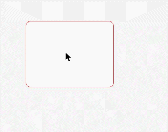

# Menu Control (Menu)
<!--Kit: ArkUI-->
<!--Subsystem: ArkUI-->
<!--Owner: @Armstrong15-->
<!--Designer: @zhanghaibo0-->
<!--Tester: @lxl007-->
<!--Adviser: @Brilliantry_Rui-->

You can use menu APIs to display a context menu, a vertical list of items displayed by long pressing, clicking, or right-clicking a component. For details, see [Menu Control](../reference/apis-arkui/arkui-ts/ts-universal-attributes-menu.md).

A context menu displayed using [bindContextMenu](../reference/apis-arkui/arkui-ts/ts-universal-attributes-menu.md#bindcontextmenu12) and configured with a preview image has a mask applied; in this case, it is modal.

A context menu displayed using [bindMenu](../reference/apis-arkui/arkui-ts/ts-universal-attributes-menu.md#bindmenu11), or **bindContextMenu** without a preview image configured, does not have a mask applied; in this case, it is non-modal.

## Lifecycle

| Name| Type| Description|
| --- | --- | --- |
| aboutToAppear  | () =>  void | Callback triggered when the menu is about to appear.|
| onAppear | () =>  void | Callback invoked after the menu appears.|
| aboutToDisappear | () =>  void | Callback triggered when the menu is about to disappear.|
| onDisappear  | () =>  void | Callback invoked after the menu disappears.|


## Creating a Menu in the Default Style

Use the **bindMenu** API to implement a menu. **bindMenu** responds to the click event of the bound component. When the bound component is clicked, the menu is displayed.

<!-- @[create_default_menu](https://gitcode.com/openharmony/applications_app_samples/blob/master/code/DocsSample/ArkUISample/DialogProject/entry/src/main/ets/pages/Menu/CreateDefaultMenu.ets) -->

``` TypeScript
Button('click for Menu')
  .bindMenu([
    {
      value: 'Menu1',
      action: () => {
        hilog.info(0xFF00, 'DialogProject', 'handle Menu1 select');
      }
    }
  ])
```


## Creating a Menu in a Custom Style

If the default style does not meet requirements, you can use [@Builder](../../application-dev/ui/state-management/arkts-builder.md) to customize menu content and use the **bindMenu** API to bind the custom menu to a component.

### Using @Builder to Customize Menu Content

<!-- @[builder_custom_menu](https://gitcode.com/openharmony/applications_app_samples/blob/master/code/DocsSample/ArkUISample/DialogProject/entry/src/main/ets/pages/Menu/BuilderCustomMenu.ets) -->

``` TypeScript
import { hilog } from '@kit.PerformanceAnalysisKit';

// Replace $r('app.media.xxx') with the image resource file you use.
class Tmp {
  public iconStr2: ResourceStr = $r('app.media.view_list_filled');

  set(val: Resource) {
    this.iconStr2 = val;
  }
}

@Entry
@Component
export struct BuilderCustomMenuExample {
  @State select: boolean = true;
  private iconStr: ResourceStr = $r('app.media.view_list_filled');
  private iconStr2: ResourceStr = $r('app.media.view_list_filled');
  // The value in the 'app.string.copy' resource file is "Copy."
  private copy: ResourceStr = $r('app.string.copy');
  // The value in the 'app.string.paste' resource file is "Paste."
  private paste: ResourceStr = $r('app.string.paste');

  @Builder
  SubMenu() {
    Menu() {
      MenuItem({ content: this.copy, labelInfo: 'Ctrl+C' })
      MenuItem({ content: this.paste, labelInfo: 'Ctrl+V' })
    }
  }

  @Builder
  MyMenu() {
    Menu() {
      // The value in the 'app.string.menu_selection' resource file is "Menu Option."
      MenuItem({ startIcon: $r('app.media.icon'), content: $r('app.string.menu_selection') })
      MenuItem({ startIcon: $r('app.media.icon'), content: $r('app.string.menu_selection') }).enabled(false)
      MenuItem({
        startIcon: this.iconStr,
        content: $r('app.string.menu_selection'),
        endIcon: $r('app.media.arrow_right_filled'),
        // When the builder parameter is set, it indicates that a submenu is bound to a menu item. When the user hovers the cursor over the menu item, the submenu is displayed.
        builder: this.SubMenu
      })
      // The value in the 'app.string.menu_subtitle' resource file is "Subtitle."
      MenuItemGroup({ header: $r('app.string.menu_subtitle') }) {
        // The value in the 'app.string.menu_selection' resource file is "Menu Option."
        MenuItem({ content: $r('app.string.menu_selection') })
          .selectIcon(true)
          .selected(this.select)
          .onChange((selected) => {
            hilog.info(0xFF00, 'DialogProject', 'menuItem select' + selected);
            let str: Tmp = new Tmp();
            str.set($r('app.media.icon'));
          })
        // The value in the 'app.string.menu_selection' resource file is "Menu Option."
        MenuItem({
          startIcon: $r('app.media.view_list_filled'),
          content: $r('app.string.menu_selection'),
          endIcon: $r('app.media.arrow_right_filled'),
          builder: this.SubMenu
        })
      }

      // The value in the 'app.string.menu_selection' resource file is "Menu Option."
      MenuItem({
        startIcon: this.iconStr2,
        content: $r('app.string.menu_selection'),
        endIcon: $r('app.media.arrow_right_filled')
      })
    }
  }

  build() {
    // ···
  }
}
```

### Using the bindMenu Attribute to Bind a Component

<!-- @[bind_menu](https://gitcode.com/openharmony/applications_app_samples/blob/master/code/DocsSample/ArkUISample/DialogProject/entry/src/main/ets/pages/Menu/BuilderCustomMenu.ets) -->

``` TypeScript
Button('click for Menu')
  .bindMenu(this.MyMenu)
```


## Creating a Context Menu Displayed Upon Right-clicking or Long Pressing

Use the **bindContextMenu** API to customize the menu content and menu popup mode: right-click or long press. The menu items that are displayed using **bindContextMenu** are in an independent child window and can be displayed outside the application window.

- Use @Builder to customize the menu content. The content configuration follows the same logic as the preceding section.
- Check the menu popup mode and bind the component through the **bindContextMenu** attribute. In the example, the menu is displayed upon right-clicking.

  <!-- @[create_right_click_menu](https://gitcode.com/openharmony/applications_app_samples/blob/master/code/DocsSample/ArkUISample/DialogProject/entry/src/main/ets/pages/Menu/CreateMenu.ets) -->
  
  ``` TypeScript
  Button('Right-click for Menu')
    .bindContextMenu(this.MyMenu, ResponseType.RightClick)
  ```

## Configuring Haptic Feedback When Menu Appears

Menu haptic feedback is supported since API version 18. By default, menus are displayed without haptic feedback. To enable haptic feedback when menus appear, configure the haptic feedback mode using the **hapticFeedbackMode** property in [ContextMenuOptions](../reference/apis-arkui/arkui-ts/ts-universal-attributes-menu.md#contextmenuoptions10).

- The haptic feedback mode is only configurable for level-1 menus.
- The settings take effect only when the application has the ohos.permission.VIBRATE permission and the user has enabled haptic feedback. To enable haptic feedback, you must [declare the required permission](../security/AccessToken/declare-permissions.md) under **requestPermissions** in the **module.json5** file of the project as follows:

  <!-- @[menu_permissions](https://gitcode.com/openharmony/applications_app_samples/blob/master/code/DocsSample/ArkUISample/DialogProject/entry/src/main/module.json5) -->
  
  ``` JSON5
  "requestPermissions": [
    {
      "name": "ohos.permission.VIBRATE",
    }
  ],
  ```

<!-- @[popVibrate_menu](https://gitcode.com/openharmony/applications_app_samples/blob/master/code/DocsSample/ArkUISample/DialogProject/entry/src/main/ets/pages/Menu/PopVibrateMenu.ets) -->

``` TypeScript
Button('click for Menu')
  .id('click for Menu')
  .bindMenu(this.MyMenu, { hapticFeedbackMode: HapticFeedbackMode.ENABLED})
```

## Implementing Center Axis Avoidance

Since API version 18, menus support center axis avoidance. Since API version 20, it is enabled by default on 2-in-1 devices (avoidance only occurs when the window is in waterfall mode). You can control whether to enable axis avoidance through the **enableHoverMode** property in [ContextMenuOptions](../reference/apis-arkui/arkui-ts/ts-universal-attributes-menu.md#contextmenuoptions10).

> **NOTE**
> - Menus will not avoid the center axis if tapped in the axis area.
> - On 2-in-1 devices, center axis avoidance occurs only when the window is in waterfall mode.

<!-- @[avoid_central_axis_menu](https://gitcode.com/openharmony/applications_app_samples/blob/master/code/DocsSample/ArkUISample/DialogProject/entry/src/main/ets/pages/Menu/SupportAvoidCentralAxisMenu.ets) -->

``` TypeScript
// Replace $r('app.media.xxx') with the image resource file you use.
@Entry
@Component
export struct SupportAvoidCentralAxisMenuExample {
  @State message: string = 'Hello World';
  @State upScreen: string =
    this.getUIContext().getHostContext()?.resourceManager.getStringByNameSync('Upper_half_screen') as string;
  @State middleAxle: string =
    this.getUIContext().getHostContext()?.resourceManager.getStringByNameSync('Middle_axle') as string;
  @State lowerScreen: string =
    this.getUIContext().getHostContext()?.resourceManager.getStringByNameSync('Lower_half_screen') as string;
  @State zone: string =
    this.getUIContext().getHostContext()?.resourceManager.getStringByNameSync('zone') as string;
  @State hoverModeStart: string =
    this.getUIContext().getHostContext()?.resourceManager.getStringByNameSync('hoverMode_start') as string;
  private iconStr: Resource = $r('app.media.startIcon');
  @State index: number = 0;
  @State arrayStr: Array<string> = [this.upScreen, this.middleAxle, this.lowerScreen];
  @State enableHoverMode: boolean | undefined = true;
  @State showInSubwindow: boolean = false;
  @State placement: Placement | undefined = undefined;

  @Builder
  MyMenu1() {
    Menu() {
      // The value in the 'app.string.menu_selection' resource file is "Menu Option."
      MenuItem({ startIcon: this.iconStr, content: $r('app.string.menu_selection') })
      MenuItem({ startIcon: this.iconStr, content: $r('app.string.menu_selection') })
      MenuItem({ startIcon: this.iconStr, content: $r('app.string.menu_selection') })
      MenuItem({ startIcon: this.iconStr, content: $r('app.string.menu_selection') })
    }
  }

  @State isShow: boolean = false;

  build() {
    NavDestination() {
      RelativeContainer() {
        Column() {
          Button(this.zone + this.arrayStr[this.index])
            .onClick(() => {
              if (this.index < 2) {
                this.index++
              } else {
                this.index = 0
              }
            })

          Button(this.hoverModeStart + this.enableHoverMode)
            .id('hoverMode_start')
            .onClick(() => {
              if (this.enableHoverMode === undefined) {
                this.enableHoverMode = true
              } else if (this.enableHoverMode === true) {
                this.enableHoverMode = false
              } else {
                this.enableHoverMode = undefined
              }
            })

          Button('MenuPlacement:' + this.placement)
            .onClick(() => {
              if (this.placement === undefined) {
                this.placement = Placement.Bottom
              } else if (this.placement === Placement.Bottom) {
                this.placement = Placement.Top
              } else {
                this.placement = undefined
              }
            })
        }

        Row() {
          Button('Menu')
            .fontWeight(FontWeight.Bold)
            .bindMenu(this.MyMenu1(), {
              enableHoverMode: this.enableHoverMode,
              showInSubWindow: this.showInSubwindow,
              placement: this.placement
            })

          Select([{ value: 'text1' }, { value: 'text2' }, { value: 'text3' }, { value: 'text4' }, { value: 'text5' },
            { value: 'text6' }, { value: 'text7' }, { value: 'text8' }, { value: 'text9' }, { value: 'text10' },
            { value: 'text11' },
            { value: 'text12' }])
            .value('Select')

        }
        .alignRules({
          center: { anchor: '__container__', align: VerticalAlign.Center },
          middle: { anchor: '__container__', align: HorizontalAlign.Center }
        })
        .margin({
          top: this.index === 2 ? 330 : this.index === 1 ? 50 : 0,
          bottom: this.index === 0 ? 330 : 0
        })
      }
      .height('100%')
      .width('100%')
    }
    // ...
  }
}
```

## Controlling Event Passthrough for Subwindow Menus

When a menu appears in a subwindow, surrounding events are passed to the host window by default. Since API version 20, you can use the **modalMode** property in [ContextMenuOptions](../reference/apis-arkui/arkui-ts/ts-universal-attributes-menu.md#contextmenuoptions10) to configure modal behavior when submenus appear, controlling whether surrounding events are passed through. When **modalMode** is set to **ModalMode.TARGET_WINDOW**, events around the menu are blocked, and underlying controls will not respond to interactions.

<!-- @[eventTrans_menu](https://gitcode.com/openharmony/applications_app_samples/blob/master/code/DocsSample/ArkUISample/DialogProject/entry/src/main/ets/pages/Menu/EventTransSubWindowMenu.ets) -->

``` TypeScript
@Entry
@Component
export struct EventTransSubWindowMenuExample {
  build() {
    NavDestination() {
      Column() {
      }
      .id('click')
      .bindContextMenu(this.contextMenuBuilder, ResponseType.RightClick, {
        modalMode: ModalMode.TARGET_WINDOW
      })
      .onClick(() => {
        this.getUIContext().getPromptAction().showToast({
          message: 'Clicked!'
        })
      })
      .width('100%')
      .height('100%')
    }
    // ···
  }

  @Builder
  bindMenuBuilder() {
    Menu() {
      MenuItem({ content: 'bindMenu item' }) {

      }
    }
  }

  @Builder
  contextMenuBuilder() {
    Menu() {
      MenuItem({ content: 'contextMenu item' }) {

      }
    }
  }
}
```

## Positioning Menus Relative to Bound Components

Since API version 20, menus can be displayed at specific positions relative to their bound components. By configuring horizontal and vertical offsets, you can control the menu's popup position relative to the bound component's upper left corner. Unlike the standalone **offset** parameter, this approach enables menu overlay directly on the bound component. Use the **anchorPosition** property in [ContextMenuOptions](../reference/apis-arkui/arkui-ts/ts-universal-attributes-menu.md#contextmenuoptions10) to specify precise positioning.

> **NOTE**
>- Positioning offsets do not apply during menu preview state.
>- Predefined [placement](../reference/apis-arkui/arkui-ts/ts-universal-attributes-menu.md#contextmenuoptions10) settings become ineffective.
>- Offsets combine with the [offset](../reference/apis-arkui/arkui-ts/ts-universal-attributes-menu.md#contextmenuoptions10) parameter for final positioning.
>- With both horizontal and vertical offsets negative, positioning references the bound component's lower left corner.
>- With only one negative offset, positioning uses the upper left corner with reverse offset applied.

<!-- @[bindComponent_menu](https://gitcode.com/openharmony/applications_app_samples/blob/master/code/DocsSample/ArkUISample/DialogProject/entry/src/main/ets/pages/Menu/BindComponentMenu.ets) -->

``` TypeScript
// Replace $r('app.media.xxx') with the image resource file you use.
@Entry
@Component
export struct BindComponentMenuExample {
  @Builder
  MenuBuilder() {
    Column() {
      Menu() {
        MenuItemGroup() {
          MenuItem({ startIcon: $r('app.media.app_icon'), content: 'Select Mixed Menu 1', labelInfo: '' })
          MenuItem({ startIcon: $r('app.media.app_icon'), content: 'Select Mixed Menu 2', labelInfo: '' })
          MenuItem({ startIcon: $r('app.media.app_icon'), content: 'Select Mixed Menu 3', labelInfo: '' })
        }
      }
    }
  }

  build() {
    NavDestination() {
      Column() {
        Text()
          .borderRadius(10)
          .width(200)
          .height(150)
          .borderWidth(1)
          .backgroundColor(Color.White)
          .borderColor(Color.Red)
          .margin({ top: 200, left: 125 })
          .bindContextMenu(this.MenuBuilder, ResponseType.RightClick, {
            anchorPosition: { x: 45, y: 50 },
          })
      }
      .alignItems(HorizontalAlign.Start)
      .width('100%')
      .height('100%')
      .backgroundColor('#F5F5F5')
    }
    // ···
  }
}
```


