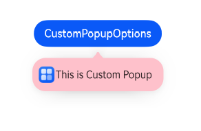
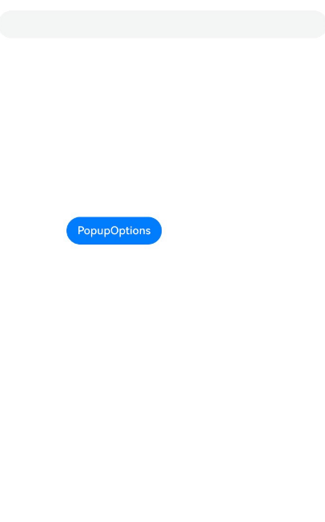
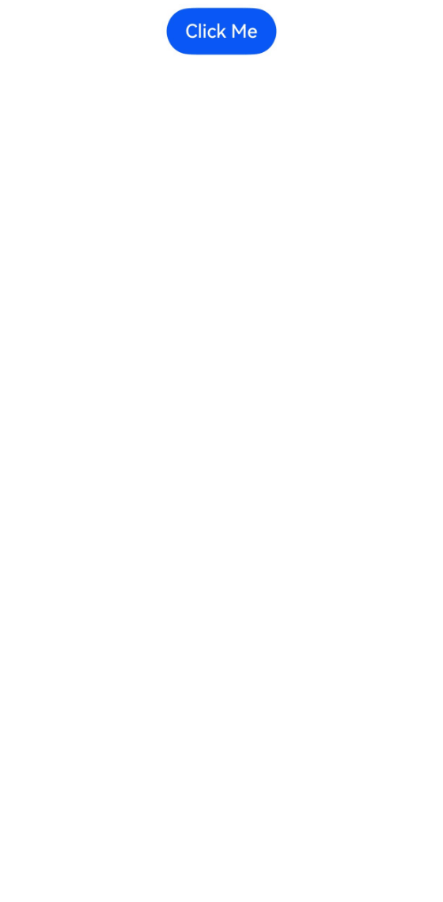

# Popup
<!--Kit: ArkUI-->
<!--Subsystem: ArkUI-->
<!--Owner: @liyi0309-->
<!--Designer: @liyi0309-->
<!--Tester: @lxl007-->
<!--Adviser: @Brilliantry_Rui-->
You can bind the **Popup** attribute to a component to create a popup, specifying its content and interaction logic, and display state. It is mainly used for screen recording and message notification.

Popups can be defined with [PopupOptions](../reference/apis-arkui/arkui-ts/ts-universal-attributes-popup.md#popupoptions) or [CustomPopupOptions](../reference/apis-arkui/arkui-ts/ts-universal-attributes-popup.md#custompopupoptions8). In **PopupOptions**, you can set **primaryButton** and **secondaryButton** to include buttons in the popup. In **CustomPopupOptions**, you can create a custom popup using [builder](../../application-dev/ui/state-management/arkts-builder.md). For **PopupOptions**, the maximum font scale factor is 2.

You can configure the modality of a popup through [mask](../reference/apis-arkui/arkui-ts/ts-universal-attributes-popup.md#popupoptions). Setting **mask** to **true** or a color value makes the popup a modal, and setting **mask** to **false** makes the popup a non-modal.

When multiple popups are displayed at the same time, popups displayed in child windows have a higher z-index than those in the main window. When in the same window, popups displayed later have a higher z-index than those displayed earlier.

## Creating a Text Popup

Text popups are usually used to display informational text messages, suitable for non-interactive scenarios. Bind the **Popup** attribute to a component. When the **show** parameter of **bindPopup** is set to **true**, a popup is displayed.

In the example below, with the **Popup** attribute bound to a **Button** component, each click toggles the boolean value in **handlePopup**. When the value becomes **true**, it triggers **bindPopup** to display the popup.

<!-- @[text_popup](https://gitcode.com/openharmony/applications_app_samples/blob/master/code/DocsSample/ArkUISample/DialogProject/entry/src/main/ets/pages/popup/TextPrompts.ets) -->

``` TypeScript
@Entry
@Component
export struct TextPopupExample {
  @State handlePopup: boolean = false;

  build() {
    NavDestination() {
      Column() {
        Button('PopupOptions')
          .id('PopupOptions')
          .margin({ top: 300 })
          .onClick(() => {
            this.handlePopup = !this.handlePopup;
          })
          .bindPopup(this.handlePopup, {
            message: 'This is a popup with PopupOptions',
          })
      }.width('100%').padding({ top: 5 })
    }
    // ···
  }
}
```


## Adding an Event Listener for Popup State Changes

You can use the **onStateChange** parameter to add an event callback for popup state changes, so as to determine the current state of the popup.

<!-- @[state_popup](https://gitcode.com/openharmony/applications_app_samples/blob/master/code/DocsSample/ArkUISample/DialogProject/entry/src/main/ets/pages/popup/PopupStateChange.ets) -->

``` TypeScript
@Entry
@Component
export struct StatePopupExample {
  @State handlePopup: boolean = false;

  build() {
    NavDestination() {
        Column() {
          Button('PopupOptions')
            .id('PopupOptions')
            .margin({ top: 300 })
            .onClick(() => {
              this.handlePopup = !this.handlePopup;
            })
            .bindPopup(this.handlePopup, {
              message: 'This is a popup with PopupOptions',
              onStateChange: (e)=> {// Return the current popup state.
                if (!e.isVisible) {
                  this.handlePopup = false;
                }
              }
            })
        }.width('100%').padding({ top: 5 })
    }
    // ···
  }
}
```


## Creating a Popup with Buttons

You can add a maximum of two buttons to a popup through the **primaryButton** and **secondaryButton** attributes. For each of the buttons, you can set the **action** parameter to specify the operation to be triggered.

<!-- @[button_popup](https://gitcode.com/openharmony/applications_app_samples/blob/master/code/DocsSample/ArkUISample/DialogProject/entry/src/main/ets/pages/popup/ButtonPopup.ets) -->

``` TypeScript
import { hilog } from '@kit.PerformanceAnalysisKit';

@Entry
@Component
export struct ButtonPopupExample {
  @State handlePopup: boolean = false;

  build() {
    NavDestination() {
        Column() {
          Button('PopupOptions').margin({ top: 300 })
            .id('PopupOptions')
            .onClick(() => {
              this.handlePopup = !this.handlePopup;
            })
            .bindPopup(this.handlePopup, {
              message: 'This is a popup with PopupOptions',
              primaryButton: {
                value: 'Confirm',
                action: () => {
                  this.handlePopup = !this.handlePopup;
                  hilog.info(0xFF00, 'DialogProject', 'confirm Button click');
                }
              },
              secondaryButton: {
                value: 'Cancel',
                action: () => {
                  this.handlePopup = !this.handlePopup;
                }
              },
              onStateChange: (e) => {
                if (!e.isVisible) {
                  this.handlePopup = false;
                }
              }
            })
        }.width('100%').padding({ top: 5 })
    }
    // ···
  }
}
```


## Implementing Popup Animation

You implement the entrance and exit animation effects of popups through **transition**.

<!-- @[animation_popup](https://gitcode.com/openharmony/applications_app_samples/blob/master/code/DocsSample/ArkUISample/DialogProject/entry/src/main/ets/pages/popup/PopupAnimation.ets) -->

``` TypeScript
// xxx.ets
@Entry
@Component
export struct AnimationPopupExample {
  @State handlePopup: boolean = false;
  @State customPopup: boolean = false;

  // Define the popup content in the popup builder.
  @Builder
  popupBuilder() {
    Row() {
      Text('Custom Popup with transitionEffect').fontSize(10)
    }.height(50).padding(5)
  }

  build() {
    NavDestination() {
      Flex({ direction: FlexDirection.Column }) {
        // PopupOptions for setting the popup
        Button('PopupOptions')
          .id('PopupOptions')
          .onClick(() => {
            this.handlePopup = !this.handlePopup;
          })
          .bindPopup(this.handlePopup, {
            message: 'This is a popup with transitionEffect',
            placement: Placement.Top,
            showInSubWindow: false,
            onStateChange: (e) => {
              if (!e.isVisible) {
                this.handlePopup = false;
              }
            },
            // Set the popup animation to a combination of opacity and translation effects, with no exit animation.
            transition: TransitionEffect.asymmetric(
              TransitionEffect.OPACITY.animation({ duration: 1000, curve: Curve.Ease }).combine(
                TransitionEffect.translate({ x: 50, y: 50 })),
              TransitionEffect.IDENTITY)
          })
          .position({ x: 100, y: 150 })

        // CustomPopupOptions for setting the popup
        Button('CustomPopupOptions')
          .id('CustomPopupOptions')
          .onClick(() => {
            this.customPopup = !this.customPopup;
          })
          .bindPopup(this.customPopup, {
            builder: this.popupBuilder,
            placement: Placement.Top,
            showInSubWindow: false,
            onStateChange: (e) => {
              if (!e.isVisible) {
                this.customPopup = false;
              }
            },
            // Set the popup entrance and exit animations to be a scaling effect.
            transition: TransitionEffect.scale({ x: 1, y: 0 }).animation({ duration: 500, curve: Curve.Ease })
          })
          .position({ x: 80, y: 300 })
      }.width('100%').padding({ top: 5 })
    }
    // ···
  }
}
```


## Creating a Custom Popup

You can create a custom popup with **builder** in **CustomPopupOptions**, defining custom content in \@Builder. In addition, you can use parameters such as **popupColor** to control the popup style.

<!-- @[custom_popup](https://gitcode.com/openharmony/applications_app_samples/blob/master/code/DocsSample/ArkUISample/DialogProject/entry/src/main/ets/pages/popup/CustomPopup.ets) -->

``` TypeScript
// Replace $r('app.media.xxx') with the image resource file you use.
@Entry
@Component
export struct CustomPopupExample {
  @State customPopup: boolean = false;

  // Define the popup content in the popup builder.
  @Builder
  popupBuilder() {
    Row({ space: 2 }) {
      Image($r('app.media.app_icon')).width(24).height(24).margin({ left: 5 })
      Text('This is Custom Popup').fontSize(15)
    }.width(200).height(50).padding(5)
  }

  build() {
    NavDestination() {
      Column() {
        Button('CustomPopupOptions')
          .id('CustomPopupOptions')
          .margin({ top: 300 })
          .onClick(() => {
            this.customPopup = !this.customPopup;
          })
          .bindPopup(this.customPopup, {
            builder: this.popupBuilder, // Content of the popup.
            placement: Placement.Bottom, // Position of the popup.
            popupColor: Color.Pink, // Popup background color
            backgroundBlurStyle: BlurStyle.NONE,
            onStateChange: (e) => {
              if (!e.isVisible) {
                this.customPopup = false
              }
            }
          })
      }
      .height('100%')
    }
    // ...
  }
}
```

To place the popup in a specific position, set the **placement** parameter. The popup builder triggers a popup message to instruct the user to complete the operation.



## Defining the Popup Style

You can define the popup style using both builder-based customization and through specific API configurations.

Background color: While popups initially come with a transparent background, they have a blur effect, which is **COMPONENT_ULTRA_THICK** on phones.
Mask style: Popups come with a default mask that is transparent.
Size: The size of a popup is determined by the content within the builder or the length of the message it holds.
Position: Popups are located below their host component by default. You can control the display position and alignment using the **Placement** API.
The following example demonstrates how to configure a popup's style using **popupColor**, **mask**, **width**, and **placement**.

<!-- @[style_popup](https://gitcode.com/openharmony/applications_app_samples/blob/master/code/DocsSample/ArkUISample/DialogProject/entry/src/main/ets/pages/popup/PopupStyle.ets) -->

``` TypeScript
// xxx.ets

@Entry
@Component
export struct StylePopupExample {
  @State handlePopup: boolean = false;

  build() {
    NavDestination() {
      Column({ space: 100 }) {
        Button('PopupOptions')
          .onClick(() => {
            this.handlePopup = !this.handlePopup;
          })
          .bindPopup(this.handlePopup, {
            width: 200,
            message: 'This is a popup.',
            popupColor: Color.Red, // Set the background color for the popup.
            mask: {
              color: '#33d9d9d9'
            },
            placement: Placement.Top,
            backgroundBlurStyle: BlurStyle.NONE // Remove the blur effect for the popup.
          })
      }
      .width('100%')
    }
    // ···
  }
}
```


## Enabling the Popup to Avoid the Soft Keyboard

By default, popups do not avoid the soft keyboard and may be obscured by it. To enable keyboard avoidance, set **keyboardAvoidMode** (supported since API version 15) to **KeyboardAvoidMode.DEFAULT**. If there is insufficient space, the popup will shift from its default position to overlay its host component.

<!-- @[avoidSoftKeyboard_popup](https://gitcode.com/openharmony/applications_app_samples/blob/master/code/DocsSample/ArkUISample/DialogProject/entry/src/main/ets/pages/popup/PopupAvoidSoftKeyboard.ets) -->

``` TypeScript
// xxx.ets
@Entry
@Component
export struct AvoidSoftKeyboardPopupExample {
  @State handlePopup: boolean = false;

  @Builder
  popupBuilder() {
    Column({ space: 2 }) {
      Text('Custom Popup').fontSize(20)
        .borderWidth(2)
      TextInput()
    }.width(200).padding(5)
  }

  build() {
    NavDestination() {
      Column({ space: 100 }) {
        TextInput()
        Button('PopupOptions')
          .id('PopupOptions')
          .onClick(() => {
            this.handlePopup = !this.handlePopup;
          })
          .bindPopup(this.handlePopup!!, {
            width: 200,
            builder: this.popupBuilder(),
            placement: Placement.Bottom,
            mask: false,
            autoCancel: false,
            keyboardAvoidMode: KeyboardAvoidMode.DEFAULT
          })
          .position({ x: 100, y: 300 })
      }
      .width('100%')
    }
    // ···
  }
}
```




## Setting Polymorphic Effects in the Popup

When @Builder is used for custom popup content, polymorphic styles are not supported by default. To achieve background color changes on press, implement a component with @Component.

<!-- @[polymorphicEffect_popup](https://gitcode.com/openharmony/applications_app_samples/blob/master/code/DocsSample/ArkUISample/DialogProject/entry/src/main/ets/pages/popup/PopupPolymorphicEffect.ets) -->

``` TypeScript
// Replace $r('app.media.xxx') with the image resource file you use.
@Entry
@Component
export struct PolymorphicEffectPopupExample {
  @State scan: string =
    this.getUIContext().getHostContext()?.resourceManager.getStringByNameSync('Scan_title') as string;
  @State createGroupChat: string =
    this.getUIContext().getHostContext()?.resourceManager.getStringByNameSync('Create_group_chat') as string;
  @State electronicWorkCard: string =
    this.getUIContext().getHostContext()?.resourceManager.getStringByNameSync('Electronic_work_card') as string;
  private menus: Array<string> = [this.scan, this.createGroupChat, this.electronicWorkCard];

  // Define the popup content in the popup builder.
  @Builder
  popupItemBuilder(name: string, action: string) {
    PopupItemChild({ childName: name, childAction: action })
  }

  // Define the popup content in the popup builder.
  @Builder
  popupBuilder() {
    Column() {
      ForEach(
        this.menus,
        (item: string, index) => {
          this.popupItemBuilder(item, String(index))
        },
        (item: string, index) => {
          return item
        })
    }
    .padding(8)
  }

  @State customPopup: boolean = false;

  build() {
    NavDestination() {
      Column() {
        Button('click me')
          .id('click me')
          .onClick(() => {
            this.customPopup = !this.customPopup
          })
          .bindPopup(
            this.customPopup,
            {
              builder: this.popupBuilder, // Content of the popup.
              placement: Placement.Bottom, // Position of the popup.
              popupColor: Color.White, // Background color of the popup.
              onStateChange: (event) => {
                if (!event.isVisible) {
                  this.customPopup = false
                }
              }
            })
      }
      .width('100%')
      .justifyContent(FlexAlign.Center)
    }
    // ...
  }
}

@Component
struct PopupItemChild {
  @Prop childName: string = '';
  @Prop childAction: string = '';
  @State selected: string =
    this.getUIContext().getHostContext()?.resourceManager.getStringByNameSync('Selected') as string;

  build() {
    Row({ space: 8 }) {
      Image($r('app.media.startIcon'))
        .width(24)
        .height(24)
      Text(this.childName)
        .fontSize(16)
    }
    .width(130)
    .height(50)
    .padding(8)
    .onClick(() => {
      this.getUIContext().getPromptAction().showToast({ message: this.selected + this.childName })
    })
    .stateStyles({
      normal: {
        .backgroundColor(Color.White)
      },
      pressed: {
        .backgroundColor('#d4f1ff')
      }
    })
  }
}
```



## Implementing Axis Avoidance

Since API version 18, popups support center axis avoidance. Since API version 20, it is enabled by default on 2-in-1 devices (avoidance only occurs when the window is in waterfall mode). You can control whether to enable axis avoidance through the **enableHoverMode** property in [PopupOptions](../reference/apis-arkui/arkui-ts/ts-universal-attributes-popup.md#popupoptions).

> **NOTE**
> - Popups will not avoid the center axis if clicked in the axis area.
> - On 2-in-1 devices, axis avoidance occurs only when the window is in waterfall mode.

<!-- @[supportedAvoidAxis_popup](https://gitcode.com/openharmony/applications_app_samples/blob/master/code/DocsSample/ArkUISample/DialogProject/entry/src/main/ets/pages/popup/PopupSupportedAvoidAxis.ets) -->

``` TypeScript
@Entry
@Component
export struct SupportedAvoidAxisPopupExample {
  @State upScreen: string =
    this.getUIContext().getHostContext()?.resourceManager.getStringByNameSync('Upper_half_screen') as string;
  @State middleAxle: string =
    this.getUIContext().getHostContext()?.resourceManager.getStringByNameSync('Middle_axle') as string;
  @State lowerScreen: string =
    this.getUIContext().getHostContext()?.resourceManager.getStringByNameSync('Lower_half_screen') as string;
  @State subwindowDisplay: string =
    this.getUIContext().getHostContext()?.resourceManager.getStringByNameSync('Subwindow_display') as string;
  @State subwindow: string =
    this.getUIContext().getHostContext()?.resourceManager.getStringByNameSync('Subwindow') as string;
  @State nonSubwindow: string =
    this.getUIContext().getHostContext()?.resourceManager.getStringByNameSync('Non_Subwindow') as string;
  @State zone: string =
    this.getUIContext().getHostContext()?.resourceManager.getStringByNameSync('zone') as string;
  @State hoverModeStart: string =
    this.getUIContext().getHostContext()?.resourceManager.getStringByNameSync('hoverMode_start') as string;

  @State message: string = 'Hello World';
  @State index: number = 0;
  @State arrayStr: Array<string> = [this.upScreen, this.middleAxle, this.lowerScreen];
  @State enableHoverMode: boolean | undefined = true;
  @State showInSubwindow: boolean = false;
  @State placement: Placement | undefined = undefined;
  @State isShow: boolean = false;

  build() {
    NavDestination() {
      RelativeContainer() {
        Column() {
          Button(this.zone + this.arrayStr[this.index])
            .onClick(() => {
              if (this.index < 2) {
                this.index++
              } else {
                this.index = 0
              }
            })

          Button(this.subwindowDisplay + (this.showInSubwindow ? this.subwindow : this.nonSubwindow))
            .onClick(() => {
              this.showInSubwindow = !this.showInSubwindow
            })

          Button(this.hoverModeStart + this.enableHoverMode)
            .onClick(() => {
              if (this.enableHoverMode === undefined) {
                this.enableHoverMode = true
              } else if (this.enableHoverMode === true) {
                this.enableHoverMode = false
              } else {
                this.enableHoverMode = undefined
              }
            })
        }

        Row() {
          Button('Popup')
            .id('Popup')
            .fontWeight(FontWeight.Bold)
            .bindPopup(this.isShow, {
              message: 'popup',
              enableHoverMode: this.enableHoverMode,
              showInSubWindow: this.showInSubwindow,
            })
            .onClick(() => {
              this.isShow = !this.isShow
            })
        }
        .alignRules({
          center: { anchor: '__container__', align: VerticalAlign.Center },
          middle: { anchor: '__container__', align: HorizontalAlign.Center }
        })
        .margin({
          top: this.index === 2 ? 330 : this.index === 1 ? 50 : 0,
          bottom: this.index === 0 ? 330 : 0
        })
      }
      .height('100%')
      .width('100%')
    }
    // ···
  }
}
```
