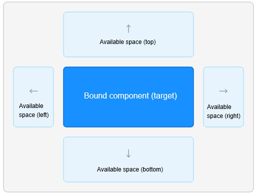

# FAQs About Popup Component
<!--Kit: ArkUI-->
<!--Subsystem: ArkUI-->
<!--Owner: @liyi0309-->
<!--Designer: @liyi0309-->
<!--Tester: @lxl007-->
<!--Adviser: @Brilliantry_Rui-->

This topic addresses common issues related to popup components.

## Setting **placement** in **bindPopup** does not take effect.

**Symptom**

After setting the [placement](../reference/apis-arkui/arkui-ts/ts-universal-attributes-popup.md#popupoptions) attribute via [popup control](../reference/apis-arkui/arkui-ts/ts-universal-attributes-popup.md), the popup does not appear at the expected position.

**Possible causes**

The default display area of the popup is the window area outside the bound component. The framework automatically adjusts the popup position based on available space, rather than strictly following the **placement** set by you.

The popup is preferentially displayed at the position specified by **placement**. If the space is insufficient, the popup will automatically fall back based on the following policies:

1. The default display area of the popup is the window area outside the bound component, as shown in the schematic diagram below:

   

2. If the available space at the specified position is insufficient to fully display the popup, the ArkUI framework checks whether the mirrored position of that position can display the popup. For example, the mirrored position of **Placement.Bottom** is **Placement.Top**, and the mirrored position of **Placement.Left** is **Placement.Right**.

3. If the mirrored position still lacks sufficient space, the popup will switch to a position on the other axis, that is, cross‑axis fallback. For example, if neither vertical direction (top/bottom) has enough space, it will try a horizontal direction (left/right), and vice versa.

4. If there is insufficient space in all four directions to fully display the popup, the popup will by default occlude the bound component. If you do not want the popup to occlude the bound component, they can set the [avoidTarget](../reference/apis-arkui/arkui-ts/ts-universal-attributes-popup.md#popupoptions) attribute to **AvoidanceMode.AVOID_AROUND_TARGET**. In this case, when remaining space is insufficient, the popup will be compressed to avoid occluding the bound component.

**Reference**

- [Popup Control](../reference/apis-arkui/arkui-ts/ts-universal-attributes-popup.md)
