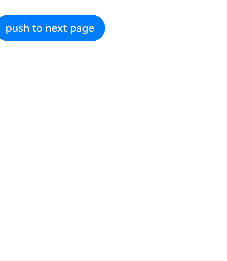
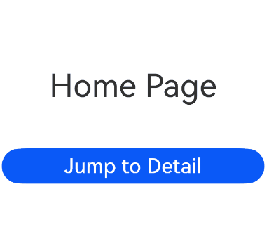

# Page Routing (@ohos.router) (Not Recommended)
<!--Kit: ArkUI-->
<!--Subsystem: ArkUI-->
<!--Owner: @mayaolll-->
<!--Designer: @jiangdayuan-->
<!--Tester: @Giacinta-->
<!--Adviser: @Brilliantry_Rui-->


Page routing refers to the redirection and data transfer between different pages in an application. It can be implemented through APIs of the **Router** module. Through different URLs, you can easily navigate users through pages. This document outlines the key features of the **Router** module, including: [Page Redirection](#page-redirection), [Page Return](#page-return), [Adding a Confirmation Dialog Box Before Page Return](#adding-a-confirmation-dialog-box-before-page-return), and [Named Route](#named-route).

>**NOTE**
>
>You are advised to use [Component Navigation (Navigation)](./arkts-navigation-architecture.md), which offers enhanced functionality and customization capabilities, as the routing framework in your application. For details about the differences between **Navigation** and **Router**, see [Transition from Router to Navigation](./arkts-router-to-navigation.md).

## Page Redirection

Page redirection is an important part of the development process. When using an application, you usually need to jump between different pages, and sometimes you need to pass data from one page to another.

  **Figure 1** Page redirection 


The **Router** module provides two redirection modes: [pushUrl](../reference/apis-arkui/arkts-apis-uicontext-router.md#pushurl) and [replaceUrl](../reference/apis-arkui/arkts-apis-uicontext-router.md#replaceurl). Whether the target page will replace the current page depends on the mode used.

- **pushUrl**: The target page does not replace the current page. Instead, it is pushed onto the page stack. In this mode, the state of the current page is retained, and users can return to the current page by pressing the back button or calling the [back](../reference/apis-arkui/arkts-apis-uicontext-router.md#back) API.

- **replaceUrl**: The target page replaces the current page, and the current page is destroyed. In this mode, the resources of the current page can be released, and users cannot return to the current page.

>**NOTE**
>
>- When creating a page, configure the route to this page by following instructions in <!--RP1-->[Building the Second Page](../quick-start/start-with-ets-stage.md#building-the-second-page)<!--RP1End-->.
>
>
>- The maximum capacity of a page stack is 32 pages. If this limit is exceeded, the [clear](../reference/apis-arkui/arkts-apis-uicontext-router.md#clear) API can be called to clear the historical page stack and free the memory.

The **Router** module also provides two instance modes: **Standard** and **Single**. Depending on the mode, the target URL is mapped to one or more instances.

- **Standard**: multi-instance mode. It is the default instance mode. In this mode, the target page is added to the top of the page stack, regardless of whether a page with the same URL exists in the stack.

- **Single**: singleton mode. In this mode, if the URL of the target page already exists in the page stack, the page closest to the top of the stack with the same URL is moved to the top of the stack and becomes the new page. If the URL of the target page does not exist in the page stack, the page is redirected in standard mode.

- Scenario 1: There is a home page (**Home**) and a details page (**Detail**). You want to click an offering on the home page to go to the details page. In addition, the home page needs to be retained in the page stack so that the status can be restored when the page is returned. In this scenario, you can use the **pushUrl** API and use the **Standard** instance mode (which can also be omitted).

  <!-- @[jump_click](https://gitcode.com/openharmony/applications_app_samples/blob/master/code/DocsSample/ArkUISample/Navigation/entry/src/main/ets/pages/pageRouter/jumpPage/Index.ets) -->
  
  ``` TypeScript
  import { router } from '@kit.ArkUI';
  import { hilog } from '@kit.PerformanceAnalysisKit';
  const DOMAIN = 0xF811;
  const TAG = '[Sample_ArkTSRouter]';
  
  @Entry
  @Component
  struct Index {
    // On the Home page
    onJumpClick(): void {
      this.getUIContext().getRouter().pushUrl({
        url: 'pages/pageRouter/jumpPage/Detail' // Target URL.
      }, router.RouterMode.Standard, (err) => {
        if (err) {
          hilog.error(DOMAIN, TAG,`Invoke pushUrl failed, code is ${err.code}, message is ${err.message}`);
          return;
        }
        hilog.info(DOMAIN, TAG,'Invoke pushUrl succeeded.');
      });
    }
  
    build() {
      // ···
    }
  }
  ```
  
  >**NOTE**
  >
  >In standard (multi-instance) mode, the **router.RouterMode.Standard** parameter can be omitted.

- Scenario 2: There is a login page (**Login**) and a personal center page (**Profile**). After a user successfully logs in from the **Login** page, the **Profile** page is displayed. At the same time, the **Login** page is destroyed, and the application exits when the back button is pressed. In this scenario, you can use the **replaceUrl** API and use the Standard instance mode (which can also be omitted).

  <!-- @[login_click](https://gitcode.com/openharmony/applications_app_samples/blob/master/code/DocsSample/ArkUISample/Navigation/entry/src/main/ets/pages/pageRouter/jumpPage/Login.ets) -->
  
  ``` TypeScript
  import { router } from '@kit.ArkUI';
  import { hilog } from '@kit.PerformanceAnalysisKit';
  const DOMAIN = 0xF811;
  const TAG = '[Sample_ArkTSRouter]';
  
  @Entry
  @Component
  struct Login {
    // On the Login page
    onJumpClick(): void {
      this.getUIContext().getRouter().replaceUrl({
        url: 'pages/pageRouter/jumpPage/Profile' // Target URL.
      }, router.RouterMode.Standard, (err) => {
        if (err) {
          hilog.error(DOMAIN, TAG,`Invoke replaceUrl failed, code is ${err.code}, message is ${err.message}`);
          return;
        }
        hilog.error(DOMAIN, TAG,'Invoke replaceUrl succeeded.');
      })
    }
  
    build() {
      // ···
    }
  }
  ```
  
  >**NOTE**
  >
  >In standard (multi-instance) mode, the **router.RouterMode.Standard** parameter can be omitted.

- Scenario 3: There is a **Setting** page and a **Theme** page. After a theme option on the **Setting** page is clicked, the **Theme** page is displayed. Only one **Theme** page exists in the page stack at the same time. When the back button is clicked on the **Theme** page, the **Setting** page is displayed. In this scenario, you can use the **pushUrl** API and use the **Single** instance mode.

  <!-- @[setting_click](https://gitcode.com/openharmony/applications_app_samples/blob/master/code/DocsSample/ArkUISample/Navigation/entry/src/main/ets/pages/pageRouter/jumpPage/Setting.ets) -->
  
  ``` TypeScript
  import { router } from '@kit.ArkUI';
  import { hilog } from '@kit.PerformanceAnalysisKit';
  const DOMAIN = 0xF811;
  const TAG = '[Sample_ArkTSRouter]';
  
  @Entry
  @Component
  struct Login {
    // On the Setting page
    onJumpClick(): void {
      this.getUIContext().getRouter().pushUrl({
        url: 'pages/pageRouter/jumpPage/SetTheme' // Target URL.
      }, router.RouterMode.Single, (err) => {
        if (err) {
          hilog.error(DOMAIN, TAG, `Invoke pushUrl failed, code is ${err.code}, message is ${err.message}`);
          return;
        }
        hilog.error(DOMAIN, TAG, 'Invoke replaceUrl succeeded.');
      });
    }
  
    build() {
      // ...
    }
  }
  ```
  
- Scenario 4: There is a search result list page (**SearchResult**) and a search result details page (**SearchDetail**). You want to click a result on the **SearchResult** page to go to the **SearchDetail** page. In addition, if the result has been viewed before, clicking the result displays the existing details page, instead of creating a new one. In this scenario, you can use the **replaceUrl** API and use the **Single** instance mode.

  <!-- @[search_click](https://gitcode.com/openharmony/applications_app_samples/blob/master/code/DocsSample/ArkUISample/Navigation/entry/src/main/ets/pages/pageRouter/jumpPage/SearchResult.ets) -->
  
  ``` TypeScript
  import { router } from '@kit.ArkUI';
  import { hilog } from '@kit.PerformanceAnalysisKit';
  const DOMAIN = 0xF811;
  const TAG = '[Sample_ArkTSRouter]';
  
  @Entry
  @Component
  struct SearchResult {
    // On the SearchResult page
    onJumpClick(): void {
      this.getUIContext().getRouter().replaceUrl({
        url: 'pages/pageRouter/jumpPage/SearchDetail' // Target URL.
      }, router.RouterMode.Single, (err) => {
        if (err) {
          hilog.error(DOMAIN, TAG, `Invoke replaceUrl failed, code is ${err.code}, message is ${err.message}`);
          return;
        }
        hilog.error(DOMAIN, TAG, 'Invoke replaceUrl succeeded.');
      });
    }
  
    build() {
      // ...
    }
  
  }
  ```
  

The preceding scenarios do not involve parameter transfer.

If you need to transfer data to the target page during redirection, you can add a **params** attribute and specify an object as a parameter when invoking an API of the **Router** module. Example:

<!-- @[home_param1](https://gitcode.com/openharmony/applications_app_samples/blob/master/code/DocsSample/ArkUISample/Navigation/entry/src/main/ets/pages/pageRouter/jumpPage/IndexPara.ets) -->

``` TypeScript
class DataModelInfo {
  public age: number = 0;
}

class DataModel {
  public id: number = 0;
  public info: DataModelInfo | null = null;
}
```


<!-- @[home_param2](https://gitcode.com/openharmony/applications_app_samples/blob/master/code/DocsSample/ArkUISample/Navigation/entry/src/main/ets/pages/pageRouter/jumpPage/IndexPara.ets) -->

``` TypeScript
onJumpClick(): void {
  // On the Home page
  let paramsInfo: DataModel = {
    id: 123,
    info: {
      age: 20
    }
  };

  this.getUIContext().getRouter().pushUrl({
    url: 'pages/pageRouter/jumpPage/DetailPara', // Target URL.
    params: paramsInfo // Add the params attribute to transfer custom parameters.
  }, (err) => {
    if (err) {
      hilog.error(DOMAIN, TAG,`Invoke pushUrl failed, code is ${err.code}, message is ${err.message}`);
      return;
    }
    hilog.error(DOMAIN, TAG,'Invoke pushUrl succeeded.');
  });
}
```

On the target page, you can call the [getParams](../reference/apis-arkui/arkts-apis-uicontext-router.md#getparams) API of the **Router** module to obtain the passed parameters. Example:

<!-- @[detail_param1](https://gitcode.com/openharmony/applications_app_samples/blob/master/code/DocsSample/ArkUISample/Navigation/entry/src/main/ets/pages/pageRouter/jumpPage/DetailPara.ets) -->

``` TypeScript
class InfoTmp {
  public age: number = 0;
}

class RouTmp {
  // id: object = () => {
  // };
  public id: number = 0;
  public info: InfoTmp = new InfoTmp();
}
```


<!-- @[detail_param2](https://gitcode.com/openharmony/applications_app_samples/blob/master/code/DocsSample/ArkUISample/Navigation/entry/src/main/ets/pages/pageRouter/jumpPage/DetailPara.ets) -->

``` TypeScript
private params: RouTmp = (this.getUIContext().getRouter().getParams()) as RouTmp; // Obtain the passed parameter object.
// private id: number = this.params.id; // Obtain the value of the id attribute.
private age: number = this.params.info.age; // Obtain the value of the age attribute.
```


## Page Return

Implement the page return feature so that users can return to the previous page or a specified page. You can pass parameters to the target page during the return process.

  **Figure 2** Page return 


Directly using **router** can lead to the issue of [ambiguous UI context](./arkts-global-interface.md#ambiguous-ui-context). To avoid this, obtain a [UIContext](../reference/apis-arkui/arkts-apis-uicontext-uicontext.md) instance using the **getUIContext()** API, and then obtain the **router** object bound to that instance through the [getRouter](../reference/apis-arkui/arkts-apis-uicontext-uicontext.md#getrouter) API.

You can use any of the following methods to return to a page:

- Method 1: Return to the previous page.


<!-- @[back_detail1](https://gitcode.com/openharmony/applications_app_samples/blob/master/code/DocsSample/ArkUISample/Navigation/entry/src/main/ets/pages/pageRouter/jumpPage/BackDetail.ets) -->

``` TypeScript
this.getUIContext().getRouter().back();
```

  This method allows you to return to the position of the previous page in the page stack. For this method to work, the previous page must exist in the page stack.

- Method 2: Return to a specific page.


  Return to the page through a common route.

  <!-- @[back_detail21](https://gitcode.com/openharmony/applications_app_samples/blob/master/code/DocsSample/ArkUISample/Navigation/entry/src/main/ets/pages/pageRouter/jumpPage/BackDetail.ets) -->

  ``` TypeScript
  this.getUIContext().getRouter().back({
    url: 'pages/pageRouter/jumpPage/BackHome'
  });
  ```

  Return to the page through a named route.

  <!-- @[back_detail22](https://gitcode.com/openharmony/applications_app_samples/blob/master/code/DocsSample/ArkUISample/Navigation/entry/src/main/ets/pages/pageRouter/jumpPage/BackDetail.ets) -->

  ``` TypeScript
  this.getUIContext().getRouter().back({
    url: 'myPage' // myPage is the alias of the page to return to.
  });
  ```

  This method allows users to return to a page with the specified path. For this method to work, the target page must exist in the page stack.

- Method 3: Return to a specific page and pass custom parameters.


  Return to the page through a common route.

  <!-- @[back_detail31](https://gitcode.com/openharmony/applications_app_samples/blob/master/code/DocsSample/ArkUISample/Navigation/entry/src/main/ets/pages/pageRouter/jumpPage/BackDetail.ets) -->

  ``` TypeScript
  this.getUIContext().getRouter().back({
    url: 'pages/pageRouter/jumpPage/BackHome',
    params: {
      // Replace $r('app.string.pageRouter_jump_text7_fromHome') with the actual resource file. In this example, the value in the resource file is "From the home page."
      info: $r('app.string.pageRouter_jump_text7_fromHome')
    }
  });
  ```

  Return to the page through a named route.

  <!-- @[back_detail32](https://gitcode.com/openharmony/applications_app_samples/blob/master/code/DocsSample/ArkUISample/Navigation/entry/src/main/ets/pages/pageRouter/jumpPage/BackDetail.ets) -->

  ``` TypeScript
  this.getUIContext().getRouter().back({
    url: 'myPage', // myPage is the alias of the page to return to.
    params: {
      // Replace $r('app.string.pageRouter_jump_text7_fromHome') with the actual resource file. In this example, the value in the resource file is "From the home page."
      info: $r('app.string.pageRouter_jump_text7_fromHome')
    }
  });
  ```

  This method not only allows you to return to the specified page, but also pass in custom parameter information during the return process. On the target page, you can call the [getParams](../reference/apis-arkui/arkts-apis-uicontext-router.md#getparams) method to obtain and parse these parameters.

On the target page, call [getParams](../reference/apis-arkui/arkts-apis-uicontext-router.md#getparams) where the parameters are needed, for example, in the [onPageShow](../reference/apis-arkui/arkui-ts/ts-custom-component-lifecycle.md#onpageshow) lifecycle callback.

> **NOTE**
> 
> Directly using **router** can lead to the issue of [ambiguous UI context](./arkts-global-interface.md#ambiguous-ui-context). To avoid this, obtain a [UIContext](../reference/apis-arkui/arkts-apis-uicontext-uicontext.md) instance using the **getUIContext()** API, and then obtain the **router** object bound to that instance through the [getRouter](../reference/apis-arkui/arkts-apis-uicontext-uicontext.md#getrouter) API.

<!-- @[home_router](https://gitcode.com/openharmony/applications_app_samples/blob/master/code/DocsSample/ArkUISample/Navigation/entry/src/main/ets/pages/pageRouter/backPage/Home.ets) -->

``` TypeScript
@Entry
@Component
struct Home {
  @State message: string = 'Hello World';

  onPageShow() {
    const params = this.getUIContext().getRouter().getParams() as Record<string, string>; // Obtain the passed parameter object.
    if (params) {
      const info: string = params.info as string; // Obtain the value of the info attribute.
    }
  }

// ···
}
```


>**NOTE**
>
>When the **back** API is used to return to a specified page, all pages between the top page (included) and the specified page (excluded) are pushed from the page stack and destroyed.
>
> If the **back** API is used to return to the original page, the original page will not be created repeatedly. Therefore, the variable declared using \@State will not be declared repeatedly, and the **aboutToAppear** lifecycle callback of the page will not be triggered. If you want to use the custom parameters transferred from the returned page on the original page, you can parse the parameters in the required position. For example, parameter parsing can be performed in the **onPageShow** lifecycle callback.

## Lifecycle

The [router](../reference/apis-arkui/js-apis-router.md) page lifecycle refers to the lifecycle of components decorated with [\@Entry](state-management/arkts-create-custom-components.md#entry). The following lifecycle callbacks are provided:

- [onPageShow](../reference/apis-arkui/arkui-ts/ts-custom-component-lifecycle.md#onpageshow): Invoked each time the page is displayed, for example, during page redirection or when the application is switched to the foreground.

- [onPageHide](../reference/apis-arkui/arkui-ts/ts-custom-component-lifecycle.md#onpagehide): Invoked each time the page is hidden, for example, during page redirection or when the application is switched to the background.

- [onBackPress](../reference/apis-arkui/arkui-ts/ts-custom-component-lifecycle.md#onbackpress): Invoked when the user clicks the back button.

<!-- @[life_index](https://gitcode.com/openharmony/applications_app_samples/blob/master/code/DocsSample/ArkUISample/Navigation/entry/src/main/ets/pages/pageRouter/lifeCycle/Index.ets) -->

``` TypeScript
import { hilog } from '@kit.PerformanceAnalysisKit';
const DOMAIN = 0xF811;
const TAG = '[Sample_ArkTSRouter]';
// Index.ets
@Entry
@Component
struct MyComponent {
  // Only components decorated with @Entry can call the lifecycle callbacks of a page.
  onPageShow() {
    hilog.info(DOMAIN, TAG, 'Index onPageShow');
  }

  // Only components decorated with @Entry can call the lifecycle callbacks of a page.
  onPageHide() {
    hilog.info(DOMAIN, TAG, 'Index onPageHide');
  }

  // Only components decorated with @Entry can call the lifecycle callbacks of a page.
  onBackPress() {
    hilog.info(DOMAIN, TAG, 'Index onBackPress');
    // The value true means that the page executes its own return logic, and false (default) means that the default return logic is used.
    return true;
  }

  build() {
    Column() {
      // Push to Page and execute onPageHide.
      Button('push to next page')
        .onClick(() => {
          this.getUIContext().getRouter().pushUrl({ url: 'pages/pageRouter/lifeCycle/Page' });
        })
    }
  }
}
```


<!-- @[life_page](https://gitcode.com/openharmony/applications_app_samples/blob/master/code/DocsSample/ArkUISample/Navigation/entry/src/main/ets/pages/pageRouter/lifeCycle/Page.ets) -->

``` TypeScript
// Page.ets
@Entry
@Component
struct Page {
  @State textColor: Color = Color.Black;
  @State num: number = 0;

  // Only components decorated with @Entry can call the lifecycle callbacks of a page.
  onPageShow() {
    console.info('Page onPageShow');
    this.num = 5;
  }

  // Only components decorated with @Entry can call the lifecycle callbacks of a page.
  onPageHide() {
    console.info('Page onPageHide');
  }

  // Only components decorated with @Entry can call the lifecycle callbacks of a page.
  onBackPress() { // If the value is not set, false is used.
    console.info('Page onBackPress');
    this.textColor = Color.Grey;
    this.num = 0;
  }

  build() {
    Column() {
      Text(`num: ${this.num}`)
        .fontSize(30)
        .fontWeight(FontWeight.Bold)
        .fontColor(this.textColor)
        .margin(20)
        .onClick(() => {
          this.num += 5;
        })
      Button('pop to previous page')
        .onClick(() => {
          this.getUIContext().getRouter().back();
        })
    }
    .width('100%')
  }
}
```


## Defining a Custom Transition

[pageTransition](../reference/apis-arkui/arkui-ts/ts-custom-component-lifecycle.md#pagetransition9) can be used to customize router page transitions. For details, see [Page Transition (pageTransition)](../reference/apis-arkui/arkui-ts/ts-page-transition-animation.md).

## Adding a Confirmation Dialog Box Before Page Return

During application development, to prevent misoperations or data loss, a dialog box needs to be displayed before a user returns from one page to another, asking the user whether to perform the operation.

Such a dialog box can be in the [default style](#default-confirmation-dialog-box) or [custom style](#custom-confirmation-dialog-box).

  **Figure 3** Adding a confirmation dialog box before page return 




### Default Confirmation Dialog Box

To implement this feature, you can use the [showAlertBeforeBackPage](../reference/apis-arkui/arkts-apis-uicontext-router.md#showalertbeforebackpage) and [back](../reference/apis-arkui/arkts-apis-uicontext-router.md#back) APIs provided by the **Router** module.

Directly using **router** can lead to the issue of [ambiguous UI context](./arkts-global-interface.md#ambiguous-ui-context). To avoid this, obtain a [UIContext](../reference/apis-arkui/arkts-apis-uicontext-uicontext.md) instance using the **getUIContext()** API, and then obtain the **router** object bound to that instance through the [getRouter](../reference/apis-arkui/arkts-apis-uicontext-uicontext.md#getrouter) API.

To enable the confirmation dialog box for page return, call the [showAlertBeforeBackPage](../reference/apis-arkui/arkts-apis-uicontext-router.md#showalertbeforebackpage) API (for setting the information about the dialog box), then the [back](../reference/apis-arkui/arkts-apis-uicontext-router.md#back) API. For example, define a click event processing function for the back button on the payment page:

<!-- @[page_showAlert1](https://gitcode.com/openharmony/applications_app_samples/blob/master/code/DocsSample/ArkUISample/Navigation/entry/src/main/ets/pages/pageRouter/pageTransition/ShowAlert.ets) -->

``` TypeScript
import { BusinessError } from '@kit.BasicServicesKit';
import { hilog } from '@kit.PerformanceAnalysisKit';
const DOMAIN = 0xF811;
const TAG = '[Sample_ArkTSRouter]';
```


<!-- @[page_showAlert2](https://gitcode.com/openharmony/applications_app_samples/blob/master/code/DocsSample/ArkUISample/Navigation/entry/src/main/ets/pages/pageRouter/pageTransition/ShowAlert.ets) -->

``` TypeScript
// Define a click event processing function for the back button.
onBackClick(): void {
  // Call this.getUIContext().getRouter().showAlertBeforeBackPage to set the information about the confirmation dialog box.
  try {
    this.getUIContext().getRouter().showAlertBeforeBackPage({
      // Configure the resource whose name is 'pageRouter_dialog_context' and value is a non-empty string in the resources\base\element\string.json file.
      message: this.getUIContext().getHostContext()?.resourceManager.getStringByNameSync('pageRouter_dialog_context') as string, // Set the content of the confirmation dialog box.
    });
  } catch (err) {
    let message = (err as BusinessError).message;
    let code = (err as BusinessError).code;
    hilog.error(DOMAIN, TAG,`Invoke showAlertBeforeBackPage failed, code is ${code}, message is ${message}`);
  }

  // Call this.getUIContext().getRouter().back() to return to the previous page.
  this.getUIContext().getRouter().back();
}
```

The **this.getUIContext().getRouter().showAlertBeforeBackPage** API receives an object as a parameter. The object contains the following attributes:

**message**: content of the dialog box. The value is of the string type.
If the API is called successfully, the confirmation dialog box is displayed on the target page. Otherwise, an exception is thrown and the error code and error information is obtained through **err.code** and **err.message**.

When the user clicks the back button, a confirmation dialog box is displayed, prompting the user to confirm their operation. If the user selects **Cancel**, the application stays on the current page. If the user selects **OK**, the [back](../reference/apis-arkui/arkts-apis-uicontext-router.md#back) API is called and the redirection is performed based on the parameters.

### Custom Confirmation Dialog Box

To implement a custom confirmation dialog box, use [showDialog](../reference/apis-arkui/arkts-apis-uicontext-promptaction.md#showdialog-1) or create a custom dialog box . This topic uses the APIs in the **PromptAction** module an example to describe how to implement a custom confirmation dialog box.

Directly using **router** can lead to the issue of [ambiguous UI context](./arkts-global-interface.md). To avoid this, obtain a [UIContext](../reference/apis-arkui/arkts-apis-uicontext-uicontext.md) instance using the **getUIContext()** API, and then obtain the **router** object bound to that instance through the [getRouter](../reference/apis-arkui/arkts-apis-uicontext-uicontext.md#getrouter) API.

In the event callback, call the [showDialog](../reference/apis-arkui/arkts-apis-uicontext-promptaction.md#showdialog-1) API.

<!-- @[page_showDialog1](https://gitcode.com/openharmony/applications_app_samples/blob/master/code/DocsSample/ArkUISample/Navigation/entry/src/main/ets/pages/pageRouter/pageTransition/ShowDialog.ets) -->

``` TypeScript
import { promptAction} from '@kit.ArkUI';
import { BusinessError } from '@kit.BasicServicesKit';
import { hilog } from '@kit.PerformanceAnalysisKit';
const DOMAIN = 0xF811;
const TAG = '[Sample_ArkTSRouter]';
```


<!-- @[page_showDialog2](https://gitcode.com/openharmony/applications_app_samples/blob/master/code/DocsSample/ArkUISample/Navigation/entry/src/main/ets/pages/pageRouter/pageTransition/ShowDialog.ets) -->

``` TypeScript
onBackClick() {
  // Display a custom confirmation dialog box.
  this.getUIContext().getPromptAction().showDialog({
    // "You have not completed payment yet. Are you sure you want to go back?"
    // Replace $r('app.string.pageRouter_dialog_context') with the actual resource file. In this example, the value in the resource file is "You have not completed payment yet. Are you sure you want to go back?"
    message: $r('app.string.pageRouter_dialog_context'),
    buttons: [
      {
        // Replace $r('app.string.pageRouter_dialog_canceled') with the actual resource file. In this example, the value in the resource file is "Cancel."
        text: $r('app.string.pageRouter_dialog_canceled'),
        color: '#FF0000'
      },
      {
        // Replace $r('app.string.pageRouter_dialog_confirmed') with the actual resource file. In this example, the value in the resource file is "OK."
        text: $r('app.string.pageRouter_dialog_confirmed'),
        color: '#0099FF'
      }
    ]
  }).then((result: promptAction.ShowDialogSuccessResponse) => {
    if (result.index === 0) {
      // The user selects Cancel.
      hilog.info(DOMAIN, TAG, 'User canceled the operation.');
    } else if (result.index === 1) {
      // The user selects OK.
      hilog.info(DOMAIN, TAG, 'User confirmed the operation.');
      // Call this.getUIContext().getRouter().back() to return to the previous page.
      this.getUIContext().getRouter().back();
    }
  }).catch((err: Error) => {
    let message = (err as BusinessError).message;
    let code = (err as BusinessError).code;
    hilog.error(DOMAIN, TAG, `Invoke showDialog failed, code is ${code}, message is ${message}`);
  });
}
```

When the user clicks the back button, the custom confirmation dialog box is displayed, prompting the user to confirm their operation. If the user selects **Cancel**, the application stays on the current page. If the user selects **OK**, the [back](../reference/apis-arkui/arkts-apis-uicontext-router.md#back) API is called and the redirection is performed based on the parameters.

## Named Route

To redirect to a page in a [HAR](../quick-start/har-package.md) or [HSP](../quick-start/in-app-hsp.md), you can use [pushNamedRoute](../reference/apis-arkui/arkts-apis-uicontext-router.md#pushnamedroute).

  **Figure 4** Named route redirection 


In the target[HAR](../quick-start/har-package.md) or [HSP](../quick-start/in-app-hsp.md), name the [@Entry](../ui/state-management/arkts-create-custom-components.md#entry) decorated custom component in **EntryOptions**.

<!-- @[page_router_hsp2](https://gitcode.com/openharmony/applications_app_samples/blob/master/code/DocsSample/ArkUISample/Navigation/entry/src/main/ets/pages/pageRouter/hsp/Hsp12.ets) -->

``` TypeScript
// library/src/main/ets/pages/Index.ets
// library is the custom name of the new shared package.
@Entry({ routeName: 'myPage' })
@Component
export struct MyComponent {
  build() {
    Row() {
      Column() {
        Text('Library Page')
          .fontSize(50)
          .fontWeight(FontWeight.Bold)
      }
      .width('100%')
    }
    .height('100%')
  }
}
```

When the configuration is successful, import the named route page to the page from which you want to redirect.

>**NOTE**
>
>To use the named route for redirection, you must configure dependencies in the **oh-package.json5** file of the application package. Example:
>
>```ts
>"dependencies": {
>    "library": "file:../library",
>    // ...
> }
>```

<!-- @[page_router_hsp3](https://gitcode.com/openharmony/applications_app_samples/blob/master/code/DocsSample/ArkUISample/Navigation/entry/src/main/ets/pages/pageRouter/hsp/Hsp3.ets) -->

``` TypeScript
import { BusinessError } from '@kit.BasicServicesKit';
import 'library/src/main/ets/pages/Index'; // Import the named route page from the library of the shared package.
import { hilog } from '@kit.PerformanceAnalysisKit';
const DOMAIN = 0xF811;
const TAG = '[Sample_ArkTSRouter]';

@Entry
@Component
struct Index {
  build() {
    Flex({ direction: FlexDirection.Column, alignItems: ItemAlign.Center, justifyContent: FlexAlign.Center }) {
      Text('Hello World')
        .fontSize(50)
        .fontWeight(FontWeight.Bold)
        .margin({ top: 20 })
        .backgroundColor('#ccc')
        .onClick(() => { // Click to go to a page in another shared package.
          try {
            this.getUIContext().getRouter().pushNamedRoute({
              name: 'myPage',
              params: {
                data1: 'message',
                data2: {
                  data3: [123, 456, 789]
                }
              }
            });
          } catch (err) {
            let message = (err as BusinessError).message;
            let code = (err as BusinessError).code;
            hilog.error(DOMAIN, TAG,`pushNamedRoute failed, code is ${code}, message is ${message}`);
          }
        })
    }
    .width('100%')
    .height('100%')
  }
}
```
