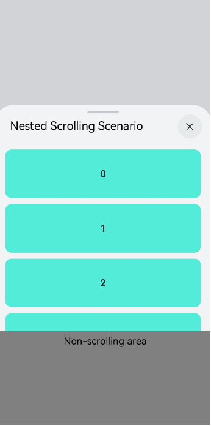
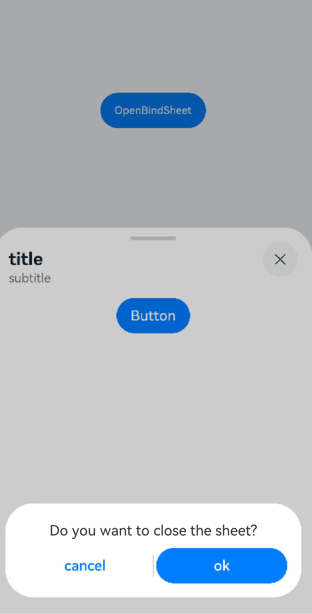
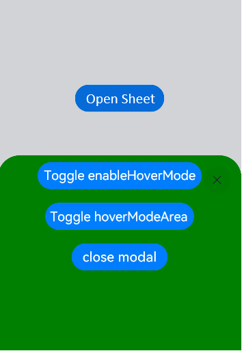

# Binding a Modal Sheet (bindSheet)
<!--Kit: ArkUI-->
<!--Subsystem: ArkUI-->
<!--Owner: @CCFFWW-->
<!--Designer: @CCFFWW-->
<!--Tester: @lxl007-->
<!--Adviser: @Brilliantry_Rui-->

A modal sheet, implemented using [bindSheet](../reference/apis-arkui/arkui-ts/ts-universal-attributes-sheet-transition.md#bindsheet), is a modal, non-full-screen popup interaction page by default, allowing parts of the underlying parent view to be visible. This helps users retain the context of their parent view while interacting with the sheet.

Modal sheets are suitable for displaying simple tasks or information panels, such as personal information, text introductions, sharing panels, creating schedules, and adding content. If a sheet needs to be displayed in a way that could potentially affect the parent view, it can be configured to use a non-modal interaction form.

Modal sheets have different form capabilities on devices of different widths. For details about the form requirements on devices with different widths, see the [preferType](../reference/apis-arkui/arkui-ts/ts-universal-attributes-sheet-transition.md#sheetoptions) property. You can use **bindSheet** to build modal sheet transition effects. For details, see [Modal Transition](arkts-modal-transition.md#creating-sheet-transition-with-bindsheet). For complex or lengthy user processes, consider other transition methods instead of modal sheets, such as [full-modal transition](arkts-contentcover-page.md) and [navigation transition](./arkts-navigation-animation.md).

## Constraints

 - When a [UIExtension](../reference/apis-arkui/js-apis-arkui-uiExtension.md) is embedded in a modal sheet, launching another modal sheet or popup window within the UIExtension is not allowed.

 - In scenarios without secondary confirmation or custom close behavior, avoid using the [shouldDismiss/onWillDismiss](../reference/apis-arkui/arkui-ts/ts-universal-attributes-sheet-transition.md#sheetoptions) API.

## Lifecycle

The modal sheet provides lifecycle callbacks to notify the application of its lifecycle status. These callbacks are triggered in the following order: onWillAppear -> onAppear -> onWillDisappear -> onDisappear.

| Name           |Type| Description                      |
| ----------------- | ------ | ---------------------------- |
| onWillAppear    | () => void | Callback for when the modal sheet is about to appear (before the animation starts).|
| onAppear    | () => void  | Callback for when the modal sheet appears (after the animation ends). |
| onWillDisappear | () => void | Callback for when the modal sheet is about to disappear (before the animation starts).|
| onDisappear |() => void  | Callback for when the modal sheet disappears (after the animation ends).    |

## Using Nested Scrolling

The priority of operations during scrolling in the content area of a modal sheet is as follows:

1. Content at the top and content that cannot be scrolled

   Swiping up: The modal sheet will attempt to expand upwards. If no expansion is possible, the content will scroll.

   Swiping down: The modal sheet will attempt to contract downwards. If no contraction is possible, the panel will close.
2. Content in the middle (scrollable both up and down)

   Swiping up or down: The content will scroll until it reaches the top or bottom of the panel.

3. Content at the bottom (scrollable)

   Swiping up: The content area will display a rebound effect without changing the panel position.

   Swiping down: The content will scroll until it reaches the top.

By default, the nested scrolling mode for the half-modal panel is as follows: {Forward: PARENT\_FIRST, Backward: SELF\_FIRST}

If you want to define a scrollable container, such as **List** or **Scroll**, in the panel content builder, and combine it with the modal sheet's interaction capabilities, you must set the nested scrolling attributes for the scrollable container in the vertical direction.

```ts
.nestedScroll({
    // Nested scrolling options for the scrollable component when it scrolls towards the end, with the gesture upwards.
    scrollForward: NestedScrollMode.PARENT_FIRST,
    // Nested scrolling options for the scrollable component when it scrolls towards the start, with the gesture downwards.
    scrollBackward: NestedScrollMode.SELF_FIRST,
})
```

The sample code is as follows:
<!-- @[Nested_scrolling_Sheet](https://gitcode.com/openharmony/applications_app_samples/blob/master/code/DocsSample/ArkUISample/BindSheet/entry/src/main/ets/pages/bindSheet/template10/SheetDemo.ets) -->

``` TypeScript

@Entry
@Component
struct SheetDemo {
  @State isShowSheet: boolean = false;
  private items: number[] = [0, 1, 2, 3, 4, 5, 6, 7, 8, 9];

  @Builder
  SheetBuilder() {
    Column() {
      // Step 1: Customize a scrollable container.
      List({ space: '10vp' }) {
        ForEach(this.items, (item: number) => {
          ListItem() {
            Text(String(item)).fontSize(16).fontWeight(FontWeight.Bold)
          }.width('90%').height('80vp').backgroundColor('#ff53ecd9').borderRadius(10)
        })
      }
      .alignListItem(ListItemAlign.Center)
      .margin({ top: '10vp' })
      .width('100%')
      .height('900px')
      // Step 2: Set the nested scrolling attributes of the scrollable component.
      .nestedScroll({
        scrollForward: NestedScrollMode.PARENT_FIRST,
        scrollBackward: NestedScrollMode.SELF_FIRST,
      })

      // Replace $r('app.string.tSheetBuilder_text1') with the actual resource file. In this example, the value in the resource file is "Non-scrolling area."
      Text($r('app.string.tSheetBuilder_text1'))
        .width('100%')
        .backgroundColor(Color.Gray)
        .layoutWeight(1)
        .textAlign(TextAlign.Center)
        .align(Alignment.Top)
    }.width('100%').height('100%')
  }

  build() {
    Column() {
      Button('Open Sheet').width('90%').height('80vp')
        .onClick(() => {
          this.isShowSheet = !this.isShowSheet;
        })
        .bindSheet($$this.isShowSheet, this.SheetBuilder(), {
          detents: [SheetSize.MEDIUM, SheetSize.LARGE, 600],
          preferType: SheetType.BOTTOM,
          // Replace $r('app.string.tSheetBuilder_text2') with the actual resource file. In this example, the value in the resource file is "Nested Scrolling Scenario."
          title: { title: $r('app.string.tSheetBuilder_text2') },
        })
    }.width('100%').height('100%')
    .justifyContent(FlexAlign.Center)
  }
}
```




## Secondary Confirmation Capability

To implement the secondary confirmation capability, you are advised to use the **onWillDismiss** API, with which you can handle secondary confirmation or custom close behavior in the callback.

> **NOTE**
>
> After the **onWillDismiss** API is declared, all dismiss operations of the modal sheet, including side swiping, touching the close button, touching the mask, and pulling down, must be implemented by calling the **dismiss** API. If this logic is not implemented, the modal sheet will not respond to the above dismiss operations.
<!-- @[onWillDismiss_Dismiss](https://gitcode.com/openharmony/applications_app_samples/blob/master/code/DocsSample/ArkUISample/BindSheet/entry/src/main/ets/pages/bindSheet/template11/OnWillDismiss_Dismiss.ets) -->

``` TypeScript
import { hilog } from '@kit.PerformanceAnalysisKit';

const TAG = '[Sample_SupportingAgingFriendly]';
const DOMAIN = 0xF811;
const BUNDLE = 'SupportingAgingFriendly_';

@Entry
@Component
struct OnWillDismiss_Dismiss {
  @State isShow: Boolean = false;

  @Builder
  myBuilder() {
    Column() {
      Button('Button')
    }
  }

  build() {
    Button('OpenBindSheet')
      .onClick(() => {
        this.isShow = true
      })
      .margin(120)
      .bindSheet($$this.isShow, this.myBuilder(), {
        height: SheetSize.MEDIUM,
        blurStyle: BlurStyle.Thick,
        dragBar: true,
        detents: [SheetSize.MEDIUM, SheetSize.LARGE],
        title: { title: 'title', subtitle: 'subtitle' },
        enableOutsideInteractive: false,
        onWillDismiss: ((dismissSheetAction: DismissSheetAction) => {
          // Step 2: Implement the secondary confirmation interaction, using an AlertDialog component to prompt the user for confirmation.
          this.getUIContext().showAlertDialog(
            {
              // Replace $r('app.string.bindContentCover_label2') with the actual resource file. In this example, the value in the resource file is "Example 2 (Custom Transition Animation)."
              message: $r('app.string.bindContentCover_label2'),
              autoCancel: true,
              alignment: DialogAlignment.Bottom,
              gridCount: 4,
              offset: { dx: 0, dy: -20 },
              primaryButton: {
                value: 'cancel',
                action: () => {
                  hilog.info(DOMAIN, TAG, 'Callback when the cancel button is clicked');
                }
              },
              secondaryButton: {
                enabled: true,
                defaultFocus: true,
                style: DialogButtonStyle.HIGHLIGHT,
                value: 'ok',
                // Step 3: Define the logic for closing the modal sheet within the AlertDialog button callback.
                action: () => {
                  // Step 4: Call dismiss() to close the modal sheet when the logic in step 3 is triggered.
                  dismissSheetAction.dismiss();
                  hilog.info(DOMAIN, TAG, 'Callback when the ok button is clicked');
                }
              },
              cancel: () => {
                hilog.info(DOMAIN, TAG, BUNDLE + 'onWillDismiss_Dismiss:' + 'AlertDialog Closed callbacks');
              }
            }
          )
        })
      })
  }
}
```




## Blocking Specific Dismiss Behavior

After the **onWillDismiss** API is declared, it takes control over all dismiss behaviors of the modal sheet. This means that the modal sheet can be dismissed only when you explicitly call the **dismiss** API. You can customize the dismissal logic using **if** statements or other logic.
For example, you might want the modal sheet to be dismissed only when the user swipes down. Here's how you can implement this:

```ts
onWillDismiss: ((DismissSheetAction: DismissSheetAction) => {
  if (DismissSheetAction.reason === DismissReason.SLIDE_DOWN) {
    DismissSheetAction.dismiss(); // Register the dismiss behavior.
  }
}),
```

To enhance the user experience during the swiping down action, you can use the **onWillSpringBackWhenDismiss** API.
Just like with **onWillDismiss**, after **onWillSpringBackWhenDismiss** is declared, the rebound operation during a swipe-down of the half-modal requires handling with **SpringBackAction.springBack()**; without this logic, no rebound will occur.

Here is the specific code to prevent the rebound effect when the modal sheet is swiped down:

```ts
onWillDismiss: ((DismissSheetAction: DismissSheetAction) => {
  if (DismissSheetAction.reason === DismissReason.SLIDE_DOWN) {
    DismissSheetAction.dismiss(); // Register the dismiss behavior.
  }
}),

onWillSpringBackWhenDismiss: ((SpringBackAction: SpringBackAction) => {
 // No springBack is registered, so the modal sheet will not bounce back when swiped down.
}),
```

## Implementing Center Axis Avoidance

Center axis avoidance is supported for modal sheets since API version 14. This capability is enabled by default on 2-in-1 devices (avoidance behavior is triggered only when the window is in waterfall mode), with the default avoidance area set to the upper half of the screen. You can actively configure whether to enable center axis avoidance using the **enableHoverMode** property in [SheetOptions](../reference/apis-arkui/arkui-ts/ts-universal-attributes-sheet-transition.md#sheetoptions), and specify the display area after avoidance using the **hoverModeArea** property.

- Center axis avoidance for modal sheets does not support the subwindow capability. This restriction applies to scenarios where **showInSubWindow** in [SheetOptions](../reference/apis-arkui/arkui-ts/ts-universal-attributes-sheet-transition.md#sheetoptions) is set to **true**.
- On 2-in-1 devices, center axis avoidance occurs only when the window is in waterfall mode.

The sample code is as follows:
<!-- @[SheetTransitionExample](https://gitcode.com/openharmony/applications_app_samples/blob/master/code/DocsSample/ArkUISample/BindSheet/entry/src/main/ets/pages/bindSheet/template12/SheetTransitionExample.ets) -->

``` TypeScript

@Entry
@Component
struct SheetTransitionExample {
  @State isShow: boolean = false;
  @State enableHoverMode: boolean = true;
  @State hoverModeArea: HoverModeAreaType = HoverModeAreaType.TOP_SCREEN;

  @Builder
  myBuilder() {
    Column() {
      // Replace $r('app.string.bindSheetCmd_label10') with the actual resource file. In this example, the value in the resource file is "Toggle enableHoverMode."
      Button($r('app.string.bindSheetCmd_label10'))
        .margin(10)
        .fontSize(20)
        .onClick(() => {
          this.enableHoverMode = !this.enableHoverMode;
        })

      // Replace $r('app.string.bindSheetCmd_label11') with the actual resource file. In this example, the value in the resource file is "Toggle hoverModeArea."
      Button($r('app.string.bindSheetCmd_label11'))
        .margin(10)
        .fontSize(20)
        .onClick(() => {
          this.hoverModeArea = this.hoverModeArea === HoverModeAreaType.TOP_SCREEN ?
            HoverModeAreaType.BOTTOM_SCREEN : HoverModeAreaType.TOP_SCREEN;
        })

      Button('close modal')
        .margin(10)
        .fontSize(20)
        .onClick(() => {
          this.isShow = false;
        })
    }
    .width('100%')
    .height('100%')
  }

  build() {
    Column() {
      //Replace $r('app.string.bindSheetCmd_label9') with the actual resource file. In this example, the value in the resource file is "Open Sheet."
      Button($r('app.string.bindSheetCmd_label9'))
        .onClick(() => {
          this.isShow = true;
        })
        .fontSize(20)
        .margin(10)
        .bindSheet($$this.isShow, this.myBuilder(), {
          height: 300,
          backgroundColor: Color.Green,
          preferType: SheetType.CENTER,
          enableHoverMode: this.enableHoverMode,
          hoverModeArea: this.hoverModeArea
        })
    }
    .justifyContent(FlexAlign.Center)
    .width('100%')
    .height('100%')
  }
}
```



