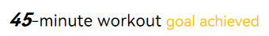
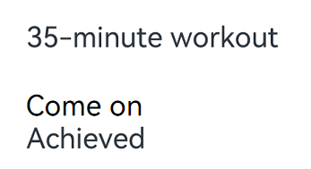

# Styled String (StyledString/MutableStyledString)
<!--Kit: ArkUI-->
<!--Subsystem: ArkUI-->
<!--Owner: @hddgzw-->
<!--Designer: @xiangyuan6-->
<!--Tester: @jiaoaozihao-->
<!--Adviser: @Brilliantry_Rui-->

Styled strings, implemented by **StyledString** or **MutableStyledString** (collectively referred to as **StyledString**, with **MutableStyledString** inheriting from **StyledString**), are powerful markup objects designed to set text styles at the character or paragraph level. By binding a **StyledString** object to a text component, you can modify the text in various ways, including changing the font size, adding font colors, making the text clickable, and customizing the drawing of text, among others. For details, see [Styled String](../reference/apis-arkui/arkui-ts/ts-universal-styled-string.md).

Styled strings provide a variety of style objects that cover various common text formatting styles, such as text decorative lines, line height, and text shadows. You can also create **CustomSpan** objects to apply custom styles.

## Creating and Applying a StyledString or MutableStyledString Object

  You can call the [setStyledString](../reference/apis-arkui/arkui-ts/ts-basic-components-text.md#setstyledstring12) method provided by **TextController** to attach styled strings to text components. It is recommended that you trigger binding in [onPageShow](../reference/apis-arkui/arkui-ts/ts-custom-component-lifecycle.md#onpageshow) or the [onAppear](../reference/apis-arkui/arkui-ts/ts-universal-events-show-hide.md#onappear) callback of text components.
  > **NOTE**
  >
  > Avoid calling the **setStyledString** API in **aboutToAppear**, as the component may have not yet been mounted to the node tree at the time **aboutToAppear** is executed, preventing the styled string text content from appearing upon page load.
  >
  > Since API version 15, styled string content can be displayed upon page load when **setStyledString** is called in **aboutToAppear**.

  <!-- @[createStyledString_start](https://gitcode.com/openharmony/applications_app_samples/blob/master/code/DocsSample/ArkUISample/TextComponent/entry/src/main/ets/pages/propertyString/CreateApply.ets) -->
  
  ``` TypeScript
  @Entry
  @Component
  struct styled_string_demo1 {
    // The value in the 'app.string.CreateApply_Text_Forty_Five' resource file is "45-minute workout."
    styledString1: StyledString = new StyledString(resource.resourceToString($r('app.string.CreateApply_Text_Forty_Five')));
    // The value in the 'app.string.CreateApply_Text_Third_Five' resource file is "35-minute workout."
    mutableStyledString1: MutableStyledString = new MutableStyledString(resource.resourceToString($r('app.string.CreateApply_Text_Third_Five')));
    controller1: TextController = new TextController();
    controller2: TextController = new TextController();
  
    async onPageShow() {
      // Bind the styled string in the onPageShow lifecycle callback.
      this.controller1.setStyledString(this.styledString1);
    }
  
    build() {
      Column() {
        // Display the styled string.
        Text(undefined, { controller: this.controller1 })
        Text(undefined, { controller: this.controller2 })
          .onAppear(() => {
            // Bind the styled string in the onAppear callback of the component.
            this.controller2.setStyledString(this.mutableStyledString1);
          })
      }
      .width('100%')
    }
  }
  ```

  

## Setting the Text Style

Styled strings offer multiple style objects, such as [TextStyle](../reference/apis-arkui/arkui-ts/ts-universal-styled-string.md#textstyle), [TextShadowStyle](../reference/apis-arkui/arkui-ts/ts-universal-styled-string.md#textshadowstyle), [DecorationStyle](../reference/apis-arkui/arkui-ts/ts-universal-styled-string.md#decorationstyle), [BaselineOffsetStyle](../reference/apis-arkui/arkui-ts/ts-universal-styled-string.md#baselineoffsetstyle), [LineHeightStyle](../reference/apis-arkui/arkui-ts/ts-universal-styled-string.md#lineheightstyle), and [LetterSpacingStyle](../reference/apis-arkui/arkui-ts/ts-universal-styled-string.md#letterspacingstyle), for setting text styles.

- Creating and applying a **TextStyle** object

  <!-- @[styledStringTextStyle_start](https://gitcode.com/openharmony/applications_app_samples/blob/master/code/DocsSample/ArkUISample/TextComponent/entry/src/main/ets/pages/propertyString/StyledStringTextStyle.ets) -->
  
  ``` TypeScript
  import { LengthMetrics } from '@kit.ArkUI';
  
  @Entry
  @Component
  struct styled_string_demo2 {
    @State str: string =
      this.getUIContext().getHostContext()?.resourceManager.getStringByNameSync('CreateApply_Text_3') as string;
    textStyleAttrs: TextStyle =
      new TextStyle({
        fontWeight: FontWeight.Bolder,
        fontSize: LengthMetrics.vp(24),
        fontStyle: FontStyle.Italic,
        strokeWidth: LengthMetrics.px(5),
        strokeColor: Color.Green
      });
    mutableStyledString: MutableStyledString = new MutableStyledString(this.str, [
      {
        start: 2,
        length: 2,
        styledKey: StyledStringKey.FONT,
        styledValue: this.textStyleAttrs
      },
      {
        start: 7,
        length: 4,
        styledKey: StyledStringKey.FONT,
        styledValue: new TextStyle({
          fontColor: Color.Orange, fontSize: LengthMetrics.vp(12),
          superscript: SuperscriptStyle.SUPERSCRIPT
        })
      }
    ]);
    controller: TextController = new TextController();
  
    async onPageShow() {
      this.controller.setStyledString(this.mutableStyledString);
    }
  
    build() {
      Column() {
        // Display the styled string.
        Text(undefined, { controller: this.controller })
          .margin({ top: 10 })
      }
      .width('100%')
    }
  }
  ```

  

- Creating and applying a **TextShadowStyle** object

  <!-- @[styledStringTextShadowStyle_start](https://gitcode.com/openharmony/applications_app_samples/blob/master/code/DocsSample/ArkUISample/TextComponent/entry/src/main/ets/pages/propertyString/StyledStringTextShadowStyle.ets) -->
  
  ``` TypeScript
  // xxx.ets
  @Entry
  @Component
  struct styled_string_demo3 {
    @State str: string =
      this.getUIContext().getHostContext()?.resourceManager.getStringByNameSync('CreateApply_Text_Third_Five') as string;
    mutableStyledString: MutableStyledString = new MutableStyledString(this.str, [
      {
        start: 0,
        length: 3,
        styledKey: StyledStringKey.TEXT_SHADOW,
        styledValue: new TextShadowStyle({
          radius: 5,
          type: ShadowType.COLOR,
          color: Color.Red,
          offsetX: 10,
          offsetY: 10
        })
      }
    ]);
    controller: TextController = new TextController();
  
    async onPageShow() {
      this.controller.setStyledString(this.mutableStyledString);
    }
  
    build() {
      Column() {
        // Display the styled string.
        Text(undefined, { controller: this.controller })
      }
      .width('100%')
    }
  }
  ```

  

- Creating and applying a **Text DecorationStyle** object

  <!-- @[styledStringDecorationStyle_start](https://gitcode.com/openharmony/applications_app_samples/blob/master/code/DocsSample/ArkUISample/TextComponent/entry/src/main/ets/pages/propertyString/StyledStringDecorationStyle.ets) -->
  
  ``` TypeScript
  // xxx.ets
  @Entry
  @Component
  struct styled_string_demo4 {
    @State str: string =
      this.getUIContext()
        .getHostContext()?.resourceManager.getStringByNameSync('CreateApply_Text_Third_Five') as string;
    mutableStyledString: MutableStyledString = new MutableStyledString(this.str, [
      {
        start: 0,
        length: 4,
        styledKey: StyledStringKey.DECORATION,
        styledValue: new DecorationStyle({ type: TextDecorationType.LineThrough, color: Color.Red, thicknessScale: 3 })
      },
      {
        start: 4,
        length: 2,
        styledKey: StyledStringKey.DECORATION,
        styledValue: new DecorationStyle(
          {
            type: TextDecorationType.Underline,
          },
          {
            // Enable multiple decoration lines.
            enableMultiType: true
          }
        )
      },
      {
        start: 4,
        length: 2,
        styledKey: StyledStringKey.DECORATION,
        styledValue: new DecorationStyle(
          {
            type: TextDecorationType.LineThrough,
          },
          {
            // Enable multiple decoration lines.
            enableMultiType: true
          }
        )
      },
    ]);
    controller: TextController = new TextController();
  
    async onPageShow() {
      this.controller.setStyledString(this.mutableStyledString);
    }
  
    build() {
      Column() {
        // Display the styled string.
        Text(undefined, { controller: this.controller })
      }
      .width('100%')
    }
  }
  ```

 

- Creating and applying a **Text BaselineOffsetStyle** object

  <!-- @[styledStringBaselineOffsetStyle_start](https://gitcode.com/openharmony/applications_app_samples/blob/master/code/DocsSample/ArkUISample/TextComponent/entry/src/main/ets/pages/propertyString/StyledStringBaselineOffsetStyle.ets) -->
  
  ``` TypeScript
  import { LengthMetrics } from '@kit.ArkUI';
  
  // xxx.ets
  @Entry
  @Component
  struct styled_string_demo5 {
    @State str: string =
      this.getUIContext().getHostContext()?.resourceManager.getStringByNameSync('CreateApply_Text_Third_Five') as string;
  
    mutableStyledString: MutableStyledString = new MutableStyledString(this.str, [
      {
        start: 0,
        length: 3,
        styledKey: StyledStringKey.BASELINE_OFFSET,
        styledValue: new BaselineOffsetStyle(LengthMetrics.px(20))
      }
    ]);
    controller: TextController = new TextController();
  
    async onPageShow() {
      this.controller.setStyledString(this.mutableStyledString);
    }
  
    build() {
      Column() {
        // Display the styled string.
        Text(undefined, { controller: this.controller })
      }
      .width('100%')
    }
  }
  ```

  

- Creating and applying a **LineHeightStyle** object

  <!-- @[styledStringLineHeightStyle_start](https://gitcode.com/openharmony/applications_app_samples/blob/master/code/DocsSample/ArkUISample/TextComponent/entry/src/main/ets/pages/propertyString/StyledStringLineHeightStyle.ets) -->
  
  ``` TypeScript
  import { LengthMetrics } from '@kit.ArkUI';
  
  // xxx.ets
  @Entry
  @Component
  struct styled_string_demo6 {
    @State str: string =
      this.getUIContext()
        .getHostContext()?.resourceManager.getStringByNameSync('StyledStringStyle_Text_5') as string;
    mutableStyledString: MutableStyledString = new MutableStyledString(this.str, [
      {
        start: 8,
        length: 3,
        styledKey: StyledStringKey.LINE_HEIGHT,
        styledValue: new LineHeightStyle(LengthMetrics.vp(50))
      }
    ]);
    controller: TextController = new TextController();
  
    async onPageShow() {
      this.controller.setStyledString(this.mutableStyledString);
    }
  
    build() {
      Column() {
        // Display the styled string.
        Text(undefined, { controller: this.controller })
      }
      .width('100%')
      .margin({ top: 10 })
    }
  }
  ```

  

- Creating and applying a **LetterSpacingStyle** object

  <!-- @[styledStringLetterSpacingStyle_start](https://gitcode.com/openharmony/applications_app_samples/blob/master/code/DocsSample/ArkUISample/TextComponent/entry/src/main/ets/pages/propertyString/StyledStringLetterSpacingStyle.ets) -->
  
  ``` TypeScript
  import { LengthMetrics, LengthUnit } from '@kit.ArkUI';
  
  // xxx.ets
  @Entry
  @Component
  struct styled_string_demo7 {
    @State str: string =
      this.getUIContext().getHostContext()?.resourceManager.getStringByNameSync('CreateApply_Text_Third_Five') as string;
    mutableStyledString: MutableStyledString = new MutableStyledString(this.str, [
      {
        start: 0,
        length: 2,
        styledKey: StyledStringKey.LETTER_SPACING,
        styledValue: new LetterSpacingStyle(new LengthMetrics(20, LengthUnit.VP))
      }
    ]);
    controller: TextController = new TextController();
  
    async onPageShow() {
      this.controller.setStyledString(this.mutableStyledString);
    }
  
    build() {
      Column() {
        // Display the styled string.
        Text(undefined, { controller: this.controller })
      }
      .width('100%')
    }
  }
  ```

  

## Setting the Paragraph Style

You can set the paragraph style using [ParagraphStyle](../reference/apis-arkui/arkui-ts/ts-universal-styled-string.md#paragraphstyle). The figure below shows how to divide paragraphs in the text, with each paragraph ending with a newline character \n.


The following example shows how to create and apply a paragraph style. The style is applied to the start, end or any position within a paragraph; it does not apply to non-paragraph areas.

  <!-- @[styledStringParagraphStyleOne_start](https://gitcode.com/openharmony/applications_app_samples/blob/master/code/DocsSample/ArkUISample/TextComponent/entry/src/main/ets/pages/propertyString/StyledStringParagraphStyleOne.ets) -->
  
  ``` TypeScript
  import { LengthMetrics} from '@kit.ArkUI';
  
  // xxx.ets
  @Entry
  @Component
  struct Index {
    @State str: string =
      this.getUIContext()
        .getHostContext()?.resourceManager.getStringByNameSync('StyledStringParagraphStyle_Text_1') as string;
    titleParagraphStyleAttr: ParagraphStyle = new ParagraphStyle({ textAlign: TextAlign.Center });
    // Create a paragraph style for a 15 vp first-line text indent.
    paragraphStyleAttr1: ParagraphStyle = new ParagraphStyle({ textIndent: LengthMetrics.vp(15) });
    // Line height style object
    lineHeightStyle1: LineHeightStyle = new LineHeightStyle(new LengthMetrics(24));
    // Create a paragraph style object paragraphStyledString1.
    paragraphStyledString1: MutableStyledString =
      new MutableStyledString(this.str, [
        {
          start: 0,
          length: 4,
          styledKey: StyledStringKey.PARAGRAPH_STYLE,
          styledValue: this.titleParagraphStyleAttr
        },
        {
          start: 0,
          length: 4,
          styledKey: StyledStringKey.LINE_HEIGHT,
          styledValue: new LineHeightStyle(new LengthMetrics(50))
        }, {
        start: 0,
        length: 4,
        styledKey: StyledStringKey.FONT,
        styledValue: new TextStyle({ fontSize: LengthMetrics.vp(24), fontWeight: FontWeight.Bolder })
      },
        {
          start: 5,
          length: 3,
          styledKey: StyledStringKey.PARAGRAPH_STYLE,
          styledValue: this.paragraphStyleAttr1
        },
        {
          start: 5,
          length: 20,
          styledKey: StyledStringKey.LINE_HEIGHT,
          styledValue: this.lineHeightStyle1
        }
      ]);
    controller: TextController = new TextController();
  
    async onPageShow() {
      this.controller.setStyledString(this.paragraphStyledString1);
    }
  
    build() {
      Column() {
        // Display the styled string.
        Text(undefined, { controller: this.controller })
      }
      .width('100%')
    }
  }
  ```

  
  In addition to presetting styles when creating a styled string, you can also clear the original styles and replace them with new ones later using the [replaceStyle](../reference/apis-arkui/arkui-ts/ts-universal-styled-string.md#replacestyle) API. After the replacement, you need to proactively trigger an update to the bound styled string on the attached text component's controller.

  <!-- @[styledStringReplaceParagraphStyle_start](https://gitcode.com/openharmony/applications_app_samples/blob/master/code/DocsSample/ArkUISample/TextComponent/entry/src/main/ets/pages/propertyString/StyledStringReplaceParagraphStyle.ets) -->
  
  ``` TypeScript
  import { LengthMetrics } from '@kit.ArkUI';
  
  // xxx.ets
  @Entry
  @Component
  struct Index {
    context = this.getUIContext().getHostContext();
    /* The value in the 'app.string.StyledStringParagraphStyle_Text_2' resource file is "Paragraph Title\nFirst paragraph starts 0123456789 First paragraph ends.
     Replace the original style with the new style through replaceStyle. */
    @State message1: string =
      this.context!.resourceManager.getStringSync($r('app.string.StyledStringParagraphStyle_Text_2').id);
    titleParagraphStyleAttr: ParagraphStyle = new ParagraphStyle({ textAlign: TextAlign.Center });
    // Create a paragraph style for a 15 vp first-line text indent.
    paragraphStyleAttr1: ParagraphStyle = new ParagraphStyle({ textIndent: LengthMetrics.vp(15) });
    // Line height style object
    lineHeightStyle1: LineHeightStyle = new LineHeightStyle(new LengthMetrics(24));
    // Create a paragraph style object paragraphStyledString1.
    paragraphStyledString1: MutableStyledString =
      new MutableStyledString(this.message1, [
        {
          start: 0,
          length: 4,
          styledKey: StyledStringKey.PARAGRAPH_STYLE,
          styledValue: this.titleParagraphStyleAttr
        },
        {
          start: 0,
          length: 4,
          styledKey: StyledStringKey.LINE_HEIGHT,
          styledValue: new LineHeightStyle(new LengthMetrics(50))
        }, {
        start: 0,
        length: 4,
        styledKey: StyledStringKey.FONT,
        styledValue: new TextStyle({ fontSize: LengthMetrics.vp(24), fontWeight: FontWeight.Bolder })
      },
        {
          start: 5,
          length: 3,
          styledKey: StyledStringKey.PARAGRAPH_STYLE,
          styledValue: this.paragraphStyleAttr1
        },
        {
          start: 5,
          length: 20,
          styledKey: StyledStringKey.LINE_HEIGHT,
          styledValue: this.lineHeightStyle1
        }
      ]);
    paragraphStyleAttr3: ParagraphStyle = new ParagraphStyle({
      textAlign: TextAlign.End,
      maxLines: 1,
      wordBreak: WordBreak.BREAK_ALL,
      overflow: TextOverflow.Ellipsis
    });
    controller: TextController = new TextController();
  
    async onPageShow() {
      this.controller.setStyledString(this.paragraphStyledString1);
    }
  
    build() {
      Column() {
        // Display the styled string.
        Text(undefined, { controller: this.controller }).width(300)
        // The value in the 'app.string.Replace_paragraph_style' resource file is "Replace Paragraph Style."
        Button($r('app.string.Replace_paragraph_style'))
          .onClick(() => {
            this.paragraphStyledString1.replaceStyle({
              start: 5,
              length: 3,
              styledKey: StyledStringKey.PARAGRAPH_STYLE,
              styledValue: this.paragraphStyleAttr3
            });
            this.controller.setStyledString(this.paragraphStyledString1);
          })
      }
      .width('100%')
    }
  }
  ```


## Converting a Styled String into a Paragraph

You can use [getParagraphs](../reference/apis-arkui/arkts-apis-uicontext-measureutils.md#getparagraphs20) to convert styled strings into corresponding [Paragraph](../reference/apis-arkgraphics2d/js-apis-graphics-text.md#paragraph) arrays based on text layout options.

- The following example demonstrates how to use the **getParagraphs** API from **MeasureUtils** to measure text. When the content exceeds the maximum number of display lines, the text is truncated and displays a "... Full Text" indicator.

  <!-- @[styledStringConvertedToParagraph_start](https://gitcode.com/openharmony/applications_app_samples/blob/master/code/DocsSample/ArkUISample/TextComponent/entry/src/main/ets/pages/propertyString/StyledStringConvertedToParagraph.ets) -->
  
  ``` TypeScript
  import { LengthMetrics } from '@kit.ArkUI';
  import { drawing } from '@kit.ArkGraphics2D';
  
  class MyCustomSpan extends CustomSpan {
    constructor(word: string, width: number, height: number, context: UIContext) {
      super();
      this.word = word;
      this.width = width;
      this.height = height;
      this.context = context;
    }
  
    onMeasure(measureInfo: CustomSpanMeasureInfo): CustomSpanMetrics {
      return { width: this.width, height: this.height };
    }
  
    onDraw(context: DrawContext, options: CustomSpanDrawInfo) {
      let canvas = context.canvas;
      const brush = new drawing.Brush();
      brush.setColor({
        alpha: 255,
        red: 0,
        green: 74,
        blue: 175
      });
      const font = new drawing.Font();
      font.setSize(25);
      const textBlob = drawing.TextBlob.makeFromString(this.word, font, drawing.TextEncoding.TEXT_ENCODING_UTF8);
      canvas.attachBrush(brush);
      canvas.drawRect({
        left: options.x + 10,
        right: options.x + this.context.vp2px(this.width) - 10,
        top: options.lineTop + 10,
        bottom: options.lineBottom - 10
      });
      brush.setColor({
        alpha: 255,
        red: 23,
        green: 169,
        blue: 141
      });
      canvas.attachBrush(brush);
      canvas.drawTextBlob(textBlob, options.x + 20, options.lineBottom - 15);
      canvas.detachBrush();
    }
  
    setWord(word: string) {
      this.word = word;
    }
  
    public width: number = 160;
    public word: string = 'drawing';
    public height: number = 10;
    public context: UIContext;
  }
  
  @Entry
  @Component
  struct Index {
    @State fullText: string =
      this.getUIContext().getHostContext()?.resourceManager.getStringByNameSync('Full_text') as string;
    @State originalText: string =
      this.getUIContext().getHostContext()?.resourceManager.getStringByNameSync('Original_text') as string;
    @State afterTypesetting: string =
      this.getUIContext().getHostContext()?.resourceManager.getStringByNameSync('After_typesetting') as string;
    str: string =
      'Four score and seven years ago our fathers brought forth on this continent, a new nation, conceived in Liberty, and dedicated to the proposition that all men are created equal.';
    mutableStr2 = new MutableStyledString(this.str, [
      {
        start: 0,
        length: 3,
        styledKey: StyledStringKey.FONT,
        styledValue: new TextStyle({ fontSize: LengthMetrics.px(20) })
      },
      {
        start: 3,
        length: 3,
        styledKey: StyledStringKey.FONT,
        styledValue: new TextStyle({ fontColor: Color.Brown })
      }
    ]);
  
    // Measure the number of lines a styled string can display within a specified width.
    getLineNum(styledString: StyledString, width: LengthMetrics) {
      let paragraphArr = this.getUIContext().getMeasureUtils().getParagraphs(styledString, { constraintWidth: width });
      let res = 0;
      for (let i = 0; i < paragraphArr.length; ++i) {
        res += paragraphArr[i].getLineCount();
      }
      return res;
    }
  
    // Determine the maximum character count that can be displayed in maxLines for a styled string.
    getCorrectIndex(styledString: MutableStyledString, maxLines: number, width: LengthMetrics) {
      let low = 0;
      let high = styledString.length - 1;
      // Use binary search.
      while (low <= high) {
        let mid = (low + high) >> 1;
        console.info('demo: get ' + low + ' ' + high + ' ' + mid);
        let moreStyledString = new MutableStyledString(this.fullText, [{
          start: 4,
          length: 2,
          styledKey: StyledStringKey.FONT,
          styledValue: new TextStyle({ fontColor: Color.Blue })
        }]);
        moreStyledString.insertStyledString(0, styledString.subStyledString(0, mid));
        let lineNum = this.getLineNum(moreStyledString, LengthMetrics.px(500));
        if (lineNum <= maxLines) {
          low = mid + 1;
        } else {
          high = mid - 1;
        }
      }
      return high;
    }
  
    mutableStrAllContent = new MutableStyledString(this.str, [
      {
        start: 0,
        length: 3,
        styledKey: StyledStringKey.FONT,
        styledValue: new TextStyle({ fontSize: LengthMetrics.px(40) })
      },
      {
        start: 3,
        length: 3,
        styledKey: StyledStringKey.FONT,
        styledValue: new TextStyle({ fontColor: Color.Brown })
      }
    ]);
    customSpan1: MyCustomSpan = new MyCustomSpan('Hello', 120, 10, this.getUIContext());
    mutableStrAllContent2 = new MutableStyledString(this.str, [
      {
        start: 0,
        length: 3,
        styledKey: StyledStringKey.FONT,
        styledValue: new TextStyle({ fontSize: LengthMetrics.px(100) })
      },
      {
        start: 3,
        length: 3,
        styledKey: StyledStringKey.FONT,
        styledValue: new TextStyle({ fontColor: Color.Brown })
      }
    ]);
    controller: TextController = new TextController();
    controller2: TextController = new TextController();
    textController: TextController = new TextController();
    textController2: TextController = new TextController();
  
    aboutToAppear() {
      this.mutableStrAllContent2.insertStyledString(0, new StyledString(this.customSpan1));
      this.mutableStr2.insertStyledString(0, new StyledString(this.customSpan1));
    }
  
    build() {
      Scroll() {
        Column() {
          Text(this.originalText)
          Text(undefined, { controller: this.controller }).width('500px').onAppear(() => {
            this.controller.setStyledString(this.mutableStrAllContent);
          })
          Divider().strokeWidth(8).color('#F1F3F5')
          Text(this.afterTypesetting)
          Text(undefined, { controller: this.textController }).onAppear(() => {
            let now = this.getCorrectIndex(this.mutableStrAllContent, 3, LengthMetrics.px(500));
            if (now != this.mutableStrAllContent.length - 1) {
              let moreStyledString = new MutableStyledString(this.fullText, [{
                start: 4,
                length: 2,
                styledKey: StyledStringKey.FONT,
                styledValue: new TextStyle({ fontColor: Color.Blue })
              }]);
              moreStyledString.insertStyledString(0, this.mutableStrAllContent.subStyledString(0, now));
              this.textController.setStyledString(moreStyledString);
            } else {
              this.textController.setStyledString(this.mutableStrAllContent);
            }
          })
            .width('500px')
          Divider().strokeWidth(8).color('#F1F3F5')
          Text(this.originalText)
          Text(undefined, { controller: this.controller2 }).width('500px').onAppear(() => {
            this.controller2.setStyledString(this.mutableStrAllContent2);
          })
          Divider().strokeWidth(8).color('#F1F3F5')
          Text(this.afterTypesetting)
          Text(undefined, { controller: this.textController2 }).onAppear(() => {
            let now = this.getCorrectIndex(this.mutableStrAllContent2, 3, LengthMetrics.px(500));
            let moreStyledString = new MutableStyledString(this.fullText, [{
              start: 4,
              length: 2,
              styledKey: StyledStringKey.FONT,
              styledValue: new TextStyle({ fontColor: Color.Blue })
            }]);
            moreStyledString.insertStyledString(0, this.mutableStrAllContent2.subStyledString(0, now));
            this.textController2.setStyledString(moreStyledString);
          })
            .width('500px')
        }.width('100%')
      }
    }
  }
  ```


## Using Images

You can add images using [ImageAttachment](../reference/apis-arkui/arkui-ts/ts-universal-styled-string.md#imageattachment).

The following example shows how to attach images and text to the same **MutableStyledString** object for mixed display of text and images.

> **NOTE**
>
> In the [constructor](../reference/apis-arkui/arkui-ts/ts-universal-styled-string.md#constructor) of styled strings, when input parameters are of ImageAttachment or CustomSpan type, the **styles** parameter does not take effect. To apply styles, use methods such as [setStyle](../reference/apis-arkui/arkui-ts/ts-universal-styled-string.md#setstyle) and [insertStyledString](../reference/apis-arkui/arkui-ts/ts-universal-styled-string.md#insertstyledstring).

  <!-- @[styledStringImageAttachment_start](https://gitcode.com/openharmony/applications_app_samples/blob/master/code/DocsSample/ArkUISample/TextComponent/entry/src/main/ets/pages/propertyString/StyledStringImageAttachment.ets) -->
  
  ``` TypeScript
  // xxx.ets
  import { image } from '@kit.ImageKit';
  import { LengthMetrics } from '@kit.ArkUI';
  
  @Entry
  @Component
  export struct StyledStringImageAttachment {
    @State abled: boolean = true;
    @State message: string = 'Hello World';
    imagePixelMap: image.PixelMap | undefined = undefined;
    @State imagePixelMap3: image.PixelMap | undefined = undefined;
    mutableStr: MutableStyledString = new MutableStyledString('123');
    controller: TextController = new TextController();
    mutableStr2: MutableStyledString = new MutableStyledString('This is set decoration line style to the mutableStr2', [{
      start: 0,
      length: 15,
      styledKey: StyledStringKey.DECORATION,
      styledValue: new DecorationStyle({
        type: TextDecorationType.Overline,
        color: Color.Orange,
        style: TextDecorationStyle.DOUBLE
      })
    }]);
  
    async aboutToAppear() {
      console.info('aboutToAppear initial imagePixelMap');
      // Replace $r('app.media.sea') with the image resource file you use.
      this.imagePixelMap = await this.getPixmapFromMedia($r('app.media.sea'));
    }
  
    private async getPixmapFromMedia(resource: Resource) {
      let unit8Array = await this.getUIContext().getHostContext()?.resourceManager?.getMediaContent(resource.id);
      let imageSource = image.createImageSource(unit8Array?.buffer?.slice(0, unit8Array?.buffer?.byteLength));
      let createPixelMap: image.PixelMap = await imageSource.createPixelMap({
        desiredPixelFormat: image.PixelMapFormat.RGBA_8888
      });
      await imageSource.release();
      return createPixelMap;
    }
  
    leadingMarginValue: ParagraphStyle = new ParagraphStyle({ leadingMargin: LengthMetrics.vp(5)});
    // Line height style object
    lineHeightStyle1: LineHeightStyle= new LineHeightStyle(new LengthMetrics(24));
    // Bold style
    boldTextStyle: TextStyle = new TextStyle({ fontWeight: FontWeight.Bold });
    // Create a paragraph style object paragraphStyledString1.
    // The value in the 'app.string.StyledStringImageAttachment_Text_1' resource file is "\n30 HD prints\nCYN5.15 off Limited offer."
    paragraphStyledString1: MutableStyledString =
      new MutableStyledString(resource.resourceToString($r('app.string.StyledStringImageAttachment_Text_1')), [
      {
        start: 0,
        length: 28,
        styledKey: StyledStringKey.PARAGRAPH_STYLE,
        styledValue: this.leadingMarginValue
      },
      {
        start: 14,
        length: 9,
        styledKey: StyledStringKey.FONT,
        styledValue: new TextStyle({ fontSize: LengthMetrics.vp(14), fontColor: '#B22222' })
      },
      {
        start: 24,
        length: 4,
        styledKey: StyledStringKey.FONT,
        styledValue: new TextStyle({ fontSize: LengthMetrics.vp(14), fontWeight: FontWeight.Lighter })
      },
      {
        start: 11,
        length: 4,
        styledKey: StyledStringKey.LINE_HEIGHT,
        styledValue: this.lineHeightStyle1
      }
    ]);
    // The value in the 'app.string.StyledStringImageAttachment_Text_2' resource file is "\n¥16.21 3000+ reviews."
    paragraphStyledString2: MutableStyledString =
      new MutableStyledString(resource.resourceToString($r('app.string.StyledStringImageAttachment_Text_2')), [
      {
        start: 0,
        length: 5,
        styledKey: StyledStringKey.PARAGRAPH_STYLE,
        styledValue: this.leadingMarginValue
      },
      {
        start: 0,
        length: 4,
        styledKey: StyledStringKey.LINE_HEIGHT,
        styledValue: new LineHeightStyle(new LengthMetrics(60))
      },
      {
        start: 0,
        length: 7,
        styledKey: StyledStringKey.FONT,
        styledValue: this.boldTextStyle
      },
      {
        start: 1,
        length: 1,
        styledKey: StyledStringKey.FONT,
        styledValue: new TextStyle({ fontSize: LengthMetrics.vp(18) })
      },
      {
        start: 2,
        length: 2,
        styledKey: StyledStringKey.FONT,
        styledValue: new TextStyle({ fontSize: LengthMetrics.vp(36) })
      },
      {
        start: 4,
        length: 3,
        styledKey: StyledStringKey.FONT,
        styledValue: new TextStyle({ fontSize: LengthMetrics.vp(20) })
      },
      {
        start: 7,
        length: 9,
        styledKey: StyledStringKey.FONT,
        styledValue: new TextStyle({ fontColor: Color.Grey, fontSize: LengthMetrics.vp(14)})
      }
    ]);
  
    build() {
      NavDestination() {
        Column({ space: 12 }) {
          // The value in the 'app.string.StyledStringImageAttachment_title' resource file is "Add Image via ImageAttachment."
          ComponentCard({ title: $r('app.string.StyledStringImageAttachment_title') }) {
            Row() {
              Column({ space: 10 }) {
                Text(undefined, { controller: this.controller })
                  .id('text1')
                  .copyOption(CopyOptions.InApp)
                  .draggable(true)
                  .backgroundColor('#FFFFFF')
                  .borderRadius(5)
                // The value in the 'app.string.StyledStringImageAttachment_Button_1' resource file is "View Product Details."
                Button($r('app.string.StyledStringImageAttachment_Button_1'))
                  .enabled(this.abled)
                  .onClick(() => {
                    if (this.imagePixelMap !== undefined) {
                      this.mutableStr = new MutableStyledString(new ImageAttachment({
                        value: this.imagePixelMap,
                        size: { width: 180, height: 160 },
                        verticalAlign: ImageSpanAlignment.BASELINE,
                        objectFit: ImageFit.Fill
                      }));
                      this.paragraphStyledString1.appendStyledString(this.paragraphStyledString2);
                      this.mutableStr.appendStyledString(this.paragraphStyledString1);
                      this.controller.setStyledString(this.mutableStr);
                    }
                    this.abled = false;
                  })
              }
              .width('100%')
            }
            .height('100%')
            .backgroundColor('#F8F8FF')
          }
        }
        .width('100%')
        .height('100%')
        .padding({ left: 12, right: 12 })
      }
      .backgroundColor('#f1f2f3')
      // The value in the 'app.string.StyledStringImageAttachment_title' resource file is "Add Image via ImageAttachment."
      .title($r('app.string.StyledStringImageAttachment_title'))
    }
  }
  ```

  

## Setting Events

You can use [GestureStyle](../reference/apis-arkui/arkui-ts/ts-universal-styled-string.md#gesturestyle) to set up **onClick** and **onLongPress** events to enable text to respond to click and long-press actions.

In addition to initializing styled strings with initial style objects, you can also use the [setStyle](../reference/apis-arkui/arkui-ts/ts-universal-styled-string.md#setstyle) API to overlay new styles or update existing ones. After making changes, you need to manually trigger an update of the bound styled string on the attached text component's controller. 

  <!-- @[styledStringGestureStyle_start](https://gitcode.com/openharmony/applications_app_samples/blob/master/code/DocsSample/ArkUISample/TextComponent/entry/src/main/ets/pages/propertyString/StyledStringGestureStyle.ets) -->
  
  ``` TypeScript
  import { drawing } from '@kit.ArkGraphics2D';
  
  let gUIContext: UIContext;
  
  class MyCustomSpan extends CustomSpan {
    constructor(word: string, width: number, height: number, fontSize: number) {
      super();
      this.word = word;
      this.width = width;
      this.height = height;
      this.fontSize = fontSize;
    }
  
    onMeasure(measureInfo: CustomSpanMeasureInfo): CustomSpanMetrics {
      return { width: this.width, height: this.height };
    }
  
    onDraw(context: DrawContext, options: CustomSpanDrawInfo) {
      let canvas = context.canvas;
  
      const brush = new drawing.Brush();
      brush.setColor({
        alpha: 255,
        red: 0,
        green: 0,
        blue: 0
      });
      const font = new drawing.Font();
      font.setSize(gUIContext.vp2px(this.fontSize));
      const textBlob =
        drawing.TextBlob.makeFromString(this.word.substring(0, 5), font, drawing.TextEncoding.TEXT_ENCODING_UTF8);
      canvas.attachBrush(brush);
  
      this.onDrawRectByRadius(context, options.x, options.x + gUIContext.vp2px(this.width), options.lineTop,
        options.lineBottom, 20);
      brush.setColor({
        alpha: 255,
        red: 255,
        green: 255,
        blue: 255
      });
      canvas.attachBrush(brush);
      canvas.drawTextBlob(textBlob, options.x, options.lineBottom - 30);
      brush.setColor({
        alpha: 255,
        red: 255,
        green: 228,
        blue: 196
      });
      canvas.attachBrush(brush);
      const textBlob1 =
        drawing.TextBlob.makeFromString(this.word.substring(5), font, drawing.TextEncoding.TEXT_ENCODING_UTF8);
      canvas.drawTextBlob(textBlob1, options.x + gUIContext.vp2px(100), options.lineBottom - 30);
  
      canvas.detachBrush();
    }
  
    onDrawRectByRadius(context: DrawContext, left: number, right: number, top: number, bottom: number, radius: number) {
      let canvas = context.canvas;
      let path = new drawing.Path();
  
      // Draw a rounded rectangle.
      path.moveTo(left + radius, top);
      path.lineTo(right - radius, top);
      path.arcTo(right - 2 * radius, top, right, top + 2 * radius, 270, 90);
      path.lineTo(right, bottom - radius);
      path.arcTo(right - 2 * radius, bottom - 2 * radius, right, bottom, 0, 90);
  
      path.lineTo(left + 2 * radius, bottom);
      path.arcTo(left, bottom - 2 * radius, left + 2 * radius, bottom, 90, 90);
      path.lineTo(left, top + 2 * radius);
      path.arcTo(left, top, left + 2 * radius, top + 2 * radius, 180, 90);
  
      canvas.drawPath(path);
    }
  
    setWord(word: string) {
      this.word = word;
    }
  
    public width: number = 160;
    public word: string = 'drawing';
    public height: number = 10;
    public fontSize: number = 16;
  }
  
  @Entry
  @Component
  export struct StyledStringGestureStyle {
    customSpan3: MyCustomSpan = new MyCustomSpan('99VIP88%off', 200, 40, 30);
    customSpanStyledString: MutableStyledString = new MutableStyledString(this.customSpan3);
    textController: TextController = new TextController();
    isPageShow: boolean = true;
    @State backgroundColor1: ResourceColor | undefined = undefined;
    gestureStyleAttr: GestureStyle = new GestureStyle({
      onClick: () => {
        this.backgroundColor1 = Color.Green;
      },
      onLongPress: () => {
        this.backgroundColor1 = Color.Grey;
      }
    });
  
    aboutToAppear() {
      gUIContext = this.getUIContext();
    }
  
    async onPageShow() {
      if (!this.isPageShow) {
        return;
      }
      this.isPageShow = false;
      this.customSpanStyledString.setStyle({
        start: 0,
        length: 1,
        styledKey: StyledStringKey.GESTURE,
        styledValue: this.gestureStyleAttr
      })
      this.textController.setStyledString(this.customSpanStyledString);
    }
  
    build() {
      NavDestination() {
        Column({ space: 12 }) {
          // The value in the 'app.string.TStyledStringGestureStyle_title' resource file is 'Set Event.'
          ComponentCard({ title: $r('app.string.TStyledStringGestureStyle_title') }) {
            Row() {
              Column() {
                // The value in the 'app.string.StyledStringGestureStyle_button_content' resource file is 'Change Background Color in Response to Event.'
                Button($r('app.string.StyledStringGestureStyle_button_content'))
                  .backgroundColor(this.backgroundColor1)
                  .width('80%')
                  .margin(10)
                Text(undefined, { controller: this.textController })
                  .id('text1')
                  .copyOption(CopyOptions.InApp)
                  .fontSize(30)
              }
              .width('100%')
            }
            .height('100%')
          }
        }
        .width('100%')
        .height('100%')
        .padding({ left: 12, right: 12 })
      }
      .backgroundColor('#f1f2f3')
      // The value in the 'app.string.TStyledStringGestureStyle_title' resource file is 'Set Event.'
      .title($r('app.string.TStyledStringGestureStyle_title'))
    }
  }
  ```


## Format Conversion

You can use the [toHtml](../reference/apis-arkui/arkui-ts/ts-universal-styled-string.md#tohtml14) and [fromHtml](../reference/apis-arkui/arkui-ts/ts-universal-styled-string.md#fromhtml) APIs to convert between styled strings and HTML-formatted strings. Currently supported HTML tags include: \<p>, \<span>, \, \<br>, \<strong>, \<b>, \<a>, \<i>, \<em>, \<s>, \<u>, \<del>, \<sup>, and \<sub>.

- The following example shows how to convert between styled strings and HTML-formatted strings.

<!-- @[styledStringHtml_start](https://gitcode.com/openharmony/applications_app_samples/blob/master/code/DocsSample/ArkUISample/TextComponent/entry/src/main/ets/pages/propertyString/StyledStringHtml.ets) -->

``` TypeScript
// xxx.ets
import { image } from '@kit.ImageKit';
import { LengthMetrics } from '@kit.ArkUI';

@Entry
@Component
export struct StyledStringHtml {
  imagePixelMap: image.PixelMap | undefined = undefined;
  @State html: string | undefined = undefined;
  @State styledString: StyledString | undefined = undefined;
  controller1: TextController = new TextController;
  controller2: TextController = new TextController;
  private uiContext: UIContext = this.getUIContext();

  async aboutToAppear() {
    console.info('aboutToAppear initial imagePixelMap');
    this.imagePixelMap = await this.getPixmapFromMedia($r('app.media.startIcon'));
  }

  private async getPixmapFromMedia(resource: Resource) {
    let unit8Array = await this.uiContext.getHostContext()?.resourceManager?.getMediaContent(resource.id);
    let imageSource = image.createImageSource(unit8Array?.buffer.slice(0, unit8Array.buffer.byteLength));
    let createPixelMap: image.PixelMap = await imageSource.createPixelMap({
      desiredPixelFormat: image.PixelMapFormat.RGBA_8888
    });
    await imageSource.release();
    return createPixelMap;
  }

  build() {
    NavDestination() {
      Column({ space: 12 }) {
        // The value in the 'app.string.StyledStringHtml_title' resource file is "Convet Format."
        ComponentCard({ title: $r('app.string.StyledStringHtml_title') }) {
          Column() {
            Text(undefined, { controller: this.controller1 }).height(100)
            Row() {
              // The value in the 'app.string.StyledStringHtml_Button_1' resource file is "Add Styled String."
              Button($r('app.string.StyledStringHtml_Button_1')).onClick(() => {
                // The value in the 'app.string.StyledStringHtml_Text_1' resource file is "Styled string."
                let mutableStyledString1: MutableStyledString =
                  new MutableStyledString(resource.resourceToString($r('app.string.StyledStringHtml_Text_1')), [{
                  start: 0,
                  length: 6,
                  styledKey: StyledStringKey.FONT,
                  styledValue: new TextStyle({ fontColor: Color.Green, fontSize: LengthMetrics.px(50) })
                }]);
                if (this.imagePixelMap !== undefined) {
                  let mutableStyledString2 = new MutableStyledString(new ImageAttachment({
                    value: this.imagePixelMap,
                    size: { width: 50, height: 50 },
                  }));
                  mutableStyledString1.appendStyledString(mutableStyledString2);
                }
                this.styledString = mutableStyledString1;
                this.controller1.setStyledString(mutableStyledString1);
              }).margin(5)
              // The value in the 'app.string.StyledStringHtml_Button_2' resource file is "toHtml."
              Button($r('app.string.StyledStringHtml_Button_2')).onClick(() => {
                this.html = StyledString.toHtml(this.styledString);
              }).margin(5)
              // The value in the 'app.string.StyledStringHtml_Button_3' resource file is "fromHtml."
              Button($r('app.string.StyledStringHtml_Button_3')).onClick(async () => {
                let styledString = await StyledString.fromHtml(this.html);
                this.controller2.setStyledString(styledString);
              }).margin(5)
            }

            Text(undefined, { controller: this.controller2 }).height(100)
            Text(this.html)
          }.width('100%')
        }
      }
      .width('100%')
      .height('100%')
      .padding({ left: 12, right: 12 })
    }
    .backgroundColor('#f1f2f3')
    // The value in the 'app.string.StyledStringHtml_title' resource file is "Convet Format."
    .title($r('app.string.StyledStringHtml_title'))
  }
}
```


- Convert HTML tags including \<strong>, \<b>, \<a>, \<i>, \<em>, \<s>, \<u>, \<del>, \<sup>, and \<sub>, along with the **background-color** attribute in HTML style attributes, to styled strings and convert them back to HTML format.
 
  <!-- @[styledStringHtmlOne_start](https://gitcode.com/openharmony/applications_app_samples/blob/master/code/DocsSample/ArkUISample/TextComponent/entry/src/main/ets/pages/propertyString/StyledStringHtmlOne.ets) -->
  
  ``` TypeScript
  // xxx.ets
  @Entry
  @Component
  struct HtmlSpanStringDemo {
    @State html: string =
      "<p>This is <b>b</b> <strong>strong</strong> <em>em</em> <i>i</i> <u>u</u> <del>del</del> <s>s</s> <span style =   \"foreground-color:blue\"> <a href='https://www.example.com'>www.example</a> </span> <span   style=\"background-color: red;\">red span</span> <sup>superscript</sup> and <sub>subscript</sub></p>";
    @State spanString: StyledString | undefined = undefined;
    @State resultText: string = ''; // Store conversion results.
    controller: TextController = new TextController;
  
    build() {
      Column() {
        // Display the spanString after conversion.
        Text(undefined, { controller: this.controller }).height(100).id('text1')
  
        // Display each step result in the text area.
        TextArea({ text: this.html })
          .width('100%')
          .height(100)
          .margin(5)
  
        // Button 1: Convert HTML to SpanString
        // The value in the 'app.string.Converted_HTML_to_SpanString' resource file is "Converted HTML to SpanString."
        Button($r('app.string.Converted_HTML_to_SpanString')).onClick(async () => {
          this.spanString = await StyledString.fromHtml(this.html);
          this.controller.setStyledString(this.spanString);
          this.resultText = 'Converted HTML to SpanString successfully.';
        }).margin(5)
  
        // Button 2: Convert SpanString to HTML
        // The value in the 'app.string.Converted_SpanString_to_HTML' resource file is "Converted SpanString to HTML."
        Button($r('app.string.Converted_SpanString_to_HTML')).onClick(() => {
          if (this.spanString) {
            // Convert spanString to HTML and update state if content changes.
            const newHtml = StyledString.toHtml(this.spanString);
            if (newHtml !== this.html) { // Avoid redundant updates.
              this.html = newHtml;
            }
            this.resultText = 'Converted SpanString to HTML successfully.';
          } else {
            this.resultText = 'SpanString is undefined.';
          }
        }).margin(5)
  
        // Button 3: Convert HTML back to SpanString.
        // The value in the 'app.string.Converted_HTML_back_to_SpanString' resource file is "Converted HTML back to SpanString."
        Button($r('app.string.Converted_HTML_back_to_SpanString')).onClick(async () => {
          this.spanString = await StyledString.fromHtml(this.html);
          this.controller.setStyledString(this.spanString);
          this.resultText = 'Converted HTML back to SpanString successfully.';
        }).margin(5)
  
        // Reset: Restore HTML and SpanString.
        // The value in the 'app.string.Reset' resource file is "Reset."
        Button($r('app.string.Reset')).onClick(() => {
          this.html =
            "<p>This is <b>b</b> <strong>strong</strong> <em>em</em> <i>i</i> <u>u</u> <del>del</del> <s>s</s> <span   style = \"foreground-color:blue\"> <a href='https://www.example.com'>www.example</a> </span> <span   style=\"background-color: red;\">red span</span> <sup>superscript</sup> and <sub>subscript</sub></p>";
          this.spanString = undefined;
          this.controller.setStyledString(new StyledString('')); // Use an empty StyledString.
          this.resultText = 'Reset HTML and SpanString successfully.';
        }).margin(5)
      }.width('100%').padding(20)
    }
  }
  ```

  

## Example

This example shows how to implement an expired membership notification using **ParagraphStyle**, **LineHeightStyle**, and **TextStyle** objects.

<!-- @[styledStringSceneExample_start](https://gitcode.com/openharmony/applications_app_samples/blob/master/code/DocsSample/ArkUISample/TextComponent/entry/src/main/ets/pages/propertyString/StyledStringSceneExample.ets) -->

``` TypeScript
import { LengthMetrics } from '@kit.ArkUI';

@Entry
@Component
export struct StyledStringSceneExample {
  alignCenterParagraphStyleAttr: ParagraphStyle = new ParagraphStyle({ textAlign: TextAlign.Center });
  // Line height style object
  lineHeightStyle1: LineHeightStyle = new LineHeightStyle(LengthMetrics.vp(24));
  // Bold style
  boldTextStyle: TextStyle = new TextStyle({ fontWeight: FontWeight.Bold });
  // Create a paragraph style object paragraphStyledString1.
  // The value in the 'app.string.StyledStringSceneExample_Text_1' resource file is "Diamond Membership expired\nRenew to keep your perks."
  paragraphStyledString1: MutableStyledString =
    new MutableStyledString(resource.resourceToString($r('app.string.StyledStringSceneExample_Text_1')), [
      {
        start: 0,
        length: 4,
        styledKey: StyledStringKey.PARAGRAPH_STYLE,
        styledValue: this.alignCenterParagraphStyleAttr
      },
      {
        start: 0,
        length: 4,
        styledKey: StyledStringKey.LINE_HEIGHT,
        styledValue: new LineHeightStyle(LengthMetrics.vp(40))
      },
      {
        start: 11,
        length: 14,
        styledKey: StyledStringKey.FONT,
        styledValue: new TextStyle({ fontSize: LengthMetrics.vp(14), fontColor: Color.Grey })
      },
      {
        start: 11,
        length: 4,
        styledKey: StyledStringKey.PARAGRAPH_STYLE,
        styledValue: this.alignCenterParagraphStyleAttr
      },
      {
        start: 11,
        length: 4,
        styledKey: StyledStringKey.LINE_HEIGHT,
        styledValue: this.lineHeightStyle1
      }
    ]);
  // The value in the 'app.string.StyledStringSceneExample_Text_2' resource file is "\n¥4.88¥15."
  paragraphStyledString2: MutableStyledString =
    new MutableStyledString(resource.resourceToString($r('app.string.StyledStringSceneExample_Text_2')), [
    {
      start: 0,
      length: 4,
      styledKey: StyledStringKey.PARAGRAPH_STYLE,
      styledValue: this.alignCenterParagraphStyleAttr
    },
    {
      start: 0,
      length: 4,
      styledKey: StyledStringKey.LINE_HEIGHT,
      styledValue: new LineHeightStyle(LengthMetrics.vp(60))
    },
    {
      start: 0,
      length: 6,
      styledKey: StyledStringKey.FONT,
      styledValue: this.boldTextStyle
    },
    {
      start: 1,
      length: 1,
      styledKey: StyledStringKey.FONT,
      styledValue: new TextStyle({ fontSize: LengthMetrics.vp(18) })
    },
    {
      start: 2,
      length: 4,
      styledKey: StyledStringKey.FONT,
      styledValue: new TextStyle({ fontSize: LengthMetrics.vp(40) })
    },
    {
      start: 6,
      length: 3,
      styledKey: StyledStringKey.FONT,
      styledValue: new TextStyle({ fontColor: Color.Grey, fontSize: LengthMetrics.vp(14) })
    },
    {
      start: 6,
      length: 3,
      styledKey: StyledStringKey.DECORATION,
      styledValue: new DecorationStyle({ type: TextDecorationType.LineThrough, color: Color.Grey })
    }
  ]);
  // The value in the 'app.string.StyledStringSceneExample_Text_3' resource file is "\nOffer ends in 02:06."
  paragraphStyledString3: MutableStyledString =
    new MutableStyledString(resource.resourceToString($r('app.string.StyledStringSceneExample_Text_3')), [
    {
      start: 0,
      length: 4,
      styledKey: StyledStringKey.PARAGRAPH_STYLE,
      styledValue: this.alignCenterParagraphStyleAttr
    },
    {
      start: 0,
      length: 4,
      styledKey: StyledStringKey.LINE_HEIGHT,
      styledValue: new LineHeightStyle(LengthMetrics.vp(30))
    },
    {
      start: 1,
      length: 2,
      styledKey: StyledStringKey.FONT,
      styledValue: new TextStyle({ fontColor: '#FFD700', fontWeight: FontWeight.Bold })
    },
    {
      start: 4,
      length: 2,
      styledKey: StyledStringKey.FONT,
      styledValue: new TextStyle({ fontColor: '#FFD700', fontWeight: FontWeight.Bold })
    }
  ]);
  controller: TextController = new TextController();

  build() {
    NavDestination() {
      Column({ space: 12 }) {
        // The value in the 'app.string.StyledStringSceneExample_title' resource file is "Example Scenario."
        ComponentCard({ title: $r('app.string.StyledStringSceneExample_title') }) {
          Row() {
            Column({ space: 5 }) {
              Text(undefined, { controller: this.controller })
                .id('text1')
                .width(240)
                .copyOption(CopyOptions.InApp)
                .draggable(true)
                .onAppear(() => {
                  this.paragraphStyledString2.appendStyledString(this.paragraphStyledString3);
                  this.paragraphStyledString1.appendStyledString(this.paragraphStyledString2);
                  this.controller.setStyledString(this.paragraphStyledString1);
                })
              // The value in the 'app.string.StyledStringSceneExample_Button_1' resource file is "Renew."
              Button($r('app.string.StyledStringSceneExample_Button_1'))
                .width(200)
                .fontColor(Color.White)
                .fontSize(18)
                .backgroundColor('#3CB371')
                .margin({ bottom: 10 })
            }
            .borderWidth(1).borderColor('#FFDEAD')
            .margin({ left: 10 })
          }
          .height('60%')
        }
      }
      .width('100%')
      .height('100%')
      .padding({ left: 12, right: 12 })
    }
    .backgroundColor('#f1f2f3')
    // The value in the 'app.string.StyledStringSceneExample_title' resource file is "Example Scenario."
    .title($r('app.string.StyledStringSceneExample_title'))
  }
}
```


