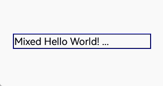
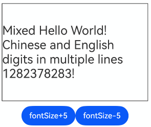
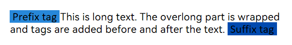
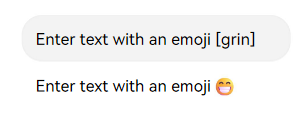
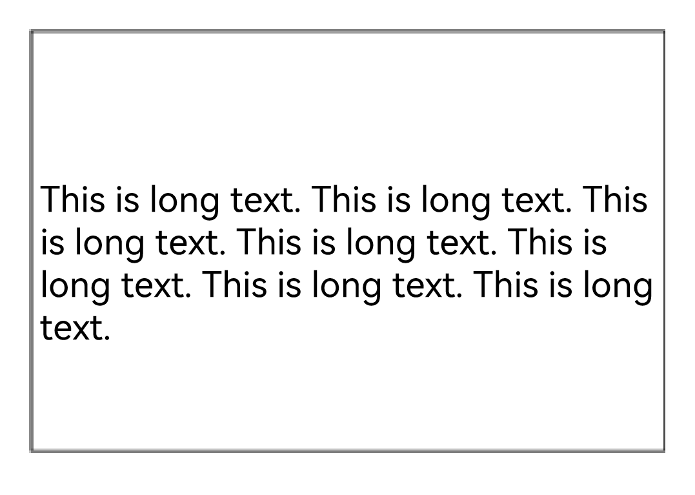
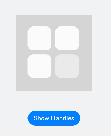

# FAQs About Text Components
<!--Kit: ArkUI-->
<!--Subsystem: ArkUI-->
<!--Owner: @xiangyuan6-->
<!--Designer: @xiangyuan6-->
<!--Tester: @jiaoaozihao-->
<!--Adviser: @Brilliantry_Rui-->

This topic addresses common issues related to text components.

## FAQs About Text Display (Text/Span)

This section describes FAQs about text display using the [Text](../reference/apis-arkui/arkui-ts/ts-basic-components-text.md) and [Span](../reference/apis-arkui/arkui-ts/ts-basic-components-span.md) components, including text truncation, tag addition, and emoji display.

### Why Does the Text Component Show Empty Space After the Ellipsis?

**Symptom**

When the **Text** component's width is not explicitly set and the content overflows, significant empty space appears between the ellipsis and the component edge. In addition, the ellipsis position shifts when content updates.



**Possible Causes**

Without an explicit width setting, the **Text** component expands to the maximum width allowed by its parent's layout constraints. Different content and word break modes produce varying typesetting results, causing inconsistent ellipsis positions.

**Solution**

Set the [wordBreak](../reference/apis-arkui/arkui-ts/ts-basic-components-text.md#wordbreak11) attribute to **WordBreak.BREAK_ALL** to maximize text utilization within the component area.

The sample code is as follows:
  <!-- @[Word_Break](https://gitcode.com/openharmony/applications_app_samples/blob/master/code/DocsSample/ArkUISample/TextComponent/entry/src/main/ets/pages/text/WordBreakd.ets) -->
  
  ``` TypeScript
  import { common } from '@kit.AbilityKit';
  @Entry
  @Component
  export struct WordBreakd {
    private context = this.getUIContext().getHostContext() as common.UIAbilityContext;
    private manager = this.context.resourceManager;
  
    // The value in the 'Text_WordBreak' resource file is 'Mixed Hello World! honorificabilitudinitatibus.'
    @State message: string = this.manager.getStringByNameSync('Text_WordBreak');
    build() {
      NavDestination() {
      Column() {
        Text(this.message)
          .id('HelloWorld')
          .fontSize('25fp')
          .maxLines(1)
          .textOverflow({ overflow: TextOverflow.Ellipsis})
          .onClick(() => {
            this.message = 'Welcome try try try 1235628327434348';
          })
          .border({ width: 1})
          .wordBreak(WordBreak.BREAK_ALL) // Set the word breaking mode.
      }
      .width(300)
      .border({ width: 1, color: Color.Blue})
      .margin({left: 30, top: 50})
      }
      // ...
    }
  }
  ```


### How Do I Implement Text Expansion at the End of the Line?

**Solution**

Calculate the truncated characters and append an expansion indicator (such as "…") at the end of the line as part of the component content. For details about the implementation, see [the API for converting a styled string to a paragraph array](../reference/apis-arkui/arkts-apis-uicontext-measureutils.md#getparagraphs20)<!--RP1--><!--RP1End-->.

### How Do I Implement Automatic Ellipsis for Overflowing Text?

**Question**

In fixed-size component areas, content with different font sizes displays varying maximum line counts. How do I configure the component to automatically show ellipsis when content overflows without setting fixed **maxLines** values?

**Solution**

Set [heightAdaptivePolicy](../reference/apis-arkui/arkui-ts/ts-basic-components-text.md#heightadaptivepolicy10) to **TextHeightAdaptivePolicy.LAYOUT_CONSTRAINT_FIRST**. In this mode, lines exceeding layout constraints are truncated, achieving similar effects to setting **maxLines**.

The sample code is as follows:
  <!-- @[Height_AdaptivePolicy](https://gitcode.com/openharmony/applications_app_samples/blob/master/code/DocsSample/ArkUISample/TextComponent/entry/src/main/ets/pages/text/HeightAdaptivePolicy.ets) --> 
  
  ``` TypeScript
  import { common } from '@kit.AbilityKit';
  
  @Entry
  @Component
  export struct HeightAdaptivePolicy {
    private context = this.getUIContext().getHostContext() as common.UIAbilityContext;
    private manager = this.context.resourceManager;
  
    // The value in the 'Text_Adaptive_Layout' resource file is 'Mixed Hello World! Chinese and English digits in multiple lines 1282378283 ~'.
    @State message: string = this.manager.getStringByNameSync('Text_Adaptive_Layout');
    @State fontSize: number = 25;
    build() {
      NavDestination() {
        Column({ space: 10 }) {
          Text(this.message)
            .id('HelloWorld')
            .fontSize(this.fontSize)
            .textOverflow({ overflow: TextOverflow.Ellipsis })
            .border({ width: 1 })
            .heightAdaptivePolicy(TextHeightAdaptivePolicy.LAYOUT_CONSTRAINT_FIRST) // Apply the adaptive layout policy.
            .width(300)
            .height(200)
          Row() {
            Button('fontSize+5')
              .onClick(() => {
                this.fontSize += 5;
              })
            Button('fontSize-5')
              .onClick(() => {
                this.fontSize -= 5;
              })
          }
        }
        .margin({ left: 30, top: 50 })
      }
      // ...
    }
  }
  ```



### How Do I Add Custom Tags Before and After Text?

**Question**

How do I add tags (for example, "Topic" or "Top1") before or after text and customize their [background styles](../reference/apis-arkui/arkui-ts/ts-universal-attributes-background.md) and [sizes](../reference/apis-arkui/arkui-ts/ts-universal-attributes-size.md)?

**Solution 1**

If tags and the main text need to display on the same line, consider using [Span](../reference/apis-arkui/arkui-ts/ts-basic-components-span.md). However, **Span** does not support size settings. For this reason, place tags and text within a [Flex](./arkts-layout-development-flex-layout.md) or [Row](../reference/apis-arkui/arkui-ts/ts-container-row.md) container, and set [textOverflow](../reference/apis-arkui/arkui-ts/ts-basic-components-text.md#textoverflow) for the main text to enable truncation when space is limited.

Implementation steps:

1. Place tags and main text in a horizontally aligned **Row** container.

2. Set the main text's **textOverflow** to **TextOverflow.Ellipsis** for truncation with ellipsis.

For an implementation example, see [Implementing Hot Search Rankings](./arkts-common-components-text-display.md#implementing-hot-search-rankings) for a practical example where "1" and "Top Hit" serve as tags for "I am entry 1". This approach is suitable for single-line text with tags.

**Solution 2**

If tags need to be added before and after multi-line text (with the text not truncated), the previous solution may cause misalignment among the three Text components. This occurs because multi-line text wraps within the **Row** container's width. To resolve this, place the tags and multi-line text in a [Stack](./arkts-layout-development-stack-layout.md) container, and configure the following for the main multi-line text: Set the first-line indentation using [textIndent](../reference/apis-arkui/arkui-ts/ts-basic-components-text.md#textindent10); adjust the position of the suffix tag using [offset](../reference/apis-arkui/arkui-ts/ts-universal-attributes-location.md#offset). This implementation ensures horizontal alignment between the prefix tag, multi-line text, and suffix tag.  

Implementation steps:

1. Place tags and multi-line text in a **Stack** container.

2. In the [aboutToAppear](../reference/apis-arkui/arkui-ts/ts-custom-component-lifecycle.md#abouttoappear) callback, use [measureTextSize](../reference/apis-arkui/arkts-apis-uicontext-measureutils.md#measuretextsize12) to calculate the prefix tag's width, which serves as the first-line indentation for the main text.

3. In the **aboutToAppear** callback, use [getParagraphs](../reference/apis-arkui/arkts-apis-uicontext-measureutils.md#getparagraphs20) to calculate the last line width and non-last line height of the main text for suffix tag offset.

4. Set the offset of the suffix tag relative to the upper left corner of the **Stack** container.

Example:

  <!-- @[Length_Metric](https://gitcode.com/openharmony/applications_app_samples/blob/master/code/DocsSample/ArkUISample/TextComponent/entry/src/main/ets/pages/text/LengthMetric.ets) --> 
  
  ``` TypeScript
  import { LengthMetrics } from '@kit.ArkUI';
  import { common } from '@kit.AbilityKit';
  
  @Entry
  @Component
  export struct LengthMetric {
    private context = this.getUIContext().getHostContext() as common.UIAbilityContext;
    private manager = this.context.resourceManager;
  
    // The value in the 'Text_Add_Tags_Front_and_Post' resource file is 'This is long text. The overlong part is wrapped and tags are added before and after the text.'
    @State message: string = this.manager.getStringByNameSync('Text_Add_Tags_Front_and_Post');
    // The value in the 'Text_Add_Tags_Front' resource file is 'Prefix tag.'
    @State frontTag: string = this.manager.getStringByNameSync('Text_Add_Tags_Front');
    // The value in the 'Text_Add_Tags_Post' resource file is 'Suffix tag.'
    @State backTag: string = this.manager.getStringByNameSync('Text_Add_Tags_Post');
    @State frontPaddingVp: number = 20;
    @State backPaddingVp: number = 10;
    @State fontTagWidthVp: Length = 0;
    @State backTagWidthVp: Length = 0;
    @State backOffsetVpX: Length = 0;
    @State backOffsetVpY: Length = 0;
    @State messageLines: number = 0;
    @State stackWidthVp: number = 300;
  
    // Calculate tag positions and text indentation before component rendering.
    aboutToAppear(): void {
      // Calculate the prefix tag width (fontTagWidthVp) to set first-line indentation.
      let frontTagSize: SizeOptions = this.getUIContext().getMeasureUtils().measureTextSize({
        textContent: this.frontTag,
      });
      this.fontTagWidthVp = this.getUIContext().px2vp(Number(frontTagSize.width)) + this.frontPaddingVp * 2
  
      // Calculate the line count for frontTag + message.
      let linesFrontTagPlusMessage = 0;
      let mutableStr = new MutableStyledString(this.message,
        [{
          start: 0,
          length: 1,
          styledKey: StyledStringKey.PARAGRAPH_STYLE,
          styledValue: new ParagraphStyle({ textIndent: LengthMetrics.vp(this.fontTagWidthVp) })
        }]
      )
      let paragraphArr = this.getUIContext()
        .getMeasureUtils()
        .getParagraphs(mutableStr, { constraintWidth: LengthMetrics.vp(this.stackWidthVp) });
      for (let i = 0; i < paragraphArr.length; ++i) {
        linesFrontTagPlusMessage += paragraphArr[i].getLineCount();
      }
  
      // Suffix tag offsetX (backOffsetVpX): last line width of frontTag + message
      this.backOffsetVpX =
        this.getUIContext().px2vp((paragraphArr[paragraphArr.length-1].getLineWidth(linesFrontTagPlusMessage - 1)))
      // Suffix tag offsetY (backOffsetVpY): total height of frontTag + message minus last line height
      let heightFrontTagPlusMessageVp = 0;
      for (let i = 0; i < paragraphArr.length; ++i) {
        heightFrontTagPlusMessageVp += this.getUIContext().px2vp(paragraphArr[i].getHeight());
      }
      let lastLineHeight =
        this.getUIContext().px2vp(paragraphArr[paragraphArr.length-1].getLineHeight(linesFrontTagPlusMessage - 1))
      this.backOffsetVpY = heightFrontTagPlusMessageVp - lastLineHeight
    }
  
    build() {
      NavDestination() {
        Column({ space: 20 }) {
          Blank()
            .height(200)
          Stack() {
            Text(this.frontTag)
              .padding({ left: this.frontPaddingVp, right: this.frontPaddingVp })
              .backgroundColor('rgb(39, 135, 217)')
            Text(this.message)
              .textIndent(this.fontTagWidthVp)
              .padding(0)
            Text(this.backTag)
              .padding({ left: this.backPaddingVp, right: this.backPaddingVp })
              .backgroundColor('rgb(0, 74, 175)')
              .offset({
                x: this.backOffsetVpX,
                y: this.backOffsetVpY
              })
          }
          .alignContent(Alignment.TopStart) // Align to top start.
          .width(this.stackWidthVp)
        }
        .height('100%')
        .width('90%')
        .padding('5%')
      }
      // ...
    }
  }
  ```



### How Do I Display Emojis with Text?

**Question**

How do I convert emoji codes to images and display them alongside text in the **Text** component?

**Solution**

Parse emoji codes using a regular expression, map them to image resources, and display both text and emojis using [Span](../reference/apis-arkui/arkui-ts/ts-basic-components-span.md) and [ImageSpan](../reference/apis-arkui/arkui-ts/ts-basic-components-imagespan.md).

  <!-- @[Displayed_Together](https://gitcode.com/openharmony/applications_app_samples/blob/master/code/DocsSample/ArkUISample/TextComponent/entry/src/main/ets/pages/text/DisplayedTogether.ets) -->
  
  ``` TypeScript
  // Replace $r('app.media.xxx') with the actual resource file.
  import { common } from '@kit.AbilityKit';
  @Entry
  @Component
  export struct DisplayedTogether {
    private context = this.getUIContext().getHostContext() as common.UIAbilityContext;
    private manager = this.context.resourceManager;
  
    // The value in the 'Text_Full_Text' resource file is
    // 'Hello, I am Text[grin], Hello, I am [rolling_on_the_floor_laughing] Text, [slightly_smiling_face] Hello, I am Text[grin]'
    @State fulltext: string = this.manager.getStringByNameSync('Text_Full_Text');
  
    static classifyTextAndEmojis(input: string): Map<string, string[]> {
      const emojiRegex = /\[([a-zA-Z_]+)\]/g; // Regular expression for emoji text codes
      const resultMap = new Map<string, string[]>(); // Map to store text and emoji segments
      resultMap.set('text', []);
      resultMap.set('emojis', []);
  
      let lastIndex = 0;
      let match: RegExpExecArray | null = null;
  
      while ((match = emojiRegex.exec(input)) !== null) {
        // Add the preceding text segment.
        if (match.index >= lastIndex) {
          resultMap.get('text')?.push(input.substring(lastIndex, match.index));
        }
        // Add the matched emoji code.
        resultMap.get('emojis')?.push(match[1]);
        lastIndex = match.index + match[0].length;
      }
      // Add the remaining text segment.
      if (lastIndex < input.length) {
        resultMap.get('text')?.push(input.substring(lastIndex));
      }
      return resultMap;
    }
  
    static getEmojiImg(emojis: string[]): Resource[] { // Return emoji image resources based on parsed codes.
      let emojisImg: Resource[] = []
      for (let i = 0; i < emojis.length; i++) {
        switch (emojis[i]) {
          case 'rolling_on_the_floor_laughing':
            emojisImg.push($r('app.media.rolling_on_the_floor_laughing'))
            break;
          case 'slightly_smiling_face':
            emojisImg.push($r('app.media.slightly_smiling_face'))
            break;
          case 'grin':
            emojisImg.push($r('app.media.grin'))
            break;
          default:
            break;
        }
      }
      return emojisImg
    }
  
    build() {
      NavDestination() {
        Column() {
          TextInput({
            // Replace $r('app.string.Text_emoji') with the actual resource file. In this example, the value in the resource file is "Enter text with emojis. Example: Hello [grin]."
            placeholder: $r('app.string.Text_emoji')
          })
            .width('80%')
            .padding(10)
            .border({ width: 1, color: '#EEEEEE' })
            .onChange((value: string) => {
              // Update text content (fulltext value) on input change.
              this.fulltext = value;
            });
  
          Text() {
            ForEach(DisplayedTogether.classifyTextAndEmojis(this.fulltext).get('text'),
              (item: string, index: number) => { // Display text with custom emojis.
                Span(item)
                  .fontSize(18)
                  .fontColor('#666666')
                  .fontWeight(FontWeight.Regular)
  
                ImageSpan(DisplayedTogether.getEmojiImg(
                  DisplayedTogether.classifyTextAndEmojis(this.fulltext).get('emojis'))[index])
                  .verticalAlign(ImageSpanAlignment.BOTTOM)
                  .height(24)
              })
          }
          .width('80%')
          .padding(15)
        }
        .width('100%')
        .height('100%')
        .justifyContent(FlexAlign.Center)
        .alignItems(HorizontalAlign.Center)
        .padding(20)
      }
      // ...
    }
  }
  ```



### How Do I Display Overflowing Text?

**Question**

When **Text** component content exceeds the height of the parent container (for example, [Column](../reference/apis-arkui/arkui-ts/ts-container-column.md)), the layout becomes disordered. How do I properly contain text within the parent component's area?

**Solution 1**

Let the text wrap automatically. When the **Text** component's [height](../reference/apis-arkui/arkui-ts/ts-universal-attributes-size.md#height) is not set, its height adjusts dynamically with the number of lines. Use [maxLines](../reference/apis-arkui/arkui-ts/ts-basic-components-text.md#maxlines) to limit the maximum number of visible lines. Overflowing text will be truncated by default. You can also configure [textOverflow](../reference/apis-arkui/arkui-ts/ts-basic-components-text.md#textoverflow) to specify the truncation mode.

This example limits the **Text** component to three lines:

  <!-- @[Text_Long](https://gitcode.com/openharmony/applications_app_samples/blob/master/code/DocsSample/ArkUISample/TextComponent/entry/src/main/ets/pages/text/TextLong.ets) -->
  
  ``` TypeScript
  @Entry
  @Component
  export struct TextLong {
    private context = this.getUIContext().getHostContext() as common.UIAbilityContext;
    private manager = this.context.resourceManager;
  
    // The value in the 'Text_Long_String' resource file is 'This is long text.'
    @State message: string = this.manager.getStringByNameSync('Text_Long_String').repeat(50);
  
    build() {
      NavDestination() {
        Column() {
          Text(this.message)
            .height('auto')
            .maxLines(3)
        }
        .height(200)
        .width('80%')
        .margin('10%')
        .borderWidth(1)
        .justifyContent(FlexAlign.Center)
      }
      // ...
    }
  }
  ```



**Solution 2**

Solution 1 truncates content. To display all text, place the **Text** component inside a [Scroll](../reference/apis-arkui/arkui-ts/ts-container-scroll.md) container. This way, users can swipe to view the full content.

  <!-- @[Text_Long_Tow](https://gitcode.com/openharmony/applications_app_samples/blob/master/code/DocsSample/ArkUISample/TextComponent/entry/src/main/ets/pages/text/TextLongTow.ets) -->
  
  ``` TypeScript
  @Entry
  @Component
  export struct TextLongTow {
    private context = this.getUIContext().getHostContext() as common.UIAbilityContext;
    private manager = this.context.resourceManager;
  
    // The value in the 'Text_Long_String' resource file is 'This is long text.'
    @State message: string = this.manager.getStringByNameSync('Text_Long_String').repeat(50);
  
    build() {
      NavDestination() {
        Column() {
          Scroll() {
            Text(this.message)
          }
          .scrollBar(BarState.Off)
        }
        .height(200)
        .width('80%')
        .margin('10%')
        .borderWidth(1)
        .justifyContent(FlexAlign.Center)
      }
      // ...
    }
  }
  ```


### How Do I Trigger a Custom Menu via selection and Set Its Font Size?

**Question**

**TextResponseType** in the [bindSelectionMenu](../reference/apis-arkui/arkui-ts/ts-basic-components-text.md#bindselectionmenu11) attribute specifies the response type of the text selection menu. How can I trigger the menu via the [selection](../reference/apis-arkui/arkui-ts/ts-basic-components-text.md#selection11) attribute and control the menu's font size?

**Solution**

Set **TextResponseType** to **DEFAULT**. Use the **font** attribute of the [Menu](../reference/apis-arkui/arkui-ts/ts-basic-components-menu.md) component inside your custom builder to set the desired text size.

```ts
// xxx.ets
@Entry
@Component
struct TextExample8 {
  controller: TextController = new TextController();
  options: TextOptions = { controller: this.controller };
  @State selectStart: number = 0;
  @State selectEnd: number = 0;

  build() {
    Column() {
      Column() {
        Text("TextTextTextText")
          .fontSize(14)
          .selection(this.selectStart, this.selectEnd)
          .copyOption(CopyOptions.InApp)
          .bindSelectionMenu(TextSpanType.TEXT, this.CustomMenu, TextResponseType.DEFAULT, {
            onDisappear: () => {
              this.selectStart = -1;
              this.selectEnd = -1;
            },
          })
          .textAlign(TextAlign.Center)
          .borderWidth(1)
          .borderColor(Color.Red)
        Button("Set selection")
          .onClick(() => {
            this.selectStart = 0;
            this.selectEnd = 10;
          })
          .fontSize(14)
          .margin({ top: 20 })
      }
      .width('100%')
      .padding({ top: 300 })
    }
    .height('100%')
  }

  @Builder
  CustomMenu() {
    Column() {
      Menu() {
        MenuItem({ content: "Item Content" })
        MenuItem({ content: "Item Content" })
        MenuItem({ content: "Item Content" })
      }
      .font({ size: 14 })
      .radius($r('sys.float.ohos_id_corner_radius_card'))
      .clip(true)
      .backgroundColor('#F0F0F0')
    }
  }
}
```


### How do I Disable the Long Press Gesture on Text?

**Question**

When [CopyOptions](../reference/apis-arkui/arkui-ts/ts-appendix-enums.md#copyoptions9) is set, a long press on the text selects the content and triggers the system menu. How can I prevent this default long press behavior?

**Solution**

Attach a custom long press gesture with a duration shorter than the system's 500 ms threshold.

```ts
// xxx.ets
@Entry
@Component
struct TextExample8 {
  build() {
    Column() {
      Text("TextTextTextText")
        .copyOption(CopyOptions.InApp)
        .gesture(LongPressGesture({ repeat: false, duration: 400 })
          .onAction(() => {
          }))
        .margin({
          top: 100,
          bottom: 100,
          left: 100,
          right: 100
        })
    }
    .height('100%')
  }
}
```

<!--RP4--><!--RP4End-->

## FAQs about Text Input (TextInput/TextArea/Search)

This section describes FAQs about text input using the [TextInput](../reference/apis-arkui/arkui-ts/ts-basic-components-textinput.md), [TextArea](../reference/apis-arkui/arkui-ts/ts-basic-components-textarea.md), and [Search](../reference/apis-arkui/arkui-ts/ts-basic-components-search.md) components.

### Why Does the Caret Not Disappear When TextInput Is Covered?

**Symptom**

Multiple components are stacked in the **Stack** component, including an input box (**TextInput**). When the **TextInput** component is covered, a handle with small circles occasionally appears on other components.

**Solution**

When the **TextInput** component is selected, and a handle is displayed, the selected area and the handle may not be rendered on the same layer. That is, the selected area and **TextInput** are on the same layer, while the handle is on a higher layer. Therefore, when **TextInput** is covered by other elements, the selected area is also covered, but the handle remains visible.

When **TextInput** is covered, if the focus and selected area are set through [TextInputController](../reference/apis-arkui/arkui-ts/ts-basic-components-textinput.md#textinputcontroller8), the preceding issue occurs. The involved APIs for setting the selected area include [selectAll](../reference/apis-arkui/arkui-ts/ts-basic-components-textinput.md#selectall11) and [setTextSelection](../reference/apis-arkui/arkui-ts/ts-basic-components-textinput.md#settextselection10). You are advised to check the calling time of the following APIs in the code to avoid setting the selected area after **TextInput** is covered.

| Component     | API             |
|-----------|-------------------|
| Search    | [setTextSelection](../reference/apis-arkui/arkui-ts/ts-basic-components-search.md#settextselection12)  |
| TextArea  | [setTextSelection](../reference/apis-arkui/arkui-ts/ts-basic-components-textarea.md#settextselection10)  |
| TextInput | [selectAll](../reference/apis-arkui/arkui-ts/ts-basic-components-textinput.md#selectall11)         |
| TextInput | [setTextSelection](../reference/apis-arkui/arkui-ts/ts-basic-components-textinput.md#settextselection10)  |

The following example shows a typical issue where a **TextInput** with the content "Invisible TextInput" is hidden. However, after you click the **Show Handles** button, a handle appears on the image. In this case, you need to ensure that the selected area is not set in the code when the **TextInput** is covered. If it is set, removing the related code logic can solve the problem.

<!--@[Cursor_Persists_When_TextInput_Is_Covered](https://gitcode.com/openharmony/applications_app_samples/blob/master/code/DocsSample/ArkUISample/TextComponent/entry/src/main/ets/pages/faq/CursorPersistsWhenTextInputIsCovered.ets)-->

``` TypeScript
@Entry
@Component
export struct CursorPersistsWhenTextInputIsCoveredExample {
  controller: TextInputController = new TextInputController();
  @State message1: string = 'Invisible TextInput'

  build() {
    NavDestination() {
      Column({ space: 50 }) {
        Stack() {
          TextInput({ text: this.message1, controller: this.controller })
            .copyOption(CopyOptions.LocalDevice)
            .backgroundColor(Color.Green)
            .width(200)
            .id('textInput_1')

          // Replace $r('app.media.foreground') with the image resource file you use.
          Image($r('app.media.foreground'))
            .width(200)
            .height(200)
            .backgroundColor('rgb(213,213,213)')
        }

        Button('Show Handles')
          .onClick(() => {
            this.getUIContext().getFocusController().requestFocus('textInput_1')
            this.controller.setTextSelection(0, 5, { menuPolicy: MenuPolicy.HIDE })
          })
      }
      .padding('10%')
      .alignItems(HorizontalAlign.Center)
      .height('100%')
      .width('90%')
    }
    .backgroundColor('#f1f2f3')
    .title($r('app.string.Cursor_Persists_When_TextInput_Is_Covered'))
  }
}
```


