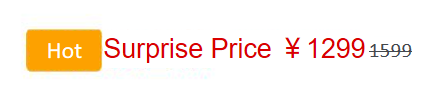
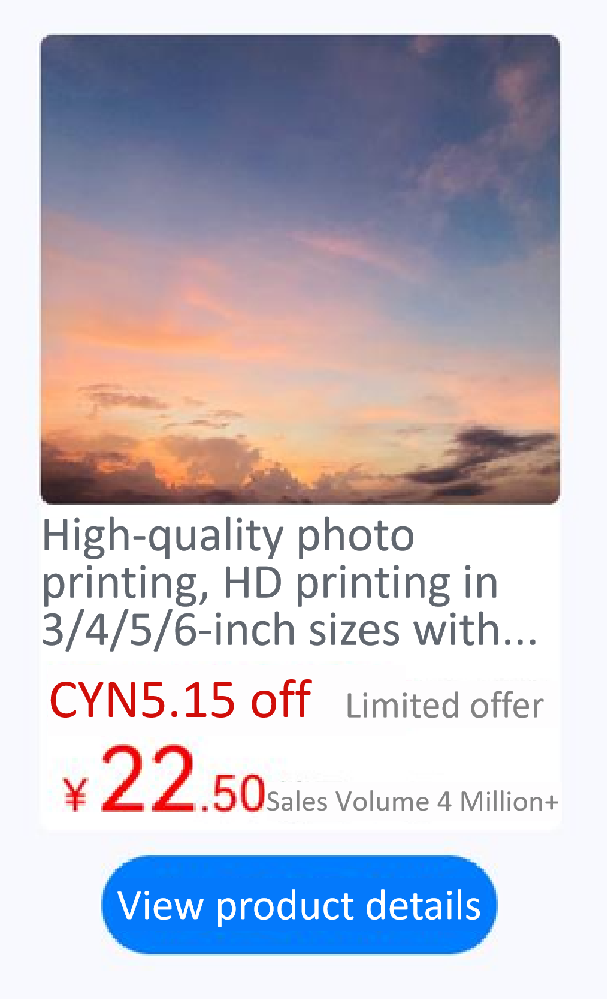

# Text and Image Layout
<!--Kit: ArkUI-->
<!--Subsystem: ArkUI-->
<!--Owner: @xiangyuan6-->
<!--Designer: @xiangyuan6-->
<!--Tester: @jiaoaozihao-->
<!--Adviser: @Brilliantry_Rui-->

Text and image layout combines images with text, allowing text to flow around images. This layout approach presents information intuitively, enhances visual impact, and creates diverse page display effects.

## Using the Span and ImageSpan for Text and Image Layout

Configure the [textVerticalAlign](../reference/apis-arkui/arkui-ts/ts-basic-components-text.md#textverticalalign20) attribute of the **Text** component and set the **verticalAlign** attribute of the **ImageSpan** component to **ImageSpanAlignment.FOLLOW_PARAGRAPH** to display product pricing and discount information.

<!-- @[textImage_component](https://gitcode.com/openharmony/applications_app_samples/blob/master/code/DocsSample/ArkUISample/TextComponent/entry/src/main/ets/pages/textImageMixedLayout/TextImageComponent.ets) -->

``` TypeScript
Text() {
  // Replace $r('app.media.hot_sale') with the actual resource file.
  ImageSpan($r('app.media.hot_sale'))
    .width(50)
    .height(30)
    .borderRadius(5)
    .verticalAlign(ImageSpanAlignment.FOLLOW_PARAGRAPH)
  // Replace $r('app.string.surprise_price') with the actual resource file. In this example, the value in the resource file is "Surprise Price ¥1299."
  Span($r('app.string.surprise_price'))
    .fontSize(25)
    .fontColor(Color.Red)
  Span('1599')
    .decoration({
      type: TextDecorationType.LineThrough,
      color: Color.Grey,
      style: TextDecorationStyle.SOLID
    })
    .fontSize(16)
}.textVerticalAlign(TextVerticalAlign.CENTER)
```




## Using Styled Strings for Text and Image Layout

Embed images using [ImageAttachment](../reference/apis-arkui/arkui-ts/ts-universal-styled-string.md#imageattachment) and apply text styles with [TextStyle](../reference/apis-arkui/arkui-ts/ts-universal-styled-string.md#textstyle) to display detailed product information.

<!-- @[textImage_attribute](https://gitcode.com/openharmony/applications_app_samples/blob/master/code/DocsSample/ArkUISample/TextComponent/entry/src/main/ets/pages/textImageMixedLayout/TextImageAttribute.ets) -->

``` TypeScript
// resourceGetString is a utility function for retrieving string resources from the application's resource directory.
import resourceGetString from '../../common/resource';
import { image } from '@kit.ImageKit';
import { LengthMetrics } from '@kit.ArkUI';
import { hilog } from '@kit.PerformanceAnalysisKit';

const TAG = '[Sample_Textcomponent]';
const DOMAIN = 0xF811;
const BUNDLE = 'Textcomponent_';

@Entry
@Component
struct styled_string_demo {
  @State message: string = 'Hello World';
  imagePixelMap: image.PixelMap | undefined = undefined;
  @State imagePixelMap3: image.PixelMap | undefined = undefined;
  mutableStr: MutableStyledString = new MutableStyledString('123');
  controller: TextController = new TextController();
  mutableStr2: MutableStyledString = new MutableStyledString('This is set decoration line style to the mutableStr2', [{
    start: 0,
    length: 15,
    styledKey: StyledStringKey.DECORATION,
    styledValue: new DecorationStyle({
      type: TextDecorationType.Overline,
      color: Color.Orange,
      style: TextDecorationStyle.DOUBLE
    })
  }]);

  async aboutToAppear() {
    hilog.info(DOMAIN, TAG, BUNDLE + 'aboutToAppear initial imagePixelMap');
    // Replace $r('app.media.sky') with the resource file you use.
    this.imagePixelMap = await this.getPixmapFromMedia($r('app.media.sky'));
  }

  private async getPixmapFromMedia(resource: Resource) {
    let unit8Array = await this.getUIContext().getHostContext()?.resourceManager?.getMediaContent(resource.id);
    let imageSource = image.createImageSource(unit8Array?.buffer?.slice(0, unit8Array?.buffer?.byteLength));
    let createPixelMap: image.PixelMap = await imageSource.createPixelMap({
      desiredPixelFormat: image.PixelMapFormat.RGBA_8888
    });
    await imageSource.release();
    return createPixelMap;
  }

  leadingMarginValue: ParagraphStyle = new ParagraphStyle({
    leadingMargin: LengthMetrics.vp(5),
    maxLines: 2,
    overflow: TextOverflow.Ellipsis,
    textVerticalAlign: TextVerticalAlign.BASELINE
  });
  // Line height style object
  lineHeightStyle1: LineHeightStyle = new LineHeightStyle(new LengthMetrics(24));
  // Bold style
  boldTextStyle: TextStyle = new TextStyle({ fontWeight: FontWeight.Bold });
  // Create a paragraph style object paragraphStyledString1.
  paragraphStyledString1: MutableStyledString =
    // Replace $r('app.string.print_photo') with the actual resource file. In this example, the value in the resource file is "\nHigh-quality photo printing, HD printing in 3/4/5/6-inch sizes with free shipping and lamination, quality guaranteed,".
    new MutableStyledString(resourceGetString.resourceToString($r('app.string.print_photo')), [
      {
        start: 0,
        length: 28,
        styledKey: StyledStringKey.PARAGRAPH_STYLE,
        styledValue: this.leadingMarginValue
      },
      {
        start: 11,
        length: 4,
        styledKey: StyledStringKey.LINE_HEIGHT,
        styledValue: this.lineHeightStyle1
      }
    ]);
  // Replace $r('app.string.limited_time_discount') with the actual resource file. In this example, the value in the resource file is "\nCYN5.15 off Limited offer."
  paragraphStyledString2: MutableStyledString = new MutableStyledString(resourceGetString.resourceToString($r('app.string.limited_time_discount')), [
    {
      start: 0,
      length: 5,
      styledKey: StyledStringKey.PARAGRAPH_STYLE,
      styledValue: this.leadingMarginValue
    },
    {
      start: 0,
      length: 4,
      styledKey: StyledStringKey.LINE_HEIGHT,
      styledValue: new LineHeightStyle(new LengthMetrics(40))
    },
    {
      start: 0,
      length: 9,
      styledKey: StyledStringKey.FONT,
      styledValue: this.boldTextStyle
    },
    {
      start: 1,
      length: 9,
      styledKey: StyledStringKey.FONT,
      styledValue: new TextStyle({ fontSize: LengthMetrics.vp(20), fontColor: Color.Red })
    },
    {
      start: 11,
      length: 4,
      styledKey: StyledStringKey.FONT,
      styledValue: new TextStyle({ fontColor: Color.Grey, fontSize: LengthMetrics.vp(14) })
    }
  ]);
  // Replace $r('app.string.sales_volume') with the actual resource file. In this example, the value in the resource file is "\n¥22.50, Sales Volume 4 Million+."
  paragraphStyledString3: MutableStyledString = new MutableStyledString(resourceGetString.resourceToString($r('app.string.sales_volume')), [
    {
      start: 0,
      length: 15,
      styledKey: StyledStringKey.PARAGRAPH_STYLE,
      styledValue: this.leadingMarginValue
    },
    {
      start: 0,
      length: 7,
      styledKey: StyledStringKey.LINE_HEIGHT,
      styledValue: new LineHeightStyle(new LengthMetrics(40))
    },
    {
      start: 0,
      length: 7,
      styledKey: StyledStringKey.FONT,
      styledValue: this.boldTextStyle
    },
    {
      start: 1,
      length: 1,
      styledKey: StyledStringKey.FONT,
      styledValue: new TextStyle({ fontSize: LengthMetrics.vp(18), fontColor: Color.Red })
    },
    {
      start: 2,
      length: 2,
      styledKey: StyledStringKey.FONT,
      styledValue: new TextStyle({ fontSize: LengthMetrics.vp(36), fontColor: Color.Red })
    },
    {
      start: 4,
      length: 3,
      styledKey: StyledStringKey.FONT,
      styledValue: new TextStyle({ fontSize: LengthMetrics.vp(20), fontColor: Color.Red })
    },
    {
      start: 7,
      length: 9,
      styledKey: StyledStringKey.FONT,
      styledValue: new TextStyle({ fontColor: Color.Grey, fontSize: LengthMetrics.vp(14) })
    }
  ]);

  build() {
    Row() {
      Column({ space: 10 }) {
        Text(undefined, { controller: this.controller })
          .copyOption(CopyOptions.InApp)
          .draggable(true)
          .backgroundColor('#FFFFFF')
          .borderRadius(5)
          .width(210)
        // Replace $r('app.string.textImageMixedLayout_content') with the actual resource file. In this example, the value in the resource file is "View product details."
        Button($r('app.string.textImageMixedLayout_content'))
          .onClick(() => {
            if (this.imagePixelMap !== undefined) {
              this.mutableStr = new MutableStyledString(new ImageAttachment({
                value: this.imagePixelMap,
                size: { width: 210, height: 190 },
                verticalAlign: ImageSpanAlignment.BASELINE,
                objectFit: ImageFit.Fill,
                layoutStyle: {
                  borderRadius: LengthMetrics.vp(5)
                }
              }));
              this.paragraphStyledString1.appendStyledString(this.paragraphStyledString2);
              this.paragraphStyledString1.appendStyledString(this.paragraphStyledString3);
              this.mutableStr.appendStyledString(this.paragraphStyledString1);
              this.controller.setStyledString(this.mutableStr);
            }
          })
      }
      .width('100%')
    }
    .height('100%')
    .backgroundColor('#F8F8FF')
  }
}
```


