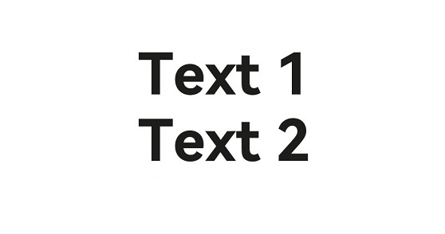

# Supporting Accessibility
<!--Kit: ArkUI-->
<!--Subsystem: ArkUI-->
<!--Owner: @zhanghangkai10241-->
<!--Designer: @dutie123-->
<!--Tester: @fredyuan0912-->
<!--Adviser: @Brilliantry_Rui-->

## Overview

Accessibility service is a set of solutions aimed at providing seamless access to all scenarios. The screen reader can convert the UI elements and content of an application into voice output, helping visually impaired users access application information and navigate the UI smoothly.

ArkUI provides comprehensive accessibility capabilities, enabling you to create accessible application UIs that meet the needs of users with visual, auditory, motor, and cognitive impairments.

When the [accessibility attributes](../reference/apis-arkui/arkui-ts/ts-universal-attributes-accessibility.md) of a component change, it triggers the screen reader to re-read component information, accessibility service to rescan the component tree, state announcements, and dynamic updates of virtual nodes. These mechanisms ensure that assistive tools can promptly perceive and adapt to changes, providing a consistent user experience.

## Available Capabilities

- All user interaction scenarios are covered, such as button tapping, text browsing, chart interaction, and dynamic content update.

- This service is applicable to phones and tablets.

## Highlights

  1. Wider user coverage: Applications with assistive tools can accurately reach millions of visually impaired users who rely on assistive technologies, breaking down digital barriers and making products accessible to more users.
  2. Compliance with regulations and design standards: Adapting to assistive tools is a core measure to comply with global accessibility design standards. It not only meets the digital inclusion regulations of various countries/regions, but also aligns with the modern product design concept of "accessible to all."
  3. Social responsibilities fulfillment and brand value enhancement: Adapting to assistive tools is a concrete action to promote digital equity, demonstrate the brand's responsibility to respect all users and help build an accessibility environment, and improve brand awareness.
  4. Optimized user experience: The core optimizations during the adaptation process (such as clear element description, reasonable focus order, and compliant contrast ratio) not only serve users with disabilities, but also provide a smoother user experience for regular users in complex scenarios (such as strong light environments and one-hand operations).
  5. Lightweight adaptation without affecting core experience: Adapting to assistive tools does not require any changes to the core logic or UI design of the application. Only lightweight features are added to the ArkUI accessibility service, ensuring that the innovative characteristics and visual style of the product are fully retained while providing accessibility support.

## Assistive tools

Assistive tools allow users with visual impairments to operate devices without looking at the screen. Based on the accessibility properties set by you, the enabled assistive tool can broadcast the details of the accessibility component through audio, including the component type, text content, operation result, and current status.

Accessibility information can be correctly set for all interactive UI components, which is the prerequisite for an assistive tool to have the accessibility capability. The following three conditions must be met:

  1. The component can be identified by the accessibility service, which can be set by [accessibilityLevel](../reference/apis-arkui/arkui-ts/ts-universal-attributes-accessibility.md#accessibilitylevel).
  2. The component feature and operation information are provided (implemented by using the [accessibilityText](../reference/apis-arkui/arkui-ts/ts-universal-attributes-accessibility.md#accessibilitytext) and [accessibilityDescription](../reference/apis-arkui/arkui-ts/ts-universal-attributes-accessibility.md#accessibilitydescription) attributes).
  3. The actual status and behavior of the component can be transferred (implemented by using the [accessibilityChecked](../reference/apis-arkui/arkui-ts/ts-universal-attributes-accessibility.md#accessibilitychecked13), and [accessibilityRole](../reference/apis-arkui/arkui-ts/ts-universal-attributes-accessibility.md#accessibilityrole18) attributes).

<!--RP1--><!--RP1End-->

## Setting the Accessibility Text

The [accessibilityText](../reference/apis-arkui/arkui-ts/ts-universal-attributes-accessibility.md#accessibilitytext) attribute is used to provide text to be read for components without text content and provide information for visual-only elements in accessibility scenarios. It is recommended that the text be concise and convey the key information of the component. For example, the description "play" can be provided for a play button without text. If the component already has text content and the **accessibilityText** attribute is also set, only the content set by **accessibilityText** is read.

**accessibilityText** is mainly used to briefly describe the feature of a component, rather than specific operations or prompt messages. You are not advised to set lengthy information in **accessibilityText**, such as operation guidance like "Double-tap with one finger to play" or status information like "This feature is not supported."

This attribute supports strings or resource references.

The following provides two examples to describe how to add accessibility text (**accessibilityText**) to an icon button without default text.

Example 1: If there is only an image and no accessibility text is set, the system plays "Image, double-tap with one finger to execute." Users cannot understand the function of the image button through the announcement.

<!-- @[accessibility_text_start01](https://gitcode.com/openharmony/applications_app_samples/blob/master/code/DocsSample/ArkUISample/UIExtensionAndAccessibility/entry/src/main/ets/pages/UniversalAttributesAccessibility/AccessibilityTextCase01.ets) -->

``` TypeScript
@Entry
@Component
export struct AccessibilityTextCase01 {
  build() {
    // ...
      Column() {
        // Ensure that the icon exists in the resource/base/media directory. You can replace the icon with an appropriate one.
        Image($r('app.media.play'))
          .width(60)
          .height(60)
          .onClick(() => {
            // Core logic for playing audio and video.
          })
      }
      .backgroundColor('#f1f2f3')
      // ...
  }
}
```

Example 2: Add the **accessibilityText** attribute to example 1 and set the value to "Play, image, double-tap with one finger to execute." Users can understand the function of the image button through the announcement.

<!-- @[accessibility_text_start02](https://gitcode.com/openharmony/applications_app_samples/blob/master/code/DocsSample/ArkUISample/UIExtensionAndAccessibility/entry/src/main/ets/pages/UniversalAttributesAccessibility/AccessibilityTextCase02.ets) -->

``` TypeScript
@Entry
@Component
export struct AccessibilityTextCase02 {
  build() {
    // ...
      Column() {
        // Ensure that the icon exists in the resource/base/media directory. You can replace the icon with an appropriate one.
        Image($r('app.media.play'))
          .width(60)
          .height(60)
          .onClick(() => {
            // Core logic for playing audio and video.
          })
          .accessibilityText ('Play')
      }
      .backgroundColor('#f1f2f3')
      // ...
  }
}
```

## Setting Accessibility Notifications

The [accessibilityDescription](../reference/apis-arkui/arkui-ts/ts-universal-attributes-accessibility.md#accessibilitydescription) attribute is used to provide more detailed component description, helping users understand the operation to be performed and the possible consequences, especially when the consequences cannot be inferred from the component attributes or accessibility text. For example, it can explain why a component is unavailable, or convey information that the system's default usage hints cannot. This information is played after the text content. If the current control has a default usage hint (for example, for a component that can be tapped, the default usage hint is "Double-tap with one finger to execute"), the accessibility description will replace the system's usage hint, that is, only the accessibility description will be played.

After the usage hint of the accessibility tool is disabled, the accessibility description will not be played.

The following provides two examples to illustrate how to set the accessibility description for the **Button** component.

Example 1: The **Button** component is used as the full-screen button for video playback. When the **Column** component is focused, the accessibility description "Button, double-tap with one finger **to execute**" is played, which is difficult for users to understand.

<!-- @[accessibility_description_start01](https://gitcode.com/openharmony/applications_app_samples/blob/master/code/DocsSample/ArkUISample/UIExtensionAndAccessibility/entry/src/main/ets/pages/UniversalAttributesAccessibility/AccessibilityDescriptionCase01.ets) -->

``` TypeScript
@Entry
@Component
export struct AccessibilityDescriptionCase01 {
  build() {
    // ...
      Button()
        .background(Color.Blue)
        .onClick(() => {
          // Full-screen logic.
        })
      // ...
  }
}
```

Example 2: After **accessibilityDescription** is set based on example 1, the announcement "Button, double-tap with one finger to **display in full screen**," is played, allowing users to clearly understand that the action is for full-screen operation.

<!-- @[accessibility_description_start02](https://gitcode.com/openharmony/applications_app_samples/blob/master/code/DocsSample/ArkUISample/UIExtensionAndAccessibility/entry/src/main/ets/pages/UniversalAttributesAccessibility/AccessibilityDescriptionCase02.ets) -->

``` TypeScript
@Entry
@Component
export struct AccessibilityDescriptionCase02 {
  build() {
    // ...
      Button()
        .background(Color.Blue)
        .onClick(() => {
          // Full-screen logic.
        })
        // Custom hint for the service.
        .accessibilityDescription ('Double-tap with one finger to display in full screen')
      // ...
  }
}
```


## Setting Accessibility Groups

The [accessibilityGroup](../reference/apis-arkui/arkui-ts/ts-universal-attributes-accessibility.md#accessibilitygroup) attribute is used to set whether to enable accessibility groups. If this feature is enabled, the component and all its child components are treated as a whole, and accessibility services no longer process child components individually. The **accessibilityGroup** attribute supports the following values:

- **false** (default): Accessibility grouping is disabled.

- **true**: Accessibility grouping is enabled.

The following two examples compare the effects of accessibility grouping in the **Column** component.

Example 1: In this scenario, there are three individually focusable **Text** nodes, making it difficult for users to effectively perceive the complete time information.

<!-- @[accessibility_group_start01](https://gitcode.com/openharmony/applications_app_samples/blob/master/code/DocsSample/ArkUISample/UIExtensionAndAccessibility/entry/src/main/ets/pages/UniversalAttributesAccessibility/AccessibilityGroupCase01.ets) --> 

``` TypeScript
@Entry
@Component
export struct AccessibilityGroupCase01 {
  build() {
    // ...
      Column() {
        Text ('2026')
        Text('Jan. 27')
        Text ('Tuesday')
      }
      // ...
  }
}
```

Example 2: Building on Example 1, After **accessibilityGroup** is added, the **Column** component becomes focusable and concatenates all Text texts under the Column into the text "2026 Jan. 27 Tuesday", while disabling individual focus on a single **Text** node.

<!-- @[accessibility_group_start02](https://gitcode.com/openharmony/applications_app_samples/blob/master/code/DocsSample/ArkUISample/UIExtensionAndAccessibility/entry/src/main/ets/pages/UniversalAttributesAccessibility/AccessibilityGroupCase02.ets) --> 

``` TypeScript
@Entry
@Component
export struct AccessibilityGroupCase02 {
  build() {
    // ...
      Column() {
        Text ('2026')
        Text('Jan. 27')
        Text ('Tuesday')
      }
      .accessibilityGroup(true)
      // ...
  }
}
```

## Setting the Accessibility Level

The [accessibilityLevel](../reference/apis-arkui/arkui-ts/ts-universal-attributes-accessibility.md#accessibilitylevel) attribute indicates the accessibility importance of a component, which controls whether the component can be identified by the accessibility service. The following values are supported:

- **"auto"** (default): The component's recognizability is determined by the accessibility grouping service and ArkUI.

- **"yes"**: The component can be recognized by accessibility services.

- **"no"**: The component cannot be recognized by accessibility services.

- **"no-hide-descendants"**: Neither the component nor its child components can be recognized by accessibility services.

This example uses the **Text** component as an example. If **Text.accessibilityLevel("yes")** is set, the component can be recognized by accessibility services. If not, "Text 1" cannot be focused independently.

<!-- @[accessibility_level_start01](https://gitcode.com/openharmony/applications_app_samples/blob/master/code/DocsSample/ArkUISample/UIExtensionAndAccessibility/entry/src/main/ets/pages/UniversalAttributesAccessibility/AccessibilityLevelCase01.ets) -->

``` TypeScript
@Entry
@Component
export struct AccessibilityLevelCase01 {
  build() {
    // ...
        Column() {
          Text('HelloWorld')
          Text('Text 1')
            .accessibilityLevel('yes')
      }
      .accessibilityGroup(true)
      // ...
  }
}
```

## Setting Whether an Accessibility Node Is Selected

[accessibilityChecked](../reference/apis-arkui/arkui-ts/ts-universal-attributes-accessibility.md#accessibilitychecked13) and [accessibilitySelected](../reference/apis-arkui/arkui-ts/ts-universal-attributes-accessibility.md#accessibilityselected13) are two attributes mainly used to convey the selection status of a component to assistive tools like screen readers, enhancing accessibility experience.

### Setting Selection State for Multi-Select Scenarios

The [accessibilityChecked](../reference/apis-arkui/arkui-ts/ts-universal-attributes-accessibility.md#accessibilitychecked13) attribute is used to indicate whether a component (for example, two-state or three-state component like check box or toggle button) is selected in single-select scenarios. It applies to scenarios requiring clear "selected/unselected" semantics and supports the following values:

- **undefined** (default): automatically determined by the system (depending on the component's own state, such as the **isOn** attribute of a **Toggle** component).

- **false**: not selected.

- **true**: selected (for example, check box checked).

Here is an example using the **Column** component to set it as checked when multi-select is supported:

<!-- @[accessibility_checked_start](https://gitcode.com/openharmony/applications_app_samples/blob/master/code/DocsSample/ArkUISample/UIExtensionAndAccessibility/entry/src/main/ets/pages/UniversalAttributesAccessibility/AccessibilityText.ets) -->

``` TypeScript
Column() {
  Text('HelloWorld').fontSize(50).fontWeight(FontWeight.Bold)
}
.accessibilityGroup(true)
  .accessibilityLevel('yes')
  .accessibilityText ('Group')
  .accessibilityDescription('The Column component can be selected, and the announced content is "Group"')
  .accessibilityChecked(true)
```

### Setting Selection State for Single-Select Scenarios

The [accessibilitySelected](../reference/apis-arkui/arkui-ts/ts-universal-attributes-accessibility.md#accessibilityselected13) attribute is used to indicate whether a component (for example, a single-select list or tab) is selected in single-select scenarios. It applies to scenarios requiring differentiation of "current selected items" (for example, single-select groups and navigation menus) and supports the following values:

- **undefined** (default): automatically determined by the system.

- **false**: not selected.

- **true**: currently selected.

Here is an example using the **Column** component to let the system determine its selection state when single-select is supported:

<!-- @[accessibility_selected_start](https://gitcode.com/openharmony/applications_app_samples/blob/master/code/DocsSample/ArkUISample/UIExtensionAndAccessibility/entry/src/main/ets/pages/UniversalAttributesAccessibility/AccessibilityText.ets) -->

``` TypeScript
Column() {
  Text('HelloWorld').fontSize(50).fontWeight(FontWeight.Bold)
}
.accessibilityGroup(true)
  .accessibilityLevel('yes')
  // Replace $r('app.string.UniversalAttributesAccessibility_text7') with the actual resource file. In this example, the value in the resource file is "Group."
  .accessibilityText ('Group')
  .accessibilityDescription('The Column component can be selected, and the announced content is "Group"')
  .accessibilitySelected(undefined)
```

### Key Differences Between accessibilityChecked and accessibilitySelected

In ArkUI accessibility attributes, both [accessibilityChecked](../reference/apis-arkui/arkui-ts/ts-universal-attributes-accessibility.md#accessibilitychecked13) and [accessibilitySelected](../reference/apis-arkui/arkui-ts/ts-universal-attributes-accessibility.md#accessibilityselected13) are used to indicate the state of a component, but they have fundamentally different application scenarios and semantic meanings. The following table provides a comparison of these two.

| Attribute   | accessibilityChecked     | accessibilitySelected |
| ------- | ------------------------ | --------------------- |
| Use cases| Binary or ternary components, such as check boxes and toggles.| Mutually exclusive selection scenarios, such as single-select lists and tabs.|
| Semantic objectives| Physical state of components (for example, whether a switch is on).| Navigation focus item (for example, current selected item in a list).|
| State persistence| Usually requires explicit saving (such as form submission).| Temporary (changes with focus movement).|
| Typical components| **Checkbox** and **Toggle**.        | **List** and **Tabs**.       |

## Setting Accessibility Virtual Nodes

The [accessibilityVirtualNode](../reference/apis-arkui/arkui-ts/ts-universal-attributes-accessibility.md#accessibilityvirtualnode11) attribute is used to add virtual accessibility nodes to the custom drawing component. The assistive tool reads the information about these nodes instead of the actual displayed content.

This example uses the **Text** component as an example. After **accessibilityVirtualNode** is set, "Text 2" can be recognized , focused, and announced by the assistive tool in accessibility mode, while the UI still displays "Text 1."

<!-- @[virtual_node_example_start](https://gitcode.com/openharmony/applications_app_samples/blob/master/code/DocsSample/ArkUISample/UIExtensionAndAccessibility/entry/src/main/ets/pages/UniversalAttributesAccessibility/VirtualNodeExample.ets) -->

``` TypeScript
@Entry
@Component
struct VirtualNodeExample {
  @Builder customAccessibilityNode() {
    Text('Text 2')
      .fontSize(50)
      .fontWeight(FontWeight.Bold)
  }

  build() {
    Column() {
      Text('Text 1')
        .fontSize(50)
        .fontWeight(FontWeight.Bold)
    }
    .accessibilityVirtualNode(this.customAccessibilityNode)
  }
}
```

## Recommendations

- Priority control

  Use **accessibilityLevel** to ensure key operations are recognizable.

- Semantic descriptions

  Add **accessibilityText** and **accessibilityDescription** for non-text elements like icons and images.

- Grouping optimization

  Use **accessibilityGroup** to reduce redundant announcements for complex layouts.

## Scenario Example

This example demonstrates how to use **accessibilityText** and **accessibilityDescription** to customize the content announced by screen readers.

If a component has both text and accessibility text attributes, only the accessibility text is announced when the component is selected.

<!-- @[accessibility_text_start](https://gitcode.com/openharmony/applications_app_samples/blob/master/code/DocsSample/ArkUISample/UIExtensionAndAccessibility/entry/src/main/ets/pages/UniversalAttributesAccessibility/AccessibilityText.ets) -->

``` TypeScript
@Component
export struct AccessibilityText {
  @Builder
  customAccessibilityNode() {
    Column() {
      Text(`virtual node`)
    }
    .width(10)
      .height(10)
  }

  build() {
    // ···
      Row() {
        // ···
        Column() {
          Text('Text 1')
            .fontSize(50)
            .fontWeight(FontWeight.Bold)
          Text('Text 2')
            .fontSize(50)
            .fontWeight(FontWeight.Bold)
        }
        .width('100%')
          .accessibilityGroup(true)
          .accessibilityLevel('yes')
          .accessibilityText ('Group')
          .accessibilityDescription('The Column component can be selected, and the announced content is "Group"')
          .accessibilityVirtualNode(this.customAccessibilityNode)
          .accessibilityChecked(true)
          .accessibilitySelected(undefined)
      }
      .height('100%')
    }
    // ···
  }
}
```


