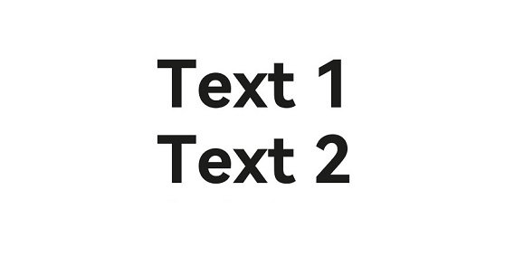

# Supporting Accessibility
<!--Kit: ArkUI-->
<!--Subsystem: ArkUI-->
<!--Owner: @zhanghangkai10241-->
<!--Designer: @dutie123-->
<!--Tester: @fredyuan0912-->
<!--Adviser: @Brilliantry_Rui-->

## Overview

ArkUI provides comprehensive accessibility capabilities, enabling you to create accessible application UIs that meet the needs of users with visual, auditory, motor, and cognitive impairments.

When the [accessibility attributes](../reference/apis-arkui/arkui-ts/ts-universal-attributes-accessibility.md) of a component change, it triggers responses such as screen readers re-reading component information, accessibility services rescanning the component tree, state announcements, and dynamic updates of virtual nodes. These mechanisms ensure that assistive tools (such as screen readers) can promptly perceive and adapt to changes, providing a consistent experience for users with disabilities.

## Setting Accessibility Groups

The **accessibilityGroup** attribute sets whether to enable accessibility grouping. If this feature is enabled, the component and all its child components are treated as a whole, and accessibility services no longer process child components individually. The **accessibilityGroup** attribute supports the following values:

- **false** (default): Accessibility grouping is disabled.

- **true**: Accessibility grouping is enabled.

Here is an example using the **Column** component to enable accessibility grouping:

<!-- @[accessibility_group_start](https://gitcode.com/openharmony/applications_app_samples/blob/master/code/DocsSample/ArkUISample/UIExtensionAndAccessibility/entry/src/main/ets/pages/UniversalAttributesAccessibility/AccessibilityText.ets) --> 

``` TypeScript
Column() {
  Text('HelloWorld').fontSize(50).fontWeight(FontWeight.Bold)
}
.accessibilityGroup(true)
```

## Setting the Accessibility Level

The **accessibilityLevel** attribute indicates the accessibility level of a component, controlling whether it can be recognized by accessibility services. It supports the following values:

- **"auto"** (default): The component's recognizability is determined by the accessibility grouping service and ArkUI.

- **"yes"**: The component can be recognized by accessibility services.

- **"no"**: The component cannot be recognized by accessibility services.

- **"no-hide-descendants"**: Neither the component nor its child components can be recognized by accessibility services.

Here is an example using the **Column** component to set its accessibility level to **"yes"**:

<!-- @[accessibility_level_start](https://gitcode.com/openharmony/applications_app_samples/blob/master/code/DocsSample/ArkUISample/UIExtensionAndAccessibility/entry/src/main/ets/pages/UniversalAttributesAccessibility/AccessibilityText.ets) -->

``` TypeScript
Column() {
  Text('HelloWorld').fontSize(50).fontWeight(FontWeight.Bold)
}
.accessibilityGroup(true)
  .accessibilityLevel('yes')
```

## Setting the Accessibility Text

The **accessibilityText** attribute provides readable text for components without text content. If a component already has text, the accessibility text takes precedence during announcement.

This attribute supports strings or resource references.

Here is an example using the **Column** component to set its accessibility text to **"Group"**:

<!-- @[accessibility_text_group_start](https://gitcode.com/openharmony/applications_app_samples/blob/master/code/DocsSample/ArkUISample/UIExtensionAndAccessibility/entry/src/main/ets/pages/UniversalAttributesAccessibility/AccessibilityText.ets) -->

``` TypeScript
Column() {
  Text('HelloWorld').fontSize(50).fontWeight(FontWeight.Bold)
}
.accessibilityGroup(true)
  .accessibilityLevel('yes')
  // Replace $r('app.string.UniversalAttributesAccessibility_text7') with the actual resource file. In this example, the value in the resource file is "Group."
  .accessibilityText($r('app.string.UniversalAttributesAccessibility_text7'))
```

## Setting Accessibility Description

The **accessibilityDescription** attribute provides a more detailed description of the component, which is read after the text content.

Here is an example using the **Column** component to set its accessibility description:

<!-- @[accessibility_description_start](https://gitcode.com/openharmony/applications_app_samples/blob/master/code/DocsSample/ArkUISample/UIExtensionAndAccessibility/entry/src/main/ets/pages/UniversalAttributesAccessibility/AccessibilityText.ets) -->

``` TypeScript
Column() {
  Text('HelloWorld')
}
.accessibilityGroup(true)
  .accessibilityLevel('yes')
  // Replace $r('app.string.UniversalAttributesAccessibility_text7') with the actual resource file. In this example, the value in the resource file is "Group."
  .accessibilityText($r('app.string.UniversalAttributesAccessibility_text7'))
  // Replace $r('app.string.UniversalAttributesAccessibility_text8') with the actual resource file.
     In this example, the value in the resource file is "The Column component can be selected, and the content to be announced is 'Group'." */
  .accessibilityDescription($r('app.string.UniversalAttributesAccessibility_text8'))
```

## Setting Accessibility Virtual Nodes

The **accessibilityVirtualNode** attribute adds virtual accessibility nodes to self-drawn components. Assistive tools read information from these nodes instead of the actual displayed content.

<!-- @[virtual_node_example_start](https://gitcode.com/openharmony/applications_app_samples/blob/master/code/DocsSample/ArkUISample/UIExtensionAndAccessibility/entry/src/main/ets/pages/UniversalAttributesAccessibility/VirtualNodeExample.ets) -->

``` TypeScript
@Entry
@Component
struct VirtualNodeExample {
  @Builder customAccessibilityNode() {
    // Replace $r('app.string.UniversalAttributesAccessibility_text6') with the actual resource file. In this example, the value in the resource file is "Text 2."
    Text($r('app.string.UniversalAttributesAccessibility_text6'))
      .fontSize(50)
      .fontWeight(FontWeight.Bold)
  }
  build() {
    Column() {
      // Replace $r('app.string.UniversalAttributesAccessibility_text5') with the actual resource file. In this example, the value in the resource file is "Text 1."
      Text($r('app.string.UniversalAttributesAccessibility_text5'))
        .fontSize(50)
        .fontWeight(FontWeight.Bold)
    }
    .accessibilityGroup(true)
    .accessibilityLevel('yes')
    .accessibilityVirtualNode(this.customAccessibilityNode)
  }
}
```

## Setting Whether an Accessibility Node Is Selected

The **accessibilityChecked** and **accessibilitySelected** attributes enhance accessibility by communicating the selection state of components to assistive tools like screen readers.

### Setting Selection State for Multi-Select Scenarios

The **accessibilityChecked** attribute indicates whether a component is checked in multi-select scenarios (for example, check boxes and toggle buttons). It applies to scenarios requiring clear "selected/unselected" semantics and supports the following values:

- **undefined** (default): automatically determined by the system (depending on the component's own state, such as the **isOn** attribute of a **Toggle** component).

- **false**: not selected.

- **true**: selected (for example, check box checked).

Here is an example using the **Column** component to set it as checked when multi-select is supported:

<!-- @[accessibility_checked_start](https://gitcode.com/openharmony/applications_app_samples/blob/master/code/DocsSample/ArkUISample/UIExtensionAndAccessibility/entry/src/main/ets/pages/UniversalAttributesAccessibility/AccessibilityText.ets) -->

``` TypeScript
Column() {
  Text('HelloWorld').fontSize(50).fontWeight(FontWeight.Bold)
}
.accessibilityGroup(true)
  .accessibilityLevel('yes')
  // Replace $r('app.string.UniversalAttributesAccessibility_text7') with the actual resource file. In this example, the value in the resource file is "Group."
  .accessibilityText($r('app.string.UniversalAttributesAccessibility_text7'))
  // Replace $r('app.string.UniversalAttributesAccessibility_text8') with the actual resource file.
     In this example, the value in the resource file is "The Column component can be selected, and the content to be announced is 'Group'." */
  .accessibilityDescription($r('app.string.UniversalAttributesAccessibility_text8'))
  .accessibilityChecked(true)
```

### Setting Selection State for Single-Select Scenarios

The **accessibilitySelected** attribute indicates whether a component is selected in single-select scenarios (for example, single-select lists and tabs). It applies to scenarios requiring differentiation of "current selected items" (for example, single-select groups and navigation menus) and supports the following values:

- **undefined** (default): automatically determined by the system.

- **false**: not selected.

- **true**: currently selected.

Here is an example using the **Column** component to let the system determine its selection state when single-select is supported:

<!-- @[accessibility_selected_start](https://gitcode.com/openharmony/applications_app_samples/blob/master/code/DocsSample/ArkUISample/UIExtensionAndAccessibility/entry/src/main/ets/pages/UniversalAttributesAccessibility/AccessibilityText.ets) -->

``` TypeScript
Column() {
  Text('HelloWorld').fontSize(50).fontWeight(FontWeight.Bold)
}
.accessibilityGroup(true)
  .accessibilityLevel('yes')
  // Replace $r('app.string.UniversalAttributesAccessibility_text7') with the actual resource file. In this example, the value in the resource file is "Group."
  .accessibilityText($r('app.string.UniversalAttributesAccessibility_text7'))
  // Replace $r('app.string.UniversalAttributesAccessibility_text8') with the actual resource file.
     In this example, the value in the resource file is "The Column component can be selected, and the content to be announced is 'Group'." */
  .accessibilityDescription($r('app.string.UniversalAttributesAccessibility_text8'))
  .accessibilitySelected(undefined)
```

### Key Differences Between accessibilityChecked and accessibilitySelected

In ArkUI accessibility attributes, both **accessibilityChecked** and **accessibilitySelected** are used to indicate the state of a component, but they have fundamentally different application scenarios and semantic meanings. The following table provides a comparison of these two.

| Attribute   | accessibilityChecked     | accessibilitySelected |
| ------- | ------------------------ | --------------------- |
| Use cases| Binary or ternary components, such as check boxes and toggles.| Mutually exclusive selection scenarios, such as single-select lists and tabs.|
| Semantic objectives| Physical state of components (for example, whether a switch is on).| Navigation focus item (for example, current selected item in a list).|
| State persistence| Usually requires explicit saving (such as form submission).| Temporary (changes with focus movement).|
| Typical components| **Checkbox** and **Toggle**.        | **List** and **Tabs**.       |

## Recommendations

- Priority control

  Use **accessibilityLevel** to ensure key operations are recognizable.

- Semantic descriptions

  Add **accessibilityText** and **accessibilityDescription** for non-text elements like icons and images.

- Grouping optimization

  Use **accessibilityGroup** to reduce redundant announcements for complex layouts.

## Scenario Example

This example demonstrates how to use **accessibilityText** and **accessibilityDescription** to customize the content announced by screen readers.

If a component has both text and accessibility text attributes, only the accessibility text is announced when the component is selected.

<!-- @[accessibility_text_start](https://gitcode.com/openharmony/applications_app_samples/blob/master/code/DocsSample/ArkUISample/UIExtensionAndAccessibility/entry/src/main/ets/pages/UniversalAttributesAccessibility/AccessibilityText.ets) -->

``` TypeScript
@Component
export struct AccessibilityText {
  @Builder
  customAccessibilityNode() {
    Column() {
      Text(`virtual node`)
    }
    .width(10)
      .height(10)
  }

  build() {
    // ...
      Row() {
        // ...
        Column() {
          // Replace $r('app.string.UniversalAttributesAccessibility_text5') with the actual resource file. In this example, the value in the resource file is "Text 1."
          Text($r('app.string.UniversalAttributesAccessibility_text5'))
            .fontSize(50)
            .fontWeight(FontWeight.Bold)
          // Replace $r('app.string.UniversalAttributesAccessibility_text6') with the actual resource file. In this example, the value in the resource file is "Text 2."
          Text($r('app.string.UniversalAttributesAccessibility_text6'))
            .fontSize(50)
            .fontWeight(FontWeight.Bold)
        }
        .width('100%')
          .accessibilityGroup(true)
          .accessibilityLevel('yes')
          // Replace $r('app.string.UniversalAttributesAccessibility_text7') with the actual resource file. In this example, the value in the resource file is "Group."
          .accessibilityText($r('app.string.UniversalAttributesAccessibility_text7'))
          // Replace $r('app.string.UniversalAttributesAccessibility_text8') with the actual resource file.
             In this example, the value in the resource file is "The Column component can be selected, and the content to be announced is 'Group'." */
          .accessibilityDescription($r('app.string.UniversalAttributesAccessibility_text8'))
          .accessibilityVirtualNode(this.customAccessibilityNode)
          .accessibilityChecked(true)
          .accessibilitySelected(undefined)
      }
      .height('100%')
      // ...
  }
}
```


