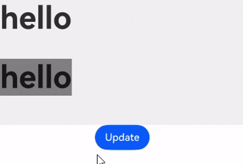
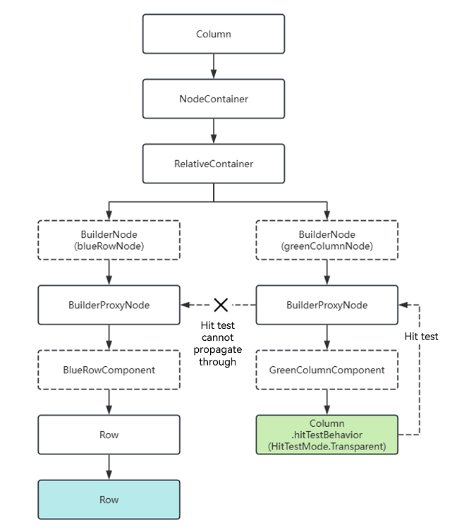
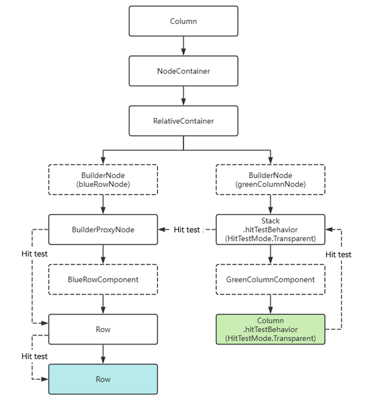
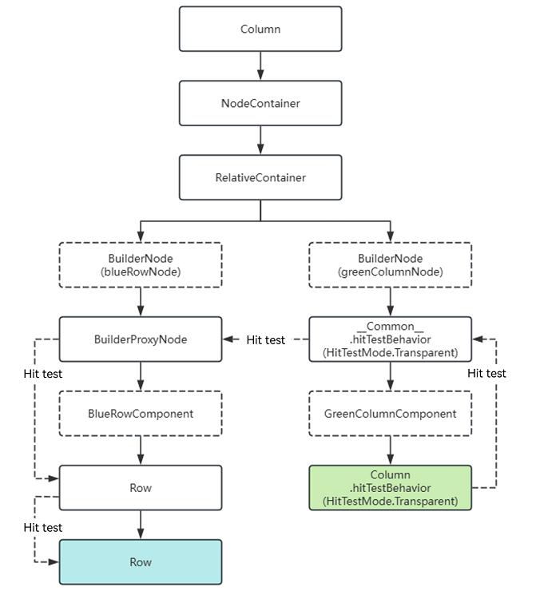
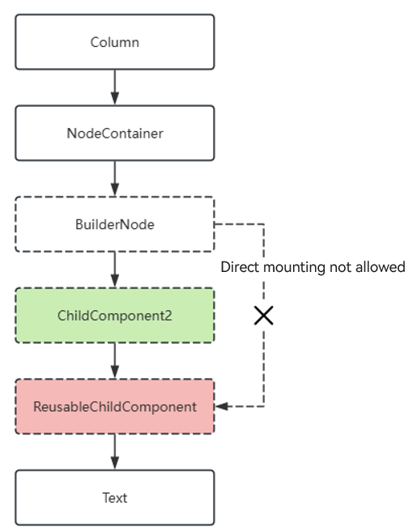
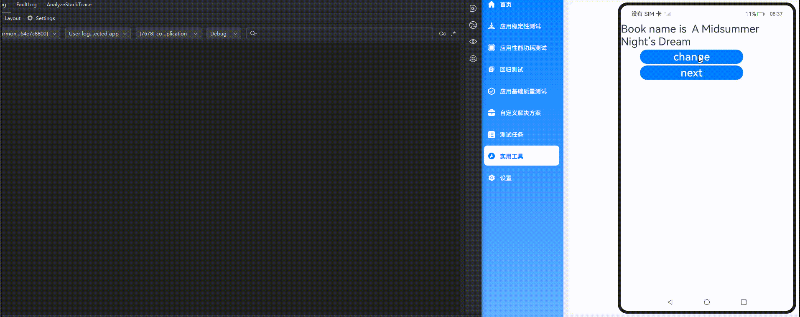
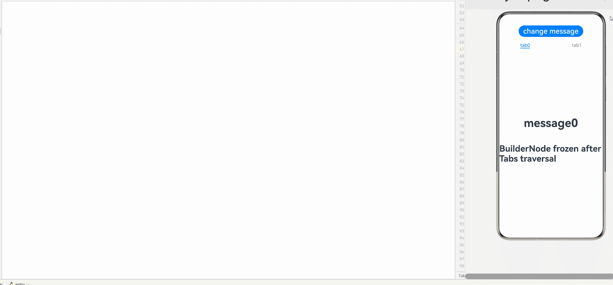
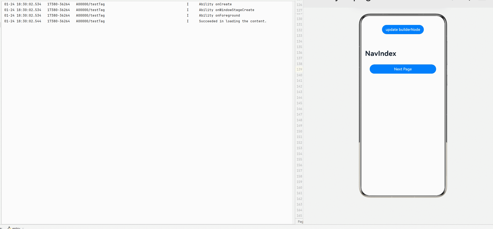

# Custom Declarative Node (BuilderNode)

<!--Kit: ArkUI-->
<!--Subsystem: ArkUI-->
<!--Owner: @xiang-shouxing-->
<!--Designer: @xiang-shouxing-->
<!--Tester: @sally__-->
<!--Adviser: @Brilliantry_Rui-->

## Overview

[BuilderNode](../reference/apis-arkui/js-apis-arkui-builderNode.md) is a custom declarative node designed to seamlessly mount built-in components. With BuilderNode, you can build a custom component tree within stateless UI environments through the [global custom builder function](../ui/state-management/arkts-builder.md#global-custom-builder-function), which is decorated by @Builder. Once your custom component tree is established, you can obtain its root [FrameNode](../reference/apis-arkui/js-apis-arkui-frameNode.md) by calling [getFrameNode](../reference/apis-arkui/js-apis-arkui-builderNode.md#getframenode). The root node can be directly returned by [NodeController](../reference/apis-arkui/js-apis-arkui-nodeController.md) and mounted under a [NodeContainer](../reference/apis-arkui/arkui-ts/ts-basic-components-nodecontainer.md). **BuilderNode** facilitates embedding of embedding declarative components within **FrameNode** and [RenderNode](../reference/apis-arkui/js-apis-arkui-renderNode.md) trees for mixed display. **BuilderNode** also offers a feature for exporting textures, which can be used for rendering within the same layer of the [XComponent](../reference/apis-arkui/arkui-ts/ts-basic-components-xcomponent.md).

The ArkTS component tree constructed by **BuilderNode** can be used together with custom nodes, such as FrameNodes and RenderNodes, to achieve the mixed display effect. **BuilderNode** offers a suite of APIs designed to integrate built-in components within third-party frameworks. This is particularly beneficial for scenarios where these frameworks require interaction with custom nodes

**BuilderNode** offers the capability to pre-create components, allowing you to dictate when built-in components are instantiated. This feature is useful for dynamically mounting and displaying components, especially for those that have a longer initialization period, such as [Web](../reference/apis-arkweb/arkts-basic-components-web.md) and [XComponent](../reference/apis-arkui/arkui-ts/ts-basic-components-xcomponent.md).


## Basic Concepts

- [Built-in component](arkts-ui-development-overview.md): component provided directly by ArkUI. Components are essential elements of the UI, working together to shape the UI.

- Entity node: native node created by the backend.

A BuilderNode can be used only as a leaf node. If an update is required, you are advised to use the [update](../reference/apis-arkui/js-apis-arkui-builderNode.md#update) API provided by the BuilderNode, rather than making modifications directly to the RenderNode obtained from it. 

> **NOTE**
> 
> - The BuilderNode only supports a single [global custom build function](../ui/state-management/arkts-builder.md#global-custom-builder-function) decorated by @Builder and wrapped by [wrapBuilder](../ui/state-management/arkts-wrapBuilder.md).
> 
> - A newly created BuilderNode can only obtain a **FrameNode** object pointing to the root node through [getFrameNode](../reference/apis-arkui/js-apis-arkui-builderNode.md#getframenode) after [build](../reference/apis-arkui/js-apis-arkui-builderNode.md#build); otherwise, it returns **null**.
> 
> - If the root node of the passed Builder is a syntactic node (such as **if/else** and **ForEach**), an additional FrameNode must be generated, which will be displayed as "BuilderProxyNode" in the node tree.
> 
> - If BuilderNode mounts a node onto another FrameNode through **getFrameNode**, or mounts it as a child node onto a **NodeContainer**, the node uses the layout constraints of the parent component for layout.
> 
> - If a BuilderNode's FrameNode mounts its node onto a RenderNode through [getRenderNode](../reference/apis-arkui/js-apis-arkui-frameNode.md#getrendernode), its size defaults to **0** since its FrameNode is not yet part of the tree. To display it properly, you must explicitly specify the layout constraint size through [selfIdealSize](../reference/apis-arkui/js-apis-arkui-builderNode.md#renderoptions) in the constructor.
> 
> - Pre-creation with the BuilderNode does not reduce the creation time of components. For the **Web** component, resources must be loaded in the kernel during creation, and pre-creation cannot reduce this time. However, it enables the kernel to preload resources, which can reduce the loading time when the component is used.

## Creating a BuilderNode Object

When creating a **BuilderNode** object, which is a template class, you must specify a type that matches the type of the [WrappedBuilder](../ui/state-management/arkts-wrapBuilder.md) used in the **build** method later on. Mismatches can cause compilation warnings and failures.

## Creating a Component Tree

Use the **build** API of **BuilderNode** to create a component tree. The tree is constructed based on the **WrappedBuilder** object passed in, and the root node of the component tree is retained.

> **NOTE**
>
> Stateless UI methods using the global @Builder can have at most one root node.
>
> The @Builder within the **build** method accepts only one input parameter.
>
> In scenarios where @Builder is nested within another @Builder in the **build** method, ensure that the parameters of the nested @Builder match the input parameters provided to the **build** method.
> 
> For scenarios where @Builder is nested within another @Builder, if the parameter types do not match, you must include the [BuilderOptions](../reference/apis-arkui/js-apis-arkui-builderNode.md#buildoptions12) field as a parameter for the [build](../reference/apis-arkui/js-apis-arkui-builderNode.md#build12) method.
> 
> To operate objects in a BuilderNode, ensure that the reference to the BuilderNode is not garbage collected. Once a BuilderNode object is collected by the virtual machine, its FrameNode and RenderNode objects will also be dereferenced from the backend nodes. This means that any FrameNode objects obtained from a BuilderNode will no longer correspond to any actual node if the BuilderNode is garbage collected.

Create offline nodes and component trees, and use them in conjunction with FrameNodes.

The root node of the BuilderNode is directly used as the return value of [makeNode](../reference/apis-arkui/js-apis-arkui-nodeController.md#makenode) of [NodeController](../reference/apis-arkui/js-apis-arkui-nodeController.md).

  <!-- @[Main_FrameNode](https://gitcode.com/openharmony/applications_app_samples/blob/master/code/DocsSample/ArkUISample/BuilderNode/entry/src/main/ets/pages/FrameNode.ets) --> 
  
  ``` TypeScript
  import { BuilderNode, FrameNode, NodeController, UIContext } from '@kit.ArkUI';
  
  class Params {
    public text: string = '';
  
    constructor(text: string) {
      this.text = text;
    }
  }
  
  @Builder
  function buildText(params: Params) {
    Column() {
      Text(params.text)
        .fontSize(50)
        .fontWeight(FontWeight.Bold)
        .margin({ bottom: 36 })
    }
  }
  
  class TextNodeController extends NodeController {
    private textNode: BuilderNode<[Params]> | null = null;
    private message: string = 'DEFAULT';
  
    constructor(message: string) {
      super();
      this.message = message;
    }
  
    makeNode(context: UIContext): FrameNode | null {
      this.textNode = new BuilderNode(context);
      this.textNode.build(wrapBuilder<[Params]>(buildText), new Params(this.message))
      return this.textNode.getFrameNode();
    }
  }
  
  @Entry
  @Component
  struct FrameNodePage {
    @State message: string = 'hello';
  
    build() {
      Row() {
        Column() {
          NodeContainer(new TextNodeController(this.message))
            .width('100%')
            .height(100)
            .backgroundColor('#FFF0F0F0')
        }
        .width('100%')
        .height('100%')
      }
      .height('100%')
    }
  }
  ```

When combining a BuilderNode with a RenderNode, note the following:

If you mount the RenderNode from the BuilderNode under another RenderNode, you must explicitly specify [selfIdeaSize](../reference/apis-arkui/js-apis-arkui-builderNode.md#renderoptions) as the layout constraint for the BuilderNode. This approach to mounting nodes is not recommended.

  <!-- @[Main_RenderNode](https://gitcode.com/openharmony/applications_app_samples/blob/master/code/DocsSample/ArkUISample/BuilderNode/entry/src/main/ets/pages/RenderNode.ets) -->
  
  ``` TypeScript
  import { NodeController, BuilderNode, FrameNode, UIContext, RenderNode } from '@kit.ArkUI';
  
  class Params {
    public text: string = '';
  
    constructor(text: string) {
      this.text = text;
    }
  }
  
  @Builder
  function buildText(params: Params) {
    Column() {
      Text(params.text)
        .fontSize(50)
        .fontWeight(FontWeight.Bold)
        .margin({ bottom: 36 })
    }
  }
  
  class TextNodeController extends NodeController {
    private rootNode: FrameNode | null = null;
    private textNode: BuilderNode<[Params]> | null = null;
    private message: string = 'DEFAULT';
  
    constructor(message: string) {
      super();
      this.message = message;
    }
  
    makeNode(context: UIContext): FrameNode | null {
      this.rootNode = new FrameNode(context);
      let renderNode = new RenderNode();
      renderNode.clipToFrame = false;
      this.textNode = new BuilderNode(context, { selfIdealSize: { width: 150, height: 150 } });
      this.textNode.build(wrapBuilder<[Params]>(buildText), new Params(this.message));
      const textRenderNode = this.textNode?.getFrameNode()?.getRenderNode();
  
      const rootRenderNode = this.rootNode.getRenderNode();
      if (rootRenderNode !== null) {
        rootRenderNode.appendChild(renderNode);
        renderNode.appendChild(textRenderNode);
      }
  
      return this.rootNode;
    }
  }
  
  @Entry
  @Component
  struct RenderNodePage {
    @State message: string = 'hello world';
  
    build() {
      Row() {
        Column() {
          NodeContainer(new TextNodeController(this.message))
            .width('100%')
            .height(100)
            .backgroundColor('#FFF0F0F0')
        }
        .width('100%')
        .height('100%')
      }
      .height('100%')
    }
  }
  ```

## Updating a Component Tree

The **build** API of a **BuilderNode** object constructs a component tree. The tree is constructed based on the **WrappedBuilder** object passed in, and the root node of the component tree is retained.

Custom component updates follow the update mechanisms of [state management](../ui/state-management/arkts-state-management-overview.md). For custom components used directly in a **WrappedBuilder** object, their parent component is the **BuilderNode** object. Therefore, to update child components defined in the **WrappedBuilder** objects, you need to define the relevant state variables with the [\@Prop](../ui/state-management/arkts-prop.md) or [\@ObjectLink](../ui/state-management/arkts-observed-and-objectlink.md) decorator, in accordance with the specifications of state management and the needs of your application development.


To update nodes within a BuilderNode:<br>Use the **update** API to update individual nodes within the BuilderNode.

Use the [updateConfiguration](../reference/apis-arkui/js-apis-arkui-builderNode.md#updateconfiguration12) API to trigger a full update of all nodes within the BuilderNode.

 

  <!-- @[Main_WrappedBuilder](https://gitcode.com/openharmony/applications_app_samples/blob/master/code/DocsSample/ArkUISample/BuilderNode/entry/src/main/ets/pages/WrappedBuilder.ets) -->
  
  ``` TypeScript
  import { NodeController, BuilderNode, FrameNode, UIContext } from '@kit.ArkUI';
  
  class Params {
    public text: string = '';
    constructor(text: string) {
      this.text = text;
    }
  }
  
  // Custom component
  @Component
  struct TextBuilder {
    // The @Prop decorated attribute is the attribute to be updated in the custom component. It is a basic attribute.
    @Prop message: string = 'TextBuilder';
  
    build() {
      Row() {
        Column() {
          Text(this.message)
            .fontSize(50)
            .fontWeight(FontWeight.Bold)
            .margin({ bottom: 36 })
            .backgroundColor(Color.Gray)
        }
      }
    }
  }
  
  @Builder
  function buildText(params: Params) {
    Column() {
      Text(params.text)
        .fontSize(50)
        .fontWeight(FontWeight.Bold)
        .margin({ bottom: 36 })
      TextBuilder({ message: params.text }) // Custom component
    }
  }
  
  class TextNodeController extends NodeController {
    private textNode: BuilderNode<[Params]> | null = null;
    private message: string = '';
  
    constructor(message: string) {
      super();
      this.message = message;
    }
  
    makeNode(context: UIContext): FrameNode | null {
      this.textNode = new BuilderNode(context);
      this.textNode.build(wrapBuilder<[Params]>(buildText), new Params(this.message));
      return this.textNode.getFrameNode();
    }
  
    update(message: string) {
      if (this.textNode !== null) {
        // Call update to perform an update.
        this.textNode.update(new Params(message));
      }
    }
  }
  
  @Entry
  @Component
  struct WrappedBuilderPage {
    @State message: string = 'hello';
    private textNodeController: TextNodeController = new TextNodeController(this.message);
    private count = 0;
  
    build() {
      Row() {
        Column() {
          NodeContainer(this.textNodeController)
            .width('100%')
            .height(200)
            .backgroundColor('#FFF0F0F0')
          Button('Update')
            .onClick(() => {
              this.count += 1;
              const message = 'Update' + this.count.toString();
              this.textNodeController.update(message);
            })
        }
        .width('100%')
        .height('100%')
      }
      .height('100%')
    }
  }
  ```

  

## Canceling the Reference to the Entity Node

A **BuilderNode** object is mapped to a backend entity node, and its memory release is usually contingent on the disposal of the frontend object. To directly release the backend node object, you can call the [dispose](../reference/apis-arkui/js-apis-arkui-builderNode.md#dispose12) API to break the reference to the entity node. Once this is done, the frontend **BuilderNode** object will no longer affect the lifecycle of the entity node.

> **NOTE**
>
> Calling **dispose** on a **BuilderNode** object breaks its reference to the backend entity node, and also simultaneously severs the references of its contained FrameNode and RenderNode to their respective entity nodes.
>
> If the frontend object BuilderNode cannot be released, memory leaks may occur. To avoid this, be sure to call **dispose** on the BuilderNode when you no longer need it. This reduces the complexity of reference relationships and lowers the risk of memory leaks.

## Injecting a Touch Event

Use the [postTouchEvent](../reference/apis-arkui/js-apis-arkui-builderNode.md#posttouchevent) API in **BuilderNode** to inject a [touch event](../reference/apis-arkui/arkui-ts/ts-universal-events-touch.md) into the bound component for event simulation and forwarding.

 

The following example forwards a touch event from one **Column** component to another in the BuilderNode, so that when the lower **Column** component is touched, the upper **Column** component also receives the same touch event. The API returns **true** if the button's event is successfully recognized.

  <!-- @[Main_PostTouchEvent](https://gitcode.com/openharmony/applications_app_samples/blob/master/code/DocsSample/ArkUISample/BuilderNode/entry/src/main/ets/pages/PostTouchEvent.ets) -->
  
  ``` TypeScript
  import { NodeController, BuilderNode, FrameNode, UIContext } from '@kit.ArkUI';
  import { hilog } from '@kit.PerformanceAnalysisKit';
  
  class Params {
    public text: string = 'this is a text';
  }
  
  @Builder
  function buttonBuilder(params: Params) {
    Column() {
      Button(`button ` + params.text)
        .borderWidth(2)
        .backgroundColor(Color.Orange)
        .width('100%')
        .height('100%')
        .gesture(
          TapGesture()
            .onAction((event: GestureEvent) => {
              hilog.info(0xF811,'testTag','%{public}s','TapGesture');
            })
        )
    }
    .width(500)
    .height(300)
    .backgroundColor(Color.Gray)
  }
  
  // Create and initialize BuilderNode.
  class MyNodeController extends NodeController {
    private rootNode: BuilderNode<[Params]> | null = null;
    private wrapBuilder: WrappedBuilder<[Params]> = wrapBuilder(buttonBuilder);
  
    makeNode(uiContext: UIContext): FrameNode | null {
      this.rootNode = new BuilderNode(uiContext);
      this.rootNode.build(this.wrapBuilder, { text: 'this is a string' });
      return this.rootNode.getFrameNode();
    }
  
    // Forward touch events to BuilderNode.
    postTouchEvent(touchEvent: TouchEvent): void {
      if (this.rootNode == null) {
        return;
      }
      let result = this.rootNode.postTouchEvent(touchEvent);
      hilog.info(0xF811,'testTag','%{public}s','result' + result);
    }
  }
  
  @Entry
  @Component
  struct postTouchEventPage {
    private nodeController: MyNodeController = new MyNodeController();
    @State bgColor: Color = Color.Pink;
  
    build() {
      Column() {
        NodeContainer(this.nodeController)
          .height(300)
          .width(500)
        Column()
          .id('onTouch')
          .width(500)
          .height(300)
          .backgroundColor(this.bgColor)
          .onTouch((event) => {
            // When the event is not undefined, forward the touch event to the node controller.
            if (event != undefined) {
              this.nodeController.postTouchEvent(event);
              this.bgColor = Color.Blue;
            }
          })
      }
    }
  }
  ```

## BuilderProxyNode in BuilderNode Causes Tree Structure Changes

If the root node of the input builder is a syntax node (**if**/**else**/**foreach**/...) or a custom component, an additional FrameNode is generated and displayed as BuilderProxyNode in the node tree. This structural change affects the propagation of certain events.

In the following example, touch events are bound to both the **Column** and **Row** components, with the **Column** component's [hitTestBehavior](../reference/apis-arkui/arkui-ts/ts-universal-attributes-hit-test-behavior.md#hittestbehavior) attribute set to [HitTestMode.Transparent](../reference/apis-arkui/arkui-ts/ts-appendix-enums.md#hittestmode9). However, because **BuilderProxyNode** is generated and cannot have attributes set on it, touching the **Column** fails to propagate the hit test to the **Row**.



  <!-- @[Main_BuilderProxyNode01](https://gitcode.com/openharmony/applications_app_samples/blob/master/code/DocsSample/ArkUISample/BuilderNode/entry/src/main/ets/pages/BuilderProxyNode01.ets) -->
  
  ``` TypeScript
  import { BuilderNode, typeNode, NodeController, UIContext } from '@kit.ArkUI';
  import { hilog } from '@kit.PerformanceAnalysisKit';
  
  @Component
  struct BlueRowComponent {
    build() {
      Row() {
        Row() {
        }
        .width('100%')
        .height('200vp')
        .backgroundColor(0xFF2787D9)
        .onTouch((event: TouchEvent) => {
          // Touching the green Column does not trigger the blue Row's touch event.
          hilog.info(0xF811,'testTag','%{public}s','blue touched: ' + event.type);
        })
      }
    }
  }
  
  @Component
  struct GreenColumnComponent {
    build() {
      Column() {
      }
      .id('BuilderProxyNode01')
      .width('100%')
      .height('100vp')
      .backgroundColor(0xFF17A98D)
      .hitTestBehavior(HitTestMode.Transparent)
      .onTouch((event: TouchEvent) => {
        hilog.info(0xF811,'testTag','%{public}s','green touched: ' + event.type);
      })
    }
  }
  
  @Builder
  function buildBlueRow() {
    // The custom component is mounted to Builder, generating BuilderProxyNode.
    BlueRowComponent()
  }
  
  @Builder
  function buildGreenColumn() {
    // The custom component is mounted to Builder, generating BuilderProxyNode.
    GreenColumnComponent()
  }
  
  class MyNodeController extends NodeController {
    makeNode(uiContext: UIContext): FrameNode | null {
      const relativeContainer = typeNode.createNode(uiContext, 'RelativeContainer');
  
      const blueRowNode = new BuilderNode(uiContext);
      blueRowNode.build(wrapBuilder(buildBlueRow));
  
      const greenColumnNode = new BuilderNode(uiContext);
      greenColumnNode.build(wrapBuilder(buildGreenColumn));
  
      // Overlay greenColumnNode on top of blueRowNode.
      relativeContainer.appendChild(blueRowNode.getFrameNode());
      relativeContainer.appendChild(greenColumnNode.getFrameNode());
  
      return relativeContainer;
    }
  }
  
  @Entry
  @Component
  struct BuilderProxyNode01 {
    build() {
      Column() {
        NodeContainer(new MyNodeController())
      }
    }
  }
  ```

In the preceding scenario, to enable touch event propagation, wrap the syntax node or custom component in a container component to avoid generating BuilderProxyNode. Set the container component's **hitTestBehavior** to **HitTestMode.Transparent** to allow hit tests to propagate to sibling nodes.



  <!-- @[Main_BuilderProxyNode02](https://gitcode.com/openharmony/applications_app_samples/blob/master/code/DocsSample/ArkUISample/BuilderNode/entry/src/main/ets/pages/BuilderProxyNode02.ets) -->
  
  ``` TypeScript
  import { BuilderNode, typeNode, NodeController, UIContext } from '@kit.ArkUI';
  import { hilog } from '@kit.PerformanceAnalysisKit';
  
  @Component
  struct BlueRowComponent {
    build() {
      Row() {
        Row() {
        }
        .width('100%')
        .height('200vp')
        .backgroundColor(0xFF2787D9)
        .onTouch((event: TouchEvent) => {
          // Touching the green Column triggers the blue Row's touch event.
          hilog.info(0xF811,'testTag','%{public}s','blue touched: ' + event.type);
        })
      }
    }
  }
  
  @Component
  struct GreenColumnComponent {
    build() {
      Column() {
      }
      .width('100%')
      .height('100vp')
      .backgroundColor(0xFF17A98D)
      .hitTestBehavior(HitTestMode.Transparent)
      .onTouch((event: TouchEvent) => {
        hilog.info(0xF811,'testTag','%{public}s','green touched: ' + event.type);
      })
    }
  }
  
  @Builder
  function buildBlueRow() {
    // The custom component is mounted to Builder, generating BuilderProxyNode.
    BlueRowComponent()
  }
  
  @Builder
  function buildGreenColumn() {
    // The Builder's root node is a container component (no BuilderProxyNode generated), allowing attribute settings.
    Stack() {
      GreenColumnComponent()
    }
    .hitTestBehavior(HitTestMode.Transparent)
  }
  
  class MyNodeController extends NodeController {
    makeNode(uiContext: UIContext): FrameNode | null {
      const relativeContainer = typeNode.createNode(uiContext, 'RelativeContainer');
  
      const blueRowNode = new BuilderNode(uiContext);
      blueRowNode.build(wrapBuilder(buildBlueRow));
  
      const greenColumnNode = new BuilderNode(uiContext);
      greenColumnNode.build(wrapBuilder(buildGreenColumn));
  
      // Overlay greenColumnNode on top of blueRowNode.
      relativeContainer.appendChild(blueRowNode.getFrameNode());
      relativeContainer.appendChild(greenColumnNode.getFrameNode());
  
      return relativeContainer;
    }
  }
  
  @Entry
  @Component
  struct Index {
    build() {
      Column() {
        NodeContainer(new MyNodeController())
          .id('BuilderProxyNode02')
      }
    }
  }
  ```

Alternatively, for custom components, you can directly set attributes. In this case, a **__Common__** node is generated, and the custom component's attributes are mounted to the **__Common__** node, achieving the same effect.



  <!-- @[Main_BuilderProxyNode03](https://gitcode.com/openharmony/applications_app_samples/blob/master/code/DocsSample/ArkUISample/BuilderNode/entry/src/main/ets/pages/BuilderProxyNode03.ets) -->
  
  ``` TypeScript
  import { BuilderNode, typeNode, NodeController, UIContext } from '@kit.ArkUI';
  import { hilog } from '@kit.PerformanceAnalysisKit';
  
  @Component
  struct BlueRowComponent {
    build() {
      Row() {
        Row() {
        }
        .width('100%')
        .height('200vp')
        .backgroundColor(0xFF2787D9)
        .onTouch((event: TouchEvent) => {
          // Touching the green Column triggers the blue Row's touch event.
          hilog.info(0xF811,'testTag','%{public}s','blue touched: ' + event.type);
        })
      }
    }
  }
  
  @Component
  struct GreenColumnComponent {
    build() {
      Column() {
      }
      .width('100%')
      .height('100vp')
      .backgroundColor(0xFF17A98D)
      .hitTestBehavior(HitTestMode.Transparent)
      .onTouch((event: TouchEvent) => {
        hilog.info(0xF811,'testTag','%{public}s','green touched: ' + event.type);
      })
    }
  }
  
  @Builder
  function buildBlueRow() {
    // The custom component is mounted to Builder, generating BuilderProxyNode.
    BlueRowComponent()
  }
  
  @Builder
  function buildGreenColumn() {
    // Setting attributes directly on the custom component generates a __Common__ node (no BuilderProxyNode).
    GreenColumnComponent()
      .hitTestBehavior(HitTestMode.Transparent)
  }
  
  class MyNodeController extends NodeController {
    makeNode(uiContext: UIContext): FrameNode | null {
      const relativeContainer = typeNode.createNode(uiContext, 'RelativeContainer');
  
      const blueRowNode = new BuilderNode(uiContext);
      blueRowNode.build(wrapBuilder(buildBlueRow));
  
      const greenColumnNode = new BuilderNode(uiContext);
      greenColumnNode.build(wrapBuilder(buildGreenColumn));
  
      // Overlay greenColumnNode on top of blueRowNode.
      relativeContainer.appendChild(blueRowNode.getFrameNode());
      relativeContainer.appendChild(greenColumnNode.getFrameNode());
  
      return relativeContainer;
    }
  }
  
  @Entry
  @Component
  struct Index {
    build() {
      Column() {
        NodeContainer(new MyNodeController())
      }
    }
  }
  ```

## Implementing Node Reuse with the BuilderNode reuse and recycle APIs

To implement component reuse within a BuilderNode, you need to call the [reuse](../reference/apis-arkui/js-apis-arkui-builderNode.md#reuse12) and [recycle](../reference/apis-arkui/js-apis-arkui-builderNode.md#recycle12) APIs. These APIs pass reuse and recycle events to custom components inside the BuilderNode.

In the following example, the custom component **ReusableChildComponent** can pass reuse and recycle events to its nested custom component **ChildComponent3**. However, these events cannot automatically reach another custom component, **ChildComponent2**, as it is separated by a BuilderNode. To enable reuse for **ChildComponent2**, you must explicitly call the **reuse** and **recycle** APIs on the BuilderNode to forward these events to the component.


  <!-- @[Main_ReusablePage01](https://gitcode.com/openharmony/applications_app_samples/blob/master/code/DocsSample/ArkUISample/BuilderNode/entry/src/main/ets/pages/ReusablePage01.ets) -->
  
  ``` TypeScript
  import { FrameNode, NodeController, BuilderNode, UIContext } from '@kit.ArkUI';
  import { hilog } from '@kit.PerformanceAnalysisKit';
  
  const TEST_TAG: string = 'Reuse+Recycle';
  
  class MyDataSource {
    private dataArray: string[] = [];
    private listener: DataChangeListener | null = null;
  
    public totalCount(): number {
      return this.dataArray.length;
    }
  
    public getData(index: number) {
      return this.dataArray[index];
    }
  
    public pushData(data: string) {
      this.dataArray.push(data);
    }
  
    public reloadListener(): void {
      this.listener?.onDataReloaded();
    }
  
    public registerDataChangeListener(listener: DataChangeListener): void {
      this.listener = listener;
    }
  
    public unregisterDataChangeListener(): void {
      this.listener = null;
    }
  }
  
  class Params {
    public item: string = '';
  
    constructor(item: string) {
      this.item = item;
    }
  }
  
  @Builder
  function buildNode(param: Params = new Params('hello')) {
    Row() {
      Text(`C${param.item} -- `)
      ChildComponent2({ item: param.item }) // This custom component cannot be correctly reused in the BuilderNode.
    }
  }
  
  class MyNodeController extends NodeController {
    public builderNode: BuilderNode<[Params]> | null = null;
    public item: string = '';
  
    makeNode(uiContext: UIContext): FrameNode | null {
      if (this.builderNode == null) {
        this.builderNode = new BuilderNode(uiContext, { selfIdealSize: { width: 300, height: 200 } });
        this.builderNode.build(wrapBuilder<[Params]>(buildNode), new Params(this.item));
      }
      return this.builderNode.getFrameNode();
    }
  }
  
  // The custom component that is reused and recycled will have its state variables updated, and the state variables of the nested ChildComponent3 will also be updated. However, the BuilderNode will block this propagation process.
  @Reusable
  @Component
  struct ReusableChildComponent {
    @Prop item: string = '';
    @Prop switch: string = '';
    private controller: MyNodeController = new MyNodeController();
  
    aboutToAppear() {
      this.controller.item = this.item;
    }
  
    aboutToRecycle(): void {
      hilog.info(0xF811,'testTag','%{public}s',`${TEST_TAG} ReusableChildComponent aboutToRecycle ${this.item}`);
  
      // When the switch is open, pass the recycle event to the nested custom component, such as ChildComponent2, through the BuilderNode's recycle API to complete recycling.
      if (this.switch === 'open') {
        this.controller?.builderNode?.recycle();
      }
    }
  
    aboutToReuse(params: object): void {
      hilog.info(0xF811,'testTag','%{public}s',`${TEST_TAG} ReusableChildComponent aboutToReuse ${JSON.stringify(params)}`);
  
      // When the switch is open, pass the recycle event to the nested custom component, such as ChildComponent2, through the BuilderNode's recycle API to complete recycling.
      if (this.switch === 'open') {
        this.controller?.builderNode?.reuse(params);
      }
    }
  
    build() {
      Row() {
        Text(`A${this.item}--`)
        ChildComponent3({ item: this.item })
        NodeContainer(this.controller);
      }
    }
  }
  
  @Component
  struct ChildComponent2 {
    @Prop item: string = 'false';
  
    aboutToReuse(params: Record<string, object>) {
      hilog.info(0xF811,'testTag','%{public}s',`${TEST_TAG} ChildComponent2 aboutToReuse ${JSON.stringify(params)}`);
    }
  
    aboutToRecycle(): void {
      hilog.info(0xF811,'testTag','%{public}s',`${TEST_TAG} ChildComponent2 aboutToRecycle ${this.item}`);
    }
  
    build() {
      Row() {
        Text(`D${this.item}`)
          .fontSize(20)
          .backgroundColor(Color.Yellow)
          .margin({ left: 10 })
      }.margin({ left: 10, right: 10 })
    }
  }
  
  @Component
  struct ChildComponent3 {
    @Prop item: string = 'false';
  
    aboutToReuse(params: Record<string, object>) {
      hilog.info(0xF811,'testTag','%{public}s',`${TEST_TAG} ChildComponent3 aboutToReuse ${JSON.stringify(params)}`);
    }
  
    aboutToRecycle(): void {
      hilog.info(0xF811,'testTag','%{public}s',`${TEST_TAG} ChildComponent3 aboutToRecycle ${this.item}`);
    }
  
    build() {
      Row() {
        Text(`B${this.item}`)
          .fontSize(20)
          .backgroundColor(Color.Yellow)
          .margin({ left: 10 })
      }.margin({ left: 10, right: 10 })
    }
  }
  
  
  @Entry
  @Component
  struct Index {
    @State data: MyDataSource = new MyDataSource();
  
    aboutToAppear() {
      for (let i = 0; i < 100; i++) {
        this.data.pushData(i.toString());
      }
    }
  
    build() {
      Column() {
        List({ space: 3 }) {
          LazyForEach(this.data, (item: string) => {
            ListItem() {
              ReusableChildComponent({
                item: item,
                switch: 'open' // Changing open to close can be used to observe the behavior of custom components inside the BuilderNode when reuse and recycle events are not passed through the BuilderNode's reuse and recycle APIs.
              })
            }
          }, (item: string) => item)
        }
        .id('List')
        .width('100%')
        .height('100%')
      }
    }
  }
  ```


## Using the @Reusable Decorator with BuilderNode Child Components

The reuse mechanism of **BuilderNode** is fundamentally incompatible with the component reuse behavior enabled by the [@Reusable](./state-management/arkts-reusable.md) decorator. Therefore, when a BuilderNode contains a custom component as its child nodes, that component cannot be decorated with @Reusable. Attempting to do so will trigger a JS crash. To use the @Reusable decorator, first wrap the target custom component with a regular custom component.

In the following example, when **ReusableChildComponent** serves as a direct child of the BuilderNode, it cannot be decorated with @Reusable. By wrapping it with **ChildComponent2**, **ReusableChildComponent** can then safely use the @Reusable decorator.



  <!-- @[Main_ReusablePage02](https://gitcode.com/openharmony/applications_app_samples/blob/master/code/DocsSample/ArkUISample/BuilderNode/entry/src/main/ets/pages/ReusablePage02.ets) -->
  
  ``` TypeScript
  import { FrameNode, NodeController, BuilderNode, UIContext } from '@kit.ArkUI';
  import { hilog } from '@kit.PerformanceAnalysisKit';
  
  const TEST_TAG: string = 'Reusable';
  
  class Params {
    public item: string = '';
  
    constructor(item: string) {
      this.item = item;
    }
  }
  
  @Builder
  function buildNode(param: Params = new Params('Hello')) {
    ChildComponent2({ item: param.item })
  }
  
  class MyNodeController extends NodeController {
    public builderNode: BuilderNode<[Params]> | null = null;
    public item: string = '';
  
    constructor(item: string) {
      super();
      this.item = item;
    }
  
    makeNode(uiContext: UIContext): FrameNode | null {
      if (this.builderNode == null) {
        this.builderNode = new BuilderNode(uiContext, { selfIdealSize: { width: 300, height: 200 } });
        this.builderNode.build(wrapBuilder<[Params]>(buildNode), new Params(this.item));
      }
      return this.builderNode.getFrameNode();
    }
  }
  
  // This custom component is decorated with @Reusable and therefore cannot be directly mounted as a child node of the BuilderNode.
  @Reusable
  @Component
  struct ReusableChildComponent {
    @Prop item: string = '';
  
    aboutToReuse(params: object): void {
      hilog.info(0xF811,'testTag','%{public}s',`${TEST_TAG} ReusableChildComponent aboutToReuse ${JSON.stringify(params)}`);
    }
  
    aboutToRecycle(): void {
      hilog.info(0xF811,'testTag','%{public}s',`${TEST_TAG} ReusableChildComponent aboutToRecycle ${this.item}`);
    }
  
    build() {
      Text(`A--${this.item}`)
        .id('ReusablePage02')
    }
  }
  
  // Custom component not decorated with @Reusable
  @Component
  struct ChildComponent2 {
    @Prop item: string = '';
  
    aboutToReuse(params: Record<string, object>) {
      hilog.info(0xF811,'testTag','%{public}s',`${TEST_TAG} ChildComponent2 aboutToReuse ${JSON.stringify(params)}`);
    }
  
    aboutToRecycle(): void {
      hilog.info(0xF811,'testTag','%{public}s',`${TEST_TAG} ChildComponent2 aboutToRecycle ${this.item}`);
    }
  
    build() {
      ReusableChildComponent({ item: this.item })
    }
  }
  
  
  @Entry
  @Component
  struct Index {
    @State controller: MyNodeController = new MyNodeController('Child');
  
    build() {
      Column() {
        NodeContainer(this.controller)
      }
      .width('100%')
      .height('100%')
    }
  }
  ```

## Updating Nodes Based on System Environment Changes

Use the [updateConfiguration](../reference/apis-arkui/js-apis-arkui-builderNode.md#updateconfiguration12) API to listen for [system environment changes](../reference/apis-ability-kit/js-apis-app-ability-configuration.md). This will trigger a full update of all nodes within the BuilderNode.

> **NOTE**
>
> The **updateConfiguration** API is designed to inform objects of the need to update, with the updates reflecting changes in the application's current system environment.

  <!-- @[Main_EnvironmentCallbackPage](https://gitcode.com/openharmony/applications_app_samples/blob/master/code/DocsSample/ArkUISample/BuilderNode/entry/src/main/ets/pages/EnvironmentCallbackPage.ets) -->
  
  ``` TypeScript
  import { NodeController, BuilderNode, FrameNode, UIContext } from '@kit.ArkUI';
  import { AbilityConstant, Configuration, EnvironmentCallback } from '@kit.AbilityKit';
  import { hilog } from '@kit.PerformanceAnalysisKit';
  
  class Params {
    public text: string = '';
  
    constructor(text: string) {
      this.text = text;
    }
  }
  
  // Custom component
  @Component
  struct TextBuilder {
    // The @Prop decorated attribute is the attribute to be updated in the custom component. It is a basic attribute.
    @Prop message: string = 'TextBuilder';
  
    build() {
      Row() {
        Column() {
          Text(this.message)
            .fontSize(50)
            .fontWeight(FontWeight.Bold)
            .margin({ bottom: 36 })
            .fontColor($r(`app.color.text_color`)) // You can define custom colors in the color.json file in the resource directory.
            .backgroundColor($r(`app.color.start_window_background`))
        }
      }
    }
  }
  
  @Builder
  function buildText(params: Params) {
    Column() {
      Text(params.text)
        .fontSize(50)
        .fontWeight(FontWeight.Bold)
        .margin({ bottom: 36 })
        .fontColor($r(`app.color.text_color`))
      TextBuilder({ message: params.text }) // Custom component
    }.backgroundColor($r(`app.color.start_window_background`))
  }
  
  class TextNodeController extends NodeController {
    private textNode: BuilderNode<[Params]> | null = null;
    private message: string = '';
  
    constructor(message: string) {
      super();
      this.message = message;
    }
  
    makeNode(context: UIContext): FrameNode | null {
      return this.textNode?.getFrameNode() ? this.textNode?.getFrameNode() : null;
    }
  
    createNode(context: UIContext) {
      this.textNode = new BuilderNode(context);
      this.textNode.build(wrapBuilder<[Params]>(buildText), new Params(this.message));
      builderNodeMap.push(this.textNode);
    }
  
    deleteNode() {
      let node = builderNodeMap.pop();
      node?.dispose();
    }
  
    update(message: string) {
      if (this.textNode !== null) {
        // Call update to perform an update.
        this.textNode.update(new Params(message));
      }
    }
  }
  
  // Record the created custom node object.
  const builderNodeMap: BuilderNode<[Params]>[] = [];
  
  function updateColorMode() {
    builderNodeMap.forEach((value, index) => {
      // Notify BuilderNode of the environment changes.
      value.updateConfiguration();
    });
  }
  
  @Entry
  @Component
  struct Index {
    @State message: string = 'hello';
    private textNodeController: TextNodeController = new TextNodeController(this.message);
    private count = 0;
  
    aboutToAppear(): void {
      let environmentCallback: EnvironmentCallback = {
        onMemoryLevel: (level: AbilityConstant.MemoryLevel): void => {
          hilog.info(0xF811,'testTag','%{public}s','onMemoryLevel');
        },
        onConfigurationUpdated: (config: Configuration): void => {
          hilog.info(0xF811,'testTag','%{public}s','onConfigurationUpdated ' + JSON.stringify(config));
          updateColorMode();
        }
      };
      // Register a callback.
      this.getUIContext().getHostContext()?.getApplicationContext().on('environment', environmentCallback);
      // Create a custom node and add it to the map.
      this.textNodeController.createNode(this.getUIContext());
    }
  
    aboutToDisappear(): void {
      // Remove the reference to the custom node from the map and release the node.
      this.textNodeController.deleteNode();
    }
  
    build() {
      Row() {
        Column() {
          NodeContainer(this.textNodeController)
            .width('100%')
            .height(200)
            .backgroundColor('#FFF0F0F0')
          Button('Update')
            .onClick(() => {
              this.count += 1;
              const message = 'Update ' + this.count.toString();
              this.textNodeController.update(message);
            })
        }
        .width('100%')
        .height('100%')
      }
      .height('100%')
    }
  }
  ```

## Cross-Page Reuse Considerations

With use of [routing](../reference/apis-arkui/arkts-apis-uicontext-router.md) APIs such as [router.replaceUrl](../reference/apis-arkui/arkts-apis-uicontext-router.md#replaceurl), [router.back](../reference/apis-arkui/arkts-apis-uicontext-router.md#back), [router.clear](../reference/apis-arkui/arkts-apis-uicontext-router.md#clear), and [router.replaceNamedRoute](../reference/apis-arkui/arkts-apis-uicontext-router.md#replacenamedroute) to navigate between pages, issues may arise when you reuse a cached BuilderNode from a page that is about to be destroyed. Specifically, the reused BuilderNode might not update its data correctly, or newly created nodes might not display as expected. For example, when you use [router.replaceNamedRoute](../reference/apis-arkui/arkts-apis-uicontext-router.md#replacenamedroute), consider the following scenario: When the **router replace** button is clicked, the page switches to PageTwo, and the flag **isShowText** is set to **false**.

  <!-- @[Main_RouterPage3](https://gitcode.com/openharmony/applications_app_samples/blob/master/code/DocsSample/ArkUISample/BuilderNode/entry/src/main/ets/pages/RouterPage3.ets) -->
  
  ``` TypeScript
  // ets/pages/RouterPage3.ets
  import { NodeController, BuilderNode, FrameNode, UIContext } from '@kit.ArkUI';
  import 'ets/pages/RouterPage2';
  
  @Builder
  function buildText() {
    // Use syntax nodes to generate a BuilderProxyNode within @Builder.
    if (true) {
      MyComponent()
    }
  }
  
  @Component
  struct MyComponent {
    @StorageLink('isShowText') isShowText: boolean = true;
  
    build() {
      if (this.isShowText) {
        Column() {
          Text('BuilderNode Reuse')
            .fontSize(36)
            .fontWeight(FontWeight.Bold)
            .padding(16)
        }
      }
    }
  }
  
  class TextNodeController extends NodeController {
    private rootNode: FrameNode | null = null;
    private textNode: BuilderNode<[]> | null = null;
  
    makeNode(context: UIContext): FrameNode | null {
      this.rootNode = new FrameNode(context);
  
      if (AppStorage.has('textNode')) {
        // Reuse the BuilderNode from AppStorage.
        this.textNode = AppStorage.get<BuilderNode<[]>>('textNode') as BuilderNode<[]>;
        const parent = this.textNode.getFrameNode()?.getParent();
        if (parent) {
          parent.removeChild(this.textNode.getFrameNode());
        }
      } else {
        this.textNode = new BuilderNode(context);
        this.textNode.build(wrapBuilder<[]>(buildText));
        // Save the created BuilderNode to AppStorage.
        AppStorage.setOrCreate<BuilderNode<[]>>('textNode', this.textNode);
      }
      this.rootNode.appendChild(this.textNode.getFrameNode());
  
      return this.rootNode;
    }
  }
  
  @Entry({ routeName: 'myIndex' })
  @Component
  struct Index {
    aboutToAppear(): void {
      AppStorage.setOrCreate<boolean>('isShowText', true);
    }
  
    build() {
      Row() {
        Column() {
          NodeContainer(new TextNodeController())
            .width('100%')
            .backgroundColor('#FFF0F0F0')
          Button('Router pageTwo')
            .onClick(() => {
              // Change the state variable in AppStorage to trigger re-creation of the Text node.
              AppStorage.setOrCreate<boolean>('isShowText', false);
              // Remove the BuilderNode from AppStorage.
              AppStorage.delete('textNode');
  
              this.getUIContext().getRouter().replaceNamedRoute({ name: 'pageTwo' });
            })
            .margin({ top: 16 })
        }
        .width('100%')
        .height('100%')
        .padding(16)
      }
      .height('100%')
    }
  }
  ```

The implementation of **PageTwo** is as follows:

  <!-- @[Main_RouterPage2](https://gitcode.com/openharmony/applications_app_samples/blob/master/code/DocsSample/ArkUISample/BuilderNode/entry/src/main/ets/pages/RouterPage2.ets) -->
  
  ``` TypeScript
  // ets/pages/RouterPage2.ets
  // This page contains a button to navigate back to the home page, where the original text disappears.
  import 'ets/pages/RouterPage1';
  
  @Entry({ routeName: 'pageTwo' })
  @Component
  struct PageTwo {
    build() {
      Column() {
        Button('Router replace to index')
          .onClick(() => {
            this.getUIContext().getRouter().replaceNamedRoute({ name: 'myIndex' });
          })
      }
      .height('100%')
      .width('100%')
      .alignItems(HorizontalAlign.Center)
      .padding(16)
    }
  }
  ```


In versions earlier than API version 16, you need to manually remove the BuilderNode from the cache, [AppStorage](../ui/state-management/arkts-appstorage.md) in this example, when the page is destroyed.

Since API version 16, the BuilderNode automatically refreshes its content when reused in a new page. This means you no longer need to remove the BuilderNode from the cache when the page is destroyed.

  <!-- @[Main_RouterPage3](https://gitcode.com/openharmony/applications_app_samples/blob/master/code/DocsSample/ArkUISample/BuilderNode/entry/src/main/ets/pages/RouterPage3.ets) -->
  
  ``` TypeScript
  // ets/pages/RouterPage3.ets
  import { NodeController, BuilderNode, FrameNode, UIContext } from '@kit.ArkUI';
  import 'ets/pages/RouterPage2';
  
  @Builder
  function buildText() {
    // Use syntax nodes to generate a BuilderProxyNode within @Builder.
    if (true) {
      MyComponent()
    }
  }
  
  @Component
  struct MyComponent {
    @StorageLink('isShowText') isShowText: boolean = true;
  
    build() {
      if (this.isShowText) {
        Column() {
          Text('BuilderNode Reuse')
            .fontSize(36)
            .fontWeight(FontWeight.Bold)
            .padding(16)
        }
      }
    }
  }
  
  class TextNodeController extends NodeController {
    private rootNode: FrameNode | null = null;
    private textNode: BuilderNode<[]> | null = null;
  
    makeNode(context: UIContext): FrameNode | null {
      this.rootNode = new FrameNode(context);
  
      if (AppStorage.has('textNode')) {
        // Reuse the BuilderNode from AppStorage.
        this.textNode = AppStorage.get<BuilderNode<[]>>('textNode') as BuilderNode<[]>;
        const parent = this.textNode.getFrameNode()?.getParent();
        if (parent) {
          parent.removeChild(this.textNode.getFrameNode());
        }
      } else {
        this.textNode = new BuilderNode(context);
        this.textNode.build(wrapBuilder<[]>(buildText));
        // Save the created BuilderNode to AppStorage.
        AppStorage.setOrCreate<BuilderNode<[]>>('textNode', this.textNode);
      }
      this.rootNode.appendChild(this.textNode.getFrameNode());
  
      return this.rootNode;
    }
  }
  
  @Entry({ routeName: 'myIndex' })
  @Component
  struct Index {
    aboutToAppear(): void {
      AppStorage.setOrCreate<boolean>('isShowText', true);
    }
  
    build() {
      Row() {
        Column() {
          NodeContainer(new TextNodeController())
            .width('100%')
            .backgroundColor('#FFF0F0F0')
          Button('Router pageTwo')
            .onClick(() => {
              // Change the state variable in AppStorage to trigger re-creation of the Text node.
              AppStorage.setOrCreate<boolean>('isShowText', false);
              // Remove the BuilderNode from AppStorage.
              AppStorage.delete('textNode');
  
              this.getUIContext().getRouter().replaceNamedRoute({ name: 'pageTwo' });
            })
            .margin({ top: 16 })
        }
        .width('100%')
        .height('100%')
        .padding(16)
      }
      .height('100%')
    }
  }
  ```


## Using the LocalStorage in the BuilderNode

Since API version 12, custom components can receive [LocalStorage](../ui/state-management/arkts-localstorage.md) instances. You can use LocalStorage related decorators such as [@LocalStorageProp](../ui/state-management/arkts-localstorage.md#localstorageprop) and [@LocalStorageLink](../ui/state-management/arkts-localstorage.md#localstoragelink) by [passing LocalStorage instances](../ui/state-management/arkts-localstorage.md#providing-a-custom-component-with-access-to-a-localstorage-instance).

  <!-- @[Main_LocalStoragePage](https://gitcode.com/openharmony/applications_app_samples/blob/master/code/DocsSample/ArkUISample/BuilderNode/entry/src/main/ets/pages/LocalStoragePage.ets) -->
  
  ``` TypeScript
  import { BuilderNode, NodeController, UIContext } from '@kit.ArkUI';
  
  let localStorage1: LocalStorage = new LocalStorage();
  localStorage1.setOrCreate('propA', 'propA');
  
  let localStorage2: LocalStorage = new LocalStorage();
  localStorage2.setOrCreate('propB', 'propB');
  
  @Entry(localStorage1)
  @Component
  struct Index {
    @LocalStorageLink('propA') propA: string = 'Hello World';
    @State count: number = 0;
    private controller: NodeController = new MyNodeController(this.count, localStorage2);
  
    build() {
      Row() {
        Column() {
          Text(this.propA)
            .fontSize(50)
            .fontWeight(FontWeight.Bold)
          // Use the LocalStorage instance localStorage2.
          Child({ count: this.count }, localStorage2)
          NodeContainer(this.controller)
        }
        .id('LocalStoragePage')
        .width('100%')
      }
      .height('100%')
    }
  }
  
  interface Params {
    count: number;
    localStorage: LocalStorage;
  }
  
  @Builder
  function createChild(params: Params) {
    // Pass localStorage during construction.
    Child({ count: params.count }, params.localStorage)
  }
  
  class MyNodeController extends NodeController {
    private count?: number;
    private localStorage ?: LocalStorage;
  
    constructor(count: number, localStorage: LocalStorage) {
      super();
      this.count = count;
      this.localStorage = localStorage;
    }
  
    makeNode(uiContext: UIContext): FrameNode | null {
      let builderNode = new BuilderNode<[Params]>(uiContext);
      // Pass localStorage during construction.
      builderNode.build(wrapBuilder(createChild), { count: this.count, localStorage: this.localStorage });
      return builderNode.getFrameNode();
    }
  }
  
  @Component
  struct Child {
    @Prop count: number;
    @LocalStorageLink('propB') propB: string = 'Hello World';
  
    build() {
      Text(this.propB)
        .fontSize(50)
        .fontWeight(FontWeight.Bold)
    }
  }
  ```

## Checking BuilderNode Reference Status

All frontend nodes are bound to corresponding backend entity nodes. After **dispose()** is called, subsequent calls may cause crashes or return default values.

Since API version 20, you can use the [isDisposed](../reference/apis-arkui/js-apis-arkui-builderNode.md#isdisposed20) API to check whether a **BuilderNode** object has released its reference to backend entity nodes. This enables validation before node operations to prevent potential risks.

  <!-- @[Main_IsDisposedPage](https://gitcode.com/openharmony/applications_app_samples/blob/master/code/DocsSample/ArkUISample/BuilderNode/entry/src/main/ets/pages/IsDisposedPage.ets) -->
  
  ``` TypeScript
  import { NodeController, FrameNode, BuilderNode } from '@kit.ArkUI';
  
  @Builder
  function buildText() {
    Text('Test')
      .fontSize(20)
      .fontWeight(FontWeight.Bold)
  }
  
  class MyNodeController extends NodeController {
    private rootNode: FrameNode | null = null;
    private builderNode: BuilderNode<[]> | null = null;
  
    makeNode(uiContext: UIContext): FrameNode | null {
      this.rootNode = new FrameNode(uiContext);
      this.rootNode.commonAttribute.width(100)
        .height(100)
        .backgroundColor(Color.Pink);
      this.builderNode = new BuilderNode<[]>(uiContext);
      this.builderNode.build(wrapBuilder<[]>(buildText));
  
      // Mount the BuilderNode.
      this.rootNode.appendChild(this.builderNode.getFrameNode());
      return this.rootNode;
    }
  
    disposeBuilderNode() {
      // Remove the reference relationship between the BuilderNode and backend entity nodes.
      this.builderNode?.dispose();
    }
  
    isDisposed(): string {
      if (this.builderNode !== null) {
        // Check BuilderNode reference status.
        if (this.builderNode.isDisposed()) {
          return 'builderNode isDisposed is true';
        } else {
          return 'builderNode isDisposed is false';
        }
      }
      return 'builderNode is null';
    }
  }
  
  @Entry
  @Component
  struct Index {
    @State text: string = '';
    private myNodeController: MyNodeController = new MyNodeController();
  
    build() {
      Column({ space: 4 }) {
        NodeContainer(this.myNodeController)
        Button('BuilderNode dispose')
          .onClick(() => {
            this.myNodeController.disposeBuilderNode();
            this.text = '';
          })
          .width(200)
          .height(50)
        Button('BuilderNode isDisposed')
          .onClick(() => {
            this.text = this.myNodeController.isDisposed();
          })
          .width(200)
          .height(50)
        Text(this.text)
          .fontSize(25)
      }
      .width('100%')
      .height('100%')
    }
  }
  ```

## Configuring BuilderNode Freeze Inheritance

ArkUI supports [custom component freezing](./state-management/arkts-custom-components-freeze.md), which suspends refresh capabilities for inactive components. When frozen, components will not trigger UI re-rendering even if bound state variables change, reducing refresh load in complex UI scenarios.

Since API version 20, a BuilderNode can inherit freeze policies from its parent custom component (the first custom component found when traversing up from the BuilderNode) using the [inheritFreezeOptions](../reference/apis-arkui/js-apis-arkui-builderNode.md#inheritfreezeoptions20) API. When freeze inheritance is enabled: If the parent component has freezing enabled ([freezeWhenInactive](../reference/apis-arkui/arkui-ts/ts-custom-component-parameter.md#componentoptions) set to **true**), the BuilderNode will freeze when inactive and thaw when active, and update using cached data upon reactivation.

The BuilderNode has its freeze policy updated only during the tree operations listed below.

| Class| API|
| -------- | -------- |
| [FrameNode](../reference/apis-arkui/js-apis-arkui-frameNode.md) | [appendChild](../reference/apis-arkui/js-apis-arkui-frameNode.md#appendchild12), [insertChildAfter](../reference/apis-arkui/js-apis-arkui-frameNode.md#insertchildafter12), [removeChild](../reference/apis-arkui/js-apis-arkui-frameNode.md#removechild12), [clearChildren](../reference/apis-arkui/js-apis-arkui-frameNode.md#clearchildren12), [addComponentContent](../reference/apis-arkui/js-apis-arkui-frameNode.md#addcomponentcontent12)|
| [NodeContent](../reference/apis-arkui/js-apis-arkui-NodeContent.md) | [addFrameNode](../reference/apis-arkui/js-apis-arkui-NodeContent.md#addframenode12), [removeFrameNode](../reference/apis-arkui/js-apis-arkui-NodeContent.md#removeframenode12)|
| [NodeController](../reference/apis-arkui/js-apis-arkui-nodeController.md) | [makeNode](../reference/apis-arkui/js-apis-arkui-nodeController.md#makenode) |
| [RenderNode](../reference/apis-arkui/js-apis-arkui-renderNode.md) | [appendChild](../reference/apis-arkui/js-apis-arkui-renderNode.md#appendchild), [insertChildAfter](../reference/apis-arkui/js-apis-arkui-renderNode.md#insertchildafter), [removeChild](../reference/apis-arkui/js-apis-arkui-renderNode.md#removechild), [clearChildren](../reference/apis-arkui/js-apis-arkui-renderNode.md#clearchildren)|
| [NodeAdaper](../reference/apis-arkui/js-apis-arkui-frameNode.md#nodeadapter12) | Lazy loading operations using [LazyForEach](../reference/apis-arkui/arkui-ts/ts-rendering-control-lazyforeach.md)|

> **NOTE**
>
> When freeze inheritance is enabled, the BuilderNode's freeze policy stays synchronized with its nearest parent (custom component or BuilderNode).
>
> Frozen BuilderNodes ignore [update](../reference/apis-arkui/js-apis-arkui-builderNode.md#update) calls. Requested node updates occur only after thawing.

### Common BuilderNode Freezing Scenarios (State Management V1)

Starting from API version 20, in state management V1, if a BuilderNode is configured to inherit the freeze policy of its parent custom component (by setting **inheritFreezeOptions** to **true**), and the parent component has freezing enabled (**freezeWhenInactive** set to **true**), the BuilderNode freezes when inactive. Upon becoming active again, it thaws and updates with cached data. The following is an example:

  <!-- @[Main_InheritFreezeOptionsPage](https://gitcode.com/openharmony/applications_app_samples/blob/master/code/DocsSample/ArkUISample/BuilderNode/entry/src/main/ets/pages/InheritFreezeOptionsPage.ets) -->
  
  ``` TypeScript
  import { BuilderNode, FrameNode, NodeController } from '@kit.ArkUI';
  import { hilog } from '@kit.PerformanceAnalysisKit';
  import { common } from '@kit.AbilityKit';
  
  const PAGE_ONE_INDEX = 1;
  const PAGE_TWO_INDEX = 2;
  
  class Params {
    public count: number = 0;
  
    constructor(count: number) {
      this.count = count;
    }
  }
  
  @Builder
  function buildText(params: Params) {
  
    Column() {
      TextBuilder({ message: params.count })
    }
  }
  
  class TextNodeController extends NodeController {
    private rootNode: FrameNode | null = null;
    private textNode: BuilderNode<[Params]> | null = null;
    private count: number = 0;
  
    makeNode(context: UIContext): FrameNode | null {
      this.rootNode = new FrameNode(context);
      this.textNode = new BuilderNode(context, { selfIdealSize: { width: 150, height: 150 } });
      this.textNode.build(wrapBuilder<[Params]>(buildText), new Params(this.count));
      this.textNode.inheritFreezeOptions(true); // Configure the BuilderNode to inherit the freeze policy from its parent component.
      if (this.rootNode !== null) {
        this.rootNode.appendChild(this.textNode.getFrameNode()); // Mount the BuilderNode to the component tree.
      }
      return this.rootNode;
    }
  
    update(): void {
      if (this.textNode !== null) {
        this.count += 1;
        this.textNode.update(new Params(this.count)); // Update the BuilderNode data, which triggers logs.
      }
  
    }
  }
  
  const textNodeController: TextNodeController = new TextNodeController();
  
  @Entry
  @Component
  struct MyNavigationTestStack {
    @Provide('pageInfo') pageInfo: NavPathStack = new NavPathStack();
    @State message: number = 0;
    @State logNumber: number = 0;
  
    @Builder
    PageMap(name: string) {
      if (name === 'pageOne') {
        pageOneStack({ message: this.message, logNumber: this.logNumber })
      } else if (name === 'pageTwo') {
        pageTwoStack({ message: this.message, logNumber: this.logNumber })
      }
    }
  
    build() {
      Column() {
        Button('update builderNode') // Clicking the button updates builderNode.
          .onClick(() => {
            textNodeController.update();
          })
        Navigation(this.pageInfo) {
          Column() {
            Button('Next Page', { stateEffect: true, type: ButtonType.Capsule })
              .width('80%')
              .height(40)
              .margin(20)
              .onClick(() => {
                this.pageInfo.pushPath({ name: 'pageOne' }); // Push the navigation destination page specified by name to the navigation stack.
              })
          }
        }.title('NavIndex')
        .navDestination(this.PageMap)
        .mode(NavigationMode.Stack)
      }
    }
  }
  
  @Component
  struct pageOneStack {
    @Consume('pageInfo') pageInfo: NavPathStack;
    @State index: number = PAGE_ONE_INDEX;
    @Link message: number;
    @Link logNumber: number;
  
    build() {
      NavDestination() {
        Column() {
          NavigationContentMsgStack({ message: this.message, index: this.index, logNumber: this.logNumber })
          Button('Next Page', { stateEffect: true, type: ButtonType.Capsule })
            .width('80%')
            .height(40)
            .margin(20)
            .onClick(() => {
              this.pageInfo.pushPathByName('pageTwo', null);
            })
          Button('Back Page', { stateEffect: true, type: ButtonType.Capsule })
            .width('80%')
            .height(40)
            .margin(20)
            .onClick(() => {
              this.pageInfo.pop();
            })
        }.width('100%').height('100%')
      }.title('pageOne')
      .onBackPressed(() => {
        this.pageInfo.pop();
        return true;
      })
    }
  }
  
  @Component
  struct pageTwoStack {
    @Consume('pageInfo') pageInfo: NavPathStack;
    @State index: number = PAGE_TWO_INDEX;
    @Link message: number;
    @Link logNumber: number;
  
    build() {
      NavDestination() {
        Column() {
          NavigationContentMsgStack({ message: this.message, index: this.index, logNumber: this.logNumber })
          // Replace $r('app.string.text1') with the actual resource file. In this example, the value in the resource file is "BuilderNode is frozen."
          Text($r('app.string.text1'))
            .fontWeight(FontWeight.Bold)
            .margin({ top: 48, bottom: 48 })
          Button('Back Page', { stateEffect: true, type: ButtonType.Capsule })
            .width('80%')
            .height(40)
            .margin(20)
            .onClick(() => {
              this.pageInfo.pop();
            })
        }.width('100%').height('100%')
      }.title('pageTwo')
      .onBackPressed(() => {
        this.pageInfo.pop();
        return true;
      })
    }
  }
  
  @Component({ freezeWhenInactive: true })
    // Enable component freezing when inactive
  struct NavigationContentMsgStack {
    @Link message: number;
    @Link index: number;
    @Link logNumber: number;
  
    build() {
      Column() {
        if (this.index === 1) {
          NodeContainer(textNodeController)
        }
      }
    }
  }
  
  @Component({ freezeWhenInactive: true })
    // Enable component freezing when inactive
  struct TextBuilder {
    @Prop @Watch('info') message: number = 0;
    private context = this.getUIContext().getHostContext() as common.UIAbilityContext;
  
    info(): void {
      hilog.info(0xF811, 'testTag', '%{public}s',
        `freeze-test TextBuilder message callback ${this.message}`); // Print logs based on the message content change to determine whether the freeze occurs.
    }
  
    build() {
      Row() {
        Column() {
          // Configure a resource whose name is 'text2' and value is a non-empty string in the resources\base\element\string.json file.
          Text(this.context.resourceManager.getStringByNameSync('text2') + `${this.message}`)
            .fontWeight(FontWeight.Bold)
            .margin({ top: 48, bottom: 48 })
        }
      }
    }
  }
  ```


### Common BuilderNode Freezing Scenarios (State Management V2)

Starting from API version 22, in state management V2, the method to enable BuilderNode freezing is identical to state management V1. When BuilderNode freezing is enabled (by setting [inheritFreezeOptions](../reference/apis-arkui/js-apis-arkui-builderNode.md#inheritfreezeoptions20) to **true**) and the node inherits an enabled freeze policy from its parent custom component (**freezeWhenInactive** set to **true**), the BuilderNode freezes when inactive. Upon becoming active again, it thaws and updates with cached data. The following example illustrates common BuilderNode freezing scenarios in state management V2.

**Page Routing**

When BuilderNode freezing is enabled ([inheritFreezeOptions](../reference/apis-arkui/js-apis-arkui-builderNode.md#inheritfreezeoptions20) set to **true**) and the node inherits an enabled freeze policy from its parent custom component (**freezeWhenInactive** set to **true**): If page 1 invokes the **router.pushUrl** API to switch to page 2, page 1 becomes hidden and inactive. In this state, updates to state variables on page 1 do not trigger UI re-renders for page 1. For details, see the following.


Sample code for page 1:

```ts
import { BuilderNode, FrameNode, NodeController } from '@kit.ArkUI';

@ObservedV2
export class Book {
  @Trace name: string = "100";
  constructor(name: string) {
    this.name = name;
  }
}

@Builder
function buildText(book: Book) {
  Column() {
    BuildNodeChild()
  }
}

class TextNodeController extends NodeController {
  private rootNode: FrameNode | null = null;
  private textNode: BuilderNode<[Book]> | null = null;
  index: number = 0;
  name: string = "100";

  makeNode(context: UIContext): FrameNode | null {
    this.rootNode = new FrameNode(context);
    this.textNode = new BuilderNode(context, { selfIdealSize: { width: 150, height: 150 } });
    this.textNode.build(wrapBuilder<[Book]>(buildText), new  Book (this.name));
    this.textNode.inheritFreezeOptions(true); // Configure the BuilderNode to inherit the freeze policy from its parent component.
    if (this.rootNode !== null) {
      this.rootNode.appendChild(this.textNode.getFrameNode()); // Mount the BuilderNode to the component tree.
    }
    return this.rootNode;
  }
}

const textNodeController: TextNodeController = new TextNodeController();

@Entry
@ComponentV2({ freezeWhenInactive: true })
export struct Index3 {
  build() {
    Column() {
      NodeContainer(textNodeController)
    }
  }
}

@ComponentV2({ freezeWhenInactive: true })
struct BuildNodeChild {
  @Local bookTest: Book = new Book("A Midsummer Night's Dream");

  @Monitor("bookTest.name")
  onMessageChange(monitor: IMonitor) {
    console.info(`The book name change from ${monitor.value()?.before} to ${monitor.value()?.now}`);
  }

  build() {
    Column() {
      Text(`Book name is  ${this.bookTest.name}`).fontSize(30)
      Button('change').width('60%').height(40).fontSize(30)
        .onClick(() => {
          this.bookTest.name = "The Old Man and the Sea";
        })
        .margin(5)
      Button('next').width('60%').height(40).fontSize(30)
        .onClick(() => {
          this.getUIContext().getRouter().pushUrl({ url: 'pages/routing' });
          setTimeout(() => {
            this.bookTest = new Book("Jane Austen's Pride and Prejudice");
          }, 1000)
        })
    }
  }
}
```

Sample code for page 2 (**Routing2**, the next page of page 1):

```ts
@Entry
@ComponentV2
struct Page2 {
  build() {
    Column() {
      Text(`This is the page2`).fontSize(25)
      Button('Back')
        .onClick(() => {
          this.getUIContext().getRouter().back();
        })
    }
  }
}
```



In the preceding example:

Click the **change** button on page 1: The **name** property of the **bookTest** variable changes, triggering the **onMessageChange** method registered via @Monitor.

Click the **next** button on page 1 to navigate to page 2, then update the state variable **bookTest** after 1 second. When **bookTest** is updated, page 1 is already in the inactive state, where the @Local decorated state variable **bookTest** does not respond to updates. Therefore, the @Monitor is not called, and no UI re-rendering occurs for nodes bound to this state variable.

**TabContent**

When BuilderNode freezing is enabled ([inheritFreezeOptions](../reference/apis-arkui/js-apis-arkui-builderNode.md#inheritfreezeoptions20) set to **true**) and the node inherits an enabled freeze policy from its parent custom component (**freezeWhenInactive** set to **true**): Child components of the BuilderNode freeze when inactive and thaw when active.

During initial rendering, only the **TabContent** component that is being displayed is created in the **Tabs** container. The remaining **TabContent** components are created only when the corresponding tab is switched to.

For details, see the following.


```ts
import { BuilderNode, FrameNode, NodeController } from '@kit.ArkUI';

class Params {
  message: number = 0;

  constructor( message: number) {
    this.message = message;
  }
}

@Builder
function buildText(params: Params) {
  Column() {
    buildNodeChild({ message: params.message});
  }
}

class TextNodeController extends NodeController {
  private rootNode: FrameNode | null = null;
  private textNode: BuilderNode<[Params]> | null = null;
  private message: number = 0;

  makeNode(context: UIContext): FrameNode | null {
    this.rootNode = new FrameNode(context);
    this.textNode = new BuilderNode(context, { selfIdealSize: { width: 150, height: 150 } });
    this.textNode.build(wrapBuilder<[Params]>(buildText), new Params(this.message));
    this.textNode.inheritFreezeOptions(true); // Configure the BuilderNode to inherit the freeze policy from its parent component.
    if (this.rootNode !== null) {
      this.rootNode.appendChild(this.textNode.getFrameNode()); // Mount the BuilderNode to the component tree.
    }
    return this.rootNode;
  }

  update(): void {
    if (this.textNode !== null) {
      this.message += 1;
      this.textNode.update(new Params(this.message)); // Update the BuilderNode data, which triggers logs.
    }
  }
}

const textNodeController: TextNodeController = new TextNodeController();

@Entry
@ComponentV2
struct TabContentTest {
  @Local message: number = 0;
  @Local index:number = 0;

  build() {
    Row() {
      Column() {
        Button('change message').onClick(() => {
          textNodeController.update();
        })
          .fontSize(25)
          .height(40)

        Tabs() {
          TabContent() {
            Column() {
              FreezeBuildNode({ message: this.message })
              Text('BuilderNode frozen after Tabs traversal')
                .fontWeight(FontWeight.Bold)
                .margin({ top: 48, bottom: 48 })
                .fontSize(30)
            }
          }.tabBar(`tab`+`${this.index}`)
          TabContent() {
            Column() {
              FreezeBuildNode({ message: this.message })
            }
          }.tabBar(`tab`+`${this.index+1}`)
        }
      }
      .width('100%')
    }
    .height('100%')
  }
}

@ComponentV2({ freezeWhenInactive: true })
struct FreezeBuildNode {
  @Param message: number = 0;
  @Param index: number = 0;
  @Monitor('message') onMessageUpdated(mon: IMonitor) {
    console.info(`FreezeBuildNode message callback func ${this.message}`);
  }
  build() {
    if (this.index === 0) {
      NodeContainer(textNodeController);
    }
  }
}

@ComponentV2 ({ freezeWhenInactive: true }) // Enable freezing for child components under BuilderNode.
struct buildNodeChild {
  @Param message: number = 0;
  @Param index: number = 0;

  @Monitor('message') onMessageUpdated(mon: IMonitor) {
    console.info(`FreezeBuildNode buildNodeChild message callback func ${this.message}`);
  }

  build() {
    Text('message' + `${this.message}`)
      .fontSize(40)
      .fontWeight(FontWeight.Bold)
  }
}
```



In the preceding example:

1. When **change message** is clicked, the **message** property of the **buildNodeChild** child component (under the currently visible BuilderNode) is updated, triggering the **onMessageUpdated** callback registered via @Monitor in the **buildNodeChild** component.

2. When **tab1** in **TabBar** is clicked to navigate to another **TabContent** component, the component switches from inactive to active, triggering the corresponding **onMessageUpdated** callback registered via @Monitor.

3. When **tab0** is clicked to switch back to the first **TabContent**, then to another **TabContent**, and then **change message** is clicked again to modify the value of **message**: **tab0** enters a frozen state, and the **onMessageUpdated** callback registered via @Monitor for **tab0** is not triggered.

**Navigation**

The BuilderNode freezing capability for the **Navigation** component (enabled by setting [inheritFreezeOptions](../reference/apis-arkui/js-apis-arkui-builderNode.md#inheritfreezeoptions20) to **true**) extends the component freezing mechanism to navigation scenarios. Its core purpose is to optimize the performance of **Navigation** components containing BuilderNodes during page switching or state updates, avoiding redundant calculations and rendering for components in an inactive state. When the **Navigation** page hosting the BuilderNode enters an inactive state (for example, the page is switched to the background, hidden behind a tab page, or obscured by a sidebar), the system marks the page as frozen. In the frozen state, child components of the BuilderNode suspend state updates, event responses, and rendering refreshes. For example, state changes (such as @State and @Prop updates) do not trigger re-rendering, and lifecycle callbacks are temporarily invalidated. By setting [inheritFreezeOptions](../reference/apis-arkui/js-apis-arkui-builderNode.md#inheritfreezeoptions20) to **true**, the BuilderNode inherits the frozen state of its parent component (such as **Navigation**). This ensures the entire child component tree under the BuilderNode enters a frozen state synchronously, preventing performance overhead caused by partial unfreezing of components.

```ts
import { BuilderNode, FrameNode, NodeController } from '@kit.ArkUI';

class Params {
  count: number = 0;

  constructor(count: number) {
    this.count = count;
  }
}

@Builder
function buildText(params: Params) {

  Column() {
    TextBuilder({ message: params.count });
  }
}

class TextNodeController extends NodeController {
  private rootNode: FrameNode | null = null;
  private textNode: BuilderNode<[Params]> | null = null;
  private count: number = 0;

  makeNode(context: UIContext): FrameNode | null {
    this.rootNode = new FrameNode(context);
    this.textNode = new BuilderNode(context, { selfIdealSize: { width: 150, height: 150 } });
    this.textNode.build(wrapBuilder<[Params]>(buildText), new Params(this.count));
    this.textNode.inheritFreezeOptions(true); // Configure the BuilderNode to inherit the freeze policy from its parent component.
    if (this.rootNode !== null) {
      this.rootNode.appendChild(this.textNode.getFrameNode()); // Mount the BuilderNode to the component tree.
    }
    return this.rootNode;
  }

  update(): void {
    if (this.textNode !== null) {
      this.count += 1;
      this.textNode.update(new Params(this.count)); // Update the BuilderNode data, which triggers logs.
    }
  }
}

const textNodeController: TextNodeController = new TextNodeController();

@Entry
@ComponentV2
struct MyNavigationTestStack {
  @Provider('pageInfo') pageInfo: NavPathStack = new NavPathStack();
  @Local message: number = 0;
  @Local logNumber: number = 0;

  @Builder
  PageMap(name: string) {
    if (name === 'pageOne') {
      PageOneStack({ message: this.message, logNumber: this.logNumber })
    } else if (name === 'pageTwo') {
      PageTwoStack({ message: this.message, logNumber: this.logNumber })
    }
  }

  build() {
    Column() {
      Button('update builderNode') // Clicking the button updates builderNode.
        .onClick(() => {
          textNodeController.update();
        })
      Navigation(this.pageInfo) {
        Column() {
          Button('Next Page', { stateEffect: true, type: ButtonType.Capsule })
            .width('80%')
            .height(40)
            .margin(20)
            .onClick(() => {
              this.pageInfo.pushPath({ name: 'pageOne' }); // Push the navigation destination page specified by name to the navigation stack.
            })
        }
      }.title('NavIndex')
      .navDestination(this.PageMap)
      .mode(NavigationMode.Stack)
    }
  }
}

@ComponentV2
struct PageOneStack {
  @Consumer('pageInfo') pageInfo: NavPathStack=new NavPathStack();
  @Local index: number = 1;
  @Param @Require  message: number;
  @Param @Require logNumber: number;

  build() {
    NavDestination() {
      Column() {
        NavigationContentMsgStack({ message: this.message, index: this.index, logNumber: this.logNumber })
        Button('Next Page', { stateEffect: true, type: ButtonType.Capsule })
          .width('80%')
          .height(40)
          .margin(20)
          .onClick(() => {
            this.pageInfo.pushPathByName('pageTwo', null);
          })
        Button('Back Page', { stateEffect: true, type: ButtonType.Capsule })
          .width('80%')
          .height(40)
          .margin(20)
          .onClick(() => {
            this.pageInfo.pop();
          })
      }.width('100%').height('100%')
    }.title('pageOne')
    .onBackPressed(() => {
      this.pageInfo.pop();
      return true;
    })
  }
}

@ComponentV2
struct PageTwoStack {
  @Consumer('pageInfo') pageInfo: NavPathStack=new NavPathStack();
  @Local index: number = 2;
  @Param @Require message: number;
  @Param @Require logNumber: number;

  build() {
    NavDestination() {
      Column() {
        NavigationContentMsgStack({ message: this.message, index: this.index, logNumber: this.logNumber })
        Text('BuilderNode is frozen')
          .fontWeight(FontWeight.Bold)
          .margin({ top: 48, bottom: 48 })
        Button('Back Page', { stateEffect: true, type: ButtonType.Capsule })
          .width('80%')
          .height(40)
          .margin(20)
          .onClick(() => {
            this.pageInfo.pop();
          })
      }.width('100%').height('100%')
    }.title('pageTwo')
    .onBackPressed(() => {
      this.pageInfo.pop();
      return true;
    })
  }
}

@ComponentV2({ freezeWhenInactive: true }) // Set the freeze policy to freeze when inactive.
struct NavigationContentMsgStack {
  @Param @Require message: number;
  @Param @Require index: number;
  @Param @Require logNumber: number;

  build() {
    Column() {
      if (this.index === 1) {
        NodeContainer(textNodeController);
      }
    }
  }
}

@ComponentV2({ freezeWhenInactive: true }) // Set the freeze policy to freeze when inactive.
struct TextBuilder {
  @Param  message: number = 0;

  @Monitor('message')
  info() {
    console.info(` freeze-test TextBuilder message callback ${this.message}`); // Print logs based on the message content change to determine whether the freeze occurs.
  }
  build() {
    Row() {
      Column() {
        Text(`Update count: ${this.message}`)
          .fontWeight(FontWeight.Bold)
          .margin({ top: 48, bottom: 48 })
      }
    }
  }
}
```



In the preceding example:

1. On the **Pageone** page, clicking **update builderNode** changes the value of **message**, triggering the **info** method registered via @Monitor in the **TextBuilder** child component under the currently visible BuilderNode.

2. Clicking **Next Page** navigates to **PageTwo**. When the **update builderNode** button is clicked, because the page is in a frozen state, the **info** method registered via @Monitor is not triggered.

3. Clicking **Back Page** reactivates **PageOne**. Because the **message** value was updated while PageTwo was visible, the **info** method registered via @Monitor is triggered.

**Repeat**

The BuilderNode freezing capability for the **Repeat** component (enabled by setting [inheritFreezeOptions](../reference/apis-arkui/js-apis-arkui-builderNode.md#inheritfreezeoptions20) of BuilderNode to **true**) is a scenario-specific implementation of the component freezing mechanism for cyclic list use cases. Its core goal is to optimize performance for repeatedly generated child components in an inactive state within a list, reducing unnecessary resource overhead. When a child component generated by the BuilderNode enters an inactive state (for example, a list item is scrolled off-screen, the parent component is frozen, or the entire list is invisible), the system marks the BuilderNode and its child component tree as frozen. In the frozen state, the list item associated with the BuilderNode suspends the following to avoid invalid background computations: state updates (for example, @Local or @Param state changes do not trigger re-rendering), event responses (for example, click and swipe events are invalidated), and lifecycle callbacks. By setting [inheritFreezeOptions](../reference/apis-arkui/js-apis-arkui-builderNode.md#inheritfreezeoptions20) to **true**, the BuilderNode inherits the frozen state of its parent **Repeat** component. This ensures all cyclically generated child components adhere to the freezing rules consistently, preventing performance overhead caused by partial unfreezing of components.

```ts
import { BuilderNode, FrameNode, NodeController, UIContext } from '@kit.ArkUI';

// Define a Parameter class for passing data.
@ObservedV2
class Params {
  // Singleton pattern to ensure that there is only one Params instance.
  static singleton_: Params;

  // Method for obtaining the Params instance.
  static instance() {
    if (!Params.singleton_) {
      Params.singleton_ = new Params('');
    }
    return Params.singleton_;
  }

  // Decorate the message and bgColor properties with @Trace so that their changes are observable.
  @Trace message: string = '';
  @Trace bgColor: Color = Color.Pink;
  index: number = 0;

  constructor( message: string) {
    this. message = message;
  }
}

@Builder
function buildText(params: Params) {
  Column() {
    BuildNodeChild({ message: params.message });
  }
}

class TextNodeController extends NodeController {
  private textNode: BuilderNode<[Params]> | null = null;
  private message: string = '';
  // The constructor receives a message parameter.
  constructor(message: string){
    super();
    this.message = message;
  }
  // Create and return a FrameNode.
  makeNode(context: UIContext): FrameNode | null {
    this.textNode = new BuilderNode(context);
    this.textNode.build(wrapBuilder<[Params]>(buildText), new Params(this.message));
    this.textNode.inheritFreezeOptions(true); // BuilderNode freezing is enabled.
    return this.textNode.getFrameNode();
  }
}

@Entry
@ComponentV2
export struct RepeatVirtualScrollFreeze {
  @Local simpleList: Array<string> = [];
  storage: Params = Params.instance();

  aboutToAppear(): void {
    for (let i = 0; i < 7; i++) {
      this.simpleList.push(`item${i}`);
    }
  }

  build() {
    Column() {
      Button('Reduce length to 5').width('60%').height(40).fontSize(25)
        .onClick(() => {
          this.simpleList = this.simpleList.slice(0, 5);
        })
        .margin(5)
      Button('Change bgColor').width('60%').height(40).fontSize(25)
        .onClick(() => {
          this.storage.bgColor = this.storage.bgColor == Color.Pink ? Color.Yellow : Color.Pink;
        })

      List() {
        Repeat(this.simpleList)
          .each((obj: RepeatItem<string>) => {
          })
          .virtualScroll({ totalCount: this.simpleList.length })
          .templateId(() => 'a')
          .template('a', (ri) => {
            FreezeBuildNode({
              message: ri.item,
              bgColor: this.storage.bgColor
            })
          }, { cachedCount: 2 })
      }
      .cachedCount(0)
      .margin({top: 12, left: 180 })
    }
    .height('80%')
    .justifyContent(FlexAlign.Center)
    .margin({ top: 5 })
  }
}

// Enable component freezing.
@ComponentV2({ freezeWhenInactive: true })
struct FreezeBuildNode {
  storage: Params = Params.instance();
  @Param @Require message: string ;
  @Param @Require bgColor: Color;
  @Monitor('storage.bgColor')
  onBgColorChange(monitor: IMonitor) {
    // When the value of bgColor changes, the components in the cache pool are not re-rendered, so no log is printed.
    console.info(`repeat---bgColor change from ${monitor.value()?.before} to ${monitor.value()?.now}`);
  }
  build() {
    NodeContainer(new TextNodeController(this.message))
  }
}

@ComponentV2({ freezeWhenInactive: true })
struct BuildNodeChild {
  // Use the Params instance as the storage property.
  storage: Params = Params.instance();
  @Param message: string = '';

  // Listen for the change of storage.message using the @Monitor decorator.
  @Monitor('storage.bgColor')
  onMessageChange(monitor: IMonitor) {
    console.info(`FreezeBuildNode buildNodeChild message callback func ${this.message}`);
  }

  build() {
    Text(`[a]: ${this.message}`)
      .fontSize(25)
      .backgroundColor(this.storage.bgColor)
      .margin(2)
  }
}

```

  

In the preceding example:

After **Reduce length to 5** is clicked, the two removed components enter the cache pool of **Repeat**. Then, clicking **Change bgColor** changes the value of **bgColor**, triggering component re-rendering.

When component freezing (**freezeWhenInactive: true**) and BuilderNode freezing ([inheritFreezeOptions](../reference/apis-arkui/js-apis-arkui-builderNode.md#inheritfreezeoptions20): true) are enabled: Only the **onMessageChange** method decorated with @Monitor in the remaining active nodes is triggered. For example, the five nodes visible on the screen are updated (five log entries from the BuilderNode's @Monitor decorated child component are printed), while nodes in the cache pool are not updated.

**Mixed Use of Repeat and TabContent**

When freezing is enabled for a BuilderNode (by setting [inheritFreezeOptions](../reference/apis-arkui/js-apis-arkui-builderNode.md#inheritfreezeoptions20) to **true**), the BuilderNode can be used in combination with components like **Repeat** and **TabContent**. See the example below:

```ts
import { BuilderNode, FrameNode, NodeController, UIContext } from '@kit.ArkUI';

// Define a Parameter class for passing data.
@ObservedV2
class Params {
  // Singleton pattern to ensure that there is only one Params instance.
  static singleton_: Params;

  // Method for obtaining the Params instance.
  static instance() {
    if (!Params.singleton_) {
      Params.singleton_ = new Params(0);
    }
    return Params.singleton_;
  }

  // Decorate the message property with @Trace so that its changes are observable.
  @Trace message: string = "Hello";
  index: number = 0;

  constructor(index: number) {
    this.index = index;
  }
}

// Define a buildNodeChild component.
@ComponentV2 ({ freezeWhenInactive: true }) // Enable freezing for child components under BuilderNode.
struct buildNodeChild {
  // Use the Params instance as the storage property.
  storage: Params = Params.instance();
  @Param index: number = 0;

  // Listen for the change of storage.message using the @Monitor decorator.
  @Monitor("storage.message")
  onMessageChange(monitor: IMonitor) {
    console.info(`FreezeBuildNode buildNodeChild message callback func ${this.storage.message}, index:${this.index}`);
  }

  build() {
    Text(`buildNode Child message: ` +`\n` + `${this.storage.message}`).fontSize(30)
  }
}

// Define a buildText function.
@Builder
function buildText(params: Params) {
  Column() {
    buildNodeChild({ index: params.index })
  }
}

class TextNodeController extends NodeController {
  private textNode: BuilderNode<[Params]> | null = null;
  private index: number = 0;

  // The constructor receives an index parameter.
  constructor(index: number) {
    super();
    this.index = index;
  }

  // Create and return a FrameNode.
  makeNode(context: UIContext): FrameNode | null {
    this.textNode = new BuilderNode(context);
    this.textNode.build(wrapBuilder<[Params]>(buildText), new Params(this.index));
    this.textNode.inheritFreezeOptions(true); // BuilderNode freezing is enabled.
    return this.textNode.getFrameNode();
  }
}

// Define an Index component.
@Entry
@ComponentV2
export struct RepeatTab {
  // Use the Params instance as the storage property.
  storage: Params = Params.instance();
  private data: number[] = [0, 1];

  build() {
    Row() {
      Column() {
        Button("change").width('80%').height(40).fontSize(30)
          .onClick(() => {
            this.storage.message += 'a';
          })

        Tabs() {
          // Use Repeat to repeatedly render the TabContent component.
          Repeat<number>(this.data)
            .each((obj: RepeatItem<number>) => {
              TabContent() {
                FreezeBuildNode({ index: obj.item })
                  .margin({ top:20,bottom:5,left:5,right:5 })
              }.tabBar(`tab${obj.item}`)
            })
            .key((item: number) => item.toString())
        }
      }
    }
    .width('100%')
    .height('100%')
  }
}

// Define a FreezeBuildNode component.
@ComponentV2({ freezeWhenInactive: true })
struct FreezeBuildNode {
  // Use the Params instance as the storage property.
  storage: Params = Params.instance();
  @Param index: number = 0;

  // Listen for the change of storage.message using the @Monitor decorator.
  @Monitor("storage.message")
  onMessageChange(monitor: IMonitor) {
    console.info(`FreezeBuildNode message callback func ${this.storage.message}, index: ${this.index}`);
  }

  build() {
    NodeContainer(new TextNodeController(this.index))
      .width('100%')
      .height('100%')
  }
}
```


In the preceding example:

1. When **change** is clicked, the value of the **message** property changes, triggering the **onMessageUpdated** callback registered via @Monitor in the **buildNodeChild** component under the currently visible BuilderNode.

2. When **tab1** is clicked to navigate to another **TabContent** component, the component switches from inactive to active, triggering the corresponding **onMessageUpdated** callback registered via @Monitor in the **buildNodeChild** component under the currently visible BuilderNode.

3. When **change** is clicked again, the value of **message** changes, triggering only the **onMessageUpdated** callback registered via @Monitor in of the **TabContent** component being displayed. Other inactive **TabContent** components do not trigger @Monitor decorated callbacks.

## Configuring the BuilderNode for Cross-Boundary @Provide-@Consume Communication

Since API version 20, the BuilderNode supports cross-boundary state sharing between [@Consume](./state-management/arkts-provide-and-consume.md) and [@Provide](./state-management/arkts-provide-and-consume.md) through the **BuildOptions** configuration. This feature enables seamless data flow from the host pages into BuilderNode's internal custom components.

For details, see [Example 5: Configuring the BuilderNode for Cross-Boundary @Provide-@Consume Communication](../reference/apis-arkui/js-apis-arkui-builderNode.md#example-5-configuring-the-buildernode-for-cross-boundary-provide-consume-communication).

## Configuring the BuilderNode for Cross-Boundary @Provider-@Consumer Communication

Since API version 22, the BuilderNode supports cross-boundary state sharing between [@Consumer](./state-management/arkts-new-provider-and-consumer.md) and [@Provider](./state-management/arkts-new-provider-and-consumer.md) through the **BuildOptions** configuration. This feature enables seamless data flow from the host pages into BuilderNode's internal custom components.
    
For details, see [Example 6: Configuring the BuilderNode for Cross-Boundary @Provider-@Consumer Communication](../reference/apis-arkui/js-apis-arkui-builderNode.md#example-6-configuring-the-buildernode-for-cross-boundary-provider-consumer-communication).

## Implementing Page Pre-Rendering with BuilderNode and Web Components

Pre-rendering is particularly suitable for scenarios such as web page initialization and navigation transitions. By integrating with BuilderNode, **Web** components can be pre-rendered offline in advance. These components are not mounted to the page immediately, but rather dynamically attached and displayed through **NodeController** when needed. This approach significantly enhances page transition smoothness and improves user experience.

> **NOTE**
>
> The **ohos.permission.INTERNET** permission is required for accessing online web pages. For details about how to apply for a permission, see [Declaring Permissions](../security/AccessToken/declare-permissions.md).

1. Create a host ability and a **Web** component.

    <!-- @[Web_createNWeb](https://gitcode.com/openharmony/applications_app_samples/blob/master/code/DocsSample/ArkUISample/BuilderNode/entry/src/main/ets/entryability/EntryAbility.ets) -->
    
    ``` TypeScript
    import { AbilityConstant, ConfigurationConstant, UIAbility,   Want } from '@kit.AbilityKit';
    import { createNWeb } from '../Common/CommonIndex';
    import { hilog } from '@kit.PerformanceAnalysisKit';
    import { window } from '@kit.ArkUI';
    
    const DOMAIN = 0x0000;
    
    export default class EntryAbility extends UIAbility {
    // ···
    
      onWindowStageCreate(windowStage: window.WindowStage): void {
        // Main window is created, set main page for this ability
        hilog.info(DOMAIN, 'testTag', '%{public}s', 'Ability onWindowStageCreate');
    
        windowStage.loadContent('pages/Index', (err) => {
          createNWeb('', windowStage.getMainWindowSync().getUIContext());
          if (err.code) {
            hilog.error(DOMAIN, 'testTag', 'Failed to load the content. Cause: %{public}s', JSON.stringify(err));
            return;
          }
          hilog.info(DOMAIN, 'testTag', 'Succeeded in loading the content.');
        });
      }
    // ···
    }
    ```

2. Create a NodeContainer and the corresponding NodeController for background rendering.

    <!-- @[Common_CommonIndex](https://gitcode.com/openharmony/applications_app_samples/blob/master/code/DocsSample/ArkUISample/BuilderNode/entry/src/main/ets/Common/CommonIndex.ets) -->

    ``` TypeScript
    import { UIContext } from '@kit.ArkUI';
    import { webview } from '@kit.ArkWeb';
    import { NodeController, BuilderNode, Size, FrameNode } from '@kit.ArkUI';
    import { hilog } from '@kit.PerformanceAnalysisKit';

    // @Builder content for dynamic component content
    // Data class for input parameters
    class Data{
      public url: string = '';
      public controller: WebviewController = new webview.WebviewController();
    }
    // Use the Boolean variable shouldInactive to stop rendering after the web page is pre-rendered in the background.
    let shouldInactive: boolean = true;
    @Builder
    function webBuilder(data:Data) {
      Column() {
        Web({ src: data.url, controller: data.controller })
          .onPageBegin(() => {
            // Call onActive to enable rendering.
            data.controller.onActive();
          })
          .onFirstMeaningfulPaint(() =>{
            if (!shouldInactive) {
              return;
            }
            // Triggered when the pre-rendering is complete to stop rendering.
            data.controller.onInactive();
            shouldInactive = false;
          })
          .width('100%')
          .height('100%')
      }
    }
    let wrap = wrapBuilder<Data[]>(webBuilder);
    // The NodeController instance must be used with a NodeContainer for controlling and feeding back the behavior of the nodes in the NodeContainer.
    export class MyNodeController2 extends NodeController {
      private rootnode: BuilderNode<Data[]> | null = null;
      // This function must be overridden, which is used to construct the number of nodes and return nodes to be mounted in NodeContainer.
      // Called when the corresponding NodeContainer is created or called by the rebuild method.
      makeNode(uiContext: UIContext): FrameNode | null {
        hilog.info(0xF811,'testTag','%{public}s',' uicontext is undefined :' + (uiContext === undefined));
        if (this.rootnode != null) {
          // Return the FrameNode object.
          return this.rootnode.getFrameNode();
        }
        // Return null to detach the dynamic component from the bound node.
        return null;
      }
      // Called when the layout size changes.
      aboutToResize(size: Size) {
        hilog.info(0xF811,'testTag','%{public}s','aboutToResize   width   : ' + size.width  +  ' height : ' + size.height );
      }
      // Called when the NodeContainer bound to the controller is about to appear.
      aboutToAppear() {
        hilog.info(0xF811,'testTag','%{public}s','aboutToAppear');
        // Keep rendering active when the page is brought to the foreground.
        shouldInactive = false;
      }
      // Called when the NodeContainer bound to the controller is about to disappear.
      aboutToDisappear() {
        hilog.info(0xF811,'testTag','%{public}s','aboutToDisappear');
      }
      // This function is a custom function and can be used for initialization.
      // Initialize the BuilderNode through UIContext, and then initialize the content in @Builder through the build API in BuilderNode.
      initWeb(url:string, uiContext:UIContext, control:WebviewController) {
        if(this.rootnode != null){
          return;
        }
        // Create a node, during which the UIContext should be passed.
        this.rootnode = new BuilderNode(uiContext);
        // Create a dynamic Web component.
        this.rootnode.build(wrap, { url:url, controller:control });
      }
    }
    // Create a Map to store the required NodeController instance.
    let nodeMap:Map<string, MyNodeController2 | undefined> = new Map();
    // Create a Map to store the required WebViewController instance.
    let controllerMap:Map<string, WebviewController | undefined> = new Map();
    // UIContext is required for initialization and needs to be obtained from the ability.
    export const createNWeb = (url: string, uiContext: UIContext) => {
      // Create a NodeController instance.
      let baseNode = new MyNodeController2();
      let controller = new webview.WebviewController() ;
      // Initialize the custom Web component.
      baseNode.initWeb(url, uiContext, controller);
      controllerMap.set(url, controller);
      nodeMap.set(url, baseNode);
    }
    // Customize the API for obtaining the NodeController instance.
    export const getNWeb = (url : string) : MyNodeController2 | undefined => {
      return nodeMap.get(url);
    }
    ```

3. Display the pre-rendered page through **NodeContainer**.

    <!-- @[Main_ArkWebPage](https://gitcode.com/openharmony/applications_app_samples/blob/master/code/DocsSample/ArkUISample/BuilderNode/entry/src/main/ets/pages/ArkWebPage.ets) -->

    ``` TypeScript
    // Page component using NodeController
    // pages/ArkWebPage.ets
    import { createNWeb, getNWeb } from '../Common/CommonIndex';

    @Entry
    @Component
    struct Index {
      build() {
        Row() {
          Column() {
            // NodeContainer is used to bind to the NodeController. A rebuild call triggers makeNode.
            // The Page page is bound to the NodeController through the NodeContainer API to display the dynamic component.
            NodeContainer(getNWeb(''))
              .height('90%')
              .width('100%')
              .id('ArkWebPage')
          }
          .width('100%')
        }
        .height('100%')
      }
    }
    ```
