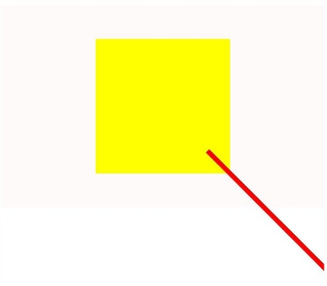

# Custom Drawing
<!--Kit: ArkUI-->
<!--Subsystem: ArkUI-->
<!--Owner: @xiang-shouxing-->
<!--Designer: @xiang-shouxing-->
<!--Tester: @sally__-->
<!--Adviser: @Brilliantry_Rui-->

The NDK supports custom drawing nodes, enabling you to implement custom rendering logic using the NDK APIs.

## Custom Drawing Content

When the registered event is detected as a drawing type, you can use the custom drawing feature to implement your own drawing logic and custom content.
> **NOTE**
> - During event registration, you must register the event as a drawing event (for example, **ARKUI_NODE_CUSTOM_EVENT_ON_DRAW**). You can find the event types and their meanings by referring to the [ArkUI_NodeCustomEventType](../reference/apis-arkui/capi-native-node-h.md#arkui_nodecustomeventtype) enum.
> 
> - To implement custom drawing logic, you must define custom **UserData** and pass it during event registration.

The following scenarios are based on the project configuration described in [Integrating with ArkTS Pages](ndk-access-the-arkts-page.md).

- Use the **create** API of **ArkUI_NativeNodeAPI_1** to create a custom node, passing **ARKUI_NODE_CUSTOM**.
    <!-- @[create_customNode_start](https://gitcode.com/openharmony/applications_app_samples/blob/master/code/DocsSample/ArkUISample/NativeType/NativeNodeUtilsSample/entry/src/main/cpp/Drawing.h) -->
    
    ``` C
    auto customNode = nodeAPI->createNode(ARKUI_NODE_CUSTOM);
    ```
    
- Register the custom event with the custom node, event type (for example, **ARKUI_NODE_CUSTOM_EVENT_ON_FOREGROUND_DRAW**; for details about the supported event types, see [ArkUI_NodeCustomEventType](../reference/apis-arkui/capi-native-node-h.md#arkui_nodecustomeventtype)), event ID, and **UserData**.
    <!-- @[userdata_start](https://gitcode.com/openharmony/applications_app_samples/blob/master/code/DocsSample/ArkUISample/NativeType/NativeNodeUtilsSample/entry/src/main/cpp/Drawing.h) -->
    
    ``` C
    // UserData
    struct A {
        int32_t a = 6;
        bool flag = true;
        ArkUI_NodeHandle node;
    };
    A *a = new A;
    a->node = customNode;
    // ···
    nodeAPI->registerNodeCustomEvent(customNode, ARKUI_NODE_CUSTOM_EVENT_ON_FOREGROUND_DRAW, 1, a);
    // Define the event callback.
    nodeAPI->registerNodeCustomEventReceiver([](ArkUI_NodeCustomEvent *event) {
        // Event callback logic
        // ···
    });
    ```
    
- In the callback, obtain the event type, event ID, and UserData to determine the execution logic using the following APIs: [OH_ArkUI_NodeCustomEvent_GetEventType](../reference/apis-arkui/capi-native-node-h.md#oh_arkui_nodecustomevent_geteventtype), [OH_ArkUI_NodeCustomEvent_GetEventTargetId](../reference/apis-arkui/capi-native-node-h.md#oh_arkui_nodecustomevent_geteventtargetid), and [OH_ArkUI_NodeCustomEvent_GetUserData](../reference/apis-arkui/capi-native-node-h.md#oh_arkui_nodecustomevent_getuserdata).

    <!-- @[nodeCustomEvent_start](https://gitcode.com/openharmony/applications_app_samples/blob/master/code/DocsSample/ArkUISample/NativeType/NativeNodeUtilsSample/entry/src/main/cpp/Drawing.h) -->
    
    ``` C
    auto type = OH_ArkUI_NodeCustomEvent_GetEventType(event);
    auto targetId = OH_ArkUI_NodeCustomEvent_GetEventTargetId(event);
    auto userData = reinterpret_cast<A *>(OH_ArkUI_NodeCustomEvent_GetUserData(event));
    ```
    
- Use [OH_ArkUI_NodeCustomEvent_GetDrawContextInDraw](../reference/apis-arkui/capi-native-node-h.md#oh_arkui_nodecustomevent_getdrawcontextindraw) to obtain the drawing context from the custom event, and then pass it to [OH_ArkUI_DrawContext_GetCanvas](../reference/apis-arkui/capi-native-type-h.md#oh_arkui_drawcontext_getcanvas) to obtain the drawing canvas pointer. This pointer is then cast to an **OH_Drawing_Canvas** pointer for drawing operations.
    <!-- @[drawCanvas_Start](https://gitcode.com/openharmony/applications_app_samples/blob/master/code/DocsSample/ArkUISample/NativeType/NativeNodeUtilsSample/entry/src/main/cpp/Drawing.h) -->
    
    ``` C
    // Obtain the drawing context for the custom event.
    auto *drawContext = OH_ArkUI_NodeCustomEvent_GetDrawContextInDraw(event);
    // Obtain the drawing canvas pointer.
    auto *canvas1 = OH_ArkUI_DrawContext_GetCanvas(drawContext);
    // Cast the pointer to an OH_Drawing_Canvas pointer for drawing.
    OH_Drawing_Canvas *canvas = reinterpret_cast<OH_Drawing_Canvas *>(canvas1);
    // Drawing logic.
    int32_t width = SIZE_1000;
    int32_t height = SIZE_1000;
    auto path = OH_Drawing_PathCreate();
    OH_Drawing_PathMoveTo(path, width / SIZE_4, height / SIZE_4);
    OH_Drawing_PathLineTo(path, width * SIZE_3 / SIZE_4, height * SIZE_3 / SIZE_4);
    OH_Drawing_PathLineTo(path, width * SIZE_3 / SIZE_4, height * SIZE_3 / SIZE_4);
    OH_Drawing_PathLineTo(path, width * SIZE_3 / SIZE_4, height * SIZE_3 / SIZE_4);
    OH_Drawing_PathLineTo(path, width * SIZE_3 / SIZE_4, height * SIZE_3 / SIZE_4);
    OH_Drawing_PathClose(path);
    auto pen = OH_Drawing_PenCreate();
    OH_Drawing_PenSetWidth(pen, SIZE_10);
    OH_Drawing_PenSetColor(pen, OH_Drawing_ColorSetArgb(RGBA_R1, RGBA_G1, RGBA_B1, RGBA_A1));
    OH_Drawing_CanvasAttachPen(canvas, pen);
    OH_Drawing_CanvasDrawPath(canvas, path);
    ```
    
**Complete content drawing example**:
<!-- @[drawing_start](https://gitcode.com/openharmony/applications_app_samples/blob/master/code/DocsSample/ArkUISample/NativeType/NativeNodeUtilsSample/entry/src/main/cpp/Drawing.h) -->

``` C
#include <arkui/native_node.h>
#include <arkui/native_node_napi.h>
#include <native_drawing/drawing_canvas.h>
#include <native_drawing/drawing_color.h>
#include <native_drawing/drawing_path.h>
#include <native_drawing/drawing_pen.h>

#define SIZE_3 3
#define SIZE_4 4
#define SIZE_10 10
#define SIZE_150 150
#define SIZE_200 200
#define SIZE_480 480
#define SIZE_720 720
#define SIZE_1000 1000
#define COLOR_YELLOW 0xFFFFFF00
#define RGBA_R1 0xFF
#define RGBA_G1 0xFF
#define RGBA_B1 0x00
#define RGBA_A1 0x00

ArkUI_NodeHandle test_draw(ArkUI_NativeNodeAPI_1 *nodeAPI)
{
    // Create a node.
    auto column = nodeAPI->createNode(ARKUI_NODE_COLUMN);
    auto customNode = nodeAPI->createNode(ARKUI_NODE_CUSTOM);
    ArkUI_NumberValue value[] = {SIZE_480};
    ArkUI_AttributeItem item = {value, 1};
    // Set attributes.
    nodeAPI->setAttribute(column, NODE_WIDTH, &item);
    value[0].i32 = SIZE_720;
    nodeAPI->setAttribute(column, NODE_HEIGHT, &item);
    ArkUI_NumberValue NODE_WIDTH_value[] = {SIZE_200};
    ArkUI_AttributeItem NODE_WIDTH_Item[] = {NODE_WIDTH_value, 1};
    ArkUI_NumberValue NODE_HEIGHT_value[] = {SIZE_200};
    ArkUI_AttributeItem NODE_HEIGHT_Item[] = {NODE_HEIGHT_value, 1};
    ArkUI_NumberValue NODE_BACKGROUND_COLOR_item_value[] = {{.u32 = COLOR_YELLOW}};
    ArkUI_AttributeItem NODE_BACKGROUND_COLOR_Item[] = {NODE_BACKGROUND_COLOR_item_value, 1};
    // UserData
    struct A {
        int32_t a = 6;
        bool flag = true;
        ArkUI_NodeHandle node;
    };
    A *a = new A;
    a->node = customNode;
    nodeAPI->setAttribute(customNode, NODE_WIDTH, NODE_WIDTH_Item);
    nodeAPI->setAttribute(customNode, NODE_HEIGHT, NODE_HEIGHT_Item);
    nodeAPI->setAttribute(customNode, NODE_BACKGROUND_COLOR, NODE_BACKGROUND_COLOR_Item);
    // Register the event.
    nodeAPI->registerNodeCustomEvent(customNode, ARKUI_NODE_CUSTOM_EVENT_ON_FOREGROUND_DRAW, 1, a);
    // Define the event callback.
    nodeAPI->registerNodeCustomEventReceiver([](ArkUI_NodeCustomEvent *event) {
        // Event callback logic
        // Obtain information from the custom event.
        auto type = OH_ArkUI_NodeCustomEvent_GetEventType(event);
        auto targetId = OH_ArkUI_NodeCustomEvent_GetEventTargetId(event);
        auto userData = reinterpret_cast<A *>(OH_ArkUI_NodeCustomEvent_GetUserData(event));
        if (type == ARKUI_NODE_CUSTOM_EVENT_ON_FOREGROUND_DRAW && targetId == 1 && userData->flag) {
            // Obtain the drawing context for the custom event.
            auto *drawContext = OH_ArkUI_NodeCustomEvent_GetDrawContextInDraw(event);
            // Obtain the drawing canvas pointer.
            auto *canvas1 = OH_ArkUI_DrawContext_GetCanvas(drawContext);
            // Cast the pointer to an OH_Drawing_Canvas pointer for drawing.
            OH_Drawing_Canvas *canvas = reinterpret_cast<OH_Drawing_Canvas *>(canvas1);
            // ···
            int32_t width = SIZE_1000;
            int32_t height = SIZE_1000;
            auto path = OH_Drawing_PathCreate();
            OH_Drawing_PathMoveTo(path, width / SIZE_4, height / SIZE_4);
            OH_Drawing_PathLineTo(path, width * SIZE_3 / SIZE_4, height * SIZE_3 / SIZE_4);
            OH_Drawing_PathLineTo(path, width * SIZE_3 / SIZE_4, height * SIZE_3 / SIZE_4);
            OH_Drawing_PathLineTo(path, width * SIZE_3 / SIZE_4, height * SIZE_3 / SIZE_4);
            OH_Drawing_PathLineTo(path, width * SIZE_3 / SIZE_4, height * SIZE_3 / SIZE_4);
            OH_Drawing_PathClose(path);
            auto pen = OH_Drawing_PenCreate();
            OH_Drawing_PenSetWidth(pen, SIZE_10);
            OH_Drawing_PenSetColor(pen, OH_Drawing_ColorSetArgb(RGBA_R1, RGBA_G1, RGBA_B1, RGBA_A1));
            OH_Drawing_CanvasAttachPen(canvas, pen);
            OH_Drawing_CanvasDrawPath(canvas, path);
        }
    });
    // Add the custom node to the tree.
    nodeAPI->addChild(column, customNode);
    return column;
}
```



## Custom Drawing Foreground and Background

The following example creates a custom drawing component capable of rendering custom rectangles, customizing foreground and background elements, and using the [custom layout container](ndk-build-custom-components.md#custom-layout-container) for layout management.

1. Prepare a project as instructed in [Custom Layout Container](ndk-build-custom-components.md#custom-layout-container).

2. Create an encapsulated object for the custom drawing component.

   <!-- @[arkUICustomNode_start](https://gitcode.com/openharmony/applications_app_samples/blob/master/code/DocsSample/ArkUISample/NativeType/NativeNodeUtilsSample/entry/src/main/cpp/ArkUICustomNode.h) -->
   
   ``` C
   #ifndef MYAPPLICATION_ARKUICUSTOMNODE_H
   #define MYAPPLICATION_ARKUICUSTOMNODE_H
   
   #include <native_drawing/drawing_brush.h>
   #include <native_drawing/drawing_canvas.h>
   #include <native_drawing/drawing_path.h>
   
   #include "ArkUINode.h"
   
   namespace NativeModule {
   class ArkUICustomNode : public ArkUINode {
   public:
       // Create the component using the custom component type ARKUI_NODE_CUSTOM.
       ArkUICustomNode()
           : ArkUINode((NativeModuleInstance::GetInstance()->GetNativeNodeAPI())->createNode(ARKUI_NODE_CUSTOM))
       {
           // Register the custom event listener.
           nativeModule_->addNodeCustomEventReceiver(handle_, OnStaticCustomEvent);
           // Declare the custom event and pass itself as custom data.
           nativeModule_->registerNodeCustomEvent(handle_, ARKUI_NODE_CUSTOM_EVENT_ON_DRAW_FRONT, 0, this);
           nativeModule_->registerNodeCustomEvent(handle_, ARKUI_NODE_CUSTOM_EVENT_ON_DRAW, 0, this);
           nativeModule_->registerNodeCustomEvent(handle_, ARKUI_NODE_CUSTOM_EVENT_ON_DRAW_BEHIND, 0, this);
           // Register a callback for the drawing completion event.
           OH_ArkUI_RegisterDrawCallbackOnNodeHandle(handle_, nullptr, [](void* userData) {});
       }
   
       ~ArkUICustomNode() override
       {
           // Unregister the custom event listener.
           nativeModule_->removeNodeCustomEventReceiver(handle_, OnStaticCustomEvent);
           // Remove the declaration of the custom event.
           nativeModule_->unregisterNodeCustomEvent(handle_, ARKUI_NODE_CUSTOM_EVENT_ON_DRAW_FRONT);
           nativeModule_->unregisterNodeCustomEvent(handle_, ARKUI_NODE_CUSTOM_EVENT_ON_DRAW);
           nativeModule_->unregisterNodeCustomEvent(handle_, ARKUI_NODE_CUSTOM_EVENT_ON_DRAW_BEHIND);
           OH_ArkUI_UnregisterDrawCallbackOnNodeHandle(handle_);
       }
   
   private:
       // ···
       static void OnStaticCustomEvent(ArkUI_NodeCustomEvent *event)
       {
           // Obtain the component instance object and call the related instance method.
           // ···
           auto customNode = reinterpret_cast<ArkUICustomNode *>(OH_ArkUI_NodeCustomEvent_GetUserData(event));
           auto type = OH_ArkUI_NodeCustomEvent_GetEventType(event);
           switch (type) {
               // The drawing layer is from low to high.
               case ARKUI_NODE_CUSTOM_EVENT_ON_DRAW_BEHIND:
                   customNode->OnDrawBehind(event);
                   break;
               case ARKUI_NODE_CUSTOM_EVENT_ON_DRAW:
                   customNode->OnDraw(event);
                   break;
               case ARKUI_NODE_CUSTOM_EVENT_ON_DRAW_FRONT:
                   customNode->OnDrawFront(event);
                   break;
               // ···
               default:
                   break;
           }
       }
   
       // Custom drawing logic
       void OnDrawBehind(ArkUI_NodeCustomEvent *event)
       {
           auto drawContext = OH_ArkUI_NodeCustomEvent_GetDrawContextInDraw(event);
           // Obtain the graphics drawing object.
           auto drawCanvas = reinterpret_cast<OH_Drawing_Canvas *>(OH_ArkUI_DrawContext_GetCanvas(drawContext));
           // Obtain the component size.
           auto size = OH_ArkUI_DrawContext_GetSize(drawContext);
           // Draw custom content.
           auto path = OH_Drawing_PathCreate();
           OH_Drawing_PathMoveTo(path, size.width / NUM_5, size.height / NUM_5);
           OH_Drawing_PathLineTo(path, size.width * NUM_4 / NUM_5, size.height / NUM_5);
           OH_Drawing_PathLineTo(path, size.width * NUM_4 / NUM_5, size.height * NUM_4 / NUM_5);
           OH_Drawing_PathLineTo(path, size.width / NUM_5, size.height * NUM_4 / NUM_5);
           OH_Drawing_PathLineTo(path, size.width / NUM_5, size.height / NUM_5);
           OH_Drawing_PathClose(path);
           auto brush = OH_Drawing_BrushCreate();
           OH_Drawing_BrushSetColor(brush, 0xFFF0FAFF); // Pale blue
           OH_Drawing_CanvasAttachBrush(drawCanvas, brush);
           OH_Drawing_CanvasDrawPath(drawCanvas, path);
           // Release resources.
           OH_Drawing_BrushDestroy(brush);
           OH_Drawing_PathDestroy(path);
       }
   
       void OnDraw(ArkUI_NodeCustomEvent *event)
       {
           auto drawContext = OH_ArkUI_NodeCustomEvent_GetDrawContextInDraw(event);
           // Obtain the graphics drawing object.
           auto drawCanvas = reinterpret_cast<OH_Drawing_Canvas *>(OH_ArkUI_DrawContext_GetCanvas(drawContext));
           // Obtain the component size.
           auto size = OH_ArkUI_DrawContext_GetSize(drawContext);
           // Draw custom content.
           auto path = OH_Drawing_PathCreate();
           OH_Drawing_PathMoveTo(path, size.width / NUM_4, size.height / NUM_4);
           OH_Drawing_PathLineTo(path, size.width * NUM_3 / NUM_4, size.height / NUM_4);
           OH_Drawing_PathLineTo(path, size.width * NUM_3 / NUM_4, size.height * NUM_3 / NUM_4);
           OH_Drawing_PathLineTo(path, size.width / NUM_4, size.height * NUM_3 / NUM_4);
           OH_Drawing_PathLineTo(path, size.width / NUM_4, size.height / NUM_4);
           OH_Drawing_PathClose(path);
           auto brush = OH_Drawing_BrushCreate();
           OH_Drawing_BrushSetColor(brush, 0xff2787D9); // Light blue
           OH_Drawing_CanvasAttachBrush(drawCanvas, brush);
           OH_Drawing_CanvasDrawPath(drawCanvas, path);
           // Release resources.
           OH_Drawing_BrushDestroy(brush);
           OH_Drawing_PathDestroy(path);
       }
   
       void OnDrawFront(ArkUI_NodeCustomEvent *event)
       {
           auto drawContext = OH_ArkUI_NodeCustomEvent_GetDrawContextInDraw(event);
           // Obtain the graphics drawing object.
           auto drawCanvas = reinterpret_cast<OH_Drawing_Canvas *>(OH_ArkUI_DrawContext_GetCanvas(drawContext));
           // Obtain the component size.
           auto size = OH_ArkUI_DrawContext_GetSize(drawContext);
           // Draw custom content.
           auto path = OH_Drawing_PathCreate();
           OH_Drawing_PathMoveTo(path, size.width / NUM_3, size.height / NUM_3);
           OH_Drawing_PathLineTo(path, size.width * NUM_2 / NUM_3, size.height / NUM_3);
           OH_Drawing_PathLineTo(path, size.width * NUM_2 / NUM_3, size.height * NUM_2 / NUM_3);
           OH_Drawing_PathLineTo(path, size.width / NUM_3, size.height * NUM_2 / NUM_3);
           OH_Drawing_PathLineTo(path, size.width / NUM_3, size.height / NUM_3);
           OH_Drawing_PathClose(path);
           auto brush = OH_Drawing_BrushCreate();
           OH_Drawing_BrushSetColor(brush, 0xFF004AAF); // Dark blue
           OH_Drawing_CanvasAttachBrush(drawCanvas, brush);
           OH_Drawing_CanvasDrawPath(drawCanvas, path);
           // Release resources.
           OH_Drawing_BrushDestroy(brush);
           OH_Drawing_PathDestroy(path);
       }
       // ···
   };
   
   } // namespace NativeModule
   
   #endif // MYAPPLICATION_ARKUICUSTOMNODE_H
   ```

3. Use the custom drawing component and custom container to create a sample UI.

    <!-- @[arkUICustomNodeCpp_start](https://gitcode.com/openharmony/applications_app_samples/blob/master/code/DocsSample/ArkUISample/NativeType/NativeNodeUtilsSample/entry/src/main/cpp/NativeEntry.cpp) -->
    
    ``` C++
    #include <arkui/native_node_napi.h>
    #include <arkui/native_type.h>
    #include <js_native_api.h>
    
    #include "NativeEntry.h"
    #include "ArkUICustomContainerNode.h"
    #include "ArkUICustomNode.h"
    
    // Declare global environment variables.
    static napi_env g_env = nullptr;
    // ...
    namespace NativeModule {
    // ...
    #define SIZE_150 150
    // ...
    napi_value CreateNativeRoot(napi_env env, napi_callback_info info)
    {
        size_t argc = 1;
        napi_value args[1] = {nullptr};
    
        napi_get_cb_info(env, info, &argc, args, nullptr, nullptr);
    
        // Obtain NodeContent.
        ArkUI_NodeContentHandle contentHandle;
        OH_ArkUI_GetNodeContentFromNapiValue(env, args[0], &contentHandle);
        // Create a custom container and a custom drawing component.
        auto node = std::make_shared<ArkUICustomContainerNode>();
        // Light gray
        node->SetBackgroundColor(0xFFD5D5D5);
        auto customNode = std::make_shared<ArkUICustomNode>();
        // Dark gray
        customNode->SetBackgroundColor(0xFF707070);
        customNode->SetWidth(SIZE_150);
        customNode->SetHeight(SIZE_150);
        node->AddChild(customNode);
        // Keep the native-side object in the management class to maintain its lifecycle.
        NativeEntry::GetInstance()->SetContentHandle(contentHandle);
        g_env = env;
            // ...
        return nullptr;
    }
    
    napi_value DestroyNativeRoot(napi_env env, napi_callback_info info)
    {
        // Release the native-side object from the management class.
        NativeEntry::GetInstance()->DisposeRootNode();
        return nullptr;
    }
    } // namespace NativeModule
    ```
    

