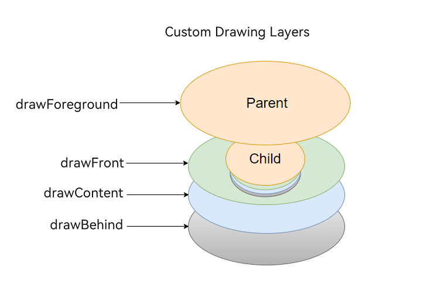
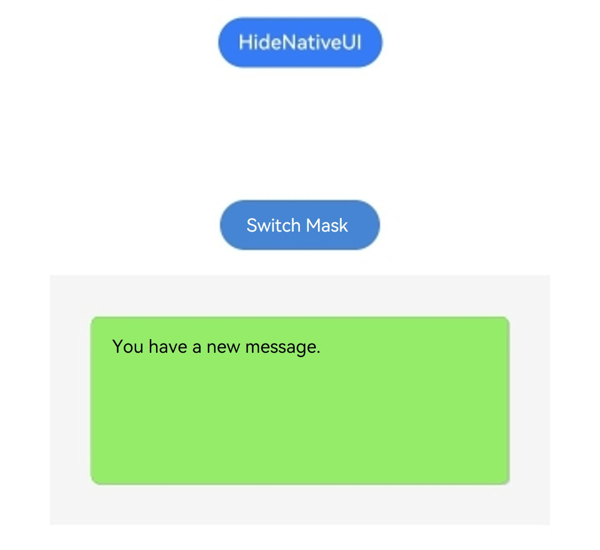
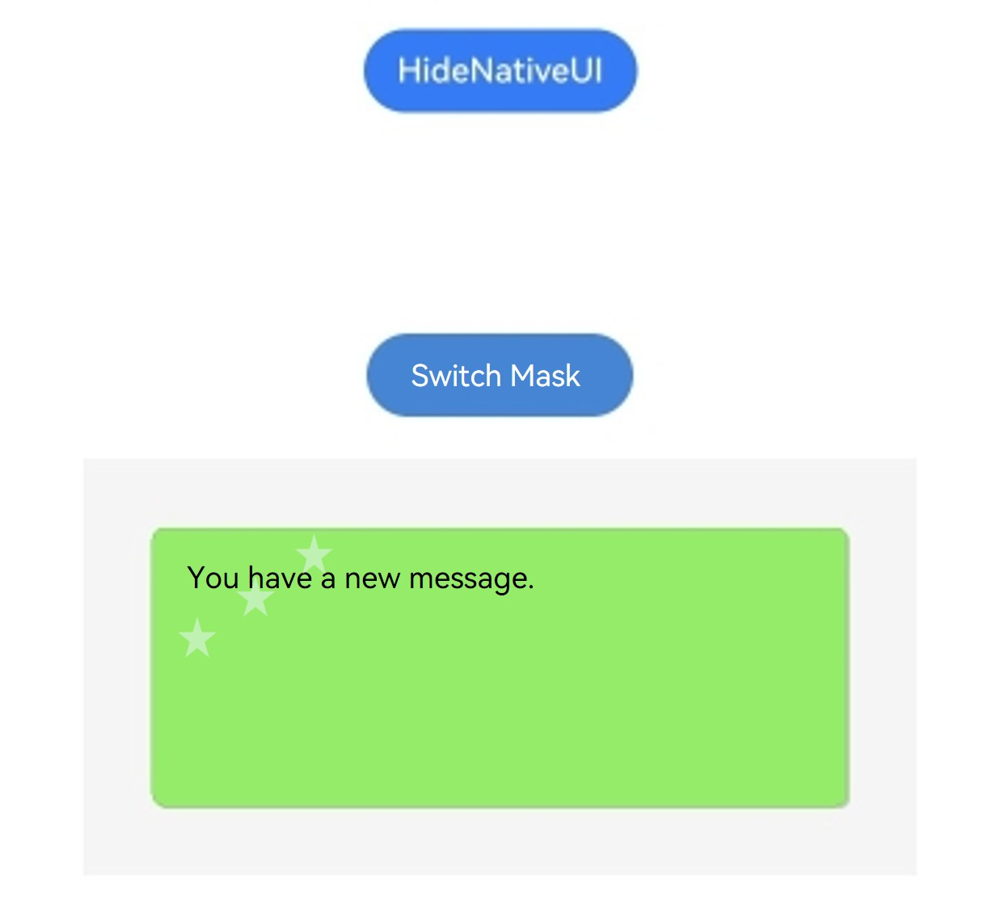

# Custom Drawing
<!--Kit: ArkUI-->
<!--Subsystem: ArkUI-->
<!--Owner: @wangyang2022-->
<!--Designer: @wangyang2022-->
<!--Tester: @sally__-->
<!--Adviser: @Brilliantry_Rui-->

## Overview

If the default drawing content of a component fails to meet your requirements, you can customize the component's drawing to achieve the desired effect. For example, you can create buttons in special shapes or icons that mix text and images. The NDK supports custom drawing nodes. Custom drawing events enable you to implement self-rendering based on nodes of the ARKUI_NODE_CUSTOM type in [ArkUI_NodeType](../reference/apis-arkui/capi-native-node-h.md#arkui_nodetype) on the NDK side.

> **NOTE**
>
> * For details about ArkTS-based custom drawing capabilities and examples, see [Custom Drawing Modifier (DrawModifier)](./arkts-user-defined-extension-drawModifier.md).

## Custom Drawing Layers

Custom drawing has five drawing layers in ascending order: content background layer (drawBehind), content layer (drawContent), content foreground layer (drawFront), foreground layer (drawForeground), and overlay layer (drawOverlay). You can select a proper layer for drawing as required. The following figure illustrates the layers of custom drawing.



You can register event types to implement custom drawing at different layers. The following table lists the enumerated values corresponding to these layers. For details about the event types supported by NDK APIs, see the enumerated values of [ArkUI_NodeCustomEventType](../reference/apis-arkui/capi-native-node-h.md#arkui_nodecustomeventtype).

| Event Type| Description|
| --- | --- |
| ARKUI_NODE_CUSTOM_EVENT_ON_DRAW_BEHIND | Custom content background layer drawing, supported since API version 20.|
| ARKUI_NODE_CUSTOM_EVENT_ON_DRAW | Custom content layer drawing.|
| ARKUI_NODE_CUSTOM_EVENT_ON_DRAW_FRONT | Custom content foreground layer drawing, supported since API version 20.|
| ARKUI_NODE_CUSTOM_EVENT_ON_FOREGROUND_DRAW | Custom foreground layer drawing.|
| ARKUI_NODE_CUSTOM_EVENT_ON_OVERLAY_DRAW | Custom overlay layer drawing.|


### Example of Custom Drawing at the Content Layer

In this example, the content layer drawing event **ARKUI_NODE_CUSTOM_EVENT_ON_DRAW** is registered to draw a diagonal line from the upper left area to the lower right area at the node content layer. The following figure shows the effect.

The following scenarios are based on the project configuration described in [Integrating with ArkTS Pages](ndk-access-the-arkts-page.md).  


1. Create a custom node by passing the enumerated value **ARKUI_NODE_CUSTOM** of [ArkUI_NodeType](../reference/apis-arkui/capi-native-node-h.md#arkui_nodecustomeventtype) through the [createNode](../reference/apis-arkui/capi-arkui-nativemodule-arkui-nativenodeapi-1.md#createnode) API of [ArkUI_NativeNodeAPI_1](../reference/apis-arkui/capi-arkui-nativemodule-arkui-nativenodeapi-1.md).

   <!-- @[create_customNode_start](https://gitcode.com/openharmony/applications_app_samples/blob/master/code/DocsSample/ArkUISample/NativeType/NativeDrawPageSample/entry/src/main/cpp/Drawing.h) -->
   
   ``` C
   auto customNode = nodeAPI->createNode(ARKUI_NODE_CUSTOM);
   ```
    
2. When an event is registered, the custom node, event type, event ID, and **UserData** are passed as parameters.

   <!-- @[userdata_start](https://gitcode.com/openharmony/applications_app_samples/blob/master/code/DocsSample/ArkUISample/NativeType/NativeDrawPageSample/entry/src/main/cpp/Drawing.h) -->
   
   ``` C
   // UserData
   struct A {
       int32_t a = 6;
       bool flag = true;
       ArkUI_NodeHandle node;
   };
   A *a = new A;
   a->node = customNode;
   // ...
   nodeAPI->registerNodeCustomEvent(customNode, ARKUI_NODE_CUSTOM_EVENT_ON_FOREGROUND_DRAW, 1, a);
   // Define the event callback.
   nodeAPI->registerNodeCustomEventReceiver([](ArkUI_NodeCustomEvent *event) {
       // Event callback logic
       // ...
   });
   ```
    
3. In the callback, use [OH_ArkUI_NodeCustomEvent_GetEventType](../reference/apis-arkui/capi-native-node-h.md#oh_arkui_nodecustomevent_geteventtype) to obtain the type of the custom event, [OH_ArkUI_NodeCustomEvent_GetEventTargetId](../reference/apis-arkui/capi-native-node-h.md#oh_arkui_nodecustomevent_geteventtargetid) to obtain the event ID, and [OH_ArkUI_NodeCustomEvent_GetUserData](../reference/apis-arkui/capi-native-node-h.md#oh_arkui_nodecustomevent_getuserdata) to obtain user data. Then, determine which drawing event is triggered based on the event type and event ID, and execute the corresponding logic.

   <!-- @[nodeCustomEvent_start](https://gitcode.com/openharmony/applications_app_samples/blob/master/code/DocsSample/ArkUISample/NativeType/NativeDrawPageSample/entry/src/main/cpp/Drawing.h) -->
   
   ``` C
   auto type = OH_ArkUI_NodeCustomEvent_GetEventType(event);
   auto targetId = OH_ArkUI_NodeCustomEvent_GetEventTargetId(event);
   auto userData = reinterpret_cast<A *>(OH_ArkUI_NodeCustomEvent_GetUserData(event));
   ```
    
 [OH_ArkUI_NodeCustomEvent_GetDrawContextInDraw](../reference/apis-arkui/capi-native-node-h.md#oh_arkui_nodecustomevent_getdrawcontextindraw) obtains the drawing context through the custom component event and transfers the drawing context to [OH_ArkUI_DrawContext_GetCanvas](../reference/apis-arkui/capi-native-type-h.md#oh_arkui_drawcontext_getcanvas) to obtain the canvas pointer. The pointer is then converted to an [OH_Drawing_Canvas](../reference/apis-arkgraphics2d/capi-drawing-oh-drawing-canvas.md) pointer for drawing.

   <!-- @[drawCanvas_Start](https://gitcode.com/openharmony/applications_app_samples/blob/master/code/DocsSample/ArkUISample/NativeType/NativeDrawPageSample/entry/src/main/cpp/Drawing.h) -->
   
   ``` C
   // Obtain the drawing context for the custom event.
   auto *drawContext = OH_ArkUI_NodeCustomEvent_GetDrawContextInDraw(event);
   // Obtain the pointer to the canvas.
   auto *canvas1 = OH_ArkUI_DrawContext_GetCanvas(drawContext);
   // Cast the pointer to an OH_Drawing_Canvas pointer for drawing.
   OH_Drawing_Canvas *canvas = reinterpret_cast<OH_Drawing_Canvas *>(canvas1);
   // Drawing logic.
   int32_t width = SIZE_1000;  // SIZE_1000 = 1000
   int32_t height = SIZE_1000; // SIZE_1000 = 1000
   auto path = OH_Drawing_PathCreate();
   OH_Drawing_PathMoveTo(path, width / SIZE_4, height / SIZE_4);                   // SIZE_4 = 4
   OH_Drawing_PathLineTo(path, width * SIZE_3 / SIZE_4, height * SIZE_3 / SIZE_4); // SIZE_3 = 3,SIZE_4 = 4
   OH_Drawing_PathClose(path);
   auto pen = OH_Drawing_PenCreate();
   OH_Drawing_PenSetWidth(pen, SIZE_10); // SIZE_10 = 10
   OH_Drawing_PenSetColor(pen, OH_Drawing_ColorSetArgb(0xFF, 0x00, 0x4A, 0x4F));
   OH_Drawing_CanvasAttachPen(canvas, pen);
   OH_Drawing_CanvasDrawPath(canvas, path);
   ```

### Multi-layer Drawing Example

The following example creates a custom drawing component to implement the following functions: rendering custom rectangles, customizing the content foreground and background layers, and using the [custom layout container](ndk-build-custom-components.md#custom-layout-container) for layout management.  


In the figure, the dark blue rectangle represents the **drawFront** layer, the light blue rectangle represents the **drawContent** layer, and the white rectangle represents the **drawBehind** layer. The overlay relationship of the three layers is used to verify whether the multi-layer drawing sequence meets the expectation.

1. Prepare a project as instructed in [Custom Layout Container](ndk-build-custom-components.md#custom-layout-container).

2. Create an encapsulated object for the custom drawing component.

   <!-- @[arkUICustomNode_start](https://gitcode.com/openharmony/applications_app_samples/blob/master/code/DocsSample/ArkUISample/NativeType/NativeNodeUtilsSample/entry/src/main/cpp/ArkUICustomNode.h) --> 
   
   ``` C
   #ifndef MYAPPLICATION_ARKUICUSTOMNODE_H
   #define MYAPPLICATION_ARKUICUSTOMNODE_H
   
   #include <native_drawing/drawing_brush.h>
   #include <native_drawing/drawing_canvas.h>
   #include <native_drawing/drawing_path.h>
   
   #include "ArkUINode.h"
   
   namespace NativeModule {
   class ArkUICustomNode : public ArkUINode {
   public:
       // Create the component using the custom component type ARKUI_NODE_CUSTOM.
       ArkUICustomNode()
           : ArkUINode((NativeModuleInstance::GetInstance()->GetNativeNodeAPI())->createNode(ARKUI_NODE_CUSTOM))
       {
           // Register the custom event listener.
           nativeModule_->addNodeCustomEventReceiver(handle_, OnStaticCustomEvent);
           // Declare the custom event and pass itself as custom data.
           nativeModule_->registerNodeCustomEvent(handle_, ARKUI_NODE_CUSTOM_EVENT_ON_DRAW_FRONT, 0, this);
           nativeModule_->registerNodeCustomEvent(handle_, ARKUI_NODE_CUSTOM_EVENT_ON_DRAW, 0, this);
           nativeModule_->registerNodeCustomEvent(handle_, ARKUI_NODE_CUSTOM_EVENT_ON_DRAW_BEHIND, 0, this);
           // Register a callback for the drawing completion event.
           OH_ArkUI_RegisterDrawCallbackOnNodeHandle(handle_, nullptr, [](void* userData) {});
       }
   
       ~ArkUICustomNode() override
       {
           // Unregister the custom event listener.
           nativeModule_->removeNodeCustomEventReceiver(handle_, OnStaticCustomEvent);
           // Remove the declaration of the custom event.
           nativeModule_->unregisterNodeCustomEvent(handle_, ARKUI_NODE_CUSTOM_EVENT_ON_DRAW_FRONT);
           nativeModule_->unregisterNodeCustomEvent(handle_, ARKUI_NODE_CUSTOM_EVENT_ON_DRAW);
           nativeModule_->unregisterNodeCustomEvent(handle_, ARKUI_NODE_CUSTOM_EVENT_ON_DRAW_BEHIND);
           OH_ArkUI_UnregisterDrawCallbackOnNodeHandle(handle_);
       }
   
   private:
       int32_t NUM_2 = 2;
       int32_t NUM_3 = 3;
       int32_t NUM_4 = 4;
       int32_t NUM_5 = 5;
       static void OnStaticCustomEvent(ArkUI_NodeCustomEvent *event)
       {
           // Obtain the component instance object and call the related instance method.
           // ...
           auto customNode = reinterpret_cast<ArkUICustomNode *>(OH_ArkUI_NodeCustomEvent_GetUserData(event));
           auto type = OH_ArkUI_NodeCustomEvent_GetEventType(event);
           switch (type) {
               // The drawing layer is from low to high.
               case ARKUI_NODE_CUSTOM_EVENT_ON_DRAW_BEHIND:
                   customNode->OnDrawBehind(event);
                   break;
               case ARKUI_NODE_CUSTOM_EVENT_ON_DRAW:
                   customNode->OnDraw(event);
                   break;
               case ARKUI_NODE_CUSTOM_EVENT_ON_DRAW_FRONT:
                   customNode->OnDrawFront(event);
                   break;
               // ...
               default:
                   break;
           }
       }
   
       // Custom drawing logic
       void OnDrawBehind(ArkUI_NodeCustomEvent *event)
       {
           auto drawContext = OH_ArkUI_NodeCustomEvent_GetDrawContextInDraw(event);
           // Obtain the graphics drawing object.
           auto drawCanvas = reinterpret_cast<OH_Drawing_Canvas *>(OH_ArkUI_DrawContext_GetCanvas(drawContext));
           // Obtain the component size.
           auto size = OH_ArkUI_DrawContext_GetSize(drawContext);
           // Draw custom content.
           auto path = OH_Drawing_PathCreate();
           OH_Drawing_PathMoveTo(path, size.width / NUM_5, size.height / NUM_5);
           OH_Drawing_PathLineTo(path, size.width * NUM_4 / NUM_5, size.height / NUM_5);
           OH_Drawing_PathLineTo(path, size.width * NUM_4 / NUM_5, size.height * NUM_4 / NUM_5);
           OH_Drawing_PathLineTo(path, size.width / NUM_5, size.height * NUM_4 / NUM_5);
           OH_Drawing_PathLineTo(path, size.width / NUM_5, size.height / NUM_5);
           OH_Drawing_PathClose(path);
           auto brush = OH_Drawing_BrushCreate();
           OH_Drawing_BrushSetColor(brush, 0xFFF0FAFF); // Pale blue
           OH_Drawing_CanvasAttachBrush(drawCanvas, brush);
           OH_Drawing_CanvasDrawPath(drawCanvas, path);
           // Release resources.
           OH_Drawing_BrushDestroy(brush);
           OH_Drawing_PathDestroy(path);
       }
   
       void OnDraw(ArkUI_NodeCustomEvent *event)
       {
           auto drawContext = OH_ArkUI_NodeCustomEvent_GetDrawContextInDraw(event);
           // Obtain the graphics drawing object.
           auto drawCanvas = reinterpret_cast<OH_Drawing_Canvas *>(OH_ArkUI_DrawContext_GetCanvas(drawContext));
           // Obtain the component size.
           auto size = OH_ArkUI_DrawContext_GetSize(drawContext);
           // Draw custom content.
           auto path = OH_Drawing_PathCreate();
           OH_Drawing_PathMoveTo(path, size.width / NUM_4, size.height / NUM_4);
           OH_Drawing_PathLineTo(path, size.width * NUM_3 / NUM_4, size.height / NUM_4);
           OH_Drawing_PathLineTo(path, size.width * NUM_3 / NUM_4, size.height * NUM_3 / NUM_4);
           OH_Drawing_PathLineTo(path, size.width / NUM_4, size.height * NUM_3 / NUM_4);
           OH_Drawing_PathLineTo(path, size.width / NUM_4, size.height / NUM_4);
           OH_Drawing_PathClose(path);
           auto brush = OH_Drawing_BrushCreate();
           OH_Drawing_BrushSetColor(brush, 0xff2787D9); // Light blue
           OH_Drawing_CanvasAttachBrush(drawCanvas, brush);
           OH_Drawing_CanvasDrawPath(drawCanvas, path);
           // Release resources.
           OH_Drawing_BrushDestroy(brush);
           OH_Drawing_PathDestroy(path);
       }
   
       void OnDrawFront(ArkUI_NodeCustomEvent *event)
       {
           auto drawContext = OH_ArkUI_NodeCustomEvent_GetDrawContextInDraw(event);
           // Obtain the graphics drawing object.
           auto drawCanvas = reinterpret_cast<OH_Drawing_Canvas *>(OH_ArkUI_DrawContext_GetCanvas(drawContext));
           // Obtain the component size.
           auto size = OH_ArkUI_DrawContext_GetSize(drawContext);
           // Draw custom content.
           auto path = OH_Drawing_PathCreate();
           OH_Drawing_PathMoveTo(path, size.width / NUM_3, size.height / NUM_3);
           OH_Drawing_PathLineTo(path, size.width * NUM_2 / NUM_3, size.height / NUM_3);
           OH_Drawing_PathLineTo(path, size.width * NUM_2 / NUM_3, size.height * NUM_2 / NUM_3);
           OH_Drawing_PathLineTo(path, size.width / NUM_3, size.height * NUM_2 / NUM_3);
           OH_Drawing_PathLineTo(path, size.width / NUM_3, size.height / NUM_3);
           OH_Drawing_PathClose(path);
           auto brush = OH_Drawing_BrushCreate();
           OH_Drawing_BrushSetColor(brush, 0xFF004AAF); // Dark blue
           OH_Drawing_CanvasAttachBrush(drawCanvas, brush);
           OH_Drawing_CanvasDrawPath(drawCanvas, path);
           // Release resources.
           OH_Drawing_BrushDestroy(brush);
           OH_Drawing_PathDestroy(path);
       }
       // ...
   };
   
   } // namespace NativeModule
   
   #endif // MYAPPLICATION_ARKUICUSTOMNODE_H
   ```

3. Use the custom drawing component and custom container to create a sample UI.

    <!-- @[arkUICustomNodeCpp_start](https://gitcode.com/openharmony/applications_app_samples/blob/master/code/DocsSample/ArkUISample/NativeType/NativeNodeUtilsSample/entry/src/main/cpp/NativeEntry.cpp) -->
    
    ``` C++
    #include <arkui/native_node_napi.h>
    #include <arkui/native_type.h>
    #include <js_native_api.h>
    
    #include "NativeEntry.h"
    #include "ArkUICustomContainerNode.h"
    #include "ArkUICustomNode.h"
    #include "ArkUIMessageMaskNode.h"
    
    // Declare global environment variables.
    static napi_env g_env = nullptr;
    // ...
    namespace NativeModule {
    // ...
    #define SIZE_150 150
    // ...
    napi_value CreateNativeRoot(napi_env env, napi_callback_info info)
    {
        size_t argc = 1;
        napi_value args[1] = {nullptr};
    
        napi_get_cb_info(env, info, &argc, args, nullptr, nullptr);
    
        // Obtain the NodeContent object.
        ArkUI_NodeContentHandle contentHandle;
        OH_ArkUI_GetNodeContentFromNapiValue(env, args[0], &contentHandle);
        NativeEntry::GetInstance()->SetContentHandle(contentHandle);
    
        // Create a custom container and a custom drawing component.
        auto node = std::make_shared<ArkUICustomContainerNode>();
        node->SetBackgroundColor(0xFFD5D5D5); // Light gray.
        auto customNode = std::make_shared<ArkUICustomNode>();
        customNode->SetBackgroundColor(0xFF707070); // Dark gray.
        customNode->SetWidth(SIZE_150);
        customNode->SetHeight(SIZE_150);
        node->AddChild(customNode);
    
        // Keep the native-side object in the management class to maintain its lifecycle.
        NativeEntry::GetInstance()->SetRootNode(node);
        g_env = env;
        return nullptr;
    }
    
    napi_value DestroyNativeRoot(napi_env env, napi_callback_info info)
    {
        // Release the native-side object from the management class.
        NativeEntry::GetInstance()->DisposeRootNode();
        return nullptr;
    }
    } // namespace NativeModule
    ```

## Implementing the Message Overlay Through Foreground Drawing

The following example creates a message prompt component. It draws message bubbles and text at the content layer and overlays star decorations at the foreground layer to highlight messages. This is commonly used in scenarios such as message notifications and guide marks.  

Effect without message overlay, overlay, and star decoration on the foreground layer:



Effect with message overlay and star decoration on the foreground layer:



1. Prepare a prerequisite project as instructed in [Multi-layer Drawing Example](#multi-layer-drawing-example).

2. Create the wrapper objects of the message overlay component.

   <!-- @[messageMaskNode_start](https://gitcode.com/openharmony/applications_app_samples/blob/master/code/DocsSample/ArkUISample/NativeType/NativeNodeUtilsSample/entry/src/main/cpp/ArkUIMessageMaskNode.h) -->
   
   ``` C
   #ifndef MYAPPLICATION_ARKUIMESSAGEMASKNODE_H
   #define MYAPPLICATION_ARKUIMESSAGEMASKNODE_H
   
   #include <cmath>
   #include <native_drawing/drawing_brush.h>
   #include <native_drawing/drawing_canvas.h>
   #include <native_drawing/drawing_color_filter.h>
   #include <native_drawing/drawing_font.h>
   #include <native_drawing/drawing_font_collection.h>
   #include <native_drawing/drawing_path.h>
   #include <native_drawing/drawing_pen.h>
   #include <native_drawing/drawing_point.h>
   #include <native_drawing/drawing_rect.h>
   #include <native_drawing/drawing_round_rect.h>
   #include <native_drawing/drawing_text_typography.h>
   
   #include <string>
   
   #include "ArkUINode.h"
   
   namespace NativeModule {
   class ArkUIMessageMaskNode : public ArkUINode {
   public:
       // Create the component using the custom component type ARKUI_NODE_CUSTOM.
       ArkUIMessageMaskNode()
           : ArkUINode(
                 (NativeModuleInstance::GetInstance()->GetNativeNodeAPI())->createNode(ARKUI_NODE_CUSTOM))
       {
           // Register the custom event listener.
           nativeModule_->addNodeCustomEventReceiver(handle_, OnStaticCustomEvent);
           // Declare the custom event and pass itself as custom data.
           nativeModule_->registerNodeCustomEvent(handle_, ARKUI_NODE_CUSTOM_EVENT_ON_DRAW_FRONT, 0, this);
           nativeModule_->registerNodeCustomEvent(handle_, ARKUI_NODE_CUSTOM_EVENT_ON_DRAW, 0, this);
           nativeModule_->registerNodeCustomEvent(handle_, ARKUI_NODE_CUSTOM_EVENT_ON_DRAW_BEHIND, 0, this);
       }
   
       ~ArkUIMessageMaskNode() override
       {
           // Unregister the custom event listener.
           nativeModule_->removeNodeCustomEventReceiver(handle_, OnStaticCustomEvent);
           // Remove the declaration of the custom event.
           nativeModule_->unregisterNodeCustomEvent(handle_, ARKUI_NODE_CUSTOM_EVENT_ON_DRAW_FRONT);
           nativeModule_->unregisterNodeCustomEvent(handle_, ARKUI_NODE_CUSTOM_EVENT_ON_DRAW);
           nativeModule_->unregisterNodeCustomEvent(handle_, ARKUI_NODE_CUSTOM_EVENT_ON_DRAW_BEHIND);
       }
   
       // Set the message text.
       void SetMessage(const std::string& message)
       {
           message_ = message;
           nativeModule_->markDirty(handle_, NODE_NEED_RENDER);
       }
   
       // Set whether to display the overlay.
       void SetMaskVisible(bool visible)
       {
           maskVisible_ = visible;
           nativeModule_->markDirty(handle_, NODE_NEED_RENDER);
       }
   
   private:
       static constexpr int starDecorationCount = 3;
       static constexpr int starPointCount = 5;
       static constexpr float starStartAngleDegrees = -90.0f;
       static constexpr float starAngleStepDegrees = 72.0f;
       static constexpr float starInnerAngleOffsetDegrees = 36.0f;
       static constexpr float starInnerRadiusRatio = 0.4f;
       static constexpr float degreeToRadian = 3.14159265f / 180.0f;
       static constexpr float messageTextFontSize = 23.0f;
   
       static void OnStaticCustomEvent(ArkUI_NodeCustomEvent* event)
       {
           auto customNode = reinterpret_cast<ArkUIMessageMaskNode*>(OH_ArkUI_NodeCustomEvent_GetUserData(event));
           auto type = OH_ArkUI_NodeCustomEvent_GetEventType(event);
           switch (type) {
               case ARKUI_NODE_CUSTOM_EVENT_ON_DRAW_BEHIND:
                   customNode->OnDrawBehind(event);
                   break;
               case ARKUI_NODE_CUSTOM_EVENT_ON_DRAW:
                   customNode->OnDraw(event);
                   break;
               case ARKUI_NODE_CUSTOM_EVENT_ON_DRAW_FRONT:
                   customNode->OnDrawFront(event);
                   break;
               default:
                   break;
           }
       }
   
       // Custom content background layer: Draw the background of the chat screen.
       void OnDrawBehind(ArkUI_NodeCustomEvent* event)
       {
           auto drawContext = OH_ArkUI_NodeCustomEvent_GetDrawContextInDraw(event);
           auto canvas = reinterpret_cast<OH_Drawing_Canvas*>(OH_ArkUI_DrawContext_GetCanvas(drawContext));
           auto size = OH_ArkUI_DrawContext_GetSize(drawContext);
   
           // Draw a light gray background.
           auto bgRect = OH_Drawing_RectCreate(0, 0, size.width, size.height);
           auto brush = OH_Drawing_BrushCreate();
           OH_Drawing_BrushSetColor(brush, 0xFFF5F5F5);
           OH_Drawing_CanvasAttachBrush(canvas, brush);
           OH_Drawing_CanvasDrawRect(canvas, bgRect);
           OH_Drawing_CanvasDetachBrush(canvas);
           OH_Drawing_BrushDestroy(brush);
           OH_Drawing_RectDestroy(bgRect);
       }
   
       // Custom the content layer.
       void OnDraw(ArkUI_NodeCustomEvent* event)
       {
           auto drawContext = OH_ArkUI_NodeCustomEvent_GetDrawContextInDraw(event);
           auto canvas = reinterpret_cast<OH_Drawing_Canvas*>(OH_ArkUI_DrawContext_GetCanvas(drawContext));
           auto size = OH_ArkUI_DrawContext_GetSize(drawContext);
   
           float padding = 50.0f;
           float bubbleWidth = size.width - 2 * padding;
           float bubbleHeight = size.height - 2 * padding;
           float cornerRadius = 8.0f;
           float textX = padding + 15.0f;
           float textY = padding + 20.0f;
           float textMaxWidth = bubbleWidth - 30.0f;
   
           // Draw the popup shadow.
           auto shadowRect = OH_Drawing_RectCreate(
               padding + 2, padding + 2, padding + bubbleWidth + 2, padding + bubbleHeight + 2);
           auto* shadowRoundRect = OH_Drawing_RoundRectCreate(shadowRect, cornerRadius, cornerRadius);
           auto shadowBrush = OH_Drawing_BrushCreate();
           OH_Drawing_BrushSetColor(shadowBrush, 0x30000000);
           OH_Drawing_CanvasAttachBrush(canvas, shadowBrush);
           OH_Drawing_CanvasDrawRoundRect(canvas, shadowRoundRect);
           OH_Drawing_CanvasDetachBrush(canvas);
           OH_Drawing_BrushDestroy(shadowBrush);
           OH_Drawing_RoundRectDestroy(shadowRoundRect);
           OH_Drawing_RectDestroy(shadowRect);
   
           // Draw the green popup background.
           auto bubbleRect = OH_Drawing_RectCreate(padding, padding, padding + bubbleWidth, padding + bubbleHeight);
           auto* bubbleRoundRect = OH_Drawing_RoundRectCreate(bubbleRect, cornerRadius, cornerRadius);
           auto bubbleBrush = OH_Drawing_BrushCreate();
           OH_Drawing_BrushSetColor(bubbleBrush, 0xFF95EC69);
           OH_Drawing_CanvasAttachBrush(canvas, bubbleBrush);
           OH_Drawing_CanvasDrawRoundRect(canvas, bubbleRoundRect);
           OH_Drawing_CanvasDetachBrush(canvas);
           OH_Drawing_BrushDestroy(bubbleBrush);
   
           // Draw the popup border.
           auto pen = OH_Drawing_PenCreate();
           OH_Drawing_PenSetWidth(pen, 1.0f);
           OH_Drawing_PenSetColor(pen, 0xFF7FD65A);
           OH_Drawing_CanvasAttachPen(canvas, pen);
           OH_Drawing_CanvasDrawRoundRect(canvas, bubbleRoundRect);
           OH_Drawing_CanvasDetachPen(canvas);
           OH_Drawing_PenDestroy(pen);
           OH_Drawing_RoundRectDestroy(bubbleRoundRect);
           OH_Drawing_RectDestroy(bubbleRect);
   
           // Draw the message text.
           DrawMessageText(canvas, textX, textY, textMaxWidth);
       }
   
       // Custom the content foreground layer: Draw a decorative overlay.
       void OnDrawFront(ArkUI_NodeCustomEvent* event)
       {
           if (!maskVisible_) {
               return;
           }
   
           auto drawContext = OH_ArkUI_NodeCustomEvent_GetDrawContextInDraw(event);
           auto canvas = reinterpret_cast<OH_Drawing_Canvas*>(OH_ArkUI_DrawContext_GetCanvas(drawContext));
   
           float padding = 50.0f;
   
           auto starBrush = OH_Drawing_BrushCreate();
           OH_Drawing_BrushSetColor(starBrush, 0x88FFFFFF);
           OH_Drawing_CanvasAttachBrush(canvas, starBrush);
   
           const float starRadius = 13.0f;
           const float textLeftX = padding + 26.0f;
           const float textRightX = padding + 146.0f;
           const float starBottomY = padding + 50.0f;
           const float starTopY = padding + 10.0f;
           for (int i = 0; i < starDecorationCount; ++i) {
               float t = static_cast<float>(i) / static_cast<float>(starDecorationCount - 1);
               float starX = textLeftX + (textRightX - textLeftX) * t;
               float starY = starBottomY + (starTopY - starBottomY) * t;
               DrawStar(canvas, starX, starY, starRadius);
           }
   
           OH_Drawing_CanvasDetachBrush(canvas);
           OH_Drawing_BrushDestroy(starBrush);
       }
   
       // Draw a five-pointed star.
       void DrawStar(OH_Drawing_Canvas* canvas, float cx, float cy, float radius)
       {
           auto path = OH_Drawing_PathCreate();
           for (int i = 0; i < starPointCount; ++i) {
               float angle = starStartAngleDegrees + i * starAngleStepDegrees;
               float rad = angle * degreeToRadian;
               float x = cx + radius * std::cos(rad);
               float y = cy + radius * std::sin(rad);
               if (i == 0) {
                   OH_Drawing_PathMoveTo(path, x, y);
               } else {
                   OH_Drawing_PathLineTo(path, x, y);
               }
   
               // Inner vertex.
               float innerAngle = angle + starInnerAngleOffsetDegrees;
               float innerRad = innerAngle * degreeToRadian;
               float innerX = cx + radius * starInnerRadiusRatio * std::cos(innerRad);
               float innerY = cy + radius * starInnerRadiusRatio * std::sin(innerRad);
               OH_Drawing_PathLineTo(path, innerX, innerY);
           }
   
           OH_Drawing_PathClose(path);
           OH_Drawing_CanvasDrawPath(canvas, path);
           OH_Drawing_PathDestroy(path);
       }
   
       // Draw the message text.
       void DrawMessageText(OH_Drawing_Canvas* canvas, float x, float y, float maxWidth)
       {
           // Create a font set.
           auto* fontCollection = OH_Drawing_CreateFontCollection();
   
           // Create a typography style.
           auto* typographyStyle = OH_Drawing_CreateTypographyStyle();
           OH_Drawing_SetTypographyTextAlign(typographyStyle, TEXT_ALIGN_LEFT);
   
           // Create a typography processor.
           auto* typographyHandler = OH_Drawing_CreateTypographyHandler(typographyStyle, fontCollection);
   
           // Create a text style.
           auto* textStyle = OH_Drawing_CreateTextStyle();
           OH_Drawing_SetTextStyleColor(textStyle, 0xFF000000); // Pure black.
           OH_Drawing_SetTextStyleFontSize(textStyle, messageTextFontSize);
           OH_Drawing_SetTextStyleFontWeight(textStyle, FONT_WEIGHT_400);
           auto textBrush = OH_Drawing_BrushCreate();
           OH_Drawing_BrushSetColor(textBrush, 0xFF000000);
           OH_Drawing_SetTextStyleForegroundBrush(textStyle, textBrush);
   
           // Add text.
           OH_Drawing_TypographyHandlerPushTextStyle(typographyHandler, textStyle);
           OH_Drawing_TypographyHandlerAddText(typographyHandler, message_.c_str());
           OH_Drawing_TypographyHandlerPopTextStyle(typographyHandler);
   
           // Create a typography object and draw the text.
           auto* typography = OH_Drawing_CreateTypography(typographyHandler);
           OH_Drawing_TypographyLayout(typography, maxWidth);
           OH_Drawing_TypographyPaint(typography, canvas, x, y);
   
           // Release resources.
           OH_Drawing_DestroyTextStyle(textStyle);
           OH_Drawing_DestroyTypography(typography);
           OH_Drawing_DestroyTypographyHandler(typographyHandler);
           OH_Drawing_DestroyTypographyStyle(typographyStyle);
           OH_Drawing_DestroyFontCollection(fontCollection);
           OH_Drawing_BrushDestroy(textBrush);
       }
   
       std::string message_ = "";
       bool maskVisible_ = false;
   };
   } // namespace NativeModule
   
   #endif // MYAPPLICATION_ARKUIMESSAGEMASKNODE_H
   ```
   
3. Use the message overlay component to create a sample UI.

    <!-- @[messageMaskCpp_start](https://gitcode.com/openharmony/applications_app_samples/blob/master/code/DocsSample/ArkUISample/NativeType/NativeNodeUtilsSample/entry/src/main/cpp/NativeEntry.cpp) -->
    
    ``` C++
    #include <arkui/native_node_napi.h>
    #include <arkui/native_type.h>
    #include <js_native_api.h>
    
    #include "NativeEntry.h"
    #include "ArkUICustomContainerNode.h"
    #include "ArkUICustomNode.h"
    #include "ArkUIMessageMaskNode.h"
    
    // Declare global environment variables.
    static napi_env g_env = nullptr;
    // ...
    namespace NativeModule {
    // ...
    napi_value CreateNativeMessageRoot(napi_env env, napi_callback_info info)
    {
        constexpr int32_t messageMaskWidth = 400;
        constexpr int32_t messageMaskHeight = 200;
    
        size_t argc = 1;
        napi_value args[1] = {nullptr};
    
        napi_get_cb_info(env, info, &argc, args, nullptr, nullptr);
    
        // Avoid repeated mounting caused by repeated creation.
        NativeEntry::GetInstance()->DisposeRootNode();
    
        // Obtain NodeContent.
        ArkUI_NodeContentHandle contentHandle;
        OH_ArkUI_GetNodeContentFromNapiValue(env, args[0], &contentHandle);
        NativeEntry::GetInstance()->SetContentHandle(contentHandle);
    
        auto nodeAPI = NativeModuleInstance::GetInstance()->GetNativeNodeAPI();
        auto rootColumn = std::make_shared<ArkUIColumnNode>();
        auto rootColumnHandle = rootColumn->GetHandle();
        
        // Set the style of the root container.
        ArkUI_NumberValue paddingValue[] = {{.f32 = 20.0f}};
        ArkUI_AttributeItem paddingItem = {paddingValue, 1};
        nodeAPI->setAttribute(rootColumnHandle, NODE_PADDING, &paddingItem);
    
        ArkUI_NumberValue bgColorValue[] = {{.u32 = 0xFFFFFFFF}};
        ArkUI_AttributeItem bgColorItem = {bgColorValue, 1};
        nodeAPI->setAttribute(rootColumnHandle, NODE_BACKGROUND_COLOR, &bgColorItem);
        
        // Create a message bubble component.
        auto maskNode = std::make_shared<ArkUIMessageMaskNode>();
        maskNode->SetWidth(messageMaskWidth);
        maskNode->SetHeight(messageMaskHeight);
        maskNode->SetMessage("You have a new message.");
        maskNode->SetMaskVisible(false); // The overlay is not displayed initially.
        
        // Create a button to switch the overlay effect.
        auto buttonNode = std::make_shared<ArkUINode>(nodeAPI->createNode(ARKUI_NODE_BUTTON));
        auto buttonHandle = buttonNode->GetHandle();
        
        // Set the button text.
        ArkUI_AttributeItem labelItem;
        const char* buttonLabel = "Switch Overlay Effect";
        labelItem.string = buttonLabel;
        nodeAPI->setAttribute(buttonHandle, NODE_BUTTON_LABEL, &labelItem);
        
        // Set the button style.
        ArkUI_NumberValue marginValue[] = {{.f32 = 20.0f}};
        ArkUI_AttributeItem marginItem = {marginValue, 1};
        nodeAPI->setAttribute(buttonHandle, NODE_MARGIN, &marginItem);
        
        ArkUI_NumberValue btnBgColorValue[] = {{.u32 = 0xFF2787D9}};
        ArkUI_AttributeItem btnBgColorItem = {btnBgColorValue, 1};
        nodeAPI->setAttribute(buttonHandle, NODE_BACKGROUND_COLOR, &btnBgColorItem);
    
        // Set the button tapping event.
        auto onClick = [](ArkUI_NodeEvent *event) {
            auto maskNode = (ArkUIMessageMaskNode *)OH_ArkUI_NodeEvent_GetUserData(event);
            static bool highlighted = false;
            highlighted = !highlighted;
            maskNode->SetMaskVisible(highlighted);
        };
        buttonNode->RegisterOnClick(onClick, maskNode.get());
        
        // Add the component to the root container.
        rootColumn->AddChild(buttonNode);
        rootColumn->AddChild(maskNode);
    
        // Keep the native-side object in the management class to maintain its lifecycle.
        NativeEntry::GetInstance()->SetRootNode(rootColumn);
        return nullptr;
    }
    
    napi_value DestroyNativeRoot(napi_env env, napi_callback_info info)
    {
        // Release the native-side object from the management class.
        NativeEntry::GetInstance()->DisposeRootNode();
        return nullptr;
    }
    } // namespace NativeModule
    ```
    
