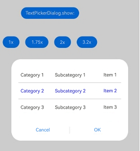
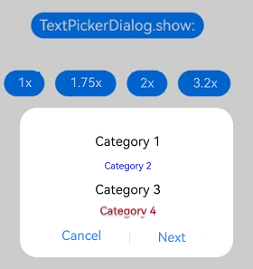

# Supporting Aging-Friendly Design
<!--Kit: ArkUI-->
<!--Subsystem: ArkUI-->
<!--Owner: @liyi0309-->
<!--Designer: @liyi0309-->
<!--Tester: @fredyuan912-->
<!--Adviser: @Brilliantry_Rui-->

<!--RP1-->

## Basic Concepts

Aging-friendly design offers a method to enlarge selected areas or components through a long-press action with a mouse or finger. Specifically, when the system font is larger than 1x, this action on a component with aging-friendly features extracts data from the component within the selected area and presents it in a dialog box. This way, both the component and its internal data (child components) are enlarged, and the entire component is centered on the screen for better visibility.

## Constraints

* Aging-friendly rules

  To ensure that components enlarge appropriately when the system font size is greater than 1x, you need to configure the [configuration tag](../quick-start/app-configuration-file.md#configuration) for implementing an aging-friendly feature.

* Aging-friendly operations

  Long-pressing a component that supports aging-friendly capabilities triggers a dialog box. The aging-friendly operation ends when the user releases the press. When the system font size is set to be greater than 1x, the component automatically enlarges, and when the system font size returns to 1x, the component returns to its normal state.

* Aging-friendly objects

  The components that trigger the aging-friendly operation and provide the data.

* Aging-friendly dialog box targets

  The components capable of receiving and processing the aging-friendly data.

* Dialog box restrictions

  When users set the system font to more than 2x, the dialog box content, including icons and text, is magnified at a fixed 2x scale.

* Combination with other capabilities

  Aging-friendly capabilities can be integrated with other features (such as swipe and drag). When the bottom tab bar (**tabBar**) component is activated for aging-friendly features, users can swipe their fingers or use a mouse to trigger aging-friendly features for other child components within the tab bar.

## Aging-Friendly Component Adaptation and Activation Methods

| Activation Method            | Component                                                    |
| -------------------- | ------------------------------------------------------------ |
| Long press on the component        | [SideBarContainer](../reference/apis-arkui/arkui-ts/ts-container-sidebarcontainer.md), [Bottom Tab Bar (tabBar)](../reference/apis-arkui/arkui-ts/ts-container-tabcontent.md#tabbar9), [Navigation](../reference/apis-arkui/arkui-ts/ts-basic-components-navigation.md), [NavDestination](../reference/apis-arkui/arkui-ts/ts-basic-components-navdestination.md), [Tabs](../reference/apis-arkui/arkui-ts/ts-container-tabs.md)|
| Default system font enlargement| [PickerDialog](arkts-fixes-style-dialog.md#picker-dialog-box-pickerdialog), [Button](../reference/apis-arkui/arkui-ts/ts-basic-components-button.md), [Menu](../reference/apis-arkui/arkui-ts/ts-basic-components-menu.md), [Stepper](../reference/apis-arkui/arkui-ts/ts-basic-components-stepper.md), [BindSheet](../reference/apis-arkui/arkui-ts/ts-universal-attributes-sheet-transition.md#bindsheet), [TextInput](../reference/apis-arkui/arkui-ts/ts-basic-components-textinput.md), [TextArea](../reference/apis-arkui/arkui-ts/ts-basic-components-textarea.md), [Search](../reference/apis-arkui/arkui-ts/ts-basic-components-search.md), [SelectionMenu](../reference/apis-arkui/arkui-ts/ohos-arkui-advanced-SelectionMenu.md), [Chip](../reference/apis-arkui/arkui-ts/ohos-arkui-advanced-Chip.md), [Dialog](../reference/apis-arkui/arkui-ts/ohos-arkui-advanced-Dialog.md), [Slider](../reference/apis-arkui/arkui-ts/ts-basic-components-slider.md), [Progress](../reference/apis-arkui/arkui-ts/ts-basic-components-progress.md), [Badge](../reference/apis-arkui/arkui-ts/ts-container-badge.md)|

## Example

This example uses the **SideBarContainer** component to trigger an aging-friendly dialog box through a long press of the control button. Note that the dialog box does not appear if the system font size is at the 1x setting. Instead, it appears only when the system font size is set to greater than 1x.

<!-- @[trigger_aging_friendly_by_long_press](https://gitcode.com/openharmony/applications_app_samples/blob/master/code/DocsSample/ArkUISample/SupportingAgingFriendly/entry/src/main/ets/pages/SideBarContainer.ets) -->

``` TypeScript
import { hilog } from '@kit.PerformanceAnalysisKit';

const TAG = '[Sample_SupportingAgingFriendly]';
const DOMAIN = 0xF811;
const BUNDLE = 'SupportingAgingFriendly_';
const NUMBER1 = 1;
const NUMBER2 = 2;
const NUMBER3 = 3;

@Entry
@Component
struct SideBarContainerExample {
  @State currentFontSizeScale: number = NUMBER1;
  normalIcon: Resource = $r('app.media.icon'); // Replace  $r('app.media.icon') with the image resource file you use.
  selectedIcon: Resource = $r('app.media.icon'); // Replace  $r('app.media.icon') with the image resource file you use.
  @State arr: number[] = [NUMBER1, NUMBER2, NUMBER3];
  @State current: number = NUMBER1;
  @State title: string = 'Index01';

  build() {
    SideBarContainer(SideBarContainerType.Embed) {
      Column() {
        ForEach(this.arr, (item: number) => {
          Column({ space: 5 }) {
            Image(this.current === item ? this.selectedIcon : this.normalIcon).width(64).height(64);
            Text('0' + item)
              .fontSize(25)
              .fontColor(this.current === item ? '#0A59F7' : '#999')
              .fontFamily('source-sans-pro,cursive,sans-serif')
          }
          .onClick(() => {
            this.current = item;
            this.title = 'Index0' + item;
          })
        }, (item: string) => item)
      }.width('100%')
      .justifyContent(FlexAlign.SpaceEvenly)
      // Replace $r('sys.color.mask_fifth') with the resource file you use.
      .backgroundColor($r('sys.color.mask_fifth'))
    }
    .controlButton({
      icons: {
        // Replace $r('sys.media.ohos_ic_public_drawer_open_filled') with the resource file you use.
        hidden: $r('sys.media.ohos_ic_public_drawer_open_filled'),
        // Replace $r('sys.media.ohos_ic_public_drawer_close') with the resource file you use.
        shown: $r('sys.media.ohos_ic_public_drawer_close')
      }
    })
    .sideBarWidth(150)
    .minSideBarWidth(50)
    .maxSideBarWidth(300)
    .minContentWidth(0)
    .onChange((value: boolean) => {
      hilog.info(DOMAIN, TAG, BUNDLE + 'status:' + value);
    })
    .divider({ strokeWidth: '1vp', color: Color.Gray, startMargin: '4vp', endMargin: '4vp' });
  }
}
```

Switching system font sizes and long-pressing components with aging-friendly capabilities produces the following effects.

| System Font at 1x (Before Aging-Friendly Features Are Enabled)| System Font at 1.75x (After Aging-Friendly Features Are Enabled)|
| ---------------------------------- | ------------------------------------ |
|           |             |

The [TextPickerDialog](../reference/apis-arkui/arkui-ts/ts-methods-textpicker-dialog.md) component triggers an aging-friendly dialog box when the system font is set to greater than 1x, which does not occur at the default 1x setting.

<!-- @[trigger_aging_friendly_by_set_font_size](https://gitcode.com/openharmony/applications_app_samples/blob/master/code/DocsSample/ArkUISample/SupportingAgingFriendly/entry/src/main/ets/pages/TextPickerDialog.ets) -->

``` TypeScript
import { hilog } from '@kit.PerformanceAnalysisKit';

const TAG = '[Sample_SupportingAgingFriendly]';
const DOMAIN = 0xF811;
const BUNDLE = 'SupportingAgingFriendly_';

@Entry
@Component
struct TextPickerExample {
  private select: number | number[] = 0;
  private cascade: TextCascadePickerRangeContent[] = [
    {
      // Replace $r('app.string.xxx') with the resource file you use.
      text: $r('app.string.liaoning'),
      children: [{ text: $r('app.string.shenyang'), children: [{ text: $r('app.string.shenhe') },
        { text: $r('app.string.heping') }, { text: $r('app.string.hunnan') }] },
        { text: $r('app.string.dalian'), children: [{ text: $r('app.string.zhongshan') },
        { text: $r('app.string.jinzhou') }, { text: $r('app.string.changhai') }] }]
    },
    {
      // Replace $r('app.string.xxx') with the resource file you use.
      text: $r('app.string.jilin'),
      children: [{ text: $r('app.string.changchun'), children: [{ text: $r('app.string.nangang') },
        { text: $r('app.string.kuanchen') }, { text: $r('app.string.chaoyang') }] },
        { text: $r('app.string.sipin'), children: [{ text: $r('app.string.tiexi') },
        { text: $r('app.string.tiedong') }, { text: $r('app.string.lishu') }] }]
    },
    {
      // Replace $r('app.string.xxx') with the resource file you use.
      text: $r('app.string.heilingjiang'),
      children: [{ text: $r('app.string.haerbin'), children: [{ text: $r('app.string.daoli') },
        { text: $r('app.string.daowai') }, { text: $r('app.string.nangang') }] },
        { text: $r('app.string.mudanjiang'), children: [{ text: $r('app.string.dongan') },
        { text: $r('app.string.xian')}, { text: $r('app.string.aimin') }] }]
    }
  ]
  @State value: string = '';
  @State showTriggered: string = '';
  private triggered: string = '';
  private maxLines: number = 3; // Maximum number of lines: 3

  linesNum(max: number): void {
    let items: string[] = this.triggered.split('\n').filter(item => item != '');
    if (items.length > max) {
      this.showTriggered = items.slice(-this.maxLines).join('\n');
    } else {
      this.showTriggered = this.triggered;
    }
  }

  build() {
    Column() {
      Button('TextPickerDialog.show:' + this.value)
        .onClick(() => {
          this.getUIContext().showTextPickerDialog({
            range: this.cascade,
            selected: this.select,
            onAccept: (value: TextPickerResult) => {
              this.select = value.index;
              hilog.info(DOMAIN, TAG, BUNDLE + this.select + '');
              this.value = value.value as string;
              hilog.info(DOMAIN, TAG, BUNDLE + 'TextPickerDialog:onAccept()' + JSON.stringify(value));
              if (this.triggered != '') {
                this.triggered += `\nonAccept(${JSON.stringify(value)})`;
              } else {
                this.triggered = `onAccept(${JSON.stringify(value)})`;
              }
              this.linesNum(this.maxLines);
            },
            onCancel: () => {
              hilog.info(DOMAIN, TAG, BUNDLE + 'TextPickerDialog:onCancel()');
              if (this.triggered != '') {
                this.triggered += `\nonCancel()`;
              } else {
                this.triggered = `onCancel()`;
              }
              this.linesNum(this.maxLines);
            },
            onChange: (value: TextPickerResult) => {
              hilog.info(DOMAIN, TAG, BUNDLE + 'TextPickerDialog:onChange()' + JSON.stringify(value));
              if (this.triggered != '') {
                this.triggered += `\nonChange(${JSON.stringify(value)})`;
              } else {
                this.triggered = `onChange(${JSON.stringify(value)})`;
              }
              this.linesNum(this.maxLines);
            },
          })
        })
        .margin({ top: 60 });
    }
  }
}
```

| System Font at 1x (Before Aging-Friendly Features Are Enabled)| System Font at 1.75x (After Aging-Friendly Features Are Enabled)|
| ---------------------------------- | ------------------------------------ |
|           |             |
<!--RP1End-->
