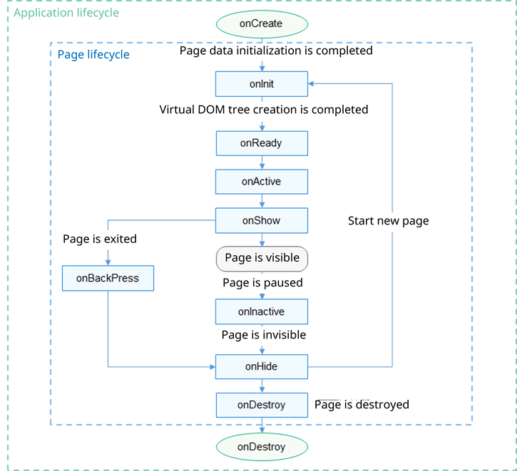

# Lifecycle
<!--Kit: ArkUI-->
<!--Subsystem: ArkUI-->
<!--Owner: @mayaolll-->
<!--Designer: @jiangdayuan-->
<!--Tester: @lxl007-->
<!--Adviser: @Brilliantry_Rui-->

## Application Lifecycle

You can define the following application lifecycle methods in the **app.js** file.

| API| Type| Description| Called When|
| -------- | -------- | -------- | -------- |
| onCreate | () =&gt; void | Listens for application creation.| The application is created.|
| onShow<sup>6+</sup> | () =&gt; void | Listens for whether the application is running in the foreground.| The application is running in the foreground.|
| onHide<sup>6+</sup> | () =&gt; void | Listens for whether the application is running in the background.| The application is running in the background.|
| onDestroy | () =&gt; void | Listens for application uninstallation.| The application exits.|


## Page Lifecycle

You can define the following page lifecycle functions in the **.js** file of the page.

| API| Type| Description| Called When|
| -------- | -------- | -------- | -------- |
| onInit | () =&gt; void | Listens for page initialization.| Page initialization is complete. This function is called only once in the page lifecycle.|
| onReady | () =&gt; void | Listens for page creation.| A page is created. This function is called only once in the page lifecycle.|
| onShow | () =&gt; void | Listens for page display.| The page is displayed.|
| onHide | () =&gt; void | Listens for page hiding.| The page is hidden.|
| onDestroy | () =&gt; void | Listens for page destruction.| The page is destroyed.|
| onBackPress | () =&gt; boolean | Listens for the back button action.| The back button is touched.<br>- **true**: The page handles the return logic itself.<br>- **false**: The default return logic is used.<br>- No value: The default return logic is used.|
| onActive()<sup>5+</sup> | () =&gt; void | Listens for page activation.| The page is activated.|
| onInactive()<sup>5+</sup> | () =&gt; void | Listens for page suspension.| The page is suspended.|
| onNewRequest()<sup>5+</sup> | () =&gt; void | Listens for a new FA request.| The FA has been started and a new request is received.|

The typical call sequence of lifecycle functions is illustrated below.

 **Figure 1** Lifecycle function call sequence diagram



## Example

The following example demonstrates the call sequence of lifecycle functions through two pages: pageA and pageB. First, configure page routing in **config.json**:

```json
{
    // ...
    "pages": [
        "pages/pageA/pageA",
        "pages/pageB/pageB"
    ],
    // ...
}
```

**pageA** implementation:

```html
<!-- pageA.hml -->
<div class="container">
  <text class="title">This is PageA</text>
  <input type="button" value="Go to the PageB" onclick="launch"></input>
</div>
```

```css
/* pageA.css */
.container {
  flex-direction: column;
  align-items: center;
  width: 100%;
  height: 100%;
}
.title {
  font-size: 38px;
  text-align: center;
  width: 100%;
  height: 40%;
}
```

```js
// pageA.js
import router from '@ohos.router';
export default {
  launch() {
    router.push ({
      url: 'pages/pageB/pageB'
    });
  },
  onInit() {
    console.info('PageA onInit');
  },
  onReady() {
    console.info('PageA onReady');
  },
  onShow() {
    console.info('PageA onShow');
  },
  onHide() {
    console.info('PageA onHide');
  },
  onDestroy() {
    console.info('PageA onDestroy');
  },
  onBackPress() {
    console.info('PageA onBackPress');
  },
  onActive() {
    console.info('PageA onActive');
  },
  onInactive() {
    console.info('PageA onInactive');
  },
  onNewRequest() {
    console.info('PageA onNewRequest');
  }
}
```

**pageB** implementation:

```html
<!-- pageB.hml -->
<div class="container">
  <text class="title">This is PageB</text>
</div>
```

```css
/* pageB.css */
.container {
  flex-direction: column;
  align-items: center;
  width: 100%;
  height: 100%;
}
.title {
  font-size: 38px;
  text-align: center;
  width: 100%;
  height: 40%;
}
```

```js
// pageB.js
export default {
  onInit() {
    console.info('PageB onInit');
  },
  onReady() {
    console.info('PageB onReady');
  },
  onShow() {
    console.info('PageB onShow');
  },
  onHide() {
    console.info('PageB onHide');
  },
  onDestroy() {
    console.info('PageB onDestroy');
  },
  onBackPress() {
    console.info('PageB onBackPress');
  },
  onActive() {
    console.info('PageB onActive');
  },
  onInactive() {
    console.info('PageB onInactive');
  },
  onNewRequest() {
    console.info('PageB onNewRequest');
  }
}
```

Run the program and observe the logs to review the sequence of lifecycle function calls. The call sequence of lifecycle functions of **pageA** is as follows:
- Launch the application and enter **pageA**: onInit() -> onReady() -> onActive() -> onShow()

- Navigate from **pageA** to **pageB**: onHide()

- Return from **pageB** to **pageA**: onShow()

- Exit **pageA**: onBackPress() -> onInactive() -> onHide()

- **pageA** moves to the background: onInactive() -> onHide()

- **pageA** restores from the background: onNewRequest() -> onShow() -> onActive()

The call sequence of lifecycle functions of **pageB** is as follows:
- Navigate from **pageA** to **pageB**: onInit() -> onReady() -> onShow()

- Return to **pageA** from **pageB**: onBackPress() -> onHide() -> onDestroy()

- **pageB** moves to the background: onInactive() -> onHide()

- **pageB** restores from the background: onNewRequest() -> onShow() -> onActive()
