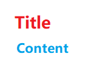

# CSS
<!--Kit: ArkUI-->
<!--Subsystem: ArkUI-->
<!--Owner: @sunfei2021-->
<!--Designer: @sunfei2021-->
<!--Tester: @fredyuan912-->
<!--Adviser: @Brilliantry_Rui-->

Cascading Style Sheets (CSS) is a style language that describes the structure of [HML](js-framework-syntax-hml.md) pages. While all components come with default styles, CSS allows you to customize the look and feel of the components and pages to fit your design requirements. For details about the component styles supported by the web development paradigm that is compatible with JavaScript, see [Common Styles](../reference/apis-arkui/arkui-js/js-components-common-styles.md).

## Size Unit

- Logical px set by **\<length>**:

   - The default logical screen width is 720 px (for details, see the **window** section in ["js" Tag](js-framework-js-tag.md)). Your page will be scaled to fit the actual width of the screen. For example, on a screen with the actual width of 1440 physical px, 100 px is displayed on 200 physical px, with all sizes doubled from 720 px to 1440 px.
   - If **autoDesignWidth** is set to **true** (for details, see the **window** section in ["js" Tag](js-framework-js-tag.md)), the logical px is scaled based on the screen density. For example, on a screen with the screen density of 3, 100 px is displayed on 300 physical px. This approach is recommended when your application needs to adapt to multiple devices.

- Percentage set by **\<percentage>**: The component size is represented by its percentage of the parent component size. For example, if the width **\<percentage>** of a component is set to **50%**, the width of the component is half of its parent component's width.


## Style Import

To implement modular management and code reuse, CSS style files support the \@import statement to import CSS files.


## Style Declaration

The **.css** file with the same name as the **.hml** file in each page directory describes the styles of components on the HML page, determining how the components will be displayed.

1. Internal style: The **style** and **class** attributes can be used to specify the component style. Example:
   ```html
   <!-- index.hml -->
   <div class="container">
     <text style="color: red">Hello World</text>
   </div>
   ```

   ```css
   /* index.css */
   .container {
     justify-content: center;
   }
   ```

2. External style files: You need to import the files. For example, create a **style.css** file in the **common** directory and import the file at the beginning of **index.css**.
   ```css
   /* style.css */
   .title {
     font-size: 50px;
   }
   ```

   ```css
   /* index.css */
   @import '../../common/style.css';
   .container {
     justify-content: center;
   }
   ```


## Selectors

A CSS selector is used to select elements for which styles need to be added to. The following table lists the supported selectors.

| Selector                      | Example                                   | Description                                    |
| ------------------------- | ------------------------------------- | ---------------------------------------- |
| .class                    | .container                            | Selects all components whose **class** is **container**.               |
| \#id                      | \#titleId                             | Selects all components whose **id** is **titleId**.                    |
| tag                       | text                                  | Selects the text component.                             |
| ,                         | .title,&nbsp;.content                 | Selects all components whose **class** is **title** or **content**.   |
| \#id&nbsp;.class&nbsp;tag | \#containerId&nbsp;.content&nbsp;text | Selects all grandchild **\<text>** components whose grandparent components are identified as **containerId** and whose parent components are of the **content** class. To use the strict parent-child relationship, replace the space with **&gt;**, for example, **\#containerId&gt;.content**.|

Example:

```html
<!-- Pagelayoutexample.hml -->
<div id="containerId" class="container">
  <text id="titleId" class="title">Title</text>
  <div class="content">
    <text id="contentId">Content</text>
  </div>
</div>
```

```css
/* Pagestyleexample.css */
.container {
  width: 100%;
  height: 100%;
  justify-content: center;
  align-items: center;
}
/* Set the style for all <div> components. */
div {
  flex-direction: column;
}
/* Set the style for the components whose class is title. */
.title {
  font-size: 30px;
}
/* Set the style for the components whose id is contentId. */
#contentId {
  font-size: 20px;
}
/* Set padding for all components of the title or content class to 5 px. */
.title, .content {
  padding: 5px;
}
/* Set the style for all texts of components whose class is container. */
.container text {
  color: #007dff;
}
/* Set the style for direct descendant texts of components whose class is container. */
.container > text {
  color: #fa2a2d;
}
```

The above style works as follows:



In the preceding example, the .container text sets the title and content to blue, and the .container &gt; text direct descendant selector sets the title to red. The two have the same priority. However, the declaration sequence of the direct descendant selector is later than that of the direct descendant selector, and the style of the former is overwritten. For details about the priority calculation, see [Selector Priority](#selector-priority).

## Selector Priority

The priority rule of the selectors complies with the W3C rule, which is only available for inline styles, **id**, **class**, **tag**, grandchild components, and child components. (Inline styles are those declared in the **style** attribute.)

When multiple selector declarations match the same element, the priorities of various selectors are as follows: inline style > **id** > **class** > **tag**.


## Pseudo-classes

A CSS pseudo-class is a keyword added to a selector that specifies a special state of the selected element(s). For example, **:disabled** can be used to select the element whose **disabled** attribute is **true**.

In addition to a single pseudo-class, a combination of pseudo-classes is supported. For example, **:focus:checked** selects the element whose **focus** and **checked** attributes are both set to **true**. The following table lists the supported single pseudo-class in descending order of priority.

| Name       | Supported Component                                    | Description                                      |
| --------- | ---------------------------------------- | ---------------------------------------- |
| :disabled | Components that support the disabled attribute                         | Indicates the element whose disabled attribute is true. (The animation style cannot be set.)     |
| :active   | Components that support the click event<br>                       | Indicates the element activated by the user, for example, a button pressed by the user or an activated tab-bar tab. (The animation style cannot be set.)|
| :waiting  | button                                   | Indicates the element whose waiting attribute is true. (The animation style cannot be set.)        |
| :checked  | input[type="checkbox", type="radio"], switch| Indicates the element whose checked attribute is true. (The animation style cannot be set.)        |

The following is an example for you to use the **:active** pseudo-class to control the style when a user presses the button. 

```html
<!-- index.hml -->
<div class="container">
  <input type="button" class="button" value="Button"></input>
</div>
```

```css
/* index.css */
.container {
  width: 100%;
  height: 100%;
  justify-content: center;
  align-items: center;
}

.button:active {
  background-color: #888888;/* After the button is activated, the background color is changed to #888888. */
}
```

> **NOTE**
>
> Pseudo-class effects are not supported for the **\<popup>** component and its child components, including, **\<popup>**, **\<dialog>**, **\<menu>**, **\<option>**, and **\<picker>**.


## Precompiled Styles

Precompilation is a program that uses specific syntax to generate CSS files. It provides variables and calculation, helping you define component styles more conveniently. Currently, Less, Sass, and Scss are supported. To use precompiled styles, change the suffix of the original **.css** file. For example, change **index.css** to **index.less**, **index.sass**, or **index.scss**.

- The following **index.less** file is changed from **index.css**.
  ```less
  /* index.less */
  /* Define a variable. */
  @colorBackground: #000000;
  .container {
    background-color: @colorBackground; /* Use the variables defined in the current less file. */
  }
  ```

- Reference a precompiled style file. For example, if the **style.scss** file is located in the **common** directory, change the original **index.css** file to **index.scss** and import **style.scss**.
  ```scss
  /* style.scss */
  /* Define a variable. */
  $colorBackground: #000000;
  ```

  Reference the precompiled style file in **index.scss**:

  ```scss
  /* index.scss */
  /* Import style.scss. */
  @import '../../common/style.scss';
  .container {
    background-color: $colorBackground; /* Use the variable defined in style.scss. */
  }
  ```

  > **NOTE**
  >
  > Place precompiled style files in the **common** directory.

## CSS Style Inheritance<sup>6+</sup>

CSS style inheritance enables a child node to inherit the style of its parent node. The inherited style has the lowest priority when multiple style selectors are involved. Currently, the following styles can be inherited:

- font-family

- font-weight

- font-size

- font-style

- text-align

- line-height

- letter-spacing

- color

- visibility
