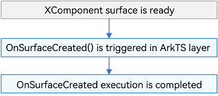
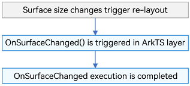
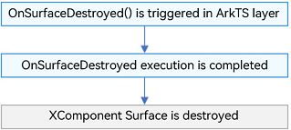
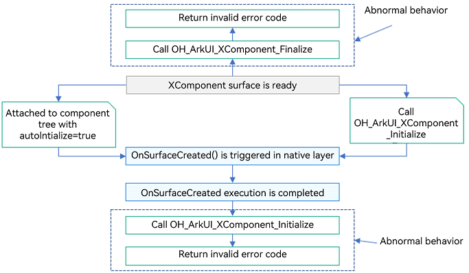
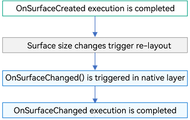
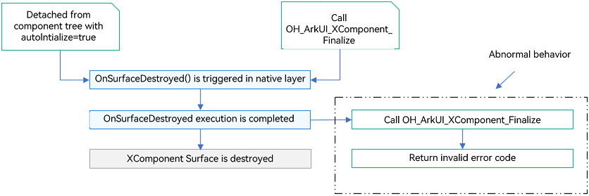
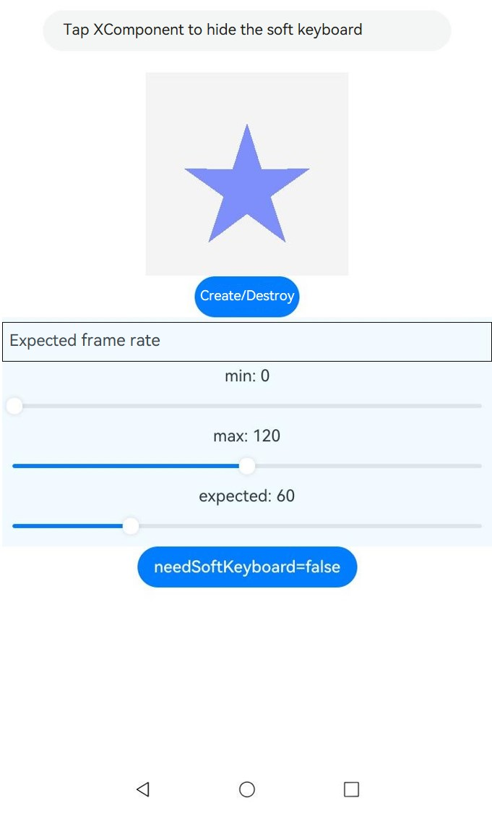

# Custom Rendering (XComponent)
<!--Kit: ArkUI-->
<!--Subsystem: ArkUI-->
<!--Owner: @zjsxstar-->
<!--Designer: @dutie123-->
<!--Tester: @liuli0427-->
<!--Adviser: @Brilliantry_Rui-->

## Overview

The **XComponent** is a rendering component that can be used for EGL/OpenGL ES and media data output. It uses the held [NativeWindow](../graphics/native-window-guidelines.md) to render graphics and is typically employed to meet complex custom rendering needs, such as displaying camera preview streams and rendering game graphics. You can specify different rendering methods through the **type** field, which are [XComponentType](../reference/apis-arkui/arkui-ts/ts-appendix-enums.md#xcomponenttype10).SURFACE and XComponentType.TEXTURE. For the SURFACE type, you display the custom drawing content on the screen separately. For the TEXTURE type, you combine custom drawing content with the content of the **XComponent** and display it on the screen.

You can compare the XComponent component to a canvas. On the canvas, you can use various rendering technologies (such as OpenGL and Vulkan) to draw complex graphics. The XComponent component manages the canvas, including its position, size, and interaction events.

Currently, the **XComponent** component is mainly used in the following two scenarios:

| Type    | Scenario                        |
| ------------ | -------------------------------- |
| High-performance rendering  | Game graphics, 3D graphics, complex animations, and more.  |
| Media data processing| Camera preview, video playback, and image processing|

## Constraints

If your custom drawn content includes transparent elements, they will blend with the content below the surface. For example, if your content is fully transparent, the background of the **XComponent** is black, and the surface maintains its default size and position, the final display will be a black area.

## XComponent rendering and display principles

XComponent holds a surface. You can call APIs such as [NativeWindow](../graphics/native-window-guidelines.md) to allocate and submit a buffer to the graphics queue, and then transfer the self-drawn content to the surface. The main process is as follows:

The application requests a buffer to obtain an idle frame. → The application produces frame data. → The application calls FlushBuffer to submit the frame data to the buffer queue. → The system rendering side obtains the frame by calling AcquireBuffer. → The frame is rendered to the screen. → The system rendering side calls ReleaseBuffer to release the frame.

After the preceding process is complete, the self-drawn content of the application can be displayed in the surface area held by XComponent. XComponent integrates the surface into the UI, and the displayed content is the self-drawn content sent by the developer. By default, the surface matches the size and position of the **XComponent**. Yet, you can adjust its position and size using the [setXComponentSurfaceRect](../reference/apis-arkui/arkui-ts/ts-basic-components-xcomponent.md#setxcomponentsurfacerect12) API if needed. The **XComponent** is responsible for creating the surface and notifying the application of surface-related information through callbacks. Applications can set the properties of the surface through dedicated APIs. It should be noted that the component itself has no awareness of the actual drawn content and does not provide direct rendering APIs.

> **NOTE**
>
> The RequestBuffer and FlushBuffer operations mentioned in the main process are generally encapsulated by related APIs (such as the camera module, player module, and OpenGL APIs) in specific scenarios. Therefore, you only need to call these APIs as required, and do not need to directly operate the buffer queue.

## Creating an XComponent and Managing the Surface Lifecycle

To meet various requirements of developers, XComponent provides multiple creation modes and surface lifecycle management modes. The following describes these modes.

### Creating an XComponent

Currently, ArkUI provides three methods for creating UI components: using ./state-management/arkts-declarative-ui-description.md, using ./arkts-user-defined-arktsNode-frameNode.md, and using ./ndk-build-ui-overview.md.

In general UI development scenarios, you are advised to use ArkTS declarative UI description to create XComponent. For details about the scenarios where ArkTS custom component nodes and NDK APIs are used to create UI components, see the related descriptions of the two methods.

### Managing the Lifecycle of the Surface Held by XComponent

As mentioned in the ./state-management/arkts-declarative-ui-description.md rendering principle, XComponent can display the content drawn by the application only when it holds a surface. Therefore, it is important to understand how to obtain the lifecycle of the surface held by XComponent.

You are advised to use either of the following methods to obtain the lifecycle of the surface held by XComponent: using [XComponentController](../reference/apis-arkui/arkui-ts/ts-basic-components-xcomponent.md#xcomponentcontroller) to manage the surface lifecycle in ArkTS, or using [OH_ArkUI_SurfaceHolder](../reference/apis-arkui/capi-oh-nativexcomponent-native-xcomponent-oh-arkui-surfaceholder.md) to manage the surface lifecycle in native code.

If you need to use encapsulated APIs in ArkTS for function development (such as camera preview and video playback) or if you are not sensitive to cross-language performance loss, you are advised to use XComponentController in ArkTS to manage the surface lifecycle. The lifecycle is triggered as follows:

- onSurfaceCreated

  Triggered after an XComponent is created and a surface is created.

  ArkTS-side sequence

  

- onSurfaceChanged

  Triggered after surface size changes trigger re-layout.

  ArkTS-side sequence

  

- onSurfaceDestroyed

  Triggered when the **XComponent** component is destroyed, which is consistent with the destruction timing of common ArkUI components.

  ArkTS-side sequence

  

For complex interaction logic that requires cross-language development, or when you need to control the creation and destruction of surfaces to achieve optimal rendering performance or meet service requirements, you are advised to use OH_ArkUI_SurfaceHolder on the native side to manage the surface lifecycle. The lifecycle triggering conditions are as follows:

- OnSurfaceCreated   

  Triggering time: This callback is triggered when the XComponent is created and the surface is created, and either of the following conditions is met:
  1. The component is attached to the component tree with **autoInitialize = true**.
  2. The **OH_ArkUI_XComponent_Initialize** API is called.

  ArkTS-side sequence

  
- OnSurfaceChanged
  
  Triggered when surface size changes trigger re-layout, after the **OnSurfaceCreated** callback is successfully triggered.

  ArkTS-side sequence

  

- OnSurfaceDestroyed

  Triggered when the component is detached from the component tree with **autoInitialize=true** or the **OH_ArkUI_XComponent_Finalize** API is called.

  ArkTS-side sequence

  

### XComponent Development Paradigm

The following five XComponent development paradigms are available, depending on the combination of [Creating an XComponent](#Creating an XComponent) and [Managing the Lifecycle of the Surface Held by an XComponent](#Managing the lifecycle of the surface held by an XComponent). Except that the XComponentController cannot be used to manage the lifecycle of the surface held by an XComponent created using the NDK API, the other paradigms are as follows:

- Create a component using the declarative UI description in ArkTS and use XComponentController to manage the lifecycle of the surface.

  <!-- @[xcomponent_index](https://gitcode.com/openharmony/applications_app_samples/blob/master/code/BasicFeature/Native/ArkTSXComponent/entry/src/main/ets/pages/Index.ets) -->

  ``` TypeScript
  import nativeRender from 'libnativerender.so';
  
  // Override XComponentController to set lifecycle callbacks.
  class MyXComponentController extends XComponentController{
    onSurfaceCreated(surfaceId: string): void {
      console.info(`onSurfaceCreated surfaceId: ${surfaceId}`);
      nativeRender.SetSurfaceId(BigInt(surfaceId));
    }
    onSurfaceChanged(surfaceId: string, rect: SurfaceRect): void {
      console.info(`onSurfaceChanged surfaceId: ${surfaceId}, rect: ${JSON.stringify(rect)}}`);
      // Call ChangeSurface to draw content in onSurfaceChanged.
      nativeRender.ChangeSurface(BigInt(surfaceId), rect.surfaceWidth, rect.surfaceHeight);
    }
    onSurfaceDestroyed(surfaceId: string): void {
      console.info(`onSurfaceDestroyed surfaceId: ${surfaceId}`);
      nativeRender.DestroySurface(BigInt(surfaceId));
    }
  }
  
  @Entry
  @Component
  struct Index {
    @State currentStatus: string = 'index';
    xComponentController: XComponentController = new MyXComponentController();
    build() {
      Column() {
        // ···
        // Define XComponent in xxx.ets.
        Column({ space: 10 }) {
          XComponent({
            type: XComponentType.SURFACE,
            controller: this.xComponentController
          })
          Text(this.currentStatus)
            .fontSize('24fp')
            .fontWeight(500)
        }
        .onClick(() => {
          let surfaceId = this.xComponentController.getXComponentSurfaceId();
          nativeRender.ChangeColor(BigInt(surfaceId));
          let hasChangeColor: boolean = false;
          if (nativeRender.GetXComponentStatus(BigInt(surfaceId))) {
            hasChangeColor = nativeRender.GetXComponentStatus(BigInt(surfaceId)).hasChangeColor;
          }
          if (hasChangeColor) {
            this.currentStatus = "change color";
          }
        })
        // ···
      }
      .width('100%')
      .height('100%')
    }
  }
  ```
  
- You can use the declarative UI description of ArkTS to create components and use OH_ArkUI_SurfaceHolders to manage the lifecycle of surfaces.

  <!-- @[surface_holder_declarative_ets](https://gitcode.com/openharmony/applications_app_samples/blob/master/code/BasicFeature/Native/NativeXComponent/entry/src/main/ets/pages/SurfaceHolderDeclarative.ets) -->

  ``` typescript
  import native from 'libnativerender.so';
  
  // ...
  
  @Component
  export struct SurfaceHolderDeclarative {
    @State currentStatus: string = 'init';
    private xcNode: FrameNode | null = null;
    build() {
      NavDestination() {
        // ...
        Column({ space: 10 }) {
          // Create a XComponent component.
          XComponent({
            type: XComponentType.SURFACE,
          })
            .id('XComponentSurfaceHolder')
            .onAttach(() => {
              this.xcNode = this.getUIContext().getAttachedFrameNodeById('XComponentSurfaceHolder');
              if (!this.xcNode) {
                return;
              }
              native.bindNode('XComponentSurfaceHolder', this.xcNode); // Call the Native side to obtain the SurfaceHolder and bind the surface lifecycle callback.
            })
            .onDetach(() => {
              native.unbindNode('XComponentSurfaceHolder');
              this.xcNode = null;
            })
        }
        // ...
      }
    }
  }
  ```

  <!-- @[surface_holder_declarative_c_bind](https://gitcode.com/openharmony/applications_app_samples/blob/master/code/BasicFeature/Native/NativeXComponent/entry/src/main/cpp/manager/plugin_manager.cpp) -->
  ``` c++
  napi_value PluginManager::BindNode(napi_env env, napi_callback_info info)
  {
      size_t argc = 2;
      napi_value args[2] = {nullptr};
      napi_get_cb_info(env, info, &argc, args, nullptr, nullptr);
      std::string nodeId = value2String(env, args[0]);
      ArkUI_NodeHandle handle;
      OH_ArkUI_GetNodeHandleFromNapiValue(env, args[1], &handle); // Obtaining the nodeHandle
      OH_ArkUI_SurfaceHolder *holder = OH_ArkUI_SurfaceHolder_Create(handle); // Obtain the SurfaceHolder.
      nodeHandleMap_[nodeId] = handle;
      surfaceHolderMap_[handle] = holder;
      auto callback = OH_ArkUI_SurfaceCallback_Create(); // Create a SurfaceCallback.
      callbackMap_[holder] = callback;
      auto render = new EGLRender();
      OH_ArkUI_SurfaceHolder_SetUserData(holder, render); // Save the render in the holder.
      OH_ArkUI_SurfaceCallback_SetSurfaceCreatedEvent(callback, OnSurfaceCreatedNative); // Register the OnSurfaceCreated callback.
      OH_ArkUI_SurfaceCallback_SetSurfaceChangedEvent(callback, OnSurfaceChangedNative); // Register the OnSurfaceChanged callback.
      OH_ArkUI_SurfaceCallback_SetSurfaceDestroyedEvent(callback, OnSurfaceDestroyedNative); // Register the OnSurfaceDestroyed callback.
      OH_ArkUI_SurfaceHolder_AddSurfaceCallback(holder, callback); // Register the SurfaceCallback callback.
      // ...
      return nullptr;
  }
  ```
  
- You can use the custom component node of ArkTS to create a component and use XComponentController to manage the lifecycle of the surface.
  ``` typescript
  // Override XComponentController to set lifecycle callbacks.
  class MyXComponentController extends XComponentController {
    onSurfaceCreated(surfaceId: string): void {
      console.info(`onSurfaceCreated surfaceId: ${surfaceId}`);
    }
  
    onSurfaceChanged(surfaceId: string, rect: SurfaceRect): void {
      console.info(`onSurfaceChanged surfaceId: ${surfaceId}, rect: ${JSON.stringify(rect)}}`);
    }
  
    onSurfaceDestroyed(surfaceId: string): void {
      console.info(`onSurfaceDestroyed surfaceId: ${surfaceId}`);
    }
  }
  
  class MyNodeController extends NodeController {
    public xComponent: typeNode.XComponent | undefined = undefined;
    public xComponentId: string = 'xcp' + (new Date().getTime());
    public node: FrameNode | undefined = undefined;
    public column: typeNode.Column | undefined = undefined;
    private xcController: MyXComponentController = new MyXComponentController();
  
    makeNode(uiContext: UIContext): FrameNode | null {
      this.node = new FrameNode(uiContext);
      this.column = typeNode.createNode(uiContext, 'Column')
      this.column.initialize()
        .width('100%')
        .height('100%')
      try {
        this.node.appendChild(this.column);
      } catch (error) {
        console.error('Fail to append child: ', error);
      }
      // Create an XComponent node and bind it to the XComponentController.
      this.xComponent =
        typeNode.createNode(uiContext, 'XComponent', { type: XComponentType.SURFACE, controller: this.xcController });
      this.xComponent.attribute
      try {
        this.column.appendChild(this.xComponent);
      } catch (error) {
        console.error('Fail to append child: ', error);
      }
      return this.node;
    }
  }
  ```
  
- You can create a component using the ArkTS custom component node and use OH_ArkUI_SurfaceHolder to manage the lifecycle of the surface.
  <!-- @[surface_holder_type_node_ets](https://gitcode.com/openharmony/applications_app_samples/blob/master/code/BasicFeature/Native/NativeXComponent/entry/src/main/ets/pages/SurfaceHolderTypeNode.ets) -->
  ``` typescript
  import native from 'libnativerender.so';
  import { FrameNode, NodeController, typeNode, UIContext } from '@kit.ArkUI';
  
  class MyNodeController extends NodeController {
    // ...
  
    makeNode(uiContext: UIContext): FrameNode | null {
      // ...
      // Create an XComponent node.
      this.xComponent = typeNode.createNode(uiContext, 'XComponent', { type: XComponentType.SURFACE });
      this.xComponent.attribute
        .id(this.xComponentId)
        .focusable(true)
        .focusOnTouch(true)
      native.bindNode(this.xComponentId, this.xComponent) // Cross-language calling to the native side to bind the surface lifecycle callback.
      // ...
    }
  
    // ...
  }
  
  // ...
  
  @Component
  export struct SurfaceHolderTypeNode {
    // ...
    myNodeController: MyNodeController = new MyNodeController();
  
    build() {
      NavDestination() {
        Column() {
          // ...
          Column() {
            if (this.isShow) {
              NodeContainer(this.myNodeController)
                .width(200)
                .height(200)
                .focusable(true)
                .focusOnTouch(true)
                .defaultFocus(true)
            }
          }.height(200)
          // ...
        }
        .width('100%')
      }
    }
  }
  ```
  
  <!-- @[surface_holder_declarative_c_bind](https://gitcode.com/openharmony/applications_app_samples/blob/master/code/BasicFeature/Native/NativeXComponent/entry/src/main/cpp/manager/plugin_manager.cpp) -->
  ``` c++
  napi_value PluginManager::BindNode(napi_env env, napi_callback_info info)
  {
      size_t argc = 2;
      napi_value args[2] = {nullptr};
      napi_get_cb_info(env, info, &argc, args, nullptr, nullptr);
      std::string nodeId = value2String(env, args[0]);
      ArkUI_NodeHandle handle;
      OH_ArkUI_GetNodeHandleFromNapiValue(env, args[1], &handle); // Obtaining the nodeHandle
      OH_ArkUI_SurfaceHolder *holder = OH_ArkUI_SurfaceHolder_Create(handle); // Obtain the SurfaceHolder.
      nodeHandleMap_[nodeId] = handle;
      surfaceHolderMap_[handle] = holder;
      auto callback = OH_ArkUI_SurfaceCallback_Create(); // Create a SurfaceCallback.
      callbackMap_[holder] = callback;
      auto render = new EGLRender();
      OH_ArkUI_SurfaceHolder_SetUserData(holder, render); // Save the render to the holder.
      OH_ArkUI_SurfaceCallback_SetSurfaceCreatedEvent(callback, OnSurfaceCreatedNative); // Register the OnSurfaceCreated callback.
      OH_ArkUI_SurfaceCallback_SetSurfaceChangedEvent(callback, OnSurfaceChangedNative); // Register the OnSurfaceChanged callback.
      OH_ArkUI_SurfaceCallback_SetSurfaceDestroyedEvent(callback, OnSurfaceDestroyedNative); // Register the OnSurfaceDestroyed callback.
      OH_ArkUI_SurfaceHolder_AddSurfaceCallback(holder, callback); // Register the SurfaceCallback callback.
      return nullptr;
  }
  ```
  
- Create a component using the NDK interface and use OH_ArkUI_SurfaceHolder to manage the lifecycle of the surface.
  <!-- @[surface_holder_ndk_ets](https://gitcode.com/openharmony/applications_app_samples/blob/master/code/BasicFeature/Native/NativeXComponent/entry/src/main/ets/pages/SurfaceHolderNDK.ets) -->
  ``` typescript
  @Component
  export struct SurfaceHolderNDK {
    @State currentStatus: string = 'init';
    private nodeContent: NodeContent = new NodeContent();
  
    aboutToAppear(): void {
      nativeNode.createNativeNode(this.nodeContent, 'SurfaceHolderNDK');
      this.currentStatus = 'index'
    }
  
    build() {
      NavDestination() {
        Column() {
          // ...
          Column({ space: 10 }) {
            ContentSlot(this.nodeContent);
            // ...
          }
          // ...
        }
        .width('100%')
        .height('100%')
      }
    }
  }
  ```
  
  <!-- @[surface_holder_ndk_createNode](https://gitcode.com/openharmony/applications_app_samples/blob/master/code/BasicFeature/Native/NativeXComponent/entry/src/main/cpp/manager/plugin_manager.cpp) -->
  ``` c++
  napi_value PluginManager::createNativeNode(napi_env env, napi_callback_info info)
  {
      // ...
      ArkUI_NodeContentHandle nodeContentHandle_ = nullptr;
      OH_ArkUI_GetNodeContentFromNapiValue(env, args[0], &nodeContentHandle_);
      nodeAPI = reinterpret_cast<ArkUI_NativeNodeAPI_1 *>(
          OH_ArkUI_QueryModuleInterfaceByName(ARKUI_NATIVE_NODE, "ArkUI_NativeNodeAPI_1"));
      std::string tag = value2String(env, args[1]);
      // ...
      if (nodeAPI != nullptr && nodeAPI->createNode != nullptr && nodeAPI->addChild != nullptr) {
          OH_LOG_Print(LOG_APP, LOG_ERROR, LOG_PRINT_DOMAIN, "PluginManager", "CreateNativeNode tag=%{public}s",
                       tag.c_str());
          auto nodeContentEvent = [](ArkUI_NodeContentEvent *event) {
            ArkUI_NodeContentHandle handle = OH_ArkUI_NodeContentEvent_GetNodeContentHandle(event);
            std::string *userData = reinterpret_cast<std::string *>(OH_ArkUI_NodeContent_GetUserData(handle));
            if (!userData) {
                return;
            }
            if (OH_ArkUI_NodeContentEvent_GetEventType(event) != NODE_CONTENT_EVENT_ON_ATTACH_TO_WINDOW) {
                return;
            }
            ArkUI_NodeHandle testNode;
            if (userData->find("SurfaceHolder") == std::string::npos) {
                // ...
            } else {
                // Create an XComponent component and use SurfaceHolder to manage the Surface lifecycle.
                testNode = CreateNodeHandleUsingSurfaceHolder(*userData);
            }
            delete userData;
            userData = nullptr;
            OH_ArkUI_NodeContent_AddNode(handle, testNode);
        };
          OH_ArkUI_NodeContent_RegisterCallback(nodeContentHandle_, nodeContentEvent);
      }
      return nullptr;
  }
  ```

  <!-- @[surface_holder_ndk_create_xc_node](https://gitcode.com/openharmony/applications_app_samples/blob/master/code/BasicFeature/Native/NativeXComponent/entry/src/main/cpp/manager/plugin_manager.cpp) -->    
  
  ``` C++
  ArkUI_NodeHandle CreateNodeHandleUsingSurfaceHolder(const std::string &tag)
  {
      ArkUI_NodeHandle column = nodeAPI->createNode(ARKUI_NODE_COLUMN);
      // ...
      xc = nodeAPI->createNode(ARKUI_NODE_XCOMPONENT); // Create an XComponent node.
      // ...
      OH_ArkUI_SurfaceHolder *holder = OH_ArkUI_SurfaceHolder_Create(xc); // Obtain the SurfaceHolder.
      PluginManager::surfaceHolderMap_[xc] = holder;
      PluginManager::nodeHandleMap_[tag] = xc;
      auto callback = OH_ArkUI_SurfaceCallback_Create(); // Create a SurfaceCallback.
      PluginManager::callbackMap_[holder] = callback;
      auto render = new EGLRender();
      OH_ArkUI_SurfaceHolder_SetUserData(holder, render); // Save the render to the holder.
      OH_ArkUI_SurfaceCallback_SetSurfaceCreatedEvent(callback, OnSurfaceCreatedNative); // Register the OnSurfaceCreated callback.
      OH_ArkUI_SurfaceCallback_SetSurfaceChangedEvent(callback, OnSurfaceChangedNative); // Register the OnSurfaceChanged callback.
      OH_ArkUI_SurfaceCallback_SetSurfaceDestroyedEvent(callback, OnSurfaceDestroyedNative); // Register the OnSurfaceDestroyed callback.
      OH_ArkUI_SurfaceHolder_AddSurfaceCallback(holder, callback); // Add the SurfaceCallback callback.
      if (!nodeAPI->addNodeEventReceiver(xc, onEvent)) { // Add an event listener and return the success code 0.
          OH_LOG_Print(LOG_APP, LOG_ERROR, LOG_PRINT_DOMAIN, "onBind", "addNodeEventReceiver error");
      }
      if (!nodeAPI->registerNodeEvent(xc, NODE_TOUCH_EVENT, 0, nullptr)) { // Use the C API to register the touch event and return the success code 0.
          OH_LOG_Print(LOG_APP, LOG_ERROR, LOG_PRINT_DOMAIN, "onBind", "registerTouchEvent error");
      }
      nodeAPI->addChild(column, xc); // Mount the XComponent to the column.
      return column;
  }
  ```
## Migrating from OH_NativeXComponent to OH_ArkUI_SurfaceHolder

Starting from API version 8, you can use the APIs related to the [OH_NativeXComponent](../reference/apis-arkui/capi-oh-nativexcomponent-native-xcomponent-oh-nativexcomponent.md) instance to listen to the lifecycle of the XComponent surface, obtain the NativeWindow instance, and listen to basic events, thereby implementing rendering, drawing, and interaction response. However, using the APIs related to OH_NativeXComponent has the following problems:

- The lifecycle of an OH_NativeXComponent instance is closely related to the XComponent. If you still operate the OH_NativeXComponent instance after the XComponent is destroyed, the app may crash due to stability issues.
- The interaction event APIs provided by OH_NativeXComponent are not rich enough. Only basic touch, mouse, and keyboard interaction APIs are provided. If you want to identify advanced gestures such as long press and drag, you need to write the identification logic by yourself.

To solve the preceding problems, you are advised to use the APIs related to OH_ArkUI_SurfaceHolder instead of the APIs related to OH_NativeXComponent. The following uses the ArkTS declarative UI as an example to describe how to switch from using OH_NativeXComponent to using OH_ArkUI_SurfaceHolder to manage the surface lifecycle.

### Component creation

The main difference in component creation is that when using OH_NativeXComponent, you need to pass the id and libraryname attributes to obtain the corresponding OH_NativeXComponent instance on the native side. However, when using OH_ArkUI_SurfaceHolder to manage the surface lifecycle, you do not need to pass the id and libraryname attributes in the XComponent constructor. Instead, you need to directly pass the FrameNode node corresponding to the component to the native side for lifecycle binding and other settings.

- OH_NativeXComponent
  <!-- @[native_xcomponent_declarative_create_ets](https://gitcode.com/openharmony/applications_app_samples/blob/master/code/BasicFeature/Native/NativeXComponent/entry/src/main/ets/pages/NativeXComponentDeclarative.ets) -->
  
  ``` TypeScript
  XComponent({
    id: 'xcomponentId',
    type: XComponentType.SURFACE,
    libraryname: 'nativerender' // Use the id and libraryname attributes to obtain the NativeXComponent on the native side and bind the surface lifecycle.
  })
    .onLoad((xComponentContext) => {
      this.xComponentContext = xComponentContext as XComponentContext;
      this.currentStatus = 'index';
    })
    .onDestroy(() => {
      console.info('onDestroy');
    })
    .id('xcomponent')
  ```

- OH_ArkUI_SurfaceHolder
  <!-- @[surface_holder_declarative_create_ets](https://gitcode.com/openharmony/applications_app_samples/blob/master/code/BasicFeature/Native/NativeXComponent/entry/src/main/ets/pages/SurfaceHolderDeclarative.ets) -->
  
  ``` TypeScript
  XComponent({
    type: XComponentType.SURFACE,
  })
    .id('XComponentSurfaceHolder')
    .onAttach(() => {
      this.xcNode = this.getUIContext().getAttachedFrameNodeById('XComponentSurfaceHolder');
      if (!this.xcNode) {
        return;
      }
      native.bindNode('XComponentSurfaceHolder', this.xcNode); // calls the native side to obtain the SurfaceHolder and bind the surface lifecycle callback.
      this.currentStatus = 'index';
    })
    .onDetach(() => {
      native.unbindNode('XComponentSurfaceHolder');
      this.xcNode = null;
    })
  ```

### Binding the surface lifecycle.

The main difference between binding to the surface and binding to the lifecycle is that the APIs for registering lifecycle callbacks are different. The logic executed in the callback remains unchanged.

- OH_NativeXComponent
  <!-- @[native_xcomponent_declarative_get_native_xcomponent](https://gitcode.com/openharmony/applications_app_samples/blob/master/code/BasicFeature/Native/NativeXComponent/entry/src/main/cpp/manager/plugin_manager.cpp) -->
  
  ``` C++
  void PluginManager::Export(napi_env env, napi_value exports)
  {
      if ((env == nullptr) || (exports == nullptr)) {
          OH_LOG_Print(LOG_APP, LOG_ERROR, LOG_PRINT_DOMAIN, "PluginManager", "Export: env or exports is null");
          return;
      }
  
      napi_value exportInstance = nullptr;
      // Use the OH_NATIVE_XCOMPONENT_OBJ field to obtain the NativeXComponent instance.
      if (napi_get_named_property(env, exports, OH_NATIVE_XCOMPONENT_OBJ, &exportInstance) != napi_ok) {
          OH_LOG_Print(LOG_APP, LOG_ERROR, LOG_PRINT_DOMAIN, "PluginManager", "Export: napi_get_named_property fail");
          return;
      }
  
      OH_NativeXComponent *nativeXComponent = nullptr;
      if (napi_unwrap(env, exportInstance, reinterpret_cast<void **>(&nativeXComponent)) != napi_ok) {
          OH_LOG_Print(LOG_APP, LOG_ERROR, LOG_PRINT_DOMAIN, "PluginManager", "Export: napi_unwrap fail");
          return;
      }
  
      char idStr[OH_XCOMPONENT_ID_LEN_MAX + 1] = {'\0'};
      uint64_t idSize = OH_XCOMPONENT_ID_LEN_MAX + 1;
      // Obtain the ID attribute from the NativeXComponent instance to map the ID to the XComponent component on ArkTS.
      if (OH_NativeXComponent_GetXComponentId(nativeXComponent, idStr, &idSize) != OH_NATIVEXCOMPONENT_RESULT_SUCCESS) {
          OH_LOG_Print(LOG_APP, LOG_ERROR, LOG_PRINT_DOMAIN, "PluginManager",
                       "Export: OH_NativeXComponent_GetXComponentId fail");
          return;
      }
  
      std::string id(idStr);
      auto context = PluginManager::GetInstance();
      if ((context != nullptr) && (nativeXComponent != nullptr)) {
          context->SetNativeXComponent(id, nativeXComponent);
          auto render = context->GetRender(id);
          if (render != nullptr) {
              // Register the surface lifecycle.
              render->RegisterCallback(nativeXComponent);
              render->Export(env, exports);
          }
      }
  }
  ```

  <!-- @[native_xcomponent_declarative_surface_callback](https://gitcode.com/openharmony/applications_app_samples/blob/master/code/BasicFeature/Native/NativeXComponent/entry/src/main/cpp/render/plugin_render.cpp) -->
  
  ``` C++
  void PluginRender::RegisterCallback(OH_NativeXComponent* nativeXComponent)
  {
      renderCallback_.OnSurfaceCreated = OnSurfaceCreatedCB;
      renderCallback_.OnSurfaceChanged = OnSurfaceChangedCB;
      renderCallback_.OnSurfaceDestroyed = OnSurfaceDestroyedCB;
      // ...
      OH_NativeXComponent_RegisterCallback(nativeXComponent, &renderCallback_);
      // ...
  }
  ```

- OH_ArkUI_SurfaceHolder
  <!-- @[surface_holder_declarative_surface_callback](https://gitcode.com/openharmony/applications_app_samples/blob/master/code/BasicFeature/Native/NativeXComponent/entry/src/main/cpp/manager/plugin_manager.cpp) -->
  
  ``` C++
  napi_value PluginManager::BindNode(napi_env env, napi_callback_info info)
  {
      size_t argc = 2;
      napi_value args[2] = {nullptr};
      napi_get_cb_info(env, info, &argc, args, nullptr, nullptr);
      std::string nodeId = value2String(env, args[0]);
      ArkUI_NodeHandle handle;
      OH_ArkUI_GetNodeHandleFromNapiValue(env, args[1], &handle); // Obtaining the nodeHandle
      OH_ArkUI_SurfaceHolder *holder = OH_ArkUI_SurfaceHolder_Create(handle); // Obtain the SurfaceHolder.
      nodeHandleMap_[nodeId] = handle;
      surfaceHolderMap_[handle] = holder;
      auto callback = OH_ArkUI_SurfaceCallback_Create(); // Create a SurfaceCallback.
      callbackMap_[holder] = callback;
      auto render = new EGLRender();
      OH_ArkUI_SurfaceHolder_SetUserData(holder, render); // Save the render to the holder.
      OH_ArkUI_SurfaceCallback_SetSurfaceCreatedEvent(callback, OnSurfaceCreatedNative); // Register the OnSurfaceCreated callback.
      OH_ArkUI_SurfaceCallback_SetSurfaceChangedEvent(callback, OnSurfaceChangedNative); // Register the OnSurfaceChanged callback.
      OH_ArkUI_SurfaceCallback_SetSurfaceDestroyedEvent(callback, OnSurfaceDestroyedNative); // Register the OnSurfaceDestroyed callback.
      OH_ArkUI_SurfaceHolder_AddSurfaceCallback(holder, callback); // Register the SurfaceCallback.
      // ...
      return nullptr;
  }
  ```

### Obtaining the NativeWindow

The differences in obtaining the NativeWindow are as follows:

- OH_NativeXComponent

  Obtain the NativeWindow from the parameter (void *window) returned by the lifecycle callback such as OnSurfaceCreated.

  <!-- @[native_xcomponent_get_native_window](https://gitcode.com/openharmony/applications_app_samples/blob/master/code/BasicFeature/Native/NativeXComponent/entry/src/main/cpp/manager/plugin_manager.cpp) -->
  
  ``` C++
  void OnSurfaceCreatedCB(OH_NativeXComponent *component, void *window)
  {
      // ...
  }
  void OnSurfaceChangedCB(OH_NativeXComponent *component, void *window)
  {
      // ...
  }
  void OnSurfaceDestroyedCB(OH_NativeXComponent *component, void *window)
  {
      // ...
  }
  void DispatchTouchEventCB(OH_NativeXComponent *component, void *window)
  {
      // ...
  }
  ```

- OH_ArkUI_SurfaceHolder

  Call the OH_ArkUI_XComponent_GetNativeWindow API to obtain the NativeWindow from OH_ArkUI_SurfaceHolder.

  <!-- @[surface_holder_declarative_get_native_window](https://gitcode.com/openharmony/applications_app_samples/blob/master/code/BasicFeature/Native/NativeXComponent/entry/src/main/cpp/manager/plugin_manager.cpp) -->
  
  ``` C++
  void OnSurfaceCreatedNative(OH_ArkUI_SurfaceHolder *holder)
  {
      auto window = OH_ArkUI_XComponent_GetNativeWindow(holder); // Obtain the **NativeWindow** instance.
      // ...
  }
  ```

### Listening to Interaction Events

When using the OH_NativeXComponent mode to listen to interaction events, you can only use the related APIs of OH_NativeXComponent to listen to basic events such as touch, mouse, and key events. However, when using the APIs related to OH_ArkUI_SurfaceHolder, you can listen to advanced gestures such as long press and drag in addition to basic events.

- OH_NativeXComponent

  <!-- @[native_xcomponent_declarative_register_event](https://gitcode.com/openharmony/applications_app_samples/blob/master/code/BasicFeature/Native/NativeXComponent/entry/src/main/cpp/render/plugin_render.cpp) -->
  
  ``` C++
  renderCallback_.DispatchTouchEvent = DispatchTouchEventCB; // Register the touch event.
  OH_NativeXComponent_RegisterCallback(nativeXComponent, &renderCallback_);
  mouseCallback_.DispatchMouseEvent = DispatchMouseEventCB;
  mouseCallback_.DispatchHoverEvent = DispatchHoverEventCB;
  OH_NativeXComponent_RegisterMouseEventCallback(nativeXComponent, &mouseCallback_); // Registering the mouse event
  
  OH_NativeXComponent_RegisterFocusEventCallback(nativeXComponent, OnFocusEventCB); // Register the focus event.
  OH_NativeXComponent_RegisterKeyEventCallback(nativeXComponent, OnKeyEventCB); // Register the key event.
  OH_NativeXComponent_RegisterBlurEventCallback(nativeXComponent, OnBlurEventCB); // Register the blur event.
  ```

- OH_ArkUI_SurfaceHolder

  The following uses the touch event as an example. For details about the mouse, key, and more gestures, see [Listening to Component Events](./ndk-listen-to-component-events.md).

  <!-- @[surface_holder_declarative_register_event](https://gitcode.com/openharmony/applications_app_samples/blob/master/code/BasicFeature/Native/NativeXComponent/entry/src/main/cpp/manager/plugin_manager.cpp) -->
  
  ``` C++
  if (!nodeAPI->addNodeEventReceiver(handle, onEvent)) { // Add an event listener. The return code 0 indicates success.
      OH_LOG_Print(LOG_APP, LOG_ERROR, LOG_PRINT_DOMAIN, "onBind", "addNodeEventReceiver error");
  }
  if (!nodeAPI->registerNodeEvent(handle, NODE_TOUCH_EVENT, 0, nullptr)) { // Register the touch event using the C API. The return code 0 indicates success.
      OH_LOG_Print(LOG_APP, LOG_ERROR, LOG_PRINT_DOMAIN, "onBind", "registerTouchEvent error");
  }
  ```

## Development Cases

### Using NativeWindow on the Native Side for Rendering and Drawing

The following is a complete example of using NativeWindow and EGL APIs for self-drawing. The main development scenarios are as follows:

- For **XComponent** components created on the ArkTS side, you can pass the corresponding FrameNode to the native side to obtain an **ArkUI_NodeHandle** object. For **XComponent** components created on the native side, you can directly obtain the **ArkUI_NodeHandle** object. Then, call the **OH_ArkUI_SurfaceHolder_Create** API to create an **OH_ArkUI_SurfaceHolder** instance.
- Register the corresponding lifecycle callback based on the OH_ArkUI_SurfaceHolder instance to obtain the NativeWindow instance.
- Use the NativeWindow and EGL APIs to develop custom drawing content, and apply for and submit the buffer to the graphics queue.
- The accessibility and variable frame rate capabilities of the XComponent are implemented through related APIs based on ArkUI_NodeHandle.
- You can use the ArkUI NDK APIs to listen to basic events (such as click and touch) and gesture events (such as swipe and zoom) on the XComponent through the ArkUI_NodeHandle object. For details, see [Listening to Component Events](./ndk-listen-to-component-events.md).

**Available APIs**

| API                                                      | Description                                                        |
| ------------------------------------------------------------ | ------------------------------------------------------------ |
| OH_ArkUI_QueryModuleInterfaceByName(ArkUI_NativeAPIVariantKind type, const char* structName) | Obtains the native API set of a specified type.                                        |
| OH_ArkUI_XComponent_GetNativeWindow(OH_ArkUI_SurfaceHolder* surfaceHolder) | Obtains the **NativeWindow** instance associated with an **OH_ArkUI_SurfaceHolder** instance.                                        |
| OH_ArkUI_SurfaceHolder_RemoveSurfaceCallback(OH_ArkUI_SurfaceHolder* surfaceHolder, OH_ArkUI_SurfaceCallback* callback) | Removes the previously added surface lifecycle callback from an **OH_ArkUI_SurfaceHolder** instance.                                        |
| OH_ArkUI_SurfaceCallback_Dispose(OH_ArkUI_SurfaceCallback* callback) | Disposes of an **OH_ArkUI_SurfaceCallback** object.                                        |
| OH_ArkUI_SurfaceHolder_Dispose(OH_ArkUI_SurfaceHolder* surfaceHolder) | Disposes of an **OH_ArkUI_SurfaceHolder** object.                                        |
| OH_ArkUI_NodeEvent_GetEventType(ArkUI_NodeEvent* event) | Obtains the event type from a component event.                                        |
| OH_ArkUI_NodeEvent_GetNodeHandle(ArkUI_NodeEvent* event) | Obtains the component object that triggers a component event.                                        |
| OH_ArkUI_GetNodeHandleFromNapiValue(napi_env env, napi_value frameNode, ArkUI_NodeHandle* handle) | Obtains an **ArkUI_NodeHandle** object on the native side mapped from the **FrameNode** object created on the ArkTS side.                                        |
| OH_ArkUI_SurfaceHolder_Create(ArkUI_NodeHandle node) | Creates an **OH_ArkUI_SurfaceHolder** object from the **XComponent** node.                                      |
| OH_ArkUI_SurfaceCallback_Create() | Creates an **OH_ArkUI_SurfaceCallback** object.                                        |
| OH_ArkUI_SurfaceCallback_SetSurfaceCreatedEvent(OH_ArkUI_SurfaceCallback* callback, void (\*onSurfaceCreated)(OH_ArkUI_SurfaceHolder* surfaceHolder)) | Registers the **onSurfaceCreated** callback with an **OH_ArkUI_SurfaceCallback** object.                                        |
| OH_ArkUI_SurfaceCallback_SetSurfaceChangedEvent(OH_ArkUI_SurfaceCallback* callback, void (\*onSurfaceChanged)(OH_ArkUI_SurfaceHolder* surfaceHolder, uint64_t width, uint64_t height)) | Registers the **onSurfaceChanged** callback with an **OH_ArkUI_SurfaceCallback** object.                                        |
| OH_ArkUI_SurfaceCallback_SetSurfaceDestroyedEvent(OH_ArkUI_SurfaceCallback* callback, void (\*onSurfaceDestroyed)(OH_ArkUI_SurfaceHolder* surfaceHolder)) | Registers the **onSurfaceDestroyed** callback with an **OH_ArkUI_SurfaceCallback** object.                                        |
| OH_ArkUI_SurfaceCallback_SetSurfaceShowEvent(OH_ArkUI_SurfaceCallback* callback, void (\*onSurfaceShow)(OH_ArkUI_SurfaceHolder* surfaceHolder)) | Registers the **onSurfaceShow** callback with an **OH_ArkUI_SurfaceCallback** object.                                        |
| OH_ArkUI_SurfaceCallback_SetSurfaceHideEvent(OH_ArkUI_SurfaceCallback* callback, void (\*onSurfaceHide)(OH_ArkUI_SurfaceHolder* surfaceHolder)) | Registers the **onSurfaceHide** callback with an **OH_ArkUI_SurfaceCallback** object.                                        |
| OH_ArkUI_XComponent_RegisterOnFrameCallback(ArkUI_NodeHandle node, void (*callback)(ArkUI_NodeHandle node, uint64_t timestamp, uint64_t targetTimestamp)) | Registers the **onFrame** callback for the **XComponent** node.                                        |
| OH_ArkUI_SurfaceHolder_AddSurfaceCallback(OH_ArkUI_SurfaceHolder* surfaceHolder, OH_ArkUI_SurfaceCallback* callback) | Registers the **OH_ArkUI_SurfaceCallback** object with an **OH_ArkUI_SurfaceHolder** instance.                                        |
| OH_ArkUI_AccessibilityProvider_Create(ArkUI_NodeHandle node) | Creates an **ArkUI_AccessibilityProvider** object from the **XComponent** node.                                        |
| OH_ArkUI_XComponent_UnregisterOnFrameCallback(ArkUI_NodeHandle node) | Unregisters the **onFrame callback** of the **XComponent** node.                                        |
| OH_ArkUI_AccessibilityProvider_Dispose(ArkUI_AccessibilityProvider* provider) | Disposes of an **ArkUI_AccessibilityProvider** object.                                       |
| OH_ArkUI_XComponent_SetExpectedFrameRateRange(ArkUI_NodeHandle node, OH_NativeXComponent_ExpectedRateRange range) | Sets the expected frame rate range for the **XComponent** node.                                        |
| OH_ArkUI_XComponent_SetNeedSoftKeyboard(ArkUI_NodeHandle node, bool needSoftKeyboard) | Sets whether the **XComponent** node needs to display the soft keyboard when it gains focus.                                        |

**How to Develop**

This example shows how to create an **XComponent** of the SURFACE type on the ArkTS side (for details about how to create an **ArkUI_NodeHandle** object corresponding to the **XComponent** on the native side, see [ArkUI_NativeNodeAPI_1](../reference/apis-arkui/capi-arkui-nativemodule-arkui-nativenodeapi-1.md)). It describes how to use the **XComponent** component to call APIs related to **OH_ArkUI_SurfaceHolder** for managing the surface lifecycle, create an EGL/OpenGL ES environment on the native side to draw graphics on the main page, and change the color of the graphics.

1. Define the **XComponent** on the UI.

    <!-- @[page_three](https://gitcode.com/openharmony/applications_app_samples/blob/master/code/DocsSample/ArkUISample/NativeXComponentSample/entry/src/main/ets/pages/PageThree.ets) -->
    
    ``` TypeScript
    import native from 'libnativerender.so';
    import { common } from '@kit.AbilityKit';
    // ...
    @Component
    export struct PageThree {
      @State isShow: boolean = true;
      @State minRate: number = 0;
      @State maxRate: number = 120;
      @State expected: number = 60;
      needSoftKeyboard: boolean = false;
      @State needSoftKeyboardState: string = 'needSoftKeyboard=' + this.needSoftKeyboard;
      private context = this.getUIContext().getHostContext() as common.UIAbilityContext;
      // Replace $r('app.string.pagethree_text1') with the actual resource file. In this example, the value of the resource file is "The XComponent soft keyboard disappears when you tap it with one finger."
      @State text: ResourceStr = $r('app.string.pagethree_text1');
      controller: TextInputController = new TextInputController();
      myNodeController: MyNodeController = new MyNodeController();
    
      build() {
        NavDestination() {
        Column() {
          TextInput({ text: this.text, placeholder: 'please input ...', controller: this.controller })
            .id('textInput')
            .placeholderColor(Color.Grey)
            .placeholderFont({ size: 14, weight: 400 })
            .caretColor(Color.Blue)
            .width(400)
            .height(40)
            .margin(10)
            .fontSize(14)
            .fontColor(Color.Black)
            .onChange((value: string) => {
              this.text = value
            })
          Column() {
            if (this.isShow) {
              NodeContainer(this.myNodeController)
                .width(200)
                .height(200)
                .focusable(true)
                .focusOnTouch(true)
                .defaultFocus(true)
            }
          }.height(200)
    
          // Replace $r('app.string.pagethree_text2') with the actual resource file. In this example, the value of the resource file is "Create/Destroy".
          Button($r('app.string.pagethree_text2')).onClick(() => {
            this.isShow = !this.isShow;
          }).width('50%')
            .margin({
              top: 10,
              bottom: 10,
              left: 12,
              right: 12
            })
    
          Column() {
            // Replace $r('app.string.pagethree_text3') with the actual resource file. In this example, the value of the resource file is "Expected frame rate:".
            Text($r('app.string.pagethree_text3'))
              .textAlign(TextAlign.Start)
              .fontSize(15)
              .border({ width: 1 })
              .padding(10)
              .width('100%')
              .margin(5)
            Text('min: ' + this.minRate)
            Slider({
              value: this.minRate,
              min: 0,
              max: 240,
              step: 1
            }).onChange((value: number, mode: SliderChangeMode) => {
              this.minRate = value;
              native.setFrameRate(this.myNodeController.xComponentId, this.minRate, this.maxRate, this.expected)
            }).width('100%')
              .id('minSlider')
            Text('max: ' + this.maxRate)
            Slider({
              value: this.maxRate,
              min: 0,
              max: 240,
              step: 1
            }).onChange((value: number, mode: SliderChangeMode) => {
              this.maxRate = value;
              native.setFrameRate(this.myNodeController.xComponentId, this.minRate, this.maxRate, this.expected)
            }).width('100%')
              .id('maxSlider')
            Text('expected: ' + this.expected)
            Slider({
              value: this.expected,
              min: 0,
              max: 240,
              step: 1
            }).onChange((value: number, mode: SliderChangeMode) => {
              this.expected = value;
              native.setFrameRate(this.myNodeController.xComponentId, this.minRate, this.maxRate, this.expected)
            }).width('100%')
              .id('expectedSlider')
          }.backgroundColor('#F0FAFF')
    
          Button(this.needSoftKeyboardState)
            .onClick(() => {
              this.needSoftKeyboard = !this.needSoftKeyboard;
              this.needSoftKeyboardState = 'needSoftKeyboard=' + this.needSoftKeyboard;
              native.setNeedSoftKeyboard(this.myNodeController.xComponentId, this.needSoftKeyboard);
              // Replace $r('app.string.pagethree_text4') with the actual resource file. In this example, the value of the resource file is "The XComponent soft keyboard does not disappear when you tap it with one finger."
              // Replace $r('app.string.pagethree_text1') with the actual resource file. In this example, the value of the resource file is "The XComponent soft keyboard disappears when you tap it with one finger."
              this.text = this.needSoftKeyboard ? $r('app.string.pagethree_text4') : $r('app.string.pagethree_text1')
            })
            .width('50%')
            .margin({
              top: 10,
              bottom: 10,
              left: 12,
              right: 12
            })
          // ...
        }
        .width('100%')
      }
      }
    }
    ```

2. Register the Node-API module. For details, see [Node-API Development Specifications](../napi/napi-guidelines.md).

    <!-- @[napi_init_part](https://gitcode.com/openharmony/applications_app_samples/blob/master/code/DocsSample/ArkUISample/NativeXComponentSample/entry/src/main/cpp/napi_init.cpp) -->

    ``` C++
    #include <hilog/log.h>

    #include "common/common.h"
    #include "manager/plugin_manager.h"

    namespace NativeXComponentSample {
    // In the napi_init.cpp file, use the Init method to register the target function to pass in the encapsulated C++ methods for the ArkTS method to call.
    EXTERN_C_START
    static napi_value Init(napi_env env, napi_value exports)
    {
        OH_LOG_Print(LOG_APP, LOG_INFO, LOG_PRINT_DOMAIN, "Init", "Init begins");
        if ((env == nullptr) || (exports == nullptr)) {
            OH_LOG_Print(LOG_APP, LOG_ERROR, LOG_PRINT_DOMAIN, "Init", "env or exports is null");
            return nullptr;
        }
        // Expose APIs to the ArkTS side.
        napi_property_descriptor desc[] = {
            // ···
            {"bindNode", nullptr, PluginManager::BindNode, nullptr, nullptr, nullptr, napi_default, nullptr},
            {"unbindNode", nullptr, PluginManager::UnbindNode, nullptr, nullptr, nullptr, napi_default, nullptr},
            {"setFrameRate", nullptr, PluginManager::SetFrameRate, nullptr, nullptr, nullptr, napi_default, nullptr},
            {"setNeedSoftKeyboard", nullptr, PluginManager::SetNeedSoftKeyboard, nullptr, nullptr, nullptr, napi_default,
            nullptr},
            // ···
        };
        if (napi_define_properties(env, exports, sizeof(desc) / sizeof(desc[0]), desc) != napi_ok) {
            OH_LOG_Print(LOG_APP, LOG_ERROR, LOG_PRINT_DOMAIN, "Init", "napi_define_properties failed");
            return nullptr;
        }
        PluginManager::GetInstance()->Export(env, exports);
        return exports;
    }
    EXTERN_C_END

    // Provide module descriptor configuration. You can modify parameters as needed.
    static napi_module nativerenderModule = { .nm_version = 1,
        .nm_flags = 0,
        .nm_filename = nullptr,
        // Entry point function
        .nm_register_func = Init, // Specify the callback for when the corresponding module is loaded.
        // Module name
        .nm_modname = "nativerender", // Specify the module name, which must be consistent with the value of libraryname in the XComponent declaration on the ArkTS side.
        .nm_priv = ((void*)0),
        .reserved = { 0 } };

    // The method decorated by __attribute__((constructor)) is automatically called by the system. The Node-API napi_module_register() is used to pass in the module descriptor configuration for module registration.
    extern "C" __attribute__((constructor)) void RegisterModule(void)
    {
        napi_module_register(&nativerenderModule);
    }
    } // namespace NativeXComponentSample
    ```

3. Register the XComponent lifecycle, event, accessibility, and variable frame rate callbacks using C APIs.

    (1) Define the **BindNode**, **UnbindNode**, **SetFrameRate**, and **SetNeedSoftKeyboard** APIs, which will be executed by the corresponding **bindNode**, **unbindNode**, **setFrameRate**, and **setNeedSoftKeyboard** APIs exposed to the ArkTS side.

    <!-- @[plugin_manager_h_part](https://gitcode.com/openharmony/applications_app_samples/blob/master/code/DocsSample/ArkUISample/NativeXComponentSample/entry/src/main/cpp/manager/plugin_manager.h) -->

    ``` C
    // plugin_manager.h
    namespace NativeXComponentSample {
    // ···
    class PluginManager {
    public:
        // ···
        static napi_value BindNode(napi_env env, napi_callback_info info);
        static napi_value UnbindNode(napi_env env, napi_callback_info info);
        static napi_value SetFrameRate(napi_env env, napi_callback_info info);
        static napi_value SetNeedSoftKeyboard(napi_env env, napi_callback_info info);
        // ···

    public:
        // ···
        static std::unordered_map<std::string, ArkUI_NodeHandle> nodeHandleMap_;
        static std::unordered_map<void *, OH_ArkUI_SurfaceCallback *> callbackMap_;
        static std::unordered_map<void *, OH_ArkUI_SurfaceHolder *> surfaceHolderMap_;
        static ArkUI_AccessibilityProvider *provider_;
    };
    } // namespace NativeXComponentSample
    ```

    <!-- @[plugin_manager_cpp](https://gitcode.com/openharmony/applications_app_samples/blob/master/code/DocsSample/ArkUISample/NativeXComponentSample/entry/src/main/cpp/manager/plugin_manager.cpp) -->
    
    ``` C++
    // plugin_manager.cpp
    std::unordered_map<std::string, ArkUI_NodeHandle> PluginManager::nodeHandleMap_;
    std::unordered_map<void *, OH_ArkUI_SurfaceCallback *> PluginManager::callbackMap_;
    std::unordered_map<void *, OH_ArkUI_SurfaceHolder *> PluginManager::surfaceHolderMap_;
    ArkUI_AccessibilityProvider *PluginManager::provider_ = nullptr;
    ArkUI_NativeNodeAPI_1 *nodeAPI = reinterpret_cast<ArkUI_NativeNodeAPI_1 *>(
        OH_ArkUI_QueryModuleInterfaceByName(ARKUI_NATIVE_NODE, "ArkUI_NativeNodeAPI_1"));
    // ···
    static std::string value2String(napi_env env, napi_value value)
    {
        size_t stringSize = 0;
        napi_get_value_string_utf8(env, value, nullptr, 0, &stringSize);
        std::string valueString;
        valueString.resize(stringSize);
        napi_get_value_string_utf8(env, value, &valueString[0], stringSize+1, &stringSize);
        return valueString;
    }
    // ···
    napi_value PluginManager::BindNode(napi_env env, napi_callback_info info)
    {
        size_t argc = 2;
        napi_value args[2] = {nullptr};
        napi_get_cb_info(env, info, &argc, args, nullptr, nullptr);
        std::string nodeId = value2String(env, args[0]);
        ArkUI_NodeHandle handle;
        OH_ArkUI_GetNodeHandleFromNapiValue(env, args[1], &handle); // Obtaining the nodeHandle
        OH_ArkUI_SurfaceHolder *holder = OH_ArkUI_SurfaceHolder_Create(handle); // Obtain the SurfaceHolder.
        nodeHandleMap_[nodeId] = handle;
        surfaceHolderMap_[handle] = holder;
        auto callback = OH_ArkUI_SurfaceCallback_Create(); // Create a SurfaceCallback.
        callbackMap_[holder] = callback;
        auto render = new EGLRender();
        OH_ArkUI_SurfaceHolder_SetUserData(holder, render); // Store the render object in holder.
        OH_ArkUI_SurfaceCallback_SetSurfaceCreatedEvent(callback, OnSurfaceCreatedNative);     // Register the OnSurfaceCreated callback.
        OH_ArkUI_SurfaceCallback_SetSurfaceChangedEvent(callback, OnSurfaceChangedNative); // Register the OnSurfaceChanged callback.
        OH_ArkUI_SurfaceCallback_SetSurfaceDestroyedEvent(callback, OnSurfaceDestroyedNative); // Register the OnSurfaceDestroyed callback.
        OH_ArkUI_SurfaceCallback_SetSurfaceShowEvent(callback, OnSurfaceShowNative);           // Register the OnSurfaceShow callback.
        OH_ArkUI_SurfaceCallback_SetSurfaceHideEvent(callback, OnSurfaceHideNative);           // Register the OnSurfaceHide callback.
        OH_ArkUI_XComponent_RegisterOnFrameCallback(handle, OnFrameCallbackNative);            // Register the OnFrameCallback callback.
        OH_ArkUI_SurfaceHolder_AddSurfaceCallback(holder, callback);                     // Register the SurfaceCallback callback.
        if (!nodeAPI->addNodeEventReceiver(handle, onEvent)) { // Add an event listener. The return code 0 indicates success.
            OH_LOG_Print(LOG_APP, LOG_ERROR, LOG_PRINT_DOMAIN, "onBind", "addNodeEventReceiver error");
        }
        if (!nodeAPI->registerNodeEvent(handle, NODE_TOUCH_EVENT, 0, nullptr)) { // Register the touch event using the C API. The return code 0 indicates success.
            OH_LOG_Print(LOG_APP, LOG_ERROR, LOG_PRINT_DOMAIN, "onBind", "registerTouchEvent error");
        }
        provider_ = OH_ArkUI_AccessibilityProvider_Create(handle); // Create an object of the ArkUI_AccessibilityProvider type.
        /**
         * After obtaining the ArkUI_AccessibilityProvider object, you can register accessibility callbacks. For details, see:
         * https://gitcode.com/openharmony/docs/blob/master/zh-cn/application-dev/ui/ndk-accessibility-xcomponent.md
         * **/
        return nullptr;
    }
    
    napi_value PluginManager::UnbindNode(napi_env env, napi_callback_info info)
    {
        size_t argc = 1;
        napi_value args[1] = {nullptr};
        napi_get_cb_info(env, info, &argc, args, nullptr, nullptr);
        std::string nodeId = value2String(env, args[0]);
        ArkUI_NodeHandle node;
        if (nodeHandleMap_.find(nodeId) == nodeHandleMap_.end()) {
            OH_LOG_Print(LOG_APP, LOG_ERROR, LOG_PRINT_DOMAIN, "SetNeedSoftKeyboard", "nodeId not exit error");
            return nullptr;
        }
        node = nodeHandleMap_[nodeId];
        OH_ArkUI_XComponent_UnregisterOnFrameCallback(node); // Unregister the frame callback.
        OH_ArkUI_AccessibilityProvider_Dispose(provider_); // Destroy the ArkUI_AccessibilityProvider.
        auto holder = surfaceHolderMap_[node];
        if (PluginManager::callbackMap_.count(holder)) {
            auto callback = PluginManager::callbackMap_[holder];
            OH_ArkUI_SurfaceHolder_RemoveSurfaceCallback(holder, callback); // Remove the SurfaceCallback object.
            OH_ArkUI_SurfaceCallback_Dispose(callback);                     // Dispose of the surfaceCallback object.
            PluginManager::callbackMap_.erase(holder);
        }
        auto render = reinterpret_cast<EGLRender*>(OH_ArkUI_SurfaceHolder_GetUserData(holder));
        delete render; // Dispose of the EGLRender object.
        OH_ArkUI_SurfaceHolder_Dispose(holder); // Dispose of the surfaceHolder object.
        nodeAPI->disposeNode(node);             // Dispose of the nodeHandle object.
        nodeHandleMap_.erase(nodeId);
        return nullptr;
    }
    
    napi_value PluginManager::SetFrameRate(napi_env env, napi_callback_info info)
    {
        size_t argc = 4;
        napi_value args[4] = {nullptr};
        napi_get_cb_info(env, info, &argc, args, nullptr, nullptr);
        std::string nodeId = value2String(env, args[0]);
        auto node = nodeHandleMap_[nodeId];
    
        int32_t min = 0;
        napi_get_value_int32(env, args[FIRST_ARG], &min);
    
        int32_t max = 0;
        napi_get_value_int32(env, args[SECOND_ARG], &max);
    
        int32_t expected = 0;
        napi_get_value_int32(env, args[THIRD_ARG], &expected);
        OH_NativeXComponent_ExpectedRateRange range = {.min = min, .max = max, .expected = expected};
        OH_ArkUI_XComponent_SetExpectedFrameRateRange(node, range); // Set the expected frame rate range.
        return nullptr;
    }
    
    napi_value PluginManager::SetNeedSoftKeyboard(napi_env env, napi_callback_info info)
    {
        size_t argc = 2;
        napi_value args[2] = {nullptr};
        napi_get_cb_info(env, info, &argc, args, nullptr, nullptr);
        std::string nodeId = value2String(env, args[0]);
        ArkUI_NodeHandle node;
        if (nodeHandleMap_.find(nodeId) == nodeHandleMap_.end()) {
            OH_LOG_Print(LOG_APP, LOG_ERROR, LOG_PRINT_DOMAIN, "SetNeedSoftKeyboard", "nodeId not exit error");
            return nullptr;
        }
        node = nodeHandleMap_[nodeId];
    
        bool needSoftKeyboard = false;
        napi_get_value_bool(env, args[1], &needSoftKeyboard);
        OH_ArkUI_XComponent_SetNeedSoftKeyboard(node, needSoftKeyboard); // Set whether the soft keyboard is required.
        return nullptr;
    }
    ```

    (2) Define callbacks for surface creation, changes, destruction, and events, as well as variable frame rate callbacks.

    <!-- @[surface_holder](https://gitcode.com/openharmony/applications_app_samples/blob/master/code/DocsSample/ArkUISample/NativeXComponentSample/entry/src/main/cpp/manager/plugin_manager.cpp) -->
    
    ``` C++
    void OnSurfaceCreatedNative(OH_ArkUI_SurfaceHolder *holder)
    {
        auto window = OH_ArkUI_XComponent_GetNativeWindow(holder); // Obtain the **NativeWindow** instance.
        auto render = reinterpret_cast<EGLRender*>(OH_ArkUI_SurfaceHolder_GetUserData(holder));
        render->SetUpEGLContext(window); // Initialize the EGL environment.
    }
    
    void OnSurfaceChangedNative(OH_ArkUI_SurfaceHolder *holder, uint64_t width, uint64_t height)
    {
        EGLRender* render = reinterpret_cast<EGLRender*>(OH_ArkUI_SurfaceHolder_GetUserData(holder));
        render->SetEGLWindowSize(width, height); // Set the size of the drawing area.
        render->DrawStar(true);                  // Draw a five-pointed star.
    }
    
    void OnSurfaceDestroyedNative(OH_ArkUI_SurfaceHolder *holder)
    {
        OH_LOG_Print(LOG_APP, LOG_ERROR, 0xff00, "onBind", "on destroyed");
        EGLRender* render = reinterpret_cast<EGLRender*>(OH_ArkUI_SurfaceHolder_GetUserData(holder));
        render->DestroySurface();  // Destroy EGL surface-related resources.
    }
    
    void OnSurfaceShowNative(OH_ArkUI_SurfaceHolder *holder)
    {
        OH_LOG_Print(LOG_APP, LOG_ERROR, LOG_PRINT_DOMAIN, "onBind", "on surface show");
    }
    
    void OnSurfaceHideNative(OH_ArkUI_SurfaceHolder *holder)
    {
        OH_LOG_Print(LOG_APP, LOG_ERROR, LOG_PRINT_DOMAIN, "onBind", "on surface hide");
    }
    
    void OnFrameCallbackNative(ArkUI_NodeHandle node, uint64_t timestamp, uint64_t targetTimestamp)
    {
        if (!PluginManager::surfaceHolderMap_.count(node)) {
            return;
        }
        static uint64_t count = 0;
        count++;
        // Define FRAME_COUNT in the header file plugin_manager.h. The value of FRAME_COUNT is 50.
        if (count % FRAME_COUNT == 0) {
            OH_LOG_Print(LOG_APP, LOG_ERROR, LOG_PRINT_DOMAIN, "onBind", "OnFrameCallback count = %{public}ld", count);
        }
    }
    
    void onEvent(ArkUI_NodeEvent *event)
    {
        auto eventType = OH_ArkUI_NodeEvent_GetEventType(event); // Obtain the component event type.
        OH_LOG_Print(LOG_APP, LOG_ERROR, LOG_PRINT_DOMAIN, "onBind", "on event");
        if (eventType == NODE_TOUCH_EVENT) {
            ArkUI_NodeHandle handle = OH_ArkUI_NodeEvent_GetNodeHandle(event); // Obtain the component that triggered the event.
            auto holder = PluginManager::surfaceHolderMap_[handle];
            EGLRender* render = reinterpret_cast<EGLRender*>(OH_ArkUI_SurfaceHolder_GetUserData(holder));
            render->DrawStar(false); // Draw a five-pointed star.
            OH_LOG_Print(LOG_APP, LOG_ERROR, LOG_PRINT_DOMAIN, "onBind", "on touch");
        }
    }
    ```

4. Initialize the environment, including initializing the available EGLDisplay, determining the available surface configuration, creating the rendering surface, and creating and associating the context.

    <!-- @[egl_const_h](https://gitcode.com/openharmony/applications_app_samples/blob/master/code/DocsSample/ArkUISample/NativeXComponentSample/entry/src/main/cpp/render/EGLConst.h) -->

    ``` C
    // EGLConst.h
    #include <EGL/egl.h>
    #include <EGL/eglext.h>
    #include <GLES3/gl3.h>
    
    const unsigned int LOG_PRINT_DOMAIN = 0xFF00;
    
    /**
     * Program error.
     */
    const GLuint PROGRAM_ERROR = 0;
    
    /**
     * Position error.
     */
    const GLint POSITION_ERROR = -1;
    
    /**
     * Default x coordinate.
     */
    const int DEFAULT_X_POSITION = 0;
    
    /**
     * Default y coordinate.
     */
    const int DEFAULT_Y_POSITION = 0;
    
    /**
     * Default GL red value.
     */
    const GLfloat GL_RED_DEFAULT = 0.0;
    
    /**
     * Default GL green value.
     */
    const GLfloat GL_GREEN_DEFAULT = 0.0;
    
    /**
     * Default GL blue value.
     */
    const GLfloat GL_BLUE_DEFAULT = 0.0;
    
    /**
     * GL alpha value.
     */
    const GLfloat GL_ALPHA_DEFAULT = 1.0;
    
    /**
     * Pointer count.
     */
    const GLint POINTER_SIZE = 2;
    
    /**
     * Triangle fan size.
     */
    const GLsizei TRIANGLE_FAN_SIZE = 4;
    
    /**
     *  50%.
     */
    const float FIFTY_PERCENT = 0.5;
    
    /**
     * Position handle name.
     */
    const char POSITION_NAME[] = "a_position";
    
    // ···
    
    /**
     * Background color #f4f4f4.
     */
    const GLfloat BACKGROUND_COLOR[] = {244.0f / 255, 244.0f / 255, 244.0f / 255, 1.0f};
    
    // ···
    
    /**
     * Draw color #7E8FFB.
     */
    const GLfloat DRAW_COLOR[] = {126.0f / 255, 143.0f / 255, 251.0f / 255, 1.0f};
    
    /**
     * Change color #92D6CC.
     */
    const GLfloat CHANGE_COLOR[] = {146.0f / 255, 214.0f / 255, 204.0f / 255, 1.0f};
    
    /**
     * Background area.
     */
    const GLfloat BACKGROUND_RECTANGLE_VERTICES[] = {-1.0f, 1.0f, 1.0f, 1.0f, 1.0f, -1.0f, -1.0f, -1.0f};
    
    const EGLint ATTRIB_LIST[] = {
        // Key, value.
        EGL_SURFACE_TYPE, EGL_WINDOW_BIT, EGL_RED_SIZE, 8, EGL_GREEN_SIZE, 8, EGL_BLUE_SIZE, 8, EGL_ALPHA_SIZE, 8,
        EGL_RENDERABLE_TYPE, EGL_OPENGL_ES2_BIT,
        // End.
        EGL_NONE};
    
    const EGLint CONTEXT_ATTRIBS[] = {EGL_CONTEXT_CLIENT_VERSION, 2, EGL_NONE};
    
    /**
     * Vertex shader.
     */
    const char VERTEX_SHADER[] = "#version 300 es\n"
                                "layout(location = 0) in vec4 a_position;\n"
                                "layout(location = 1) in vec4 a_color;   \n"
                                "out vec4 v_color;                       \n"
                                "void main()                             \n"
                                "{                                       \n"
                                "   gl_Position = a_position;            \n"
                                "   v_color = a_color;                   \n"
                                "}                                       \n";
    
    /**
     * Fragment shader.
     */
    const char FRAGMENT_SHADER[] = "#version 300 es\n"
                                "precision mediump float;                  \n"
                                "in vec4 v_color;                          \n"
                                "out vec4 fragColor;                       \n"
                                "void main()                               \n"
                                "{                                         \n"
                                "   fragColor = v_color;                   \n"
                                "}                                         \n";
    ```

    <!-- @[egl_render_h](https://gitcode.com/openharmony/applications_app_samples/blob/master/code/DocsSample/ArkUISample/NativeXComponentSample/entry/src/main/cpp/render/EGLRender.h) -->

    ``` C
    // EGLRender.h
    #include "EGLConst.h"
    #include <EGL/egl.h>
    #include <EGL/eglext.h>
    #include <EGL/eglplatform.h>
    #include <GLES3/gl3.h>
    #include <string>
    
    class EGLRender {
    public:
        bool SetUpEGLContext(void *window);
        void SetEGLWindowSize(int width, int height);
        void DrawStar(bool drawColor);
        void DestroySurface();
        // ···
    
        std::string xcomponentId;
        EGLNativeWindowType eglWindow_;
    
        EGLDisplay eglDisplay_ = EGL_NO_DISPLAY;
        EGLConfig eglConfig_ = EGL_NO_CONFIG_KHR;
        EGLSurface eglSurface_ = EGL_NO_SURFACE;
        EGLContext eglContext_ = EGL_NO_CONTEXT;
        GLuint program_;
        int width_ = 0;
        int height_ = 0;
    
    private:
        GLint PrepareDraw();
        bool ExecuteDraw(GLint position, const GLfloat *color, const GLfloat shapeVertices[]);
    };
    ```

    <!-- @[egl_render](https://gitcode.com/openharmony/applications_app_samples/blob/master/code/DocsSample/ArkUISample/NativeXComponentSample/entry/src/main/cpp/render/EGLRender.cpp) -->
    
    ``` C++
    // EGLRender.cpp
    #include "EGLRender.h"
    #include "EGLConst.h"
    #include <EGL/egl.h>
    #include <EGL/eglext.h>
    #include <GLES3/gl3.h>
    #include <cmath>
    #include <cstdio>
    #include <algorithm>
    #include <hilog/log.h>
    #include <iostream>
    
    namespace {
    void Rotate2d(GLfloat centerX, GLfloat centerY, GLfloat *rotateX, GLfloat *rotateY, GLfloat theta)
    {
        GLfloat tempX = cos(theta) * (*rotateX - centerX) - sin(theta) * (*rotateY - centerY);
        GLfloat tempY = sin(theta) * (*rotateX - centerX) + cos(theta) * (*rotateY - centerY);
        *rotateX = tempX + centerX;
        *rotateY = tempY + centerY;
    }
    
    GLuint LoadShader(GLenum type, const char *shaderSrc)
    {
        if ((type <= 0) || (shaderSrc == nullptr)) {
            OH_LOG_Print(LOG_APP, LOG_ERROR, LOG_PRINT_DOMAIN, "EGLRender", "glCreateShader type or shaderSrc error");
            return PROGRAM_ERROR;
        }
    
        GLuint shader = glCreateShader(type);
        if (shader == 0) {
            OH_LOG_Print(LOG_APP, LOG_ERROR, LOG_PRINT_DOMAIN, "EGLRender", "glCreateShader unable to load shader");
            return PROGRAM_ERROR;
        }
    
        // The gl function has no return value.
        glShaderSource(shader, 1, &shaderSrc, nullptr);
        glCompileShader(shader);
    
        GLint compiled;
        glGetShaderiv(shader, GL_COMPILE_STATUS, &compiled);
        if (compiled != 0) {
            return shader;
        }
    
        GLint infoLen = 0;
        glGetShaderiv(shader, GL_INFO_LOG_LENGTH, &infoLen);
        if (infoLen <= 1) {
            glDeleteShader(shader);
            return PROGRAM_ERROR;
        }
    
        char *infoLog = (char *)malloc(sizeof(char) * (infoLen + 1));
        if (infoLog != nullptr) {
            memset(infoLog, 0, infoLen + 1);
            glGetShaderInfoLog(shader, infoLen, nullptr, infoLog);
            OH_LOG_Print(LOG_APP, LOG_ERROR, LOG_PRINT_DOMAIN, "EGLRender", "glCompileShader error = %s", infoLog);
            free(infoLog);
            infoLog = nullptr;
        }
        glDeleteShader(shader);
        return PROGRAM_ERROR;
    }
    
    // Create a program.
    GLuint CreateProgram(const char *vertexShader, const char *fragShader)
    {
        if ((vertexShader == nullptr) || (fragShader == nullptr)) {
            OH_LOG_Print(LOG_APP, LOG_ERROR, LOG_PRINT_DOMAIN, "EGLRender",
                         "createProgram: vertexShader or fragShader is null");
            return PROGRAM_ERROR;
        }
    
        GLuint vertex = LoadShader(GL_VERTEX_SHADER, vertexShader);
        if (vertex == PROGRAM_ERROR) {
            OH_LOG_Print(LOG_APP, LOG_ERROR, LOG_PRINT_DOMAIN, "EGLRender", "createProgram vertex error");
            return PROGRAM_ERROR;
        }
    
        GLuint fragment = LoadShader(GL_FRAGMENT_SHADER, fragShader);
        if (fragment == PROGRAM_ERROR) {
            OH_LOG_Print(LOG_APP, LOG_ERROR, LOG_PRINT_DOMAIN, "EGLRender", "createProgram fragment error");
            return PROGRAM_ERROR;
        }
    
        GLuint program = glCreateProgram();
        if (program == PROGRAM_ERROR) {
            OH_LOG_Print(LOG_APP, LOG_ERROR, LOG_PRINT_DOMAIN, "EGLRender", "createProgram program error");
            glDeleteShader(vertex);
            glDeleteShader(fragment);
            return PROGRAM_ERROR;
        }
    
        // The gl function has no return value.
        glAttachShader(program, vertex);
        glAttachShader(program, fragment);
        glLinkProgram(program);
    
        GLint linked;
        glGetProgramiv(program, GL_LINK_STATUS, &linked);
        if (linked != 0) {
            glDeleteShader(vertex);
            glDeleteShader(fragment);
            return program;
        }
    
        OH_LOG_Print(LOG_APP, LOG_ERROR, LOG_PRINT_DOMAIN, "EGLRender", "createProgram linked error");
        GLint infoLen = 0;
        glGetProgramiv(program, GL_INFO_LOG_LENGTH, &infoLen);
        if (infoLen > 1) {
            char *infoLog = (char *)malloc(sizeof(char) * (infoLen + 1));
            memset(infoLog, 0, infoLen + 1);
            glGetProgramInfoLog(program, infoLen, nullptr, infoLog);
            OH_LOG_Print(LOG_APP, LOG_ERROR, LOG_PRINT_DOMAIN, "EGLRender", "glLinkProgram error = %s", infoLog);
            free(infoLog);
            infoLog = nullptr;
        }
        glDeleteShader(vertex);
        glDeleteShader(fragment);
        glDeleteProgram(program);
        return PROGRAM_ERROR;
    }
    } // namespace
    
    bool EGLRender::SetUpEGLContext(void *window)
    {
        OH_LOG_Print(LOG_APP, LOG_INFO, LOG_PRINT_DOMAIN, "EGLRender", "EglContextInit execute");
        eglWindow_ = (EGLNativeWindowType)(window);
        // Initialize the display.
        eglDisplay_ = eglGetDisplay(EGL_DEFAULT_DISPLAY);
        if (eglDisplay_ == EGL_NO_DISPLAY) {
            OH_LOG_Print(LOG_APP, LOG_ERROR, LOG_PRINT_DOMAIN, "EGLRender", "eglGetDisplay: unable to get EGL display");
            return false;
        }
        EGLint majorVersion;
        EGLint minorVersion;
        if (!eglInitialize(eglDisplay_, &majorVersion, &minorVersion)) {
            OH_LOG_Print(LOG_APP, LOG_ERROR, LOG_PRINT_DOMAIN, "EGLRender",
                         "eglInitialize: unable to get initialize EGL display");
            return false;
        };
        // Select the configuration.
        const EGLint maxConfigSize = 1;
        EGLint numConfigs;
        if (!eglChooseConfig(eglDisplay_, ATTRIB_LIST, &eglConfig_, maxConfigSize, &numConfigs)) {
            OH_LOG_Print(LOG_APP, LOG_ERROR, LOG_PRINT_DOMAIN, "EGLRender", "eglChooseConfig: unable to choose configs");
            return false;
        };
        // Create an environment.
        // Create a surface.
        eglSurface_ = eglCreateWindowSurface(eglDisplay_, eglConfig_, eglWindow_, NULL);
        if (eglSurface_ == nullptr) {
            OH_LOG_Print(LOG_APP, LOG_ERROR, LOG_PRINT_DOMAIN, "EGLRender",
                         "eglCreateWindowSurface: unable to create surface");
            return false;
        }
        if (eglSurface_ == nullptr) {
            OH_LOG_Print(LOG_APP, LOG_ERROR, LOG_PRINT_DOMAIN, "EGLRender",
                         "eglCreateWindowSurface: unable to create surface");
            return false;
        }
        // Create a context.
        eglContext_ = eglCreateContext(eglDisplay_, eglConfig_, EGL_NO_CONTEXT, CONTEXT_ATTRIBS);
        if (!eglMakeCurrent(eglDisplay_, eglSurface_, eglSurface_, eglContext_)) {
            OH_LOG_Print(LOG_APP, LOG_ERROR, LOG_PRINT_DOMAIN, "EGLRender", "eglMakeCurrent failed");
            return false;
        }
        // Create a program.
        program_ = CreateProgram(VERTEX_SHADER, FRAGMENT_SHADER);
        if (program_ == PROGRAM_ERROR) {
            OH_LOG_Print(LOG_APP, LOG_ERROR, LOG_PRINT_DOMAIN, "EGLRender", "CreateProgram: unable to create program");
            return false;
        }
        return true;
    }
    
    GLint EGLRender::PrepareDraw()
    {
        if ((eglDisplay_ == nullptr) || (eglSurface_ == nullptr) || (eglContext_ == nullptr) ||
            (!eglMakeCurrent(eglDisplay_, eglSurface_, eglSurface_, eglContext_))) {
            OH_LOG_Print(LOG_APP, LOG_ERROR, LOG_PRINT_DOMAIN, "EGLRender", "PrepareDraw: param error");
            return POSITION_ERROR;
        }
    
        // These gl functions have no return value.
        glViewport(DEFAULT_X_POSITION, DEFAULT_Y_POSITION, width_, height_);
        glClearColor(GL_RED_DEFAULT, GL_GREEN_DEFAULT, GL_BLUE_DEFAULT, GL_ALPHA_DEFAULT);
        glClear(GL_COLOR_BUFFER_BIT);
        glUseProgram(program_);
    
        return glGetAttribLocation(program_, POSITION_NAME);
    }
    
    // Draw a five-pointed star.
    void EGLRender::DrawStar(bool drawColor)
    {
        OH_LOG_Print(LOG_APP, LOG_INFO, LOG_PRINT_DOMAIN, "EGLRender", "Draw");
        GLint position = PrepareDraw();
        if (position == POSITION_ERROR) {
            OH_LOG_Print(LOG_APP, LOG_ERROR, LOG_PRINT_DOMAIN, "EGLRender", "Draw get position failed");
            return;
        }
    
        // Draw the background.
        if (!ExecuteDraw(position, BACKGROUND_COLOR, BACKGROUND_RECTANGLE_VERTICES)) {
            OH_LOG_Print(LOG_APP, LOG_ERROR, LOG_PRINT_DOMAIN, "EGLRender", "Draw execute draw background failed");
            return;
        }
    
        // Divide it into five quadrilaterals and calculate the vertices for one of the quadrilaterals.
        GLfloat rotateX = 0;
        GLfloat rotateY = FIFTY_PERCENT * height_;
        GLfloat centerX = 0;
        // Convert angles 54° and 18° to radians.
        GLfloat centerY = -rotateY * (M_PI / 180 * 54) * (M_PI / 180 * 18);
        // Convert angle 18° to radians.
        GLfloat leftX = -rotateY * (M_PI / 180 * 18);
        GLfloat leftY = 0;
        // Convert angle 18° to radians.
        GLfloat rightX = rotateY * (M_PI / 180 * 18);
        GLfloat rightY = 0;
    
        // Determine the vertices for drawing the quadrilateral, which are represented by the percentages of the drawing area.
        const GLfloat shapeVertices[] = {centerX / width_, centerY / height_, leftX / width_,  leftY / height_,
                                         rotateX / width_, rotateY / height_, rightX / width_, rightY / height_};
        auto color = drawColor ? DRAW_COLOR : CHANGE_COLOR;
        if (!ExecuteDraw(position, color, shapeVertices)) {
            OH_LOG_Print(LOG_APP, LOG_ERROR, LOG_PRINT_DOMAIN, "EGLRender", "Draw execute draw shape failed");
            return;
        }
    
        // Convert angle 72° to radians.
        GLfloat rad = M_PI / 180 * 72;
        // Rotate four times.
        // Define NUM_0 and NUM_4 in the header file EGLConst.h. The value of NUM_0 is 0, and the value of NUM_4 is 4.
        for (int i = NUM_0; i < NUM_4; ++i) {
            // Obtain the vertices for the other four quadrilaterals through rotation.
            Rotate2d(centerX, centerY, &rotateX, &rotateY, rad);
            Rotate2d(centerX, centerY, &leftX, &leftY, rad);
            Rotate2d(centerX, centerY, &rightX, &rightY, rad);
    
            // Determine the vertices for drawing the quadrilateral, which are represented by the percentages of the drawing area.
            const GLfloat shapeVertices[] = {centerX / width_, centerY / height_, leftX / width_,  leftY / height_,
                                             rotateX / width_, rotateY / height_, rightX / width_, rightY / height_};
    
            // Draw the shape.
            if (!ExecuteDraw(position, color, shapeVertices)) {
                OH_LOG_Print(LOG_APP, LOG_ERROR, LOG_PRINT_DOMAIN, "EGLRender", "Draw execute draw shape failed");
                return;
            }
        }
        // Submit the drawing command to the GPU. After the GPU completes the execution, the rendering result is displayed on the screen.
        glFlush();
        glFinish();
        if (!eglSwapBuffers(eglDisplay_, eglSurface_)) {
            OH_LOG_Print(LOG_APP, LOG_ERROR, LOG_PRINT_DOMAIN, "EGLRender", "Draw FinishDraw failed");
            return;
        }
    }
    
    // ···
    
    bool EGLRender::ExecuteDraw(GLint position, const GLfloat *color, const GLfloat shapeVertices[])
    {
        if ((position > 0) || (color == nullptr)) {
            OH_LOG_Print(LOG_APP, LOG_ERROR, LOG_PRINT_DOMAIN, "EGLRender", "ExecuteDraw: param error");
            return false;
        }
    
        // These gl functions have no return value.
        glVertexAttribPointer(position, POINTER_SIZE, GL_FLOAT, GL_FALSE, 0, shapeVertices);
        glEnableVertexAttribArray(position);
        glVertexAttrib4fv(1, color);
        glDrawArrays(GL_TRIANGLE_FAN, 0, TRIANGLE_FAN_SIZE);
        glDisableVertexAttribArray(position);
    
        return true;
    }
    
    void EGLRender::SetEGLWindowSize(int width, int height)
    {
        width_ = width;
        height_ = height;
    }
    
    // Release resources.
    void EGLRender::DestroySurface()
    {
        if ((eglDisplay_ == nullptr) || (eglSurface_ == nullptr) || (!eglDestroySurface(eglDisplay_, eglSurface_))) {
            OH_LOG_Print(LOG_APP, LOG_ERROR, 0xff00, "EGLRender", "Release eglDestroySurface failed");
        }
    
        if ((eglDisplay_ == nullptr) || (eglContext_ == nullptr) || (!eglDestroyContext(eglDisplay_, eglContext_))) {
            OH_LOG_Print(LOG_APP, LOG_ERROR, 0xff00, "EGLRender", "Release eglDestroySurface failed");
        }
    
        if ((eglDisplay_ == nullptr) || (!eglTerminate(eglDisplay_))) {
            OH_LOG_Print(LOG_APP, LOG_ERROR, 0xff00, "EGLRender", "Release eglDestroySurface failed");
        }
        eglDisplay_ = EGL_NO_DISPLAY;
        eglSurface_ = EGL_NO_SURFACE;
        eglContext_ = EGL_NO_CONTEXT;
    }
    ```
5. Configure the specific CMakeLists to use the CMake toolchain to compile the C++ source code into a dynamic link library file.

    ```CMake
    # the minimum version of CMake.
    cmake_minimum_required(VERSION 3.5.0)
    project(LCNXComponent2)
    
    set(NATIVERENDER_ROOT_PATH ${CMAKE_CURRENT_SOURCE_DIR})
    
    if(DEFINED PACKAGE_FIND_FILE)
        include(${PACKAGE_FIND_FILE})
    endif()
    
    include_directories(${NATIVERENDER_ROOT_PATH}
                        ${NATIVERENDER_ROOT_PATH}/render
                        ${NATIVERENDER_ROOT_PATH}/manager)
    
    add_library(nativerender SHARED
                render/EGLRender.cpp
                manager/plugin_manager.cpp
                napi_init.cpp)
    find_library(
        # Set the name of the path variable.
        EGL-lib
        # Set the name of the NDK library to search for.
        EGL
    )
    
    find_library(
        # Set the name of the path variable.
        GLES-lib
        # Set the name of the NDK library to search for.
        GLESv3
    )
    
    find_library(
        # Set the name of the path variable.
        hilog-lib
        # Set the name of the NDK library to search for.
        hilog_ndk.z
    )
    
    find_library(
        # Set the name of the path variable.
        libace-lib
        # Set the name of the NDK library to search for.
        ace_ndk.z
    )
    
    find_library(
        # Set the name of the path variable.
        libnapi-lib
        # Set the name of the NDK library to search for.
        ace_napi.z
    )
    
    find_library(
        # Set the name of the path variable.
        libuv-lib
        # Set the name of the NDK library to search for.
        uv
    )
    
    target_link_libraries(nativerender PUBLIC ${EGL-lib} ${GLES-lib} ${hilog-lib} ${libace-lib} ${libnapi-lib} ${libuv-lib} libnative_window.so)
    ```

    For details about the implementation of the preceding example, see <!--RP3-->[NativeXComponent](https://gitcode.com/openharmony/applications_app_samples/tree/master/code/DocsSample/ArkUISample/NativeXComponentSample)<!--RP3End-->.

    

### Using SurfaceId for Rendering and Drawing in ArkTS

The following is an example of using SurfaceId for rendering and drawing, and the main development scenarios:

- Create an XComponent in ArkTS and use XComponentController to manage the lifecycle of the surface.
- Obtain the surface ID in the OnSurfaceCreated callback and pass it to the AVPlayer.
- Use the surface ID to initialize the AVPlayer and set necessary information for it to play the video.

> **NOTE**
>
> For more information about how to use the AVPlayer, see [AVPlayer](../reference/apis-media-kit/arkts-apis-media-AVPlayer.md).

**Available APIs**

| API                                   | Description                                     |
| ----------------------------------------- | ----------------------------------------- |
| onSurfaceCreated(surfaceId: string): void | Called when the surface held by the **XComponent** is created.|

**How to Develop**

The following steps describe how to create an XComponent of the surface type in ArkTS, obtain the surface ID, and pass the surface ID to the AVPlayer to play the video.

1. Create an XComponent and pass the XComponentController to it.
   <!-- @[av_player_create_xcomponent](https://gitcode.com/openharmony/applications_app_samples/blob/master/code/DocsSample/ArkUISample/VideoPlayer/entry/src/main/ets/pages/XComponentAVPlayer.ets) -->
   ``` typescript
   XComponent({ type: XComponentType.SURFACE, controller: this.videoXComponentController })
   ```

2. Register the onSurfaceCreated lifecycle in the XComponentController, obtain the surface ID, and pass the obtained surface ID and the information about the video source to be played to the AVPlayer.
   <!-- @[av_player_xcomponent_controller](https://gitcode.com/openharmony/applications_app_samples/blob/master/code/DocsSample/ArkUISample/VideoPlayer/entry/src/main/ets/pages/XComponentAVPlayer.ets) -->
   ``` typescript
   class VideoXComponentController extends XComponentController {
     private avPlayerController: AVPlayerController;
   
     constructor(avPlayerController: AVPlayerController) {
       super();
       this.avPlayerController = avPlayerController;
     }
   
     onSurfaceCreated(surfaceId: string): void {
       let source: VideoData = {
         type: VideoDataType.RAW_FILE,
         videoSrc: 'videoTest.mp4'
       };
       // Pass the surface ID and video source to AVPlayer.
       this.avPlayerController.initAVPlayer(source, surfaceId);
     }
   }
   ```

3. The struct initializes an AVPlayer.
   <!-- @[av_player_init](https://gitcode.com/openharmony/applications_app_samples/blob/master/code/DocsSample/ArkUISample/VideoPlayer/entry/src/main/ets/avplayertool/AVPlayerController.ets) -->
   ``` typescript
   public async initAVPlayer(source: VideoData, surfaceId: string) {
     this.curSource = source;
     if (source.seekTime) {
       this.seekTime = source.seekTime;
     }
     if (source.isMuted) {
       this.isMuted = source.isMuted
     }
     if (!this.curSource) {
       return;
     }
     this.surfaceID = surfaceId; // Store the surface ID.
     try {
       this.avPlayer = await media.createAVPlayer();
       this.setAVPlayerCallback();
       // Set the video source based on the video file format.
       switch (this.curSource.type) {
         case VideoDataType.RAW_FILE:
           let fileDescriptor = await this.context?.resourceManager.getRawFd(this.curSource.videoSrc);
           this.avPlayer.fdSrc = fileDescriptor;
           break;
         case VideoDataType.URL:
           this.avPlayer.url = this.curSource.videoSrc;
           break;
         case VideoDataType.RAW_M3U8_FILE:
           // ...
         case VideoDataType.RAW_MAP4_FILE:
           // ...
         default:
           break;
       }
     } catch (err) {
       hilog.error(CommonConstants.LOG_DOMAIN, TAG,
         `InitPlayer failed, code is ${err.code}, message is ${err.message}`);
     }
   }
   
     private setAVPlayerCallback() {
     if (!this.avPlayer) {
       return;
     }
     this.avPlayer.on('durationUpdate', (time: number) => {
       AppStorage.setOrCreate('DurationTime', time); // Update the total video duration.
     });
     this.avPlayer.on('timeUpdate', (time: number) => {
       this.currentTime = time; // Update the current progress.
       AppStorage.setOrCreate('CurrentTime', time);
     });
     this.avPlayer.on('error', (err: BusinessError) => {
       if (!this.avPlayer) {
         return;
       }
       hilog.error(CommonConstants.LOG_DOMAIN, TAG,
         `Invoke avPlayer failed, code is ${err.code}, messasge is ${err.message}`);
       this.avPlayer.reset().catch((err: BusinessError) => {
         hilog.error(CommonConstants.LOG_DOMAIN, TAG,
           `Reset failed, code is ${err.code}, message is ${err.message}`);
       });
     })
     this.setStateChangeCallback();
   }
   
     private setStateChangeCallback() {
     if (!this.avPlayer) {
       return;
     }
     this.avPlayer.on('stateChange', async (state) => {
       if (!this.avPlayer) {
         return;
       }
       switch (state) {
         case 'idle':
           hilog.info(CommonConstants.LOG_DOMAIN, TAG, `setAVPlayerCallback AVPlayer state idle called.`);
           break;
         case 'initialized':
           this.avPlayer.surfaceId = this.surfaceID; // Set the surface ID, which is used as the canvas for carrying video images.
           this.avPlayer.prepare().catch((err: BusinessError) => {
             hilog.error(CommonConstants.LOG_DOMAIN, TAG,
               `prepare failed, code is ${err.code}, message is ${err.message}`);
           });
           break;
         case 'prepared':
           // ...
           // Implement automatic playback.
           this.avPlayer.play().catch((err: BusinessError) => {
             hilog.error(CommonConstants.LOG_DOMAIN, TAG, `play failed, code is ${err.code}, message is ${err.message}`);
           })
           break;
         case 'playing':
           this.isPlaying = true;
           break;
         case 'completed':
           this.currentTime = 0;
           break;
         default:
           break;
       }
     });
   }
   ```

<!--RP1-->
##  

 

- [XComponent3D (API version 10) ](https://gitcode.com/openharmony/applications_app_samples/tree/master/code/BasicFeature/Native/XComponent3D)
- [OpenGL pyramid (API version 10)](https://gitcode.com/openharmony/applications_app_samples/tree/master/code/BasicFeature/Native/NdkOpenGL)
- [NativeXComponent (API version 19) ](https://gitcode.com/openharmony/applications_app_samples/tree/master/code/DocsSample/ArkUISample/NativeXComponentSample)

 

- [ArkTSXComponent (API version 12) ](https://gitcode.com/openharmony/applications_app_samples/tree/master/code/BasicFeature/Native/ArkTSXComponent)
<!--RP1End-->
