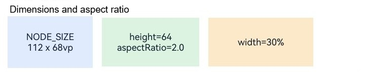
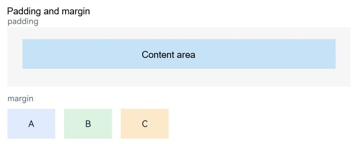
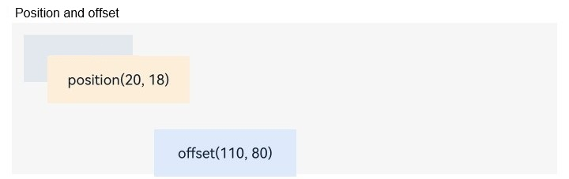

# Setting Common Layout Attributes

<!--Kit: ArkUI-->
<!--Subsystem: ArkUI-->
<!--Owner: @camlostshi-->
<!--Designer: @camlostshi-->
<!--Tester: @weixin_45530366-->
<!--Adviser: @Brilliantry_Rui-->
<!-- md-trans-meta sourceCommit=087470085268b4c7968360a1498b1da15f27d467 translatedAt=2026-07-06T13:07:36.226Z pushedAt=2026-07-07T10:34:42.081Z -->

Since API version 12, ArkUI provides a set of common layout attributes in the NDK to control the layout of components, such as dimensions, position, and borders.

This document describes the development guidelines for integrating common layout attributes in NDK in three typical scenarios: dimensions settings ([width](../reference/apis-arkui/arkui-ts/ts-universal-attributes-size.md#width), [height](../reference/apis-arkui/arkui-ts/ts-universal-attributes-size.md#height), [size](../reference/apis-arkui/arkui-ts/ts-universal-attributes-size.md#size), [aspectRatio](../reference/apis-arkui/arkui-ts/ts-universal-attributes-layout-constraints.md#aspectratio), [padding](../reference/apis-arkui/arkui-ts/ts-universal-attributes-size.md#padding), [margin](../reference/apis-arkui/arkui-ts/ts-universal-attributes-size.md#margin), [layoutWeight](../reference/apis-arkui/arkui-ts/ts-universal-attributes-size.md#layoutweight)), location settings ([position](../reference/apis-arkui/arkui-ts/ts-universal-attributes-location.md#position) and [offset](../reference/apis-arkui/arkui-ts/ts-universal-attributes-location.md#offset)), and border settings ([borderWidth](../reference/apis-arkui/arkui-ts/ts-universal-attributes-border.md#borderwidth), [borderColor](../reference/apis-arkui/arkui-ts/ts-universal-attributes-border.md#bordercolor), [borderStyle](../reference/apis-arkui/arkui-ts/ts-universal-attributes-border.md#borderstyle), and [borderRadius](../reference/apis-arkui/arkui-ts/ts-universal-attributes-border.md#borderradius)). For details about the property settings and parameter type enumeration, see [ArkUI_NodeType](../reference/apis-arkui/capi-native-node-h.md#arkui_nodetype).

This example shows only the core function code. For the complete code, please refer to <!--RP1-->[NDKLayoutSample](https://gitcode.com/openharmony/applications_app_samples/tree/master/code/DocsSample/ArkUISample/NDKLayoutSample)<!--RP1End-->. Before implementation, you need to access the ArkTS page. For details, see [Integrating with ArkTS Pages](../ui/ndk-access-the-arkts-page.md).

## Setting the Component Dimensions

The recommended way to use the NDK common layout attributes is to encapsulate the property settings method in a node class and then call them on the specific component. The following example encapsulates a group of fixed dimensions and aspect ratio attributes.

<!-- @[layout_size_node](https://gitcode.com/openharmony/applications_app_samples/blob/master/code/DocsSample/ArkUISample/NDKLayoutSample/entry/src/main/cpp/ArkUINode.h) -->  

``` C
void SetWidth(float width)
{
    ArkUI_NumberValue value[] = {{.f32 = width}};
    ArkUI_AttributeItem item = {value, 1};
    nativeModule_->setAttribute(handle_, NODE_WIDTH, &item);
}
void SetPercentWidth(float percent)
{
    ArkUI_NumberValue value[] = {{.f32 = percent}};
    ArkUI_AttributeItem item = {value, 1};
    nativeModule_->setAttribute(handle_, NODE_WIDTH_PERCENT, &item);
}
void SetHeight(float height)
{
    ArkUI_NumberValue value[] = {{.f32 = height}};
    ArkUI_AttributeItem item = {value, 1};
    nativeModule_->setAttribute(handle_, NODE_HEIGHT, &item);
}
void SetPercentHeight(float percent)
{
    ArkUI_NumberValue value[] = {{.f32 = percent}};
    ArkUI_AttributeItem item = {value, 1};
    nativeModule_->setAttribute(handle_, NODE_HEIGHT_PERCENT, &item);
}
void SetSize(float width, float height)
{
    ArkUI_NumberValue value[] = {{.f32 = width}, {.f32 = height}};
    ArkUI_AttributeItem item = {value, 2};
    nativeModule_->setAttribute(handle_, NODE_SIZE, &item);
}
```

<!-- @[layout_aspect_ratio_node](https://gitcode.com/openharmony/applications_app_samples/blob/master/code/DocsSample/ArkUISample/NDKLayoutSample/entry/src/main/cpp/ArkUINode.h) -->

```C
void SetAspectRatio(float ratio)
{
    ArkUI_NumberValue value[] = {{.f32 = ratio}};
    ArkUI_AttributeItem item = {value, 1};
    nativeModule_->setAttribute(handle_, NODE_ASPECT_RATIO, &item);
}
```

By combining these methods on a component, you can observe the effects of fixed dimensions, percentage-based dimensions, and aspect ratio.

<!-- @[layout_size_section](https://gitcode.com/openharmony/applications_app_samples/blob/master/code/DocsSample/ArkUISample/NDKLayoutSample/entry/src/main/cpp/LayoutAttributeExample.h) -->

```C
inline std::shared_ptr<ArkUITextNode> CreateFixedSizeItem()
{
    auto fixedItem = CreateDemoItem("NODE_SIZE\n112 x 68vp", SIZE_ITEM_BLUE);
    fixedItem->SetSize(FIXED_ITEM_WIDTH, FIXED_ITEM_HEIGHT);
    fixedItem->SetMargin(0.0F, SAMPLE_GAP, 0.0F, 0.0F);
    return fixedItem;
}

inline std::shared_ptr<ArkUITextNode> CreateAspectRatioItem()
{
    auto ratioItem = CreateDemoItem("height=64\naspectRatio=2.0", SIZE_ITEM_GREEN);
    ratioItem->SetHeight(RATIO_ITEM_HEIGHT);
    ratioItem->SetAspectRatio(RATIO_VALUE);
    ratioItem->SetMargin(0.0F, SAMPLE_GAP, 0.0F, 0.0F);
    return ratioItem;
}

inline std::shared_ptr<ArkUITextNode> CreatePercentWidthItem()
{
    auto percentItem = CreateDemoItem("width=30%", SIZE_ITEM_ORANGE);
    percentItem->SetPercentWidth(PERCENT_WIDTH_VALUE);
    percentItem->SetHeight(RATIO_ITEM_HEIGHT);
    return percentItem;
}
```

**SetSize()** writes both width and height at the same time, making it suitable for fixed-size components. **SetPercentWidth()** configures the component width to 30% of the parent container width through the input constant **PERCENT_WIDTH_VALUE**. **SetAspectRatio()** configures a fixed aspect ratio, automatically deriving the corresponding width from the explicitly set component height.



Typically, you also need to control margin and padding and adjust component dimensions through **padding** and **margin** to achieve good spacing effects.

<!-- @[layout_spacing_node](https://gitcode.com/openharmony/applications_app_samples/blob/master/code/DocsSample/ArkUISample/NDKLayoutSample/entry/src/main/cpp/ArkUINode.h) -->

``` C
void SetPadding(float padding)
{
    ArkUI_NumberValue value[] = {{.f32 = padding}};
    ArkUI_AttributeItem item = {value, 1};
    nativeModule_->setAttribute(handle_, NODE_PADDING, &item);
}
void SetPadding(float top, float right, float bottom, float left)
{
    ArkUI_NumberValue value[] = {{.f32 = top}, {.f32 = right}, {.f32 = bottom}, {.f32 = left}};
    ArkUI_AttributeItem item = {value, 4};
    nativeModule_->setAttribute(handle_, NODE_PADDING, &item);
}
void SetPercentPadding(float percent)
{
    ArkUI_NumberValue value[] = {{.f32 = percent}};
    ArkUI_AttributeItem item = {value, 1};
    nativeModule_->setAttribute(handle_, NODE_PADDING_PERCENT, &item);
}
void SetPercentPadding(float top, float right, float bottom, float left)
{
    ArkUI_NumberValue value[] = {{.f32 = top}, {.f32 = right}, {.f32 = bottom}, {.f32 = left}};
    ArkUI_AttributeItem item = {value, 4};
    nativeModule_->setAttribute(handle_, NODE_PADDING_PERCENT, &item);
}
void SetMargin(float margin)
{
    ArkUI_NumberValue value[] = {{.f32 = margin}};
    ArkUI_AttributeItem item = {value, 1};
    nativeModule_->setAttribute(handle_, NODE_MARGIN, &item);
}
void SetMargin(float top, float right, float bottom, float left)
{
    ArkUI_NumberValue value[] = {{.f32 = top}, {.f32 = right}, {.f32 = bottom}, {.f32 = left}};
    ArkUI_AttributeItem item = {value, 4};
    nativeModule_->setAttribute(handle_, NODE_MARGIN, &item);
}
void SetPercentMargin(float percent)
{
    ArkUI_NumberValue value[] = {{.f32 = percent}};
    ArkUI_AttributeItem item = {value, 1};
    nativeModule_->setAttribute(handle_, NODE_MARGIN_PERCENT, &item);
}
void SetPercentMargin(float top, float right, float bottom, float left)
{
    ArkUI_NumberValue value[] = {{.f32 = top}, {.f32 = right}, {.f32 = bottom}, {.f32 = left}};
    ArkUI_AttributeItem item = {value, 4};
    nativeModule_->setAttribute(handle_, NODE_MARGIN_PERCENT, &item);
}
```

<!-- @[layout_spacing_section](https://gitcode.com/openharmony/applications_app_samples/blob/master/code/DocsSample/ArkUISample/NDKLayoutSample/entry/src/main/cpp/LayoutAttributeExample.h) -->

```C
inline std::shared_ptr<ArkUITextNode> CreatePercentWidthPaddingItem()
{
    auto inner = CreateDemoItem("Content area", PADDING_ITEM_BLUE);
    inner->SetPercentWidth(FULL_SIZE);
    return inner;
}

inline std::shared_ptr<ArkUIColumnNode> CreatePaddingHost()
{
    auto paddingHost = std::make_shared<ArkUIColumnNode>();
    paddingHost->SetPercentWidth(FULL_SIZE);
    paddingHost->SetHeight(SPACING_PADDING_HOST_HEIGHT);
    paddingHost->SetBackgroundColor(SURFACE_BACKGROUND_COLOR);
    paddingHost->SetPadding(PADDING_TOP, PADDING_RIGHT, PADDING_TOP, PADDING_RIGHT);
    paddingHost->SetMargin(0.0F, 0.0F, CARD_MARGIN_BOTTOM, 0.0F);
    paddingHost->AddChild(CreatePercentWidthPaddingItem());
    return paddingHost;
}

inline std::shared_ptr<ArkUITextNode> CreateMarginItem(const std::string &text, uint32_t color, bool addSpacing = false)
{
    auto item = CreateDemoItem(text, color);
    item->SetWidth(SMALL_ITEM_WIDTH);
    if (addSpacing) { item->SetMargin(0.0F, SAMPLE_GAP, 0.0F, 0.0F); }
    return item;
}
```

The **padding** attribute is used to control the spacing between a component's content area and its edges, while the **margin** attribute is used to control the spacing between a component and the edges of its parent container. If you need to set spacing based on the parent container's proportions, you can use the methods corresponding to **NODE_PADDING_PERCENT** and **NODE_MARGIN_PERCENT** in [ArkUI_NodeType](../reference/apis-arkui/capi-native-node-h.md#arkui_nodetype).



## Using Position Attributes

If you need to further adjust the component's placement after the dimensions and spacing have been determined, you can use [position](../reference/apis-arkui/arkui-ts/ts-universal-attributes-location.md#position) and [offset](../reference/apis-arkui/arkui-ts/ts-universal-attributes-location.md#offset). Both change the component's display position, but they have different meanings. **position** indicates positioning relative to the parent container, while **offset** indicates a shift from the original layout result.

<!-- @[layout_position_node](https://gitcode.com/openharmony/applications_app_samples/blob/master/code/DocsSample/ArkUISample/NDKLayoutSample/entry/src/main/cpp/ArkUINode.h) -->

```C
void SetPosition(float x, float y)
{
    ArkUI_NumberValue value[] = {{.f32 = x}, {.f32 = y}};
    ArkUI_AttributeItem item = {value, 2};
    nativeModule_->setAttribute(handle_, NODE_POSITION, &item);
}

void SetOffset(float x, float y)
{
    ArkUI_NumberValue value[] = {{.f32 = x}, {.f32 = y}};
    ArkUI_AttributeItem item = {value, 2};
    nativeModule_->setAttribute(handle_, NODE_OFFSET, &item);
}
```

Apply these two attributes to different components for comparison.

<!-- @[layout_position_section](https://gitcode.com/openharmony/applications_app_samples/blob/master/code/DocsSample/ArkUISample/NDKLayoutSample/entry/src/main/cpp/LayoutAttributeExample.h) -->

```C
inline std::shared_ptr<ArkUITextNode> CreatePositionedItem()
{
    auto positioned = CreateDemoItem("position(20, 18)", POSITION_ITEM_ORANGE);
    positioned->SetWidth(LARGE_ITEM_WIDTH);
    positioned->SetPosition(POSITION_X, POSITION_Y);
    return positioned;
}

inline std::shared_ptr<ArkUITextNode> CreateOffsetItem()
{
    auto offset = CreateDemoItem("offset(110, 80)", POSITION_ITEM_BLUE);
    offset->SetWidth(LARGE_ITEM_WIDTH);
    offset->SetMargin(OFFSET_MARGIN_TOP, 0.0F, 0.0F, 0.0F);
    offset->SetOffset(OFFSET_X, POSITION_Y);
    return offset;
}
```

Two effects can be observed: `position` directly sets the target position, while `offset` retains the original placeholder relationship and then shifts toward the target direction.



## Using Border Attributes

Border attributes are used in the NDK in the same way as described above: first encapsulate the methods, then combine and call them on specific components. The method encapsulation is as follows.

<!-- @[layout_border_node](https://gitcode.com/openharmony/applications_app_samples/blob/master/code/DocsSample/ArkUISample/NDKLayoutSample/entry/src/main/cpp/ArkUINode.h) -->  

``` C
void SetBorderWidth(float width)
{
    ArkUI_NumberValue value[] = {{.f32 = width}};
    ArkUI_AttributeItem item = {value, 1};
    nativeModule_->setAttribute(handle_, NODE_BORDER_WIDTH, &item);
}
void SetBorderWidth(float top, float right, float bottom, float left)
{
    ArkUI_NumberValue value[] = {{.f32 = top}, {.f32 = right}, {.f32 = bottom}, {.f32 = left}};
    ArkUI_AttributeItem item = {value, 4};
    nativeModule_->setAttribute(handle_, NODE_BORDER_WIDTH, &item);
}
void SetBorderRadius(float radius)
{
    ArkUI_NumberValue value[] = {{.f32 = radius}};
    ArkUI_AttributeItem item = {value, 1};
    nativeModule_->setAttribute(handle_, NODE_BORDER_RADIUS, &item);
}
void SetBorderRadius(float topLeft, float topRight, float bottomLeft, float bottomRight)
{
    ArkUI_NumberValue value[] = {
        {.f32 = topLeft}, {.f32 = topRight}, {.f32 = bottomLeft}, {.f32 = bottomRight}
    };
    ArkUI_AttributeItem item = {value, 4};
    nativeModule_->setAttribute(handle_, NODE_BORDER_RADIUS, &item);
}
void SetBorderColor(uint32_t color)
{
    ArkUI_NumberValue value[] = {{.u32 = color}};
    ArkUI_AttributeItem item = {value, 1};
    nativeModule_->setAttribute(handle_, NODE_BORDER_COLOR, &item);
}
void SetBorderColor(uint32_t top, uint32_t right, uint32_t bottom, uint32_t left)
{
    ArkUI_NumberValue value[] = {{.u32 = top}, {.u32 = right}, {.u32 = bottom}, {.u32 = left}};
    ArkUI_AttributeItem item = {value, 4};
    nativeModule_->setAttribute(handle_, NODE_BORDER_COLOR, &item);
}
void SetBorderStyle(ArkUI_BorderStyle style)
{
    ArkUI_NumberValue value[] = {{.i32 = style}};
    ArkUI_AttributeItem item = {value, 1};
    nativeModule_->setAttribute(handle_, NODE_BORDER_STYLE, &item);
}
void SetBorderStyle(
    ArkUI_BorderStyle top, ArkUI_BorderStyle right, ArkUI_BorderStyle bottom, ArkUI_BorderStyle left)
{
    ArkUI_NumberValue value[] = {
        {.i32 = top}, {.i32 = right}, {.i32 = bottom}, {.i32 = left}
    };
    ArkUI_AttributeItem item = {value, 4};
    nativeModule_->setAttribute(handle_, NODE_BORDER_STYLE, &item);
}
```

After the component has dimensions and spacing, you can continue to overlay these border attributes to create outlines and visual separation effects.

