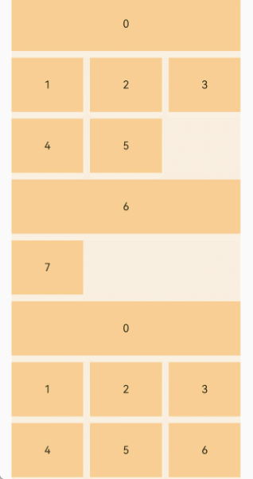

# Using Grids

<!--Kit: ArkUI-->
<!--Subsystem: ArkUI-->
<!--Owner: @guozejun-->
<!--Designer: @zcdqs-->
<!--Tester: @leiyuqian-->
<!--Adviser: @Brilliantry_Rui-->

## Overview

The ArkUI development framework provides the grid component in NDK APIs since API version 12. The grid allows you to divide a page into cells by rows and columns, and specify the cell where a child component is located and the number of rows and columns it occupies, thereby achieving different layout requirements. For example, you can create widgets and application icons of different sizes, and group images by date for display.

After [creating a grid](#creating-a-grid), you can [set the number of rows and columns occupied by child components](#setting-the-number-of-rows-and-columns-occupied-by-child-components). In the scrolling scenario, you can also [handle scroll events](#handling-scroll-events).

For details about the basic usage of the NDK and how to use the NDK APIs to build UIs, see [Integrating with ArkTS Pages](ndk-access-the-arkts-page.md).

## Creating a Grid

You can call [createNode(ARKUI_NODE_GRID)](../reference/apis-arkui/capi-arkui-nativemodule-arkui-nativenodeapi-1.md#createnode) through [ArkUI_NativeNodeAPI_1](../reference/apis-arkui/capi-arkui-nativemodule-arkui-nativenodeapi-1.md) to obtain the component object pointer, and set attributes such as **NODE_GRID_COLUMN_TEMPLATE**, **NODE_GRID_ROW_TEMPLATE**, **NODE_GRID_COLUMN_GAP**, and **NODE_GRID_ROW_GAP** in [ArkUI_NodeAttributeType](../reference/apis-arkui/capi-native-node-h.md#arkui_nodeattributetype) to create a grid.

Encapsulate the common attributes of the grid component into a custom **ArkUIGridNode** class by referring to the implementation of the list component in [Example](ndk-access-the-arkts-page.md#example).

<!-- @[grid_define](https://gitcode.com/openharmony/applications_app_samples/blob/master/code/DocsSample/ArkUISample/NDKGridSample/entry/src/main/cpp/ArkUIGridNode.h) -->

``` C
#ifndef MYAPPLICATION_ARKUIGRIDNODE_H
#define MYAPPLICATION_ARKUIGRIDNODE_H

#include "ArkUINode.h"
#include "ArkUINodeAdapter.h"

namespace NativeModule {
class ArkUIGridNode : public ArkUINode {
public:
    ArkUIGridNode() : ArkUINode((NativeModuleInstance::GetInstance()->GetNativeNodeAPI())->createNode(ARKUI_NODE_GRID))
    {
    }

    ~ArkUIGridNode() override {}

    void SetColumnsTemplate(const std::string &str)
    {
        ArkUI_AttributeItem item = {.string = str.c_str()};
        nativeModule_->setAttribute(handle_, NODE_GRID_COLUMN_TEMPLATE, &item);
    }

    void SetRowsTemplate(const std::string &str)
    {
        ArkUI_AttributeItem item = {.string = str.c_str()};
        nativeModule_->setAttribute(handle_, NODE_GRID_ROW_TEMPLATE, &item);
    }

    void SetColumnsGap(float val)
    {
        ArkUI_NumberValue value[] = {{.f32 = val}};
        ArkUI_AttributeItem item = {value, 1};
        nativeModule_->setAttribute(handle_, NODE_GRID_COLUMN_GAP, &item);
    }

    void SetRowsGap(float val)
    {
        ArkUI_NumberValue value[] = {{.f32 = val}};
        ArkUI_AttributeItem item = {value, 1};
        nativeModule_->setAttribute(handle_, NODE_GRID_ROW_GAP, &item);
    }

    void SetLayoutOptions(ArkUI_GridLayoutOptions *option)
    {
        if (option == nullptr) {
            return;
        }
        ArkUI_AttributeItem item = {.object = option};
        nativeModule_->setAttribute(handle_, NODE_GRID_LAYOUT_OPTIONS, &item);
    }

    void SetScrollBar(int32_t barState)
    {
        ArkUI_NumberValue value[] = {{.i32 = barState}};
        ArkUI_AttributeItem item = {value, 1};
        nativeModule_->setAttribute(handle_, NODE_SCROLL_BAR_DISPLAY_MODE, &item);
    }

    void SetLazyAdapter(const std::shared_ptr<ArkUINodeAdapter> &adapter)
    {
        if (!IsNotNull(adapter)) {
            return;
        }
        ArkUI_AttributeItem item{nullptr, 0, nullptr, adapter->GetAdapter()};
        nativeModule_->setAttribute(handle_, NODE_GRID_NODE_ADAPTER, &item);
        _adapter = adapter;
    }

    void ReleaseAdapter() { return _adapter.reset(); }

private:
    std::shared_ptr<ArkUINodeAdapter> _adapter;
};
} // namespace NativeModule

#endif // MYAPPLICATION_ARKUIGRIDNODE_H
```

The code for creating a grid component with six rows and four columns and setting row and column spacing using **ArkUIGridNode** is as follows:

<!-- @[grid_columns_and_rows](https://gitcode.com/openharmony/applications_app_samples/blob/master/code/DocsSample/ArkUISample/NDKGridSample/entry/src/main/cpp/GridRectByIndexExample.cpp) -->

```cpp
auto grid = std::make_shared<ArkUIGridNode>();
grid->SetPercentWidth(0.9f);
grid->SetHeight(SIX_ROWS * ITEM_HEIGHT + (SIX_ROWS - 1) * ROWS_GAP);
grid->SetColumnsTemplate("1fr 1fr 1fr 1fr");
grid->SetRowsTemplate("1fr 1fr 1fr 1fr 1fr 1fr");
grid->SetColumnsGap(10.0f);
grid->SetRowsGap(ROWS_GAP);
```

**NODE_GRID_COLUMN_TEMPLATE** and **NODE_GRID_ROW_TEMPLATE** support multiple modes of defining the number of columns and rows. The following uses the number of columns as an example:

``` C++
// Use the fr unit (fraction, proportion).
grid->SetColumnsTemplate("1fr 2fr 1fr");  // The width of the second column is twice that of the first and third columns.

// Use the repeat function.
grid->SetColumnsTemplate("repeat(auto-fill, 100vp)");  // Automatically fill columns with a width of 100 vp.
```

For more information, see [columnsTemplate](../reference/apis-arkui/arkui-ts/ts-container-grid.md#columnstemplate).

## Setting the Number of Rows and Columns Occupied by Child Components

By default, all child components of the grid component occupy one row and one column. For such scenarios, this can also be achieved by setting **NODE_LIST_LANES** in [ArkUI_NodeAttributeType](../reference/apis-arkui/capi-native-node-h.md#arkui_nodeattributetype) through the list component. The grid layout is more suitable for scenarios where some child components occupy multiple rows or columns, such as widgets and icons of different sizes on a page, or grouping images by date for display. Since API version 22, you can create a grid and pass a proper [ArkUI_GridLayoutOptions](../reference/apis-arkui/capi-arkui-nativemodule-arkui-gridlayoutoptions.md) to implement this scenario.

### Layout Comparison

| Requirement Scenario| Recommended Solution| Description|
|------|---------|------|
| Fixed-row-and-column grid, with some items occupying multiple rows and columns| [OH_ArkUI_GridLayoutOptions_RegisterGetRectByIndexCallback](../reference/apis-arkui/capi-native-type-h.md#oh_arkui_gridlayoutoptions_registergetrectbyindexcallback) | Flexibly controls the position and size of each item.|
| Scrollable grid, with a group title occupying the entire row| [OH_ArkUI_GridLayoutOptions_SetIrregularIndexes](../reference/apis-arkui/capi-native-type-h.md#oh_arkui_gridlayoutoptions_setirregularindexes) | Specifies the index that occupies the entire row.|

### Setting the Position and Size of Child Components in a Fixed Row and Column Scenario

As shown in the following figure, some child components are placed in the previously created grid layout of 6 rows and 4 columns. **0** occupies two rows and four columns, **1** occupies two rows and two columns, and **2** occupies one row and two columns. There is an empty row between **0** and **1**, simulating the scenario where widgets and icons of different sizes are placed on the page.


You can use [OH_ArkUI_GridLayoutOptions_RegisterGetRectByIndexCallback](../reference/apis-arkui/capi-native-type-h.md#oh_arkui_gridlayoutoptions_registergetrectbyindexcallback) to set a callback for the **Grid** component to obtain the position of each child component. In the callback, you can specify the start row number, start column number, number of occupied rows, and number of occupied columns of each child component, that is, [ArkUI_GridItemRect](../reference/apis-arkui/capi-arkui-nativemodule-arkui-griditemrect.md). The layout in the preceding figure can be implemented using the following code:

"0" occupies two rows and four columns starting from the upper left corner of the grid. Therefore, set **ArkUI_GridItemRect** to **{0, 0, 2, 4}**. The position and size settings for other child components follow the same logic.

<!-- @[grid_get_rect_by_index](https://gitcode.com/openharmony/applications_app_samples/blob/master/code/DocsSample/ArkUISample/NDKGridSample/entry/src/main/cpp/GridRectByIndexExample.cpp) -->

``` C++
auto option = std::make_shared<ArkuiGridLayoutOptions>();
auto layoutOptions = option->GetLayoutOptions();
OH_ArkUI_GridLayoutOptions_RegisterGetRectByIndexCallback(
    option->GetLayoutOptions(), nullptr, [](int32_t itemIndex, void *userData) -> ArkUI_GridItemRect {
        switch (itemIndex) {
            case 0:
                return ArkUI_GridItemRect{0, 0, 2, 4};
            case 1:
                return ArkUI_GridItemRect{3, 0, 2, 2};
            case ITEM_INDEX_2:
                return ArkUI_GridItemRect{3, 2, 1, 2};
            case ITEM_INDEX_3:
                return ArkUI_GridItemRect{4, 2, 1, 1};
            case ITEM_INDEX_4:
                return ArkUI_GridItemRect{4, 3, 1, 1};
            case ITEM_INDEX_5:
                return ArkUI_GridItemRect{5, 0, 1, 1};
            case ITEM_INDEX_6:
                return ArkUI_GridItemRect{5, 1, 1, 1};
            case ITEM_INDEX_7:
                return ArkUI_GridItemRect{5, 2, 1, 1};
            default:
                return ArkUI_GridItemRect{5, 3, 1, 1};
        }
    });
grid->SetLayoutOptions(layoutOptions);
```

### Setting Data Group Display in Scrolling Scenarios

The following figure simulates the scenario where images or files are displayed in groups, where the child component serving as the group name occupies an entire row, and other child components occupy 1 row and 1 column.



For a vertically scrolling grid layout, you only need to set the number of columns, and do not need to set the number of rows.

<!-- @[grid_columns](https://gitcode.com/openharmony/applications_app_samples/blob/master/code/DocsSample/ArkUISample/NDKGridSample/entry/src/main/cpp/GridIrregularIndexesExample.cpp) -->

``` C++
grid->SetColumnsTemplate("1fr 1fr 1fr");
grid->SetColumnsGap(10.0f);
grid->SetRowsGap(10.0f);
grid->SetScrollBar(ARKUI_SCROLL_BAR_DISPLAY_MODE_OFF);
```

To display data in groups, you can use [OH_ArkUI_GridLayoutOptions_SetIrregularIndexes](../reference/apis-arkui/capi-native-type-h.md#oh_arkui_gridlayoutoptions_setirregularindexes) to set the indexes corresponding to the group nodes. The child components corresponding to these indexes will occupy an entire row, while other child components will occupy 1 row and 1 column.

<!-- @[grid_group_indexes](https://gitcode.com/openharmony/applications_app_samples/blob/master/code/DocsSample/ArkUISample/NDKGridSample/entry/src/main/cpp/GridIrregularIndexesExample.cpp) -->

``` C++
auto layoutOptions = std::make_shared<ArkuiGridLayoutOptions>();
uint32_t irregularIndexes[] = {0, 6, 8, 15};
OH_ArkUI_GridLayoutOptions_SetIrregularIndexes(layoutOptions->GetLayoutOptions(), irregularIndexes,
                                               sizeof(irregularIndexes) / sizeof(irregularIndexes[0]));
grid->SetLayoutOptions(layoutOptions->GetLayoutOptions());
```

The **Grid** component supports the use of [NodeAdapter](../reference/apis-arkui/capi-arkui-nativemodule-arkui-nodeadapter8h.md) to generate child components on demand to improve performance. For details, see [NodeAdapter Overview](ndk-loading-long-list.md#nodeadapter-overview) and [<!--RP1-->][Full Code for Grouped Data Display](https://gitcode.com/openharmony/applications_app_samples/blob/master/code/DocsSample/ArkUISample/NDKGridSample/entry/src/main/cpp/GridIrregularIndexesExample.cpp).<!--RP1End-->

## Handling Scroll Events

### Listening for Scrolling Events

Refer to the sample code for listening to the **NODE_LIST_ON_SCROLL_INDEX** event in the [ArkUI_NodeEventType](../reference/apis-arkui/capi-native-node-h.md#arkui_nodeeventtype) component in [Adding an Event Listener](ndk-add-component-events.md) to implement grid scroll event listening.

The **Grid** component supports the following scroll events:

| Event Enum| Event Description| Start API Version|
|---------|------|---------|
| NODE_SCROLL_EVENT_ON_SCROLL_FRAME_BEGIN  | Triggered when the **Grid** component starts a new frame, providing the offset to be scrolled in the current frame and current scroll state.| 12 |
| NODE_SCROLL_EVENT_ON_SCROLL_START | Triggered when the **Grid** component starts scrolling.| 22 |
| NODE_SCROLL_EVENT_ON_SCROLL_STOP | Triggered when the **Grid** component stops scrolling.| 22 |
| NODE_SCROLL_EVENT_ON_REACH_START | Triggered when the **Grid** component reaches the start position.| 12 |
| NODE_SCROLL_EVENT_ON_REACH_END | Triggered when the **Grid** component reaches the end position.| 12 |
| NODE_SCROLL_EVENT_ON_WILL_STOP_DRAGGING | Triggered when the user is about to release the drag on the **Grid** component.| 20 |
| NODE_SCROLL_EVENT_ON_WILL_START_DRAGGING | Triggered when the drag on the **Grid** component ends.| 21 |
| NODE_SCROLL_EVENT_ON_DID_STOP_DRAGGING | Triggered when the drag on the **Grid** component ends.| 21 |
| NODE_SCROLL_EVENT_ON_WILL_START_FLING | Triggered when the sliding animation of the **Grid** component is about to start.| 21 |
| NODE_SCROLL_EVENT_ON_DID_STOP_FLING | Triggered when the sliding animation of the **Grid** component ends.| 21 |
| NODE_GRID_ON_SCROLL_INDEX | Triggered when a child component slides into or out of the display area of the **Grid** component. The callback returns the index values of the child components at the start and end positions of the display area.| 22 |
| NODE_GRID_ON_WILL_SCROLL | Triggered before the **Grid** component slides. The callback returns the offset amount by which the component is to slide in the current frame, current sliding state, and source of the sliding operation.| 22 |
| NODE_GRID_ON_DID_SCROLL | Triggered after the **Grid** component slides. The callback returns the offset amount by which the component has scrolled and the current scroll state.| 22 |
| NODE_GRID_ON_SCROLL_BAR_UPDATE | Sets the position and length of the scrollbar at the end of each frame layout.| 22 |

### Controlling the Scrolling Position

You can set **NODE_SCROLL_OFFSET** and **NODE_GRID_SCROLL_TO_INDEX** in [ArkUI_NodeAttributeType](../reference/apis-arkui/capi-native-node-h.md#arkui_nodeattributetype) to [control the list scroll position](ndk-loading-long-list.md#controlling-the-list-scroll-position).

Since API version 23, **NODE_GRID_SCROLL_TO_INDEX** is supported.

##  

<!--RP2-->
 
<!--RP2End-->
