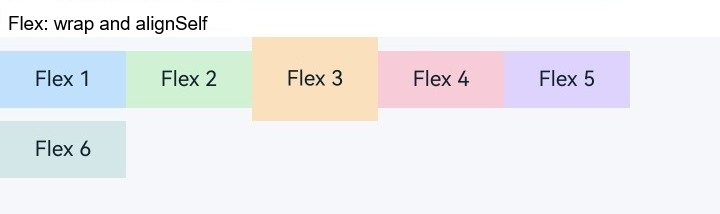

# Using Layout Components

<!--Kit: ArkUI-->
<!--Subsystem: ArkUI-->
<!--Owner: @camlostshi-->
<!--Designer: @camlostshi-->
<!--Tester: @weixin_45530366-->
<!--Adviser: @Brilliantry_Rui-->

Since API version 12, ArkUI provides the node types and attribute settings APIs corresponding to the common layout components [Flex](../reference/apis-arkui/arkui-ts/ts-container-flex.md), [Row](../reference/apis-arkui/arkui-ts/ts-container-row.md), [Column](../reference/apis-arkui/arkui-ts/ts-container-column.md), and [Stack](../reference/apis-arkui/arkui-ts/ts-container-stack.md) in the NDK. **Flex** is used for flexible layout, **Row** and **Column** for linear layout, and **Stack** for stacked layout. For details about the corresponding node types and attribute settings enumerations, see [ArkUI_NodeType](../reference/apis-arkui/capi-native-node-h.md#arkui_nodetype).

This document uses the flexible component **Flex** as an example to describe how to integrate layout components and set attributes in the NDK. This example shows only the core function code. For the complete code, please refer to <!--RP1-->[NDKFlexSample](https://gitcode.com/openharmony/applications_app_samples/blob/master/code/DocsSample/ArkUISample/NDKFlexSample)<!--RP1End-->. Before implementation, you need to access the ArkTS page. For details, see [Integrating with ArkTS Pages](../ui/ndk-access-the-arkts-page.md).

## Encapsulating Container Components

Call the [createNode](../reference/apis-arkui/capi-arkui-nativemodule-arkui-nativenodeapi-1.md#createnode) API and pass **ARKUI_NODE_FLEX** in **ArkUI_NodeType** to create a **Flex** node. In the following example, the node is encapsulated as **ArkUIFlexNode**, and the [setAttribute](../reference/apis-arkui/capi-arkui-nativemodule-arkui-nativenodeapi-1.md#setattribute) API is used with **NODE_FLEX_OPTION** to set the main axis direction, wrapping, and alignment. The five parameters in **ArkUI_NumberValue** each control different flex layout behaviors. For details, see [FlexOptions](../reference/apis-arkui/arkui-ts/ts-container-flex.md#flexoptions).

<!-- @[flex_flex_node](https://gitcode.com/openharmony/applications_app_samples/blob/master/code/DocsSample/ArkUISample/NDKFlexSample/entry/src/main/cpp/ArkUIFlexNode.h) -->

``` C
class ArkUIFlexNode : public ArkUINode {
public:
    ArkUIFlexNode()
        : ArkUINode((NativeModuleInstance::GetInstance()->GetNativeNodeAPI())->createNode(ARKUI_NODE_FLEX)) {}

    ~ArkUIFlexNode() override = default;

    void SetFlexOption(ArkUI_FlexDirection direction, ArkUI_FlexWrap wrap, ArkUI_FlexAlignment justifyContent,
        ArkUI_ItemAlignment alignItems, ArkUI_FlexAlignment alignContent)
    {
        ArkUI_NumberValue value[] = {
            {.i32 = direction},
            {.i32 = wrap},
            {.i32 = justifyContent},
            {.i32 = alignItems},
            {.i32 = alignContent}
        };
        ArkUI_AttributeItem item = {value, 5};
        nativeModule_->setAttribute(handle_, NODE_FLEX_OPTION, &item);
    }
};
```

After the node is created, a **Flex** component with a preset style is constructed using the pre-implemented common attributes and the **SetFlexOption** function. The following code shows how to set the container to arrange child components by row, automatically wrap child components when they exceed the width, and start the layout from the start position of each row by default.

<!-- @[flex_container_helper](https://gitcode.com/openharmony/applications_app_samples/blob/master/code/DocsSample/ArkUISample/NDKFlexSample/entry/src/main/cpp/FlexLayoutExample.h) -->

``` C
inline std::shared_ptr<ArkUIFlexNode> CreateFlexContainer()
{
    auto flex = std::make_shared<ArkUIFlexNode>();
    flex->SetPercentWidth(FULL_SIZE);
    flex->SetHeight(SECTION_HEIGHT_LARGE);
    flex->SetBackgroundColor(SECTION_BACKGROUND_COLOR);
    flex->SetFlexOption(ARKUI_FLEX_DIRECTION_ROW, ARKUI_FLEX_WRAP_WRAP, ARKUI_FLEX_ALIGNMENT_START,
        ARKUI_ITEM_ALIGNMENT_CENTER, ARKUI_FLEX_ALIGNMENT_START);
    return flex;
}
```

## Adding Child Components

The following example adds a set of child components to the **Flex** container. To display the line break and cross-axis alignment effect, set a separate height and [alignSelf](../reference/apis-arkui/arkui-ts/ts-universal-attributes-flex-layout.md#alignself) for the third child component. **alignSelf** is a universal component attribute that takes effect within a **Flex** container. By encapsulating this attribute setting into a custom API **SetAlignSelf** and applying it to a specified component via **NODE_ALIGN_SELF**, you can control the alignment format of a single child component along the parent container's cross axis. Its priority is higher than the container's [alignItems](../reference/apis-arkui/arkui-ts/ts-container-flex.md#flexoptions) attribute.

<!-- @[flex_align_self_helper](https://gitcode.com/openharmony/applications_app_samples/blob/master/code/DocsSample/ArkUISample/NDKFlexSample/entry/src/main/cpp/FlexLayoutExample.h) -->

``` C
inline void SetAlignSelf(const std::shared_ptr<ArkUIBaseNode> &node, ArkUI_ItemAlignment align)
{
    ArkUI_NumberValue value[] = {{.i32 = align}};
    ArkUI_AttributeItem item = {value, 1};
    NativeModuleInstance::GetInstance()->GetNativeNodeAPI()->setAttribute(node->GetHandle(), NODE_ALIGN_SELF, &item);
}
```

<!-- @[flex_align_self_example](https://gitcode.com/openharmony/applications_app_samples/blob/master/code/DocsSample/ArkUISample/NDKFlexSample/entry/src/main/cpp/FlexLayoutExample.h) -->

``` C
inline std::shared_ptr<ArkUITextNode> CreateFlexExampleItem(int32_t index, uint32_t bgColor)
{
    auto item = CreateFixedItem("Flex " + std::to_string(index + 1), bgColor);
    if (index == ALIGN_SELF_ITEM_INDEX) { item->SetHeight(ALIGN_SELF_ITEM_HEIGHT); }
    if (index == ALIGN_SELF_ITEM_INDEX) { SetAlignSelf(item, ARKUI_ITEM_ALIGNMENT_END); }
    return item;
}
```

Create six child components and add them to the same **Flex** component.

<!-- @[flex_container_example](https://gitcode.com/openharmony/applications_app_samples/blob/master/code/DocsSample/ArkUISample/NDKFlexSample/entry/src/main/cpp/FlexLayoutExample.h) -->

``` C
inline std::array<uint32_t, FLEX_ITEM_COUNT> CreateFlexColorSet()
{
    return {FLEX_ITEM_BLUE, FLEX_ITEM_GREEN, FLEX_ITEM_ORANGE, FLEX_ITEM_PINK, FLEX_ITEM_PURPLE, FLEX_ITEM_TEAL};
}

inline std::shared_ptr<ArkUIFlexNode> CreateFlexWrapExample()
{
    auto flex = CreateFlexContainer();
    const auto flexColors = CreateFlexColorSet();
    for (int32_t index = 0; index < static_cast<int32_t>(flexColors.size()); ++index) { // Loop through the array and add a group of child nodes.
        flex->AddChild(CreateFlexExampleItem(index, flexColors[index]));
    }
    return flex;
}
```

At this point, **CreateFlexContainer()** has set the **Flex** container's wrapping behavior to **ARKUI_FLEX_WRAP_WRAP**, so when the total width of the child components exceeds the container width, the layout will automatically wrap. After the third child component calls **SetAlignSelf()**, it will be positioned according to its own cross-axis alignment rule, rather than using the container's **ARKUI_ITEM_ALIGNMENT_CENTER**.



To change the layout direction to vertical, change **direction** to **ARKUI_FLEX_DIRECTION_COLUMN**. In this case, the code structure remains unchanged, and the layout logic on the main axis and cross axis remains the same.

## Allocating Remaining Space Using flexBasis and flexGrow

**Flex** not only controls the arrangement direction of child components, but also controls the allocation of remaining space on the main axis. The [flexBasis](../reference/apis-arkui/arkui-ts/ts-universal-attributes-flex-layout.md#flexbasis), [flexGrow](../reference/apis-arkui/arkui-ts/ts-universal-attributes-flex-layout.md#flexgrow), and [flexShrink](../reference/apis-arkui/arkui-ts/ts-universal-attributes-flex-layout.md#flexshrink) attributes can be used to control the grow and shrink behavior of child components in a **Flex** container.

<!-- @[flex_grow_helper](https://gitcode.com/openharmony/applications_app_samples/blob/master/code/DocsSample/ArkUISample/NDKFlexSample/entry/src/main/cpp/FlexLayoutExample.h) -->

``` C
inline void SetFlexGrow(const std::shared_ptr<ArkUIBaseNode> &node, float grow)
{
    ArkUI_NumberValue value[] = {{.f32 = grow}};
    ArkUI_AttributeItem item = {value, 1};
    NativeModuleInstance::GetInstance()->GetNativeNodeAPI()->setAttribute(node->GetHandle(), NODE_FLEX_GROW, &item);
}

inline void SetFlexShrink(const std::shared_ptr<ArkUIBaseNode> &node, float shrink)
{
    ArkUI_NumberValue value[] = {{.f32 = shrink}};
    ArkUI_AttributeItem item = {value, 1};
    NativeModuleInstance::GetInstance()->GetNativeNodeAPI()->setAttribute(
        node->GetHandle(), NODE_FLEX_SHRINK, &item);
}

inline void SetFlexBasis(const std::shared_ptr<ArkUIBaseNode> &node, float basis)
{
    ArkUI_NumberValue value[] = {{.f32 = basis}};
    ArkUI_AttributeItem item = {value, 1};
    NativeModuleInstance::GetInstance()->GetNativeNodeAPI()->setAttribute(node->GetHandle(), NODE_FLEX_BASIS, &item);
}
```

<!-- @[flex_grow_example](https://gitcode.com/openharmony/applications_app_samples/blob/master/code/DocsSample/ArkUISample/NDKFlexSample/entry/src/main/cpp/FlexLayoutExample.h) -->

``` C
inline std::shared_ptr<ArkUITextNode> CreateGrowItem(
    const std::string &text, uint32_t bgColor, float grow, float shrink = 0.0F)
{
    auto item = CreateFlexibleItem(text, bgColor);
    SetFlexBasis(item, FLEX_BASIS);
    SetFlexGrow(item, grow);
    SetFlexShrink(item, shrink);
    return item;
}

inline std::shared_ptr<ArkUIRowNode> CreateFlexGrowExample()
{
    auto growRow = CreateRowContainer();
    growRow->AddChild(CreateGrowItem("1", COLUMN_ITEM_BLUE, DEFAULT_FLEX_GROW));
    growRow->AddChild(CreateGrowItem("2", COLUMN_ITEM_GREEN, EMPHASIZED_FLEX_GROW, EMPHASIZED_FLEX_SHRINK));
    growRow->AddChild(CreateGrowItem("1", COLUMN_ITEM_PINK, DEFAULT_FLEX_GROW));
    return growRow;
}
```

First, use **SetFlexBasis() **to set the base size of child components along the main axis, then use **SetFlexGrow()** to specify the proportion for distributing remaining space, and finally use **SetFlexShrink()** to define the shrink ratio when space is insufficient.

In the example, the three child components have **flexGrow** values of **1**, **2**, and **1** respectively, so when there is remaining space in the container, the middle child component will occupy more width.


## Distributing Space Proportionally Using layoutWeight

When the main axis size of the parent container is already determined, you can use [layoutWeight](../reference/apis-arkui/arkui-ts/ts-universal-attributes-size.md#layoutweight) to distribute remaining space according to weight. This property takes effect in **Row**, **Column**, and **Flex**. Once a child component has a **layoutWeight** value greater than **0**, it will be allocated remaining space along the main axis based on weight ratio, and no longer participates in the distribution of **flexGrow** and **flexShrink**.

<!-- @[flex_layout_weight_helper](https://gitcode.com/openharmony/applications_app_samples/blob/master/code/DocsSample/ArkUISample/NDKFlexSample/entry/src/main/cpp/FlexLayoutExample.h) -->

``` C
inline void SetLayoutWeight(const std::shared_ptr<ArkUIBaseNode> &node, uint32_t weight)
{
    ArkUI_NumberValue value[] = {{.u32 = weight}};
    ArkUI_AttributeItem item = {value, 1};
    NativeModuleInstance::GetInstance()->GetNativeNodeAPI()->setAttribute(
        node->GetHandle(), NODE_LAYOUT_WEIGHT, &item);
}
```

<!-- @[flex_layout_weight_example](https://gitcode.com/openharmony/applications_app_samples/blob/master/code/DocsSample/ArkUISample/NDKFlexSample/entry/src/main/cpp/FlexLayoutExample.h) -->

``` C
inline std::shared_ptr<ArkUITextNode> CreateWeightedItem(const std::string &text, uint32_t bgColor, uint32_t weight)
{
    auto item = CreateFlexibleItem(text, bgColor);
    SetLayoutWeight(item, weight);
    return item;
}

inline std::shared_ptr<ArkUIRowNode> CreateLayoutWeightExample()
{
    auto weightRow = CreateRowContainer();
    weightRow->AddChild(CreateWeightedItem("Weight 1", COLUMN_ITEM_BLUE, DEFAULT_LAYOUT_WEIGHT));
    weightRow->AddChild(CreateWeightedItem("Weight 2", COLUMN_ITEM_GREEN, EMPHASIZED_LAYOUT_WEIGHT));
    weightRow->AddChild(CreateWeightedItem("Weight 1", COLUMN_ITEM_PINK, DEFAULT_LAYOUT_WEIGHT));
    return weightRow;
}
```

In the example, the three child components have **layoutWeight** values of **1**, **2**, and **1** respectively, so the middle child component will get more space along the main axis.


## Using displayPriority to Control the Display Priority

In a single-line layout scenario, you can control the display priority of child components using [displayPriority](../reference/apis-arkui/arkui-ts/ts-universal-attributes-layout-constraints.md#displaypriority). This attribute takes effect in **Row**, Column, and single-line **Flex**. When the parent container has insufficient space, child components with lower priority will be hidden first.

<!-- @[flex_display_priority_helper](https://gitcode.com/openharmony/applications_app_samples/blob/master/code/DocsSample/ArkUISample/NDKFlexSample/entry/src/main/cpp/FlexLayoutExample.h) -->

``` C
inline void SetDisplayPriority(const std::shared_ptr<ArkUIBaseNode> &node, uint32_t priority)
{
    ArkUI_NumberValue value[] = {{.u32 = priority}};
    ArkUI_AttributeItem item = {value, 1};
    NativeModuleInstance::GetInstance()->GetNativeNodeAPI()->setAttribute(
        node->GetHandle(), NODE_DISPLAY_PRIORITY, &item);
}
```

<!-- @[flex_display_priority_example](https://gitcode.com/openharmony/applications_app_samples/blob/master/code/DocsSample/ArkUISample/NDKFlexSample/entry/src/main/cpp/FlexLayoutExample.h) -->

``` C
inline std::shared_ptr<ArkUITextNode> CreatePriorityItem(
    const std::string &text, uint32_t bgColor, uint32_t priority)
{
    auto item = CreateFixedItem(text, bgColor);
    SetDisplayPriority(item, priority);
    return item;
}

inline std::shared_ptr<ArkUIRowNode> CreateDisplayPriorityExample()
{
    auto priorityRow = CreateRowContainer();
    priorityRow->SetWidth(DISPLAY_PRIORITY_ROW_WIDTH);
    priorityRow->SetJustifyContent(ARKUI_FLEX_ALIGNMENT_START);
    priorityRow->AddChild(CreatePriorityItem("High", COLUMN_ITEM_BLUE, HIGH_DISPLAY_PRIORITY));
    priorityRow->AddChild(CreatePriorityItem("Mid", COLUMN_ITEM_GREEN, MEDIUM_DISPLAY_PRIORITY));
    priorityRow->AddChild(CreatePriorityItem("Low", COLUMN_ITEM_PINK, LOW_DISPLAY_PRIORITY));
    return priorityRow;
}
```

In the example, a narrow width is set for the **Row** container, and then the priorities 3, 2, and 1 are set for the child components. When the space is insufficient, the third child component with the lowest priority will be hidden first.


