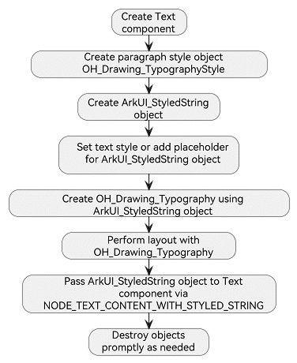
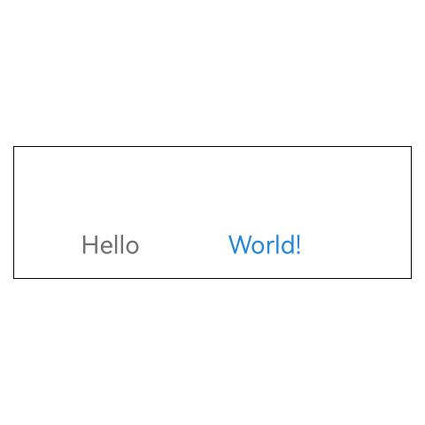

# Drawing and Displaying Text in Text Components
<!--Kit: ArkUI-->
<!--Subsystem: ArkUI-->
<!--Owner: @hddgzw-->
<!--Designer: @pssea-->
<!--Tester: @jiaoaozihao-->
<!--Adviser: @Brilliantry_Rui-->
Some frameworks or applications have their own text layout capabilities, which are integrated into the [ArkGraphics2D text engine](../graphics/complex-text-c.md) during porting. To avoid the need for redeveloping text components, the **Text** component provides the [NODE_TEXT_CONTENT_WITH_STYLED_STRING](../../application-dev/reference/apis-arkui/capi-native-node-h.md#arkui_nodeattributetype) API, which can directly render text generated by the Ark text engine.

The following, based on the [Integrating with ArkTS Pages](../ui/ndk-access-the-arkts-page.md) section, explains how to create text engine text and use the **Text** component for rendering and display.

> **NOTE**
>
> For APIs involving the font engine, add **target_link_libraries(entry PUBLIC libnative_drawing.so)** to **CMakeLists.txt**; otherwise, a linking error will occur.

The following figure shows the main process for using the **NODE_TEXT_CONTENT_WITH_STYLED_STRING** API.



## Creating a Text Component

Since text styles are set through font engine APIs, there is no need to configure style attributes such as text color and font size when creating a **Text** component. However, basic universal attributes such as width and height still need to be set. If they are unspecified, the component automatically adapts to the text content dimensions.
<!-- @[obtain_create_text](https://gitcode.com/openharmony/applications_app_samples/blob/master/code/DocsSample/ArkUISample/StyledStringNDK/entry/src/main/cpp/manager.cpp) -->

``` C++
ArkUI_NativeNodeAPI_1 *nodeApi = reinterpret_cast<ArkUI_NativeNodeAPI_1 *>(
    OH_ArkUI_QueryModuleInterfaceByName(ARKUI_NATIVE_NODE, "ArkUI_NativeNodeAPI_1"));
if (nodeApi == nullptr) {
    return;
}
// ···
// Create a Text component.
ArkUI_NodeHandle text = nodeApi->createNode(ARKUI_NODE_TEXT);
ArkUI_NumberValue textWidth[] = {{.f32 = 300}};
ArkUI_AttributeItem textWidthItem = {.value = textWidth, .size = 1};
nodeApi->setAttribute(text, NODE_WIDTH, &textWidthItem);
ArkUI_NumberValue textHeight[] = {{.f32 = 100}};
ArkUI_AttributeItem textHeightItem = {.value = textHeight, .size = 1};
nodeApi->setAttribute(text, NODE_HEIGHT, &textHeightItem);
```
## Setting Paragraph and Text Styles

- Setting the Paragraph Style

    The paragraph style defines the overall attributes of a paragraph of text, such as the maximum number of display lines and text direction. The following code example sets text centering and a maximum line limit of 10.
    
    > **NOTE**
    > 
    > The **OH_Drawing_** prefixed APIs are provided by the Ark text engine. For details, see [Simple Text Drawing and Display (C/C++)](../graphics/simple-text-c.md) and [Complex Text Drawing and Display (C/C++)](../graphics/complex-text-c.md).
    <!-- @[obtain_create_text_typographyStyle](https://gitcode.com/openharmony/applications_app_samples/blob/master/code/DocsSample/ArkUISample/StyledStringNDK/entry/src/main/cpp/manager.cpp) -->
    
    ``` C++
    OH_Drawing_TypographyStyle *typographyStyle = OH_Drawing_CreateTypographyStyle();
    OH_Drawing_SetTypographyTextAlign(typographyStyle, OH_Drawing_TextAlign::TEXT_ALIGN_CENTER);
    OH_Drawing_SetTypographyTextMaxLines(typographyStyle, NUM_10);
    ```
- Setting the Text Style

    Different text styles can be applied to different text segments, but must be set in the following sequence:

    1. [OH_ArkUI_StyledString_PushTextStyle](../reference/apis-arkui/capi-styled-string-h.md#oh_arkui_styledstring_pushtextstyle): pushes the text style to the stack.
    2. [OH_ArkUI_StyledString_AddText](../reference/apis-arkui/capi-styled-string-h.md#oh_arkui_styledstring_addtext): adds the text content to modify.
    3. [OH_ArkUI_StyledString_PopTextStyle](../reference/apis-arkui/capi-styled-string-h.md#oh_arkui_styledstring_poptextstyle): pops the text style from the stack.

    > **NOTE**
    > 
    > The **OH_ArkUI_StyledString_** prefixed APIs are provided by the **Text** component.
    >
    > The **OH_Drawing_** prefixed APIs are provided by the Ark text engine. For details, see [Drawing and Displaying Simple Text (C/C++)](../graphics/simple-text-c.md) and [Drawing and Displaying Complex Text (C/C++)](../graphics/complex-text-c.md).

    Use [OH_Drawing_CreateTextStyle](../reference/apis-arkgraphics2d/capi-drawing-text-typography-h.md#oh_drawing_createtextstyle) to create a text style. Set the font size of **"Hello"** to 28 px and the color to **0xFF707070**. Set the font size of **"World!"** to 28 px and the color to **0xFF2787D9**.
    <!-- @[obtain_create_text_styledString](https://gitcode.com/openharmony/applications_app_samples/blob/master/code/DocsSample/ArkUISample/StyledStringNDK/entry/src/main/cpp/manager.cpp) -->
    
    ``` C++
    ArkUI_StyledString *styledString = OH_ArkUI_StyledString_Create(typographyStyle, OH_Drawing_CreateFontCollection());
    // Create a text style and set the font and color.
    // [Start obtain_create_text_placeholder]
    OH_Drawing_TextStyle *textStyle = OH_Drawing_CreateTextStyle();
    OH_Drawing_SetTextStyleFontSize(textStyle, NUM_28);
    OH_Drawing_SetTextStyleColor(textStyle, OH_Drawing_ColorSetArgb(0xFF, 0x70, 0x70, 0x70));
    // Apply style sequence: push -> add -> pop.
    OH_ArkUI_StyledString_PushTextStyle(styledString, textStyle);
    OH_ArkUI_StyledString_AddText(styledString, "Hello");
    OH_ArkUI_StyledString_PopTextStyle(styledString);
    // ···
    // Apply different styles.
    OH_Drawing_TextStyle *worldTextStyle = OH_Drawing_CreateTextStyle();
    OH_Drawing_SetTextStyleFontSize(worldTextStyle, NUM_28);
    OH_Drawing_SetTextStyleColor(worldTextStyle, OH_Drawing_ColorSetArgb(0xFF, 0x27, 0x87, 0xD9));
    OH_ArkUI_StyledString_PushTextStyle(styledString, worldTextStyle);
    OH_ArkUI_StyledString_AddText(styledString, "World!");
    OH_ArkUI_StyledString_PopTextStyle(styledString);
    // [End obtain_create_text_placeholder]
    ```
## Adding a Placeholder
Placeholders reserve blank areas of specified sizes. While no text is drawn in these areas, they participate in layout measurement and affect text typesetting.
Line height is determined by the larger value between text height and placeholder height.

This example inserts a placeholder between "Hello" and "World!":
<!-- @[obtain_create_text_placeholder](https://gitcode.com/openharmony/applications_app_samples/blob/master/code/DocsSample/ArkUISample/StyledStringNDK/entry/src/main/cpp/manager.cpp) -->

``` C++
OH_Drawing_TextStyle *textStyle = OH_Drawing_CreateTextStyle();
OH_Drawing_SetTextStyleFontSize(textStyle, NUM_28);
OH_Drawing_SetTextStyleColor(textStyle, OH_Drawing_ColorSetArgb(0xFF, 0x70, 0x70, 0x70));
// Apply style sequence: push -> add -> pop.
OH_ArkUI_StyledString_PushTextStyle(styledString, textStyle);
OH_ArkUI_StyledString_AddText(styledString, "Hello");
OH_ArkUI_StyledString_PopTextStyle(styledString);
// [StartExclude obtain_create_text_styledString]
// Add a placeholder. No text is rendered in this area, but it reserves space for other components. You can mount Image components at placeholder positions to achieve mixed text and image layouts.
OH_Drawing_PlaceholderSpan placeHolder{.width = 100, .height = 100};
OH_ArkUI_StyledString_AddPlaceholder(styledString, &placeHolder);
// [EndExclude obtain_create_text_styledString]
// Apply different styles.
OH_Drawing_TextStyle *worldTextStyle = OH_Drawing_CreateTextStyle();
OH_Drawing_SetTextStyleFontSize(worldTextStyle, NUM_28);
OH_Drawing_SetTextStyleColor(worldTextStyle, OH_Drawing_ColorSetArgb(0xFF, 0x27, 0x87, 0xD9));
OH_ArkUI_StyledString_PushTextStyle(styledString, worldTextStyle);
OH_ArkUI_StyledString_AddText(styledString, "World!");
OH_ArkUI_StyledString_PopTextStyle(styledString);
```
## Implementing Text Layout and Drawing
- Text Layout

  After configuring text styles and content, call the font engine API [OH_Drawing_TypographyLayout](../reference/apis-arkgraphics2d/capi-drawing-text-typography-h.md#oh_drawing_typographylayout) to perform text layout, specifying the maximum width. Text will automatically wrap if it exceeds this width.
    
    > **NOTE**
    >
    > Text that has not been laid out is not displayed.

    <!-- @[obtain_create_text_typography](https://gitcode.com/openharmony/applications_app_samples/blob/master/code/DocsSample/ArkUISample/StyledStringNDK/entry/src/main/cpp/manager.cpp) -->
    
    ``` C++
    OH_Drawing_Typography *typography = OH_ArkUI_StyledString_CreateTypography(styledString);
    // Call the font engine layout method. The width must match the width of the Text component.
    // Layout width = Text component width - (Left padding + Right padding)
    OH_Drawing_TypographyLayout(typography, NUM_400);
    ```

- Text Drawing

    Text drawing is completed through interaction between the text engine and graphics, requiring no additional settings. The **Text** component will call the text engine drawing API when the component triggers drawing under the ArkUI rendering mechanism. Here, only the created **StyledString** object needs to be passed to the created **Text** component.
    <!-- @[obtain_create_text_attributeItem](https://gitcode.com/openharmony/applications_app_samples/blob/master/code/DocsSample/ArkUISample/StyledStringNDK/entry/src/main/cpp/manager.cpp) -->
    
    ``` C++
    ArkUI_AttributeItem styledStringItem = {.object = styledString};
    // After the layout is complete, pass the object to the Text component through NODE_TEXT_CONTENT_WITH_STYLED_STRING.
    nodeApi->setAttribute(text, NODE_TEXT_CONTENT_WITH_STYLED_STRING, &styledStringItem);
    ```

## Destroying an Object

The **Text** component does not manage the lifecycle of any objects involved in this process. You are responsible for this.  

The text engine APIs involved all have corresponding destruction methods.

**OH_Drawing_DestroyTextStyle(OH_Drawing_TextStyle *style)**: destroys the text style object.

**OH_Drawing_DestroyTypographyStyle(OH_Drawing_TypographyStyle *style)**: destroys the paragraph style object.

Releasing objects while the **Text** component is still displayed will cause rendering failures. Ensure that the **Text** component is no longer in use before releasing resources.

For details about the font engine cleanup APIs, see [OH_Drawing_DestroyTextStyle](../reference/apis-arkgraphics2d/capi-drawing-text-typography-h.md#oh_drawing_destroytextstyle) and [OH_Drawing_DestroyTypographyStyle](../reference/apis-arkgraphics2d/capi-drawing-text-typography-h.md#oh_drawing_destroytypographystyle).

The **Text** component provides [OH_ArkUI_StyledString_Destroy](../reference/apis-arkui/capi-styled-string-h.md#oh_arkui_styledstring_destroy) to destroy styled string objects.

## Sample
This section demonstrates core API usage only. For the complete sample project, see <!--RP1-->[StyledStringNDK](https://gitcode.com/openharmony/applications_app_samples/tree/master/code/DocsSample/ArkUISample/StyledStringNDK)<!--RP1End-->.

<!-- @[obtain_create_text_all](https://gitcode.com/openharmony/applications_app_samples/blob/master/code/DocsSample/ArkUISample/StyledStringNDK/entry/src/main/cpp/manager.cpp) -->

``` C++
#include "manager.h"
#include <sstream>
#include <arkui/native_interface.h>
#include <arkui/styled_string.h>
// ···
#include <native_drawing/drawing_font_collection.h>
#include <native_drawing/drawing_text_declaration.h>

namespace NativeNode::Manager {
constexpr int32_t NUM_10 = 10;
constexpr int32_t NUM_28 = 28;
constexpr int32_t NUM_400 = 400;
// ···
void NodeManager::CreateNativeNode()
{
    // ···
    // [Start obtain_create_text]
    ArkUI_NativeNodeAPI_1 *nodeApi = reinterpret_cast<ArkUI_NativeNodeAPI_1 *>(
        OH_ArkUI_QueryModuleInterfaceByName(ARKUI_NATIVE_NODE, "ArkUI_NativeNodeAPI_1"));
    if (nodeApi == nullptr) {
        return;
    }
    // [StartExclude obtain_create_text]
    // Create a Column container component.
    ArkUI_NodeHandle column = nodeApi->createNode(ARKUI_NODE_COLUMN);
    ArkUI_NumberValue colWidth[] = {{.f32 = 300}};
    ArkUI_AttributeItem widthItem = {.value = colWidth, .size = 1};
    nodeApi->setAttribute(column, NODE_WIDTH, &widthItem);
    // [EndExclude obtain_create_text]
    // Create a Text component.
    ArkUI_NodeHandle text = nodeApi->createNode(ARKUI_NODE_TEXT);
    ArkUI_NumberValue textWidth[] = {{.f32 = 300}};
    ArkUI_AttributeItem textWidthItem = {.value = textWidth, .size = 1};
    nodeApi->setAttribute(text, NODE_WIDTH, &textWidthItem);
    ArkUI_NumberValue textHeight[] = {{.f32 = 100}};
    ArkUI_AttributeItem textHeightItem = {.value = textHeight, .size = 1};
    nodeApi->setAttribute(text, NODE_HEIGHT, &textHeightItem);
    // [End obtain_create_text]
    ArkUI_NumberValue borderWidth[] = {{.f32 = 1}};
    ArkUI_AttributeItem borderWidthItem = {.value = borderWidth, .size = 1};
    nodeApi->setAttribute(text, NODE_BORDER_WIDTH, &borderWidthItem);
    
    // OH_Drawing_ prefixed APIs are provided by the font engine. typographyStyle represents paragraph style configuration.
    // [Start obtain_create_text_typographyStyle]
    OH_Drawing_TypographyStyle *typographyStyle = OH_Drawing_CreateTypographyStyle();
    OH_Drawing_SetTypographyTextAlign(typographyStyle, OH_Drawing_TextAlign::TEXT_ALIGN_CENTER);
    OH_Drawing_SetTypographyTextMaxLines(typographyStyle, NUM_10);
    // [End obtain_create_text_typographyStyle]
    // Create an ArkUI_StyledString object.
    // [Start obtain_create_text_styledString]
    ArkUI_StyledString *styledString = OH_ArkUI_StyledString_Create(typographyStyle, OH_Drawing_CreateFontCollection());
    // Create a text style and set the font and color.
    // [Start obtain_create_text_placeholder]
    OH_Drawing_TextStyle *textStyle = OH_Drawing_CreateTextStyle();
    OH_Drawing_SetTextStyleFontSize(textStyle, NUM_28);
    OH_Drawing_SetTextStyleColor(textStyle, OH_Drawing_ColorSetArgb(0xFF, 0x70, 0x70, 0x70));
    // Apply style sequence: push -> add -> pop.
    OH_ArkUI_StyledString_PushTextStyle(styledString, textStyle);
    OH_ArkUI_StyledString_AddText(styledString, "Hello");
    OH_ArkUI_StyledString_PopTextStyle(styledString);
    // [StartExclude obtain_create_text_styledString]
    // Add a placeholder. No text is rendered in this area, but it reserves space for other components. You can mount Image components at placeholder positions to achieve mixed text and image layouts.
    OH_Drawing_PlaceholderSpan placeHolder{.width = 100, .height = 100};
    OH_ArkUI_StyledString_AddPlaceholder(styledString, &placeHolder);
    // [EndExclude obtain_create_text_styledString]
    // Apply different styles.
    OH_Drawing_TextStyle *worldTextStyle = OH_Drawing_CreateTextStyle();
    OH_Drawing_SetTextStyleFontSize(worldTextStyle, NUM_28);
    OH_Drawing_SetTextStyleColor(worldTextStyle, OH_Drawing_ColorSetArgb(0xFF, 0x27, 0x87, 0xD9));
    OH_ArkUI_StyledString_PushTextStyle(styledString, worldTextStyle);
    OH_ArkUI_StyledString_AddText(styledString, "World!");
    OH_ArkUI_StyledString_PopTextStyle(styledString);
    // [End obtain_create_text_placeholder]
    // [End obtain_create_text_styledString]
    // Create Typography of the font engine based on the StyledString object. The Typography object contains the configured text and its style.
    // [Start obtain_create_text_typography]
    OH_Drawing_Typography *typography = OH_ArkUI_StyledString_CreateTypography(styledString);
    // Call the font engine layout method. The width must match the width of the Text component.
    // Layout width = Text component width - (Left padding + Right padding)
    OH_Drawing_TypographyLayout(typography, NUM_400);
    // [End obtain_create_text_typography]
    // [Start obtain_create_text_attributeItem]
    ArkUI_AttributeItem styledStringItem = {.object = styledString};
    // After the layout is complete, pass the object to the Text component through NODE_TEXT_CONTENT_WITH_STYLED_STRING.
    nodeApi->setAttribute(text, NODE_TEXT_CONTENT_WITH_STYLED_STRING, &styledStringItem);
    // [End obtain_create_text_attributeItem]

    // Release resources. The application can determine when to release resources.
    OH_ArkUI_StyledString_Destroy(styledString);
    // Add Text as a child component of Column.
    nodeApi->addChild(column, text);
    // Add Column as a child component of XComponent.
    OH_NativeXComponent_AttachNativeRootNode(xComponent_, column);
}
} // namespace NativeNode::Manager
```



