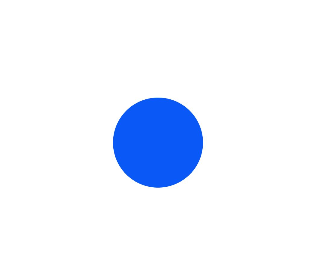
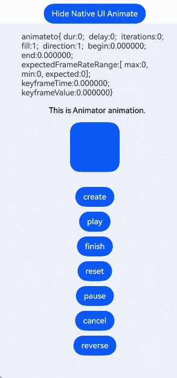

# Animation Development Guide

<!--Kit: ArkUI-->
<!--Subsystem: ArkUI-->
<!--Owner: @hehongyang3-->
<!--Designer: @hehongyang3-->
<!--Tester: @lxl007-->
<!--Adviser: @Brilliantry_Rui-->
<!-- md-trans-meta sourceCommit=087470085268b4c7968360a1498b1da15f27d467 translatedAt=2026-07-06T13:07:57.695Z pushedAt=2026-07-09T11:25:31.198Z -->

All examples in this document only provide the calling methods of core APIs. For the complete sample project, refer to <!--RP1-->[AnimationNDK](https://gitcode.com/openharmony/applications_app_samples/tree/master/code/DocsSample/ArkUISample/AnimationNDK)<!--RP1End-->.

## Using Property Animation

This example mainly demonstrates how to add a property animation through the global [animateTo](../reference/apis-arkui/capi-arkui-nativemodule-arkui-nativeanimateapi-1.md#animateto) API. For the complete workflow of mounting a UI developed with NDK APIs to the ArkTS main page, refer to [Integrating with ArkTS Pages](ndk-access-the-arkts-page.md).

> **NOTE**
>
> - The animation property changes to be executed must be written in the callback of [ArkUI_ContextCallback](../reference/apis-arkui/capi-arkui-nativemodule-arkui-contextcallback.md).
> 
> - The animation properties to be executed must have been set before the animation is performed.

1. Create a [NodeContent](../reference/apis-arkui/js-apis-arkui-NodeContent.md) in the **.ets** file and pass the **NodeContent** as a parameter to the native method.

   <!-- @[get_content](https://gitcode.com/openharmony/applications_app_samples/blob/master/code/DocsSample/ArkUISample/AnimationNDK/entry/src/main/ets/pages/UseFrameAnimation.ets) -->

   ``` TypeScript
   // Initialize the NodeContent object.
   private rootSlot = new NodeContent();
   @State @Watch('changeNativeFlag') showNative: boolean = false;
   // ...
   changeNativeFlag(): void {
     // ...
     if (this.showNative) {
       // Pass the NodeContent object for mounting and displaying components created by Native
       nativeNode?.createNativeRoot(this.rootSlot);
     } else {
       // ...
     }
   }
   ```

2. Parse the **NodeContent** and convert it to an [ArkUI_NodeContentHandle](../reference/apis-arkui/capi-arkui-nativemodule-arkui-nodecontent8h.md) object in C.

   <!-- @[get_context](https://gitcode.com/openharmony/applications_app_samples/blob/master/code/DocsSample/ArkUISample/AnimationNDK/entry/src/main/cpp/NativeEntry.cpp) -->

   ``` C++
   // Get NodeContent.
   ArkUI_NodeContentHandle contentHandle;
   OH_ArkUI_GetNodeContentFromNapiValue(env, args[0], &contentHandle);
   ```

3. Obtain the [ArkUI_NativeAnimateAPI_1](../reference/apis-arkui/capi-arkui-nativemodule-arkui-nativeanimateapi-1.md) object.

   <!-- @[get_Api](https://gitcode.com/openharmony/applications_app_samples/blob/master/code/DocsSample/ArkUISample/AnimationNDK/entry/src/main/cpp/ArkUIAnimate.h) -->

   ``` C
   // Obtain the ArkUI_NativeAnimateAPI_1 API.
   ArkUI_NativeAnimateAPI_1 *animateApi = nullptr;
   OH_ArkUI_GetModuleInterface(ARKUI_NATIVE_ANIMATE, ArkUI_NativeAnimateAPI_1, animateApi);
   ```

4. Set the [ArkUI_AnimateOption](../reference/apis-arkui/capi-arkui-nativemodule-arkui-animateoption.md) parameters, and configure the corresponding parameters using the provided C methods.

   <!-- @[set_option](https://gitcode.com/openharmony/applications_app_samples/blob/master/code/DocsSample/ArkUISample/AnimationNDK/entry/src/main/cpp/ArkUIAnimate.h) -->

   ``` C
   // Set the animation parameters.
   ArkUI_AnimateOption *option = OH_ArkUI_AnimateOption_Create();
   OH_ArkUI_AnimateOption_SetDuration(option, NUM_2000); // NUM_2000 = 2000
   OH_ArkUI_AnimateOption_SetTempo(option, 1.1);
   OH_ArkUI_AnimateOption_SetCurve(option, ARKUI_CURVE_EASE);
   ArkUI_CurveHandle cubicBezierCurve = OH_ArkUI_Curve_CreateCubicBezierCurve(0.5f, 4.0f, 1.2f, 0.0f);
   // Set the animation curve for the animation, which takes precedence over OH_ArkUI_AnimateOption_SetCurve
   OH_ArkUI_AnimateOption_SetICurve(option, cubicBezierCurve);
   OH_ArkUI_AnimateOption_SetDelay(option, NUM_20); // NUM_20 = 20
   OH_ArkUI_AnimateOption_SetIterations(option, NUM_1); // NUM_1 = 1
   OH_ArkUI_AnimateOption_SetPlayMode(option, ARKUI_ANIMATION_PLAY_MODE_REVERSE);
   ArkUI_ExpectedFrameRateRange *range = new ArkUI_ExpectedFrameRateRange;
   range->min = NUM_10; // NUM_10 = 10
   range->max = NUM_120; // NUM_120 = 120
   range->expected = NUM_60; // NUM_60 = 60
   OH_ArkUI_AnimateOption_SetExpectedFrameRateRange(option, range);
   ```

5. Set the callback parameters.

   <!-- @[set_callback](https://gitcode.com/openharmony/applications_app_samples/blob/master/code/DocsSample/ArkUISample/AnimationNDK/entry/src/main/cpp/ArkUIAnimate.h) -->

   ``` C
   // Set the completion callback.
   ArkUI_AnimateCompleteCallback *completeCallback = new ArkUI_AnimateCompleteCallback;
   completeCallback->type = ARKUI_FINISH_CALLBACK_REMOVED;
   // The struct AnimateData contains ArkUI_AnimateOption* option and ArkUI_CurveHandle curve.
   AnimateData* data = new AnimateData();
   data->option = option;
   data->curve = cubicBezierCurve;
   completeCallback->userData = reinterpret_cast<void*>(data);
   completeCallback->callback = [](void *userData) {
       AnimateData* data = reinterpret_cast<AnimateData*>(userData);
       if (data) {
           ArkUI_AnimateOption* option = data->option;
           ArkUI_CurveHandle curve = data->curve;
           if (option) {
               OH_ArkUI_AnimateOption_Dispose(option);
               OH_LOG_Print(LOG_APP, LOG_ERROR, LOG_PRINT_DOMAIN,
                   "Init", "CXX OH_ArkUI_AnimateOption_Dispose  success!");
           }
           if (curve) {
               OH_ArkUI_Curve_DisposeCurve(curve);
               OH_LOG_Print(LOG_APP, LOG_ERROR, LOG_PRINT_DOMAIN,
                   "Init", "CXX OH_ArkUI_Curve_DisposeCurve  success!");
           }
           delete data; // Release the struct.
       }
   };
               
   // Set the closure function.
   static bool isback = true;
   ArkUI_ContextCallback *update = new ArkUI_ContextCallback;
   update->callback = [](void *user) {
       // Corresponding attribute changes: width and height
       if (isback) {
           g_animateto_button->SetWidth(NUM_200); // NUM_200 = 200
           g_animateto_button->SetHeight(NUM_80); // NUM_80 = 80
           g_animateto_button->SetBackgroundColor(0xFFA280FF);
       } else {
           g_animateto_button->SetWidth(NUM_100); // NUM_100 = 100
           g_animateto_button->SetHeight(NUM_40); // NUM_40 = 40
           g_animateto_button->SetBackgroundColor(0xFFFF2E77);
       }
       isback = !isback;
   };
   // Execute the corresponding animation.
   animateApi->animateTo(context, option, update, completeCallback);
   ```

   

## Component Appearance/Disappearance Transition

This example primarily demonstrates how to set transition parameters using the **NODE_ROTATE_TRANSITION**, **NODE_SCALE_TRANSITION**, and **NODE_TRANSLATE_TRANSITION** attributes in [ArkUI_NodeAttributeType](../reference/apis-arkui/capi-native-node-h.md#arkui_nodeattributetype), and how to set the center point coordinates for the **NODE_SCALE_TRANSITION** and **NODE_ROTATE_TRANSITION** effects using the **NODE_TRANSFORM_CENTER** attribute in [ArkUI_NodeAttributeType](../reference/apis-arkui/capi-native-node-h.md#arkui_nodeattributetype), thereby implementing transition effects when components are inserted and deleted.

1. Create an interactive UI that includes a **Button** component. Tapping it controls the addition and removal of transition nodes. For details on obtaining and using nodes of the [ArkUI_NodeContentHandle](../reference/apis-arkui/capi-arkui-nativemodule-arkui-nodecontent8h.md) type, see [Integrating with ArkTS Pages](ndk-access-the-arkts-page.md).

   <!-- @[main_view_method](https://gitcode.com/openharmony/applications_app_samples/blob/master/code/DocsSample/ArkUISample/AnimationNDK/entry/src/main/cpp/ArkUITransition.h) -->

   ``` C
   constexpr int32_t BUTTON_CLICK_ID = 1;
   constexpr int32_t STACK_CLICK_ID = 2;
   bool g_flag = false;
   bool t_flag = false;
   ArkUI_NodeHandle parentNode;
   ArkUI_NodeHandle childNode;
   ArkUI_NodeHandle ContainerNode;
   ArkUI_NodeHandle firstImageNode;
   ArkUI_NodeHandle secondImageNode;
   ArkUI_NodeHandle buttonNode;
   // ...
   void mainViewMethod(ArkUI_NodeContentHandle handle)
   {
       ArkUI_NativeNodeAPI_1 *nodeAPI = reinterpret_cast<ArkUI_NativeNodeAPI_1 *>(
           OH_ArkUI_QueryModuleInterfaceByName(ARKUI_NATIVE_NODE, "ArkUI_NativeNodeAPI_1"));
       ArkUI_NodeHandle columnMain = nodeAPI->createNode(ARKUI_NODE_COLUMN);
       ArkUI_NumberValue columnMainWidthValue[] = {{.f32 = 500}};
       ArkUI_AttributeItem columnMainWidthItem = {.value = columnMainWidthValue,
                                                  .size = sizeof(columnMainWidthValue) / sizeof(ArkUI_NumberValue)};
       nodeAPI->setAttribute(columnMain, NODE_WIDTH, &columnMainWidthItem);
       ArkUI_NumberValue columnMainHeightValue[] = {{.f32 = 800}};
       ArkUI_AttributeItem columnMainHeightItem = {.value = columnMainHeightValue,
                                                   .size = sizeof(columnMainHeightValue) / sizeof(ArkUI_NumberValue)};
       nodeAPI->setAttribute(columnMain, NODE_HEIGHT, &columnMainHeightItem);
   
       ArkUI_NodeHandle column = nodeAPI->createNode(ARKUI_NODE_COLUMN);
       ArkUI_NumberValue widthValue[] = {{.f32 = 500}};
       ArkUI_AttributeItem widthItem = {.value = widthValue, .size = sizeof(widthValue) / sizeof(ArkUI_NumberValue)};
       nodeAPI->setAttribute(column, NODE_WIDTH, &widthItem);
       ArkUI_NumberValue heightValue[] = {{.f32 = 400}};
       ArkUI_AttributeItem heightItem = {.value = heightValue, .size = sizeof(heightValue) / sizeof(ArkUI_NumberValue)};
       nodeAPI->setAttribute(column, NODE_HEIGHT, &heightItem);
       ArkUI_NodeHandle buttonShow = nodeAPI->createNode(ARKUI_NODE_BUTTON);
       ArkUI_NumberValue buttonWidthValue[] = {{.f32 = 200}};
       ArkUI_AttributeItem buttonWidthItem = {.value = buttonWidthValue,
                                              .size = sizeof(buttonWidthValue) / sizeof(ArkUI_NumberValue)};
       nodeAPI->setAttribute(buttonShow, NODE_WIDTH, &buttonWidthItem);
       ArkUI_NumberValue buttonHeightValue[] = {{.f32 = 50}};
       ArkUI_AttributeItem buttonHeightItem = {.value = buttonHeightValue,
                                               .size = sizeof(buttonHeightValue) / sizeof(ArkUI_NumberValue)};
       nodeAPI->setAttribute(buttonShow, NODE_HEIGHT, &buttonHeightItem);
       ArkUI_AttributeItem labelItem = {.string = "show"};
       nodeAPI->setAttribute(buttonShow, NODE_BUTTON_LABEL, &labelItem);
       ArkUI_NumberValue buttonOpenTypeValue[] = {{.i32 = static_cast<int32_t>(ARKUI_BUTTON_TYPE_NORMAL)}};
       ArkUI_AttributeItem buttonOpenTypeItem = {.value = buttonOpenTypeValue,
                                                 .size = sizeof(buttonOpenTypeValue) / sizeof(ArkUI_NumberValue)};
       nodeAPI->setAttribute(buttonShow, NODE_BUTTON_TYPE, &buttonOpenTypeItem);
       ArkUI_NumberValue buttonShowMarginValue[] = {{.f32 = 20}};
       ArkUI_AttributeItem buttonShowMarginItem = {.value = buttonShowMarginValue,
                                                   .size = sizeof(buttonShowMarginValue) / sizeof(ArkUI_NumberValue)};
       nodeAPI->setAttribute(buttonShow, NODE_MARGIN, &buttonShowMarginItem);
       nodeAPI->registerNodeEvent(buttonShow, NODE_ON_CLICK, BUTTON_CLICK_ID, nullptr);
       nodeAPI->addNodeEventReceiver(buttonShow, OnButtonShowClicked);
       // ...
       parentNode = column;
       buttonNode = buttonShow;
       nodeAPI->addChild(columnMain, column);
       nodeAPI->addChild(column, buttonShow);
       // ...
       OH_ArkUI_NodeContent_AddNode(handle, columnMain);
   }
   ```

2. Create a node with the **NODE_ROTATE_TRANSITION** and **NODE_SCALE_TRANSITION** attributes from [ArkUI_NodeAttributeType](../reference/apis-arkui/capi-native-node-h.md#arkui_nodeattributetype) set. A transition animation is played when the target node is attached to or detached from the node tree.

   <!-- @[create_child_node](https://gitcode.com/openharmony/applications_app_samples/blob/master/code/DocsSample/ArkUISample/AnimationNDK/entry/src/main/cpp/ArkUITransition.h) -->

   ``` C
   ArkUI_NodeHandle CreateChildNode()
   {
       ArkUI_NativeNodeAPI_1 *nodeAPI = reinterpret_cast<ArkUI_NativeNodeAPI_1 *>(
           OH_ArkUI_QueryModuleInterfaceByName(ARKUI_NATIVE_NODE, "ArkUI_NativeNodeAPI_1"));
       ArkUI_NodeHandle image = nodeAPI->createNode(ARKUI_NODE_IMAGE);
       ArkUI_AttributeItem imageSrcItem = {.string = "/pages/common/scenery.jpg"};
       nodeAPI->setAttribute(image, NODE_IMAGE_SRC, &imageSrcItem);
       ArkUI_NumberValue textWidthValue[] = {{.f32 = 300}};
       ArkUI_AttributeItem textWidthItem = {.value = textWidthValue,
                                            .size = sizeof(textWidthValue) / sizeof(ArkUI_NumberValue)};
       nodeAPI->setAttribute(image, NODE_WIDTH, &textWidthItem);
       ArkUI_NumberValue textHeightValue[] = {{.f32 = 300}};
       ArkUI_AttributeItem textHeightItem = {.value = textHeightValue,
                                             .size = sizeof(textWidthValue) / sizeof(ArkUI_NumberValue)};
       nodeAPI->setAttribute(image, NODE_HEIGHT, &textHeightItem);
       ArkUI_NumberValue transformCenterValue[] = {0.0f, 0.0f, 0.0f, 0.5f, 0.5f};
       ArkUI_AttributeItem transformCenterItem = {.value = transformCenterValue,
                                                  .size = sizeof(transformCenterValue) / sizeof(ArkUI_NumberValue)};
       nodeAPI->setAttribute(image, NODE_TRANSFORM_CENTER, &transformCenterItem);
       ArkUI_NumberValue rotateAnimationValue[] = {
           0.0f, 0.0f, 1.0f, 360.0f, 0.0f, {.i32 = 500}, {.i32 = static_cast<int32_t>(ARKUI_CURVE_SHARP)}};
       ArkUI_AttributeItem rotateAnimationItem = {.value = rotateAnimationValue,
                                                  .size = sizeof(rotateAnimationValue) / sizeof(ArkUI_NumberValue)};
       nodeAPI->setAttribute(image, NODE_ROTATE_TRANSITION, &rotateAnimationItem);
       ArkUI_NumberValue scaleAnimationValue[] = {
           0.0f, 0.0f, 0.0f, {.i32 = 500}, {.i32 = static_cast<int32_t>(ARKUI_CURVE_SHARP)}};
       ArkUI_AttributeItem scaleAnimationItem = {.value = scaleAnimationValue,
                                                 .size = sizeof(scaleAnimationValue) / sizeof(ArkUI_NumberValue)};
       nodeAPI->setAttribute(image, NODE_SCALE_TRANSITION, &scaleAnimationItem);
       ArkUI_NumberValue translateAnimationValue[] = {
           200, 200, 0.0f, {.i32 = 500}, {.i32 = static_cast<int32_t>(ARKUI_CURVE_SHARP)}};
       ArkUI_AttributeItem translateAnimationItem = {.value = translateAnimationValue,
                                                     .size = sizeof(translateAnimationValue) / sizeof(ArkUI_NumberValue)};
       nodeAPI->setAttribute(image, NODE_TRANSLATE_TRANSITION, &translateAnimationItem);
       return image;
   }
   ```

3. Add the logic for attaching and detaching transition nodes in the **Button**'s listener callback to control the entry and exit of the transition nodes.

   <!-- @[button_show](https://gitcode.com/openharmony/applications_app_samples/blob/master/code/DocsSample/ArkUISample/AnimationNDK/entry/src/main/cpp/ArkUITransition.h) -->

   ``` C
   void OnButtonShowClicked(ArkUI_NodeEvent *event)
   {
       if (!event) {
           return;
       }
       if (!childNode) {
           childNode = CreateChildNode();
       }
       ArkUI_NativeNodeAPI_1 *nodeAPI = reinterpret_cast<ArkUI_NativeNodeAPI_1 *>(
           OH_ArkUI_QueryModuleInterfaceByName(ARKUI_NATIVE_NODE, "ArkUI_NativeNodeAPI_1"));
       if (g_flag) {
           g_flag = false;
           ArkUI_AttributeItem labelItem = {.string = "show"};
           nodeAPI->setAttribute(buttonNode, NODE_BUTTON_LABEL, &labelItem);
           nodeAPI->removeChild(parentNode, childNode);
       } else {
           g_flag = true;
           ArkUI_AttributeItem labelItem = {.string = "hide"};
           nodeAPI->setAttribute(buttonNode, NODE_BUTTON_LABEL, &labelItem);
           nodeAPI->addChild(parentNode, childNode);
       }
   }
   ```

   

## Shared Element Transition

This example demonstrates how to implement a shared element transition using the **NODE_GEOMETRY_TRANSITION** attribute in [ArkUI_NodeAttributeType](../reference/apis-arkui/capi-native-node-h.md#arkui_nodeattributetype). For the complete workflow of mounting a UI developed with NDK APIs to an ArkTS main page, refer to [Integrating with ArkTS Pages](ndk-access-the-arkts-page.md).

1. Create an image node with the **NODE_GEOMETRY_TRANSITION** attribute in [ArkUI_NodeAttributeType](../reference/apis-arkui/capi-native-node-h.md#arkui_nodeattributetype) set. Also set the width, height, and position of this node to distinguish it from another image node. Then mount the current image node to a parent node, which is a stack in this example.

   <!-- @[imageTransition_view_method](https://gitcode.com/openharmony/applications_app_samples/blob/master/code/DocsSample/ArkUISample/AnimationNDK/entry/src/main/cpp/ArkUITransition.h) -->

   ``` C
   void imageTransitionViewMethod()
   {
       ArkUI_NativeNodeAPI_1 *nodeAPI = reinterpret_cast<ArkUI_NativeNodeAPI_1 *>(
           OH_ArkUI_QueryModuleInterfaceByName(ARKUI_NATIVE_NODE, "ArkUI_NativeNodeAPI_1"));
       ArkUI_NodeHandle stack = nodeAPI->createNode(ARKUI_NODE_STACK);
       ArkUI_NumberValue stackWidthValue[] = {{.f32 = NUM_500}};
       ArkUI_AttributeItem stackWidthItem = {.value = stackWidthValue,
                                             .size = sizeof(stackWidthValue) / sizeof(ArkUI_NumberValue)};
       nodeAPI->setAttribute(stack, NODE_WIDTH, &stackWidthItem);
       ArkUI_NumberValue stackHeightValue[] = {{.f32 = NUM_500}};
       ArkUI_AttributeItem stackHeightItem = {.value = stackHeightValue,
                                              .size = sizeof(stackHeightValue) / sizeof(ArkUI_NumberValue)};
       nodeAPI->setAttribute(stack, NODE_HEIGHT, &stackHeightItem);
       nodeAPI->registerNodeEvent(stack, NODE_ON_CLICK, STACK_CLICK_ID, nullptr);
       nodeAPI->addNodeEventReceiver(stack, OnImageTransitionClicked);
       ArkUI_NodeHandle firstImage = nodeAPI->createNode(ARKUI_NODE_IMAGE);
       ArkUI_AttributeItem imageSrcItem = {.string = "/pages/common/scenery.jpg"};
       nodeAPI->setAttribute(firstImage, NODE_IMAGE_SRC, &imageSrcItem);
       ArkUI_NumberValue textWidthValue[] = {{.f32 = 50}};
       ArkUI_AttributeItem textWidthItem = {.value = textWidthValue,
                                            .size = sizeof(textWidthValue) / sizeof(ArkUI_NumberValue)};
       nodeAPI->setAttribute(firstImage, NODE_WIDTH, &textWidthItem);
       ArkUI_NumberValue textHeightValue[] = {{.f32 = 50}};
       ArkUI_AttributeItem textHeightItem = {.value = textHeightValue,
                                             .size = sizeof(textWidthValue) / sizeof(ArkUI_NumberValue)};
       nodeAPI->setAttribute(firstImage, NODE_HEIGHT, &textHeightItem);
       ArkUI_NumberValue borderRadiusValue[] = {{.f32 = 25}};
       ArkUI_AttributeItem borderRadiusItem = {.value = borderRadiusValue,
                                               .size = sizeof(borderRadiusValue) / sizeof(ArkUI_NumberValue)};
       nodeAPI->setAttribute(firstImage, NODE_BORDER_RADIUS, &borderRadiusItem);
       ArkUI_NumberValue clipValue1[] = {{.i32 = true}};
       ArkUI_AttributeItem clipValue = {clipValue1, 1};
       nodeAPI->setAttribute(firstImage, NODE_CLIP, &clipValue);
       ArkUI_AnimateOption *option = OH_ArkUI_AnimateOption_Create();
       auto opacityTransitionEffect = OH_ArkUI_CreateOpacityTransitionEffect(0.8);
       OH_ArkUI_TransitionEffect_SetAnimation(opacityTransitionEffect, option);
       ArkUI_AttributeItem transitionItem = {.object = opacityTransitionEffect};
       nodeAPI->setAttribute(firstImage, NODE_TRANSITION, &transitionItem);
       ArkUI_AttributeItem geometryTransitionItem = {.string = "TransitionPicture"};
       nodeAPI->setAttribute(firstImage, NODE_GEOMETRY_TRANSITION, &geometryTransitionItem);
       ArkUI_NumberValue positionValue1[] = {{.f32 = 70}, {.f32 = 50}};
       ArkUI_AttributeItem positionValue_item1 = {positionValue1, 2};
       nodeAPI->setAttribute(firstImage, NODE_POSITION, &positionValue_item1);
       ArkUI_AttributeItem item1 = {.string = "firstImage"};
       nodeAPI->setAttribute(firstImage, NODE_ID, &item1);
       ContainerNode = stack;
       firstImageNode = firstImage;
   }
   ```

2. Create another image node with the **NODE_GEOMETRY_TRANSITION** attribute in [ArkUI_NodeAttributeType](../reference/apis-arkui/capi-native-node-h.md#arkui_nodeattributetype) set, using the same attribute value as the first image node. Set different width, height, and position for this node.

   <!-- @[create_Image_node](https://gitcode.com/openharmony/applications_app_samples/blob/master/code/DocsSample/ArkUISample/AnimationNDK/entry/src/main/cpp/ArkUITransition.h) -->

   ``` C
   ArkUI_NodeHandle CreateImageNode()
   {
       ArkUI_NativeNodeAPI_1 *nodeAPI = reinterpret_cast<ArkUI_NativeNodeAPI_1 *>(
           OH_ArkUI_QueryModuleInterfaceByName(ARKUI_NATIVE_NODE, "ArkUI_NativeNodeAPI_1"));
       ArkUI_NodeHandle secondImage = nodeAPI->createNode(ARKUI_NODE_IMAGE);
       ArkUI_AttributeItem imageSrcItem = {.string = "/pages/common/sky.jpg"};
       nodeAPI->setAttribute(secondImage, NODE_IMAGE_SRC, &imageSrcItem);
       ArkUI_NumberValue textWidthValue[] = {{.f32 = 200}};
       ArkUI_AttributeItem textWidthItem = {.value = textWidthValue,
                                            .size = sizeof(textWidthValue) / sizeof(ArkUI_NumberValue)};
       nodeAPI->setAttribute(secondImage, NODE_WIDTH, &textWidthItem);
       ArkUI_NumberValue textHeightValue[] = {{.f32 = 200}};
       ArkUI_AttributeItem textHeightItem = {.value = textHeightValue,
                                             .size = sizeof(textWidthValue) / sizeof(ArkUI_NumberValue)};
       nodeAPI->setAttribute(secondImage, NODE_HEIGHT, &textHeightItem);
       ArkUI_NumberValue borderRadiusValue[] = {{.f32 = 50}};
       ArkUI_AttributeItem borderRadiusItem = {.value = borderRadiusValue,
                                               .size = sizeof(borderRadiusValue) / sizeof(ArkUI_NumberValue)};
       nodeAPI->setAttribute(secondImage, NODE_BORDER_RADIUS, &borderRadiusItem);
       ArkUI_NumberValue clipValue1[] = {{.i32 = true}};
       ArkUI_AttributeItem clipValue = {clipValue1, 1};
       nodeAPI->setAttribute(secondImage, NODE_CLIP, &clipValue);
       ArkUI_AttributeItem item2 = {.string = "secondImage"};
       nodeAPI->setAttribute(secondImage, NODE_ID, &item2);
   
       ArkUI_AnimateOption *option = OH_ArkUI_AnimateOption_Create();
       auto opacityTransitionEffect = OH_ArkUI_CreateOpacityTransitionEffect(0.8);
       OH_ArkUI_TransitionEffect_SetAnimation(opacityTransitionEffect, option);
       ArkUI_AttributeItem transitionItem = {.object = opacityTransitionEffect};
       nodeAPI->setAttribute(secondImage, NODE_TRANSITION, &transitionItem);
   
       ArkUI_NumberValue positionValue1[] = {{.f32 = 225}, {.f32 = 0}};
       ArkUI_AttributeItem positionValue_item1 = {positionValue1, 2};
       nodeAPI->setAttribute(secondImage, NODE_POSITION, &positionValue_item1);
       return secondImage;
   }
   ```

3. In the **OnImageTransitionClicked** listener callback of the stack, add the logic for adding and removing the two nodes to control their attachment and detachment, ensuring that only one node exists at a time. When one node is mounted to the parent node, reset the **NODE_GEOMETRY_TRANSITION** attribute in [ArkUI_NodeAttributeType](../reference/apis-arkui/capi-native-node-h.md#arkui_nodeattributetype) and then set it back to its original value.

   <!-- @[imageTransition_show](https://gitcode.com/openharmony/applications_app_samples/blob/master/code/DocsSample/ArkUISample/AnimationNDK/entry/src/main/cpp/ArkUITransition.h) -->

   ``` C
   void OnImageTransitionClicked(ArkUI_NodeEvent *event)
   {
       if (!event) {
           return;
       }
       if (!secondImageNode) {
           secondImageNode = CreateImageNode();
       }
       static ArkUI_ContextHandle context = nullptr;
       context = OH_ArkUI_GetContextByNode(ContainerNode);
   
       ArkUI_NativeAnimateAPI_1 *animateApi = nullptr;
       OH_ArkUI_GetModuleInterface(ARKUI_NATIVE_ANIMATE, ArkUI_NativeAnimateAPI_1, animateApi);
       static ArkUI_AnimateOption *option = OH_ArkUI_AnimateOption_Create();
       OH_ArkUI_AnimateOption_SetDuration(option, NUM_300);
       OH_ArkUI_AnimateOption_SetCurve(option, ARKUI_CURVE_EASE_IN_OUT);
       ArkUI_AnimateCompleteCallback *completeCallback = new ArkUI_AnimateCompleteCallback;
       completeCallback->type = ARKUI_FINISH_CALLBACK_REMOVED;
       completeCallback->callback = [](void *userData) {
       };
       ArkUI_ContextCallback *update = new ArkUI_ContextCallback;
   
       update->callback = [](void *user) {
           ArkUI_NativeNodeAPI_1 *nodeAPI = reinterpret_cast<ArkUI_NativeNodeAPI_1 *>(
               OH_ArkUI_QueryModuleInterfaceByName(ARKUI_NATIVE_NODE, "ArkUI_NativeNodeAPI_1"));
           if (t_flag) {
               t_flag = false;
               nodeAPI->resetAttribute(firstImageNode, NODE_GEOMETRY_TRANSITION);
               ArkUI_AttributeItem geometryTransitionItem = {.string = "TransitionPicture"};
               nodeAPI->setAttribute(firstImageNode, NODE_GEOMETRY_TRANSITION, &geometryTransitionItem);
               nodeAPI->addChild(ContainerNode, firstImageNode);
               nodeAPI->removeChild(ContainerNode, secondImageNode);
           } else {
               t_flag = true;
               nodeAPI->resetAttribute(secondImageNode, NODE_GEOMETRY_TRANSITION);
               ArkUI_AttributeItem geometryTransitionItem = {.string = "TransitionPicture"};
               nodeAPI->setAttribute(secondImageNode, NODE_GEOMETRY_TRANSITION, &geometryTransitionItem);
               nodeAPI->addChild(ContainerNode, secondImageNode);
               nodeAPI->removeChild(ContainerNode, firstImageNode);
           }
       };
       animateApi->animateTo(context, option, update, completeCallback);
       delete completeCallback;
       delete update;
   }
   ```

   

## Using Keyframe Animation

This example mainly demonstrates how to set keyframe animation through [keyframeAnimateTo](../reference/apis-arkui/capi-arkui-nativemodule-arkui-nativeanimateapi-1.md#keyframeanimateto). For the complete workflow of mounting a UI developed with NDK APIs to the ArkTS main page, refer to [Integrating with ArkTS Pages](ndk-access-the-arkts-page.md).

   <!-- @[get_keyframeAnimateTo](https://gitcode.com/openharmony/applications_app_samples/blob/master/code/DocsSample/ArkUISample/AnimationNDK/entry/src/main/cpp/ArkUIAnimate.h) -->

   ``` C
   // ArkUIColumnNode is a node type encapsulated within the project.
   auto column = std::make_shared<ArkUIColumnNode>();
   // Set the width to 300: NUM_300 = 300
   column->SetWidth(NUM_300);
   // Set the height to 250: NUM_250 = 250
   column->SetHeight(NUM_250);
   // Create a text node with the content area displaying "This is a keyframe animation"
   auto textNode = std::make_shared<ArkUITextNode>();
   textNode->SetTextContent("This is a keyframe animation");
   // Set the width to 120, NUM_120 = 120
   textNode->SetWidth(NUM_120);
   // Set the height to 120, NUM_120 = 120
   textNode->SetHeight(NUM_50);
   // Create a Button. The keyframe animation created subsequently will act on the Button component.
   auto button = std::make_shared<ArkUIButtonNode>();
   // Set the initial width and height of the button: NUM_100 = 100
   button->SetWidth(NUM_100);
   button->SetHeight(NUM_100);
   // Store the button global variable, which is needed when registering onTouch.
   g_keyframe_button = button;
   // Register the click event on the button: NUM_1 = 1
   button->RegisterNodeEvent(button->GetHandle(), NODE_ON_CLICK, NUM_1, nullptr);
   g_keyframe_text = std::make_shared<ArkUITextNode>();
   // This function is used to encapsulate the function of printing Animateto parameter values in the Text component. Users can encapsulate it as needed.
   g_keyframe_text->KeyframeAnimatetoToString();
   auto onTouch = [](ArkUI_NodeEvent *event) {
       // Trigger this logic when the button is clicked: NUM_1 = 1
       if (OH_ArkUI_NodeEvent_GetTargetId(event) == NUM_1) {
           // Get the context object.
           ArkUI_ContextHandle context = nullptr;
           // std::shared_ptr<ArkUIButtonNode> g_keyframe_button stores the global variable of the Button, which is needed when registering onTouch.
           context = OH_ArkUI_GetContextByNode(g_keyframe_button->GetHandle());
           // Get the ArkUI_NativeAnimateAPI_1 interface
           ArkUI_NativeAnimateAPI_1 *animateApi = nullptr;
           OH_ArkUI_GetModuleInterface(ARKUI_NATIVE_ANIMATE, ArkUI_NativeAnimateAPI_1, animateApi);
               
           // The following code is the key workflow for creating a keyframe animation, including setting keyframe animation parameters and starting the keyframe animation
           // Set the ArkUI_KeyframeAnimateOption parameters, and configure the corresponding parameters through the provided C methods
           // Number of keyframe animation states, NUM_2 = 2, NUM_500 = 500
           ArkUI_KeyframeAnimateOption *option =  OH_ArkUI_KeyframeAnimateOption_Create(NUM_2);
           OH_ArkUI_KeyframeAnimateOption_SetDelay(option, NUM_500);
           // Duration of the first keyframe animation, NUM_1000 = 1000, NUM_0 = 0
           OH_ArkUI_KeyframeAnimateOption_SetDuration(option, NUM_1000, NUM_0);
           // Duration of the second keyframe animation, NUM_2000 = 2000, NUM_1 = 1
           OH_ArkUI_KeyframeAnimateOption_SetDuration(option, NUM_2000, NUM_1);
           // Number of keyframe animation playbacks, NUM_5 = 5
           OH_ArkUI_KeyframeAnimateOption_SetIterations(option, NUM_5);
           ArkUI_CurveHandle curve = OH_ArkUI_Curve_CreateCubicBezierCurve(0.5f, 4.0f, 1.2f, 0.0f);
           // The following four curves need to be selected based on actual business requirements
           ArkUI_CurveHandle springCurve = OH_ArkUI_Curve_CreateSpringCurve(0.5f, 4.0f, 1.2f, 0.0f);
           ArkUI_CurveHandle springMotionCurve = OH_ArkUI_Curve_CreateSpringMotion(0.5f, 0.6f, 0.0f);
           ArkUI_CurveHandle responsiveSpringMotionCurve = OH_ArkUI_Curve_CreateResponsiveSpringMotion(0.5f,
               4.0f, 1.2f);
           ArkUI_CurveHandle interpolatingSpringCurve = OH_ArkUI_Curve_CreateInterpolatingSpring(0.5f,
               4.0f, 1.2f, 0.0f);
           OH_ArkUI_KeyframeAnimateOption_SetCurve(option, curve, 1);
           OH_ArkUI_KeyframeAnimateOption_RegisterOnEventCallback(option, nullptr, [](void *userData) {
                 g_keyframe_button->SetWidth(NUM_150);
           }, NUM_0); // Closure function for the first keyframe moment state: NUM_150 = 150, NUM_0 = 0
           OH_ArkUI_KeyframeAnimateOption_RegisterOnEventCallback(option, nullptr, [](void *userData) {
                 g_keyframe_button->SetWidth(80);
           }, NUM_1); // Closure function for the second keyframe moment state: NUM_1 = 1
           KeyFrameAnimateToData* data = new KeyFrameAnimateToData();
           data->option = option;
           data->curve = curve;
           OH_ArkUI_KeyframeAnimateOption_RegisterOnFinishCallback(option, nullptr, [](void *user) {
               KeyFrameAnimateToData* data = reinterpret_cast<KeyFrameAnimateToData*>(user);
               if (data) {
                   ArkUI_KeyframeAnimateOption* option = data->option;
                   ArkUI_CurveHandle curve = data->curve;
                   if (option) {
                       OH_ArkUI_KeyframeAnimateOption_Dispose(option);
                       OH_LOG_Print(LOG_APP, LOG_ERROR, LOG_PRINT_DOMAIN,
                           "Init", "CXX OH_ArkUI_KeyframeAnimateOption_Dispose  success!");
                   }
                   if (curve) {
                       OH_ArkUI_Curve_DisposeCurve(curve);
                       OH_LOG_Print(LOG_APP, LOG_ERROR, LOG_PRINT_DOMAIN,
                           "Init", "CXX OH_ArkUI_Curve_DisposeCurve  success!");
                   }
                   delete data; // Release the struct.
               }
           }); // Keyframe animation end callback.
           ArkUI_ExpectedFrameRateRange *range = new ArkUI_ExpectedFrameRateRange;
           range->max = NUM_120; // NUM_120 = 120
           range->expected = NUM_60; // NUM_60 = 60
           range->min = NUM_30; // NUM_30 = 30
           OH_ArkUI_KeyframeAnimateOption_SetExpectedFrameRate(option, range); // Set the expected frame rate for the keyframe.
   
           // Execute the corresponding animation.
           animateApi->keyframeAnimateTo(context, option);
           auto delay = OH_ArkUI_KeyframeAnimateOption_GetDelay(option);
           auto iter = OH_ArkUI_KeyframeAnimateOption_GetIterations(option);
           auto expected = OH_ArkUI_KeyframeAnimateOption_GetExpectedFrameRate(option); // Get the expected frame rate of the keyframe animation parameters.
           auto dur0 = OH_ArkUI_KeyframeAnimateOption_GetDuration(option, NUM_1); // NUM_1 = 1
           auto dur1 = OH_ArkUI_KeyframeAnimateOption_GetDuration(option, NUM_1);
           auto curves = OH_ArkUI_KeyframeAnimateOption_GetCurve(option, NUM_1); // Get the animation curve of a specific state segment of the keyframe animation
           g_keyframe_text->KeyframeAnimatetoToString(dur0, dur1, delay, iter, *expected);
       }
   };
   // Register the callback function for the click event
   button->RegisterNodeEventReceiver(onTouch);
   // Mount the Button on the column and return the column node
   column->AddChild(g_keyframe_text);
   column->AddChild(textNode);
   column->AddChild(button);
   ```

   

## Using frame animation

This example mainly demonstrates how to set up frame animation through [createAnimator](../reference/apis-arkui/capi-arkui-nativemodule-arkui-nativeanimateapi-1.md#createanimator).

   <!-- @[get_createAnimator](https://gitcode.com/openharmony/applications_app_samples/blob/master/code/DocsSample/ArkUISample/AnimationNDK/entry/src/main/cpp/ArkUIAnimate.h) -->

   ``` C
   std::shared_ptr<ArkUIBaseNode> CreateAnimator()
   {
       auto column = std::make_shared<ArkUIColumnNode>();
       column->SetWidth(NUM_300); // NUM_300 = 300
       column->SetHeight(NUM_250); // NUM_250 = 250
       // Create a text node with the content area introducing "This is Animator animation."
       auto textNode = std::make_shared<ArkUITextNode>();
       textNode->SetTextContent("This is Animator animation.");
       textNode->SetWidth(NUM_150); // NUM_150 = 150
       textNode->SetHeight(NUM_50); // NUM_50 = 50
       // Create createButton to initialize animator parameters
       auto createButton = std::make_shared<ArkUIButtonNode>();
       // Create a Button, the subsequently created animator animation will act on the Button component
       auto button = std::make_shared<ArkUIButtonNode>();
       // Set the initial width and height of the Button, NUM_100 = 100
       button->SetWidth(NUM_100);
       button->SetHeight(NUM_100);
       // Store the Button global variable, which is needed when registering onTouch
       g_animator_button = button;
       // Register the click event on the Button, NUM_3 = 3
       createButton->RegisterNodeEvent(createButton->GetHandle(), NODE_ON_CLICK, NUM_3, nullptr);
       g_animator_text = std::make_shared<ArkUITextNode>();
       g_animator_text->AnimatorToString();
       auto onTouch = [](ArkUI_NodeEvent *event) {
           // Trigger this logic when the Button is clicked, NUM_3 = 3
           if (OH_ArkUI_NodeEvent_GetTargetId(event) == NUM_3) {
               // Get the context object
               static ArkUI_ContextHandle context = nullptr;
               context = OH_ArkUI_GetContextByNode(g_animator_button->GetHandle());
   
               // Get the ArkUI_NativeAnimateAPI_1 interface
               ArkUI_NativeAnimateAPI_1 *animateApi = nullptr;
               OH_ArkUI_GetModuleInterface(ARKUI_NATIVE_ANIMATE, ArkUI_NativeAnimateAPI_1, animateApi);
               
               // The following code is the key process for creating an Animator animation, including setting Animator animation parameters and starting the Animator animation.
               // Set the ArkUI_AnimatorOption parameters. Set the corresponding parameters through the provided C methods. NUM_0 = 0
               static ArkUI_AnimatorOption *option =  OH_ArkUI_AnimatorOption_Create(NUM_0); // Number of animator animation states
               OH_ArkUI_AnimatorOption_SetDuration(option, NUM_2000); // NUM_2000 = 2000
               OH_ArkUI_AnimatorOption_SetDelay(option, NUM_10); // NUM_10 = 10
               OH_ArkUI_AnimatorOption_SetIterations(option, NUM_3); // NUM_3 = 3
               OH_ArkUI_AnimatorOption_SetFill(option, ARKUI_ANIMATION_FILL_MODE_NONE);
               OH_ArkUI_AnimatorOption_SetDirection(option, ARKUI_ANIMATION_DIRECTION_NORMAL);
               ArkUI_CurveHandle curve = OH_ArkUI_Curve_CreateCubicBezierCurve(0.5f, 4.0f, 1.2f, 0.0f); // Construct a cubic Bezier curve object.
               OH_ArkUI_AnimatorOption_SetCurve(option, curve);
               OH_ArkUI_AnimatorOption_SetBegin(option, NUM_100); // NUM_100 = 100
               OH_ArkUI_AnimatorOption_SetEnd(option, NUM_150); // NUM_150 = 150
               ArkUI_ExpectedFrameRateRange *range = new ArkUI_ExpectedFrameRateRange;
               range->max = NUM_120; // NUM_120 = 120
               range->expected = NUM_60; // NUM_60 = 60
               range->min = NUM_30; // NUM_30 = 30
               OH_ArkUI_AnimatorOption_SetExpectedFrameRateRange(option, range);
               OH_ArkUI_AnimatorOption_SetKeyframe(option, 0.5, 120.5, NUM_0); // Set animator animation keyframe parameters: NUM_0 = 0
               OH_ArkUI_AnimatorOption_SetKeyframeCurve(option, curve, NUM_0); // Set animator animation keyframe curve type.
               OH_ArkUI_AnimatorOption_RegisterOnFrameCallback(option, nullptr, [](ArkUI_AnimatorOnFrameEvent *event)
               {
                   OH_ArkUI_AnimatorOnFrameEvent_GetUserData(event); // Get the user-defined object from the animation event object.
                   auto value = OH_ArkUI_AnimatorOnFrameEvent_GetValue(event); // Get the current progress in the animation event object.
                   OH_LOG_Print(LOG_APP, LOG_ERROR, LOG_PRINT_DOMAIN, "Init",
                       "CXX OH_ArkUI_AnimatorOption_RegisterOnFrameCallback  %{public}f", value);
                   g_animator_button->SetWidth(value);
               });
               OH_ArkUI_AnimatorOption_RegisterOnFinishCallback(option, nullptr, [](ArkUI_AnimatorEvent* event)
               {
                   OH_ArkUI_AnimatorEvent_GetUserData(event); // Get the user-defined object in the animation event object
               });
               OH_ArkUI_AnimatorOption_RegisterOnCancelCallback(option, nullptr, [](ArkUI_AnimatorEvent* event)
               {
               });
               OH_ArkUI_AnimatorOption_RegisterOnRepeatCallback(option, nullptr, [](ArkUI_AnimatorEvent* event)
               {
               });
               // Execute the corresponding animation
               animatorHandle = animateApi->createAnimator(context, option);
               
               auto duration = OH_ArkUI_AnimatorOption_GetDuration(option);
               auto delay = OH_ArkUI_AnimatorOption_GetDelay(option);
               auto iterations = OH_ArkUI_AnimatorOption_GetIterations(option);
               auto fill = OH_ArkUI_AnimatorOption_GetFill(option);
               auto direction = OH_ArkUI_AnimatorOption_GetDirection(option);
               auto curves = OH_ArkUI_AnimatorOption_GetCurve(option); // Get the animator animation interpolation curve
               auto begin = OH_ArkUI_AnimatorOption_GetBegin(option);
               auto end = OH_ArkUI_AnimatorOption_GetEnd(option); // Get the animator animation interpolation endpoint
               auto expected = OH_ArkUI_AnimatorOption_GetExpectedFrameRateRange(option); // Get the expected frame rate of the keyframe animation parameters.
               auto keyframeTime = OH_ArkUI_AnimatorOption_GetKeyframeTime(option, NUM_0); // Get the keyframe time of the animator animation.
               auto keyframeValue = OH_ArkUI_AnimatorOption_GetKeyframeValue(option, NUM_0); // Get the keyframe value of the animator animation.
               auto keyframeCurve = OH_ArkUI_AnimatorOption_GetKeyframeCurve(option, NUM_0); // Get the keyframe animation interpolation curve of the animator animation.
               g_animator_text->AnimatorToString(duration, delay, iterations, fill, direction, begin,
                   end, *expected, keyframeTime, keyframeValue);
           }
       };
   
       // Register the callback for the click event.
       createButton->RegisterNodeEventReceiver(onTouch);
       createButton->SetButtonLabel("create");
       // Create a container to hold the Button keys
       auto buttoColumn = std::make_shared<ArkUIColumnNode>();
       buttoColumn->SetPadding(NUM_30, false); // Set the layout format and adjust the component inner spacing: NUM_30 = 30
       buttoColumn->SetWidth(NUM_300); // NUM_300 = 300
       // Create a container to hold the playButton key
       auto playButtonColumn = std::make_shared<ArkUIColumnNode>();
       playButtonColumn->SetPadding(NUM_10, false); // Set the layout format and adjust the component inner spacing: NUM_10 = 10
       playButtonColumn->SetWidth(NUM_300); // NUM_300 = 300
       // Set the animator play button
       auto playButton = std::make_shared<ArkUIButtonNode>();
       playButton->SetButtonLabel("play");
       playButton->RegisterNodeEvent(playButton->GetHandle(), NODE_ON_CLICK, NUM_4, nullptr);
       auto onTouchPlay = [](ArkUI_NodeEvent *event) {
           // Trigger this logic when the Button is clicked: NUM_4 = 4
           if (OH_ArkUI_NodeEvent_GetTargetId(event) == NUM_4) {
               OH_ArkUI_Animator_Play(animatorHandle);
           }
       };
       playButton->RegisterNodeEventReceiver(onTouchPlay);
       // Set the animator finish button
       auto finishButton = std::make_shared<ArkUIButtonNode>();
       finishButton->SetButtonLabel("finish");
       finishButton->RegisterNodeEvent(finishButton->GetHandle(), NODE_ON_CLICK, NUM_5, nullptr); // NUM_5 = 5
       auto onTouchFinish = [](ArkUI_NodeEvent *event) {
           // Trigger this logic when the Button is clicked: NUM_5 = 5
           if (OH_ArkUI_NodeEvent_GetTargetId(event) == NUM_5) {
               OH_ArkUI_Animator_Finish(animatorHandle);
           }
       };
       finishButton->RegisterNodeEventReceiver(onTouchFinish);
       // Create a container to hold the resetButton
       auto resetButtonColumn = std::make_shared<ArkUIColumnNode>();
       resetButtonColumn->SetPadding(NUM_10, false); // Set the layout format and adjust the component inner spacing: NUM_10 = 10
       resetButtonColumn->SetWidth(NUM_300); // NUM_300 = 300
       // Set the animator update button
       auto resetButton = std::make_shared<ArkUIButtonNode>();
       resetButton->SetButtonLabel("reset");
       resetButton->RegisterNodeEvent(resetButton->GetHandle(), NODE_ON_CLICK, NUM_6, nullptr); // NUM_6 = 6
       auto onTouchReset = [](ArkUI_NodeEvent *event) {
           // Trigger this logic when the Button is clicked: NUM_6 = 6
           if (OH_ArkUI_NodeEvent_GetTargetId(event) == NUM_6) {
               static ArkUI_AnimatorOption *option =  OH_ArkUI_AnimatorOption_Create(NUM_0); // Number of animator animation states
               OH_ArkUI_AnimatorOption_SetDuration(option, NUM_1000); // NUM_1000 = 1000
               OH_ArkUI_AnimatorOption_SetDelay(option, NUM_0);
               OH_ArkUI_AnimatorOption_SetIterations(option, NUM_4); // NUM_4 = 4
               // Select one of the following two curves based on actual business requirements, and set OH_ArkUI_AnimatorOption_SetCurve
               auto curve = OH_ArkUI_Curve_CreateCurveByType(ARKUI_CURVE_EASE); // The animation starts at a low speed, then speeds up, and slows down before ending.
               auto stepsCurve = OH_ArkUI_Curve_CreateStepsCurve(NUM_20, true); // Construct a step curve object: NUM_20 = 20
               OH_ArkUI_AnimatorOption_SetCurve(option, curve);
               OH_ArkUI_AnimatorOption_SetBegin(option, NUM_200); // NUM_200 = 200
               OH_ArkUI_AnimatorOption_SetEnd(option, NUM_100); // NUM_100 = 100
               OH_ArkUI_AnimatorOption_RegisterOnFrameCallback(option, nullptr, [](ArkUI_AnimatorOnFrameEvent *event)
               {
                   OH_ArkUI_AnimatorOnFrameEvent_GetUserData(event); // Get the user-defined object in the animation event object.
                   auto value = OH_ArkUI_AnimatorOnFrameEvent_GetValue(event); // Get the current progress in the animation event object.
                   g_animator_button->SetWidth(value);
               });
               OH_ArkUI_Animator_ResetAnimatorOption(animatorHandle, option);
           }
       };
       resetButton->RegisterNodeEventReceiver(onTouchReset);
       // Set the animator pause button.
       auto pauseButton = std::make_shared<ArkUIButtonNode>();
       pauseButton->SetButtonLabel("pause");
       pauseButton->RegisterNodeEvent(pauseButton->GetHandle(), NODE_ON_CLICK, NUM_7, nullptr); // NUM_7 = 7
       auto onTouchPause = [](ArkUI_NodeEvent *event) {
           // This logic is triggered when the Button is clicked. NUM_7 = 7
           if (OH_ArkUI_NodeEvent_GetTargetId(event) == NUM_7) {
               OH_ArkUI_Animator_Pause(animatorHandle);
           }
       };
       pauseButton->RegisterNodeEventReceiver(onTouchPause);
       // Create a container to hold the cancelButton
       auto cancelButtonColumn = std::make_shared<ArkUIColumnNode>();
       cancelButtonColumn->SetPadding(NUM_10, false); // Set the layout format and adjust the component's inner padding: NUM_10 = 10
       cancelButtonColumn->SetWidth(NUM_300); // NUM_300 = 300
       // Set the animator cancel button.
       auto cancelButton = std::make_shared<ArkUIButtonNode>();
       cancelButton->SetButtonLabel("cancel");
       cancelButton->RegisterNodeEvent(cancelButton->GetHandle(), NODE_ON_CLICK, NUM_8, nullptr); // NUM_8 = 8
       auto onTouchCancel = [](ArkUI_NodeEvent *event) {
           // This logic is triggered when the Button is clicked: NUM_8 = 8
           if (OH_ArkUI_NodeEvent_GetTargetId(event) == NUM_8) {
               OH_ArkUI_Animator_Cancel(animatorHandle);
           }
       };
       cancelButton->RegisterNodeEventReceiver(onTouchCancel);
       // Set the animator to play in reverse order button
       auto reverseButton = std::make_shared<ArkUIButtonNode>();
       reverseButton->SetButtonLabel("reverse");
       reverseButton->RegisterNodeEvent(reverseButton->GetHandle(), NODE_ON_CLICK, NUM_9, nullptr);
       auto onTouchReverse = [](ArkUI_NodeEvent *event) {
           // Trigger this logic when the Button is clicked: NUM_9 = 9
           if (OH_ArkUI_NodeEvent_GetTargetId(event) == NUM_9) {
               OH_ArkUI_Animator_Reverse(animatorHandle);
           }
       };
       reverseButton->RegisterNodeEventReceiver(onTouchReverse);
       // Mount the Button on the column and return the column node
       column->AddChild(g_animator_text);
       column->AddChild(textNode);
       column->AddChild(button);
       buttoColumn->AddChild(createButton);
       playButtonColumn->AddChild(playButton);
       buttoColumn->AddChild(playButtonColumn);
       buttoColumn->AddChild(finishButton);
       resetButtonColumn->AddChild(resetButton);
       buttoColumn->AddChild(resetButtonColumn);
       buttoColumn->AddChild(pauseButton);
       cancelButtonColumn->AddChild(cancelButton);
       buttoColumn->AddChild(cancelButtonColumn);
       buttoColumn->AddChild(reverseButton);
       column->AddChild(buttoColumn);
       return column;
   }
   ```

   