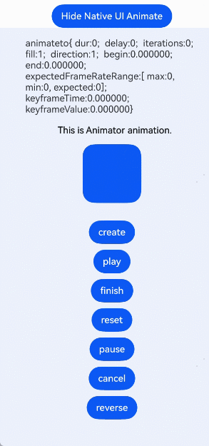

# Using Animations
<!--Kit: ArkUI-->
<!--Subsystem: ArkUI-->
<!--Owner: @CCFFWW-->
<!--Designer: @CCFFWW-->
<!--Tester: @lxl007-->
<!--Adviser: @Brilliantry_Rui-->


## Using Property Animations

The ArkUI framework primarily offers property animations through NDK APIs to implement component transition effects for appearance and disappearance. Additionally, frame animation capabilities from the ArkTS side can be bridged through the Node-API to achieve animation effects on the native side.

> **NOTE**
>
> - Obtain [this.getUIContext()](../reference/apis-arkui/arkui-ts/ts-custom-component-api.md#getuicontext) from ArkTS and pass it to the native side.
> 
> - On the native side, obtain the context using the [OH_ArkUI_GetContextFromNapiValue](../reference/apis-arkui/capi-native-node-napi-h.md) API.
> 
> - Animation property changes must be encapsulated within the callback of [ArkUI_ContextCallback](../reference/apis-arkui/capi-arkui-nativemodule-arkui-contextcallback.md).
> 
> - Ensure that the properties intended for animation have been set before the animation is executed.
>
> - This section demonstrates core API usage only. For the complete sample project, see <!--RP1-->[AnimationNDK](https://gitcode.com/openharmony/applications_app_samples/tree/master/code/DocsSample/ArkUISample/AnimationNDK)<!--RP1End-->.

A global **animateTo** explicit animation API is provided to specify transition effects for state changes caused by closure code. Like property animations, layout changes such as width and height adjustments are animated directly to their final states.

1. Obtain [UIContext](../reference//apis-arkui/arkts-apis-uicontext-uicontext.md) in the .ets file and pass **this.getUIContext()** as a parameter to the native API.
   ```ts
   // createNativeNode is an API exposed on the native side.
   nativeNode.createNativeNode("xcomponentId", this.getUIContext());
   ```

2. Parse the UI context to convert the context object in C.
   ```
   // Obtain the context passed from the ArkTS side.
   ArkUI_ContextHandle context = nullptr;
   // Determine whether the acquisition is successful based on code.
   auto code = OH_ArkUI_GetContextFromNapiValue(env, args[1], &context);
   ```

3. Obtain the **ArkUI_NativeAnimateAPI_1** object.
   ```
   // Obtain the ArkUI_NativeAnimateAPI.
   ArkUI_NativeAnimateAPI_1 *animateApi = nullptr;
   OH_ArkUI_GetModuleInterface(ARKUI_NATIVE_ANIMATE, ArkUI_NativeAnimateAPI_1, animateApi);
   ```

4. Set the **ArkUI_AnimateOption** parameters using the provided C APIs.
   ```
   ArkUI_AnimateOption *option = OH_ArkUI_AnimateOption_Create();
   OH_ArkUI_AnimateOption_SetDuration(option, 2000);
   OH_ArkUI_AnimateOption_SetTempo(option, 1.1);
   OH_ArkUI_AnimateOption_SetCurve(option, ARKUI_CURVE_EASE);
   OH_ArkUI_AnimateOption_SetDelay(option, 20);
   OH_ArkUI_AnimateOption_SetIterations(option, 1);
   OH_ArkUI_AnimateOption_SetPlayMode(option, ARKUI_ANIMATION_PLAY_MODE_REVERSE);
   ArkUI_ExpectedFrameRateRange *range = new ArkUI_ExpectedFrameRateRange;
   range->min = 10;
   range->max = 120;
   range->expected = 60;
   OH_ArkUI_AnimateOption_SetExpectedFrameRateRange(option, range);
   ```

5. Set callback parameters.
   ```
   // Define a user data struct.
   struct UserData{
       int32_t data;
   };
   UserData *onFinishUser = new UserData;
   onFinishUser->data= 101;
   // Create and set user data for the completion callback.
   ArkUI_AnimateCompleteCallback *completeCallback = new ArkUI_AnimateCompleteCallback;
   completeCallback->userData = onFinishUser;
   completeCallback->type = ARKUI_FINISH_CALLBACK_REMOVED;
   completeCallback->callback = [](void *userData) {
       OH_LOG_Print(LOG_APP, LOG_INFO, LOG_PRINT_DOMAIN, "Manager", "CreateNativeNode  onFinishCallback %{public}d",
                    reinterpret_cast<AA *>(userData)->a);
   };
   // User data
   UserData *eventUser = new UserData ;
   eventUser->data= 201;
   static bool isback = true;
   ArkUI_ContextCallback *update = new ArkUI_ContextCallback;
   update->userData = eventUser;
   update->callback = [](void *user) {
       OH_LOG_Print(LOG_APP, LOG_INFO, LOG_PRINT_DOMAIN, "Manager", "CreateNativeNode  animateTo %{public}d",
                    reinterpret_cast<UserData*>(user)->data);
       // Example of changing width and height properties
       if (isback) {
           ArkUI_NumberValue custom_widthValue[] = {200};
           ArkUI_AttributeItem custom_widthItem = {custom_widthValue, 1};
           ArkUI_NumberValue custom_heightValue1[] = {80};
           ArkUI_AttributeItem custom_heightItem1 = {custom_heightValue1, 1};
           nodeAPI->setAttribute(textInput, NODE_WIDTH, &custom_widthItem);
           nodeAPI->setAttribute(textInput, NODE_HEIGHT, &custom_heightItem1);
       } else {
           ArkUI_NumberValue custom_widthValue[] = {100};
           ArkUI_AttributeItem custom_widthItem = {custom_widthValue, 1};
           ArkUI_NumberValue custom_heightValue1[] = {40};
           ArkUI_AttributeItem custom_heightItem1 = {custom_heightValue1, 1};
           nodeAPI->setAttribute(textInput, NODE_WIDTH, &custom_widthItem);
           nodeAPI->setAttribute(textInput, NODE_HEIGHT, &custom_heightItem1);
       }
   };
   // Execute the animation with the set options and callbacks.
   animateApi->animateTo(context, option, update, completeCallback);
   ```

   


## Using Component Appearance/Disappearance Transitions

Use **NODE_*XX*_TRANSITION** properties (where *XX* can be **OPACITY**, **TRANSLATE**, **SCALE**, **ROTATE**, or **MOVE**) to configure transition effects for components, enhancing the user experience when components are added to or removed from containers. The **NODE_TRANSFORM_CENTER** property sets the center point for animations including **NODE_SCALE_TRANSITION** and **NODE_ROTATE_ROTATE**.  

1. Design an interactive UI with a button to manage the addition and removal of transition nodes. For details about how to obtain and use the ArkUI_NodeContentHandle node, see [Integrating with ArkTS Pages](ndk-access-the-arkts-page.md).
   ```
   constexpr int32_t BUTTON_CLICK_ID = 1;
   bool flag = false;
   ArkUI_NodeHandle parentNode;
   ArkUI_NodeHandle childNode;
   ArkUI_NodeHandle buttonNode;
   
   void mainViewMethod(ArkUI_NodeContentHandle handle)
   {
       ArkUI_NativeNodeAPI_1 *nodeAPI = reinterpret_cast<ArkUI_NativeNodeAPI_1 *>(
           OH_ArkUI_QueryModuleInterfaceByName(ARKUI_NATIVE_NODE, "ArkUI_NativeNodeAPI_1"));
       ArkUI_NodeHandle column = nodeAPI->createNode(ARKUI_NODE_COLUMN);
       ArkUI_NumberValue widthValue[] = {{.f32 = 500}};
       ArkUI_AttributeItem widthItem = {.value = widthValue, .size = sizeof(widthValue) / sizeof(ArkUI_NumberValue)};
       nodeAPI->setAttribute(column, NODE_WIDTH, &widthItem);
       ArkUI_NumberValue heightValue[] = {{.f32 = 500}};
       ArkUI_AttributeItem heightItem = {.value = heightValue, .size = sizeof(heightValue) / sizeof(ArkUI_NumberValue)};
       nodeAPI->setAttribute(column, NODE_HEIGHT, &heightItem);
       ArkUI_NodeHandle buttonShow = nodeAPI->createNode(ARKUI_NODE_BUTTON);
       ArkUI_NumberValue buttonWidthValue[] = {{.f32 = 200}};
       ArkUI_AttributeItem buttonWidthItem = {.value = buttonWidthValue,
                                              .size = sizeof(buttonWidthValue) / sizeof(ArkUI_NumberValue)};
       nodeAPI->setAttribute(buttonShow, NODE_WIDTH, &buttonWidthItem);
       ArkUI_NumberValue buttonHeightValue[] = {{.f32 = 50}};
       ArkUI_AttributeItem buttonHeightItem = {.value = buttonHeightValue,
                                               .size = sizeof(buttonHeightValue) / sizeof(ArkUI_NumberValue)};
       nodeAPI->setAttribute(buttonShow, NODE_HEIGHT, &buttonHeightItem);
       ArkUI_AttributeItem labelItem = {.string = "show"};
       nodeAPI->setAttribute(buttonShow, NODE_BUTTON_LABEL, &labelItem);
       ArkUI_NumberValue buttonOpenTypeValue[] = {{.i32 = static_cast<int32_t>(ARKUI_BUTTON_TYPE_NORMAL)}};
       ArkUI_AttributeItem buttonOpenTypeItem = {.value = buttonOpenTypeValue,
                                                 .size = sizeof(buttonOpenTypeValue) / sizeof(ArkUI_NumberValue)};
       nodeAPI->setAttribute(buttonShow, NODE_BUTTON_TYPE, &buttonOpenTypeItem);
       ArkUI_NumberValue buttonShowMarginValue[] = {{.f32 = 20}};
       ArkUI_AttributeItem buttonShowMarginItem = {.value = buttonShowMarginValue,
                                                    .size = sizeof(buttonShowMarginValue) / sizeof(ArkUI_NumberValue)};
       nodeAPI->setAttribute(buttonShow, NODE_MARGIN, &buttonShowMarginItem);
       nodeAPI->registerNodeEvent(buttonShow, NODE_ON_CLICK, BUTTON_CLICK_ID, nullptr);
       nodeAPI->addNodeEventReceiver(buttonShow, OnButtonShowClicked);
       parentNode = column;
       buttonNode = buttonShow;
       nodeAPI->addChild(column, buttonShow);
       OH_ArkUI_NodeContent_AddNode(handle, column);
   }
   ```

2. Create a node with **Transition** properties that play a transition animation when the target node is mounted or unmounted.
   ```
   ArkUI_NodeHandle CreateChildNode() {
       ArkUI_NativeNodeAPI_1 *nodeAPI = reinterpret_cast<ArkUI_NativeNodeAPI_1 *>(
           OH_ArkUI_QueryModuleInterfaceByName(ARKUI_NATIVE_NODE, "ArkUI_NativeNodeAPI_1"));
       ArkUI_NodeHandle image = nodeAPI->createNode(ARKUI_NODE_IMAGE);
       ArkUI_AttributeItem imageSrcItem = {.string = "/pages/common/scenery.jpg"};
       nodeAPI->setAttribute(image, NODE_IMAGE_SRC, &imageSrcItem);
       ArkUI_NumberValue textWidthValue[] = {{.f32 = 300}};
       ArkUI_AttributeItem textWidthItem = {.value = textWidthValue,
                                            .size = sizeof(textWidthValue) / sizeof(ArkUI_NumberValue)};
       nodeAPI->setAttribute(image, NODE_WIDTH, &textWidthItem);
       ArkUI_NumberValue textHeightValue[] = {{.f32 = 300}};
       ArkUI_AttributeItem textHeightItem = {.value = textHeightValue,
                                             .size = sizeof(textWidthValue) / sizeof(ArkUI_NumberValue)};
       nodeAPI->setAttribute(image, NODE_HEIGHT, &textHeightItem);
       ArkUI_NumberValue transformCenterValue[] = {0.0f, 0.0f, 0.0f, 0.5f, 0.5f};
       ArkUI_AttributeItem transformCenterItem = {.value = transformCenterValue,
                                             .size = sizeof(transformCenterValue) / sizeof(ArkUI_NumberValue)};
       nodeAPI->setAttribute(image, NODE_TRANSFORM_CENTER, &transformCenterItem);
       ArkUI_NumberValue rotateAnimationValue[] = {0.0f, 0.0f, 1.0f, 360.0f, 0.0f, {.i32 = 500}, {.i32 = static_cast<int32_t>(ARKUI_CURVE_SHARP)}};
       ArkUI_AttributeItem rotateAnimationItem = {.value = rotateAnimationValue,
                                                  .size = sizeof(rotateAnimationValue) / sizeof(ArkUI_NumberValue)};
       nodeAPI->setAttribute(image, NODE_ROTATE_TRANSITION, &rotateAnimationItem);
       ArkUI_NumberValue scaleAnimationValue[] = {
           0.0f, 0.0f, 0.0f, {.i32 = 500}, {.i32 = static_cast<int32_t>(ARKUI_CURVE_SHARP)}};
       ArkUI_AttributeItem scaleAnimationItem = {.value = scaleAnimationValue,
                                                  .size = sizeof(scaleAnimationValue) / sizeof(ArkUI_NumberValue)};
       nodeAPI->setAttribute(image, NODE_SCALE_TRANSITION, &scaleAnimationItem);
       ArkUI_NumberValue translateAnimationValue[] = {
           200, 200, 0.0f, {.i32 = 500}, {.i32 = static_cast<int32_t>(ARKUI_CURVE_SHARP)}};
       ArkUI_AttributeItem translateAnimationItem = {.value = translateAnimationValue,
                                                 .size = sizeof(translateAnimationValue) / sizeof(ArkUI_NumberValue)};
       nodeAPI->setAttribute(image, NODE_TRANSLATE_TRANSITION, &translateAnimationItem);
       return image;
   }
   ```

3. Add logic for mounting and unmounting the transition node within the **Button** component event callback to control the appearance and disappearance of the transition node.
   ```
   void OnButtonShowClicked(ArkUI_NodeEvent* event)
   {
       if (!event) {
           return;
       }
       if (!childNode) {
           childNode = CreateChildNode();
       }
       ArkUI_NativeNodeAPI_1 *nodeAPI = reinterpret_cast<ArkUI_NativeNodeAPI_1 *>(
           OH_ArkUI_QueryModuleInterfaceByName(ARKUI_NATIVE_NODE, "ArkUI_NativeNodeAPI_1"));
       if (flag) {
           flag = false;
           ArkUI_AttributeItem labelItem = {.string = "show"};
           nodeAPI->setAttribute(buttonNode, NODE_BUTTON_LABEL, &labelItem);
           nodeAPI->removeChild(parentNode, childNode);
       } else {
           flag = true;
           ArkUI_AttributeItem labelItem = {.string = "hide"};
           nodeAPI->setAttribute(buttonNode, NODE_BUTTON_LABEL, &labelItem);
           nodeAPI->addChild(parentNode, childNode);
       }
   }
   ```

   


## Using Keyframe Animations

You can use the [keyframeAnimateTo](../reference/apis-arkui/capi-arkui-nativemodule-arkui-nativeanimateapi-1.md#keyframeanimateto) API to specify several keyframe states to create segmented animations. Like property animations, layout changes such as width and height adjustments are animated directly to their final states.

This example demonstrates how to use the [keyframeAnimateTo](../reference/apis-arkui/capi-arkui-nativemodule-arkui-nativeanimateapi-1.md#keyframeanimateto) API to set up keyframe animations. For the complete process of mounting a UI developed with NDK APIs to the ArkTS main page, see [Integrating with ArkTS Pages](ndk-access-the-arkts-page.md).

```
auto column = nodeAPI->createNode(ARKUI_NODE_COLUMN);

// Create a button that will be the target of the keyframe animation.
auto button = nodeAPI->createNode(ARKUI_NODE_BUTTON);
ArkUI_NumberValue widthValue0[] = {100};
ArkUI_AttributeItem widthItem0 = {widthValue0, 1};
ArkUI_NumberValue heightValue0[] = {100};
ArkUI_AttributeItem heightItem0 = {heightValue0, 1};
nodeAPI->setAttribute(button, NODE_WIDTH, &widthItem0);
nodeAPI->setAttribute(button, NODE_HEIGHT, &heightItem0);
ArkUI_NumberValue typeValue[] = {{.i32 = ArkUI_ButtonType::ARKUI_BUTTON_TYPE_CIRCLE}};
ArkUI_AttributeItem typeItem = {typeValue, 1};
nodeAPI->setAttribute(button, NODE_BUTTON_TYPE, &typeItem); // Set the button shape to circular.

static ArkUI_NodeHandle buttonSelf = button;
static ArkUI_NativeNodeAPI_1 *nodeAPISelf = nodeAPI;

// Register a click event for the button.
nodeAPI->registerNodeEvent(button, NODE_ON_CLICK, 1, nullptr);
auto onTouch = [](ArkUI_NodeEvent *event) {
    
    // Logic triggered when the button is clicked.
    if (OH_ArkUI_NodeEvent_GetTargetId(event) == 1) {
        
        // Obtain the context object.
        static ArkUI_ContextHandle context = nullptr;
        context = OH_ArkUI_GetContextByNode(buttonSelf);
        
        // Obtain the ArkUI_NativeAnimateAPI.
        ArkUI_NativeAnimateAPI_1 *animateApi = nullptr;
        OH_ArkUI_GetModuleInterface(ARKUI_NATIVE_ANIMATE, ArkUI_NativeAnimateAPI_1, animateApi);
        
        // The following code is the key process for creating a keyframe animation, including setting keyframe animation parameters and starting the animation.
        // Set the ArkUI_KeyframeAnimateOption parameters using the provided C APIs.
        static ArkUI_KeyframeAnimateOption *option =  OH_ArkUI_KeyframeAnimateOption_Create(2); // Number of keyframe animation states.
        OH_ArkUI_KeyframeAnimateOption_SetDuration(option, 1000, 0); // Duration of the first keyframe animation segment.
        OH_ArkUI_KeyframeAnimateOption_SetDuration(option, 2000, 1); // Duration of the second keyframe animation segment.
        OH_ArkUI_KeyframeAnimateOption_SetIterations(option, 5); // Number of keyframe animation repetitions.
        OH_ArkUI_KeyframeAnimateOption_RegisterOnEventCallback(option, nullptr, [](void *user) {
            ArkUI_NumberValue widthValue0[] = {150};
            ArkUI_AttributeItem widthItem0 = {widthValue0, 1};
            ArkUI_NumberValue heightValue0[] = {150};
            ArkUI_AttributeItem heightItem0 = {heightValue0, 1};
            nodeAPISelf->setAttribute(buttonSelf, NODE_WIDTH, &widthItem0);
            nodeAPISelf->setAttribute(buttonSelf, NODE_HEIGHT, &heightItem0);
        }, 0); // Closure function for the first keyframe state.
        OH_ArkUI_KeyframeAnimateOption_RegisterOnEventCallback(option, nullptr, [](void *user) {
            ArkUI_NumberValue widthValue0[] = {80};
            ArkUI_AttributeItem widthItem0 = {widthValue0, 1};
            ArkUI_NumberValue heightValue0[] = {80};
            ArkUI_AttributeItem heightItem0 = {heightValue0, 1};
            nodeAPISelf->setAttribute(buttonSelf, NODE_WIDTH, &widthItem0);
            nodeAPISelf->setAttribute(buttonSelf, NODE_HEIGHT, &heightItem0);
        }, 1); // Closure function for the second keyframe state.
        OH_ArkUI_KeyframeAnimateOption_RegisterOnFinishCallback(option, nullptr, [](void *user) {
            OH_LOG_Print(LOG_APP, LOG_INFO, LOG_PRINT_DOMAIN, "Manager", "keyframe animate finish");
        }); // Keyframe animation completion callback.
        ArkUI_ExpectedFrameRateRange *range = new ArkUI_ExpectedFrameRateRange;
        range->max = 120;
        range->expected = 60;
        range->min = 30;
        OH_ArkUI_KeyframeAnimateOption_SetExpectedFrameRate(option, range); // Set the expected frame rate for keyframes.
        
        // Execute the animation with the set options and callbacks.
        animateApi->keyframeAnimateTo(context, option);
    }
};
nodeAPI->registerNodeEventReceiver(onTouch);
nodeAPI->addChild(column, button);
```


## Using Frame Animations

Frame animation enables adjustment of animation properties on each frame through its per-frame callback mechanism. By leveraging the **onFrame** callback, you can dynamically set property values frame by frame, creating smooth and natural-looking animations. For details about the frame animation APIs, see [createAnimator](../reference/apis-arkui/capi-arkui-nativemodule-arkui-nativeanimateapi-1.md#createanimator).

Compared with the property animation, the frame animation offers the benefits of real-time visibility into the animation process and allows you to modify UI values on the fly. In addition, it provides high responsiveness to events and can be paused as needed. However, it is worth noting that the frame animation may not deliver the same performance efficiency as the property animation. Therefore, where the property animation meets your requirements, you are advised to use the property animation APIs. For details about how to use the [animateTo](../reference/apis-arkui/capi-arkui-nativemodule-arkui-nativeanimateapi-1.md#animateto) API, see [Using Property Animations](#using-property-animations).

This example demonstrates how to use the [createAnimator](../reference/apis-arkui/capi-arkui-nativemodule-arkui-nativeanimateapi-1.md#createanimator) API to set up frame animations. For the complete sample project, see <!--RP1-->[AnimationNDK](https://gitcode.com/openharmony/applications_app_samples/tree/master/code/DocsSample/ArkUISample/AnimationNDK)<!--RP1End-->.
```
std::shared_ptr<ArkUIBaseNode> CreateAnimator()
{
    auto column = std::make_shared<ArkUIColumnNode>();
    column->SetWidth(300);
    column->SetHeight(250);
    // Create a text node with content "This is Animator animation."
    auto textNode = std::make_shared<ArkUITextNode>();
    textNode->SetTextContent("This is Animator animation.");
    textNode->SetWidth(150);
    textNode->SetHeight(50);
    // Create createButton to initialize Animator parameters.
    auto createButton = std::make_shared<ArkUIButtonNode>();
    // Create a button that will be the target of the Animator animation.
    auto button = std::make_shared<ArkUIButtonNode>();
    // Set the initial width and height of the button.
    button->SetWidth(100);
    button->SetHeight(100);
    // Store the button as a global variable for use in onTouch registration.
    g_animator_button = button;
    // Register a click event for the button.
    createButton->RegisterNodeEvent(createButton->GetHandle(), NODE_ON_CLICK, 3, nullptr);
    g_animator_text = std::make_shared<ArkUITextNode>();
    g_animator_text->AnimatorToString();
    auto onTouch = [](ArkUI_NodeEvent *event) {
        // Logic triggered when the button is clicked.
        if (OH_ArkUI_NodeEvent_GetTargetId(event) == 3) {
            // Obtain the context object.
            static ArkUI_ContextHandle context = nullptr;
            context = OH_ArkUI_GetContextByNode(g_animator_button->GetHandle());

            // Obtain the ArkUI_NativeAnimateAPI.
            ArkUI_NativeAnimateAPI_1 *animateApi = nullptr;
            OH_ArkUI_GetModuleInterface(ARKUI_NATIVE_ANIMATE, ArkUI_NativeAnimateAPI_1, animateApi);
            
            // The following demonstrates the key process for creating an Animator animation, including setting Animator animation parameters and starting the animation.
            // Set the ArkUI_AnimatorOption parameters using the provided C APIs.
            static ArkUI_AnimatorOption *option =  OH_ArkUI_AnimatorOption_Create(0); // Number of Animator animation states.
            OH_ArkUI_AnimatorOption_SetDuration(option, 2000);
            OH_ArkUI_AnimatorOption_SetDelay(option, 10);
            OH_ArkUI_AnimatorOption_SetIterations(option, 3);
            OH_ArkUI_AnimatorOption_SetFill(option, ARKUI_ANIMATION_FILL_MODE_NONE);
            OH_ArkUI_AnimatorOption_SetDirection(option, ARKUI_ANIMATION_DIRECTION_NORMAL);
            ArkUI_CurveHandle curve = OH_ArkUI_Curve_CreateCubicBezierCurve(0.5f, 4.0f, 1.2f, 0.0f); // Create a cubic bezier curve object.
            OH_ArkUI_AnimatorOption_SetCurve(option, curve);
            OH_ArkUI_AnimatorOption_SetBegin(option, 100);
            OH_ArkUI_AnimatorOption_SetEnd(option, 150);
            ArkUI_ExpectedFrameRateRange *range = new ArkUI_ExpectedFrameRateRange;
            range->max = 120;
            range->expected = 60;
            range->min = 30;
            OH_ArkUI_AnimatorOption_SetExpectedFrameRateRange(option, range);
            OH_ArkUI_AnimatorOption_SetKeyframe(option, 0.5, 120.5, 0); // Set the keyframe parameters of the Animator animation.
            OH_ArkUI_AnimatorOption_SetKeyframeCurve(option, curve, 0); // Set the keyframe curve type of the Animator animation.
            OH_ArkUI_AnimatorOption_RegisterOnFrameCallback(option, nullptr, [](ArkUI_AnimatorOnFrameEvent *event){
                OH_ArkUI_AnimatorOnFrameEvent_GetUserData(event); // Obtain the custom object from the animation event object.
                auto value = OH_ArkUI_AnimatorOnFrameEvent_GetValue(event); // Obtain the current progress from the animation event object.
                OH_LOG_Print(LOG_APP, LOG_ERROR, LOG_PRINT_DOMAIN, "Init", "CXX OH_ArkUI_AnimatorOption_RegisterOnFrameCallback  %{public}f", value);
                g_animator_button->SetWidth(value);
            });
            OH_ArkUI_AnimatorOption_RegisterOnFinishCallback(option, reinterpret_cast<void*>(option), [](ArkUI_AnimatorEvent* event){
                OH_ArkUI_AnimatorEvent_GetUserData(event); // Obtain the custom object from the animation event object.
            });
            OH_ArkUI_AnimatorOption_RegisterOnCancelCallback(option, nullptr, [](ArkUI_AnimatorEvent* event){
            });
            OH_ArkUI_AnimatorOption_RegisterOnRepeatCallback(option, nullptr, [](ArkUI_AnimatorEvent* event){
            });
            // Execute the animation with the set options and callbacks.
            animatorHandle = animateApi->createAnimator(context, option);
            
            auto duration = OH_ArkUI_AnimatorOption_GetDuration(option);
            auto delay = OH_ArkUI_AnimatorOption_GetDelay(option);
            auto iterations = OH_ArkUI_AnimatorOption_GetIterations(option);
            auto fill = OH_ArkUI_AnimatorOption_GetFill(option);
            auto direction = OH_ArkUI_AnimatorOption_GetDirection(option);
            auto curves = OH_ArkUI_AnimatorOption_GetCurve(option); // Obtain the interpolation curve of the Animator animation.
            auto begin = OH_ArkUI_AnimatorOption_GetBegin(option);
            auto end = OH_ArkUI_AnimatorOption_GetEnd(option); // Obtain the interpolation end point of the Animator animation.
            auto expected = OH_ArkUI_AnimatorOption_GetExpectedFrameRateRange(option); // Obtain the expected frame rate range from the keyframe animation parameters.
            auto keyframeTime = OH_ArkUI_AnimatorOption_GetKeyframeTime(option, 0); // Obtain the keyframe time of the Animator animation.
            auto keyframeValue = OH_ArkUI_AnimatorOption_GetKeyframeValue(option, 0); // Obtain the keyframe value from the Animator animation parameters.
            auto keyframeCurve = OH_ArkUI_AnimatorOption_GetKeyframeCurve(option, 0); // Obtain the keyframe interpolation curve of the Animator animation.
            g_animator_text->AnimatorToString(duration, delay, iterations, fill, direction, begin,
                end, *expected, keyframeTime, keyframeValue);
        }
    };

    // Register a callback function for the click event.
    createButton->RegisterNodeEventReceiver(onTouch);
    createButton->SetButtonLabel("create");
    // Create a container for storing the button.
    auto buttoColumn = std::make_shared<ArkUIColumnNode>();
    buttoColumn->SetPadding(30, false); // Set layout parameters and adjust internal component spacing.
    buttoColumn->SetWidth(300);
    // Create a container for storing playButton.
    auto playButtonColumn = std::make_shared<ArkUIColumnNode>();
    playButtonColumn->SetPadding(10, false); // Set layout parameters and adjust internal component spacing.
    playButtonColumn->SetWidth(300);
    // Set the Animator play button.
    auto playButton = std::make_shared<ArkUIButtonNode>();
    playButton->SetButtonLabel("play");
    playButton->RegisterNodeEvent(playButton->GetHandle(), NODE_ON_CLICK, 4, nullptr);
    auto onTouchPlay = [](ArkUI_NodeEvent *event) {
        // Logic triggered when the button is clicked.
        if (OH_ArkUI_NodeEvent_GetTargetId(event) == 4) {
            OH_ArkUI_Animator_Play(animatorHandle);
        }
    };
    playButton->RegisterNodeEventReceiver(onTouchPlay);
    // Set the Animator end button.
    auto finishButton = std::make_shared<ArkUIButtonNode>();
    finishButton->SetButtonLabel("finish");
    finishButton->RegisterNodeEvent(finishButton->GetHandle(), NODE_ON_CLICK, 5, nullptr);
    auto onTouchFinish = [](ArkUI_NodeEvent *event) {
        // Logic triggered when the button is clicked.
        if (OH_ArkUI_NodeEvent_GetTargetId(event) == 5) {
            OH_ArkUI_Animator_Finish(animatorHandle);
        }
    };
    finishButton->RegisterNodeEventReceiver(onTouchFinish);
    // Create a container for storing resetButton.
    auto resetButtonColumn = std::make_shared<ArkUIColumnNode>();
    resetButtonColumn->SetPadding(10, false); // Set layout parameters and adjust internal component spacing.
    resetButtonColumn->SetWidth(300);
    // Set the Animator update button.
    auto resetButton = std::make_shared<ArkUIButtonNode>();
    resetButton->SetButtonLabel("reset");
    resetButton->RegisterNodeEvent(resetButton->GetHandle(), NODE_ON_CLICK, 6, nullptr);
    auto onTouchReset = [](ArkUI_NodeEvent *event) {
        // Logic triggered when the button is clicked.
        if (OH_ArkUI_NodeEvent_GetTargetId(event) == 6) {
            static ArkUI_AnimatorOption *option =  OH_ArkUI_AnimatorOption_Create(0); // Number of Animator animation states.
            OH_ArkUI_AnimatorOption_SetDuration(option, 1000);
            OH_ArkUI_AnimatorOption_SetDelay(option, 0);
            OH_ArkUI_AnimatorOption_SetIterations(option, 4);
            // Choose the appropriate curve from the following two options to set OH_ArkUI_AnimatorOption_SetCurve.
            auto curve = OH_ArkUI_Curve_CreateCurveByType(ARKUI_CURVE_EASE); // The animation starts slowly, accelerates, and then slows down towards the end.
            auto stepsCurve = OH_ArkUI_Curve_CreateStepsCurve(20, true); // Create a step curve object.
            OH_ArkUI_AnimatorOption_SetCurve(option, curve);
            OH_ArkUI_AnimatorOption_SetBegin(option, 200);
            OH_ArkUI_AnimatorOption_SetEnd(option, 100);
            OH_ArkUI_AnimatorOption_RegisterOnFrameCallback(option, nullptr, [](ArkUI_AnimatorOnFrameEvent *event){
                OH_ArkUI_AnimatorOnFrameEvent_GetUserData(event); // Obtain the custom object from the animation event object.
                auto value = OH_ArkUI_AnimatorOnFrameEvent_GetValue(event); // Obtain the current progress from the animation event object.
                g_animator_button->SetWidth(value);
            });
            OH_ArkUI_Animator_ResetAnimatorOption(animatorHandle, option);
        }
    };
    resetButton->RegisterNodeEventReceiver(onTouchReset);
    // Set the Animator pause button.
    auto pauseButton = std::make_shared<ArkUIButtonNode>();
    pauseButton->SetButtonLabel("pause");
    pauseButton->RegisterNodeEvent(pauseButton->GetHandle(), NODE_ON_CLICK, 7, nullptr);
    auto onTouchPause = [](ArkUI_NodeEvent *event) {
        // Logic triggered when the button is clicked.
        if (OH_ArkUI_NodeEvent_GetTargetId(event) == 7) {
            OH_ArkUI_Animator_Pause(animatorHandle);
        }
    };
    pauseButton->RegisterNodeEventReceiver(onTouchPause);
    // Create a container for storing cancelButton.
    auto cancelButtonColumn = std::make_shared<ArkUIColumnNode>();
    cancelButtonColumn->SetPadding(10, false); // Set layout parameters and adjust internal component spacing.
    cancelButtonColumn->SetWidth(300);
    // Set the Animator cancel button.
    auto cancelButton = std::make_shared<ArkUIButtonNode>();
    cancelButton->SetButtonLabel("cancel");
    cancelButton->RegisterNodeEvent(cancelButton->GetHandle(), NODE_ON_CLICK, 8, nullptr);
    auto onTouchCancel = [](ArkUI_NodeEvent *event) {
        // Logic triggered when the button is clicked.
        if (OH_ArkUI_NodeEvent_GetTargetId(event) == 8) {
            OH_ArkUI_Animator_Cancel(animatorHandle);
        }
    };
    cancelButton->RegisterNodeEventReceiver(onTouchCancel);
    // Set the Animator reverse-play button.
    auto reverseButton = std::make_shared<ArkUIButtonNode>();
    reverseButton->SetButtonLabel("reverse");
    reverseButton->RegisterNodeEvent(reverseButton->GetHandle(), NODE_ON_CLICK, 9, nullptr);
    auto onTouchReverse = [](ArkUI_NodeEvent *event) {
        // Logic triggered when the button is clicked.
        if (OH_ArkUI_NodeEvent_GetTargetId(event) == 9) {
            OH_ArkUI_Animator_Reverse(animatorHandle);
        }
    };
    reverseButton->RegisterNodeEventReceiver(onTouchReverse);
    // Mount the button to the column and return the column node.
    column->AddChild(g_animator_text);
    column->AddChild(textNode);
    column->AddChild(button);
    buttoColumn->AddChild(createButton);
    playButtonColumn->AddChild(playButton);
    buttoColumn->AddChild(playButtonColumn);
    buttoColumn->AddChild(finishButton);
    resetButtonColumn->AddChild(resetButton);
    buttoColumn->AddChild(resetButtonColumn);
    buttoColumn->AddChild(pauseButton);
    cancelButtonColumn->AddChild(cancelButton);
    buttoColumn->AddChild(cancelButtonColumn);
    buttoColumn->AddChild(reverseButton);
    column->AddChild(buttoColumn);
    return column;
}
```


