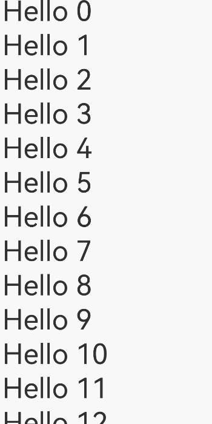
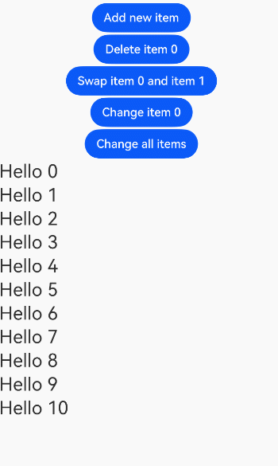
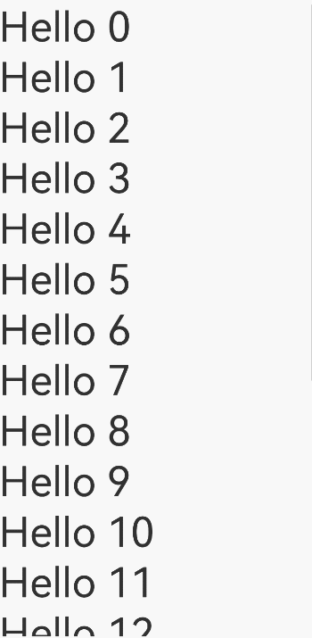
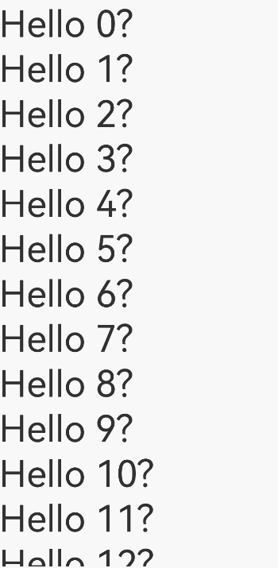
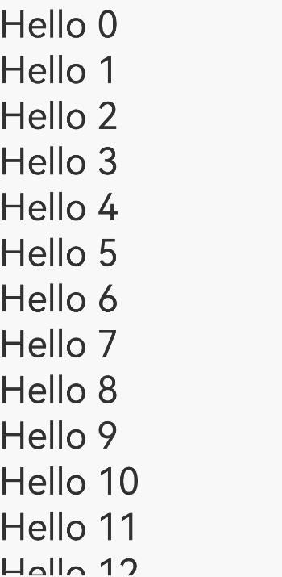
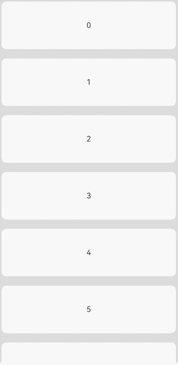
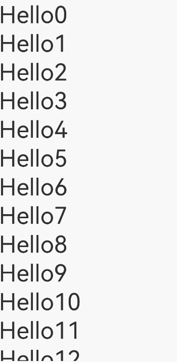
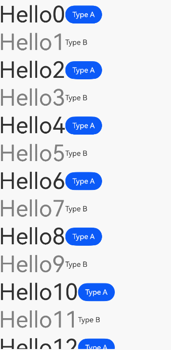

# Migrating from LazyForEach to Repeat
<!--Kit: ArkUI-->
<!--Subsystem: ArkUI-->
<!--Owner: @maorh-->
<!--Designer: @keerecles-->
<!--Tester: @TerryTsao-->
<!--Adviser: @zhang_yixin13-->

[Repeat](./arkts-new-rendering-control-repeat.md) is a new loop rendering component introduced in ArkUI for API version 12. Compared with [LazyForEach](./arkts-rendering-control-lazyforeach.md), **Repeat** offers a simpler API, enhanced functionality, and improved performance optimization. This topic provides guidance on migrating from **LazyForEach** to **Repeat**.

## Migrating Basic Usage

### Initial Data Rendering

**LazyForEach Example**

**LazyForEach** iteratively renders child components based on a provided data source.

In Example 1, **LazyForEach** is used within a [List](../arkts-layout-development-create-list.md) container component to iteratively render a series of [Text](../arkts-common-components-text-display.md) child components from a data source.

**Example 1 – Before Migration**

```ts
/** For details about the BasicDataSource implementation of the string array, see the sample code at the end of this topic. **/

class MyDataSource extends BasicDataSource {
  private dataArray: string[] = [];

  public totalCount(): number {
    return this.dataArray.length;
  }

  public getData(index: number): string {
    return this.dataArray[index];
  }

  public pushData(data: string): void {
    this.dataArray.push(data);
    this.notifyDataAdd(this.dataArray.length - 1);
  }
}

@Entry
@Component
struct MyComponent {
  private data: MyDataSource = new MyDataSource();

  aboutToAppear() {
    for (let i = 0; i <= 20; i++) {
      this.data.pushData(`Hello ${i}`);
    }
  }

  build() {
    List({ space: 3 }) {
      LazyForEach(this.data, (item: string) => {
        ListItem() {
          Row() {
            Text(item).fontSize(50)
              .onAppear(() => {
                console.info(`appear: ${item}`);
              })
          }.margin({ left: 10, right: 10 })
        }
      }, (item: string) => item)
    }.cachedCount(5)
  }
}
```

The example above illustrates a typical use case of **LazyForEach** for rendering child components. The following section explains how to migrate this implementation to **Repeat**.

**Migration Procedure**

1. Adopt state management V2 decorators.

   **Repeat** is designed to work with state management V2 decorators. (In [lazy loading](./arkts-new-rendering-control-repeat.md#how-it-works) mode, **Repeat** requires state management V2.) If you are currently using state management V1, migrate to V2.

   ```ts
   // Before migration – LazyForEach
   @Component // State management V1
   struct MyComponent {
     build() {
       // ...
       LazyForEach(...)
       // ...
     }
     // ...Other properties and methods
   }
     
   // After migration – Repeat
   @ComponentV2 // State management V2
   struct MyComponent {
     build() {
       // ...
       Repeat(...)
       // ...
     }
     // ...Other properties and methods
   }
   ```

2. Update data source implementation.

   **LazyForEach** uses the specialized [IDataSource](../../reference/apis-arkui/arkui-ts/ts-rendering-control-lazyforeach.md#idatasource) API. With **Repeat**, you instead use arrays decorated with state management V2.

   ```ts
   // Before migration – LazyForEach
   class MyDataSource implements IDataSource {
     private dataArray: string[] = [];
     
     public totalCount(): number {
       return this.dataArray.length;
     }
     
     public getData(index: number): string {
       return this.dataArray[index];
     }
     
     // ...Other methods
   }
   
   // After migration – Repeat
   @Local data: Array<string> = [];
   ```

3. Adapt component and key generation functions.

   Both **LazyForEach** and **Repeat** use component generation functions to create child components and key generation functions for unique identifiers.<br>
   However, **Repeat** uses a different syntax with method chaining. For **Repeat**, the component generation function must be configured in either [.each()](../../reference/apis-arkui/arkui-ts/ts-rendering-control-repeat.md#each) or [.template()](../../reference/apis-arkui/arkui-ts/ts-rendering-control-repeat.md#template), while the key generation function needs to be set in [.key()](../../reference/apis-arkui/arkui-ts/ts-rendering-control-repeat.md#key).

   ```ts
   // Before migration – LazyForEach
   List() {
     LazyForEach(
       this.data, // Data source
       (item: string, index: number) => { // Component generation function
         ListItem() {
           Text(item)
         }
       },
       (item: string, index: number) => item // Key generation function
     )
   }
   
   // After migration – Repeat
   List() {
     Repeat<string>(this.data) // Data source
       .each((repeatItem: RepeatItem<string>) => { // Component generation function
         ListItem() {
           Text(repeatItem.item)
         }
       })
       .key((item: string, index: number) => item) // Key value generation function
   }
   ```

4. Configure lazy loading.

   Repeat supports two rendering modes: [lazy loading](./arkts-new-rendering-control-repeat.md#how-it-works) and [full loading](./arkts-new-rendering-control-repeat.md#lazy-loading-disablement).
   
   - Full loading mode renders all child components (similar to [ForEach](./arkts-rendering-control-foreach.md)).
   - Lazy loading mode dynamically renders only visible and preloaded components (requires container components, similar to **LazyForEach**).

   When migrating from **LazyForEach**, enable lazy loading using the [virtualScroll](../../reference/apis-arkui/arkui-ts/ts-rendering-control-repeat.md#virtualscroll) attribute.

   ```ts
   // Before migration – LazyForEach
   LazyForEach(data, (item) => {...}, (item) => item)
   
   // After migration – Repeat
   Repeat(data)
     .virtualScroll() // Enable lazy loading.
   ```

**Code After Migration**

After the previous migration steps, Example 1 has been successfully converted from **LazyForEach** to **Repeat**. The complete migrated implementation is shown below.

**Example 1 – After Migration**

```ts
@Entry
@ComponentV2 // Using state management V2
struct MyComponent {
  @Local data: Array<string> = []; // Data source is a state management V2 decorated array.

  aboutToAppear() {
    for (let i = 0; i <= 20; i++) {
      this.data.push(`Hello ${i}`);
    }
  }

  build() {
    List({ space: 3 }) {
      Repeat(this.data) // Using Repeat
        .each((repeatItem: RepeatItem<string>) => { // Component generation function
          ListItem() {
            Row() {
              Text(repeatItem.item).fontSize(50)
                .onAppear(() => {
                  console.info(`appear: ${repeatItem.item}`);
                })
            }.margin({ left: 10, right: 10 })
          }
        })
        .key((item: string) => item) // Key generation function
        .virtualScroll() // Enable lazy loading.
    }.cachedCount(5)
  }
}
```

Running this sample code will display the following UI.



### Data Updates

**LazyForEach Example**

When the **LazyForEach** data source changes, you must call the corresponding [DataChangeListener](../../reference/apis-arkui/arkui-ts/ts-rendering-control-lazyforeach.md#datachangelistener) API to trigger component updates. These data operations include adding, deleting, swapping, and modifying data items.

Example 2 demonstrates the primary data operations.

**Example 2 – Before Migration**

```ts
/** For details about the BasicDataSource implementation of the string array, see the sample code at the end of this topic. **/

class MyDataSource extends BasicDataSource {
  private dataArray: string[] = [];

  public totalCount(): number {
    return this.dataArray.length;
  }

  public getData(index: number): string {
    return this.dataArray[index];
  }

  // Add data.
  public pushData(data: string): void {
    this.dataArray.push(data);
    this.notifyDataAdd(this.dataArray.length - 1);
  }

  // Delete data.
  public deleteData(index: number): void {
    this.dataArray.splice(index, 1);
    this.notifyDataDelete(index);
  }

  // Swap data.
  public moveData(from: number, to: number): void {
    let temp: string = this.dataArray[from];
    this.dataArray[from] = this.dataArray[to];
    this.dataArray[to] = temp;
    this.notifyDataMove(from, to);
  }

  // Modify a single data item.
  public changeData(index: number, data: string): void {
    this.dataArray.splice(index, 1, data);
    this.notifyDataChange(index);
  }

  // Modify multiple data items.
  public modifyAllData(): void {
    this.dataArray = this.dataArray.map((item: string) => {
        return 'Changed ' + item;
    });
    this.notifyDataReload();
  }
}

@Entry
@Component
struct MyComponent {
  private data: MyDataSource = new MyDataSource();
  private count: number = 0;

  aboutToAppear() {
    for (let i = 0; i <= 10; i++) {
      this.data.pushData(`Hello ${i}`);
    }
  }

  build() {
    Column({ space: 3 }) {
      // Add a new item on click.
      Button('Add new item')
        .onClick(() => {
          this.data.pushData(`New item ${this.count++}`);
        })
      // Delete an item on click.
      Button('Delete item 0')
        .onClick(() => {
          this.data.deleteData(0);
        })
      // Swap items on click.
      Button('Swap item 0 and item 1')
        .onClick(() => {
          this.data.moveData(0, 1);
        })
      // Modify a single item on click.
      Button('Change item 0')
        .onClick(() => {
          this.data.changeData(0, `Changed item ${this.count++}`);
        })
      // Modify multiple items on click.
      Button('Change all items')
        .onClick(() => {
          this.data.modifyAllData();
        })
      List({ space: 3 }) {
        LazyForEach(this.data, (item: string) => {
          ListItem() {
            Row() {
              Text(item).fontSize(25)
            }
          }
        }, (item: string) => item)
      }.cachedCount(5)
    }
  }
}
```

The above example demonstrates how **LazyForEach** re-renders child components following data updates. Below is the migration process to adapt this implementation for **Repeat**.

**Migration Procedure**

1. Prepare for the migration.

   Follow the steps outlined in the "Initial Data Rendering" section to replace **LazyForEach** with **Repeat**:
     1. Adopt state management V2 decorators.
     2. Update data source implementation.
     3. Adapt component and key generation functions.
     4. Enable lazy loading.

2. Update the data modification logic.

   - **LazyForEach** requires explicit API calls to notify the component of data changes.
   - For **Repeat**, state management V2 automatically detects data source modifications and triggers updates. Therefore, you only need to modify the data source.

   ```ts
   // Modify a single data item.
   // Before migration – LazyForEach
   class MyDataSource implements IDataSource {
     private dataArray: string[] = [];
     
     public changeData(index: number, newData: string): void {
       this.dataArray.splice(index, 1, data);
       this.notifyDataChange(index);
     }
     
     // ...Other methods
   }
   
   // After migration – Repeat
   this.data.splice(index, 1, data);
   ```

   Other data operations such as adding, deleting, and swapping data follow the same pattern.

**Code After Migration**

The complete sample code after migration is as follows.

**Example 2 – After Migration**

```ts
@Entry
@ComponentV2
struct MyComponent {
  @Local data: Array<string> = [];
  private count: number = 0;

  aboutToAppear() {
    for (let i = 0; i <= 10; i++) {
      this.data.push(`Hello ${i}`);
    }
  }

  build() {
    Column({ space: 3 }) {
      // Add a new item on click.
      Button('Add new item')
        .onClick(() => { this.data.push(`New item ${this.count++}`); })
      // Delete an item on click.
      Button('Delete item 0')
        .onClick(() => { this.data.splice(0, 1); })
      // Swap items on click.
      Button('Swap item 0 and item 1')
        .onClick(() => { let temp: string = this.data[0];
                         this.data[0] = this.data[1];
                         this.data[1] = temp; })
      // Modify a single item on click.
      Button('Change item 0')
        .onClick(() => { this.data.splice(0, 1, `Changed item ${this.count++}`); })
      // Modify multiple items on click.
      Button('Change all items')
        .onClick(() => { this.data = this.data.map((item: string) => { return 'Changed ' + item; }); })
      List({ space: 3 }) {
        Repeat(this.data)
          .each((repeatItem: RepeatItem<string>) => {
            ListItem() {
              Row() {
                Text(repeatItem.item).fontSize(25)
              }
            }
          })
          .key((item: string) => item)
          .virtualScroll()
      }.cachedCount(5)
    }
  }
}
```

Running this sample code will display the following UI.



## Typical Scenario Migration

### Modifying Data Sub-Properties

**LazyForEach Example**

**LazyForEach** can leverage the [@Observed and @ObjectLink](../state-management/arkts-observed-and-objectlink.md) decorators to observe changes in data sub-properties. When a sub-property is modified, only the component that depends on that specific sub-property will be updated, enhancing rendering performance.

Example 3 demonstrates sub-property observation.

**Example 3 – Before Migration**

```ts
/** For details about the BasicDataSource implementation of the StringData array, see the sample code at the end of this topic. **/

class MyDataSource extends BasicDataSource {
  private dataArray: StringData[] = [];

  public totalCount(): number {
    return this.dataArray.length;
  }

  public getData(index: number): StringData {
    return this.dataArray[index];
  }

  public pushData(data: StringData): void {
    this.dataArray.push(data);
    this.notifyDataAdd(this.dataArray.length - 1);
  }
}

@Observed
class StringData {
  message: string;

  constructor(message: string) {
    this.message = message;
  }
}

@Entry
@Component
struct MyComponent {
  private data: MyDataSource = new MyDataSource();

  aboutToAppear() {
    for (let i = 0; i <= 20; i++) {
      this.data.pushData(new StringData(`Hello ${i}`));
    }
  }

  build() {
    List({ space: 3 }) {
      LazyForEach(this.data, (item: StringData, index: number) => {
        ListItem() {
          ChildComponent({ data: item })
        }
        .onClick(() => {
          item.message += '0';
        })
      }, (item: StringData, index: number) => index.toString())
    }.cachedCount(5)
  }
}

@Component
struct ChildComponent {
  @ObjectLink data: StringData;

  build() {
    Row() {
      Text(this.data.message).fontSize(50)
        .onAppear(() => {
          console.info(`appear: ${this.data.message}`);
        })
    }.margin({ left: 10, right: 10 })
  }
}
```

**Migrating to Repeat**

**Repeat** is designed to work with state management V2, which provides the [@ObserveV2 and @Trace](../state-management/arkts-new-observedV2-and-trace.md) decorators for deep observation of sub-properties. During migration, you need to replace the @Observed and @ObjectLink decorators with @ObserveV2 and @Trace respectively.

The following example demonstrates the implementation after migration:

**Example 3 – After Migration**

```ts
@ObservedV2
class StringData {
  @Trace message: string; // Observe sub-properties.

  constructor(message: string) {
    this.message = message;
  }
}

@Entry
@ComponentV2
struct MyComponent {
  @Local data: StringData[] = [];

  aboutToAppear() {
    for (let i = 0; i <= 20; i++) {
      this.data.push(new StringData(`Hello ${i}`));
    }
  }

  build() {
    List({ space: 3 }) {
      Repeat(this.data)
        .each((repeatItem) => {
          ListItem() {
            Text(repeatItem.item.message).fontSize(50)
              .onAppear(() => {
                console.info(`appear: ${repeatItem.item.message}`);
              })
          }
          .onClick(() => {
            repeatItem.item.message += '0';
          })
        })
        .key((item: StringData, index: number) => index.toString())
        .virtualScroll()
    }.cachedCount(5)
  }
}
```

Running this sample code will display the following UI.



### Observing Component Internal State Using State Management V2

**LazyForEach Example**

The [@Local](../state-management/arkts-new-local.md) decorator in state management V2 enables observation of internal variables within custom components. When a variable decorated with @Local changes, **LazyForEach** is notified to update the corresponding component.

Example 4 demonstrates how to use the @Local decorator with **LazyForEach** to observe data changes and trigger component updates.

**Example 4 – Before Migration**

```ts
/** For details about the BasicDataSource implementation of the StringData array, see the sample code at the end of this topic. **/

class MyDataSource extends BasicDataSource {
  private dataArray: StringData[] = [];

  public totalCount(): number {
    return this.dataArray.length;
  }

  public getData(index: number): StringData {
    return this.dataArray[index];
  }

  public pushData(data: StringData): void {
    this.dataArray.push(data);
    this.notifyDataAdd(this.dataArray.length - 1);
  }
}

@ObservedV2
class StringData {
  @Trace message: string;

  constructor(message: string) {
    this.message = message;
  }
}

@Entry
@ComponentV2
struct MyComponent {
  data: MyDataSource = new MyDataSource();

  aboutToAppear() {
    for (let i = 0; i <= 20; i++) {
      this.data.pushData(new StringData(`Hello ${i}`));
    }
  }

  build() {
    List({ space: 3 }) {
      LazyForEach(this.data, (item: StringData, index: number) => {
        ListItem() {
          Row() {
            Text(item.message).fontSize(50)
              .onClick(() => {
                // Modifying the @Trace decorated variable in the @ObservedV2 class triggers Text component re-rendering.
                item.message += '!';
              })
            ChildComponent()
          }
        }
      }, (item: StringData, index: number) => index.toString())
    }.cachedCount(5)
  }
}

@ComponentV2
struct ChildComponent {
  @Local message: string = '?';

  build() {
    Row() {
      Text(this.message).fontSize(50)
        .onClick(() => {
          // Modifying the @Local decorated variable triggers Text component re-rendering.
          this.message += '?';
        })
    }
  }
}
```

**Migrating to Repeat**

**Repeat** can be used in conjunction with state management V2. When **LazyForEach** is replaced with Repeat, the internal state variables of the component become observable.

The following example demonstrates the implementation after migration:

**Example 4 – After Migration**

```ts
@ObservedV2
class StringData {
  @Trace message: string;

  constructor(message: string) {
    this.message = message;
  }
}

@Entry
@ComponentV2
struct MyComponent {
  @Local data: StringData[] = [];

  aboutToAppear() {
    for (let i = 0; i <= 20; i++) {
      this.data.push(new StringData(`Hello ${i}`));
    }
  }

  build() {
    List({ space: 3 }) {
      Repeat(this.data)
        .each((repeatItem) => {
          ListItem() {
            Row() {
              Text(repeatItem.item.message).fontSize(50)
                .onClick(() => {
                  // Modifying the @Trace decorated variable in the @ObservedV2 class triggers Text component re-rendering.
                  repeatItem.item.message += '!';
                })
              ChildComponent()
            }
          }
        })
        .key((item: StringData, index: number) => index.toString())
        .virtualScroll()
    }.cachedCount(5)
  }
}

@ComponentV2
struct ChildComponent {
  @Local message: string = '?';

  build() {
    Row() {
      Text(this.message).fontSize(50)
        .onClick(() => {
          // Modifying the @Local decorated variable triggers Text component re-rendering.
          this.message += '?';
        })
    }
  }
}
```

Running this sample code will display the following UI.



### Observing External Input of Components with State Management V2

**LazyForEach Example**

The [@Param](../state-management/arkts-new-param.md) decorator in state management V2 enables observation of external input variables in custom components, facilitating data synchronization between parent and child components. By passing parent component variables to child components and decorating them with @Param, changes in the parent component automatically trigger updates in the corresponding child components.

Example 5 demonstrates how to use the @Param decorator with **LazyForEach** to observe data changes and trigger component updates.


**Example 5 – Before Migration**

```ts
/** For details about the BasicDataSource implementation of the StringData array, see the sample code at the end of this topic. **/

class MyDataSource extends BasicDataSource {
  private dataArray: StringData[] = [];

  public totalCount(): number {
    return this.dataArray.length;
  }

  public getData(index: number): StringData {
    return this.dataArray[index];
  }

  public pushData(data: StringData): void {
    this.dataArray.push(data);
    this.notifyDataAdd(this.dataArray.length - 1);
  }
}

@ObservedV2
class StringData {
  @Trace message: string;

  constructor(message: string) {
    this.message = message;
  }
}

@Entry
@ComponentV2
struct MyComponent {
  data: MyDataSource = new MyDataSource();

  aboutToAppear() {
    for (let i = 0; i <= 20; i++) {
      this.data.pushData(new StringData(`Hello ${i}`));
    }
  }

  build() {
    List({ space: 3 }) {
      LazyForEach(this.data, (item: StringData, index: number) => {
        ListItem() {
          ChildComponent({ data: item.message }) // Pass data to the custom component.
            .onClick(() => {
              item.message += '!';
            })
        }
      }, (item: StringData, index: number) => index.toString())
    }.cachedCount(5)
  }
}

@ComponentV2
struct ChildComponent {
  @Param @Require data: string = ''; // Receive external variables.

  build() {
    Row() {
      Text(this.data).fontSize(50)
    }
  }
}
```

**Migrating to Repeat**

**Repeat** integrates seamlessly with state management V2. After **LazyForEach** code is converted to **Repeat**, components can effectively observe state variables passed from external sources.

The following example demonstrates the implementation after migration:

**Example 5 – After Migration**

```ts
@ObservedV2
class StringData {
  @Trace message: string;

  constructor(message: string) {
    this.message = message;
  }
}

@Entry
@ComponentV2
struct MyComponent {
  @Local data: StringData[] = [];

  aboutToAppear() {
    for (let i = 0; i <= 20; i++) {
      this.data.push(new StringData(`Hello ${i}`));
    }
  }

  build() {
    List({ space: 3 }) {
      Repeat(this.data)
        .each((repeatItem) => {
          ListItem() {
            ChildComponent({ data: repeatItem.item.message }) // Pass data to the custom component.
              .onClick(() => {
                repeatItem.item.message += '!';
              })
          }
        })
        .key((item: StringData, index: number) => index.toString())
        .virtualScroll()
    }.cachedCount(5)
  }
}

@ComponentV2
struct ChildComponent {
  @Param @Require data: string = ''; // Receive external variables.

  build() {
    Row() {
      Text(this.data).fontSize(50)
    }
  }
}
```

Running this sample code will display the following UI.



### Drag-and-Drop Sorting

**LazyForEach Example**

The [onMove](../../reference/apis-arkui/arkui-ts/ts-universal-attributes-drag-sorting.md#onmove) property in **LazyForEach** enables drag-and-drop sorting functionality.

Example 6 demonstrates a typical implementation:

**Example 6 – Before Migration**

```ts
/** For details about the BasicDataSource implementation of the string array, see the sample code at the end of this topic. **/

class MyDataSource extends BasicDataSource {
  private dataArray: string[] = [];

  public totalCount(): number {
    return this.dataArray.length;
  }

  public getData(index: number): string {
    return this.dataArray[index];
  }

  public moveDataWithoutNotify(from: number, to: number): void {
    let tmp = this.dataArray.splice(from, 1);
    this.dataArray.splice(to, 0, tmp[0]);
  }

  public pushData(data: string): void {
    this.dataArray.push(data);
    this.notifyDataAdd(this.dataArray.length - 1);
  }
}

@Entry
@Component
struct Parent {
  private data: MyDataSource = new MyDataSource();

  aboutToAppear(): void {
    for (let i = 0; i < 100; i++) {
      this.data.pushData(i.toString());
    }
  }

  build() {
    Row() {
      List() {
        LazyForEach(this.data, (item: string) => {
          ListItem() {
            Text(item.toString())
              .fontSize(16)
              .textAlign(TextAlign.Center)
              .size({ height: 100, width: '100%' })
          }.margin(10)
          .borderRadius(10)
          .backgroundColor('#FFFFFFFF')
        }, (item: string) => item)
          .onMove((from: number, to: number) => { // Implement drag-and-drop sorting.
            this.data.moveDataWithoutNotify(from, to);
          })
      }
      .width('100%')
      .height('100%')
      .backgroundColor('#FFDCDCDC')
    }
  }
}
```

**Migrating to Repeat**

**Repeat** provides the same **onMove** property as **LazyForEach**. After the **LazyForEach** code is converted to **Repeat**, drag-and-drop sorting functionality can be maintained.

The following example demonstrates the implementation after migration:

**Example 6 – After Migration**

```ts
@Entry
@ComponentV2
struct Parent {
  @Local data: string[] = [];

  aboutToAppear(): void {
    for (let i = 0; i < 100; i++) {
      this.data.push(i.toString());
    }
  }

  moveData(from: number, to: number) {
    let tmp = this.data.splice(from, 1);
    this.data.splice(to, 0, tmp[0]);
  }

  build() {
    Row() {
      List() {
        Repeat(this.data)
          .each((repeatItem) => {
            ListItem() {
              Text(repeatItem.item.toString())
                .fontSize(16)
                .textAlign(TextAlign.Center)
                .size({ height: 100, width: '100%' })
            }.margin(10)
            .borderRadius(10)
            .backgroundColor('#FFFFFFFF')
          })
          .key((item: string) => item)
          .virtualScroll()
          .onMove((from: number, to: number) => { // Implement drag-and-drop sorting.
            this.moveData(from, to);
          })
      }
      .width('100%')
      .height('100%')
      .backgroundColor('#FFDCDCDC')
    }
  }
}
```

Running this sample code will display the following UI.



### Component Reuse

**LazyForEach Example**

**LazyForEach** does not inherently support component reuse. To enable component reuse, you must use the [@Reusable](../state-management/arkts-reusable.md) decorator. (Custom components decorated with @Reusable can be reused.)

Example 7 demonstrates a typical component reuse scenario:

**Example 7 – Before Migration**

```ts
/** For details about the BasicDataSource implementation of the StringData array, see the sample code at the end of this topic. **/

class MyDataSource extends BasicDataSource {
  private dataArray: StringData[] = [];

  public totalCount(): number {
    return this.dataArray.length;
  }

  public getData(index: number): StringData {
    return this.dataArray[index];
  }

  public pushData(data: StringData): void {
    this.dataArray.push(data);
    this.notifyDataAdd(this.dataArray.length - 1);
  }
}

class StringData {
  message: string;

  constructor(message: string) {
    this.message = message;
  }
}

@Entry
@Component
struct MyComponent {
  data: MyDataSource = new MyDataSource();

  aboutToAppear() {
    for (let i = 0; i <= 30; i++) {
      this.data.pushData(new StringData(`Hello${i}`));
    }
  }

  build() {
    List({ space: 3 }) {
      LazyForEach(this.data, (item: StringData, index: number) => {
        ListItem() {
          ChildComponent({ data: item })
            .onAppear(() => {
              console.info(`onAppear: ${item.message}`);
            })
        }
      }, (item: StringData, index: number) => index.toString())
    }.cachedCount(5)
  }
}

@Reusable
@Component
struct ChildComponent {
  @State data: StringData = new StringData('');

  aboutToAppear(): void {
    console.info(`aboutToAppear: ${this.data.message}`);
  }

  aboutToRecycle(): void {
    console.info(`aboutToRecycle: ${this.data.message}`);
  }

  // Update data when the component is reused.
  aboutToReuse(params: Record<string, ESObject>): void {
    this.data = params.data as StringData;
    console.info(`aboutToReuse: ${this.data.message}`);
  }

  build() {
    Row() {
      Text(this.data.message).fontSize(50)
    }
  }
}
```

**Migrating to Repeat**

**Repeat** has built-in component reuse capability and can work with the [@ReusableV2](../state-management/arkts-new-reusableV2.md) decorator from state management V2. After migration, you can implement component reuse in one of two ways:

1. Use the built-in reuse capability of **Repeat**.
2. Use the reuse capability provided by the @ReusableV2 decorator.

Note: The built-in reuse capability of **Repeat** is enabled by default and takes precedence over the @ReusableV2 decorator. To use @ReusableV2, you must manually disable the built-in reuse capability of **Repeat**. (@ReusableV2 is supported since API version 18, and **Repeat** is supported since API version 19.)

**Example 7 – Migration Solution 1: Using the Built-in Reuse Capability of Repeat**

**Repeat** has built-in reuse capability that is enabled by default. After migration from **LazyForEach** to **Repeat**, this reuse functionality becomes automatically available.

The implementation after migration is as follows:

```ts
class StringData {
  message: string;

  constructor(message: string) {
    this.message = message;
  }
}

@Entry
@ComponentV2
struct MyComponent {
  @Local data: StringData[] = [];

  aboutToAppear() {
    for (let i = 0; i <= 30; i++) {
      this.data.push(new StringData(`Hello${i}`));
    }
  }

  build() {
    List({ space: 3 }) {
      Repeat(this.data) // Repeat has the built-in reuse capability.
        .each((repeatItem) => {
          ListItem() {
            Text(repeatItem.item.message).fontSize(50)
          }
        })
        .key((item: StringData, index: number) => index.toString())
        .virtualScroll()
    }.cachedCount(5)
  }
}
```

**Example 7 – Migration Solution 2: Use the @ReusableV2 Decorator**

To use the @ReusableV2 decorator, you must first disable the built-in reuse capability of **Repeat** by setting **.virtualScroll({ reusable: false })**, then apply @ReusableV2 to the custom component that requires reuse.

Compared with the built-in reuse capability of **Repeat**, components decorated with @ReusableV2 trigger the **aboutToRecycle** and **aboutToReuse** lifecycle callbacks during component recycling and reuse.

The following example demonstrates migration using the @ReusableV2 decorator:

```ts
class StringData {
  message: string;

  constructor(message: string) {
    this.message = message;
  }
}

@Entry
@ComponentV2
struct MyComponent {
  @Local data: StringData[] = [];

  aboutToAppear() {
    for (let i = 0; i <= 30; i++) {
      this.data.push(new StringData(`Hello${i}`));
    }
  }

  build() {
    List({ space: 3 }) {
      Repeat(this.data)
        .each((repeatItem) => {
          ListItem() {
            ChildComponent({ data: repeatItem.item })
              .onAppear(() => {
                console.info(`onAppear: ${repeatItem.item.message}`);
              })
          }
        })
        .key((item: StringData, index: number) => index.toString())
        .virtualScroll({ reusable: false }) // Disable the built-in reuse of Repeat (API version 19).
    }.cachedCount(5)
  }
}

// Implement component reuse using @ReusableV2 (API version 18).
@ReusableV2
@ComponentV2
struct ChildComponent {
  @Param data: StringData = new StringData('');

  aboutToAppear(): void {
    console.info(`aboutToAppear: ${this.data.message}`);
  }

  aboutToRecycle(): void {
    console.info(`aboutToRecycle: ${this.data.message}`);
  }

  aboutToReuse(): void {
    console.info(`aboutToReuse: ${this.data.message}`);
  }

  build() {
    Row() {
      Text(this.data.message).fontSize(50)
    }
  }
}
```

Running this sample code will display the following UI.



### Template Rendering

**LazyForEach Example**

**LazyForEach** lacks built-in template rendering capability. To implement template rendering, you must manually add logical conditions to select different rendering templates based on data items.

Example 8 demonstrates a typical template rendering scenario:

**Example 8 – Before Migration**

```ts
/** For details about the BasicDataSource implementation of the StringData array, see the sample code at the end of this topic. **/

class MyDataSource extends BasicDataSource {
  private dataArray: StringData[] = [];

  public totalCount(): number {
    return this.dataArray.length;
  }

  public getData(index: number): StringData {
    return this.dataArray[index];
  }

  public pushData(data: StringData): void {
    this.dataArray.push(data);
    this.notifyDataAdd(this.dataArray.length - 1);
  }
}

class StringData {
  message: string;
  type: number;

  constructor(message: string, type: number) {
    this.message = message;
    this.type = type;
  }

  getType(): number {
    if (this.type >= 1) {
      return 1;
    } else {
      return 0;
    }
  }
}

@Entry
@Component
struct MyComponent {
  data: MyDataSource = new MyDataSource();

  aboutToAppear() {
    for (let i = 0; i <= 200; i++) {
      this.data.pushData(new StringData(`Hello${i}`, i % 2));
    }
  }

  build() {
    List({ space: 3 }) {
      LazyForEach(this.data, (item: StringData, index: number) => {
        ListItem() {
          // Manually select rendering templates based on data items.
          if (item.getType() == 0) {
            // Template A
            ChildComponentA({ data: item })
              .onAppear(() => {
                console.info(`type A onAppear: ${item.message}`);
              })
          } else {
            // Template B
            ChildComponentB({ data: item })
              .onAppear(() => {
                console.info(`type B onAppear: ${item.message}`);
              })
          }
        }
      }, (item: StringData, index: number) => index.toString())
    }.cachedCount(5)
  }
}

// Component reuse using @Reusable
@Reusable
@Component
struct ChildComponentA {
  @State data: StringData = new StringData('', 0);

  aboutToAppear(): void {
    console.info(`type A aboutToAppear: ${this.data.message}`);
  }

  aboutToRecycle(): void {
    console.info(`type A aboutToRecycle: ${this.data.message}`);
  }

  aboutToReuse(params: Record<string, ESObject>): void {
    this.data = params.data as StringData;
    console.info(`type A aboutToReuse: ${this.data.message}`);
  }

  build() {
    Row() {
      Text(this.data.message).fontSize(50)
      Button('Type A')
    }
  }
}

@Reusable
@Component
struct ChildComponentB {
  @State data: StringData = new StringData('', 0);

  aboutToAppear(): void {
    console.info(`type B aboutToAppear: ${this.data.message}`);
  }

  aboutToRecycle(): void {
    console.info(`type B aboutToRecycle: ${this.data.message}`);
  }

  aboutToReuse(params: Record<string, ESObject>): void {
    this.data = params.data as StringData;
    console.info(`type B aboutToReuse: ${this.data.message}`);
  }

  build() {
    Row() {
      Text(this.data.message).fontSize(50).fontColor(Color.Gray)
      Text('Type B')
    }
  }
}
```
**Migrating to Repeat**

**Repeat** provides built-in template rendering capability. You can use the [templateId](../../reference/apis-arkui/arkui-ts/ts-rendering-control-repeat.md#templateid) method to assign different templates to data items and the [template](../../reference/apis-arkui/arkui-ts/ts-rendering-control-repeat.md#template) API to configure distinct component generation functions for each template. In addition, you can implement custom logic to distribute data items to appropriate templates.

Note: When using template rendering, you must disable the reuse capability of **Repeat**. Otherwise, **Repeat** may select incorrect templates during component reuse, leading to rendering issues.

**Example 8 – Migration Solution 1: Using the Built-in Template Rendering Capability of Repeat**

```ts
class StringData {
  message: string;
  type: number;

  constructor(message: string, type: number) {
    this.message = message;
    this.type = type;
  }

  getType(): number {
    if (this.type >= 1) {
      return 1;
    } else {
      return 0;
    }
  }
}

@Entry
@ComponentV2
struct MyComponent {
  data: StringData[] = [];

  aboutToAppear() {
    for (let i = 0; i <= 200; i++) {
      this.data.push(new StringData(`Hello${i}`, i % 2));
    }
  }

  build() {
    List({ space: 3 }) {
      Repeat(this.data)
        .each((repeatItem) => {
          ListItem() {
            Text('Default item')
          }
        })
        .template('A', (repeatItem) => { // Template A
          ListItem() {
            Row() {
              Text(repeatItem.item.message).fontSize(50)
              Button('Type A')
            }
          }
        })
        .template('B', (repeatItem) => { // Template B
          ListItem() {
            Row() {
              Text(repeatItem.item.message).fontSize(50).fontColor(Color.Gray)
              Text('Type B')
            }
          }
        })
        .templateId((item: StringData) => { // Assign templates based on data items.
          if (item.getType() == 0) {
            return 'A';
          } else {
            return 'B';
          }
        })
        .key((item: StringData, index: number) => index.toString())
        .virtualScroll()
    }.cachedCount(5)
  }
}
```

**Example 8 – Migration Solution 2: Manual Template Rendering Implementation**

```ts
class StringData {
  message: string;
  type: number;

  constructor(message: string, type: number) {
    this.message = message;
    this.type = type;
  }

  getType(): number {
    if (this.type >= 1) {
      return 1;
    } else {
      return 0;
    }
  }
}

@Entry
@ComponentV2
struct MyComponent {
  data: StringData[] = [];

  aboutToAppear() {
    for (let i = 0; i <= 200; i++) {
      this.data.push(new StringData(`Hello${i}`, i % 2));
    }
  }

  build() {
    List({ space: 3 }) {
      Repeat(this.data)
        .each((repeatItem) => {
          ListItem() {
            // Manually select rendering templates based on data items.
            if (repeatItem.item.getType() == 0) {
              ChildComponentA({ data: repeatItem.item }) // Template A
                .onAppear(() => {
                  console.info(`type A onAppear: ${repeatItem.item.message}`);
                })
            } else {
              ChildComponentB({ data: repeatItem.item }) // Template B
                .onAppear(() => {
                  console.info(`type B onAppear: ${repeatItem.item.message}`);
                })
            }
          }
        })
        .key((item: StringData, index: number) => index.toString())
        .virtualScroll({ reusable: false }) // Disable the built-in reuse of Repeat (API version 19) to prevent rendering issues.
    }.cachedCount(5)
  }
}

// Implement component reuse using @ReusableV2 (API version 18).
@ReusableV2
@ComponentV2
struct ChildComponentA {
  @Param data: StringData = new StringData('', 0);

  aboutToAppear(): void {
    console.info(`type A aboutToAppear: ${this.data.message}`);
  }

  aboutToRecycle(): void {
    console.info(`type A aboutToRecycle: ${this.data.message}`);
  }

  aboutToReuse(): void {
    console.info(`type A aboutToReuse: ${this.data.message}`);
  }

  build() {
    Row() {
      Text(this.data.message).fontSize(50)
      Button('Type A')
    }
  }
}

@ReusableV2
@ComponentV2
struct ChildComponentB {
  @Param data: StringData = new StringData('', 0);

  aboutToAppear(): void {
    console.info(`type B aboutToAppear: ${this.data.message}`);
  }

  aboutToRecycle(): void {
    console.info(`type B aboutToRecycle: ${this.data.message}`);
  }

  aboutToReuse(): void {
    console.info(`type B aboutToReuse: ${this.data.message}`);
  }

  build() {
    Row() {
      Text(this.data.message).fontSize(50).fontColor(Color.Gray)
      Text('Type B')
    }
  }
}
```

Running this sample code will display the following UI.



## BasicDataSource Sample Code

### BasicDataSource Implementation for the String Array

```ts
// BasicDataSource implements the IDataSource API to manage listeners and notify LazyForEach of data updates.
class BasicDataSource implements IDataSource {
  private listeners: DataChangeListener[] = [];
  private originDataArray: string[] = [];

  public totalCount(): number {
    return this.originDataArray.length;
  }

  public getData(index: number): string {
    return this.originDataArray[index];
  }

  // Called by the framework to register a listener with the LazyForEach data source.
  registerDataChangeListener(listener: DataChangeListener): void {
    if (this.listeners.indexOf(listener) < 0) {
      console.info('add listener');
      this.listeners.push(listener);
    }
  }

  // Called by the framework to unregister the listener from the LazyForEach data source.
  unregisterDataChangeListener(listener: DataChangeListener): void {
    const pos = this.listeners.indexOf(listener);
    if (pos >= 0) {
      console.info('remove listener');
      this.listeners.splice(pos, 1);
    }
  }

  // Notify LazyForEach that all child components need to be reloaded.
  notifyDataReload(): void {
    this.listeners.forEach(listener => {
      listener.onDataReloaded();
    });
  }

  // Notify LazyForEach that a child component needs to be added for the data item with the specified index.
  notifyDataAdd(index: number): void {
    this.listeners.forEach(listener => {
      listener.onDataAdd(index);
      // Method 2: listener.onDatasetChange([{type: DataOperationType.ADD, index: index}]);
    });
  }

  // Notify LazyForEach that the data item with the specified index has changed and the child component needs to be rebuilt.
  notifyDataChange(index: number): void {
    this.listeners.forEach(listener => {
      listener.onDataChange(index);
      // Method 2: listener.onDatasetChange([{type: DataOperationType.CHANGE, index: index}]);
    });
  }

  // Notify LazyForEach that the child component needs to be deleted from the data item with the specified index.
  notifyDataDelete(index: number): void {
    this.listeners.forEach(listener => {
      listener.onDataDelete(index);
      // Method 2: listener.onDatasetChange([{type: DataOperationType.DELETE, index: index}]);
    });
  }

  // Notify LazyForEach that data needs to be swapped between the from and to positions.
  notifyDataMove(from: number, to: number): void {
    this.listeners.forEach(listener => {
      listener.onDataMove(from, to);
      // Method 2: listener.onDatasetChange(
      //         [{type: DataOperationType.EXCHANGE, index: {start: from, end: to}}]);
    });
  }

  notifyDatasetChange(operations: DataOperation[]): void {
    this.listeners.forEach(listener => {
      listener.onDatasetChange(operations);
    });
  }
}
```

### BasicDataSource Implementation for the StringData Array

```ts
class BasicDataSource implements IDataSource {
  private listeners: DataChangeListener[] = [];
  private originDataArray: StringData[] = [];

  public totalCount(): number {
    return this.originDataArray.length;
  }

  public getData(index: number): StringData {
    return this.originDataArray[index];
  }

  registerDataChangeListener(listener: DataChangeListener): void {
    if (this.listeners.indexOf(listener) < 0) {
      console.info('add listener');
      this.listeners.push(listener);
    }
  }

  unregisterDataChangeListener(listener: DataChangeListener): void {
    const pos = this.listeners.indexOf(listener);
    if (pos >= 0) {
      console.info('remove listener');
      this.listeners.splice(pos, 1);
    }
  }

  notifyDataReload(): void {
    this.listeners.forEach(listener => {
      listener.onDataReloaded();
    });
  }

  notifyDataAdd(index: number): void {
    this.listeners.forEach(listener => {
      listener.onDataAdd(index);
    });
  }

  notifyDataChange(index: number): void {
    this.listeners.forEach(listener => {
      listener.onDataChange(index);
    });
  }

  notifyDataDelete(index: number): void {
    this.listeners.forEach(listener => {
      listener.onDataDelete(index);
    });
  }

  notifyDataMove(from: number, to: number): void {
    this.listeners.forEach(listener => {
      listener.onDataMove(from, to);
    });
  }

  notifyDatasetChange(operations: DataOperation[]): void {
    this.listeners.forEach(listener => {
      listener.onDatasetChange(operations);
    });
  }
}
```
