# Repeat: Reusing Components for Repeated Content Rendering
<!--Kit: ArkUI-->
<!--Subsystem: ArkUI-->
<!--Owner: @liubihao-->
<!--Designer: @keerecles-->
<!--Tester: @TerryTsao-->
<!--Adviser: @zhang_yixin13-->

> **NOTE**
> 
> - **Repeat** is supported since API version 12.
> 
> - This topic serves as a development guide. For details about the component API specifications, see [Repeat](../../reference/apis-arkui/arkui-ts/ts-rendering-control-repeat.md).
> 
> - The running effect in this topic may be different from the actual effect because the screen width and height vary with devices.

## Overview

**Repeat** performs iterative rendering based on array data and is typically used together with scrollable components.

**Repeat** loads child components based on the container component's visible area and preload area. When scrolling occurs or the array data changes, **Repeat** dynamically recalculates the range of visible area and preload area based on the container's layout process, while managing the creation and destruction of child component nodes. By efficiently updating or reusing component nodes, **Repeat** improves rendering performance. For details, see [Node Update and Reuse Mechanism](#node-update-and-reuse-mechanism).

This topic describes the [basic features](#basic-features), [advanced features](#advanced-features), [use cases](#use-cases), and [implementation notes](#implementation-notes) of **Repeat**. A simple example is provided in the [Child Component Generation Rules](#child-component-generation-rules) section to help you quickly get started with **Repeat**.

> **NOTE**
> 
> Differences between **Repeat** and [LazyForEach](./arkts-rendering-control-lazyforeach.md):
> - **Repeat** directly listens for state variable changes, whereas **LazyForEach** requires developers to implement the [IDataSource](../../reference/apis-arkui/arkui-ts/ts-rendering-control-lazyforeach.md#idatasource) API and manually manage changes to the content and indexes of child components.
> - **Repeat** enhances node reuse, improving rendering performance for long list scrolling and data updates.
> - **Repeat** supports rendering templates, enabling rendering of different child components within the same array based on custom template types.
>
> Compared with **LazyForEach**, **Repeat** is easier to use and has better rendering performance. It is recommended that you adopt **Repeat** for your implementation.

## Constraints

- **Repeat** must be used within scrollable container components. Only the following components support lazy loading with **Repeat**: [List](../../reference/apis-arkui/arkui-ts/ts-container-list.md), [ListItemGroup](../../reference/apis-arkui/arkui-ts/ts-container-listitemgroup.md), [Grid](../../reference/apis-arkui/arkui-ts/ts-container-grid.md), [Swiper](../../reference/apis-arkui/arkui-ts/ts-container-swiper.md), [WaterFlow](../../reference/apis-arkui/arkui-ts/ts-container-waterflow.md).<br>
Each iteration can only create one child component, which must be compatible with its parent container. For example, when **Repeat** is used with the [List](../../reference/apis-arkui/arkui-ts/ts-container-list.md) component, the child component must be [ListItem](../../reference/apis-arkui/arkui-ts/ts-container-listitem.md).
- The [lazy loading mode](#lazy-loading-capability) does not support integration with [state management V1](../state-management/arkts-state-management-overview.md#state-management-v1). Failure to comply may result in rendering anomalies.
- Currently, **Repeat** does not support animations.
- A scrollable container component can contain only one **Repeat**. For example, in a **List** component, avoid mixing **ListItem**, **ForEach**, **LazyForEach**, or multiple **Repeat** components simultaneously.
- When **Repeat** is used together with a custom component or [@Builder](../state-management/arkts-builder.md) function, the parameter of the **RepeatItem** type must be passed as a whole to the component for data changes to be detected. For details, see [Using Repeat with @Builder](#using-repeat-with-builder).
- The [aboutToRecycle](../../../application-dev/reference/apis-arkui/arkui-ts/ts-custom-component-lifecycle.md#abouttorecycle10) and [aboutToReuse](../../../application-dev/reference/apis-arkui/arkui-ts/ts-custom-component-lifecycle.md#abouttoreuse10) lifecycle callbacks are not triggered when **Repeat** child components are reused.

> **NOTE**
>
> The functionality of **Repeat** depends on dynamic modifications to array properties. If the array object is sealed or frozen, certain **Repeat** features may not function properly, as these operations prevent property extensions or lock existing property configurations.
>
> Common scenarios that may trigger this issue:<br>1. Observable data conversion: When a regular array (such as [collections.Array](../../reference/apis-arkts/arkts-apis-arkts-collections-Array.md)) is converted into observable data using [makeObserved](../../reference/apis-arkui/js-apis-stateManagement.md#makeobserved), some implementations may automatically seal the array.<br>2. Intentional object protection: explicit calls to **Object.seal()** or **Object.freeze()** to prevent array modifications.

## Basic Features

### Child Component Generation Rules

The [.each()](../../reference/apis-arkui/arkui-ts/ts-rendering-control-repeat.md#each) and [.template()](../../reference/apis-arkui/arkui-ts/ts-rendering-control-repeat.md#template) attributes of **Repeat** define the rules for generating child components. Each child component must have only one root node. When **Repeat** contains only one type of child component, use the **.each()** attribute to define the child component generation rules. When **Repeat** contains multiple types of child components, use the **.template()** attribute to define the generation rules of different types of child components.

**Single‑Type Child Component**

**.each()** applies to the scenario where only one type of child component needs to be rendered in an iteration. The following example demonstrates basic usage of **Repeat**:

<!-- @[repeat_example](https://gitcode.com/openharmony/applications_app_samples/blob/master/code/DocsSample/ArkUISample/RenderingControl/entry/src/main/ets/pages/RenderingRepeat/RepeatExample.ets) -->

``` TypeScript
// Use Repeat in a List container component.
@Entry
@ComponentV2 // The V2 decorator is recommended.
struct RepeatExample {
  @Local dataArr: Array<string> = []; // Data source.

  aboutToAppear(): void {
    for (let i = 0; i < 50; i++) {
      this.dataArr.push(`data_${i}`); // Add data to the array.
    }
  }

  build() {
    Column() {
      List() {
        Repeat<string>(this.dataArr)
          .each((ri: RepeatItem<string>) => {
            ListItem() {
              Text('each_' + ri.item).fontSize(30)
            }
          })
          .virtualScroll({ totalCount: this.dataArr.length }) // Enable lazy loading. totalCount indicates the data length to be loaded.
      }
      .cachedCount(2) // Size of the preload area.
      .height('70%')
      .border({ width: 1 }) // Border.
    }
  }
}
```

After execution, the UI is displayed as shown below.

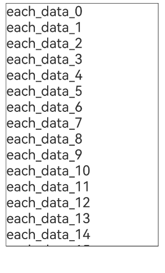 

**Multiple Types of Child Components**

**Repeat** supports rendering templates, enabling multiple types of child components to be rendered from a single data source. Each data item obtains the template type based on [.templateId()](../../reference/apis-arkui/arkui-ts/ts-rendering-control-repeat.md#templateid) and renders the child component in **.template()** corresponding to the type.

> **NOTE**
>
> - **.template()** needs to be used in [lazy loading mode](#lazy-loading-capability).
> - The **.each()** API is equivalent to **.template()** with an empty string as the template type.
> - When multiple templates share the same type (including empty string), **Repeat** only applies the most recent **.each()** or **.template()** definition.
> - If **.templateId()** is unspecified or returns a non-existent template type, **Repeat** defaults to the empty string template type.
> - Components of the same template type are eligible for reuse.

The following example demonstrates how to use **Repeat** with multiple rendering templates.

<!-- @[repeat_example_with_template](https://gitcode.com/openharmony/applications_app_samples/blob/master/code/DocsSample/ArkUISample/RenderingControl/entry/src/main/ets/pages/RenderingRepeat/RepeatExample2.ets) -->

``` TypeScript
// Use Repeat in a List container component.
@Entry
@ComponentV2 // The V2 decorator is recommended.
struct RepeatExampleWithTemplates {
  @Local dataArr: Array<string> = []; // Data source.

  aboutToAppear(): void {
    for (let i = 0; i < 50; i++) {
      this.dataArr.push(`data_${i}`); // Add data to the array.
    }
  }

  build() {
    Column() {
      List() {
        Repeat<string>(this.dataArr)
          .each((ri: RepeatItem<string>) => { // Default rendering template.
            ListItem() {
              Text('each_' + ri.item).fontSize(30).fontColor('rgb(161,10,33)') // The font color is red.
            }
          })
          .key((item: string, index: number): string => JSON.stringify(item)) // Key generator.
          .virtualScroll({ totalCount: this.dataArr.length }) // Enable lazy loading. totalCount indicates the data length to be loaded.
          .templateId((item: string, index: number): string => { // Search for the corresponding template child component for rendering based on the return value.
            return index <= 4 ? 'A' : (index <= 10 ? 'B' : ''); // The first five nodes use template A, the next five nodes use template B, and the others use the default template.
          })
          .template('A', (ri: RepeatItem<string>) => { // Template A.
            ListItem() {
              Text('A_' + ri.item).fontSize(30).fontColor('rgb(23,169,141)') // The font color is green.
            }
          }, { cachedCount: 3 }) // Cache capacity of template A: 3 instances.
          .template('B', (ri: RepeatItem<string>) => { // Template B.
            ListItem() {
              Text('B_' + ri.item).fontSize(30).fontColor('rgb(39,135,217)') // The font color is blue.
            }
          }, { cachedCount: 4 }) // Cache capacity of template B: 4 instances.
      }
      .cachedCount(2) // Size of the preload area.
      .height('70%')
      .border({ width: 1 }) // Border.
    }
  }
}
```

After execution, the UI is displayed as shown below.

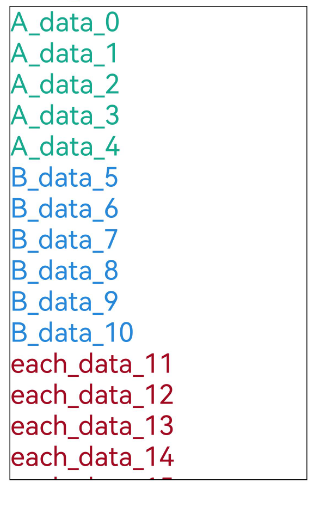

### Key Generation Rules

[.key()](../../reference/apis-arkui/arkui-ts/ts-rendering-control-repeat.md#key) of **Repeat** auto-generates a key for each child component. These keys enable **Repeat** to identify added and removed data items and track positional changes (index movements) within the array.

If **.key()** is not specified, **Repeat** auto-generates random keys. If a duplicate key is found, **Repeat** recursively generates a new key based on the existing one until no duplicate key exists.

> **NOTE**
>
> - Differences between a key and an index: A key is a unique data identifier, which can be used to determine whether a data item has changed, while an index simply indicates a data item's position in the array.
> - In [lazy loading mode](#lazy-loading-capability), **Repeat** also listens for data changes through the state management mechanism to implement efficient updates.

When using **.key()**, pay attention to the following:

- Even if the array changes, you must ensure that keys remain unique across all items in the array.
- The **.key()** function must return a consistent key for the same data item across all executions.
- While technically allowed, using **index** in **.key()** is discouraged. Indexes change when items are added, removed, or rearranged, causing keys to shift and forcing **Repeat** to re-create components, which degrades performance.
- (Recommended) Convert simple-type arrays into class object arrays with a **readonly id** property initialized using a unique value.

Key value generation example:

```ts
@ObservedV2
class ExampleData {
  @Trace str: string;
  num: number;

  constructor(s: string, n: number) {
    this.str = s;
    this.num = n;
  }
}

@Entry
@ComponentV2
struct Index {
  @Local exampleList: Array<ExampleData> = [];

  aboutToAppear(): void {
    for (let i = 0; i < 20; i++) {
      this.exampleList.push(new ExampleData(`data${i}`, i));
    }
  }

  build() {
    Column() {
      List({ space: 10 }) {
        Repeat(this.exampleList)
          .each((obj: RepeatItem<ExampleData>) => {
            ListItem() {
              Text(obj.item.str).fontSize(50)
            }
          })
          .key(item => item.str) // The UI is refreshed based on the str attribute. It is recommended to return a stable value in the key generation function. Note that key generation is independent of the item index.
      }
    }
  }
}
```

In the preceding sample code, the key value generation function is defined using **.key()**. Each child component's key is derived from the **str** attribute of the **item** object.

### Lazy Loading Capability

The **Repeat** component can load child nodes in lazy loading or full loading mode. You can set the [.virtualScroll()](../../reference/apis-arkui/arkui-ts/ts-rendering-control-repeat.md#virtualscroll) attribute to select a proper loading mode. For long lists, the lazy loading mode supports on-demand loading of child components. You are advised to use this mode preferentially.

**Lazy Loading Mode**

You can use the **.virtualScroll()** attribute of **Repeat** to enable lazy loading. In lazy loading mode, the **Repeat** component loads child components on demand based on the visible area and preload area of the current container component, as illustrated below.

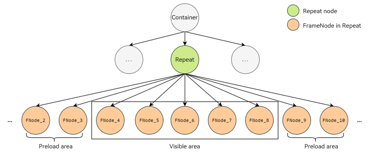

> **NOTE**
>
> - The lazy loading mode must be used together with the scrollable container component [List](../../reference/apis-arkui/arkui-ts/ts-container-list.md), [ListItemGroup](../../reference/apis-arkui/arkui-ts/ts-container-listitemgroup.md), [Grid](../../reference/apis-arkui/arkui-ts/ts-container-grid.md), [Swiper](../../reference/apis-arkui/arkui-ts/ts-container-swiper.md), or [WaterFlow](../../reference/apis-arkui/arkui-ts/ts-container-waterflow.md).
> - The lazy loading mode must be used together with the [state management V2](../state-management/arkts-state-management-overview.md#state-management-v2).
> - Page refresh is triggered when the key or data changes.

**Full Loading Mode**

For scenarios involving short lists or requiring immediate loading of all components, you can disable lazy loading in **Repeat** by omitting its **.virtualScroll()** property. In this case, **Repeat** renders all child components during initial page loading. For long lists (typically with more than 30 items), disabling lazy loading will cause **Repeat** to load all child components at once, which is time-consuming and not recommended.

> **NOTE**
>
> - The rendering template feature is unavailable when lazy loading is disabled.
> - With lazy loading disabled, **Repeat** can be used in any container component.
> - The full loading mode can be used together with the [state management V1](../state-management/arkts-state-management-overview.md#state-management-v1).
> - Page refreshes are dependent on key changes: If keys remain identical, the UI will not refresh even when underlying data changes.

### Node Update and Reuse Mechanism

**Repeat** supports node reuse. When a **Repeat** child component is removed from the component tree, it is stored in the cache pool. When a new child component is created, the nodes in the pool are reused first. The reuse process in lazy loading mode is different from that in full loading mode. The details will be described below.

By default, node reuse is enabled for **Repeat**. Since API version 18, you can configure the **reusable** field to enable node reuse in lazy loading mode. For better rendering performance, you are advised to keep node reuse enabled. For a code example, see [VirtualScrollOptions](../../reference/apis-arkui/arkui-ts/ts-rendering-control-repeat.md#virtualscrolloptions).

Since API version 18, **Repeat** supports [freezing custom components in the cache pool](../state-management/arkts-custom-components-freezeV2.md#repeat) in lazy loading mode.

> **NOTE**
> 
> **Repeat** handles child components through four operations: creation, update, reuse, and destruction. The difference between node update and node reuse is as follows:
> 
> - Node update: The node is not destroyed, and its properties are updated based on changes to state variables.
> - Node reuse: The old node is not destroyed but moved to the idle node cache pool. When a new node is needed, **Repeat** obtains a reusable node from the cache pool and updates its properties accordingly.
>
> When the **Repeat** node is reused, the [aboutToRecycle](../../../application-dev/reference/apis-arkui/arkui-ts/ts-custom-component-lifecycle.md#abouttorecycle10) and [aboutToReuse](../../../application-dev/reference/apis-arkui/arkui-ts/ts-custom-component-lifecycle.md#abouttoreuse10) lifecycle callbacks of the child component are not triggered.

**Node Update/Reuse in Lazy Loading Mode**

In lazy loading mode, when the scrollable container component is scrolled or the array changes, **Repeat** adds the invalid child component nodes (which are outside the visible area and preload area of the container component) to the idle node cache pool. That is, **Repeat** disconnects the component nodes from the page component tree but does not destroy the nodes. When new components are needed, nodes from the cache pool are reused.

The following uses the scrolling scenario and data update scenario after the initial rendering to describe the rendering logic of **Repeat** child components.

1. Initial rendering

   A 20-item array is defined, with the first 5 items using template type **aa** (rendering light blue components) and the remaining items using template type **bb** (rendering orange components). The cache pool capacity is set to 3 nodes for template **'aa'** and 4 nodes for template **'bb'**. The size of the preload area of the container component is 2. For demonstration purposes, one idle node is added to the **aa** cache pool, and two in the **bb** cache pool.

   The list node states during initial rendering are shown below (template type is abbreviated as **ttype** in the figure).

   

2. Scrolling scenario

   When you scroll down the list by the distance of one node, **Repeat** reuses nodes from the cache pool.

   (1) The node whose index is 10 enters the preload area, and its template type is calculated as **bb**. Because the **bb** cache pool is not empty, **Repeat** obtains an idle node from the **bb** cache pool for reuse and updates its node attributes (**item** and **index**). Other grandchild components of this child component that involve **item** and **index** are updated synchronously based on the rules of [state management V2](../state-management/arkts-state-management-overview.md#state-management-v2).<br>
   (2) The node whose index is 0 slides out of the preload area. When the UI main thread is idle, the system checks whether the **aa** cache pool is full. If it is not full, the system adds the node to the corresponding cache pool;<br>
   (3) Other nodes are still in the container visible area and preload area. Only the index is updated. If a cache pool reaches capacity during this process, excess nodes are destroyed during subsequent UI thread idle periods.

   

3. Data update scenario

   Perform the following array update operations based on the previous section: Delete the node whose index is 4 and change **07** to **new**.

   1. After deleting node whose index is 4, node **05** shifts forward. According to template calculation rules, the new node **05** now has template type **aa**. It directly reuses the old node 04, updates data item and index, and adds the old node **05** to the **bb** cache pool.<br>
   2. The subsequent nodes move leftwards, with the newly entering node **11** reusing an idle node in the **bb** cache pool, while other nodes only receive index updates.<br>
   3. When the node data changes from **07** to **new**, the page detects the data source update and triggers re-rendering. The re-rendering logic in **Repeat** checks whether the node data item at the current index has changed. If only the key value changes but the item remains the same, the UI is not refreshed.

   

**Node Update/Reuse in Full Loading Mode**

In full loading mode, all **Repeat** child components are created during the initial rendering of the page. When the data array changes, **Repeat** executes the following steps:

First, **Repeat** traverses old array keys. If it identifies keys absent in the new array, it adds them to the **deletedKeys** collection.

Second, **Repeat** traverses new array keys. For each key in the new array:

1. If a match can be found in the old array, the corresponding child component node is reused, with its index updated.
2. If no matches can be found in the old array and the **deletedKeys** collection is not empty, **Repeat** reuses the most recently deleted node according to the last in first out (LIFO) policy and updates its key and content.
3. If no matches can be found in the old array and the **deletedKeys** collection is empty, **Repeat** creates a new node for the key.

Third, after the new array keys are traversed, nodes corresponding to the remaining keys in the **deletedKeys** collection are destroyed.

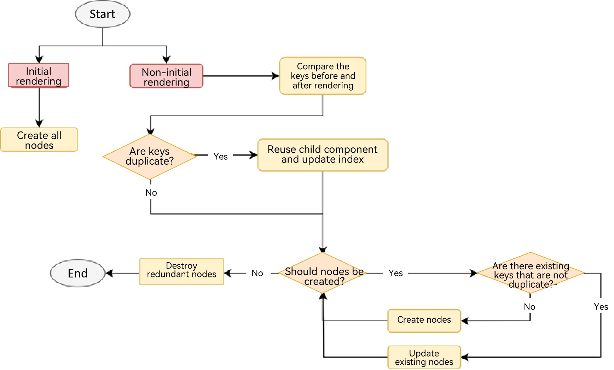

In the example of array changes shown below, item_*X* represents the key of a data item.

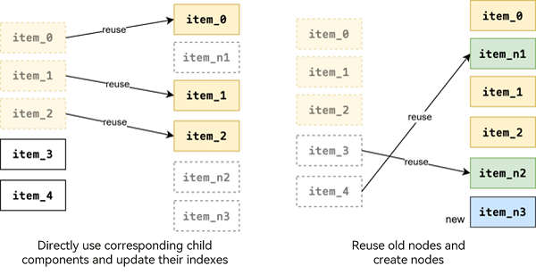

Based on the aforementioned update logic, **item_0** remains unchanged, **item_1** and **item_2** only have their indexes changed, **item_n1** and **item_n2** are obtained by updating **item_4** and **item_3**, respectively, and **item_n3** is newly created because no reusable nodes are available.

> **NOTE**
> 
> The differences between the **Repeat** full loading mode and the [ForEach](./arkts-rendering-control-foreach.md) component are as follows:
> - Performance optimization: **Repeat** implements specialized rendering enhancements for array update scenarios.
> - Architectural shift: Component content and index management responsibilities are elevated to the framework level.

**Example**

The following example demonstrates node update in full loading mode.

<!-- @[repeat_demo](https://gitcode.com/openharmony/applications_app_samples/blob/master/code/DocsSample/ArkUISample/RenderingControl/entry/src/main/ets/pages/RenderingRepeat/NodeUpdateMechanism.ets) -->

``` TypeScript
@Entry
@ComponentV2
struct NodeUpdateMechanism {
  @Local simpleList: Array<string> = ['one', 'two', 'three'];

  build() {
    Row() {
      Column() {
        Text('Click to change the value of the third array item')
          .fontSize(24)
          .fontColor(Color.Red)
          .onClick(() => {
            this.simpleList[2] = 'new three';
          })

        Repeat<string>(this.simpleList)
          .each((obj: RepeatItem<string>)=>{
            ChildItem({ item: obj.item })
              .margin({top: 20})
          })
          .key((item: string) => item)
      }
      .justifyContent(FlexAlign.Center)
      .width('100%')
      .height('100%')
    }
    .height('100%')
    .backgroundColor(0xF1F3F5)
  }
}

@ComponentV2
struct ChildItem {
  @Param @Require item: string;

  build() {
    Text(this.item)
      .fontSize(30)
  }
}
```

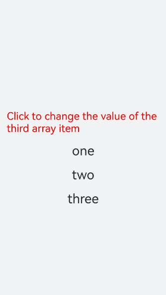

When the red text component is clicked, the third data item undergoes a content update while preserving its existing component node.

**Node Reuse Inspection**

You can verify node reuse using the DevEco Testing tool. After launching the tool, select the utility menu.

Choose **UIViewer** from the utility options. This tool captures device snapshots, component tree structures, and node attributes. In the component tree on the right, select the **Repeat** subnode. The node attributes displayed in the lower right corner include the node ID. You can determine whether a component has been reused or newly created by checking whether the node ID remains the same.

## Advanced Features

In addition to the capabilities such as iterative rendering, lazy loading, and component reuse, **Repeat** also provides advanced features such as precise lazy loading, drag-and-drop sorting, and content position preservation. Use these features as required.

### Precise Lazy Loading

When the total length of the data source is long or loading data items takes time, you can use the precise lazy loading feature of **Repeat** to avoid loading all data during initialization. The precise lazy loading feature for **Repeat** data is supported since API version 19.

You can set the **totalCount** property of **.virtualScroll()** or the custom **onTotalCount** method to calculate the total number of data items to be loaded, and set the **onLazyLoading** property to implement precise lazy loading of data. This way, the corresponding data is loaded when the node is rendered for the first time. For details, see [VirtualScrollOptions](../../reference/apis-arkui/arkui-ts/ts-rendering-control-repeat.md#virtualscrolloptions).

**Example 1**

This example demonstrates how to dynamically load data in the corresponding area during the initial rendering, screen scrolling, and display area navigation for scenarios where the total length of the data source is long.

<!-- @[repeat_lazy_loading_one](https://gitcode.com/openharmony/applications_app_samples/blob/master/code/DocsSample/ArkUISample/RenderingControl/entry/src/main/ets/pages/RenderingRepeat/RepeatLazyLoading1.ets) -->

``` TypeScript
@Entry
@ComponentV2
struct RepeatLazyLoadingLongData {
  // Assume that the total length of the data source is 1000. The initial array does not provide data.
  @Local arr: Array<string> = [];
  scroller: Scroller = new Scroller();
  build() {
    Column({ space: 5 }) {
      // The initial item displayed on the screen is at index 100. Data can be automatically obtained through lazy loading.
      List({ scroller: this.scroller, space: 5, initialIndex: 100 }) {
        Repeat(this.arr)
          .virtualScroll({
            // The expected total length of the data source is 1000.
            onTotalCount: () => { return 1000; },
            // Implement lazy loading.
            onLazyLoading: (index: number) => { this.arr[index] = index.toString(); }
          })
          .each((obj: RepeatItem<string>) => {
            ListItem() {
              Row({ space: 5 }) {
                Text(`${obj.index}: Item_${obj.item}`)
              }
            }
            .height(50)
          })
      }
      .height('80%')
      .border({ width: 1})
      // Navigate to the position at index 500. Data can be automatically obtained through lazy loading.
      Button('ScrollToIndex 500')
        .onClick(() => { this.scroller.scrollToIndex(500); })
    }
  }
}
```

The figure below shows the effect.

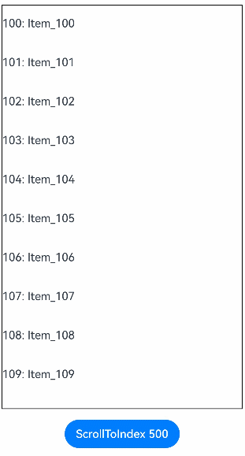

**Example 2**

This example deals with time-consuming data loading. In the **onLazyLoading** method, placeholders are created for data items, and then data is loaded through asynchronous tasks.

<!-- @[repeat_lazy_loading_two](https://gitcode.com/openharmony/applications_app_samples/blob/master/code/DocsSample/ArkUISample/RenderingControl/entry/src/main/ets/pages/RenderingRepeat/RepeatLazyLoading2.ets) -->

``` TypeScript
@Entry
@ComponentV2
struct RepeatLazyLoadingSync {
  @Local arr: Array<string> = [];
  build() {
    Column({ space: 5 }) {
      List({ space: 5 }) {
        Repeat(this.arr)
          .virtualScroll({
            onTotalCount: () => { return 100; },
            // Implement lazy loading.
            onLazyLoading: (index: number) => {
              // Create a placeholder.
              this.arr[index] = '';
              // Simulate a time-consuming loading process and load data through an asynchronous task.
              setTimeout(() => { this.arr[index] = index.toString(); }, 1000);
            }
          })
          .each((obj: RepeatItem<string>) => {
            ListItem() {
              Row({ space: 5 }) {
                Text(`${obj.index}: Item_${obj.item}`)
              }
            }
            .height(50)
          })
      }
      .height('100%')
      .border({ width: 1})
    }
  }
}
```

The figure below shows the effect.

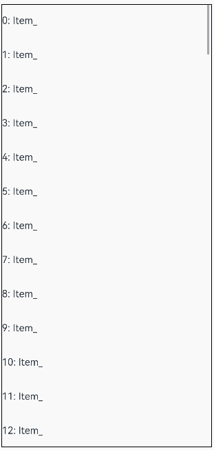

**Example 3**

This example shows how to implement infinite lazy loading of data by using lazy loading together with **onTotalCount: () => { return this.arr.length + 1; }**.

> **NOTE**
>
> - In this scenario, you need to provide the initial data required for the first screen display and set **cachedCount** to a value greater than 0 for the parent container component. Otherwise, rendering exceptions will occur.
> - Avoid using the **onLazyLoading** method together with the loop mode of **Swipe**. Otherwise, staying at **index = 0** will trigger continuous **onLazyLoading** calls.
> - Pay special attention to the memory usage to avoid excessive memory consumption caused by continuous data loading.

<!-- @[repeat_lazy_loading_three](https://gitcode.com/openharmony/applications_app_samples/blob/master/code/DocsSample/ArkUISample/RenderingControl/entry/src/main/ets/pages/RenderingRepeat/RepeatLazyLoading3.ets) -->

``` TypeScript
@Entry
@ComponentV2
struct RepeatLazyLoadingInfinite {
  @Local arr: Array<string> = [];
  // Provide the initial data required for the first screen display.
  aboutToAppear(): void {
    for (let i = 0; i < 15; i++) {
      this.arr.push(i.toString());
    }
  }
  build() {
    Column({ space: 5 }) {
      List({ space: 5 }) {
        Repeat(this.arr)
          .virtualScroll({
            // Enable infinite lazy loading of data.
            onTotalCount: () => { return this.arr.length + 1; },
            onLazyLoading: (index: number) => { this.arr[index] = index.toString(); }
          })
          .each((obj: RepeatItem<string>) => {
            ListItem() {
              Row({ space: 5 }) {
                Text(`${obj.index}: Item_${obj.item}`)
              }
            }
            .height(50)
          })
      }
      .height('100%')
      .border({ width: 1})
      // You are advised to set cachedCount to a value greater than 0.
      .cachedCount(1)
    }
  }
}
```

The figure below shows the effect.

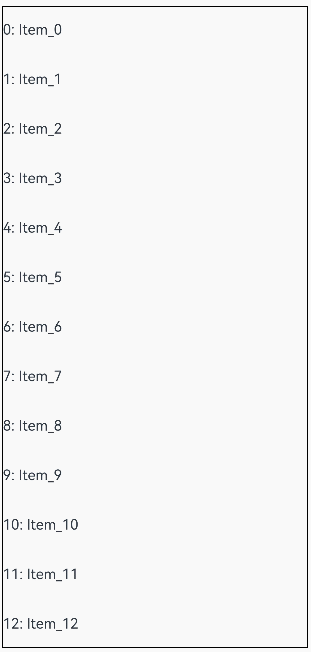

### Drag-and-Drop Sorting

When **Repeat** is used within the [List](../../reference/apis-arkui/arkui-ts/ts-container-list.md) component and the [onMove](../../reference/apis-arkui/arkui-ts/ts-universal-attributes-drag-sorting.md#onmove) event is set, **Repeat** generates a [ListItem](../../reference/apis-arkui/arkui-ts/ts-container-listitem.md) each time it iterates, enabling drag-and-drop sorting. The drag-and-drop sorting feature is supported since API version 19.

> **NOTE**
>
> - When the drag-and-drop gesture is released, if any item's position changes, the **onMove** event is triggered, which reports the original index and target index of the relocated item.<br>In the **onMove** event, the data source must be updated based on the reported start index and target index. Before and after the data source is modified, the key value of each item must remain unchanged to ensure that the drop animation can be executed properly.
> - Modify data source only after the drag-and-drop operation is completed.

**Example**

<!-- @[repeat_scroll_on_move](https://gitcode.com/openharmony/applications_app_samples/blob/master/code/DocsSample/ArkUISample/RenderingControl/entry/src/main/ets/pages/RenderingRepeat/RepeatVirtualScrollOnMove.ets) -->

``` TypeScript
@Entry
@ComponentV2
struct RepeatVirtualScrollOnMove {
  @Local simpleList: Array<string> = [];

  aboutToAppear(): void {
    for (let i = 0; i < 100; i++) {
      this.simpleList.push(`${i}`);
    }
  }

  build() {
    Column() {
      List() {
        Repeat<string>(this.simpleList)
        // Set onMove to enable drag-and-drop sorting.
          .onMove((from: number, to: number) => {
            let temp = this.simpleList.splice(from, 1);
            this.simpleList.splice(to, 0, temp[0]);
          })
          .each((obj: RepeatItem<string>) => {
            ListItem() {
              Text(obj.item)
                .fontSize(16)
                .textAlign(TextAlign.Center)
                .size({height: 100, width: '100%'})
            }.margin(10)
            .borderRadius(10)
            .backgroundColor('#FFFFFFFF')
          })
          .key((item: string, index: number) => {
            return item;
          })
          .virtualScroll({ totalCount: this.simpleList.length })
      }
      .border({ width: 1 })
      .backgroundColor('#FFDCDCDC')
      .width('100%')
      .height('100%')
    }
  }
}
```

The figure below shows the effect.

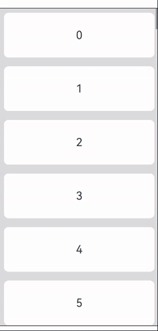

### Content Position Preservation

The content position preservation feature maintains visible component positions when data is inserted or deleted before the current visible area.

Since API version 20, when data is inserted or deleted before the list visible area, the position of the child component in the list visible area remains unchanged only when the parent container component is [List](../../reference/apis-arkui/arkui-ts/ts-container-list.md) and the [maintainVisibleContentPosition](../../reference/apis-arkui/arkui-ts/ts-container-list.md#maintainvisiblecontentposition12) attribute is set to **true**.

**Example**

<!-- @[repeat_pre_insert](https://gitcode.com/openharmony/applications_app_samples/blob/master/code/DocsSample/ArkUISample/RenderingControl/entry/src/main/ets/pages/RenderingRepeat/PreInsert.ets) -->

``` TypeScript
@Entry
@ComponentV2
struct PreInsertDemo {
  @Local simpleList: Array<string> = [];
  private cnt: number = 1;

  aboutToAppear(): void {
    for (let i = 0; i < 30; i++) {
      this.simpleList.push(`Hello ${this.cnt++}`);
    }
  }

  build() {
    Column() {
      Row() {
        Button(`insert #5`)
          .onClick(() => {
            this.simpleList.splice(5, 0, `Hello ${this.cnt++}`);
          })
        Button(`delete #0`)
          .onClick(() => {
            this.simpleList.splice(0, 1);
          })
      }

      List({ initialIndex: 5 }) {
        Repeat<string>(this.simpleList)
          .each((obj: RepeatItem<string>) => {
            ListItem() {
              Row() {
                Text(`index: ${obj.index}  `)
                  .fontSize(16)
                  .fontColor('#70707070')
                  .textAlign(TextAlign.End)
                  .size({ height: 100, width: '40%' })
                Text(`item: ${obj.item}`)
                  .fontSize(16)
                  .textAlign(TextAlign.Start)
                  .size({ height: 100, width: '60%' })
              }
            }.margin(10)
            .borderRadius(10)
            .backgroundColor('#FFFFFFFF')
          })
          .key((item: string, index: number) => item)
          .virtualScroll({ totalCount: this.simpleList.length })
      }
      .maintainVisibleContentPosition(true) // Enable content position preservation.
      .border({ width: 1 })
      .backgroundColor('#FFDCDCDC')
      .width('100%')
      .height('100%')
    }
  }
}
```

In the example, insertions or deletions above the viewport cause only index updates, while displayed items remain visually stable.

The figure below shows the effect.

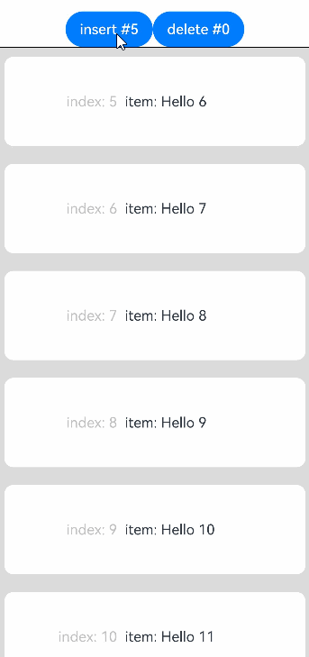

## Use Cases

### Data Display and Operations

The following sample code shows how to insert, modify, delete, and swap data items in an array using **Repeat**. Select an index from the drop-down list box and click the corresponding button to operate the data item. Click two data items in sequence to swap them.


<!-- @[repeat_scroll_two](https://gitcode.com/openharmony/applications_app_samples/blob/master/code/DocsSample/ArkUISample/RenderingControl/entry/src/main/ets/pages/RenderingRepeat/RepeatVirtualScroll2T.ets) -->

``` TypeScript
@ObservedV2
class Repeat006Clazz {
  @Trace public message: string = '';

  constructor(message: string) {
    this.message = message;
  }
}

@Entry
@ComponentV2
struct RepeatVirtualScroll {
  @Local simpleList: Array<Repeat006Clazz> = [];
  private exchange: number[] = [];
  private counter: number = 0;
  @Local selectOptions: SelectOption[] = [];
  @Local selectIdx: number = 0;

  @Monitor('simpleList')
  reloadSelectOptions(): void {
    this.selectOptions = [];
    for (let i = 0; i < this.simpleList.length; ++i) {
      this.selectOptions.push({ value: i.toString() });
    }
    if (this.selectIdx >= this.simpleList.length) {
      this.selectIdx = this.simpleList.length - 1;
    }
  }

  aboutToAppear(): void {
    for (let i = 0; i < 100; i++) {
      this.simpleList.push(new Repeat006Clazz(`item_${i}`));
    }
    this.reloadSelectOptions();
  }

  handleExchange(idx: number): void { // Click to swap child components.
    this.exchange.push(idx);
    if (this.exchange.length === 2) {
      let _a = this.exchange[0];
      let _b = this.exchange[1];
      let temp: Repeat006Clazz = this.simpleList[_a];
      this.simpleList[_a] = this.simpleList[_b];
      this.simpleList[_b] = temp;
      this.exchange = [];
    }
  }

  build() {
    Column({ space: 10 }) {
      Text('virtualScroll each()&template() 2t')
        .fontSize(15)
        .fontColor(Color.Gray)
      Text('Select an index and press the button to update data.')
        .fontSize(15)
        .fontColor(Color.Gray)

      Select(this.selectOptions)
        .selected(this.selectIdx)
        .value(this.selectIdx.toString())
        .key('selectIdx')
        .onSelect((index: number) => {
          this.selectIdx = index;
        })
      Row({ space: 5 }) {
        Button('Add No.' + this.selectIdx)
          .onClick(() => {
            this.simpleList.splice(this.selectIdx, 0, new Repeat006Clazz(`${this.counter++}_add_item`));
            this.reloadSelectOptions();
          })
        Button('Modify No.' + this.selectIdx)
          .onClick(() => {
            this.simpleList.splice(this.selectIdx, 1, new Repeat006Clazz(`${this.counter++}_modify_item`));
          })
        Button('Del No.' + this.selectIdx)
          .onClick(() => {
            this.simpleList.splice(this.selectIdx, 1);
            this.reloadSelectOptions();
          })
      }
      Button('Update array length to 5')
        .onClick(() => {
          this.simpleList = this.simpleList.slice(0, 5);
          this.reloadSelectOptions();
        })

      Text('Click on two items to exchange')
        .fontSize(15)
        .fontColor(Color.Gray)

      List({ space: 10 }) {
        Repeat<Repeat006Clazz>(this.simpleList)
          .each((obj: RepeatItem<Repeat006Clazz>) => {
            ListItem() {
              Text(`[each] index${obj.index}: ${obj.item.message}`)
                .fontSize(25)
                .onClick(() => {
                  this.handleExchange(obj.index);
                })
            }
          })
          .key((item: Repeat006Clazz, index: number) => {
            return item.message;
          })
          .virtualScroll({ totalCount: this.simpleList.length })
          .templateId((item: Repeat006Clazz, index: number) => {
            return (index % 2 === 0) ? 'odd' : 'even';
          })
          .template('odd', (ri) => {
            Text(`[odd] index${ri.index}: ${ri.item.message}`)
              .fontSize(25)
              .fontColor(Color.Blue)
              .onClick(() => {
                this.handleExchange(ri.index);
              })
          }, { cachedCount: 3 })
          .template('even', (ri) => {
            Text(`[even] index${ri.index}: ${ri.item.message}`)
              .fontSize(25)
              .fontColor(Color.Green)
              .onClick(() => {
                this.handleExchange(ri.index);
              })
          }, { cachedCount: 1 })
      }
      .cachedCount(2)
      .border({ width: 1 })
      .width('95%')
      .height('40%')
    }
    .justifyContent(FlexAlign.Center)
    .width('100%')
    .height('100%')
  }
}
```

This example demonstrates the implementation of 100 items using a custom class **RepeatClazz** with a string property **message**. The [cachedCount](../../reference/apis-arkui/arkui-ts/ts-container-list.md#cachedcount) attribute of the [List](../../reference/apis-arkui/arkui-ts/ts-container-list.md) component is set to **2**, and the sizes of the idle node cache pools for the **'odd'** and **'even'** templates are set to **3** and **1**, respectively. After execution, the UI is displayed as shown below.

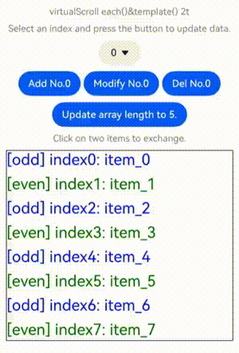

### Repeat Nesting

**Repeat** supports nesting. The sample code is as follows:

<!-- @[repeat_nest](https://gitcode.com/openharmony/applications_app_samples/blob/master/code/DocsSample/ArkUISample/RenderingControl/entry/src/main/ets/pages/RenderingRepeat/NestedRepeat.ets) -->

``` TypeScript
// Repeat can be nested in other components.
@Entry
@ComponentV2
struct NestedRepeat {
  @Local outerList: string[] = [];
  @Local innerList: number[] = [];

  aboutToAppear(): void {
    for (let i = 0; i < 20; i++) {
      this.outerList.push(i.toString());
      this.innerList.push(i);
    }
  }

  build() {
    Column({ space: 20 }) {
      Text('Nested Repeat with virtualScroll')
        .fontSize(15)
        .fontColor(Color.Gray)
      List() {
        Repeat<string>(this.outerList)
          .each((obj) => {
            ListItem() {
              Column() {
                Text('outerList item: ' + obj.item)
                  .fontSize(30)
                List() {
                  Repeat<number>(this.innerList)
                    .each((subObj) => {
                      ListItem() {
                        Text('innerList item: ' + subObj.item)
                          .fontSize(20)
                      }
                    })
                    .key((item) => 'innerList_' + item)
                    .virtualScroll()
                }
                .width('80%')
                .border({ width: 1 })
                .backgroundColor(Color.Orange)
              }
              .height('30%')
              .backgroundColor(Color.Pink)
            }
            .border({ width: 1 })
          })
          .key((item) => 'outerList_' + item)
          .virtualScroll()
      }
      .width('80%')
      .border({ width: 1 })
    }
    .justifyContent(FlexAlign.Center)
    .width('90%')
    .height('80%')
  }
}
```

The figure below shows the effect.

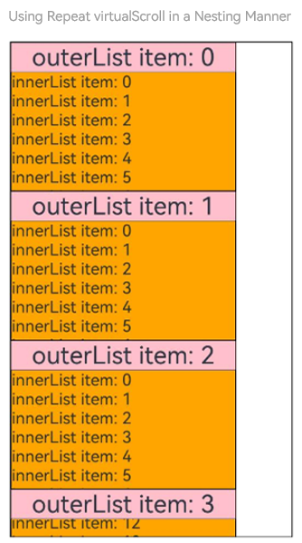

### Integration with Parent Container Components

This section provides examples of using **Repeat** within scrollable container components.

**Using with a List Component**

Use **Repeat** in the [List](../../reference/apis-arkui/arkui-ts/ts-container-list.md) container component. The sample code is as follows:

<!-- @[repeat_list](https://gitcode.com/openharmony/applications_app_samples/blob/master/code/DocsSample/ArkUISample/RenderingControl/entry/src/main/ets/pages/RenderingRepeat/DemoList.ets) -->

``` TypeScript
class DemoListItemInfo {
  public name: string;
  public icon: Resource;

  constructor(name: string, icon: Resource) {
    this.name = name;
    this.icon = icon;
  }
}

@Entry
@ComponentV2
struct DemoList {
  @Local videoList: Array<DemoListItemInfo> = [];

  aboutToAppear(): void {
    for (let i = 0; i < 10; i++) {
      // app.media.listItem0, app.media.listItem1, and app.media.listItem2 are only examples. Replace them with the actual ones in use.
      this.videoList.push(new DemoListItemInfo('Video' + i,
        i % 3 == 0 ? $r('app.media.listItem0') :
          i % 3 == 1 ? $r('app.media.listItem1') : $r('app.media.listItem2')));
    }
  }

  @Builder
  itemEnd(index: number) {
    Button('Delete')
      .backgroundColor(Color.Red)
      .onClick(() => {
        this.videoList.splice(index, 1);
      })
  }

  build() {
    Column({ space: 10 }) {
      Text('List Contains the Repeat Component')
        .fontSize(15)
        .fontColor(Color.Gray)

      List({ space: 5 }) {
        Repeat<DemoListItemInfo>(this.videoList)
          .each((obj: RepeatItem<DemoListItemInfo>) => {
            ListItem() {
              Column() {
                Image(obj.item.icon)
                  .width('80%')
                  .margin(10)
                Text(obj.item.name)
                  .fontSize(20)
              }
            }
            .swipeAction({
              end: {
                builder: () => {
                  this.itemEnd(obj.index);
                }
              }
            })
            .onAppear(() => {
            })
          })
          .key((item: DemoListItemInfo) => item.name)
          .virtualScroll()
      }
      .cachedCount(2)
      .height('90%')
      .border({ width: 1 })
      .listDirection(Axis.Vertical)
      .alignListItem(ListItemAlign.Center)
      .divider({
        strokeWidth: 1,
        startMargin: 60,
        endMargin: 60,
        color: '#ffe9f0f0'
      })

      Row({ space: 10 }) {
        Button('Delete No.1')
          .onClick(() => {
            this.videoList.splice(0, 1);
          })
        Button('Delete No.5')
          .onClick(() => {
            this.videoList.splice(4, 1);
          })
      }
    }
    .width('100%')
    .height('100%')
    .justifyContent(FlexAlign.Center)
  }
}
```

Swipe left and touch the **Delete** button, or touch the button at the bottom to delete the video widget.

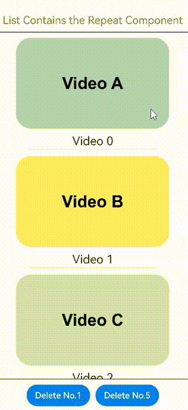

**Using with a Grid Component**

Use **Repeat** in the [Grid](../../reference/apis-arkui/arkui-ts/ts-container-grid.md) container component. The sample code is as follows:

<!-- @[repeat_grid](https://gitcode.com/openharmony/applications_app_samples/blob/master/code/DocsSample/ArkUISample/RenderingControl/entry/src/main/ets/pages/RenderingRepeat/DemoGrid.ets) -->

``` TypeScript
import { hilog } from '@kit.PerformanceAnalysisKit';
const TAG = '[Sample_RenderingControl]';
const DOMAIN = 0xF811;

class DemoGridItemInfo {
  public name: string;
  public icon: Resource;

  constructor(name: string, icon: Resource) {
    this.name = name;
    this.icon = icon;
  }
}

@Entry
@ComponentV2
struct DemoGrid {
  @Local itemList: Array<DemoGridItemInfo> = [];
  @Local isRefreshing: boolean = false;
  private layoutOptions: GridLayoutOptions = {
    regularSize: [1, 1],
    irregularIndexes: [10]
  };
  private gridScroller: Scroller = new Scroller();
  private num: number = 0;

  aboutToAppear(): void {
    for (let i = 0; i < 10; i++) {
      // app.media.gridItem0, app.media.gridItem1, and app.media.gridItem2 are only examples. Replace them with the actual ones in use.
      this.itemList.push(new DemoGridItemInfo('Video' + i,
        i % 3 == 0 ? $r('app.media.gridItem0') :
          i % 3 == 1 ? $r('app.media.gridItem1') : $r('app.media.gridItem2')));
    }
  }

  build() {
    Column({ space: 10 }) {
      Text('Grid Contains the Repeat Component')
        .fontSize(15)
        .fontColor(Color.Gray)

      Refresh({ refreshing: $$this.isRefreshing }) {
        Grid(this.gridScroller, this.layoutOptions) {
          Repeat<DemoGridItemInfo>(this.itemList)
            .each((obj: RepeatItem<DemoGridItemInfo>) => {
              if (obj.index === 10 ) {
                GridItem() {
                  Text('Last viewed here. Touch to refresh.')
                    .fontSize(20)
                }
                .height(30)
                .border({ width: 1 })
                .onClick(() => {
                  this.gridScroller.scrollToIndex(0);
                  this.isRefreshing = true;
                })
                .onAppear(() => {
                  hilog.info(DOMAIN, TAG, 'AceTag', obj.item.name);
                })
              } else {
                GridItem() {
                  Column() {
                    Image(obj.item.icon)
                      .width('100%')
                      .height(80)
                      .objectFit(ImageFit.Cover)
                      .borderRadius({ topLeft: 16, topRight: 16 })
                    Text(obj.item.name)
                      .fontSize(15)
                      .height(20)
                  }
                }
                .height(100)
                .borderRadius(16)
                .backgroundColor(Color.White)
                .onAppear(() => {
                  hilog.info(DOMAIN, TAG, 'AceTag', obj.item.name);
                })
              }
            })
            .key((item: DemoGridItemInfo) => item.name)
            .virtualScroll()
        }
        .columnsTemplate('repeat(auto-fit, 150)')
        .cachedCount(4)
        .rowsGap(15)
        .columnsGap(10)
        .height('100%')
        .padding(10)
        .backgroundColor('#F1F3F5')
      }
      .onRefreshing(() => {
        setTimeout(() => {
          this.itemList.splice(10, 1);
          this.itemList.unshift(new DemoGridItemInfo('refresh', $r('app.media.gridItem0'))); // app.media.gridItem0 is only an example. Replace it with the actual one.
          for (let i = 0; i < 10; i++) {
            // app.media.gridItem0, app.media.gridItem1, and app.media.gridItem2 are only examples. Replace them with the actual ones in use.
            this.itemList.unshift(new DemoGridItemInfo('New video' + this.num,
              i % 3 == 0 ? $r('app.media.gridItem0') :
                i % 3 == 1 ? $r('app.media.gridItem1') : $r('app.media.gridItem2')));
            this.num++;
          }
          this.isRefreshing = false;
        }, 1000);
      })
      .refreshOffset(64)
      .pullToRefresh(true)
      .width('100%')
      .height('85%')

      Button('Refresh')
        .onClick(() => {
          this.gridScroller.scrollToIndex(0);
          this.isRefreshing = true;
        })
    }
    .width('100%')
    .height('100%')
    .justifyContent(FlexAlign.Center)
  }
}
```

Swipe down on the screen, touch the **Refresh** button, or touch **Last viewed here. Touch to refresh.** to load new videos.

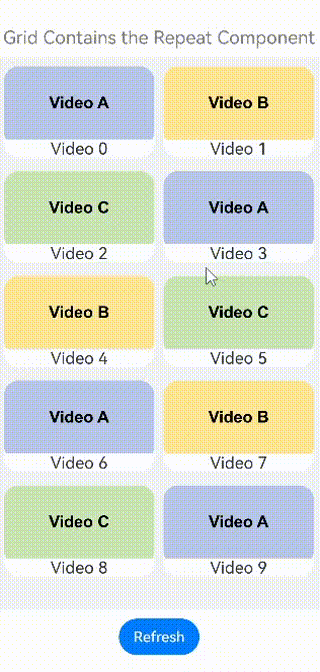

**Using with a Swiper Component**

Use **Repeat** in the [Swiper](../../reference/apis-arkui/arkui-ts/ts-container-swiper.md) container component. The sample code is as follows:

<!-- @[repeat_swiper](https://gitcode.com/openharmony/applications_app_samples/blob/master/code/DocsSample/ArkUISample/RenderingControl/entry/src/main/ets/pages/RenderingRepeat/DemoSwiper.ets) -->

``` TypeScript
const remotePictures: string[] = [
  'common/image/image1.png', // Insert the image address.
  'common/image/image2.png',
  'common/image/image3.png',
];

@ObservedV2
class DemoSwiperItemInfo {
  public id: string;
  @Trace public url: string = 'default';

  constructor(id: string) {
    this.id = id;
  }
}

@Entry
@ComponentV2
struct DemoSwiper {
  @Local pics: Array<DemoSwiperItemInfo> = [];

  aboutToAppear(): void {
    for (let i = 0; i < 3; i++) {
      this.pics.push(new DemoSwiperItemInfo('pic' + i));
    }
    setTimeout(() => {
      this.pics[0].url = remotePictures[0];
    }, 1000);
  }

  build() {
    Column() {
      Text('Swiper Contains the Repeat Component')
        .fontSize(15)
        .fontColor(Color.Gray)

      Stack() {
        Text('Loading...')
          .fontSize(15)
          .fontColor(Color.Gray)
        Swiper() {
          Repeat(this.pics)
            .each((obj: RepeatItem<DemoSwiperItemInfo>) => {
              Image(obj.item.url)
                .onAppear(() => {
                })
            })
            .key((item: DemoSwiperItemInfo) => item.id)
            .virtualScroll()
        }
        .cachedCount(9)
        .height('50%')
        .loop(false)
        .indicator(true)
        .onChange((index) => {
          setTimeout(() => {
            this.pics[index].url = remotePictures[index];
          }, 1000);
        })
      }
      .width('100%')
      .height('100%')
      .backgroundColor(Color.Black)
    }
  }
}
```

Here network latency is simulated with a 1-second delay for image loading.


## Implementation Notes

### Maintaining the Scroll Position When Off-Screen Data Changes

In the following example, changes to off-screen data affect the scroll position of the [List](../../reference/apis-arkui/arkui-ts/ts-container-list.md) component.

When a **Repeat** component is declared within a **List** component (as shown in the code below), clicking the insert button adds an element before the first visible item, causing the list to scroll downward unexpectedly.

<!-- @[repeat_single](https://gitcode.com/openharmony/applications_app_samples/blob/master/code/DocsSample/ArkUISample/RenderingControl/entry/src/main/ets/pages/RenderingRepeat/RepeatTemplateSingle.ets) -->

``` TypeScript
// Define a class and mark it as observable.
// Define a custom array in the class and mark it as traceable.
@ObservedV2
class ArrayHolder {
  @Trace public arr: Array<number> = [];

  // Constructor used to initialize the array length.
  constructor(count: number) {
    for (let i = 0; i < count; i++) {
      this.arr.push(i);
    }
  }
}

@Entry
@ComponentV2
struct RepeatTemplateSingle {
  @Local arrayHolder: ArrayHolder = new ArrayHolder(100);
  @Local totalCount: number = this.arrayHolder.arr.length;
  scroller: Scroller = new Scroller();

  build() {
    Column({ space: 5 }) {
      List({ space: 20, initialIndex: 19, scroller: this.scroller }) {
        Repeat(this.arrayHolder.arr)
          .virtualScroll({ totalCount: this.totalCount })
          .templateId((item, index) => {
            return 'number';
          })
          .template('number', (r) => {
            ListItem() {
              Text(r.index! + ':' + r.item + 'Reuse');
            }
          })
          .each((r) => {
            ListItem() {
              Text(r.index! + ':' + r.item + 'eachMessage');
            }
          })
      }
      .height('30%')

      Button(`insert totalCount ${this.totalCount}`)
        .height(60)
        .onClick(() => {
          // Insert an element before the first visible element on screen.
          this.arrayHolder.arr.splice(18, 0, this.totalCount);
          this.totalCount = this.arrayHolder.arr.length;
        })
    }
    .width('100%')
    .margin({ top: 5 })
  }
}
```

The figure below shows the effect.

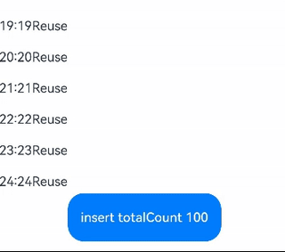

**Implementation After Correction**

To maintain the scroll position during off-screen data changes, use the [onScrollIndex](../../reference/apis-arkui/arkui-ts/ts-container-list.md#onscrollindex) callback of the [List](../../reference/apis-arkui/arkui-ts/ts-container-list.md) component to listen for scrolling and obtain the scroll position when the list scrolls. Then, use the [scrollToIndex](../../reference/apis-arkui/arkui-ts/ts-container-scroll.md#scrolltoindex) API of **Scroller** to lock the scroll position when off-screen data is added or removed.

The following example demonstrates handling of data additions:

> **NOTE**
> 
> **Repeat** supports the [content position preservation](#content-position-preservation) feature since API version 20. This feature can be implemented by configuring the attributes of the **List** component.

<!-- @[repeat_single_one](https://gitcode.com/openharmony/applications_app_samples/blob/master/code/DocsSample/ArkUISample/RenderingControl/entry/src/main/ets/pages/RenderingRepeat/RepeatTemplateSingle1.ets) -->

``` TypeScript
// Define a class and mark it as observable.
// Define a custom array in the class and mark it as traceable.
@ObservedV2
class ArrayHolderLocal {
  @Trace public arr: Array<number> = [];

  // Constructor used to initialize the array length.
  constructor(count: number) {
    for (let i = 0; i < count; i++) {
      this.arr.push(i);
    }
  }
}
@Entry
@ComponentV2
struct RepeatSingle {
  @Local arrayHolder: ArrayHolderLocal = new ArrayHolderLocal(100);
  @Local totalCount: number = this.arrayHolder.arr.length;
  scroller: Scroller = new Scroller();

  private start: number = 1;
  private end: number = 1;

  build() {
    Column({ space: 5 }) {
      List({ space: 20, initialIndex: 19, scroller: this.scroller }) {
        Repeat(this.arrayHolder.arr)
          .virtualScroll({ totalCount: this.totalCount })
          .templateId((item, index) => {
            return 'number';
          })
          .template('number', (r) => {
            ListItem() {
              Text(r.index! + ':' + r.item + 'Reuse')
            }
          })
          .each((r) => {
            ListItem() {
              Text(r.index! + ':' + r.item + 'eachMessage')
            }
          })
      }
      .onScrollIndex((start, end) => {
        this.start = start;
        this.end = end;
      })
      .height('30%')

      Button(`insert totalCount ${this.totalCount}`)
        .height(60)
        .onClick(() => {
          // Insert an element before the first visible element on screen.
          this.arrayHolder.arr.splice(18, 0, this.totalCount);
          let rect = this.scroller.getItemRect(this.start); // Obtain the size and position of the child component.
          this.scroller.scrollToIndex(this.start + 1); // Scroll to the specified index.
          this.scroller.scrollBy(0, -rect.y); // Scroll by a specified distance.
          this.totalCount = this.arrayHolder.arr.length;
        })
    }
    .width('100%')
    .margin({ top: 5 })
  }
}
```

The figure below shows the effect.

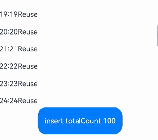

### Handling Cases Where the totalCount Value Exceeds the Data Source Length

For large datasets, lazy loading is typically used to render only a portion of the data initially. For **Repeat** to display the correct scrollbar style, **totalCount** must be set to the expected total data length, which means the **totalCount** value may be greater than the **array.length** value before all data is loaded.

If the **totalCount** value is greater than the **array.length** value, the application should request subsequent data when the list is about to reach the end of the currently loaded items. Implement safeguards for data request errors (for example, network latency) to prevent UI display anomalies.

This can be implemented using the [onScrollIndex](../../reference/apis-arkui/arkui-ts/ts-container-list.md#onscrollindex) callback of the parent component ([List](../../reference/apis-arkui/arkui-ts/ts-container-list.md) or [Grid](../../reference/apis-arkui/arkui-ts/ts-container-grid.md)). The sample code is as follows:

> **NOTE**
> 
> **Repeat** supports [precise lazy loading](#precise-lazy-loading) since API version 19. You can configure the **onLazyLoading** callback to dynamically load data in the corresponding area.

<!-- @[repeat_comp](https://gitcode.com/openharmony/applications_app_samples/blob/master/code/DocsSample/ArkUISample/RenderingControl/entry/src/main/ets/pages/RenderingRepeat/EntryCompSucc.ets) -->

``` TypeScript
@ObservedV2
class VehicleData {
  @Trace public name: string;
  @Trace public price: number;

  constructor(name: string, price: number) {
    this.name = name;
    this.price = price;
  }
}

@ObservedV2
class VehicleDB {
  public vehicleItems: VehicleData[] = [];

  constructor() {
    // The initial size of the array is 20.
    for (let i = 1; i <= 20; i++) {
      this.vehicleItems.push(new VehicleData(`Vehicle${i}`, i));
    }
  }
}

@Entry
@ComponentV2
struct EntryCompSucc {
  @Local vehicleItems: VehicleData[] = new VehicleDB().vehicleItems;
  @Local listChildrenSize: ChildrenMainSize = new ChildrenMainSize(60);
  @Local totalCount: number = this.vehicleItems.length;
  scroller: Scroller = new Scroller();

  build() {
    Column({ space: 3 }) {
      List({ scroller: this.scroller }) {
        Repeat(this.vehicleItems)
          .virtualScroll({ totalCount: 50 }) // The expected array length is 50.
          .templateId(() => 'default')
          .template('default', (ri) => {
            ListItem() {
              Column() {
                Text(`${ri.item.name} + ${ri.index}`)
                  .width('90%')
                  .height(this.listChildrenSize.childDefaultSize)
                  .backgroundColor(0xFFA07A)
                  .textAlign(TextAlign.Center)
                  .fontSize(20)
                  .fontWeight(FontWeight.Bold)
              }
            }.border({ width: 1 })
          }, { cachedCount: 5 })
          .each((ri) => {
            ListItem() {
              Text('Wrong: ' + `${ri.item.name} + ${ri.index}`)
                .width('90%')
                .height(this.listChildrenSize.childDefaultSize)
                .backgroundColor(0xFFA07A)
                .textAlign(TextAlign.Center)
                .fontSize(20)
                .fontWeight(FontWeight.Bold)
            }.border({ width: 1 })
          })
          .key((item, index) => `${index}:${item}`)
      }
      .height('50%')
      .margin({ top: 20 })
      .childrenMainSize(this.listChildrenSize)
      .alignListItem(ListItemAlign.Center)
      .onScrollIndex((start, end) => {
        // Lazy loading
        if (this.vehicleItems.length < 50) {
          for (let i = 0; i < 10; i++) {
            if (this.vehicleItems.length < 50) {
              this.vehicleItems.push(new VehicleData('Vehicle_loaded', i));
            }
          }
        }
      })
    }
  }
}
```

The figure below shows the effect.

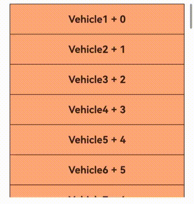

### Using Repeat with @Builder

When **Repeat** is used together with [@Builder](../state-management/arkts-builder.md), if only **RepeatItem.item** or **RepeatItem.index** is passed, the parameter value change does not trigger UI update within the @Builder function. To ensure the component responds to data changes, it is advised to [pass parameters by reference](../state-management/arkts-builder.md#by-reference-parameter-passing). Specifically, pass the entire **RepeatItem** object so that the component can observe changes to its internal state. Since API version 20, you can also use the [UIUtils.makeBinding()](../../reference/apis-arkui/js-apis-stateManagement.md#makebinding20) function, along with the [Binding](../../reference/apis-arkui/js-apis-stateManagement.md#bindingt20) and [MutableBinding](../../reference/apis-arkui/js-apis-stateManagement.md#mutablebindingt20) classes, to update state variables within the @Builder function.

The sample code is as follows:

``` ts
import { UIUtils, Binding } from '@kit.ArkUI';

@Entry
@ComponentV2
struct RepeatBuilderPage {
  @Local simpleList: Array<number> = [];

  aboutToAppear(): void {
    for (let i = 0; i < 100; i++) {
      this.simpleList.push(i);
    }
  }

  @Builder
  buildItem1(bindingData: Binding<number>) { // Use Binding or MutableBinding to receive input and access the value via the value property.
    Text('[Binding] item: ' + bindingData.value)
      .fontSize(20)
  }

  @Builder
  buildItem2(ri: RepeatItem<number>) {
    Text('[RepeatItem] item: ' + ri.item)
      .fontSize(20)
  }

  @Builder
  buildItem3(data: number) {
    Text('[number] item: ' + data)
      .fontSize(20).fontColor(Color.Red)
  }

  build() {
    Column({ space: 10 }) {
      List({ space: 20 }) {
        Repeat<number>(this.simpleList)
          .each((ri) => {
            ListItem() {
              Column({ space: 2 }) {
                this.buildItem1(UIUtils.makeBinding<number>(() => ri.item)) // Use the UIUtils.makeBinding() function to update state variables within the @Builder function.
                this.buildItem2(ri) // Reference passing: triggers UI refresh on data change.
                this.buildItem3(ri.item) // Value passing: does not trigger UI refresh.
              }
            }.border({ width: 1 })
          }).virtualScroll()
      }
      .cachedCount(1).border({ width: 1 })
      .width('70%').height('60%').alignListItem(ListItemAlign.Center)

      Button('click to change data.').onClick(() => {
        this.simpleList[0] = 10000; // Update the first item to 10000.
      })
    }
    .width('100%').height('100%')
    .justifyContent(FlexAlign.Center)
  }
}
```

<!-- [repeat_builder](https://gitcode.com/openharmony/applications_app_samples/blob/master/code/DocsSample/ArkUISample/RenderingControl/entry/src/main/ets/pages/RenderingRepeat/RepeatBuilderPage.ets) -->

In this example, parameters passed to @Builder include the following: **makeBinding()**, reference passing, and value passing. The figure below illustrates the UI behavior. When the button is clicked to update the data, components using value passing will not reflect the change in the UI.

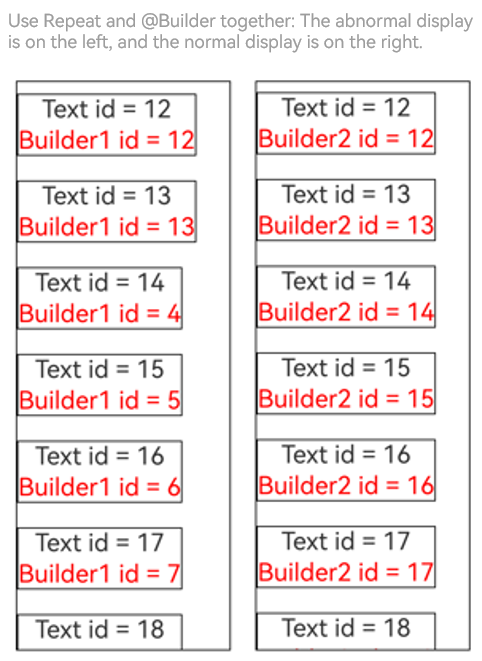

### expandSafeArea Not Working in Earlier Versions

In versions earlier than API version 18, if a **Repeat** child component has the **expandSafeArea** attribute declared, the child component cannot expand to full screen. Since API version 18, child components with the declared **expandSafeArea** attribute can expand to full screen.
